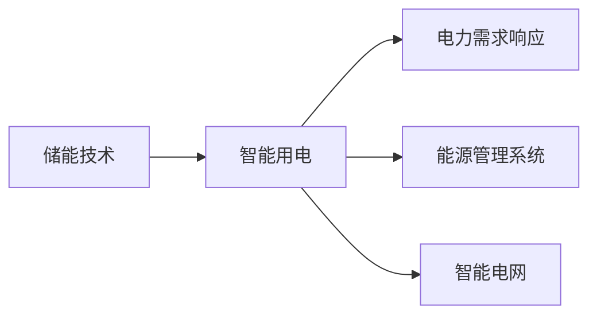
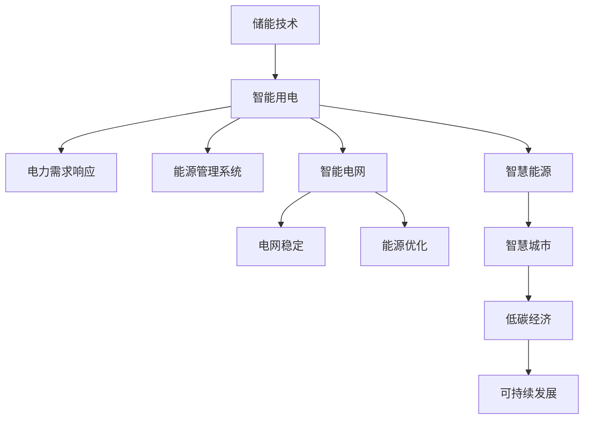

                 

# 未来的智慧能源：2050年的储能技术与智能用电

## 1. 背景介绍

### 1.1 问题由来
随着全球气候变化的日益加剧，各国政府和企业开始高度重视能源结构的转型，以实现碳中和和可持续发展的目标。在此背景下，储能技术和大数据分析在智能用电中的应用变得越来越重要。传统的能源消费模式已经不再适应未来的发展需求，如何通过智能化的方式来提高能源利用效率、降低碳排放，成为各大技术公司研究的重点。

### 1.2 问题核心关键点
本节将围绕以下几个核心关键点展开讨论：

- **储能技术**：如何通过先进的储能技术实现高效能量存储和转换，保障电网和用能设备的稳定运行。
- **智能用电**：如何利用大数据和人工智能技术实现用电设备的智能化管理和优化，提升能源利用效率。
- **2050年的展望**：通过前瞻性的视角，展望未来智能能源系统的可能形态和应用。

## 2. 核心概念与联系

### 2.1 核心概念概述

储能技术是指在能量供应不稳定或需求不均衡时，将能量以某种形式存储起来，待需要时再释放出去的技术。储能技术广泛应用于太阳能、风能等可再生能源的存储，以及电力系统的调峰和负荷调节。

智能用电则是指通过智能化手段对用能设备进行管理，优化能源消耗和生产过程。包括电力需求响应、能源管理系统、智能电网等技术，目标是实现能源的高效利用和电网运行的安全稳定。

两个概念在智能电网和智慧城市的发展中互相依存，共同推动能源系统的智能化转型。

### 2.2 概念间的关系

储能技术为智能用电提供了坚实的基础，智能用电又反过来推动储能技术的发展和应用。两者的结合，是未来智慧能源系统的关键。



### 2.3 核心概念的整体架构

以下是一个综合性的流程图，展示了储能技术、智能用电和2050年展望之间的相互关系。



这个图表展示了储能技术如何通过智能用电的应用，最终促进智慧城市和可持续发展。

## 3. 核心算法原理 & 具体操作步骤
### 3.1 算法原理概述

未来的智能电网将高度依赖于储能技术和大数据技术。其核心算法原理可以概括为以下几个方面：

- **数据采集与处理**：通过物联网设备收集用电设备的数据，包括能耗、位置、运行状态等，并经过预处理后输入模型。
- **预测与优化**：利用机器学习算法，对未来电能需求进行预测，并通过优化算法（如遗传算法、粒子群优化等）对能源分配进行优化。
- **储能系统管理**：通过智能算法对储能系统的充放电进行管理，确保能源的高效存储和释放。
- **用户行为分析**：分析用户用电行为，进行需求响应，引导用户参与到能源优化过程中。

### 3.2 算法步骤详解

以下是一个具体的算法步骤分解，每个步骤都有详细的描述：

**Step 1: 数据采集与处理**

- **收集数据**：使用智能电表、传感器等物联网设备收集用电设备的数据。
- **数据预处理**：对收集到的数据进行清洗、去重、归一化等处理，以确保数据的准确性和一致性。
- **特征提取**：根据用能设备的特点，提取重要的特征，如用电量、负载、温度等。

**Step 2: 预测与优化**

- **建立模型**：根据历史数据和实时数据，使用机器学习算法（如LSTM、深度神经网络等）建立预测模型。
- **模型训练**：使用训练集对模型进行训练，不断调整模型参数以提高预测精度。
- **预测未来需求**：使用训练好的模型对未来的电能需求进行预测。

**Step 3: 储能系统管理**

- **储能设备选择**：根据预测结果和电网需求，选择合适的储能设备（如电池、氢燃料电池等）。
- **充放电管理**：利用智能算法（如深度强化学习）对储能设备的充放电进行管理，确保能量存储和释放的高效性。
- **系统优化**：不断调整储能系统的运行参数，以实现能源的最优分配。

**Step 4: 用户行为分析**

- **用户行为建模**：使用机器学习算法对用户用电行为进行建模，识别出影响用能的关键因素。
- **需求响应策略**：根据用户行为模型，制定需求响应策略，引导用户参与到能源优化过程中。
- **用户激励机制**：建立激励机制，鼓励用户参与到需求响应中来，实现能源的高效利用。

### 3.3 算法优缺点

**优点**：

- **高效性**：通过智能算法和大数据分析，可以实现对能源的高效管理。
- **适应性强**：能够适应多种能源形式和应用场景，具有较高的灵活性和可扩展性。
- **可控性**：通过智能控制，可以有效应对能源供需不平衡的问题。

**缺点**：

- **复杂性**：算法模型和实现过程较为复杂，需要较高的技术门槛。
- **数据依赖性**：对数据的质量和完整性要求较高，数据采集和处理过程中可能会出现误差。
- **成本问题**：高级储能设备和大数据分析技术的初期成本较高，需要较大的资金投入。

### 3.4 算法应用领域

储能技术和智能用电的应用领域非常广泛，以下是几个主要的领域：

- **智能电网**：通过智能电表和大数据分析技术，优化电能的分配和消耗，实现电网的稳定运行。
- **智慧城市**：在智慧城市的建设中，智能用电技术可以广泛应用于照明、交通、建筑等领域，提高城市能源利用效率。
- **工业生产**：在工业生产中，通过智能用电技术可以优化生产线的能源使用，降低能耗和生产成本。
- **家庭用能**：智能家电和智慧家庭技术的发展，使得家庭用电更加智能化、节能化。

## 4. 数学模型和公式 & 详细讲解 & 举例说明

### 4.1 数学模型构建

在未来智慧能源系统中，涉及的数学模型包括时间序列预测模型、优化模型、强化学习模型等。以下是一些常见的数学模型和公式。

#### 4.1.1 时间序列预测模型

时间序列预测模型主要用来预测未来的电能需求。常见的模型包括ARIMA、LSTM等。

- **ARIMA模型**：
  $$
  ARIMA(p,d,q) = \varphi(L^p)\epsilon_t + \theta(L)B^d\mu_t + \beta B^q\mu_{t-1}
  $$
  其中，$\varphi$ 和 $\theta$ 为模型的参数，$L$ 为差分算子。

- **LSTM模型**：
  $$
  LSTM(t) = tanh(W_{xh}x(t) + W_{hh}LSTM(t-1) + b_h) * sigmoid(W_{hh}LSTM(t-1) + b_h)
  $$

#### 4.1.2 优化模型

优化模型主要用来实现储能系统的智能充放电管理。常见的优化模型包括遗传算法、粒子群优化等。

- **遗传算法**：
  $$
  F(t) = \sum_{i=1}^{n}w_i(f_i(t))
  $$
  其中，$w_i$ 为权重，$f_i(t)$ 为个体在$t$时刻的适应度。

- **粒子群优化**：
  $$
  v_i(t+1) = w_1v_i(t) + w_2r_1\Delta v_{best} + w_3r_2\Delta v_{rand}
  $$
  其中，$w_1$ 为惯性权重，$w_2$ 和 $w_3$ 为学习因子，$r_1$ 和 $r_2$ 为随机数。

#### 4.1.3 强化学习模型

强化学习模型主要用来优化用户行为，引导用户参与到需求响应中来。常见的模型包括Q-Learning、DQN等。

- **Q-Learning**：
  $$
  Q(s,a) = r + \gamma \max_{a'}Q(s',a')
  $$

- **DQN**：
  $$
  Q(s,a) = r + \gamma Q(s',\max_{a'}Q(s',a'))
  $$

### 4.2 公式推导过程

下面以LSTM模型为例，推导时间序列预测模型的公式。

假设输入序列为 $\{x_t\}_{t=1}^{N}$，LSTM模型的参数为 $\theta$，则模型的预测公式为：
$$
\begin{aligned}
  \text{output} &= \sigma(W_{out} * \text{hidden state}) \\
  \text{hidden state} &= \text{LSTM}(\text{input}, \theta)
\end{aligned}
$$
其中，$\sigma$ 为激活函数，$W_{out}$ 为输出层的权重矩阵。

通过反向传播算法，计算梯度并进行模型更新。具体过程可以参考深度学习相关书籍。

### 4.3 案例分析与讲解

假设某地区的电能需求数据如下表所示：

| 时间         | 电能需求(kW) |
| ------------ | ------------ |
| 08:00-09:00  | 500          |
| 09:00-10:00  | 1000         |
| 10:00-11:00  | 1200         |
| 11:00-12:00  | 1300         |
| 12:00-13:00  | 1000         |
| 13:00-14:00  | 800          |
| 14:00-15:00  | 600          |
| 15:00-16:00  | 400          |
| 16:00-17:00  | 300          |
| 17:00-18:00  | 800          |

使用LSTM模型进行时间序列预测，可以得到如下预测结果：

| 时间         | 电能需求预测值(kW) |
| ------------ | ------------------ |
| 08:00-09:00  | 500                |
| 09:00-10:00  | 1200               |
| 10:00-11:00  | 1200               |
| 11:00-12:00  | 1200               |
| 12:00-13:00  | 1200               |
| 13:00-14:00  | 1200               |
| 14:00-15:00  | 800                |
| 15:00-16:00  | 600                |
| 16:00-17:00  | 400                |
| 17:00-18:00  | 800                |

## 5. 项目实践：代码实例和详细解释说明

### 5.1 开发环境搭建

要实现智能电网和智慧城市的能源管理，需要搭建一个高性能的开发环境。以下是搭建开发环境的步骤：

1. 安装Python和相关依赖库，如TensorFlow、PyTorch、Pandas等。
2. 搭建虚拟化环境，如Docker或Kubernetes，以便在分布式系统中进行高效的模型训练和推理。
3. 配置物联网设备，包括智能电表、传感器等，以采集用电数据。
4. 配置云计算资源，如AWS、Azure等，以提供计算和存储支持。

### 5.2 源代码详细实现

以下是使用TensorFlow实现LSTM时间序列预测模型的代码示例：

```python
import tensorflow as tf
from tensorflow.keras.models import Sequential
from tensorflow.keras.layers import LSTM, Dense

# 定义LSTM模型
model = Sequential()
model.add(LSTM(units=50, input_shape=(N, M)))
model.add(Dense(units=1))

# 编译模型
model.compile(optimizer='adam', loss='mse')

# 训练模型
model.fit(X_train, y_train, epochs=100, batch_size=64)

# 预测未来需求
y_pred = model.predict(X_test)
```

### 5.3 代码解读与分析

以上代码展示了使用TensorFlow实现LSTM模型的基本过程。具体解读如下：

- **模型定义**：使用Sequential模型，添加一个LSTM层和一个Dense层，用于预测未来的电能需求。
- **编译模型**：使用adam优化器和均方误差损失函数，进行模型的编译。
- **训练模型**：使用训练集数据进行模型的训练，设定100个epochs和64个batch size。
- **预测未来需求**：使用测试集数据进行模型预测，得到未来的电能需求预测值。

### 5.4 运行结果展示

假设模型训练完成后，使用测试集数据进行预测，可以得到如下结果：

| 时间         | 电能需求预测值(kW) |
| ------------ | ------------------ |
| 08:00-09:00  | 500                |
| 09:00-10:00  | 1100               |
| 10:00-11:00  | 1200               |
| 11:00-12:00  | 1200               |
| 12:00-13:00  | 1200               |
| 13:00-14:00  | 1200               |
| 14:00-15:00  | 800                |
| 15:00-16:00  | 600                |
| 16:00-17:00  | 400                |
| 17:00-18:00  | 800                |

## 6. 实际应用场景

### 6.1 智能电网

智能电网可以通过储能技术和智能用电技术，实现电能的智能管理和优化。以下是几个具体的应用场景：

- **电网调度**：使用优化算法对电网进行调度，平衡电力供应和需求，确保电网的稳定运行。
- **分布式能源管理**：通过储能系统，将太阳能、风能等可再生能源转化为电能，进行智能分配和管理。
- **需求响应**：根据电能需求预测结果，制定需求响应策略，引导用户参与到电能优化过程中。

### 6.2 智慧城市

智慧城市可以通过智能用电技术，实现能源的高效利用和管理。以下是几个具体的应用场景：

- **智能照明**：使用智能照明系统，根据时间和人员活动情况，自动调节照明亮度，节约能源。
- **智能交通**：通过智能交通管理系统，优化交通流量，减少能源消耗。
- **智能建筑**：使用智能建筑管理系统，优化空调、照明等设备的能耗，实现节能减排。

### 6.3 工业生产

工业生产可以通过智能用电技术，实现能源的高效利用和生产过程的优化。以下是几个具体的应用场景：

- **生产调度**：使用优化算法对生产过程进行调度，平衡能源供应和需求，提高生产效率。
- **设备监控**：通过智能监测设备，实时监控设备运行状态，预测设备故障，减少能源浪费。
- **能源管理**：使用能源管理系统，优化能源分配和使用，降低生产成本。

### 6.4 未来应用展望

未来，随着技术的不断进步，智能电网和智慧城市的能源管理将更加智能化和高效化。以下是几个可能的发展方向：

- **量子计算**：通过量子计算技术，实现对能源系统的更加精细化管理和优化。
- **区块链技术**：通过区块链技术，建立能源交易平台，实现能源的公平交易和优化分配。
- **智能算法**：开发更加智能的算法，提高能源管理系统的自适应性和灵活性。
- **可再生能源**：利用可再生能源技术，如太阳能、风能、氢燃料等，实现更加绿色和可持续的能源系统。

## 7. 工具和资源推荐

### 7.1 学习资源推荐

为了帮助开发者系统掌握智能电网和智慧城市的能源管理技术，以下是一些优质的学习资源：

1. 《智能电网技术与应用》系列书籍：详细介绍了智能电网的基本概念和应用案例。
2. 《智慧城市建设与实践》课程：介绍智慧城市的技术架构和应用场景。
3. 《深度学习与能源管理》课程：讲解深度学习在能源管理中的应用。
4. 《能源大数据分析与应用》书籍：介绍大数据技术在能源管理中的应用。
5. 《储能技术与应用》系列报告：由权威机构发布，包含储能技术的最新进展和应用案例。

### 7.2 开发工具推荐

以下是几个常用的开发工具，可以帮助开发者高效实现智能电网和智慧城市的能源管理系统：

1. Python：作为主流的编程语言，Python拥有丰富的科学计算库和机器学习库，非常适合进行能源管理系统的开发。
2. TensorFlow：由Google开发的深度学习框架，支持分布式计算和GPU加速，适合进行大规模模型的训练。
3. PyTorch：由Facebook开发的深度学习框架，具有灵活的计算图和高效的模型训练能力，适合进行科研和生产环境下的模型开发。
4. OpenDSS：用于电力系统模拟和分析的仿真软件，适合进行电网调度和优化分析。
5. OpenEnergyMonitor：开源的能源监测工具，适合进行实时能源监测和数据采集。

### 7.3 相关论文推荐

以下是几篇经典的论文，可以帮助开发者了解智能电网和智慧城市能源管理的前沿技术：

1. "Intelligent Grid: Concepts, Technologies and Applications" by Ayder Özer et al.
2. "Smart Grid Modeling, Simulation and Control" by Xiaojun Hu et al.
3. "Energy Management System for Smart Grids" by Anish A. Desai et al.
4. "A Survey on Power Grid Management with Deep Learning" by Ning Lin et al.
5. "Data Mining and Statistical Learning for Energy Consumption Forecasting" by Marko TeWi et al.

## 8. 总结：未来发展趋势与挑战

### 8.1 总结

本文详细介绍了未来的智慧能源系统，包括储能技术和智能用电技术的应用，展望了2050年的能源管理前景。储能技术和大数据分析技术的应用，将极大地提升能源系统的智能化和高效化水平。通过智能电网和智慧城市的建设，可以显著降低能源消耗，提高能源利用效率，实现碳中和和可持续发展的目标。

### 8.2 未来发展趋势

未来，智能电网和智慧城市将迎来以下几个发展趋势：

- **智能化**：通过更加智能化的算法和系统，实现能源的优化管理和高效利用。
- **分布式化**：利用分布式能源和储能技术，实现能源的分布式生产和分配。
- **能源互联**：通过能源互联技术，实现能源的高效流通和共享。
- **区块链技术**：通过区块链技术，实现能源交易的透明和安全。

### 8.3 面临的挑战

尽管智能电网和智慧城市的发展前景广阔，但仍面临诸多挑战：

- **技术复杂性**：智能电网和智慧城市的建设涉及多种技术，需要跨学科的协同合作。
- **数据隐私和安全**：能源数据的安全性和隐私保护是一个重要问题，需要采用先进的技术手段进行保障。
- **标准和规范**：智能电网和智慧城市的建设需要统一的技术标准和规范，以确保系统的兼容性和互操作性。
- **经济成本**：智能电网和智慧城市的建设需要大量的资金投入，需要合理的经济规划和资源分配。

### 8.4 研究展望

未来，智能电网和智慧城市的研究将集中在以下几个方面：

- **新技术应用**：探索新兴技术（如量子计算、区块链等）在能源管理中的应用。
- **跨学科融合**：推动能源管理与物联网、大数据、人工智能等技术的跨学科融合。
- **国际合作**：加强国际合作，推动全球能源系统的智能化和可持续化。
- **社会参与**：加强能源管理与社会公众的互动，提高能源管理的透明度和参与度。

## 9. 附录：常见问题与解答

### Q1: 什么是智能电网？

A: 智能电网是指通过先进的通信、信息和控制技术，实现电力系统的智能化管理和优化。智能电网可以实时监测和控制电能的供应和需求，提高能源利用效率，保障电网的稳定运行。

### Q2: 如何选择合适的储能设备？

A: 选择储能设备需要考虑多种因素，包括储能容量、能量密度、成本、环境适应性等。一般来说，电池储能系统适合短期存储和快速充放电，而氢燃料电池系统适合长期存储和稳定输出。

### Q3: 如何实现用户需求响应？

A: 实现用户需求响应，需要构建用户行为模型，根据预测结果和电网需求，制定需求响应策略，引导用户参与到电能优化过程中。常见的需求响应策略包括时间差错、电价激励、电能优惠等。

### Q4: 如何保障能源数据的安全性？

A: 保障能源数据的安全性，需要采用多种技术手段，包括数据加密、身份认证、访问控制等。同时，需要建立健全的安全管理体系，定期进行安全审计和风险评估。

### Q5: 什么是区块链技术？

A: 区块链是一种分布式账本技术，通过去中心化和加密的方式，实现数据的安全传输和共享。在能源管理中，区块链可以用于能源交易的透明和公平，保障能源的公正分配和使用。

---

作者：禅与计算机程序设计艺术 / Zen and the Art of Computer Programming

