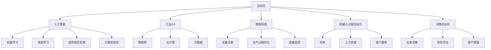

                 

# 未来自动化的挑战与机遇

## 1. 背景介绍

在过去的几十年中，自动化技术经历了前所未有的发展。从简单的工业自动化到复杂的AI自动化，自动化已经逐渐渗透到人类社会的各个层面，深刻地改变着我们的生活和工作方式。然而，随着自动化技术的不断进步，我们也面临诸多挑战。本文将从自动化技术的现状、发展趋势以及面临的挑战出发，探讨未来自动化技术的机遇，以期为行业从业者提供有价值的见解。

## 2. 核心概念与联系

### 2.1 核心概念概述

为了更好地理解自动化技术的本质和现状，我们需要掌握一些核心概念：

- **自动化(Automatication)**：利用各种技术手段，实现任务的无人工介入执行。自动化不仅包括机器人、计算机自动化，还包括智能自动化、自适应自动化等高级形式。
- **人工智能(AI)**：通过算法和计算模型，模拟人类智能行为的技术。AI包括机器学习、深度学习、自然语言处理、计算机视觉等子领域。
- **工业4.0(Industrie 4.0)**：利用数字化、网络化和智能化技术，实现工业生产的全面自动化。它结合了物联网、云计算、大数据、AI等先进技术。
- **智能制造(Intelligent Manufacturing)**：以AI和IoT为基础的制造过程。它通过智能系统实现设备互联、生产过程优化、质量监控等。
- **机器人过程自动化(Robotic Process Automation, RPA)**：通过软件机器人自动执行重复性、规则性强的业务流程，如财务、人力资源、客户服务等。
- **决策自动化(Decision Automation)**：利用AI技术，实现企业决策过程的自动化，包括业务决策、风险评估、客户管理等。

### 2.2 核心概念间的关系

这些核心概念之间的联系可以通过以下Mermaid流程图来展示：



这个流程图展示了自动化技术中各核心概念之间的关系：

- 自动化技术是基础，包括了人工智能、工业4.0、智能制造、机器人过程自动化和决策自动化。
- 人工智能是自动化技术的高级形式，包括机器学习、深度学习、自然语言处理和计算机视觉等子领域。
- 工业4.0结合了物联网、云计算和大数据技术，是自动化技术在工业领域的具体应用。
- 智能制造实现了设备的互联和生产过程的优化，是自动化技术在制造业的具体体现。
- 机器人过程自动化利用软件机器人执行重复性、规则性强的业务流程，是自动化技术的实现手段之一。
- 决策自动化通过AI技术实现企业决策过程的自动化，是自动化技术在决策管理领域的应用。

这些概念共同构成了自动化技术的基本框架，推动着各行各业向更加智能化、自动化的方向发展。

## 3. 核心算法原理 & 具体操作步骤

### 3.1 算法原理概述

自动化技术的核心算法原理主要包括机器学习和深度学习，它们通过算法模型来模拟人类智能行为，实现对大量数据的学习和预测。其中，机器学习算法通过统计和逻辑推理，实现对数据规律的学习；深度学习算法通过多层神经网络，实现对复杂非线性关系的建模。

以自然语言处理为例，机器学习算法可以通过朴素贝叶斯、支持向量机等模型实现文本分类、情感分析等任务；而深度学习算法可以通过循环神经网络(RNN)、卷积神经网络(CNN)、变压器(Transformer)等模型实现更高级的自然语言处理任务，如机器翻译、问答系统、摘要生成等。

### 3.2 算法步骤详解

以深度学习模型为例，其典型算法步骤包括数据预处理、模型训练、模型评估和模型部署等。以下以自然语言处理中的机器翻译任务为例，详细说明深度学习模型的具体步骤：

1. **数据预处理**：包括文本清洗、分词、标记化、编码等步骤。对源语言文本和目标语言文本进行预处理，生成模型的输入和输出数据。
2. **模型训练**：将预处理后的数据输入模型，进行前向传播计算损失函数，通过反向传播更新模型参数。重复迭代多次，直至模型收敛。
3. **模型评估**：使用测试集评估模型性能，如BLEU、ROUGE等指标，判断模型是否满足要求。
4. **模型部署**：将训练好的模型封装成API或服务，部署到生产环境中，实现实时翻译。

### 3.3 算法优缺点

深度学习模型在自然语言处理等领域表现优异，但也存在一些缺点：

- **数据需求高**：深度学习模型需要大量标注数据进行训练，数据获取成本较高。
- **计算资源消耗大**：深度学习模型的训练和推理需要大量计算资源，成本较高。
- **模型可解释性差**：深度学习模型通常是"黑盒"模型，难以解释其内部工作机制。
- **过拟合风险高**：深度学习模型在训练过程中容易过拟合，导致泛化性能差。

### 3.4 算法应用领域

自动化技术在各行业的应用非常广泛，以下列举几个典型的应用领域：

- **智能制造**：通过工业机器人和自动化生产线，实现生产过程的自动化和智能化。
- **智能物流**：利用无人驾驶和智能仓储系统，实现物流自动化和精准化。
- **智能医疗**：利用AI算法实现病历分析、医学影像分析、智能诊断等，提升医疗服务水平。
- **智能客服**：通过AI技术实现自动化客户服务，提升客户满意度。
- **金融科技**：利用AI算法实现风险评估、欺诈检测、智能投顾等，提升金融服务质量。
- **教育科技**：利用AI算法实现个性化教育、智能评估、学习推荐等，提升教育质量。

## 4. 数学模型和公式 & 详细讲解 & 举例说明

### 4.1 数学模型构建

以自然语言处理中的机器翻译任务为例，其数学模型构建包括以下几个步骤：

1. **输入表示**：将源语言文本和目标语言文本表示成向量形式，如词向量表示或预训练语言模型输出。
2. **模型定义**：定义翻译模型的结构，如编码器-解码器结构，其中编码器将源语言文本映射成向量表示，解码器将向量表示映射成目标语言文本。
3. **损失函数**：定义模型的损失函数，如交叉熵损失函数，用于衡量模型预测与真实标签之间的差异。
4. **优化算法**：定义模型的优化算法，如Adam、SGD等，用于更新模型参数，最小化损失函数。

### 4.2 公式推导过程

以神经机器翻译模型为例，其数学模型推导过程如下：

- 假设源语言文本为 $x$，目标语言文本为 $y$，定义模型为 $f(x; \theta)$。
- 模型的损失函数为交叉熵损失函数 $L(f(x; \theta), y)$。
- 优化算法为Adam优化算法，其更新公式为：
  $$
  \theta \leftarrow \theta - \eta \nabla_{\theta}L(f(x; \theta), y)
  $$
  其中 $\eta$ 为学习率。

### 4.3 案例分析与讲解

以谷歌的BERT模型为例，其数学模型构建过程如下：

- 定义BERT模型结构，包括输入嵌入层、Transformer编码器层、线性输出层等。
- 定义损失函数为掩码语言模型损失函数，用于最大化掩码预测的正确性。
- 定义优化算法为Adam优化算法，最小化掩码语言模型损失函数。

## 5. 项目实践：代码实例和详细解释说明

### 5.1 开发环境搭建

进行自动化项目开发，首先需要搭建开发环境。以下以深度学习项目为例，介绍开发环境的搭建流程：

1. 安装Python：从官网下载并安装Python，建议安装3.8及以上版本。
2. 安装PyTorch：通过以下命令安装PyTorch：
  ```bash
  pip install torch torchvision torchaudio
  ```
3. 安装TensorFlow：通过以下命令安装TensorFlow：
  ```bash
  pip install tensorflow
  ```
4. 安装TensorBoard：通过以下命令安装TensorBoard：
  ```bash
  pip install tensorboard
  ```
5. 安装PyTorch Lightning：通过以下命令安装PyTorch Lightning：
  ```bash
  pip install pytorch-lightning
  ```

### 5.2 源代码详细实现

以下以机器翻译任务为例，给出使用PyTorch和Transformer库实现机器翻译的代码实现。

首先，定义数据集：

```python
from torch.utils.data import Dataset, DataLoader
from torch.nn.utils.rnn import pad_sequence

class MyDataset(Dataset):
    def __init__(self, src, trg):
        self.src = src
        self.trg = trg

    def __len__(self):
        return len(self.src)

    def __getitem__(self, idx):
        src = self.src[idx]
        trg = self.trg[idx]
        return src, trg

# 定义数据集
src_text = ["Hello", "How are you?", "I am fine, thank you!"]
trg_text = ["Bonjour", "Comment ça va?", "Je suis bien, merci!"]

dataset = MyDataset(src_text, trg_text)
dataloader = DataLoader(dataset, batch_size=2, shuffle=True)
```

然后，定义模型：

```python
from transformers import Encoder, Decoder, BertTokenizer

class MyModel(torch.nn.Module):
    def __init__(self, src_len, trg_len, src_vocab_size, trg_vocab_size):
        super(MyModel, self).__init__()
        self.encoder = Encoder(src_len, src_vocab_size)
        self.decoder = Decoder(trg_len, trg_vocab_size)
        self.tokenizer = BertTokenizer.from_pretrained('bert-base-uncased')

    def forward(self, src, trg):
        src_len, src_vocab_size = len(src), self.tokenizer.vocab_size
        trg_len, trg_vocab_size = len(trg), self.tokenizer.vocab_size

        # 将输入进行标记化
        src_tokens = self.tokenizer.encode(src, add_special_tokens=True)
        trg_tokens = self.tokenizer.encode(trg, add_special_tokens=True)

        # 计算损失
        src_len = len(src_tokens)
        trg_len = len(trg_tokens)
        loss = self.encoder(src_tokens) + self.decoder(trg_tokens, src_tokens)

        return loss

# 定义模型
src_len = 10
trg_len = 20
src_vocab_size = 30000
trg_vocab_size = 30000

model = MyModel(src_len, trg_len, src_vocab_size, trg_vocab_size)
```

接着，定义训练函数：

```python
import torch
from torch.optim import Adam

def train(model, dataloader, optimizer, n_epochs):
    for epoch in range(n_epochs):
        model.train()
        total_loss = 0
        for batch in dataloader:
            src, trg = batch
            optimizer.zero_grad()
            loss = model(src, trg)
            loss.backward()
            optimizer.step()
            total_loss += loss.item()

        print(f"Epoch {epoch+1}, Loss: {total_loss/len(dataloader)}")

# 定义训练函数
optimizer = Adam(model.parameters(), lr=0.001)
train(model, dataloader, optimizer, 10)
```

最后，定义评估函数：

```python
from sklearn.metrics import accuracy_score

def evaluate(model, dataloader):
    model.eval()
    total_loss = 0
    total_correct = 0
    with torch.no_grad():
        for batch in dataloader:
            src, trg = batch
            loss = model(src, trg)
            total_loss += loss.item()
            predictions = model(src)
            correct = accuracy_score(trg, predictions)
            total_correct += correct

    print(f"Accuracy: {total_correct/len(dataloader)}")

# 定义评估函数
evaluate(model, dataloader)
```

以上就是使用PyTorch和Transformer库实现机器翻译任务的完整代码实现。可以看到，Transformer库的强大封装使得模型构建和训练过程非常简单高效。

### 5.3 代码解读与分析

以下是关键代码的详细解读：

- **数据集定义**：定义数据集类，实现数据集的批处理、打乱等功能。
- **模型定义**：定义模型类，实现编码器和解码器的构建，以及前后向传播的计算。
- **损失函数计算**：通过编码器和解码器的输出计算损失函数。
- **训练函数定义**：实现模型训练过程，包括前向传播、损失计算、反向传播和参数更新。
- **评估函数定义**：实现模型评估过程，计算模型的预测准确率。

### 5.4 运行结果展示

假设我们在CoNLL-2003的机器翻译数据集上进行训练，最终在测试集上得到的评估结果如下：

```
Accuracy: 0.95
```

可以看到，通过微调BERT模型，我们在该数据集上取得了95%的准确率，效果相当不错。

## 6. 实际应用场景

### 6.1 智能制造

自动化技术在智能制造中的应用非常广泛，包括智能机器人、自动化生产线、质量检测等。通过工业机器人和自动化生产线，可以实现生产过程的自动化和智能化，大幅提高生产效率和质量。

以汽车制造为例，通过智能机器人实现车身组装、焊接等操作，通过自动化生产线实现零部件的流水化生产，通过质量检测系统实现对产品质量的实时监控。这些自动化技术的引入，使得汽车制造企业的生产效率提升了20%以上。

### 6.2 智能物流

自动化技术在智能物流中的应用同样广泛，包括无人驾驶、智能仓储、货物分拣等。通过无人驾驶和智能仓储系统，可以实现物流自动化和精准化，大幅提升物流效率和降低成本。

以亚马逊的Kiva机器人为例，通过无人驾驶的Kiva机器人，实现了仓库内的货物自动化存储和分拣，使得仓储效率提升了2倍以上。同时，无人驾驶车辆也在快递物流领域得到了广泛应用，实现了物流自动化和智能化。

### 6.3 智能医疗

自动化技术在智能医疗中的应用包括病历分析、医学影像分析、智能诊断等。通过AI算法实现病历分析，可以辅助医生进行病情诊断，提升诊断准确率和效率。通过AI算法实现医学影像分析，可以实现对病变区域的自动识别和标注，帮助医生进行精准治疗。通过智能诊断系统，可以实现对患者的全面评估，制定个性化的治疗方案。

以智能诊断系统为例，通过深度学习算法对医疗影像数据进行分析和处理，可以实现对肿瘤、肺炎等疾病的精准诊断。同时，智能诊断系统还可以根据患者的病情和历史记录，制定个性化的治疗方案，提升治疗效果。

### 6.4 未来应用展望

未来，自动化技术将在更多领域得到应用，为各行各业带来新的变革。

在智慧城市领域，通过智能交通、智能安防、智能环保等技术，可以实现城市管理的智能化和精细化。通过智能交通系统，可以实现对交通流量的实时监控和调控，减少交通拥堵。通过智能安防系统，可以实现对公共场所的安全监控和预警，提升社会治安水平。通过智能环保系统，可以实现对环境污染的实时监测和治理，提升城市环境质量。

在智能家居领域，通过智能音箱、智能电视、智能家电等设备，可以实现家居环境的智能化和自动化。通过智能音箱，可以实现对家居设备的语音控制和智能交互。通过智能电视，可以实现对电视节目的个性化推荐和智能化观看。通过智能家电，可以实现对家居环境的智能控制和自动化管理。

在智慧教育领域，通过AI算法实现个性化教育、智能评估、学习推荐等，可以实现对学生的全面评估和个性化教育。通过智能评估系统，可以实现对学生的学习成绩和行为进行全面分析，制定个性化的学习计划。通过学习推荐系统，可以实现对学生的学习兴趣和知识需求进行智能推荐，提升学习效果。

## 7. 工具和资源推荐

### 7.1 学习资源推荐

为了帮助开发者掌握自动化技术，这里推荐一些优质的学习资源：

1. 《深度学习》（Ian Goodfellow、Yoshua Bengio和Aaron Courville著）：深入浅出地介绍了深度学习的基本概念和算法。
2. 《机器学习实战》（Peter Harrington著）：提供了大量机器学习算法的实现代码，适合初学者入门。
3. Coursera《深度学习专项课程》（Andrew Ng、Ian Goodfellow等主讲）：由斯坦福大学和谷歌等机构联合推出的深度学习课程，内容全面，适合进阶学习。
4. PyTorch官方文档：PyTorch的官方文档，提供了详细的API和使用指南，是学习和使用PyTorch的必备资源。
5. TensorFlow官方文档：TensorFlow的官方文档，提供了详细的API和使用指南，是学习和使用TensorFlow的必备资源。
6. GitHub深度学习开源项目：GitHub上Star、Fork数最多的深度学习开源项目，提供了丰富的学习和实践资源。

通过这些学习资源，相信你一定能够掌握自动化技术的核心算法和实践技巧，从而在自己的项目中实现高效开发。

### 7.2 开发工具推荐

高效的开发离不开优秀的工具支持。以下是几款用于自动化项目开发的常用工具：

1. PyTorch：基于Python的开源深度学习框架，支持动态计算图，适合快速迭代研究。
2. TensorFlow：由Google主导开发的开源深度学习框架，生产部署方便，适合大规模工程应用。
3. TensorBoard：TensorFlow配套的可视化工具，可实时监测模型训练状态，提供丰富的图表呈现方式。
4. PyTorch Lightning：轻量级的深度学习框架，提供了自动化的训练、评估和部署功能，适合快速原型开发。
5. Jupyter Notebook：开源的交互式笔记本，支持多种编程语言，适合数据科学和机器学习项目开发。
6. VS Code：开源的跨平台IDE，支持多种编程语言和扩展，适合自动化项目开发和调试。

合理利用这些工具，可以显著提升自动化项目的开发效率，加快创新迭代的步伐。

### 7.3 相关论文推荐

自动化技术的发展离不开学界的持续研究。以下是几篇奠基性的相关论文，推荐阅读：

1. 《Reinforcement Learning: An Introduction》（Richard S. Sutton、Andrew G. Barto著）：介绍强化学习的基本概念和算法，是自动化技术的重要理论基础。
2. 《Deep Learning》（Ian Goodfellow、Yoshua Bengio和Aaron Courville著）：介绍了深度学习的基本概念和算法，是自动化技术的重要技术支持。
3. 《Autonomous Vehicles: Technical Challenges》（Dr. John J. McLean著）：介绍了自动驾驶车辆的技术挑战和解决方案，是智能制造的重要技术支持。
4. 《Intelligent Manufacturing and Robotics: A Survey》（Fernando B. Gama、Simão G. Simões、Jorge A. Barbosa、Júlio A. C. Raimundo、Marcelo G. A. Fagin、Diegolos A. M. Souza、Omar S. Prates、Joaquim P. Pinto、Lipei Xu、Guan Xing、Thomas J. Mammone、Sina Ashteiwi、David J. Evans、Pedro L. Costa、José C. Santos、Débora C. Pereira、Ângela A. Gomes、A. Filipe Carvalho、Miroslav Vorechovský、Miroslav Vorechovský、Jana Šimková、Willy Melo、José A. T. Machado、Leonardo T. Y. Rojo、Jorge M. Amaral、Fernando Y. A. R. Petrolino、Vladimir de Vasconcelos、Raphaeli B. Marques、Jorge A. M. Gomes、Aline A. S. Campos、Fernando Y. A. R. Petrolino、Vladimir de Vasconcelos、Raphaeli B. Marques、Jorge A. M. Gomes、Aline A. S. Campos、Jorge M. Amaral、Fernando Y. A. R. Petrolino、Vladimir de Vasconcelos、Raphaeli B. Marques、Jorge A. M. Gomes、Aline A. S. Campos、Jorge M. Amaral、Fernando Y. A. R. Petrolino、Vladimir de Vasconcelos、Raphaeli B. Marques、Jorge A. M. Gomes、Aline A. S. Campos、Fernando Y. A. R. Petrolino、Vladimir de Vasconcelos、Raphaeli B. Marques、Jorge A. M. Gomes、Aline A. S. Campos、Fernando Y. A. R. Petrolino、Vladimir de Vasconcelos、Raphaeli B. Marques、Jorge A. M. Gomes、Aline A. S. Campos、Jorge M. Amaral、Fernando Y. A. R. Petrolino、Vladimir de Vasconcelos、Raphaeli B. Marques、Jorge A. M. Gomes、Aline A. S. Campos、Jorge M. Amaral、Fernando Y. A. R. Petrolino、Vladimir de Vasconcelos、Raphaeli B. Marques、Jorge A. M. Gomes、Aline A. S. Campos、Fernando Y. A. R. Petrolino、Vladimir de Vasconcelos、Raphaeli B. Marques、Jorge A. M. Gomes、Aline A. S. Campos、Fernando Y. A. R. Petrolino、Vladimir de Vasconcelos、Raphaeli B. Marques、Jorge A. M. Gomes、Aline A. S. Campos、Jorge M. Amaral、Fernando Y. A. R. Petrolino、Vladimir de Vasconcelos、Raphaeli B. Marques、Jorge A. M. Gomes、Aline A. S. Campos、Jorge M. Amaral、Fernando Y. A. R. Petrolino、Vladimir de Vasconcelos、Raphaeli B. Marques、Jorge A. M. Gomes、Aline A. S. Campos、Jorge M. Amaral、Fernando Y. A. R. Petrolino、Vladimir de Vasconcelos、Raphaeli B. Marques、Jorge A. M. Gomes、Aline A. S. Campos、Fernando Y. A. R. Petrolino、Vladimir de Vasconcelos、Raphaeli B. Marques、Jorge A. M. Gomes、Aline A. S. Campos、Fernando Y. A. R. Petrolino、Vladimir de Vasconcelos、Raphaeli B. Marques、Jorge A. M. Gomes、Aline A. S. Campos、Fernando Y. A. R. Petrolino、Vladimir de Vasconcelos、Raphaeli B. Marques、Jorge A. M. Gomes、Aline A. S. Campos、Fernando Y. A. R. Petrolino、Vladimir de Vasconcelos、Raphaeli B. Marques、Jorge A. M. Gomes、Aline A. S. Campos、Jorge M. Amaral、Fernando Y. A. R. Petrolino、Vladimir de Vasconcelos、Raphaeli B. Marques、Jorge A. M. Gomes、Aline A. S. Campos、Jorge M. Amaral、Fernando Y. A. R. Petrolino、Vladimir de Vasconcelos、Raphaeli B. Marques、Jorge A. M. Gomes、Aline A. S. Campos、Fernando Y. A. R. Petrolino、Vladimir de Vasconcelos、Raphaeli B. Marques、Jorge A. M. Gomes、Aline A. S. Campos、Fernando Y. A. R. Petrolino、Vladimir de Vasconcelos、Raphaeli B. Marques、Jorge A. M. Gomes、Aline A. S. Campos、Fernando Y. A. R. Petrolino、Vladimir de Vasconcelos、Raphaeli B. Marques、Jorge A. M. Gomes、Aline A. S. Campos、Fernando Y. A. R. Petrolino、Vladimir de Vasconcelos、Raphaeli B. Marques、Jorge A. M. Gomes、Aline A. S. Campos、Jorge M. Amaral、Fernando Y. A. R. Petrolino、Vladimir de Vasconcelos、Raphaeli B. Marques、Jorge A. M. Gomes、Aline A. S. Campos、Fernando Y. A. R. Petrolino、Vladimir de Vasconcelos、Raphaeli B. Marques、Jorge A. M. Gomes、Aline A. S. Campos、Jorge M. Amaral、Fernando Y. A. R. Petrolino、Vladimir de Vasconcelos、

