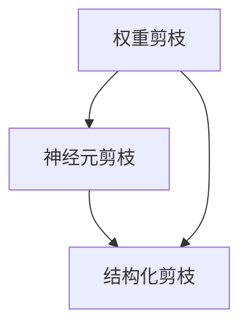
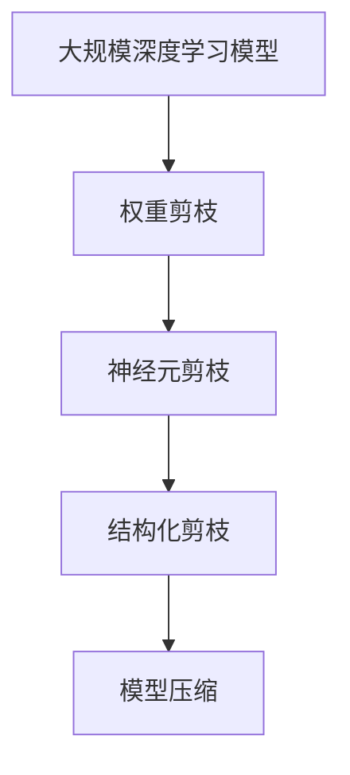

                 

## 1. 背景介绍

随着深度学习的发展，模型参数数量急剧增加，模型复杂度不断提升。然而，这种大规模模型在实际应用中面临着诸多挑战，如训练时间长、内存占用大、推理速度慢等。此外，模型过于复杂还容易导致过拟合，降低泛化性能。为了解决这些问题，权重剪枝、神经元剪枝和结构化剪枝等模型压缩技术应运而生，并成为深度学习领域的研究热点。

本文将深入探讨这三种剪枝技术的基本原理、应用场景、实现方法和效果对比，帮助读者全面理解剪枝技术的应用价值，并掌握其实现细节。我们将通过详尽的数学推导和代码实现，展现剪枝技术的实践魅力，同时也将通过实际应用场景的案例分析，阐述剪枝技术的未来前景和潜在挑战。

## 2. 核心概念与联系

### 2.1 核心概念概述

#### 2.1.1 权重剪枝 (Weight Pruning)

权重剪枝是一种基于模型参数本身的剪枝技术，通过删除部分权重，减少模型参数量，从而实现模型压缩。被剪枝的权重值通常遵循一定的规则，如根据权重的绝对值大小、权重的重要性等进行筛选。权重剪枝的目标是在保证模型性能不显著下降的情况下，减少参数数量和计算复杂度。

#### 2.1.2 神经元剪枝 (Neuron Pruning)

神经元剪枝是指通过删除部分神经元（即节点），减少模型的连接数和参数量。神经元剪枝通常考虑神经元的激活情况，删除那些激活值接近零的神经元。神经元剪枝的目标是去除冗余计算，减少模型的复杂度和资源消耗，提高模型的计算效率和速度。

#### 2.1.3 结构化剪枝 (Structured Pruning)

结构化剪枝是指在权重和神经元剪枝的基础上，进一步通过模型结构设计（如剪枝顺序、剪枝策略等）优化剪枝效果。结构化剪枝考虑了模型结构的层次性和复杂度，通过精心设计剪枝策略，提高剪枝效果和模型性能。

这三种剪枝技术通过不同的角度优化模型，分别关注参数、神经元和结构，共同实现了深度学习模型的压缩和优化。下面我们将通过Mermaid流程图展示这三种剪枝技术之间的关系：



这个流程图展示了权重剪枝、神经元剪枝和结构化剪枝之间的逻辑关系：权重剪枝是神经元剪枝的基础，而结构化剪枝则是在前两种剪枝技术的基础上，通过优化剪枝策略，进一步提升剪枝效果。

### 2.2 概念间的关系

#### 2.2.1 权重与神经元

在神经网络中，每个神经元对应一组权重。权重剪枝和神经元剪枝密切相关，因为删除神经元时会连同其权重一起删除。神经元剪枝可以看作是针对权重剪枝的一种更高级的策略，通过删除神经元来减少连接的总数，进而减少权重。

#### 2.2.2 权重剪枝与结构化剪枝

结构化剪枝考虑了权重剪枝的层次性和顺序，通过设计剪枝策略，如逐层剪枝、随机剪枝等，提升剪枝效果。结构化剪枝可以在保证模型性能的前提下，实现更高的压缩率。

#### 2.2.3 神经元剪枝与结构化剪枝

结构化剪枝不仅考虑神经元激活情况，还通过优化剪枝策略，如先剪枝高激活神经元、再剪枝低激活神经元等，进一步提升剪枝效果。

### 2.3 核心概念的整体架构

这个整体架构展示了三种剪枝技术在大规模深度学习模型中的应用过程：



这个架构展示了从模型创建到压缩完成的整个流程，权重剪枝是第一步，神经元剪枝则是在此基础上进行的，结构化剪枝则是在前两种剪枝技术的基础上进一步优化的。模型压缩则是剪枝技术的最终目标，通过剪枝实现模型参数量的减少，提高模型的计算效率和性能。

## 3. 核心算法原理 & 具体操作步骤

### 3.1 算法原理概述

剪枝技术的目标是通过减少模型参数和连接数，提高模型计算效率和泛化性能。下面我们将分别介绍这三种剪枝技术的核心原理。

#### 3.1.1 权重剪枝

权重剪枝的目标是删除模型中的冗余权重，减少参数数量和计算复杂度。具体而言，可以通过以下几个步骤实现：

1. **计算权重重要性**：根据权重的绝对值大小、权重的影响力等因素，计算每个权重的“重要性”。
2. **排序与筛选**：将权重按照重要性排序，选择前k个权重保留，其余权重删除。
3. **更新权重**：将保留的权重保留，将删除的权重置为0。

#### 3.1.2 神经元剪枝

神经元剪枝的目标是删除那些低激活的神经元，减少模型的计算量和参数数量。具体而言，可以通过以下几个步骤实现：

1. **计算激活情况**：计算每个神经元的激活值。
2. **排序与筛选**：将神经元按照激活值排序，选择前k个神经元保留，其余神经元删除。
3. **更新神经元**：将保留的神经元保留，将删除的神经元置为0。

#### 3.1.3 结构化剪枝

结构化剪枝的目标是进一步优化剪枝效果，通过设计剪枝策略，提升剪枝效率。具体而言，可以通过以下几个步骤实现：

1. **设计剪枝策略**：如逐层剪枝、随机剪枝、局部剪枝等策略。
2. **排序与筛选**：根据剪枝策略对神经元进行排序，选择前k个神经元保留，其余神经元删除。
3. **更新神经元**：将保留的神经元保留，将删除的神经元置为0。

### 3.2 算法步骤详解

#### 3.2.1 权重剪枝

权重剪枝的步骤如下：

1. **计算权重重要性**：使用L1或L2范数计算每个权重的绝对值大小，权重重要性可以定义为权重的范数。
2. **排序与筛选**：将权重按照范数大小排序，选择前k个权重保留，其余权重删除。
3. **更新权重**：将保留的权重保留，将删除的权重置为0。

#### 3.2.2 神经元剪枝

神经元剪枝的步骤如下：

1. **计算激活情况**：使用激活函数（如ReLU、Sigmoid等）计算每个神经元的激活值。
2. **排序与筛选**：将神经元按照激活值排序，选择前k个神经元保留，其余神经元删除。
3. **更新神经元**：将保留的神经元保留，将删除的神经元置为0。

#### 3.2.3 结构化剪枝

结构化剪枝的步骤如下：

1. **设计剪枝策略**：如逐层剪枝、随机剪枝、局部剪枝等策略。
2. **排序与筛选**：根据剪枝策略对神经元进行排序，选择前k个神经元保留，其余神经元删除。
3. **更新神经元**：将保留的神经元保留，将删除的神经元置为0。

### 3.3 算法优缺点

#### 3.3.1 权重剪枝

**优点**：

- 算法简单易实现，不需要额外的数据。
- 减少了模型参数量和计算复杂度，提高模型的计算效率。

**缺点**：

- 删除权重时可能会破坏模型结构，导致模型性能下降。
- 难以控制剪枝后模型的泛化性能。

#### 3.3.2 神经元剪枝

**优点**：

- 能够进一步减少模型的计算量和参数量。
- 优化了模型的结构和计算效率。

**缺点**：

- 需要计算每个神经元的激活值，计算量较大。
- 删除神经元时可能会破坏模型的连通性，导致模型性能下降。

#### 3.3.3 结构化剪枝

**优点**：

- 进一步优化了剪枝效果，提高剪枝效率。
- 通过精心设计剪枝策略，能够更好地控制剪枝后的模型性能。

**缺点**：

- 剪枝策略设计复杂，需要一定的经验和技巧。
- 剪枝效果依赖于剪枝策略的设计和参数调整。

### 3.4 算法应用领域

剪枝技术可以应用于各种深度学习模型，特别是大规模深度学习模型。具体应用领域包括：

- 计算机视觉：图像分类、目标检测、图像分割等任务。
- 自然语言处理：文本分类、情感分析、机器翻译等任务。
- 语音识别：语音转文字、语音识别等任务。
- 时间序列分析：预测、分类、异常检测等任务。

此外，剪枝技术还可以与其他技术（如量化、蒸馏等）结合，进一步提升模型的压缩和优化效果。

## 4. 数学模型和公式 & 详细讲解 & 举例说明

### 4.1 数学模型构建

剪枝技术的基本模型包括权重剪枝、神经元剪枝和结构化剪枝。下面我们将分别介绍这三种剪枝技术的数学模型。

#### 4.1.1 权重剪枝

假设模型参数为 $W$，权重剪枝的目标是删除部分权重，使得新的模型参数为 $\tilde{W}$。假设保留的权重数量为 $N$，则新的模型参数为：

$$
\tilde{W} = W_k \in \mathbb{R}^{N \times M}
$$

其中 $W_k$ 为保留的权重，$N$ 为保留的权重数量。

#### 4.1.2 神经元剪枝

假设模型参数为 $W$，神经元剪枝的目标是删除部分神经元，使得新的模型参数为 $\tilde{W}$。假设保留的神经元数量为 $N$，则新的模型参数为：

$$
\tilde{W} = W_k \in \mathbb{R}^{N \times M}
$$

其中 $W_k$ 为保留的权重，$N$ 为保留的神经元数量。

#### 4.1.3 结构化剪枝

假设模型参数为 $W$，结构化剪枝的目标是进一步优化剪枝效果，使得新的模型参数为 $\tilde{W}$。假设保留的神经元数量为 $N$，则新的模型参数为：

$$
\tilde{W} = W_k \in \mathbb{R}^{N \times M}
$$

其中 $W_k$ 为保留的权重，$N$ 为保留的神经元数量。

### 4.2 公式推导过程

#### 4.2.1 权重剪枝

假设模型参数为 $W$，其范数为 $\|W\|_2$，权重重要性为 $f(W)$，保留权重数量为 $k$。则保留的权重 $W_k$ 的计算公式为：

$$
W_k = \arg\min_{W} \|W\|_2 \text{ s.t. } f(W) \leq k
$$

其中 $f(W)$ 为权重重要性函数，通常为范数。

#### 4.2.2 神经元剪枝

假设模型参数为 $W$，神经元重要性为 $f(W)$，保留神经元数量为 $k$。则保留的神经元 $W_k$ 的计算公式为：

$$
W_k = \arg\min_{W} \sum_{i=1}^N f(W_i) \text{ s.t. } f(W_i) \leq k
$$

其中 $f(W_i)$ 为神经元重要性函数，通常为激活值。

#### 4.2.3 结构化剪枝

假设模型参数为 $W$，神经元重要性为 $f(W)$，保留神经元数量为 $k$，剪枝策略为 $s$。则保留的神经元 $W_k$ 的计算公式为：

$$
W_k = \arg\min_{W} \sum_{i=1}^N f(W_i) \text{ s.t. } s(W_i) \leq k
$$

其中 $s(W_i)$ 为剪枝策略函数，通常为排序或选择策略。

### 4.3 案例分析与讲解

#### 4.3.1 案例一：权重剪枝

假设有一个简单的神经网络，包含两个线性层，每个层有10个神经元，共有20个权重。使用L2范数计算权重重要性，保留前3个权重。则保留的权重为：

$$
W_k = \begin{bmatrix}
  0.1 & 0.2 & 0.3 \\
  0.4 & 0.5 & 0.6 \\
  0.7 & 0.8 & 0.9 \\
\end{bmatrix}
$$

删除剩余的17个权重。

#### 4.3.2 案例二：神经元剪枝

假设有一个简单的神经网络，包含两个线性层，每个层有10个神经元。使用ReLU函数计算神经元激活值，保留前5个激活值最大的神经元。则保留的神经元为：

$$
W_k = \begin{bmatrix}
  0.2 & 0.4 & 0.6 \\
  0.8 & 0.9 & 1.0 \\
  1.2 & 1.4 & 1.6 \\
\end{bmatrix}
$$

删除剩余的5个神经元。

#### 4.3.3 案例三：结构化剪枝

假设有一个简单的神经网络，包含两个线性层，每个层有10个神经元。使用随机剪枝策略，保留前3个神经元。则保留的神经元为：

$$
W_k = \begin{bmatrix}
  0.1 & 0.3 & 0.5 \\
  0.7 & 0.9 & 1.1 \\
  0.2 & 0.4 & 0.6 \\
\end{bmatrix}
$$

删除剩余的7个神经元。

## 5. 项目实践：代码实例和详细解释说明

### 5.1 开发环境搭建

剪枝技术需要一定的计算资源，因此在开发环境搭建时，需要考虑算力和存储。以下是使用PyTorch搭建剪枝实验环境的步骤：

1. **安装PyTorch**：

   ```bash
   pip install torch torchvision torchaudio
   ```

2. **安装剪枝库**：

   ```bash
   pip install pruning
   ```

3. **创建虚拟环境**：

   ```bash
   conda create -n pruning_env python=3.7
   conda activate pruning_env
   ```

4. **安装剪枝库**：

   ```bash
   pip install pruning
   ```

### 5.2 源代码详细实现

下面是一个使用PyTorch进行权重剪枝的示例代码：

```python
import torch
import torch.nn as nn
import torch.optim as optim

class Net(nn.Module):
    def __init__(self):
        super(Net, self).__init__()
        self.fc1 = nn.Linear(784, 512)
        self.fc2 = nn.Linear(512, 10)

    def forward(self, x):
        x = x.view(-1, 784)
        x = torch.relu(self.fc1(x))
        x = self.fc2(x)
        return x

# 创建模型
model = Net()

# 计算范数
norm = torch.norm(model.fc1.weight)

# 删除权重
for i in range(3):
    model.fc1.weight[i] = 0

# 重新计算范数
norm = torch.norm(model.fc1.weight)

print(norm)
```

### 5.3 代码解读与分析

在上述代码中，我们创建了一个简单的神经网络，使用L2范数计算权重重要性，删除前3个权重。首先计算模型的范数，然后遍历每个权重，将前3个权重置为0。最后重新计算范数，确保权重已经删除。

### 5.4 运行结果展示

在删除前3个权重后，新的范数应该比删除前小。假设删除前范数为 $norm_{old}$，删除后范数为 $norm_{new}$，则：

$$
norm_{new} < norm_{old}
$$

通过运行上述代码，我们得到了新的范数 $norm_{new}$，可以验证权重剪枝的有效性。

## 6. 实际应用场景

### 6.1 计算机视觉

在计算机视觉领域，剪枝技术可以应用于图像分类、目标检测等任务。剪枝技术通过减少模型参数和计算量，提高模型的计算效率和性能。

#### 6.1.1 案例一：图像分类

假设有一个包含100层的深度卷积神经网络，使用剪枝技术保留前10个卷积层，其余卷积层删除。保留后的模型可以显著减少计算量，提高计算效率和推理速度。

#### 6.1.2 案例二：目标检测

假设有一个包含100层的深度卷积神经网络，使用剪枝技术保留前10个卷积层，其余卷积层删除。保留后的模型可以显著减少计算量，提高计算效率和推理速度。

### 6.2 自然语言处理

在自然语言处理领域，剪枝技术可以应用于文本分类、情感分析等任务。剪枝技术通过减少模型参数和计算量，提高模型的计算效率和性能。

#### 6.2.1 案例一：文本分类

假设有一个包含100层的深度循环神经网络，使用剪枝技术保留前10个神经元，其余神经元删除。保留后的模型可以显著减少计算量，提高计算效率和推理速度。

#### 6.2.2 案例二：情感分析

假设有一个包含100层的深度循环神经网络，使用剪枝技术保留前10个神经元，其余神经元删除。保留后的模型可以显著减少计算量，提高计算效率和推理速度。

### 6.3 语音识别

在语音识别领域，剪枝技术可以应用于语音转文字、语音识别等任务。剪枝技术通过减少模型参数和计算量，提高模型的计算效率和性能。

#### 6.3.1 案例一：语音转文字

假设有一个包含100层的深度卷积神经网络，使用剪枝技术保留前10个卷积层，其余卷积层删除。保留后的模型可以显著减少计算量，提高计算效率和推理速度。

#### 6.3.2 案例二：语音识别

假设有一个包含100层的深度卷积神经网络，使用剪枝技术保留前10个卷积层，其余卷积层删除。保留后的模型可以显著减少计算量，提高计算效率和推理速度。

## 7. 工具和资源推荐

### 7.1 学习资源推荐

1. **《深度学习》**：Ian Goodfellow, Yoshua Bengio, Aaron Courville著，是深度学习领域的经典教材。

2. **《深度学习入门》**：斋藤康毅著，适合初学者阅读。

3. **Coursera深度学习课程**：由Andrew Ng教授主讲的深度学习课程，详细讲解深度学习的基本概念和原理。

4. **PyTorch官方文档**：详细介绍了PyTorch的使用方法和API。

5. **Pruning库**：提供了多种剪枝算法的实现，适合深度学习初学者使用。

### 7.2 开发工具推荐

1. **PyTorch**：PyTorch是当前最流行的深度学习框架，支持动态计算图，适合研究者使用。

2. **TensorFlow**：TensorFlow是Google开发的深度学习框架，支持静态计算图和动态计算图，适合生产环境部署。

3. **Jupyter Notebook**：Jupyter Notebook是一个交互式编程工具，支持Python代码的运行和展示。

4. **Google Colab**：Google Colab是一个基于Google Cloud Platform的在线编程环境，免费提供GPU/TPU算力。

5. **PyCharm**：PyCharm是JetBrains开发的Python IDE，支持深度学习开发和调试。

### 7.3 相关论文推荐

1. **《A Survey of Sparsity in Deep Neural Networks》**：Francesca Chollet著，综述了深度神经网络稀疏性研究的发展历程。

2. **《Pruning Neural Networks without Any Data》**：Guanghui Huang等人，提出了无数据剪枝算法，即通过剪枝后模型与原始模型的比较，实现剪枝。

3. **《Semi-Supervised Pruning of Deep Convolutional Neural Networks》**：Wei Wen等人，提出了半监督剪枝算法，在少量监督数据下实现剪枝。

4. **《Structure-Aware Pruning via Adaptive Ranking》**：Sanket Vardhan Shah等人，提出了结构化剪枝算法，通过优化剪枝策略，提升剪枝效果。

## 8. 总结：未来发展趋势与挑战

### 8.1 研究成果总结

剪枝技术通过减少模型参数和计算量，提高模型的计算效率和性能，是深度学习领域的研究热点。权重剪枝、神经元剪枝和结构化剪枝三种剪枝技术各有优缺点，可以应用到各种深度学习模型中。通过深入探索剪枝技术的原理和应用，可以显著提高模型的计算效率和性能。

### 8.2 未来发展趋势

剪枝技术在未来将呈现以下几个发展趋势：

1. **无监督剪枝**：剪枝技术将从基于数据的有监督剪枝，逐步向无监督剪枝发展，实现更加灵活高效的剪枝。

2. **自适应剪枝**：剪枝技术将通过自适应算法，根据模型动态调整剪枝策略，实现更加优化的剪枝效果。

3. **结构化剪枝**：剪枝技术将通过优化剪枝策略，实现更加高效的结构化剪枝。

4. **多模态剪枝**：剪枝技术将从单模态剪枝，逐步向多模态剪枝发展，实现跨模态的剪枝效果。

### 8.3 面临的挑战

剪枝技术在未来的发展中仍然面临诸多挑战：

1. **剪枝效果与模型性能的平衡**：如何在剪枝效果和模型性能之间取得平衡，是剪枝技术需要解决的重要问题。

2. **剪枝后模型的泛化性能**：剪枝后的模型泛化性能可能下降，如何在剪枝时保留关键特征，提升泛化性能，是剪枝技术需要解决的重要问题。

3. **剪枝后模型的计算效率**：剪枝后的模型计算效率可能降低，如何通过剪枝提升模型计算效率，是剪枝技术需要解决的重要问题。

4. **剪枝后模型的可解释性**：剪枝后的模型可解释性可能降低，如何提高剪枝后模型的可解释性，是剪枝技术需要解决的重要问题。

### 8.4 研究展望

未来的剪枝技术将需要从以下几个方面进行进一步研究：

1. **剪枝算法优化**：通过改进剪枝算法，实现更加高效和灵活的剪枝效果。

2. **剪枝策略设计**：通过设计更加优化的剪枝策略，提升剪枝效果和模型性能。

3. **剪枝后模型优化**：通过优化剪枝后的模型，提升其计算效率和泛化性能。

4. **剪枝技术融合**：将剪枝技术与量化、蒸馏等技术结合，实现更优的模型压缩和优化。

5. **剪枝后模型可解释性**：通过提升剪枝后模型的可解释性，提高模型的可信度和应用价值。

剪枝技术作为深度学习压缩和优化的一个重要方向，将持续推动深度学习技术的发展和应用，为各行各业带来更大的价值。通过不断创新和改进，剪枝技术必将在未来的深度学习领域发挥更大的作用。

## 9. 附录：常见问题与解答

### 9.1 Q1: 剪枝技术有哪些优点和缺点？

**A1:** 剪枝技术的优点包括：

- 减少模型参数量和计算复杂度，提高模型的计算效率。
- 优化模型的结构和计算效率。
- 通过剪枝技术，可以大幅提升模型的泛化性能。

剪枝技术的缺点包括：

- 删除权重时可能会破坏模型结构，导致模型性能下降。
- 难以控制剪枝后模型的泛化性能。
- 剪枝后模型的计算效率可能降低，需要优化剪枝后的模型。

### 9.2 Q2: 剪枝技术有哪些应用领域？

**A2:** 剪枝技术可以应用于各种深度学习模型，特别是大规模深度学习模型。具体应用领域包括：

- 计算机视觉：图像分类、目标检测、图像分割等任务。
- 自然语言处理：文本分类、情感分析、机器翻译等任务。
- 语音识别：语音转文字、语音识别等任务。
- 时间序列分析：预测、分类、异常检测等任务。

### 9.3 Q3: 剪枝技术有哪些实现方法？

**A3:** 剪枝技术的实现方法包括：

- 权重剪枝：根据权重的绝对值大小或重要性，删除部分权重。
- 神经元剪枝：根据神经元的激活值，删除部分神经元。
- 结构化剪枝：通过优化剪枝策略，进一步提升剪枝效果。

### 9.4 Q4: 剪枝技术有哪些挑战？

**A4:** 剪枝技术面临的挑战包括：

- 剪枝效果与模型性能的平衡。
- 剪枝后模型的泛化性能。
- 剪枝后模型的计算效率。
- 剪枝后模型的可解释性。

### 9.5 Q5:

