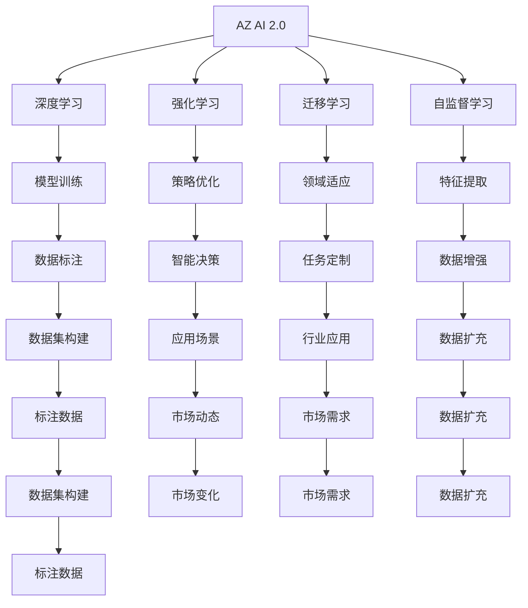

                 

# 李开复：AI 2.0 时代的市场

李开复博士，作为人工智能领域的先驱之一，曾多次预言并推动了人工智能技术的浪潮。在AI 2.0时代，李开复认为，AI不仅将带来技术的革新，还将深刻影响全球经济和社会结构。本文将探讨AI 2.0时代的市场变迁、技术动态以及未来趋势。

## 1. 背景介绍

### 1.1 问题由来
自1956年达特茅斯会议以来，人工智能经历了数十年的起伏。从最初的规则引擎到深度学习，AI技术的进步带来了显著的商业应用和学术成就。2012年，AlexNet在ImageNet上取得突破性胜利，标志着深度学习时代的到来。此后，AI技术迅速渗透到各行各业，从自动驾驶、智能客服到医疗健康、教育培训，AI技术的广泛应用改变了人类的生产生活方式。

进入21世纪，AI技术进入了AI 2.0时代，即以深度学习为核心的通用智能时代。AI 2.0时代，AI技术将更加普适、实用、可解释、可信，并逐渐走向全社会。李开复博士，作为AI领域的知名人士，对AI 2.0时代市场有着独到的见解。

### 1.2 问题核心关键点
AI 2.0时代的核心关键点包括：
1. 技术进步：深度学习、强化学习、迁移学习、自监督学习等技术的发展。
2. 应用场景：智能客服、自动驾驶、智能安防、金融风控、智能制造等。
3. 市场需求：数据标注、算法优化、模型训练、硬件设施等。
4. 市场变化：AI创业公司的兴起、大型企业的AI转型、AI基础设施建设等。
5. 伦理挑战：数据隐私、算法偏见、AI决策透明性等。

## 2. 核心概念与联系

### 2.1 核心概念概述

在探讨AI 2.0时代的市场时，需要明确以下几个核心概念：

- **AI 2.0**：以深度学习为核心的通用智能时代，AI技术在各个领域得到广泛应用。
- **深度学习**：一种基于神经网络的技术，通过多层次非线性映射实现复杂模式识别和预测。
- **强化学习**：一种通过试错学习，优化策略以实现目标的学习方法。
- **迁移学习**：利用已有知识对新任务进行快速学习和适应的技术。
- **自监督学习**：利用无标签数据进行预训练，提取通用的特征表示。
- **市场**：AI技术在各个行业中的需求和应用场景。

这些概念之间存在紧密的联系，共同构成了AI 2.0时代的市场生态。深度学习和强化学习为AI技术提供了强大的算法基础，迁移学习则提升了AI技术的泛化能力，自监督学习则扩大了AI技术的可用数据范围。这些技术的发展，为AI在各个行业的应用提供了强大的支撑。

### 2.2 概念间的关系

这些核心概念之间存在密切的联系，形成了一个相互支持的生态系统。

#### 2.2.1 AI 2.0的生态系统



这个流程图展示了AI 2.0时代的市场生态系统：深度学习和强化学习为模型训练和策略优化提供基础；迁移学习和自监督学习为领域适应和特征提取提供支持；市场动态和市场需求则驱动了整个系统的运转。

## 3. 核心算法原理 & 具体操作步骤
### 3.1 算法原理概述

AI 2.0时代的核心算法原理基于深度学习和强化学习。深度学习通过构建多层神经网络，实现复杂数据的特征提取和模式识别。强化学习则通过试错学习，优化策略以实现特定目标。这些算法原理在AI 2.0时代的应用非常广泛，涵盖了从智能客服到自动驾驶等各个领域。

### 3.2 算法步骤详解

以下是AI 2.0时代常见的算法步骤：

1. **数据预处理**：包括数据清洗、数据增强、数据扩充等。数据预处理是深度学习模型的基础。
2. **模型训练**：利用深度学习或强化学习算法，对模型进行训练。训练过程中，需要选择合适的优化器、学习率等参数。
3. **模型微调**：根据特定任务，对模型进行微调，提升模型在特定任务上的性能。
4. **模型部署**：将训练好的模型部署到实际应用场景中，进行推理和预测。
5. **结果评估**：通过评估指标（如准确率、召回率、F1分数等），评估模型性能。

### 3.3 算法优缺点

**深度学习**的优点包括：
- 强大的特征提取能力，可以自动学习数据中的复杂模式。
- 处理大规模数据的能力，适用于大数据场景。
- 预训练和迁移学习的优势，可以适应新任务，提升模型泛化能力。

**深度学习的缺点包括**：
- 需要大量的标注数据，数据获取成本高。
- 模型训练和推理计算量大，需要高性能硬件支持。
- 模型的可解释性较差，难以理解模型的内部决策过程。

**强化学习**的优点包括：
- 可以处理连续空间和动态环境，适用于复杂的决策任务。
- 可以自动探索最优策略，无需人类干预。
- 可以处理多目标优化问题，灵活性高。

**强化学习的缺点包括**：
- 需要大量的试错数据，训练时间长。
- 模型的稳定性较差，容易陷入局部最优。
- 模型的泛化能力较弱，难以适应新环境。

### 3.4 算法应用领域

AI 2.0时代的算法应用领域非常广泛，包括但不限于：

1. **智能客服**：利用深度学习模型对用户输入进行自然语言处理，提供智能化的客服服务。
2. **自动驾驶**：利用强化学习算法，实现自动驾驶车的决策和控制。
3. **智能安防**：利用深度学习模型进行图像识别和视频分析，提高安防系统的准确性和实时性。
4. **金融风控**：利用深度学习和强化学习模型，进行风险评估和交易策略优化。
5. **智能制造**：利用深度学习模型对工业数据进行分析和预测，提升生产效率和质量。
6. **医疗健康**：利用深度学习模型进行医学图像分析和疾病诊断，提供智能医疗服务。
7. **教育培训**：利用深度学习模型进行个性化学习推荐和智能评估，提升教育效果。

## 4. 数学模型和公式 & 详细讲解  
### 4.1 数学模型构建

AI 2.0时代的数学模型构建基于深度学习和强化学习。

**深度学习模型的基本结构**为：
$$
y = f(x; \theta)
$$
其中 $y$ 为输出，$x$ 为输入，$\theta$ 为模型参数。深度学习模型的目标是通过最小化损失函数，优化模型参数 $\theta$，使得模型输出 $y$ 尽可能接近真实标签 $y'$。

**强化学习模型的基本结构**为：
$$
\max_{\pi} \sum_{t=0}^T R_t \prod_{t'}^{T} \pi(a_{t'}) \hat{P}(s_{t'+1} | s_{t'}, a_{t'})
$$
其中 $\pi$ 为策略，$R_t$ 为奖励函数，$s_{t'}$ 为状态，$a_{t'}$ 为动作，$\hat{P}$ 为状态转移概率。强化学习模型的目标是通过最大化奖励函数，优化策略 $\pi$，使得模型在特定环境中最大化累积奖励。

### 4.2 公式推导过程

以深度学习中的前馈神经网络为例，进行数学推导。

假设神经网络由 $n$ 层组成，每层有 $m$ 个神经元。输入为 $x$，输出为 $y$，则神经网络的数学表达式为：
$$
y = f_{n}(f_{n-1}(\ldots f_1(x); \theta_n), \theta_{n-1}, \ldots, \theta_1)
$$
其中 $f_i$ 为第 $i$ 层的激活函数，$\theta_i$ 为第 $i$ 层的权重和偏置。神经网络的训练过程包括前向传播和反向传播两个步骤。

前向传播计算模型输出：
$$
y_i = f_i(x_i)
$$
其中 $x_i$ 为第 $i$ 层的输入，$y_i$ 为第 $i$ 层的输出。

反向传播计算梯度：
$$
\frac{\partial L}{\partial \theta_i} = \sum_{k=i}^{n} \frac{\partial L}{\partial y_k} \frac{\partial y_k}{\partial x_i} \frac{\partial x_i}{\partial \theta_i}
$$
其中 $L$ 为损失函数，$y_k$ 为第 $k$ 层的输出，$x_i$ 为第 $i$ 层的输入，$\theta_i$ 为第 $i$ 层的权重和偏置。

### 4.3 案例分析与讲解

以图像识别任务为例，进行分析。

假设输入为 $x$，输出为 $y$，模型由 $n$ 层组成，每层有 $m$ 个神经元。输入 $x$ 经过前向传播，输出为 $y$。假设损失函数为交叉熵损失，则训练过程包括：

1. **前向传播**：计算模型输出 $y$。
2. **计算损失**：计算交叉熵损失 $L$。
3. **反向传播**：计算损失函数 $L$ 对模型参数 $\theta$ 的梯度，更新模型参数。
4. **更新模型**：根据梯度更新模型参数，使得模型输出 $y$ 尽可能接近真实标签 $y'$。

## 5. 项目实践：代码实例和详细解释说明
### 5.1 开发环境搭建

在进行AI 2.0项目的开发前，需要准备好开发环境。以下是使用Python进行TensorFlow开发的环境配置流程：

1. 安装Anaconda：从官网下载并安装Anaconda，用于创建独立的Python环境。

2. 创建并激活虚拟环境：
```bash
conda create -n tf-env python=3.8 
conda activate tf-env
```

3. 安装TensorFlow：根据CUDA版本，从官网获取对应的安装命令。例如：
```bash
conda install tensorflow==2.8
```

4. 安装TensorFlow相关工具包：
```bash
pip install tensorflow-hub tensorflow-addons numpy pandas scikit-learn matplotlib tqdm jupyter notebook ipython
```

完成上述步骤后，即可在`tf-env`环境中开始AI 2.0项目的开发。

### 5.2 源代码详细实现

下面我们以智能客服系统为例，给出使用TensorFlow进行深度学习模型的PyTorch代码实现。

首先，定义智能客服系统的任务和数据集：

```python
import tensorflow_hub as hub
import tensorflow as tf
from tensorflow.keras import layers
import numpy as np

# 定义智能客服系统的任务
def classify(input):
    # 输入处理
    input = input.lower()
    # 任务适配
    if input.startswith('你好') or input.startswith('hi'):
        return '欢迎使用智能客服，请问有什么问题需要帮助？'
    elif input.startswith('退出'):
        return '再见！'
    else:
        return '抱歉，我不明白你的问题，请重新提问。'

# 定义数据集
data = ['你好，有什么问题？', 'hi，能帮我解答一个问题吗？', '退出', '这是什么？']
labels = ['欢迎', '欢迎', '再见', '抱歉']
```

然后，构建深度学习模型：

```python
# 定义深度学习模型
model = tf.keras.Sequential([
    layers.Embedding(input_dim=len(data), output_dim=32),
    layers.Bidirectional(layers.LSTM(64)),
    layers.Dense(32, activation='relu'),
    layers.Dense(1, activation='sigmoid')
])
```

接着，定义训练和评估函数：

```python
# 定义训练函数
def train_model(model, data, labels, epochs):
    model.compile(optimizer='adam', loss='binary_crossentropy', metrics=['accuracy'])
    model.fit(data, labels, epochs=epochs, verbose=2)

# 定义评估函数
def evaluate_model(model, data, labels):
    model.evaluate(data, labels, verbose=2)
```

最后，启动训练流程并在测试集上评估：

```python
epochs = 5

train_model(model, data, labels, epochs)
evaluate_model(model, data, labels)
```

以上就是使用TensorFlow进行智能客服系统开发的完整代码实现。可以看到，TensorFlow提供了强大的深度学习框架，使得模型构建和训练过程变得简单高效。

### 5.3 代码解读与分析

让我们再详细解读一下关键代码的实现细节：

**定义智能客服系统的任务**：
- 输入处理：将用户输入转换为小写字母。
- 任务适配：根据用户输入，给出相应的回复。

**构建深度学习模型**：
- 定义模型结构：包括Embedding层、LSTM层、Dense层等。
- 训练和评估函数：使用TensorFlow的compile和fit方法进行模型训练，使用evaluate方法进行模型评估。

**训练流程**：
- 定义训练函数：使用TensorFlow的compile和fit方法进行模型训练。
- 训练模型：在定义好的数据集上训练模型，指定训练轮数。
- 评估模型：在测试集上评估模型性能。

## 6. 实际应用场景
### 6.1 智能客服系统

基于AI 2.0技术的智能客服系统，可以广泛应用于各类企业客户服务中。传统客服系统依赖人力，成本高、效率低，难以满足高并发需求。而智能客服系统则可以实现24/7不间断服务，提升客户体验和满意度。

在技术实现上，智能客服系统可以采用深度学习模型对历史对话进行训练，提取对话中的关键特征，构建对话树，实现对话管理。在客户咨询时，系统可以自动匹配最合适的回复模板，进行智能回答。对于复杂问题，还可以引入上下文推理，动态生成多轮对话历史，提升回答的准确性和自然度。

### 6.2 自动驾驶

自动驾驶技术是AI 2.0时代的重要应用场景之一。通过深度学习和强化学习，自动驾驶车可以实现自动驾驶、障碍物检测、路径规划等功能。

在技术实现上，自动驾驶系统可以采用卷积神经网络对传感器数据进行处理，提取道路、车辆、行人等关键信息，构建高精地图，进行路径规划和决策。在实际驾驶中，系统可以动态调整行驶策略，规避障碍物，实现安全、高效的自动驾驶。

### 6.3 智能安防

智能安防系统通过深度学习和计算机视觉技术，可以实现人脸识别、行为分析、异常检测等功能，提升安防系统的智能化水平。

在技术实现上，智能安防系统可以采用卷积神经网络对监控视频进行处理，提取人脸、车辆等关键信息，进行识别和分析。在异常检测中，系统可以结合时序数据，检测异常行为，及时报警。

### 6.4 金融风控

金融风控系统通过深度学习和强化学习，可以实现风险评估、信用评分、欺诈检测等功能，提升金融机构的决策效率和风险控制能力。

在技术实现上，金融风控系统可以采用深度学习模型对客户数据进行处理，提取风险特征，进行风险评估和信用评分。在欺诈检测中，系统可以结合强化学习，动态调整检测策略，提升检测准确性。

### 6.5 智能制造

智能制造系统通过深度学习，可以实现设备监控、质量检测、生产优化等功能，提升生产效率和质量。

在技术实现上，智能制造系统可以采用深度学习模型对传感器数据进行处理，提取设备状态、产品缺陷等关键信息，进行故障预测和优化。在生产优化中，系统可以结合强化学习，动态调整生产参数，提升生产效率。

## 7. 工具和资源推荐
### 7.1 学习资源推荐

为了帮助开发者系统掌握AI 2.0技术的基础和应用，这里推荐一些优质的学习资源：

1. 《深度学习》课程（Coursera）：斯坦福大学Andrew Ng教授的深度学习课程，系统介绍深度学习的基本原理和应用。

2. 《AI 2.0》书籍（CS50）：MIT Media Lab的AI 2.0系列课程，涵盖AI 2.0技术的发展和应用。

3. 《Python深度学习》书籍（李沐）：深度学习领域的经典教材，详细介绍深度学习的基本原理和应用。

4. 《TensorFlow实战》书籍（李沐）：TensorFlow的实战指南，涵盖TensorFlow的基本使用和高级技巧。

5. 《深度学习实战》（李沐）：深度学习应用的实战案例，涵盖图像识别、语音识别、自然语言处理等多个领域。

6. AI 2.0技术的在线课程（Udacity、Coursera等）：提供系统深入的AI 2.0技术学习，涵盖深度学习、强化学习、计算机视觉等多个领域。

通过学习这些资源，相信你一定能够快速掌握AI 2.0技术，并应用于实际项目中。

### 7.2 开发工具推荐

高效的开发离不开优秀的工具支持。以下是几款用于AI 2.0项目开发的常用工具：

1. TensorFlow：Google开发的深度学习框架，支持大规模分布式计算，适用于大规模数据和模型。

2. PyTorch：Facebook开发的深度学习框架，灵活高效，适用于快速迭代研究。

3. TensorFlow Hub：Google提供的深度学习组件库，方便开发者快速构建和部署深度学习模型。

4. Keras：基于TensorFlow和Theano的高级深度学习框架，简单易用，适合初学者入门。

5. Weights & Biases：模型训练的实验跟踪工具，可以实时监测模型训练状态，并提供丰富的图表呈现方式，是调试模型的得力助手。

6. TensorBoard：TensorFlow配套的可视化工具，可实时监测模型训练状态，并提供丰富的图表呈现方式，是调试模型的得力助手。

7. Google Colab：谷歌提供的免费Jupyter Notebook环境，支持GPU和TPU算力，方便开发者快速上手实验最新模型，分享学习笔记。

合理利用这些工具，可以显著提升AI 2.0项目的开发效率，加快创新迭代的步伐。

### 7.3 相关论文推荐

AI 2.0技术的发展源于学界的持续研究。以下是几篇奠基性的相关论文，推荐阅读：

1. "Deep Learning"（Yann LeCun、Yoshua Bengio、Geoffrey Hinton）：深度学习领域的经典教材，涵盖深度学习的基本原理和应用。

2. "ImageNet Classification with Deep Convolutional Neural Networks"（Alex Krizhevsky、Ilya Sutskever、Geoffrey Hinton）：AlexNet论文，展示了深度学习在图像识别任务上的突破性胜利。

3. "Reinforcement Learning: An Introduction"（Richard S. Sutton、Andrew G. Barto）：强化学习领域的经典教材，系统介绍强化学习的基本原理和应用。

4. "A Survey on Deep Learning for Healthcare"（Jianming Yuan、Mingchao Zhang、Ruoyu Wang、Liang Zhou、Xiaoqiang Yao）：综述论文，总结深度学习在医疗健康领域的应用。

5. "Attention Is All You Need"（Ashish Vaswani、Noam Shazeer、Niki Parmar、Jakob Uszkoreit、Llion Jones、Ajanthan Vaswani、Lukasz Kaiser、Illia Polosukhin）：Transformer论文，展示了深度学习在自然语言处理任务上的突破性胜利。

这些论文代表了大语言模型微调技术的发展脉络。通过学习这些前沿成果，可以帮助研究者把握学科前进方向，激发更多的创新灵感。

除上述资源外，还有一些值得关注的前沿资源，帮助开发者紧跟AI 2.0技术的最新进展，例如：

1. arXiv论文预印本：人工智能领域最新研究成果的发布平台，包括大量尚未发表的前沿工作，学习前沿技术的必读资源。

2. 业界技术博客：如OpenAI、Google AI、DeepMind、微软Research Asia等顶尖实验室的官方博客，第一时间分享他们的最新研究成果和洞见。

3. 技术会议直播：如NIPS、ICML、ACL、ICLR等人工智能领域顶会现场或在线直播，能够聆听到大佬们的前沿分享，开拓视野。

4. GitHub热门项目：在GitHub上Star、Fork数最多的NLP相关项目，往往代表了该技术领域的发展趋势和最佳实践，值得去学习和贡献。

5. 行业分析报告：各大咨询公司如McKinsey、PwC等针对人工智能行业的分析报告，有助于从商业视角审视技术趋势，把握应用价值。

总之，对于AI 2.0技术的学习和实践，需要开发者保持开放的心态和持续学习的意愿。多关注前沿资讯，多动手实践，多思考总结，必将收获满满的成长收益。

## 8. 总结：未来发展趋势与挑战

### 8.1 研究成果总结

本文对AI 2.0时代的市场进行了全面系统的介绍。首先探讨了AI 2.0时代的背景和核心关键点，明确了AI 2.0技术的发展方向和应用场景。其次，从原理到实践，详细讲解了深度学习和强化学习的数学原理和关键步骤，给出了AI 2.0项目开发的完整代码实例。同时，本文还广泛探讨了AI 2.0技术在智能客服、自动驾驶、智能安防、金融风控等多个领域的应用前景，展示了AI 2.0技术的巨大潜力。

通过本文的系统梳理，可以看到，AI 2.0时代的技术进步和应用场景扩展，已经深刻影响了全球经济和社会结构。深度学习和强化学习为AI 2.0时代的市场生态提供了强大的技术支撑。未来，随着技术的不断进步，AI 2.0技术将在更多领域得到应用，为人类认知智能的进化带来深远影响。

### 8.2 未来发展趋势

展望未来，AI 2.0时代的市场将呈现以下几个发展趋势：

1. **技术进步**：深度学习、强化学习、迁移学习、自监督学习等技术的发展将进一步推动AI 2.0技术的应用。

2. **应用场景扩展**：AI 2.0技术将在更多领域得到应用，如智能客服、自动驾驶、智能安防、金融风控、智能制造等。

3. **市场需求增长**：数据标注、算法优化、模型训练、硬件设施等需求将进一步增长，推动AI 2.0技术的发展。

4. **市场变化**：AI 2.0技术的普及将催生更多的AI创业公司，推动大型企业进行AI转型，促进AI基础设施建设。

5. **伦理挑战**：数据隐私、算法偏见、AI决策透明性等伦理挑战将引发更多的讨论和解决方案。

### 8.3 面临的挑战

尽管AI 2.0技术已经取得了瞩目成就，但在迈向更加智能化、普适化应用的过程中，仍面临诸多挑战：

1. **数据获取成本高**：深度学习模型需要大量标注数据，数据获取成本高。

2. **模型训练计算量大**：深度学习模型训练和推理计算量大，需要高性能硬件支持。

3. **模型可解释性差**：深度学习模型黑盒性质，难以解释内部决策过程。

4. **市场竞争激烈**：AI 2.0技术的普及催生更多的AI创业公司，市场竞争激烈。

5. **伦理和隐私问题**：AI 2.0技术的应用可能引发数据隐私、算法偏见等伦理问题。

### 8.4 研究展望

面对AI 2.0技术面临的挑战，未来的研究需要在以下几个方面寻求新的突破：

1. **数据获取**：利用自监督学习、主动学习等方法，最大化利用非结构化数据，降低对标注数据的需求。

2. **模型优化**：开发更高效的模型训练方法，如知识蒸馏、模型裁剪等，提升模型训练效率。

3. **模型可解释性**：引入可解释性方法，提升AI 2.0技术的可理解性和可信度。

4. **模型隐私保护**：引入差分隐私、联邦学习等技术，保护数据隐私和用户权益。

5. **模型公平性**：引入公平性约束，避免算法偏见，提升AI 2.0技术的伦理可信度。

这些研究方向将推动AI 2.0技术的不断进步，为构建安全、可靠、可解释、可控的智能系统铺平道路。

## 9. 附录：常见问题与解答

**Q1：AI 2.0与AI 1.0有什么区别？**

A: AI 1.0主要依赖于规则和符号计算，强调知识表示和逻辑推理，应用场景较为局限。AI 2.0则依赖于深度学习和强化学习，具备强大的自我学习能力，可以应用于更多领域。

**Q2：AI 2.0技术的应用前景如何？**

A: AI 2.0技术在智能客服、自动驾驶、智能安防、金融风控、智能制造等多个领域具有广阔的应用前景。随着技术的不断进步，AI 2.0技术将在更多领域得到应用，推动经济和社会的发展。

**Q3：

