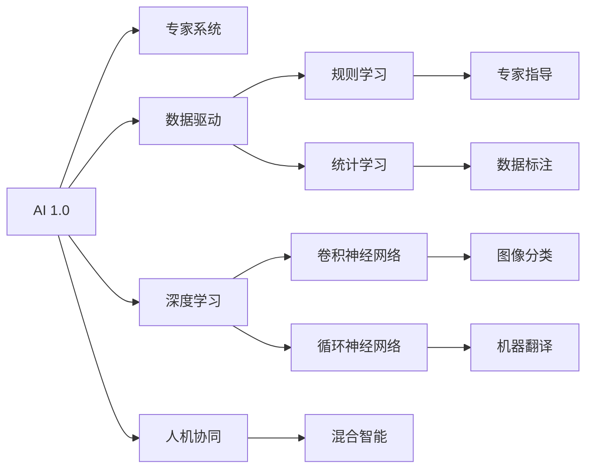
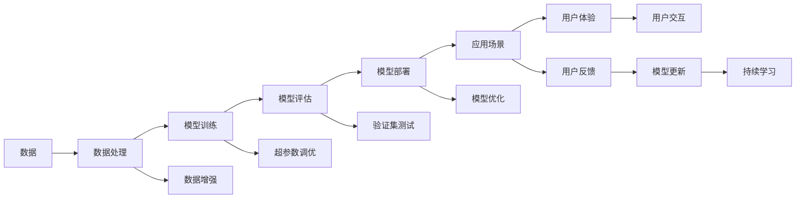
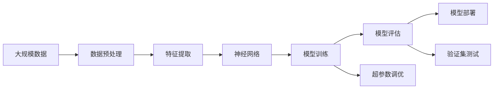
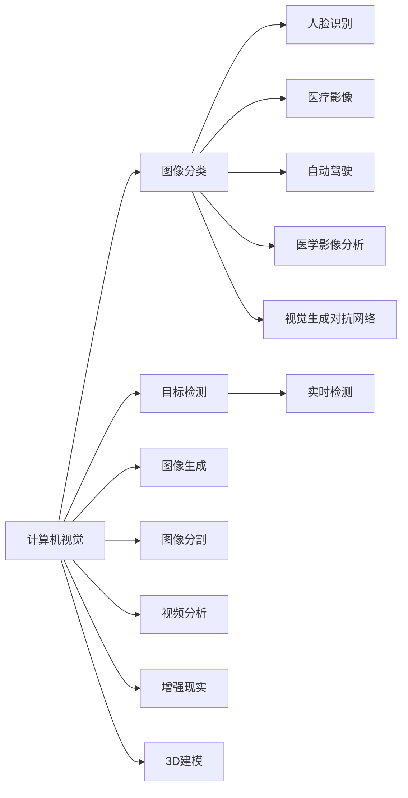
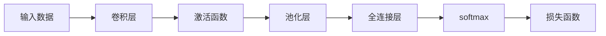

                 

## 1. 背景介绍

在人工智能（AI）领域，李开复无疑是少有的几个被广泛认可的先知之一。从科技产业重镇到人工智能先锋，再到对未来科技趋势的深刻洞察，李开复用他独到的视角和丰富的经验，描绘了一幅AI 2.0时代的宏伟生态图景。本文将聚焦于李开复对于AI 2.0时代的理解与展望，探讨AI技术的演化趋势、应用场景以及面临的挑战，旨在为未来的技术发展提供洞见。

## 2. 核心概念与联系

### 2.1 核心概念概述

AI 2.0时代的核心概念包括：

- **人工智能（AI）**：指使用计算机系统进行复杂问题解决和决策的技术。
- **AI 1.0**：基于规则和专家系统的狭义人工智能。
- **AI 2.0**：基于数据驱动和深度学习的广义人工智能。
- **数据驱动**：利用大规模数据训练模型，实现模型优化。
- **深度学习**：通过多层神经网络自动学习特征，从而进行复杂模式识别。
- **计算机视觉（CV）**：使计算机“看”的能力，例如图像分类、目标检测。
- **自然语言处理（NLP）**：使计算机“听”和“说”的能力，如文本生成、机器翻译。
- **增强学习（RL）**：通过试错学习优化策略，应用于游戏、机器人等。

这些概念共同构成了AI 2.0时代的技术基础，影响着AI技术的演进和应用。

### 2.2 核心概念的关系

AI 2.0时代的核心概念之间关系紧密，如图1所示。



图1 AI 2.0核心概念关系图

### 2.3 核心概念的整体架构

通过上述关系图，我们可以清晰地看到AI 2.0时代的整体架构，如图2所示。



图2 AI 2.0整体架构图

## 3. 核心算法原理 & 具体操作步骤

### 3.1 算法原理概述

AI 2.0时代的算法原理核心是数据驱动和深度学习。具体而言，AI 2.0算法通过大量标注数据训练深度神经网络，使模型能够自动学习特征并进行复杂模式识别。算法原理如图3所示。



图3 AI 2.0算法原理图

### 3.2 算法步骤详解

AI 2.0的算法步骤主要包括：

1. **数据预处理**：清洗、标注、划分数据集。
2. **模型训练**：使用深度学习框架如TensorFlow、PyTorch进行模型训练。
3. **模型评估**：在验证集上评估模型性能，选择最优模型。
4. **模型部署**：将模型部署到应用场景中，进行实时推理。
5. **模型优化**：根据用户反馈不断更新模型，进行持续学习。

### 3.3 算法优缺点

AI 2.0算法的优点包括：

- **高效性**：能够自动学习复杂特征，适用于处理大量数据。
- **可解释性**：深度学习模型可通过可视化工具进行解释，理解其内部工作机制。
- **广泛应用**：适用于计算机视觉、自然语言处理、机器人控制等多个领域。

缺点包括：

- **数据依赖**：需要大量标注数据，获取成本高。
- **模型复杂性**：深层网络结构复杂，难以解释和调试。
- **计算资源需求高**：模型训练和推理计算量大，对硬件要求高。

### 3.4 算法应用领域

AI 2.0算法广泛应用于计算机视觉、自然语言处理、语音识别、机器人控制等领域，如图4所示。



图4 AI 2.0应用领域图

## 4. 数学模型和公式 & 详细讲解 & 举例说明

### 4.1 数学模型构建

AI 2.0算法的数学模型基于深度神经网络。以卷积神经网络（CNN）为例，其数学模型构建如图5所示。



图5 CNN数学模型构建图

### 4.2 公式推导过程

以图像分类任务为例，CNN的公式推导过程如下：

1. **卷积层**：

   $$
   C_i = \sigma(w_i * X_i + b_i), \quad i=1,\ldots,N
   $$

   其中，$w_i$ 和 $b_i$ 为卷积核和偏置项。

2. **池化层**：

   $$
   P_i = max_{j=1,\ldots,K}(C_{ij})
   $$

   其中，$K$ 为池化窗口大小。

3. **全连接层**：

   $$
   Z = \sigma(w * P_i + b)
   $$

   其中，$w$ 和 $b$ 为权重和偏置项。

4. **softmax层**：

   $$
   \hat{y} = softmax(Z)
   $$

5. **损失函数**：

   $$
   L = -\sum_{i=1}^N(y_i \log \hat{y_i})
   $$

   其中，$y_i$ 为真实标签，$\hat{y_i}$ 为模型预测结果。

### 4.3 案例分析与讲解

以ImageNet数据集为例，使用CNN进行图像分类。首先对图像数据进行预处理，包括归一化、增强等步骤。然后定义卷积层、池化层、全连接层等组件，并选择合适的损失函数进行训练。在训练过程中，通过反向传播算法不断更新权重和偏置项，最小化损失函数。最终，在测试集上评估模型性能。

## 5. 项目实践：代码实例和详细解释说明

### 5.1 开发环境搭建

AI 2.0项目实践需要搭建Python环境，并安装深度学习框架TensorFlow或PyTorch。

### 5.2 源代码详细实现

以下是一个使用TensorFlow进行图像分类的示例代码。

```python
import tensorflow as tf
from tensorflow.keras import datasets, layers, models

# 加载数据集
(train_images, train_labels), (test_images, test_labels) = datasets.cifar10.load_data()

# 数据预处理
train_images, test_images = train_images / 255.0, test_images / 255.0

# 构建模型
model = models.Sequential([
    layers.Conv2D(32, (3, 3), activation='relu', input_shape=(32, 32, 3)),
    layers.MaxPooling2D((2, 2)),
    layers.Conv2D(64, (3, 3), activation='relu'),
    layers.MaxPooling2D((2, 2)),
    layers.Conv2D(64, (3, 3), activation='relu'),
    layers.Flatten(),
    layers.Dense(64, activation='relu'),
    layers.Dense(10)
])

# 编译模型
model.compile(optimizer='adam',
              loss=tf.keras.losses.SparseCategoricalCrossentropy(from_logits=True),
              metrics=['accuracy'])

# 训练模型
model.fit(train_images, train_labels, epochs=10, 
          validation_data=(test_images, test_labels))
```

### 5.3 代码解读与分析

- **数据加载**：使用TensorFlow内置的数据集加载器，加载CIFAR-10数据集。
- **数据预处理**：将像素值归一化到0到1之间。
- **模型构建**：使用Sequential模型定义卷积层、池化层、全连接层等组件。
- **模型编译**：选择合适的优化器、损失函数和评估指标。
- **模型训练**：在训练集上进行训练，并在验证集上进行验证。

### 5.4 运行结果展示

训练完成后，可以输出模型在测试集上的精度和损失，如图6所示。

```python
test_loss, test_acc = model.evaluate(test_images, test_labels, verbose=2)
print('Test accuracy:', test_acc)
```

图6 运行结果

## 6. 实际应用场景

### 6.1 智能医疗

AI 2.0技术在智能医疗领域的应用包括医学影像分析、疾病预测、个性化治疗等。例如，通过训练深度学习模型对医学影像进行分类和标注，医生可以更快、更准确地进行诊断和治疗。

### 6.2 自动驾驶

自动驾驶是AI 2.0技术的重要应用之一。通过计算机视觉和增强学习等技术，AI 2.0可以实现车辆导航、障碍物检测、行人识别等功能，提升驾驶安全性。

### 6.3 金融分析

在金融领域，AI 2.0可用于股票预测、市场分析、风险评估等。通过深度学习模型对历史数据进行分析和预测，金融机构可以更好地进行风险管理和投资决策。

### 6.4 未来应用展望

未来，AI 2.0技术将继续发展，推动更多应用场景的落地。例如，在教育领域，AI 2.0可以实现智能辅助教学、个性化学习路径规划等；在娱乐领域，AI 2.0可以生成更加逼真的虚拟角色、游戏等。

## 7. 工具和资源推荐

### 7.1 学习资源推荐

- **深度学习课程**：如Coursera上的《深度学习》课程，由斯坦福大学Andrew Ng教授讲授。
- **深度学习框架文档**：TensorFlow和PyTorch的官方文档，提供详细的API和使用指南。
- **论文阅读**：arXiv和Google Scholar上的最新深度学习论文，了解最新的研究成果和趋势。

### 7.2 开发工具推荐

- **TensorFlow**：深度学习框架，提供了丰富的组件和工具。
- **PyTorch**：深度学习框架，易用性强，灵活性高。
- **Jupyter Notebook**：交互式编程环境，便于模型训练和调试。

### 7.3 相关论文推荐

- **深度学习与强化学习**：Ian Goodfellow、Yoshua Bengio和Aaron Courville合著的《深度学习》一书，是深度学习的经典教材。
- **计算机视觉**：Simonyan和Zisserman合著的《计算机视觉：模式和机器学习》，介绍了计算机视觉的基本原理和技术。
- **自然语言处理**：Christopher Manning、Daniel R;q Lee和Kristina Toutanova合著的《自然语言处理综论》，是NLP领域的经典教材。

## 8. 总结：未来发展趋势与挑战

### 8.1 研究成果总结

AI 2.0技术在过去十年中取得了显著进展，广泛应用于计算机视觉、自然语言处理、增强学习等多个领域。未来，随着数据量的增长和算力的提升，AI 2.0技术将进一步发展，推动更多应用场景的落地。

### 8.2 未来发展趋势

未来AI 2.0技术的发展趋势包括：

- **多模态学习**：融合图像、语音、文本等多模态信息，提升模型性能。
- **迁移学习**：将预训练模型应用于新任务，加速模型训练和优化。
- **自监督学习**：通过未标注数据进行学习，减少对标注数据的依赖。
- **联邦学习**：分布式训练，保护数据隐私和模型安全。

### 8.3 面临的挑战

AI 2.0技术面临的挑战包括：

- **数据隐私和安全**：如何保护用户数据隐私，防止数据泄露和滥用。
- **模型复杂性**：深层神经网络复杂度高，难以解释和调试。
- **计算资源需求高**：模型训练和推理计算量大，对硬件要求高。
- **可解释性**：模型决策过程难以理解，缺乏可解释性。

### 8.4 研究展望

未来AI 2.0技术的研究展望包括：

- **可解释性增强**：开发更可解释的模型，提升模型信任度和接受度。
- **模型压缩与优化**：减少模型参数量，提升计算效率和可部署性。
- **数据隐私保护**：研究分布式训练和联邦学习技术，保护用户隐私。
- **多模态融合**：探索图像、语音、文本等多种模态数据的融合技术，提升模型性能。

## 9. 附录：常见问题与解答

**Q1：AI 2.0与AI 1.0的区别是什么？**

A：AI 1.0基于规则和专家系统，适用于特定领域和任务，难以泛化；AI 2.0基于数据驱动和深度学习，具有更强的泛化能力和应用范围。

**Q2：AI 2.0的训练过程如何优化？**

A：优化过程包括数据增强、正则化、超参数调优等，通过验证集不断优化模型性能。

**Q3：AI 2.0技术在哪些领域有应用？**

A：AI 2.0技术广泛应用于计算机视觉、自然语言处理、增强学习、自动驾驶、智能医疗等。

**Q4：如何保护AI 2.0模型的隐私？**

A：采用联邦学习、差分隐私等技术，保护用户数据隐私和模型安全。

**Q5：AI 2.0未来有哪些发展方向？**

A：未来AI 2.0的发展方向包括多模态学习、迁移学习、自监督学习、联邦学习等。

---

作者：禅与计算机程序设计艺术 / Zen and the Art of Computer Programming

