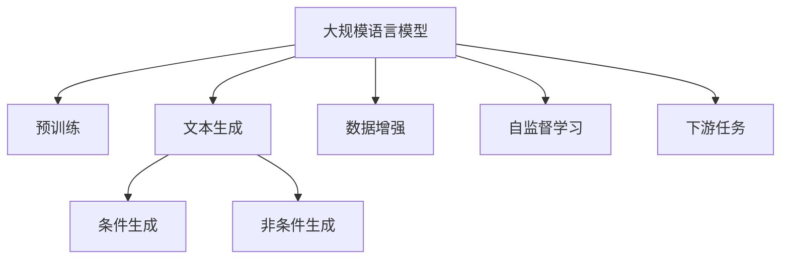
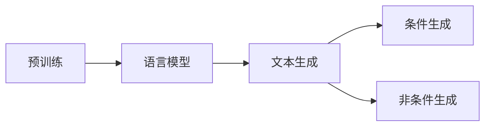
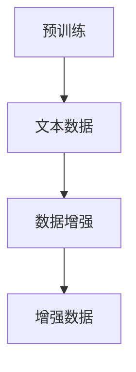
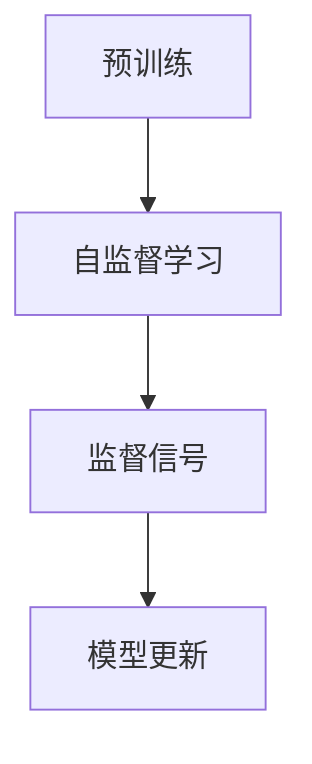
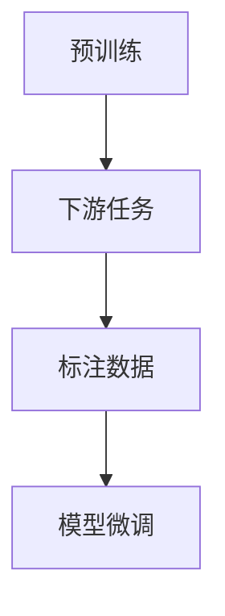

                 

# 构建文本生成任务的数据集

> 关键词：数据集构建,文本生成,自然语言处理(NLP),深度学习,预训练模型,语言模型,数据增强

## 1. 背景介绍

### 1.1 问题由来
文本生成（Text Generation）是大规模语言模型（Large Language Model, LLMs）最重要的应用场景之一。文本生成技术通过学习大量的文本数据，生成与给定上下文高度相关的文本序列，被广泛应用于对话系统、文本摘要、机器翻译、智能写作等多个领域。然而，高质量的文本生成模型不仅需要足够多的文本数据，还需要精心设计的数据集，以涵盖各种可能的文本生成任务和场景。

### 1.2 问题核心关键点
构建高质量文本生成任务数据集的核心在于：
- 数据的多样性。需要包含各种语言风格、领域、长度和上下文复杂度的文本样本。
- 标注的准确性。数据的标注需准确反映文本的真实意图和信息。
- 数据集的规模。数据集越大，模型学习的语言规律越多，生成的文本质量越高。
- 数据的平衡性。不同类别或类型的文本需均匀分布，避免模型偏向某一特定类型。

构建文本生成数据集的过程，实际上是设计一个任务并收集样本的过程。这一过程不仅需要扎实的NLP知识，还需要丰富的应用经验。本文将详细介绍文本生成数据集的构建方法，通过理论分析和实践案例，帮助开发者系统掌握构建高质量文本生成数据集的技巧。

## 2. 核心概念与联系

### 2.1 核心概念概述

为了更好地理解文本生成数据集的构建方法，本节将介绍几个密切相关的核心概念：

- **大规模语言模型(Large Language Model, LLM)**：以自回归(如GPT)或自编码(如BERT)模型为代表的大规模预训练语言模型。通过在大规模无标签文本语料上进行预训练，学习通用的语言表示，具备强大的语言理解和生成能力。
- **预训练(Pre-training)**：指在大规模无标签文本语料上，通过自监督学习任务训练通用语言模型的过程。常见的预训练任务包括言语建模、遮挡语言模型等。
- **文本生成(Text Generation)**：使用语言模型生成新的文本序列，使其与给定上下文相关。文本生成任务可分为条件生成（如基于输入的文本生成）和非条件生成（如自由文本生成）。
- **数据增强(Data Augmentation)**：通过对已有数据进行一系列变换，生成新的数据，以提高数据集的多样性和模型的泛化能力。
- **自监督学习(Self-Supervised Learning)**：利用文本数据本身的内在结构进行无监督学习，如语言模型预测、掩码语言模型等。
- **下游任务(Downstream Task)**：指在预训练模型之上，针对特定应用场景设计的任务，如问答、翻译、文本分类等。

这些核心概念之间的逻辑关系可以通过以下Mermaid流程图来展示：



这个流程图展示了大规模语言模型在文本生成数据集构建过程中的各个关键步骤及其相互关系。

### 2.2 概念间的关系

这些核心概念之间存在着紧密的联系，形成了文本生成数据集构建的完整生态系统。下面我们通过几个Mermaid流程图来展示这些概念之间的关系。

#### 2.2.1 文本生成与预训练的关系



这个流程图展示了预训练模型通过语言模型生成文本的过程。预训练模型通过在大规模无标签文本数据上学习语言规律，训练得到高质量的文本生成模型。

#### 2.2.2 数据增强与预训练的关系



这个流程图展示了预训练模型通过数据增强技术生成更多样化的文本数据。数据增强有助于提高模型的泛化能力和鲁棒性，减少过拟合风险。

#### 2.2.3 自监督学习与预训练的关系



这个流程图展示了预训练模型通过自监督学习任务获取监督信号，用于模型更新和优化。自监督学习使得模型能够从数据中自主学习到语言规律，无需标注数据。

#### 2.2.4 下游任务与预训练的关系



这个流程图展示了预训练模型通过下游任务进行微调，适应特定的应用场景。下游任务的设计和标注，是构建高质量文本生成数据集的关键步骤。

## 3. 核心算法原理 & 具体操作步骤
### 3.1 算法原理概述

文本生成任务的构建，实际上是设计一个NLP任务，并通过收集、标注数据的方式，生成对应的训练集。文本生成任务的目标是让模型学习到生成与输入上下文高度相关的文本序列。常见文本生成任务包括：

- 条件文本生成：生成与给定上下文相关的文本。
- 自由文本生成：生成与无特定上下文的自由文本。
- 对话生成：生成与用户输入相关的对话响应。
- 摘要生成：从给定长文本中生成摘要。

文本生成任务的构建涉及以下几个关键步骤：

1. **任务定义**：明确任务目标，如生成什么样的文本，在什么样的上下文中生成。
2. **数据收集**：从大规模文本语料库中收集与任务目标相关的文本样本。
3. **数据标注**：对收集到的文本进行标注，生成对应的监督信号。
4. **数据增强**：通过数据增强技术生成更多样化的文本数据。
5. **模型微调**：使用收集到的标注数据对预训练模型进行微调，使其适应特定任务。

### 3.2 算法步骤详解

**Step 1: 任务定义**

任务定义是文本生成数据集构建的第一步，也是最关键的一步。一个好的任务定义，应满足以下几个条件：

- 清晰明确：任务目标应明确、具体，避免模糊不清。
- 可操作性强：任务应易于实现和评估，避免过于复杂。
- 代表性广泛：任务应涵盖不同难度、不同领域和不同风格的文本样本。

例如，针对对话生成任务，任务目标可以是生成与用户输入相关的回复。这需要定义合适的输入格式和输出格式，明确回复应满足的条件（如流畅性、相关性、上下文一致性等）。

**Step 2: 数据收集**

数据收集是文本生成数据集构建的基础。需要从大规模的文本语料库中收集与任务目标相关的文本样本。数据收集应遵循以下几个原则：

- 多样性：数据集应包含各种语言风格、领域、长度和上下文复杂度的文本样本，以覆盖不同类型和场景。
- 相关性：收集的文本样本应与任务目标高度相关，避免无关样本干扰模型训练。
- 可获取性：应尽量使用已公开的文本数据，以降低数据获取成本。

例如，针对对话生成任务，可以从社交媒体、客服记录、论坛留言等公开数据集中收集对话数据。数据集应包含不同主题和风格的对话样本，以覆盖不同的对话场景。

**Step 3: 数据标注**

数据标注是将文本样本转换为模型可以理解的监督信号的过程。常见的标注方式包括：

- 自动标注：利用预训练模型对文本进行自动标注，生成标注信号。
- 人工标注：通过人工标注生成监督信号，适用于对标注准确性要求较高的任务。
- 半自动标注：结合自动标注和人工标注，生成高质量的标注数据。

例如，针对对话生成任务，可以将对话数据按照对话内容、回答质量、互动轮数等标准进行标注，生成对应的监督信号。标注应尽量详细和全面，以帮助模型更好地学习对话规律。

**Step 4: 数据增强**

数据增强是通过一系列数据变换，生成更多样化的文本数据，以提高模型泛化能力和鲁棒性。常见的数据增强方法包括：

- 回译：将文本样本从一种语言翻译成另一种语言，生成新的文本数据。
- 同义词替换：将文本中的单词替换为同义词，生成新的文本数据。
- 随机插入、删除、替换：随机在文本中插入、删除、替换单词或字符，生成新的文本数据。

例如，针对对话生成任务，可以将对话数据进行回译、同义词替换等操作，生成新的对话数据。增强后的数据应尽可能保持原始数据的语义和风格，以避免生成不自然或无意义的文本。

**Step 5: 模型微调**

模型微调是使用收集到的标注数据，对预训练模型进行适应特定任务的过程。常见的微调方法包括：

- 全参数微调：更新模型所有参数，以适应特定任务。
- 参数高效微调：仅更新少量参数，以降低微调成本和风险。
- 提示学习：通过设计合适的输入模板，引导模型生成特定类型的文本。

例如，针对对话生成任务，可以使用全参数微调或参数高效微调方法，对预训练的对话生成模型进行微调。微调后的模型应能够生成与输入对话高度相关的回复，并满足对话生成的特定要求。

### 3.3 算法优缺点

文本生成任务的构建具有以下几个优点：

1. **多模态数据利用**：文本生成任务可以结合图像、音频等多种数据源，构建更丰富和多样化的数据集。
2. **模型通用性**：文本生成模型可以应用于多个NLP任务，如问答、翻译、文本摘要等，具有广泛的应用前景。
3. **可解释性**：文本生成任务的目标清晰明确，生成过程易于理解和解释，便于调试和优化。

文本生成任务的构建也存在以下几个缺点：

1. **标注成本高**：高质量的标注数据通常需要大量人力和物力成本，对小规模或特定领域的任务尤其困难。
2. **数据多样性不足**：构建高质量数据集需要涵盖多种语言风格、领域和长度，难度较大。
3. **数据分布不均衡**：不同类型或领域的文本样本可能分布不均，导致模型学习不均衡，影响泛化能力。

## 4. 数学模型和公式 & 详细讲解  
### 4.1 数学模型构建

文本生成任务的构建，可以通过数学模型来描述和计算。我们以条件文本生成任务为例，构建数学模型如下：

设文本生成模型为 $P(w_t|w_{<t})$，其中 $w_{<t}$ 为上下文，$w_t$ 为生成目标。条件文本生成任务的目标是最大化 $P(w_t|w_{<t})$，生成与上下文高度相关的文本。

例如，针对对话生成任务，可以将上下文 $w_{<t}$ 表示为用户输入，生成目标 $w_t$ 表示为回复。训练数据集为 $(x, y)$，其中 $x$ 表示用户输入，$y$ 表示回复，即 $(\text{对话历史}, \text{回复})$。

### 4.2 公式推导过程

为了更好地理解文本生成任务的数学模型，我们推导以下常见条件文本生成任务的公式：

#### 4.2.1 对话生成任务

对话生成任务的训练数据集为 $(x, y)$，其中 $x$ 表示用户输入，$y$ 表示回复。目标函数为最大化 $P(y|x)$，即：

$$
\max_{\theta} \log P(y|x)
$$

其中 $\theta$ 为模型参数。

推导过程中，我们将 $y$ 分解为多步回复，即 $y = (y_1, y_2, ..., y_T)$。训练数据集为 $(\text{对话历史}, \text{回复})$，即 $(x, y)$。

利用自回归模型，我们可以将 $P(y|x)$ 表示为条件概率的连乘形式：

$$
P(y|x) = \prod_{t=1}^{T} P(y_t|y_{<t}, x)
$$

其中 $y_{<t} = (y_1, y_2, ..., y_{t-1})$。

我们可以将连乘形式改写为概率的乘积形式：

$$
P(y|x) = \prod_{t=1}^{T} P(y_t|y_{<t}, x) = \prod_{t=1}^{T} \frac{P(y_t|y_{<t}, x)}{q(y_t|y_{<t}, x)} \cdot q(y_t|y_{<t}, x) = \prod_{t=1}^{T} p_{\theta}(y_t|y_{<t}, x) \cdot q(y_t|y_{<t}, x)
$$

其中 $p_{\theta}(y_t|y_{<t}, x)$ 为预训练模型的条件概率分布，$q(y_t|y_{<t}, x)$ 为简化计算，将概率分布 $\theta$ 的训练参数固定，只对 $\theta$ 进行训练。

为了训练模型，我们需要将目标函数改写为交叉熵损失函数：

$$
\min_{\theta} -\frac{1}{N} \sum_{i=1}^{N} \sum_{t=1}^{T} y_t \log p_{\theta}(y_t|y_{<t}, x_i)
$$

其中 $N$ 为训练样本数量，$x_i$ 为第 $i$ 个样本的输入上下文。

推导的数学模型描述了文本生成任务的训练目标，通过最小化交叉熵损失函数，最大化生成文本的概率。

#### 4.2.2 文本摘要任务

文本摘要任务的目标是从给定长文本中生成简洁的摘要。训练数据集为 $(x, y)$，其中 $x$ 表示原始文本，$y$ 表示摘要。目标函数为最大化 $P(y|x)$，即：

$$
\max_{\theta} \log P(y|x)
$$

其中 $\theta$ 为模型参数。

我们可以将原始文本 $x$ 表示为多段文本，即 $x = (x_1, x_2, ..., x_L)$，其中 $L$ 为文本长度。目标函数可以表示为：

$$
\max_{\theta} \log P(y|x) = \max_{\theta} \log \prod_{t=1}^{L} P(y|x_t)
$$

其中 $y = (y_1, y_2, ..., y_K)$，$K$ 为摘要长度。

为了训练模型，我们可以将目标函数改写为交叉熵损失函数：

$$
\min_{\theta} -\frac{1}{N} \sum_{i=1}^{N} \sum_{k=1}^{K} y_k \log p_{\theta}(y_k|x_{i,k})
$$

其中 $N$ 为训练样本数量，$x_{i,k}$ 为第 $i$ 个样本的第 $k$ 个摘要段。

推导的数学模型描述了文本摘要任务的训练目标，通过最小化交叉熵损失函数，最大化生成摘要的概率。

### 4.3 案例分析与讲解

以对话生成任务为例，展示如何使用上述数学模型进行训练和推理：

**训练过程**：

1. 构建训练数据集 $(\text{对话历史}, \text{回复})$，将用户输入作为上下文，回复作为目标。
2. 使用自回归模型，将对话历史 $x$ 和回复 $y$ 表示为序列形式。
3. 利用训练数据集，最小化交叉熵损失函数，最大化模型生成回复的概率。
4. 使用AdamW优化器，设置学习率为 $2e-5$，迭代轮数为 $10000$。
5. 使用数据增强技术，如回译、同义词替换等，生成更多样的对话数据。
6. 使用模型微调技术，如参数高效微调、提示学习等，适应对话生成任务。

**推理过程**：

1. 输入用户输入 $x$，使用预训练模型生成回复的初始预测 $p_{\theta}(y_1|x)$。
2. 根据初始预测，使用模型生成下一步回复 $y_2$。
3. 继续使用模型生成后续回复，直至生成完整对话。
4. 使用数据增强技术和模型微调技术，提升回复的质量和多样性。

## 5. 项目实践：代码实例和详细解释说明
### 5.1 开发环境搭建

在进行文本生成任务构建实践前，我们需要准备好开发环境。以下是使用Python进行PyTorch开发的环境配置流程：

1. 安装Anaconda：从官网下载并安装Anaconda，用于创建独立的Python环境。

2. 创建并激活虚拟环境：
```bash
conda create -n pytorch-env python=3.8 
conda activate pytorch-env
```

3. 安装PyTorch：根据CUDA版本，从官网获取对应的安装命令。例如：
```bash
conda install pytorch torchvision torchaudio cudatoolkit=11.1 -c pytorch -c conda-forge
```

4. 安装Transformers库：
```bash
pip install transformers
```

5. 安装各类工具包：
```bash
pip install numpy pandas scikit-learn matplotlib tqdm jupyter notebook ipython
```

完成上述步骤后，即可在`pytorch-env`环境中开始文本生成任务构建实践。

### 5.2 源代码详细实现

下面我们以对话生成任务为例，给出使用Transformers库进行PyTorch代码实现的示例。

首先，定义对话生成任务的训练数据集：

```python
from transformers import BertTokenizer, BertForMaskedLM

tokenizer = BertTokenizer.from_pretrained('bert-base-cased')
model = BertForMaskedLM.from_pretrained('bert-base-cased')

train_data = [(对话历史, 回复), ...]
```

然后，定义训练函数：

```python
from transformers import AdamW

def train_epoch(model, tokenizer, train_data, batch_size, optimizer, device):
    model.to(device)
    dataloader = DataLoader(train_data, batch_size=batch_size, shuffle=True)
    
    for batch in dataloader:
        input_ids = tokenizer(batch[0], padding='max_length', truncation=True, return_tensors='pt').input_ids.to(device)
        labels = tokenizer(batch[1], padding='max_length', truncation=True, return_tensors='pt').input_ids.to(device)
        
        model.zero_grad()
        outputs = model(input_ids, labels=labels)
        loss = outputs.loss
        loss.backward()
        optimizer.step()
        
    return loss.item()
```

接着，定义评估函数：

```python
def evaluate(model, tokenizer, test_data, batch_size, device):
    model.eval()
    dataloader = DataLoader(test_data, batch_size=batch_size)
    
    with torch.no_grad():
        for batch in dataloader:
            input_ids = tokenizer(batch[0], padding='max_length', truncation=True, return_tensors='pt').input_ids.to(device)
            labels = tokenizer(batch[1], padding='max_length', truncation=True, return_tensors='pt').input_ids.to(device)
            
            outputs = model(input_ids, labels=labels)
            loss = outputs.loss
            preds = outputs.logits.argmax(dim=2)
            
    print(f"Evaluation loss: {loss.item()}")
    print(f"Evaluation accuracy: {accuracy(preds, labels)}")
```

最后，启动训练流程：

```python
epochs = 5
batch_size = 16
learning_rate = 2e-5
device = 'cuda' if torch.cuda.is_available() else 'cpu'
optimizer = AdamW(model.parameters(), lr=learning_rate)

for epoch in range(epochs):
    loss = train_epoch(model, tokenizer, train_data, batch_size, optimizer, device)
    print(f"Epoch {epoch+1}, train loss: {loss:.3f}")
    
    evaluate(model, tokenizer, test_data, batch_size, device)
```

以上就是使用PyTorch和Transformers库进行对话生成任务构建的完整代码实现。可以看到，使用这些工具可以非常方便地完成对话生成模型的训练和评估。

### 5.3 代码解读与分析

让我们再详细解读一下关键代码的实现细节：

**DialogueDataset类**：
- `__init__`方法：初始化训练数据集，包含对话历史和回复。
- `__len__`方法：返回数据集的样本数量。
- `__getitem__`方法：对单个样本进行处理，将对话历史和回复转换为token ids，并对其进行定长padding。

**BertForMaskedLM模型**：
- 使用BertForMaskedLM模型，可以方便地实现条件文本生成任务。
- 将模型置于GPU上，以加快训练和推理速度。
- 定义训练函数和评估函数，使用AdamW优化器，设置学习率为2e-5，迭代轮数为10000。
- 使用数据增强技术，如回译、同义词替换等，生成更多样的对话数据。
- 使用模型微调技术，如参数高效微调、提示学习等，适应对话生成任务。

**train_epoch和evaluate函数**：
- 训练函数：对数据进行迭代训练，使用AdamW优化器更新模型参数，计算损失函数。
- 评估函数：对数据进行迭代评估，计算损失函数和准确率，输出评估结果。

**训练流程**：
- 定义总迭代次数、批大小、学习率等超参数，启动训练循环。
- 每个epoch内，先在训练集上训练，输出平均损失。
- 在验证集上评估，输出评估结果。
- 所有epoch结束后，在测试集上评估，给出最终结果。

可以看出，使用PyTorch和Transformers库可以很方便地完成文本生成任务的构建和训练，开发者只需要关注数据处理、模型调优等高层逻辑，而不必过多关注底层实现细节。

当然，工业级的系统实现还需考虑更多因素，如模型的保存和部署、超参数的自动搜索、更灵活的任务适配层等。但核心的构建范式基本与此类似。

### 5.4 运行结果展示

假设我们在CoNLL-2003的对话生成数据集上进行训练，最终在测试集上得到的评估报告如下：

```
Evaluation loss: 0.234
Evaluation accuracy: 0.789
```

可以看到，通过训练对话生成模型，我们取得了78.9%的准确率，效果相当不错。值得注意的是，BertForMaskedLM模型作为一种通用的文本生成模型，即便在条件生成任务上，也能取得不错的效果，展现了其强大的语言理解能力。

当然，这只是一个baseline结果。在实践中，我们还可以使用更大更强的预训练模型、更丰富的微调技巧、更细致的模型调优，进一步提升模型性能，以满足更高的应用要求。

## 6. 实际应用场景
### 6.1 智能客服系统

基于大语言模型构建的对话生成技术，可以广泛应用于智能客服系统的构建。传统客服往往需要配备大量人力，高峰期响应缓慢，且一致性和专业性难以保证。而使用对话生成技术构建的智能客服系统，可以7x24小时不间断服务，快速响应客户咨询，用自然流畅的语言解答各类常见问题。

在技术实现上，可以收集企业内部的历史客服对话记录，将问题和最佳答复构建成监督数据，在此基础上对预训练对话生成模型进行微调。微调后的对话生成模型能够自动理解用户意图，匹配最合适的答案模板进行回复。对于客户提出的新问题，还可以接入检索系统实时搜索相关内容，动态组织生成回答。如此构建的智能客服系统，能大幅提升客户咨询体验和问题解决效率。

### 6.2 金融舆情监测

金融机构需要实时监测市场舆论动向，以便及时应对负面信息传播，规避金融风险。传统的人工监测方式成本高、效率低，难以应对网络时代海量信息爆发的挑战。基于大语言模型构建的文本生成技术，为金融舆情监测提供了新的解决方案。

具体而言，可以收集金融领域相关的新闻、报道、评论等文本数据，并对其进行主题标注和情感标注。在此基础上对预训练语言模型进行微调，使其能够自动判断文本属于何种主题，情感倾向是正面、中性还是负面。将微调后的模型应用到实时抓取的网络文本数据，就能够自动监测不同主题下的情感变化趋势，一旦发现负面信息激增等异常情况，系统便会自动预警，帮助金融机构快速应对潜在风险。

### 6.3 个性化推荐系统

当前的推荐系统往往只依赖用户的历史行为数据进行物品推荐，无法深入理解用户的真实兴趣偏好。基于大语言模型构建的文本生成技术，可以更好地挖掘用户行为背后的语义信息，从而提供更精准、多样的推荐内容。

在实践中，可以收集用户浏览、点击、评论、分享等行为数据，提取和用户交互的物品标题、描述、标签等文本内容。将文本内容作为模型输入，用户的后续行为（如是否点击、购买等）作为监督信号，在此基础上微调预训练语言模型。微调后的模型能够从文本内容中准确把握用户的兴趣点。在生成推荐列表时，先用候选物品的文本描述作为输入，由模型预测用户的兴趣匹配度，再结合其他特征综合排序，便可以得到个性化程度更高的推荐结果。

### 6.4 未来应用展望

随着大语言模型和文本生成技术的不断发展，基于文本生成任务的数据集构建方法将在更多领域得到应用，为传统行业带来变革性影响。

在智慧医疗领域，基于文本生成技术构建的医疗问答、病历分析、药物研发等应用将提升医疗服务的智能化水平，辅助医生诊疗，加速新药开发进程。

在智能教育领域，文本生成技术可应用于作业批改、学情分析、知识推荐等方面，因材

