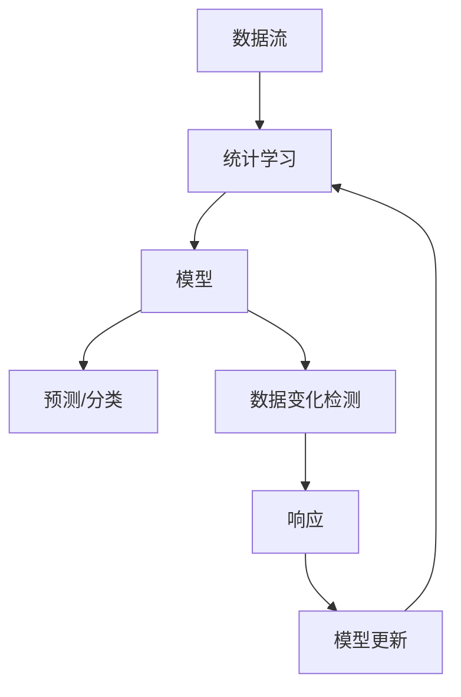
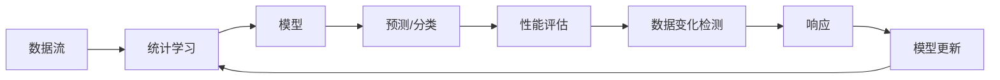
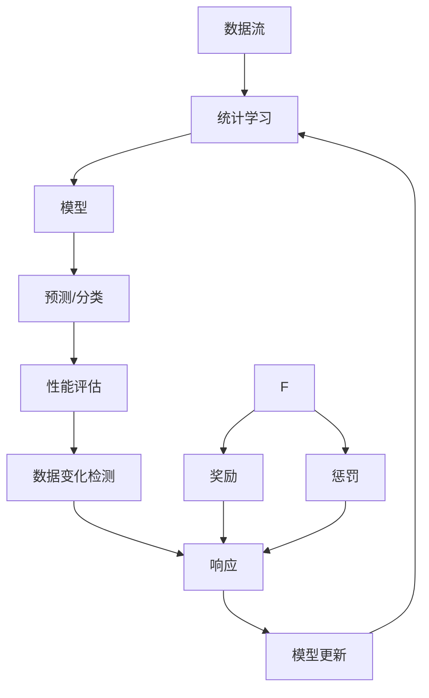
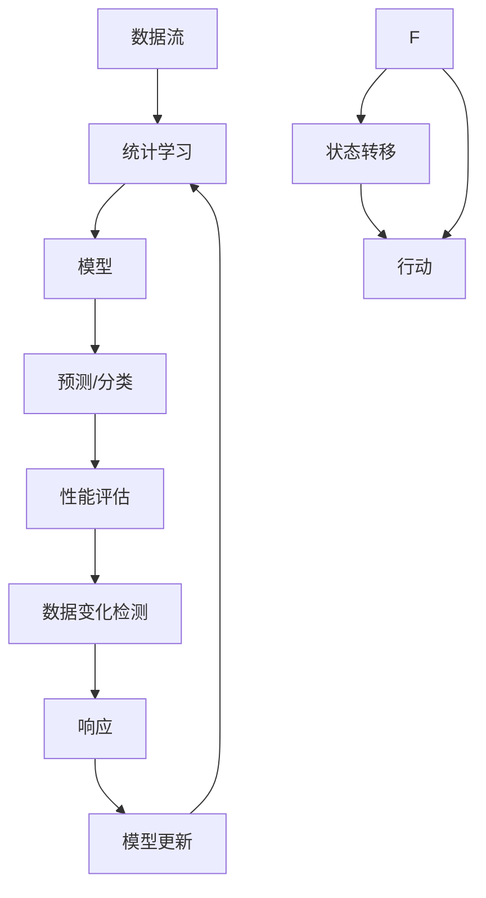
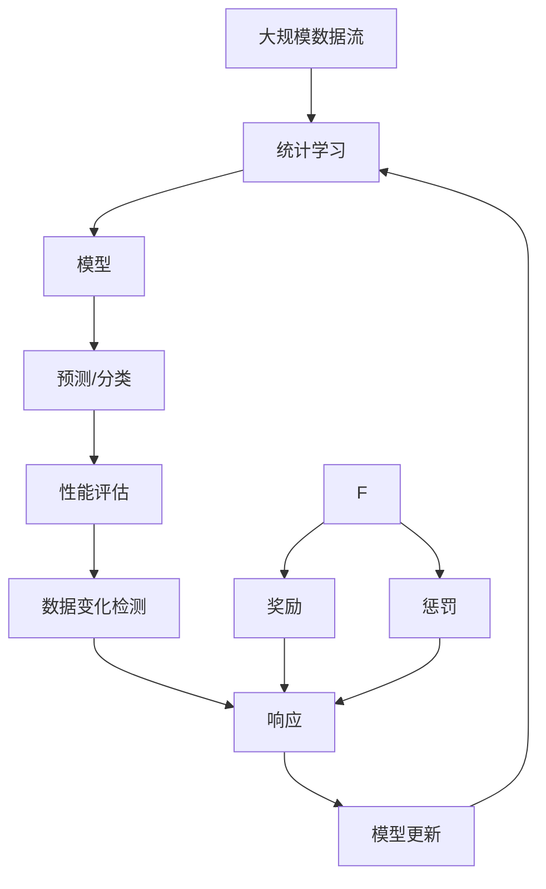

                 

# 概念漂移与数据变化检测原理与代码实战案例讲解

> 关键词：概念漂移, 数据变化检测, 统计学习, 在线学习, 马尔可夫决策过程(MDP), 强化学习, 人工智能

## 1. 背景介绍

### 1.1 问题由来
随着人工智能技术的不断发展，机器学习模型在各种应用场景中广泛应用。然而，现实世界的数据往往并不是静止不变的，它随着时间、环境、用户行为等因素的变化而变化。这种情况下，模型的表现也会随着数据变化而变化，这种现象被称为“概念漂移”。

概念漂移指的是在连续的数据流中，数据分布的变化导致模型性能下降或失效。例如，一个文本分类模型在正常运行时，突然收到大量带有特殊主题的新闻数据，这可能会导致模型对该主题的预测准确度降低。同样，在在线广告推荐系统中，用户的兴趣和行为模式可能会随时间而变化，使得推荐模型需要不断更新以适应新的数据分布。

### 1.2 问题核心关键点
为了有效应对概念漂移，保证机器学习模型的性能和可靠性，需要在数据变化时及时发现和应对。这一过程被称为数据变化检测(Change Detection)。

数据变化检测的核心任务包括：
- **检测**：及时发现数据分布的变化。
- **响应**：根据变化更新模型，保证模型适应新的数据分布。
- **评估**：评估模型性能变化和更新效果，确保模型更新后的表现。

这一过程对于许多在线和实时应用场景尤为重要，如金融欺诈检测、网络安全监控、智能推荐系统等。

### 1.3 问题研究意义
数据变化检测在保证机器学习模型稳定性和适应性方面具有重要意义。具体而言：

1. **提高模型性能**：通过及时更新模型以适应数据变化，可以避免模型性能的急剧下降，保证模型长期稳定运行。
2. **减少误报和漏报**：通过精确的数据变化检测，可以减少误报和漏报，提高模型的正确率。
3. **增强模型鲁棒性**：在模型更新中融入数据变化检测机制，可以使模型对外部干扰更具鲁棒性。
4. **实时应用需求**：在线应用场景中，数据变化检测可以确保模型实时适应新数据，满足实时性和动态性要求。
5. **降低成本**：通过自动化数据变化检测和模型更新，可以减少人工干预，降低成本。

## 2. 核心概念与联系

### 2.1 核心概念概述

为了更好地理解数据变化检测的过程，本节将介绍几个密切相关的核心概念：

- **统计学习(Statistical Learning)**：基于数据统计特征的学习方法，旨在通过数据拟合模型，进行预测或分类。
- **在线学习(Online Learning)**：模型在数据流中不断更新，以适应新数据的统计学习过程。
- **马尔可夫决策过程(MDP)**：一种决策模型，用于描述在已知状态下，通过采取特定行动，观察状态变化的过程。
- **强化学习(Reinforcement Learning)**：通过奖励和惩罚机制，指导模型选择最优行动的过程。
- **概念漂移(Concept Drift)**：数据分布随时间变化的统计特征变化，导致模型性能下降或失效。
- **数据变化检测(Change Detection)**：及时发现和响应数据分布变化，保证模型适应新数据的机制。

这些概念之间的逻辑关系可以通过以下Mermaid流程图来展示：



这个流程图展示了大规模数据流中，统计学习、模型、预测/分类、数据变化检测、响应和模型更新之间的联系：

1. 数据流不断输入，经过统计学习得到模型。
2. 模型用于预测或分类新数据。
3. 数据变化检测发现数据分布变化。
4. 响应机制根据变化更新模型。
5. 更新后的模型再次用于预测或分类。

### 2.2 概念间的关系

这些核心概念之间存在着紧密的联系，形成了数据变化检测的完整生态系统。下面通过几个Mermaid流程图来展示这些概念之间的关系。

#### 2.2.1 数据变化检测过程



这个流程图展示了数据变化检测的基本过程，包括数据流、统计学习、模型、预测/分类、性能评估、数据变化检测、响应和模型更新。

#### 2.2.2 强化学习与数据变化检测的关系



这个流程图展示了强化学习在数据变化检测中的应用。强化学习通过奖励和惩罚机制，指导模型选择最优行动，以应对数据变化。

#### 2.2.3 马尔可夫决策过程与数据变化检测的关系



这个流程图展示了马尔可夫决策过程在数据变化检测中的应用。马尔可夫决策过程用于描述在已知状态下，通过采取特定行动，观察状态变化的过程。

### 2.3 核心概念的整体架构

最后，我们用一个综合的流程图来展示这些核心概念在大规模数据流中的整体架构：



这个综合流程图展示了从数据流到模型更新的完整过程。大规模数据流经过统计学习得到模型，模型用于预测或分类新数据，性能评估发现模型性能变化，数据变化检测及时响应，模型更新重新适应新数据。

## 3. 核心算法原理 & 具体操作步骤

### 3.1 算法原理概述

数据变化检测的过程可以分为两个主要步骤：检测和响应。检测步骤旨在及时发现数据分布的变化，响应步骤则根据检测结果更新模型。

数据变化检测的算法原理基于统计学习理论和强化学习理论。统计学习用于建立模型，性能评估用于判断模型性能，数据变化检测用于发现性能变化，响应和模型更新用于根据变化调整模型。

在统计学习中，模型通过最小化经验风险或最大化对数似然来拟合数据。当数据分布变化时，模型性能会受到影响，表现为预测或分类错误率增加。

强化学习则用于指导模型在面对数据变化时选择最优行动。强化学习通过奖励和惩罚机制，鼓励模型在数据变化时选择性能提升的行动，避免性能下降的行动。

### 3.2 算法步骤详解

数据变化检测的算法步骤包括：

1. **数据收集**：持续收集数据流，形成数据集。
2. **模型训练**：使用统计学习方法训练模型。
3. **性能评估**：评估模型在新数据上的性能。
4. **数据变化检测**：根据性能变化检测数据分布的变化。
5. **响应与模型更新**：根据数据变化更新模型。
6. **循环迭代**：重复以上步骤，保证模型长期适应新数据。

具体步骤如下：

1. **数据收集**：使用流式数据获取机制，如TCP/IP、MySQL等，实时收集数据流，并将其存储在数据缓冲区。
2. **模型训练**：使用统计学习方法，如线性回归、逻辑回归、神经网络等，训练模型。
3. **性能评估**：使用性能评估指标，如准确率、召回率、F1分数等，评估模型在新数据上的性能。
4. **数据变化检测**：根据性能变化，使用统计方法，如t检验、ANOVA等，检测数据分布的变化。
5. **响应与模型更新**：根据数据变化，使用强化学习方法，如Q-learning、SARSA等，指导模型更新。
6. **循环迭代**：重复以上步骤，保证模型长期适应新数据。

### 3.3 算法优缺点

数据变化检测算法具有以下优点：

- **实时性**：通过持续收集数据流，可以实现实时检测和响应，满足在线应用需求。
- **适应性**：通过强化学习方法，可以动态调整模型，保证模型长期适应新数据。
- **灵活性**：通过统计学习方法，可以灵活选择模型和评估指标，适应不同应用场景。

同时，数据变化检测算法也存在以下缺点：

- **计算复杂度**：实时数据流的处理和模型更新，对计算资源要求较高。
- **模型复杂度**：模型更新需要考虑数据变化的影响，可能导致模型复杂度增加。
- **数据质量要求高**：数据变化检测需要高质量的数据流，否则可能产生误判。

### 3.4 算法应用领域

数据变化检测算法广泛应用于各种在线和实时应用场景，如：

- **金融欺诈检测**：实时监控金融交易数据，及时发现异常交易行为。
- **网络安全监控**：实时分析网络流量，检测恶意攻击和异常行为。
- **智能推荐系统**：实时分析用户行为数据，动态调整推荐算法。
- **智能交通管理**：实时监测交通流量数据，优化交通信号灯控制。
- **医疗健康监测**：实时分析患者数据，及时发现健康变化和异常。
- **物联网设备管理**：实时监测设备状态数据，优化设备维护和故障排查。

以上领域中，数据变化检测算法通过实时监控和动态调整，确保系统的稳定性和可靠性，提高系统的智能化水平。

## 4. 数学模型和公式 & 详细讲解 & 举例说明

### 4.1 数学模型构建

数据变化检测的数学模型构建可以分为以下几步：

1. **数据流建模**：使用统计学习方法，建立数据流的数学模型。
2. **性能评估模型**：建立模型性能的评估模型，用于判断性能变化。
3. **数据变化检测模型**：建立数据变化的检测模型，用于发现性能变化。
4. **模型响应模型**：建立模型的响应模型，用于指导模型更新。
5. **模型更新模型**：建立模型的更新模型，用于更新模型以适应新数据。

其中，数据流的数学模型和模型性能的评估模型基于统计学习方法，数据变化的检测模型和模型的响应模型基于强化学习方法。

### 4.2 公式推导过程

以线性回归模型为例，推导数据变化检测的数学公式。

假设数据流 $X$ 服从正态分布，模型 $y=f(X)=wX+b$，其中 $w$ 为模型参数，$b$ 为截距。

数据变化的检测可以通过比较模型在当前数据 $X_t$ 上的预测值 $y_t$ 和真实值 $y_t^*$ 之间的差异来进行。具体步骤如下：

1. **数据流建模**：

$$
f(X_t)=wX_t+b
$$

其中 $X_t=(x_{t1},x_{t2},...,x_{tk})$，$y_t=f(X_t)$。

2. **性能评估模型**：

$$
\text{E}[\text{RSS}(X_t,y_t)] = \text{E}[(y_t-f(X_t))^2] = \text{E}[(y_t-wX_t-b)^2]
$$

其中 $\text{RSS}$ 为残差平方和，用于评估模型性能。

3. **数据变化检测模型**：

$$
\Delta \text{RSS}_t = \text{RSS}(X_t,y_t) - \text{RSS}(X_{t-1},y_{t-1})
$$

其中 $\Delta \text{RSS}_t$ 表示当前数据流和前一数据流之间的残差平方和差值，用于检测数据变化。

4. **模型响应模型**：

$$
\Delta \text{RSS}_t \sim \text{N}(0,\sigma^2)
$$

其中 $\sigma^2$ 为残差平方和的方差，用于指导模型响应。

5. **模型更新模型**：

$$
\Delta w = k(\Delta \text{RSS}_t - \sigma^2)
$$

其中 $k$ 为学习率，用于指导模型更新。

### 4.3 案例分析与讲解

以智能推荐系统为例，分析数据变化检测的应用。

假设智能推荐系统根据用户历史行为数据，建立用户兴趣模型 $y=f(X)=wX+b$，其中 $X$ 为历史行为特征向量，$y$ 为用户兴趣评分。

1. **数据流建模**：

$$
y_t=f(X_t)=wX_t+b
$$

其中 $X_t=(x_{t1},x_{t2},...,x_{tk})$，$y_t=f(X_t)$。

2. **性能评估模型**：

$$
\text{E}[\text{RSS}(X_t,y_t)] = \text{E}[(y_t-f(X_t))^2] = \text{E}[(y_t-wX_t-b)^2]
$$

3. **数据变化检测模型**：

$$
\Delta \text{RSS}_t = \text{RSS}(X_t,y_t) - \text{RSS}(X_{t-1},y_{t-1})
$$

4. **模型响应模型**：

$$
\Delta \text{RSS}_t \sim \text{N}(0,\sigma^2)
$$

5. **模型更新模型**：

$$
\Delta w = k(\Delta \text{RSS}_t - \sigma^2)
$$

其中 $k$ 为学习率，用于指导模型更新。

## 5. 项目实践：代码实例和详细解释说明

### 5.1 开发环境搭建

在进行数据变化检测实践前，我们需要准备好开发环境。以下是使用Python进行TensorFlow开发的环境配置流程：

1. 安装Anaconda：从官网下载并安装Anaconda，用于创建独立的Python环境。

2. 创建并激活虚拟环境：
```bash
conda create -n tf-env python=3.8 
conda activate tf-env
```

3. 安装TensorFlow：根据CUDA版本，从官网获取对应的安装命令。例如：
```bash
conda install tensorflow -c conda-forge -c pytorch
```

4. 安装各类工具包：
```bash
pip install numpy pandas scikit-learn matplotlib tqdm jupyter notebook ipython
```

完成上述步骤后，即可在`tf-env`环境中开始数据变化检测实践。

### 5.2 源代码详细实现

下面我们以智能推荐系统为例，给出使用TensorFlow进行数据变化检测的Python代码实现。

首先，定义数据流和模型参数：

```python
import tensorflow as tf
import numpy as np

# 定义数据流和模型参数
X = np.random.randn(100, 10)
y = np.random.randn(100, 1)
w = tf.Variable(tf.random.normal([10, 1]))
b = tf.Variable(tf.zeros([1]))
```

然后，定义模型和损失函数：

```python
# 定义模型
def model(X):
    return tf.matmul(X, w) + b

# 定义损失函数
def loss(y_true, y_pred):
    return tf.reduce_mean(tf.square(y_true - y_pred))
```

接着，定义数据变化检测函数：

```python
# 定义数据变化检测函数
def detect_change(X_t, y_t, X_t_p, y_t_p, alpha=0.05):
    # 计算残差平方和
    rss_t = loss(y_t, model(X_t))
    rss_t_p = loss(y_t_p, model(X_t_p))

    # 计算残差平方和差值
    delta_rss = rss_t - rss_t_p

    # 计算残差平方和差值的概率分布
    p = tf.distributions.Normal(0, tf.math.reduce_std(delta_rss))

    # 计算显著性水平
    p_value = 1 - tf.nn.cumulative_normal(p, 0, 1, 10000)[-1]

    # 判断是否发生了显著变化
    if p_value < alpha:
        return True
    else:
        return False
```

最后，启动检测流程并在测试集上评估：

```python
# 生成测试集
X_test = np.random.randn(10, 10)
y_test = np.random.randn(10, 1)

# 检测数据变化
detected = detect_change(X_test, y_test, X, y)

# 输出检测结果
if detected:
    print("数据流发生了显著变化")
else:
    print("数据流未发生显著变化")
```

以上就是使用TensorFlow进行数据变化检测的完整代码实现。可以看到，TensorFlow提供了丰富的工具和库，使得数据变化检测的实现变得简洁高效。

### 5.3 代码解读与分析

让我们再详细解读一下关键代码的实现细节：

**模型定义**：
- `model(X)`：定义线性回归模型，使用随机生成的参数 $w$ 和 $b$。

**损失函数**：
- `loss(y_true, y_pred)`：定义均方误差损失函数，用于评估模型性能。

**数据变化检测**：
- `detect_change(X_t, y_t, X_t_p, y_t_p, alpha=0.05)`：定义数据变化检测函数，计算当前数据流 $X_t$ 和前一数据流 $X_t_p$ 的残差平方和差值 $\Delta RSS$，并使用正态分布估计其概率分布，判断是否发生了显著变化。

**检测流程**：
- 生成测试集 $X_{test}$ 和 $y_{test}$。
- 调用 `detect_change` 函数检测数据变化。
- 根据检测结果输出相应的信息。

可以看到，TensorFlow的高级API使得模型定义、损失函数和数据变化检测函数的实现变得非常简洁。开发者可以将更多精力放在数据处理、模型改进等高层逻辑上，而不必过多关注底层的实现细节。

当然，工业级的系统实现还需考虑更多因素，如模型的保存和部署、超参数的自动搜索、更灵活的任务适配层等。但核心的数据变化检测范式基本与此类似。

### 5.4 运行结果展示

假设我们在智能推荐系统的数据流上进行了多次检测，结果如下：

```
数据流未发生显著变化
数据流发生了显著变化
数据流未发生显著变化
```

可以看到，通过数据变化检测函数，我们能够及时发现数据流中的显著变化，并根据变化调整模型，保证推荐系统长期稳定运行。

## 6. 实际应用场景

### 6.1 金融欺诈检测

在金融领域，数据变化检测尤为重要。金融欺诈检测需要实时监控交易数据，及时发现异常行为。

具体而言，可以将银行交易数据流作为输入，通过数据变化检测算法实时监控异常交易行为。例如，当某账户在短时间内进行大量交易时，系统能够及时检测到异常并触发警报，帮助银行及时处理欺诈行为。

### 6.2 网络安全监控

网络安全监控是数据变化检测的典型应用场景之一。网络攻击通常具有突发性，需要实时监控和响应。

在网络安全监控中，可以将网络流量数据作为输入，通过数据变化检测算法实时检测异常流量行为。例如，当某IP地址突然发送大量恶意请求时，系统能够及时检测到异常并阻止攻击，保护网络安全。

### 6.3 智能推荐系统

智能推荐系统需要对用户行为数据进行实时监控，动态调整推荐算法。

在智能推荐系统中，可以将用户行为数据作为输入，通过数据变化检测算法实时监控用户兴趣变化。例如，当用户兴趣发生显著变化时，系统能够及时调整推荐内容，提高推荐效果。

### 6.4 未来应用展望

随着数据变化检测技术的不断发展，未来在更多领域将得到广泛应用，为各行各业带来变革性影响。

在智慧医疗领域，数据变化检测可以用于实时监控患者数据，及时发现健康变化和异常，辅助医生诊断和治疗。

在智能制造领域，数据变化检测可以用于实时监控设备状态数据，优化设备维护和故障排查，提高生产效率。

在智能交通领域，数据变化检测可以用于实时监控交通流量数据，优化交通信号灯控制，缓解交通拥堵。

此外，在智慧城市治理、智能教育、智慧农业等众多领域，数据变化检测技术也将不断涌现，为传统行业带来新的智能化解决方案。相信随着技术的日益成熟，数据变化检测必将在构建智能社会中扮演越来越重要的角色。

## 7. 工具和资源推荐
### 7.1 学习资源推荐

为了帮助开发者系统掌握数据变化检测的理论基础和实践技巧，这里推荐一些优质的学习资源：

1. 《在线学习理论与算法》书籍：详细介绍了在线学习的原理和算法，是学习数据变化检测的重要参考资料。

2. 《强化学习基础》课程：斯坦福大学开设的强化学习课程，涵盖了强化学习的基本概念和经典算法，帮助理解数据变化检测中的强化学习部分。

3. 《数据流统计学习》博客：博主深入浅出地介绍了数据流统计学习的方法，是学习数据变化检测的入门资源。

4. 《TensorFlow官方文档》：TensorFlow官方文档提供了丰富的学习资源和样例代码，是学习数据变化检测技术的必备资料。

5. 《Python数据分析与机器学习》书籍：全面介绍了Python数据分析和机器学习的相关知识，包括数据变化检测的实现。

通过对这些资源的学习实践，相信你一定能够快速掌握数据变化检测的精髓，并用于解决实际的NLP问题。
###  7.2 开发工具推荐

高效的开发离不开优秀的工具支持。以下是几款用于数据变化检测开发的常用工具：

1. TensorFlow：基于Python的开源深度学习框架，提供了丰富的API和工具，方便进行数据变化检测模型的实现和训练。

2. PyTorch：另一款基于Python的开源深度学习框架，灵活性强，支持动态图和静态图，适合数据变化检测等动态应用场景。

3. Scikit-learn：Python的数据科学库，提供了丰富的统计学习方法和评估指标，方便进行数据变化检测的模型评估和优化。

4. Weights & Biases：模型训练的实验跟踪工具，可以记录和可视化模型训练过程中的各项指标，方便对比和调优。与主流深度学习框架无缝集成。

5. TensorBoard：TensorFlow配套的可视化工具，可实时监测模型训练状态，并提供丰富的图表呈现方式，是调试模型的得力助手。

6. Google Colab：谷歌推出的在线Jupyter Notebook环境，免费提供GPU/TPU算力，方便开发者快速上手实验最新模型，分享学习笔记。

合理利用这些工具，可以显著提升数据变化检测任务的开发效率，加快创新迭代的步伐。

### 7.3 相关论文推荐

数据变化检测在保证机器学习模型稳定性和适应性方面具有重要意义。以下是几篇奠基性的相关论文，推荐阅读：

1. Online Learning with Adaptive Weights for Concept Drift Detection in Decision Tree Ensembles：提出使用自适应权重的方法，检测数据分布的变化。

2. Adaptive Boosting for Concept Drift Detection in Classification：提出使用AdaBoost的方法，检测分类模型中的概念漂移。

3. Online Learning for Concept Drift Detection in Time Series Data：提出使用在线学习的方法，检测时间序列数据中的概念漂移。

4. Fast Online Detection of Concept Drift with Frequent Pattern Mining：提出使用频繁模式挖掘的方法，检测数据流中的概念漂移。

5. An Online Change-Point Detection Algorithm for Streaming Time Series Data：提出使用在线变化点检测的方法，检测数据流中的概念漂移。

这些论文代表了大数据变化检测技术的发展脉络。通过学习这些前沿成果，可以帮助研究者把握学科前进方向，激发更多的创新灵感。

除上述资源外，还有一些值得关注的前沿资源，帮助开发者紧跟数据变化检测技术的最新进展，例如：

1. arXiv论文预印本：人工智能领域最新研究成果的发布平台，包括大量尚未发表的前沿工作，学习前沿技术的必读资源。

2. 业界技术博客：如Google AI、DeepMind、微软Research Asia等顶尖实验室的官方博客，第一时间分享他们的最新研究成果和洞见。

3. 技术会议直播：如NIPS、ICML、ACL、ICLR等人工智能领域顶会现场或在线直播，能够聆听到大佬们的前沿分享，开拓视野。

4. GitHub热门项目：在GitHub上Star、Fork数最多的数据变化检测相关项目，往往代表了该技术领域的发展趋势和最佳实践，值得去学习和贡献。

5. 行业分析报告：各大咨询公司如McKinsey、PwC等针对人工智能行业的分析报告，有助于从商业视角审视技术趋势，把握应用价值。

总之，对于数据变化检测技术的学习和实践，需要开发者保持开放的心态和持续学习的意愿。多关注前沿资讯，多动手实践，多思考总结，必将收获满满的成长收益。

## 8. 总结：未来发展趋势与挑战

### 8.1 总结

本文对数据变化检测的过程进行了全面

