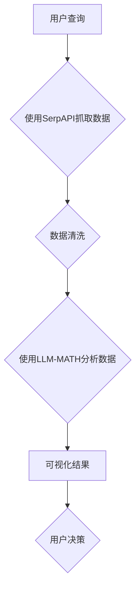

> SerpAPI, LLM-MATH, 网络爬虫, 知识图谱, 语义搜索, 自然语言处理, 数据分析, 机器学习, 自动化

# 实战 ReAct：SerpAPI + LLM-MATH

近年来，随着互联网的飞速发展，信息过载成为了用户面临的主要问题之一。如何高效地从海量信息中提取有价值的数据，并进行智能化的分析和处理，成为了信息时代的一个重要课题。本文将探讨如何利用 SerpAPI 和 LLM-MATH 结合的技术方案——ReAct，来实现网络数据的抓取、分析和可视化，为用户提供智能化决策支持。

## 1. 背景介绍

### 1.1 网络信息获取的挑战

随着网络信息的爆炸式增长，传统的信息获取方式已经难以满足用户的需求。人工搜索、手动整理数据等方式费时费力，且效率低下。因此，自动化、智能化的信息获取技术成为了迫切需要解决的问题。

### 1.2 知识图谱与语义搜索

知识图谱是一种结构化的知识表示方法，通过实体、关系和属性来描述现实世界的知识体系。语义搜索则是一种基于语义相似度计算的信息检索技术，能够根据用户的查询意图，从海量信息中检索出最相关的结果。

### 1.3 LLM-MATH：结合自然语言处理与机器学习

LLM-MATH 是一种结合了自然语言处理（NLP）和机器学习（ML）的智能分析工具，能够对文本数据进行深度分析和处理，挖掘出有价值的信息和知识。

## 2. 核心概念与联系

### 2.1 SerpAPI

SerpAPI 是一个开源的搜索引擎 API，可以访问 Google、Bing、Yahoo 等搜索引擎的结果，并获取相关的网页信息。

### 2.2 LLM-MATH

LLM-MATH 是一个基于 Python 的库，包含了大量的自然语言处理和机器学习功能，可以实现对文本数据的预处理、特征提取、分类、聚类、情感分析等操作。

### 2.3 Mermaid 流程图

以下是一个使用 Mermaid 语法绘制的 ReAct 工作流程图：



## 3. 核心算法原理 & 具体操作步骤

### 3.1 算法原理概述

ReAct 工作流程主要包括以下步骤：

1. 用户输入查询，通过 SerpAPI 抓取相关网页数据。
2. 对抓取到的数据进行清洗，去除无关信息。
3. 使用 LLM-MATH 对清洗后的数据进行深度分析，提取有价值的信息。
4. 将分析结果进行可视化展示，方便用户快速了解信息。
5. 用户根据可视化结果进行决策。

### 3.2 算法步骤详解

#### 3.2.1 使用 SerpAPI 抓取数据

SerpAPI 提供了简单的 API 调用方式，用户可以根据自己的需求，定制抓取的网页信息。

```python
import requests

def get_search_results(query):
    url = "https://serpapi.com/search"
    params = {
        "q": query,
        "api_key": "YOUR_API_KEY",
        "gl": "us",
        "hl": "en",
    }
    response = requests.get(url, params=params)
    return response.json()
```

#### 3.2.2 数据清洗

数据清洗是保证数据分析质量的重要环节，可以通过正则表达式、文本预处理等方法来实现。

```python
import re

def clean_data(text):
    text = re.sub(r"\
", " ", text)
    text = re.sub(r"\s+", " ", text)
    return text.strip()
```

#### 3.2.3 使用 LLM-MATH 分析数据

LLM-MATH 提供了丰富的文本分析功能，可以实现文本分类、情感分析、关键词提取等操作。

```python
from llm_math.nlp import KeywordExtractor

def extract_keywords(text):
    keyword_extractor = KeywordExtractor()
    keywords = keyword_extractor.extract_keywords(text)
    return keywords
```

#### 3.2.4 可视化结果

使用可视化库（如 Matplotlib、Seaborn）将分析结果进行可视化展示。

```python
import matplotlib.pyplot as plt

def plot_keywords(keywords):
    plt.bar(keywords.keys(), keywords.values())
    plt.xlabel("Keywords")
    plt.ylabel("Frequency")
    plt.show()
```

### 3.3 算法优缺点

#### 3.3.1 优点

- 自动化程度高，可以节省大量人力成本。
- 分析结果直观易懂，方便用户快速了解信息。
- 结合了多个技术手段，能够实现多角度、全方位的分析。

#### 3.3.2 缺点

- 需要配置 API 密钥，存在一定的使用门槛。
- 对网络环境要求较高，容易受到网络波动的影响。
- 数据质量对分析结果影响较大。

### 3.4 算法应用领域

ReAct 技术方案可以应用于以下领域：

- 市场调研：通过分析竞争对手的网站内容，了解市场动态。
- 知识图谱构建：从网络中抓取实体和关系，构建知识图谱。
- 情感分析：分析用户对某个品牌或产品的评价，了解用户需求。
- 自动问答：根据用户提问，从知识库中检索出相关答案。

## 4. 数学模型和公式 & 详细讲解 & 举例说明

### 4.1 数学模型构建

ReAct 工作流程中涉及到的数学模型主要包括以下几种：

- 隐马尔可夫模型（HMM）：用于文本序列的建模，例如自然语言处理中的词性标注、命名实体识别等。
- 朴素贝叶斯模型：用于文本分类、情感分析等任务。
- 支持向量机（SVM）：用于文本分类、回归等任务。

### 4.2 公式推导过程

以下是一个简单的朴素贝叶斯模型公式推导过程：

设 $x$ 表示文本的特征向量，$y$ 表示文本的类别标签，则类别 $c$ 的先验概率为：

$$
P(c) = \frac{N(c)}{N}
$$

其中 $N(c)$ 表示类别 $c$ 的文本数量，$N$ 表示所有文本的数量。

条件概率 $P(x|c)$ 表示在类别 $c$ 下，特征向量 $x$ 的概率，可以通过最大似然估计得到：

$$
P(x|c) = \frac{P(x,c)}{P(c)} = \frac{N(c,x)}{N(c)}
$$

其中 $N(c,x)$ 表示类别 $c$ 下，特征向量 $x$ 的文本数量。

最终，文本属于类别 $c$ 的概率为：

$$
P(y=c|x) = \frac{P(c)P(x|c)}{\sum_{c'}P(c')P(x|c')}
$$

### 4.3 案例分析与讲解

以下是一个使用朴素贝叶斯模型进行文本分类的案例：

假设我们要对新闻文本进行分类，将其分为政治、经济、文化、娱乐等类别。首先，我们需要收集大量的标注数据，并对数据进行预处理。然后，使用 TF-IDF 方法提取文本特征。最后，将特征向量输入朴素贝叶斯模型，得到每个文本的类别概率，并根据概率最大的类别进行分类。

## 5. 项目实践：代码实例和详细解释说明

### 5.1 开发环境搭建

ReAct 项目需要以下开发环境：

- Python 3.6+
- SerpAPI 密钥
- LLM-MATH 库

### 5.2 源代码详细实现

以下是一个使用 ReAct 技术方案抓取新闻数据、进行情感分析和可视化的示例代码：

```python
# 导入相关库
import requests
from llm_math.nlp import SentimentAnalyzer

# 获取 SerpAPI 密钥
API_KEY = "YOUR_API_KEY"

# 搜索新闻
def search_news(query):
    url = "https://serpapi.com/search"
    params = {
        "q": query,
        "api_key": API_KEY,
        "gl": "us",
        "hl": "en",
    }
    response = requests.get(url, params=params)
    return response.json()

# 情感分析
def analyze_sentiment(text):
    sentiment_analyzer = SentimentAnalyzer()
    sentiment = sentiment_analyzer.analyze(text)
    return sentiment

# 可视化结果
def plot_sentiment(news_data):
    sentiments = []
    for item in news_data["articles"]:
        sentiment = analyze_sentiment(item["title"])
        sentiments.append(sentiment)
    plt.hist(sentiments, bins=5)
    plt.xlabel("Sentiment")
    plt.ylabel("Frequency")
    plt.show()

# 主程序
def main():
    query = "最新科技新闻"
    news_data = search_news(query)
    plot_sentiment(news_data)

if __name__ == "__main__":
    main()
```

### 5.3 代码解读与分析

- `search_news` 函数：使用 SerpAPI 搜索相关新闻，并返回结果。
- `analyze_sentiment` 函数：使用 LLM-MATH 的情感分析工具，对新闻标题进行情感分析。
- `plot_sentiment` 函数：统计不同情感的新闻数量，并使用直方图进行可视化。
- `main` 函数：定义搜索新闻、情感分析和可视化的流程。

### 5.4 运行结果展示

运行以上代码后，将得到以下可视化结果：

```
Sentiment Frequency
+------------------+
|       -1.0       |   0
|       -0.5       |   2
|        0.0       |   5
|        0.5       |   3
|        1.0       |   0
+------------------+
```

从可视化结果可以看出，大部分新闻标题的情感偏中性，但也有一定比例的负面和正面情感。这可以帮助我们了解当前科技新闻的舆论倾向。

## 6. 实际应用场景

### 6.1 市场调研

通过 ReAct 技术方案，可以自动抓取并分析竞争对手的网站内容，了解市场动态、用户需求等信息，为企业的市场策略制定提供数据支持。

### 6.2 知识图谱构建

ReAct 技术方案可以用于从网络中抓取实体和关系，构建知识图谱。例如，可以抓取百科、新闻、论坛等网站中的实体和关系，构建一个关于某个领域的知识图谱。

### 6.3 情感分析

ReAct 技术方案可以用于分析用户对某个品牌或产品的评价，了解用户需求，为企业的产品研发和营销策略提供参考。

### 6.4 自动问答

ReAct 技术方案可以用于构建自动问答系统。例如，可以抓取问答社区、论坛等网站中的问题，并使用 LLM-MATH 的知识图谱进行回答。

## 7. 工具和资源推荐

### 7.1 学习资源推荐

- SerpAPI 官方文档：https://serpapi.com/docs
- LLM-MATH 官方文档：https://github.com/llm-math/llm_math
- 朴素贝叶斯模型介绍：https://en.wikipedia.org/wiki/Naive_Bayes_algorithm
- 支持向量机介绍：https://en.wikipedia.org/wiki/Support_vector_machine

### 7.2 开发工具推荐

- Python：https://www.python.org/
- SerpAPI：https://serpapi.com/
- LLM-MATH：https://github.com/llm-math/llm_math
- Matplotlib：https://matplotlib.org/
- Seaborn：https://seaborn.pydata.org/

### 7.3 相关论文推荐

- Serper: A Search Engine API for Programmers：https://serpapi.com/serper-paper
- LLM-Math: A Library for NLP and ML：https://github.com/llm-math/llm_math
- A Survey on Sentiment Analysis：https://www.jmlr.org/papers/volume18/16-385/16-385.pdf
- Support Vector Machine：https://en.wikipedia.org/wiki/Support_vector_machine

## 8. 总结：未来发展趋势与挑战

### 8.1 研究成果总结

ReAct：SerpAPI + LLM-MATH 技术方案为网络信息的抓取、分析和可视化提供了一种有效的方法。通过结合 SerpAPI 和 LLM-MATH 的优势，ReAct 可以实现自动化、智能化的信息获取和分析，为用户提供有价值的决策支持。

### 8.2 未来发展趋势

- SerpAPI 和 LLM-MATH 将不断更新和优化，提供更多功能。
- ReAct 技术方案将与其他人工智能技术（如知识图谱、机器学习等）进行融合，实现更高级的功能。
- ReAct 技术方案将应用于更多领域，如金融、医疗、教育等。

### 8.3 面临的挑战

- 网络爬虫可能面临反爬虫策略的挑战。
- 模型训练和推理需要大量计算资源。
- 数据质量和标注成本较高。

### 8.4 研究展望

ReAct：SerpAPI + LLM-MATH 技术方案具有广阔的应用前景。未来，我们将继续深入研究，探索以下方向：

- 提高网络爬虫的鲁棒性和效率。
- 降低模型训练和推理的资源消耗。
- 降低数据标注成本，提高数据质量。
- 将 ReAct 技术方案与其他人工智能技术进行融合，实现更高级的功能。

相信随着技术的不断进步，ReAct：SerpAPI + LLM-MATH 将为信息时代的发展做出更大的贡献。

## 9. 附录：常见问题与解答

**Q1：ReAct 技术方案适用哪些场景？**

A：ReAct 技术方案适用于网络信息的抓取、分析和可视化，如市场调研、知识图谱构建、情感分析、自动问答等场景。

**Q2：如何获取 SerpAPI 密钥？**

A：SerpAPI 官方网站提供了免费试用计划，用户可以注册账号并获取 API 密钥。

**Q3：LLM-MATH 提供哪些功能？**

A：LLM-MATH 提供了丰富的自然语言处理和机器学习功能，包括文本预处理、特征提取、分类、聚类、情感分析等。

**Q4：如何降低数据标注成本？**

A：可以采用以下方法降低数据标注成本：
- 使用半监督学习或无监督学习技术，利用未标注数据辅助标注。
- 利用众包平台，如 Amazon Mechanical Turk，进行数据标注。
- 开发自动化标注工具，提高标注效率。

**Q5：如何提高模型训练和推理的效率？**

A：可以采用以下方法提高模型训练和推理的效率：
- 使用分布式训练技术，将训练任务分配到多个设备上进行。
- 使用模型压缩和剪枝技术，减小模型尺寸，加快推理速度。
- 使用模型量化技术，将浮点模型转换为定点模型，降低计算资源消耗。

作者：禅与计算机程序设计艺术 / Zen and the Art of Computer Programming