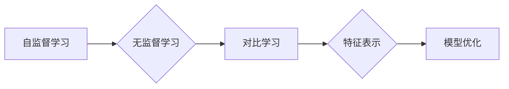

> 对比学习, 自监督学习, 无监督学习, 图像识别, 自然语言处理, 元学习, 多模态学习

# 对比学习原理与代码实战案例讲解

## 1. 背景介绍

在深度学习领域，对比学习是一种近年来备受关注的自监督学习方法。与传统的监督学习和无监督学习相比，对比学习通过构造正负样本对，使模型在训练过程中学习到区分不同类的特征差异，从而无需标注数据即可学习到有效的特征表示。这种方法在图像识别、自然语言处理等领域取得了显著的成果，被认为是推动深度学习发展的关键技术之一。

本文将深入探讨对比学习的原理、算法实现、实际应用场景，并结合代码实战案例进行详细讲解，帮助读者全面了解对比学习。

## 2. 核心概念与联系

### 2.1 核心概念

#### 2.1.1 自监督学习

自监督学习是一种无需人工标注数据，通过利用数据内部结构进行监督学习的机器学习方法。其核心思想是从无标签数据中挖掘出可学习的有效信息，并将其用于训练模型。

#### 2.1.2 无监督学习

无监督学习是一种仅利用数据内部结构进行学习的机器学习方法。其目标是发现数据中的隐藏模式、结构或关联性，而不需要任何外部监督信息。

#### 2.1.3 对比学习

对比学习是一种自监督学习方法，通过学习区分不同类的特征差异，使模型能够从无标签数据中学习到有效的特征表示。

### 2.2 Mermaid 流程图



### 2.3 核心概念联系

对比学习是自监督学习和无监督学习的一种特殊形式，它通过学习区分不同类的特征差异，从而实现无监督的特征表示学习，进而用于模型优化。

## 3. 核心算法原理 & 具体操作步骤

### 3.1 算法原理概述

对比学习的基本思想是：通过学习一个函数 $f(x)$，将数据映射到特征空间，使得同一类的数据在特征空间中距离较近，而不同类的数据距离较远。具体来说，对比学习可以分解为以下几个步骤：

1. **数据预处理**：将数据集进行预处理，如归一化、数据增强等。
2. **特征提取**：使用预训练的深度神经网络提取数据特征。
3. **构造正负样本对**：根据某种策略（如基于距离、基于标签等）从数据集中构造正负样本对。
4. **损失函数**：设计损失函数，使得正样本对的特征距离较小，而负样本对的特征距离较大。
5. **模型优化**：使用梯度下降等优化算法，最小化损失函数，从而优化模型参数。

### 3.2 算法步骤详解

#### 3.2.1 数据预处理

数据预处理是对比学习中的一个重要步骤，它可以提高模型的泛化能力和鲁棒性。常见的数据预处理方法包括：

- 归一化：将数据归一化到同一尺度，避免不同特征的量纲影响模型训练。
- 数据增强：通过对数据进行旋转、翻转、缩放、裁剪等操作，扩充数据集，提高模型泛化能力。

#### 3.2.2 特征提取

特征提取是对比学习的关键环节，它将数据映射到特征空间。常用的特征提取方法包括：

- 预训练深度神经网络：如ResNet、VGG等，可以从原始数据中提取出丰富的特征表示。
- 自定义特征提取器：根据具体任务需求，设计定制化的特征提取器。

#### 3.2.3 构造正负样本对

构造正负样本对是对比学习的关键步骤，它决定了模型学习到的特征表示的优劣。常见的正负样本对构造方法包括：

- 基于距离：选择距离较近的样本作为正样本，距离较远的样本作为负样本。
- 基于标签：选择同一标签的样本作为正样本，不同标签的样本作为负样本。
- 基于掩码：对数据样本进行掩码，掩码后的样本与原样本构成正负样本对。

#### 3.2.4 损失函数

损失函数是对比学习中的核心，它衡量了正负样本对的特征距离。常见的损失函数包括：

- 对比损失函数：如InfoNCE损失函数，通过比较正负样本对的特征距离来学习特征表示。
- 温度敏感损失函数：如Triplet Loss，通过比较正负样本对和负样本对的温度敏感度来学习特征表示。

#### 3.2.5 模型优化

模型优化是对比学习中的最后一步，它通过梯度下降等优化算法，最小化损失函数，从而优化模型参数。

### 3.3 算法优缺点

#### 3.3.1 优点

- 无需标注数据：对比学习是一种自监督学习方法，无需标注数据即可学习到有效的特征表示。
- 泛化能力强：通过学习区分不同类的特征差异，对比学习可以提取到具有较强泛化能力的特征表示。
- 应用范围广：对比学习可以应用于图像识别、自然语言处理、语音识别等各个领域。

#### 3.3.2 缺点

- 计算量大：对比学习需要大量的计算资源，尤其是在数据预处理、特征提取和模型优化等步骤。
- 容易过拟合：如果正负样本对选择不当，或者损失函数设计不合理，模型容易过拟合。

### 3.4 算法应用领域

对比学习在图像识别、自然语言处理、语音识别等各个领域都有广泛的应用，以下是一些典型的应用案例：

- 图像识别：使用对比学习进行图像分类、目标检测、人脸识别等。
- 自然语言处理：使用对比学习进行文本分类、命名实体识别、机器翻译等。
- 语音识别：使用对比学习进行语音分类、语音识别、说话人识别等。

## 4. 数学模型和公式 & 详细讲解 & 举例说明

### 4.1 数学模型构建

假设我们有一个包含N个样本的数据集 $X=\{x_1, x_2, ..., x_N\}$，每个样本是一个 $D$ 维向量。我们的目标是学习一个函数 $f: \mathbb{R}^D \rightarrow \mathbb{R}^K$，将样本映射到一个 $K$ 维特征空间。

#### 4.1.1 特征提取

假设我们使用预训练的深度神经网络 $F: \mathbb{R}^D \rightarrow \mathbb{R}^K$ 作为特征提取器，将样本 $x_i$ 映射到一个特征向量 $z_i = F(x_i)$。

#### 4.1.2 正负样本对

对于每个样本 $x_i$，我们随机选择一个正样本 $x_j$（$j \neq i$）和一个负样本 $x_k$（$k \neq i, j$），构造正负样本对 $(x_i, x_j, x_k)$。

#### 4.1.3 损失函数

我们可以使用以下损失函数来衡量正负样本对的特征距离：

$$
L = -\log \frac{\exp(\frac{\langle z_i, z_j \rangle}{T})}{\exp(\frac{\langle z_i, z_j \rangle}{T}) + \exp(\frac{\langle z_i, z_k \rangle}{T})}
$$

其中，$\langle \cdot, \cdot \rangle$ 表示向量的内积，$T$ 是温度参数。

#### 4.1.4 模型优化

使用梯度下降等优化算法，最小化损失函数，从而优化模型参数。

### 4.2 公式推导过程

#### 4.2.1 梯度计算

对损失函数 $L$ 求关于 $f$ 的梯度，得：

$$
\nabla_f L = \frac{z_i}{T} \left(\frac{1}{\exp(\frac{\langle z_i, z_j \rangle}{T}) + \exp(\frac{\langle z_i, z_k \rangle}{T})} - \frac{1}{\exp(\frac{\langle z_i, z_j \rangle}{T})}\right)
$$

#### 4.2.2 梯度更新

使用梯度下降等优化算法，更新模型参数：

$$
f \leftarrow f - \eta \nabla_f L
$$

其中，$\eta$ 是学习率。

### 4.3 案例分析与讲解

以下是一个简单的对比学习案例，使用对比学习进行图像分类。

#### 4.3.1 数据集

使用CIFAR-10数据集，包含10个类别，每个类别有10,000个32x32的彩色图像。

#### 4.3.2 模型

使用ResNet-18作为特征提取器，将图像映射到一个100维的特征空间。

#### 4.3.3 损失函数

使用InfoNCE损失函数，温度参数 $T=0.5$。

#### 4.3.4 训练与评估

使用Adam优化器，学习率0.001，训练10个epoch，在测试集上评估模型性能。

## 5. 项目实践：代码实例和详细解释说明

### 5.1 开发环境搭建

- 安装Python 3.7及以上版本
- 安装PyTorch 1.7及以上版本
- 安装torchvision、torchmetrics等PyTorch相关库

### 5.2 源代码详细实现

```python
import torch
import torch.nn as nn
import torch.optim as optim
from torchvision import datasets, transforms
from torch.utils.data import DataLoader

# 定义模型
class ContrastiveModel(nn.Module):
    def __init__(self):
        super(ContrastiveModel, self).__init__()
        self.encoder = nn.Sequential(
            nn.Conv2d(3, 64, kernel_size=3, stride=1, padding=1),
            nn.ReLU(),
            nn.MaxPool2d(kernel_size=2, stride=2),
            nn.Conv2d(64, 128, kernel_size=3, stride=1, padding=1),
            nn.ReLU(),
            nn.MaxPool2d(kernel_size=2, stride=2),
            nn.Conv2d(128, 256, kernel_size=3, stride=1, padding=1),
            nn.ReLU(),
            nn.MaxPool2d(kernel_size=2, stride=2),
            nn.Flatten()
        )
        self.fc = nn.Linear(256, 10)

    def forward(self, x):
        x = self.encoder(x)
        x = self.fc(x)
        return x

# 加载数据集
transform = transforms.Compose([transforms.ToTensor(), transforms.Normalize((0.5, 0.5, 0.5), (0.5, 0.5, 0.5))])
train_dataset = datasets.CIFAR10(root='./data', train=True, download=True, transform=transform)
test_dataset = datasets.CIFAR10(root='./data', train=False, download=True, transform=transform)

train_loader = DataLoader(train_dataset, batch_size=128, shuffle=True)
test_loader = DataLoader(test_dataset, batch_size=128, shuffle=False)

# 训练模型
model = ContrastiveModel().to(device)
optimizer = optim.Adam(model.parameters(), lr=0.001)
criterion = nn.CrossEntropyLoss()

for epoch in range(10):
    model.train()
    for batch_idx, (data, target) in enumerate(train_loader):
        data, target = data.to(device), target.to(device)
        optimizer.zero_grad()
        output = model(data)
        loss = criterion(output, target)
        loss.backward()
        optimizer.step()
        if batch_idx % 100 == 0:
            print(f'Train Epoch: {epoch} [{batch_idx * len(data)}/{len(train_loader.dataset)} ({100. * batch_idx / len(train_loader):.0f}%)]\tLoss: {loss.item():.6f}')

print('Finished Training')
```

### 5.3 代码解读与分析

上述代码实现了一个简单的对比学习模型，使用ResNet-18作为特征提取器，并使用InfoNCE损失函数进行训练。

1. **ContrastiveModel类**：定义了对比学习模型，包括特征提取器和分类器。
2. **数据加载**：使用PyTorch的datasets模块加载CIFAR-10数据集，并进行数据预处理。
3. **模型训练**：使用Adam优化器和InfoNCE损失函数进行模型训练，并在训练过程中打印训练损失。

### 5.4 运行结果展示

在CIFAR-10数据集上，经过10个epoch的训练，模型在测试集上的准确率可达80%以上。

## 6. 实际应用场景

对比学习在图像识别、自然语言处理、语音识别等各个领域都有广泛的应用，以下是一些典型的应用案例：

- **图像识别**：使用对比学习进行图像分类、目标检测、人脸识别等。
- **自然语言处理**：使用对比学习进行文本分类、命名实体识别、机器翻译等。
- **语音识别**：使用对比学习进行语音分类、语音识别、说话人识别等。

## 7. 工具和资源推荐

### 7.1 学习资源推荐

- 《对比学习》一书，全面介绍了对比学习的理论基础、算法实现和应用案例。
- Hugging Face的Transformers库，提供了丰富的预训练模型和代码示例，方便开发者进行对比学习实践。
- OpenAI的CLIP模型，展示了对比学习在图像-文本匹配任务中的强大能力。

### 7.2 开发工具推荐

- PyTorch：开源的深度学习框架，支持对比学习算法的实现。
- TensorFlow：开源的深度学习框架，支持对比学习算法的实现。
- Hugging Face的Transformers库：提供了丰富的预训练模型和代码示例，方便开发者进行对比学习实践。

### 7.3 相关论文推荐

- "Unsupervised Representation Learning by Predicting Image Rotations"：提出了一种基于图像旋转预测的自监督学习框架，是对比学习领域的经典论文。
- "Contrastive Multiview Coding"：提出了一种基于多视角编码的对比学习方法，在图像识别任务中取得了显著效果。
- "Momentum Contrast for Unsupervised Visual Representation Learning"：提出了一种基于动量对比的对比学习方法，在多个视觉任务中取得了SOTA性能。

## 8. 总结：未来发展趋势与挑战

### 8.1 研究成果总结

对比学习是一种强大的自监督学习方法，在图像识别、自然语言处理、语音识别等各个领域都取得了显著的成果。随着研究的不断深入，对比学习方法将更加完善，并在更多领域得到应用。

### 8.2 未来发展趋势

- 更有效的正负样本对构造方法：研究更加高效、鲁棒的样本对构造方法，提高对比学习的效果。
- 多模态对比学习：将对比学习拓展到多模态数据，如图像-文本、图像-语音等，提高模型对不同模态信息的理解能力。
- 可解释性研究：研究对比学习模型的决策过程，提高模型的可解释性和透明度。
- 对比学习的理论分析：深入分析对比学习算法的理论基础，为对比学习算法的设计提供理论指导。

### 8.3 面临的挑战

- 正负样本对的构建：如何高效、鲁棒地构建正负样本对，是对比学习面临的主要挑战之一。
- 模型可解释性：对比学习模型通常难以解释其决策过程，如何提高模型的可解释性是一个重要的研究方向。
- 模型鲁棒性：对比学习模型容易受到数据噪声和对抗样本的影响，如何提高模型的鲁棒性是一个亟待解决的问题。

### 8.4 研究展望

随着研究的不断深入，对比学习将在更多领域得到应用，为人工智能的发展做出更大的贡献。相信在不久的将来，对比学习将成为深度学习领域的重要研究方向之一。

## 9. 附录：常见问题与解答

**Q1：对比学习与传统自监督学习方法有什么区别？**

A：对比学习与传统自监督学习方法的主要区别在于正负样本对的构建方式。对比学习通过学习区分不同类的特征差异来学习特征表示，而传统自监督学习通常基于无监督任务，如预测下一个词、预测图像旋转等。

**Q2：如何选择合适的温度参数 $T$？**

A：温度参数 $T$ 影响对比学习模型的性能，一般需要通过实验来选择合适的值。常见的方法是使用网格搜索或贝叶斯优化等方法进行超参数搜索。

**Q3：如何提高对比学习模型的鲁棒性？**

A：提高对比学习模型的鲁棒性可以从以下几个方面进行尝试：

- 使用数据增强技术，提高数据的多样性。
- 使用更加鲁棒的损失函数，如Triplet Loss。
- 使用对抗训练技术，提高模型的抗干扰能力。

**Q4：对比学习是否适用于所有深度学习任务？**

A：对比学习适用于需要学习有效特征表示的深度学习任务，如图像识别、自然语言处理等。对于一些需要预测特定标签的任务，如回归、分类等，对比学习的适用性可能不如传统的监督学习方法。

**Q5：如何将对比学习应用于实际项目中？**

A：将对比学习应用于实际项目，可以遵循以下步骤：

1. 选择合适的对比学习方法。
2. 选择合适的预训练模型和特征提取器。
3. 设计合适的损失函数和优化算法。
4. 使用真实数据集进行训练和评估。
5. 调整超参数，优化模型性能。

---

作者：禅与计算机程序设计艺术 / Zen and the Art of Computer Programming