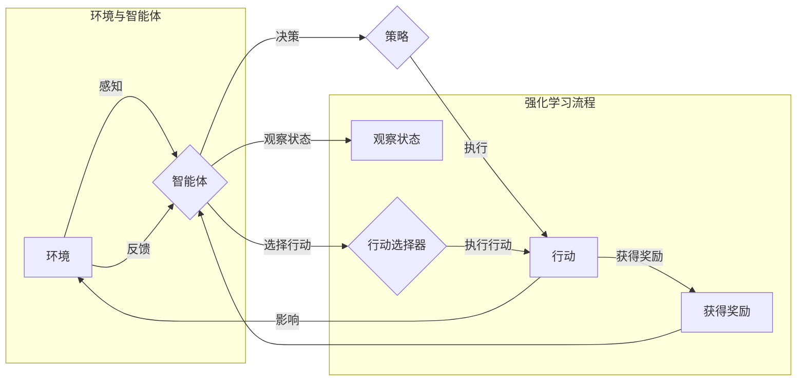

# 强化学习与AI代理工作流：策略迭代与最优解

> 关键词：强化学习，AI代理，策略迭代，最优解，马尔可夫决策过程，Q学习，深度Q网络，策略梯度方法，多智能体系统

## 1. 背景介绍

在人工智能领域，强化学习（Reinforcement Learning, RL）作为一种重要的机器学习范式，近年来取得了显著的进展。强化学习通过让智能体在动态环境中学习如何采取最佳行动，从而实现决策优化。这种学习方式在游戏、机器人、推荐系统、自动驾驶等众多领域都有广泛的应用。

AI代理（Artificial Intelligence Agent）是强化学习中的核心概念，它是一个能够感知环境、采取行动并从环境中获得奖励的智能体。在强化学习中，AI代理的目标是学习一个策略（Policy），该策略指导智能体在不同状态下采取最优行动，以最大化累积奖励。

本文将深入探讨强化学习与AI代理工作流，包括策略迭代过程、最优解的探索与实现，以及面临的挑战和未来发展趋势。

## 2. 核心概念与联系

### 2.1 核心概念

#### 强化学习
强化学习是一种通过环境与智能体之间的交互来学习如何采取最优行动的机器学习方法。它由以下几个关键要素组成：

- 状态（State）：智能体所处的环境状态。
- 行动（Action）：智能体可以采取的行动集合。
- 奖励（Reward）：智能体采取行动后从环境中获得的奖励，用于指导智能体的决策。
- 策略（Policy）：智能体采取行动的规则。
- 值函数（Value Function）：评估智能体在不同状态下的预期奖励。

#### AI代理
AI代理是强化学习中的基本实体，它能够感知环境状态、采取行动并从环境中学习。一个典型的AI代理由以下组件构成：

- 感知器（Perceptual System）：用于感知环境状态。
- 动作选择器（Action Selector）：根据策略选择适当的行动。
- 执行器（Actuator）：执行选定的行动。
- 学习器（Learning System）：根据奖励调整策略。

### 2.2 Mermaid 流程图



## 3. 核心算法原理 & 具体操作步骤

### 3.1 算法原理概述

强化学习算法的核心思想是最大化累积奖励，通过不断迭代优化智能体的策略。常见的强化学习算法包括：

- Q学习（Q-Learning）：通过值函数逼近最优策略。
- 深度Q网络（DQN）：将Q学习与深度神经网络结合，处理连续状态和行动空间。
- 策略梯度方法：直接优化策略的参数，而不是值函数。

### 3.2 算法步骤详解

#### Q学习

1. 初始化Q值表，表示每个状态-行动对的期望奖励。
2. 选择一个初始状态，选择一个随机行动或使用ε-greedy策略。
3. 执行行动，观察新的状态和奖励。
4. 更新Q值：$Q(s, a) \leftarrow Q(s, a) + \alpha [R(s, a) + \gamma \max_{a'} Q(s', a') - Q(s, a)]$
5. 返回步骤2，重复迭代。

#### DQN

1. 初始化深度神经网络Q函数，并使用经验回放缓冲区存储经验样本。
2. 选择一个初始状态，选择一个随机行动或使用ε-greedy策略。
3. 执行行动，观察新的状态和奖励。
4. 将经验样本存储到经验回放缓冲区。
5. 从经验回放缓冲区中抽取一批经验样本。
6. 使用目标网络优化Q函数参数。
7. 返回步骤2，重复迭代。

#### 策略梯度方法

1. 初始化策略网络参数。
2. 选择一个初始状态，选择一个由策略网络输出的行动。
3. 执行行动，观察新的状态和奖励。
4. 计算策略梯度。
5. 使用梯度下降优化策略网络参数。
6. 返回步骤2，重复迭代。

### 3.3 算法优缺点

#### Q学习

优点：
- 理论基础扎实，易于理解和实现。
- 能够处理离散状态和行动空间。

缺点：
- 学习速度较慢，需要大量样本。
- 对于具有多个行动和状态的复杂环境，Q值表可能过于庞大。

#### DQN

优点：
- 能够处理连续状态和行动空间。
- 通过经验回放缓冲区减少样本的相关性，提高学习效率。

缺点：
- 目标网络训练不稳定，可能导致训练过程不稳定。
- 对于具有高维状态空间的环境，神经网络结构设计复杂。

#### 策略梯度方法

优点：
- 直接优化策略参数，可能比值函数逼近方法更快收敛。
- 能够处理连续行动空间。

缺点：
- 策略梯度计算复杂，对于复杂策略难以计算。
- 可能容易陷入局部最优解。

### 3.4 算法应用领域

强化学习在以下领域有广泛的应用：

- 游戏：如Atari游戏、围棋、国际象棋等。
- 机器人：如移动机器人、无人机等。
- 自动驾驶：如无人驾驶汽车、自动驾驶自行车等。
- 推荐系统：如电影推荐、商品推荐等。
- 金融：如股票交易、风险管理等。

## 4. 数学模型和公式 & 详细讲解 & 举例说明

### 4.1 数学模型构建

强化学习的基本数学模型包括：

- 状态-行动空间：$S \times A$，表示所有可能的状态和行动的组合。
- 奖励函数：$R(s, a)$，表示在状态 $s$ 采取行动 $a$ 后获得的奖励。
- 策略：$\pi(a|s)$，表示在状态 $s$ 下采取行动 $a$ 的概率。
- 值函数：$V(s)$，表示在状态 $s$ 下的预期奖励。
- 状态-行动值函数：$Q(s, a)$，表示在状态 $s$ 采取行动 $a$ 的预期奖励。

### 4.2 公式推导过程

以下以Q学习为例，推导Q值更新的公式。

假设智能体当前处于状态 $s$，选择行动 $a$，获得奖励 $R$，转移到状态 $s'$。根据Q学习的定义，我们有：

$$
Q(s, a) = E[R + \gamma \max_{a'} Q(s', a')]
$$

其中，$E$ 表示期望值，$\gamma$ 为折扣因子，表示对未来奖励的权重。

根据定义，我们有：

$$
Q(s, a) = E[R] + \gamma E[\max_{a'} Q(s', a')]
$$

由于 $Q(s', a')$ 是一个随机变量，我们可以使用期望的期望来近似：

$$
Q(s, a) = E[R] + \gamma \max_{a'} E[Q(s', a')]
$$

由于 $R$ 和 $Q(s', a')$ 是独立的，我们可以将期望分开：

$$
Q(s, a) = E[R] + \gamma \max_{a'} E[Q(s', a')]
$$

将 $E[Q(s', a')]$ 替换为 $Q(s', a')$，得到：

$$
Q(s, a) = E[R] + \gamma \max_{a'} Q(s', a')
$$

### 4.3 案例分析与讲解

以下以一个简单的购物车问题为例，展示强化学习在现实场景中的应用。

假设有一个购物车，里面可以放入三种商品：苹果、香蕉和橙子。购物车有一个容量限制，最多只能放入两个商品。购物车中的商品有一个重量限制，每个商品重量不能超过1千克。智能体的目标是最大化购物车中的商品总价值。

定义状态为购物车中的商品组合，行动为添加或移除商品。奖励函数为当前购物车中商品的总价值。智能体需要学习一个策略，指导它在不同状态下采取最优行动。

可以使用Q学习来解决这个问题。首先，初始化Q值表，表示每个状态-行动对的期望奖励。然后，使用ε-greedy策略选择行动，执行行动后更新Q值。最终，智能体将学习到一个最优策略，指导它在不同状态下采取最优行动。

## 5. 项目实践：代码实例和详细解释说明

### 5.1 开发环境搭建

为了实现强化学习算法，我们需要搭建一个开发环境。以下是一个基于Python的简单示例：

1. 安装Python环境：Python 3.8或更高版本。
2. 安装PyTorch：用于实现强化学习算法的深度学习框架。
3. 安装OpenAI Gym：一个开源的强化学习环境库。

### 5.2 源代码详细实现

以下是一个简单的Q学习算法实现：

```python
import gym
import numpy as np

# 创建环境
env = gym.make('CartPole-v1')

# 初始化Q值表
q_table = np.zeros((env.observation_space.n, env.action_space.n))

# 学习参数
alpha = 0.1  # 学习率
gamma = 0.99  # 折扣因子
epsilon = 0.1  # ε-greedy参数

# 学习过程
num_episodes = 1000
for episode in range(num_episodes):
    state = env.reset()
    done = False
    
    while not done:
        # ε-greedy策略选择行动
        if np.random.random() < epsilon:
            action = env.action_space.sample()
        else:
            action = np.argmax(q_table[state])
        
        # 执行行动
        next_state, reward, done, _ = env.step(action)
        
        # 更新Q值
        best_future_q = np.max(q_table[next_state])
        q_table[state, action] = q_table[state, action] + alpha * (reward + gamma * best_future_q - q_table[state, action])
        
        state = next_state

# 关闭环境
env.close()

# 打印最优策略
print(q_table)
```

### 5.3 代码解读与分析

上述代码实现了Q学习算法，用于训练一个智能体在CartPole环境中稳定地完成任务的策略。

1. 首先，导入必要的库，创建环境，并初始化Q值表。
2. 设置学习参数，包括学习率、折扣因子和ε-greedy参数。
3. 进行指定数量的学习轮次，每轮次执行以下步骤：
   - 使用ε-greedy策略选择行动。
   - 执行行动，观察新的状态和奖励。
   - 更新Q值。
4. 关闭环境，并打印Q值表，展示最优策略。

### 5.4 运行结果展示

运行上述代码，可以看到智能体在CartPole环境中逐渐学会稳定地完成任务的策略。

## 6. 实际应用场景

强化学习在以下实际应用场景中取得了显著成果：

- 游戏：如AlphaGo在围棋比赛中击败人类顶尖高手。
- 机器人：如Boston Dynamics的Spot机器人。
- 自动驾驶：如Tesla的Autopilot系统。
- 推荐系统：如Netflix的电影推荐系统。
- 金融：如高频交易、风险管理等。

## 7. 工具和资源推荐

### 7.1 学习资源推荐

1. 《Reinforcement Learning: An Introduction》: Richard S. Sutton和Barto的经典教材，全面介绍了强化学习的基本概念和算法。
2. 《Deep Reinforcement Learning》: David Silver的著作，深入探讨了深度强化学习技术。
3. OpenAI Gym: 一个开源的强化学习环境库，提供了多种经典的强化学习环境，方便研究人员和开发者进行实验。

### 7.2 开发工具推荐

1. PyTorch: 一个开源的深度学习框架，支持强化学习算法的实现。
2. TensorFlow: 另一个开源的深度学习框架，也支持强化学习算法的实现。
3. OpenAI Baselines: 一个开源的强化学习库，提供了多种经典的强化学习算法实现。

### 7.3 相关论文推荐

1. Q-Learning: Ronald J. Williams的论文，介绍了Q学习算法。
2. Deep Q-Networks: Volodymyr Mnih等人的论文，介绍了DQN算法。
3. Asynchronous Advantage Actor-Critic: Sergey Levine等人的论文，介绍了A3C算法。

## 8. 总结：未来发展趋势与挑战

### 8.1 研究成果总结

强化学习作为一种强大的机器学习范式，在AI领域取得了显著的进展。通过不断的算法创新和应用拓展，强化学习在游戏、机器人、自动驾驶、推荐系统、金融等领域都取得了令人瞩目的成果。

### 8.2 未来发展趋势

未来，强化学习将呈现以下发展趋势：

- 深度强化学习：结合深度学习技术，处理更加复杂的问题。
- 多智能体强化学习：研究多个智能体之间相互协作和竞争的策略。
- 鲁棒性强化学习：提高模型对噪声和不确定性的鲁棒性。
- 强化学习与其他技术的融合：将强化学习与其他技术（如知识表示、因果推理、强化学习等）进行融合，解决更加复杂的问题。

### 8.3 面临的挑战

尽管强化学习取得了显著成果，但仍然面临着以下挑战：

- 理论基础：强化学习的理论基础仍需进一步完善。
- 计算效率：强化学习算法的计算复杂度较高，需要更高效的算法和硬件支持。
- 可解释性：强化学习模型的决策过程难以解释，需要提高模型的可解释性。

### 8.4 研究展望

为了克服上述挑战，未来的研究需要在以下方面进行探索：

- 理论基础：发展更加完善的强化学习理论，为算法设计和应用提供更坚实的理论基础。
- 计算效率：研究更加高效的算法和硬件支持，降低强化学习的计算复杂度。
- 可解释性：提高模型的可解释性，增强人们对强化学习模型的信任度。

通过不断的努力，相信强化学习将会在AI领域取得更加辉煌的成果，为人类创造更加美好的未来。

## 9. 附录：常见问题与解答

**Q1：什么是强化学习？**

A：强化学习是一种通过让智能体在动态环境中学习如何采取最佳行动的机器学习方法。它通过智能体与环境之间的交互来学习，并从环境中获得奖励，以最大化累积奖励。

**Q2：强化学习有哪些应用场景？**

A：强化学习在游戏、机器人、自动驾驶、推荐系统、金融、医疗、教育等领域都有广泛的应用。

**Q3：Q学习是什么？**

A：Q学习是一种基于值函数逼近的强化学习算法。它通过更新状态-行动值函数来学习最优策略。

**Q4：DQN是什么？**

A：DQN是一种结合深度学习和Q学习的强化学习算法。它使用深度神经网络来近似Q值函数，并使用经验回放缓冲区来减少样本的相关性。

**Q5：如何解决强化学习中的样本效率问题？**

A：可以采用以下方法来提高强化学习的样本效率：
- 经验回放：使用经验回放缓冲区存储经验样本，减少样本的相关性。
- Double Q-learning：使用两个Q值函数来减少探索-利用的冲突。
- 蒙特卡洛方法：使用蒙特卡洛方法来估计期望奖励，提高样本效率。

**Q6：如何提高强化学习模型的可解释性？**

A：可以采用以下方法来提高强化学习模型的可解释性：
- 使用可解释的神经网络架构。
- 解释模型的决策过程。
- 使用可视化工具展示模型的内部状态。

**Q7：强化学习有哪些局限性？**

A：强化学习的局限性包括：
- 计算效率低。
- 理论基础不完善。
- 可解释性差。

**Q8：未来强化学习有哪些发展方向？**

A：未来强化学习的发展方向包括：
- 深度强化学习。
- 多智能体强化学习。
- 鲁棒性强化学习。
- 强化学习与其他技术的融合。