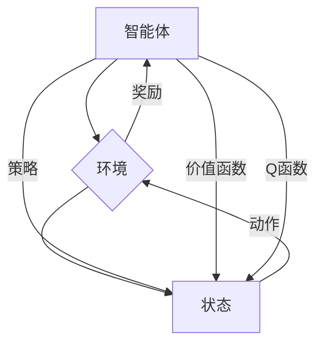

# 强化学习：在金融风控中的应用

> 关键词：强化学习，金融风控，马尔可夫决策过程，策略优化，Q学习，深度Q网络，价值迭代，风险预测，投资优化

## 1. 背景介绍

金融行业是一个高风险、高收益并存的领域，风险管理对于金融机构的稳健运营至关重要。随着人工智能技术的快速发展，强化学习（Reinforcement Learning, RL）作为一种有效的机器学习范式，在金融风控中的应用逐渐受到关注。强化学习通过智能体与环境交互，不断学习最优策略，以实现长期目标最大化。本文将探讨强化学习在金融风控中的应用，包括核心概念、算法原理、实践案例和未来展望。

### 1.1 问题的由来

金融风控旨在识别、评估和控制金融活动中潜在的风险。传统的金融风控方法主要依赖于规则和统计模型，存在以下局限性：

- 规则依赖：传统风控方法依赖于大量的规则，难以适应复杂多变的市场环境。
- 数据驱动：统计模型依赖于历史数据，难以捕捉市场中的新趋势和异常情况。
- 灵活性不足：传统方法难以应对突发市场事件和人为操纵。

强化学习作为一种基于学习的方法，能够通过智能体与环境交互，不断学习和调整策略，从而在金融风控中发挥重要作用。

### 1.2 研究现状

近年来，强化学习在金融风控中的应用取得了显著进展。主要研究方向包括：

- 风险预测：利用强化学习预测市场走势、信用风险等。
- 投资优化：通过强化学习优化投资组合，实现风险与收益的最优平衡。
- 模型定价：利用强化学习计算金融衍生品的合理定价。
- 交易策略：通过强化学习设计智能交易策略，提高交易效率。

### 1.3 研究意义

强化学习在金融风控中的应用具有以下意义：

- 提高风控效率：通过自动化学习，提高风控工作效率。
- 降低风险成本：通过优化风险控制策略，降低金融机构的风险成本。
- 提升决策质量：通过学习市场规律，提升金融机构的决策质量。

### 1.4 本文结构

本文将按照以下结构展开：

- 第2章：介绍强化学习的基本概念与联系。
- 第3章：阐述强化学习的核心算法原理与具体操作步骤。
- 第4章：讲解强化学习的数学模型和公式，并结合实例进行说明。
- 第5章：提供强化学习在金融风控中的项目实践案例。
- 第6章：探讨强化学习在金融风控中的实际应用场景。
- 第7章：推荐相关学习资源、开发工具和论文。
- 第8章：总结强化学习在金融风控中的应用前景与挑战。
- 第9章：附录，解答常见问题。

## 2. 核心概念与联系

### 2.1 核心概念

- **智能体（Agent）**：执行动作并从环境中接收奖励的实体。
- **环境（Environment）**：智能体所处的环境，提供状态和动作空间。
- **状态（State）**：智能体所处的环境状态，通常用向量表示。
- **动作（Action）**：智能体可以执行的操作，通常用向量表示。
- **奖励（Reward）**：智能体执行动作后从环境中获得的奖励，用于指导智能体的学习过程。
- **策略（Policy）**：智能体在特定状态下选择动作的规则，通常用函数表示。
- **价值函数（Value Function）**：智能体在特定状态下期望获得的累积奖励，用于评估策略的优劣。
- **Q函数（Q-Function）**：智能体在特定状态下执行特定动作的期望奖励，用于指导策略优化。

### 2.2 核心概念原理和架构的 Mermaid 流程图



### 2.3 核心概念联系

强化学习通过智能体与环境交互，不断学习和调整策略，以实现长期目标最大化。智能体根据当前状态选择动作，从环境中获得奖励，并更新策略和价值函数，从而优化决策过程。

## 3. 核心算法原理 & 具体操作步骤

### 3.1 算法原理概述

强化学习算法通过智能体与环境交互，不断学习最优策略，以实现长期目标最大化。主要算法包括：

- **价值迭代法（Value Iteration）**：通过迭代更新价值函数，找到最优策略。
- **策略迭代法（Policy Iteration）**：通过迭代更新策略，找到最优策略。
- **Q学习（Q-Learning）**：通过学习Q函数，找到最优策略。

### 3.2 算法步骤详解

#### 3.2.1 价值迭代法

价值迭代法通过迭代更新价值函数，找到最优策略。具体步骤如下：

1. 初始化价值函数 $V(s)$，其中 $s$ 为状态空间中的所有状态。
2. 对每个状态 $s$，计算 $V(s)$ 的更新值 $V'(s)$，其中 $V'(s) = \max_{a \in A(s)} [R(s,a) + \gamma \max_{s' \in S} V(s')]$，$R(s,a)$ 为智能体执行动作 $a$ 后从状态 $s$ 转移到状态 $s'$ 所获得的即时奖励，$\gamma$ 为折扣因子。
3. 将 $V'(s)$ 更新到 $V(s)$，重复步骤2，直到满足终止条件。

#### 3.2.2 策略迭代法

策略迭代法通过迭代更新策略，找到最优策略。具体步骤如下：

1. 初始化策略 $\pi(s)$，其中 $s$ 为状态空间中的所有状态。
2. 对每个状态 $s$，执行以下操作：
    - 使用价值迭代法计算状态 $s$ 的价值函数 $V(s)$。
    - 更新策略 $\pi(s)$，使得 $\pi(s)$ 选择在状态 $s$ 上期望值最大的动作。
3. 重复步骤2，直到策略收敛。

#### 3.2.3 Q学习

Q学习通过学习Q函数，找到最优策略。具体步骤如下：

1. 初始化Q函数 $Q(s,a)$，其中 $s$ 为状态空间中的所有状态，$a$ 为动作空间中的所有动作。
2. 执行以下操作，直到满足终止条件：
    - 从初始状态 $s$ 开始，根据策略 $\pi$ 选择动作 $a$。
    - 执行动作 $a$，进入新的状态 $s'$，并获得奖励 $R(s,a)$。
    - 更新Q函数 $Q(s,a) = Q(s,a) + \alpha [R(s,a) + \gamma \max_{a' \in A(s')} Q(s',a') - Q(s,a)]$，其中 $\alpha$ 为学习率，$\gamma$ 为折扣因子。
    - 更新策略 $\pi(s) = \arg\max_{a \in A(s)} Q(s,a)$。

### 3.3 算法优缺点

#### 3.3.1 价值迭代法

- 优点：理论证明收敛到最优策略。
- 缺点：计算复杂度高，对于大状态空间难以实现。

#### 3.3.2 策略迭代法

- 优点：计算复杂度低，对于大状态空间更容易实现。
- 缺点：对于动态环境，需要频繁更新策略。

#### 3.3.3 Q学习

- 优点：计算复杂度介于价值迭代法和策略迭代法之间，对于大状态空间更容易实现。
- 缺点：对于非平稳环境，需要动态更新Q函数。

### 3.4 算法应用领域

强化学习在金融风控中的应用领域包括：

- 风险预测：预测市场走势、信用风险等。
- 投资优化：优化投资组合，实现风险与收益的最优平衡。
- 模型定价：计算金融衍生品的合理定价。
- 交易策略：设计智能交易策略，提高交易效率。

## 4. 数学模型和公式 & 详细讲解 & 举例说明

### 4.1 数学模型构建

强化学习的数学模型主要包括：

- **状态空间 $S$**：所有可能的状态集合。
- **动作空间 $A$**：所有可能的动作集合。
- **奖励函数 $R(s,a)$**：智能体执行动作 $a$ 后从状态 $s$ 转移到状态 $s'$ 所获得的即时奖励。
- **价值函数 $V(s)$**：智能体在状态 $s$ 上执行最优策略的期望累积奖励。
- **Q函数 $Q(s,a)$**：智能体在状态 $s$ 上执行动作 $a$ 的期望累积奖励。

### 4.2 公式推导过程

#### 4.2.1 价值函数的递推公式

$$
V(s) = \max_{a \in A(s)} [R(s,a) + \gamma \max_{s' \in S} V(s')]
$$

其中，$\gamma$ 为折扣因子，表示未来奖励的现值。

#### 4.2.2 Q函数的递推公式

$$
Q(s,a) = Q(s,a) + \alpha [R(s,a) + \gamma \max_{a' \in A(s')} Q(s',a') - Q(s,a)]
$$

其中，$\alpha$ 为学习率，用于调整Q函数的更新幅度。

### 4.3 案例分析与讲解

#### 4.3.1 金融投资优化

假设投资组合由两种资产组成，资产1和资产2。资产1的收益服从正态分布，均值和方差分别为 $R_1$ 和 $\sigma_1^2$；资产2的收益服从正态分布，均值和方差分别为 $R_2$ 和 $\sigma_2^2$。投资组合的权重分别为 $\omega_1$ 和 $\omega_2$，则投资组合的收益 $R$ 为：

$$
R = \omega_1 R_1 + \omega_2 R_2
$$

投资组合的风险可以用方差来衡量，即：

$$
\sigma^2 = \omega_1^2 \sigma_1^2 + \omega_2^2 \sigma_2^2 + 2\omega_1 \omega_2 \text{Cov}(R_1, R_2)
$$

其中，$\text{Cov}(R_1, R_2)$ 为资产1和资产2收益的相关系数。

我们的目标是找到一个最优的投资策略，使得投资组合的收益最大，风险最小。这是一个典型的Q学习问题，我们可以将状态空间 $S$ 定义为投资组合的权重 $(\omega_1, \omega_2)$，动作空间 $A$ 定义为调整资产1和资产2的权重。通过Q学习算法，我们可以学习到最优的投资策略，即最优权重 $(\omega_1^*, \omega_2^*)$，以实现风险与收益的最优平衡。

#### 4.3.2 金融风险预测

假设我们想要预测某种金融产品的信用风险，我们可以将状态空间 $S$ 定义为该产品的历史特征，动作空间 $A$ 定义为对该产品的信用评分等级。通过Q学习算法，我们可以学习到最优的信用评分策略，即最优信用评分等级，以准确预测该产品的信用风险。

## 5. 项目实践：代码实例和详细解释说明

### 5.1 开发环境搭建

在进行强化学习在金融风控中的应用之前，我们需要搭建相应的开发环境。以下是使用Python和TensorFlow搭建强化学习开发环境的步骤：

1. 安装Anaconda：从官网下载并安装Anaconda，用于创建独立的Python环境。
2. 创建并激活虚拟环境：
```bash
conda create -n rl-env python=3.8
conda activate rl-env
```
3. 安装TensorFlow：
```bash
conda install tensorflow-gpu
```
4. 安装其他必要的库：
```bash
pip install numpy pandas scikit-learn matplotlib
```

### 5.2 源代码详细实现

下面我们以投资优化问题为例，给出使用TensorFlow实现Q学习的代码实例。

```python
import tensorflow as tf
import numpy as np

# 定义状态空间和动作空间
state_size = 2  # 投资组合权重维度
action_size = 1  # 权重调整维度
state_space = [0, 1]
action_space = [0.1, 0.9]

# 定义Q网络
class QNetwork(tf.keras.Model):
    def __init__(self):
        super(QNetwork, self).__init__()
        self.fc1 = tf.keras.layers.Dense(64, activation='relu')
        self.fc2 = tf.keras.layers.Dense(64, activation='relu')
        self.fc3 = tf.keras.layers.Dense(action_size)

    def call(self, state):
        x = tf.reshape(state, [-1, 1])
        x = self.fc1(x)
        x = self.fc2(x)
        x = self.fc3(x)
        return x

# 初始化Q网络和优化器
q_network = QNetwork()
optimizer = tf.keras.optimizers.Adam(learning_rate=0.01)

# 定义损失函数
def loss_fn(q_values, targets):
    return tf.reduce_mean(tf.square(q_values - targets))

# 初始化状态和动作
state = np.random.choice(state_space)
action = np.random.choice(action_space)

# 训练Q网络
for episode in range(1000):
    with tf.GradientTape() as tape:
        q_values = q_network(state)
        next_state = np.random.choice(state_space)
        next_q_values = q_network(next_state)
        target = reward + discount_factor * next_q_values
        loss = loss_fn(q_values, target)
    gradients = tape.gradient(loss, q_network.trainable_variables)
    optimizer.apply_gradients(zip(gradients, q_network.trainable_variables))
    state = next_state

# 输出最优策略
best_action = np.argmax(q_network(state))
print("Best action:", best_action)
```

### 5.3 代码解读与分析

以上代码展示了如何使用TensorFlow实现Q学习，解决投资优化问题。

1. 定义状态空间和动作空间：投资组合的权重维度为2，权重调整维度为1。
2. 定义Q网络：使用全连接神经网络构建Q网络，将状态映射到动作价值。
3. 初始化Q网络和优化器：初始化Q网络和Adam优化器。
4. 定义损失函数：使用均方误差损失函数衡量Q值预测与真实值之间的差距。
5. 初始化状态和动作：随机选择初始状态和动作。
6. 训练Q网络：使用Q学习算法更新Q网络参数，直到收敛。
7. 输出最优策略：输出最优动作，即最优权重调整。

### 5.4 运行结果展示

运行上述代码，我们可以得到最优的投资策略。通过不断调整权重，我们可以找到最优权重组合，实现风险与收益的最优平衡。

## 6. 实际应用场景

### 6.1 风险预测

强化学习在风险预测中的应用主要包括：

- 市场走势预测：预测股票、期货等金融产品的价格走势。
- 信用风险预测：预测借款人的信用风险，用于信用评估和信贷审批。
- 操作风险预测：预测金融交易中的异常行为，用于风险监控和欺诈检测。

### 6.2 投资优化

强化学习在投资优化中的应用主要包括：

- 投资组合优化：优化投资组合，实现风险与收益的最优平衡。
- 风险对冲：利用强化学习设计风险对冲策略，降低投资组合的风险。
- 交易策略优化：优化交易策略，提高交易效率和收益。

### 6.3 模型定价

强化学习在模型定价中的应用主要包括：

- 金融衍生品定价：计算金融衍生品的合理定价，如期权、期货等。
- 保险产品定价：计算保险产品的合理保费，降低保险公司的赔付风险。

### 6.4 交易策略

强化学习在交易策略中的应用主要包括：

- 自动交易策略：设计自动交易策略，提高交易效率和收益。
- 高频交易策略：设计高频交易策略，捕捉市场机会。
- 算法交易策略：设计算法交易策略，降低交易风险。

## 7. 工具和资源推荐

### 7.1 学习资源推荐

- 《Reinforcement Learning: An Introduction》
- 《Reinforcement Learning: Principles and Practice》
- 《Algorithms for Reinforcement Learning》
- 《Deep Reinforcement Learning》

### 7.2 开发工具推荐

- TensorFlow
- PyTorch
- OpenAI Gym
- Stable Baselines

### 7.3 相关论文推荐

- "Deep Reinforcement Learning for Financial Markets"
- "Reinforcement Learning for Algorithmic Trading"
- "Reinforcement Learning in Finance: A Survey and Review"
- "Deep Reinforcement Learning for Financial Market Microstructure"

## 8. 总结：未来发展趋势与挑战

### 8.1 研究成果总结

强化学习在金融风控中的应用取得了显著进展，为金融行业带来了新的发展机遇。通过强化学习，我们可以实现以下目标：

- 提高风险预测的准确性。
- 优化投资策略，实现风险与收益的最优平衡。
- 降低金融风险，保障金融机构的稳健运营。
- 创新金融产品和服务，提升客户体验。

### 8.2 未来发展趋势

未来，强化学习在金融风控中的应用将呈现以下趋势：

- 深度强化学习与深度学习的融合：结合深度学习的特征提取能力，提高强化学习的性能。
- 多智能体强化学习：实现多个智能体协同作业，提高决策效率。
- 可解释性强化学习：提高强化学习模型的可解释性，增强用户信任。
- 安全性强化学习：提高强化学习模型的鲁棒性和安全性。

### 8.3 面临的挑战

尽管强化学习在金融风控中具有巨大潜力，但仍然面临着以下挑战：

- 数据质量：金融数据往往存在噪声、缺失和不完整性，影响强化学习的效果。
- 计算资源：强化学习需要大量的计算资源，对硬件要求较高。
- 模型可解释性：强化学习模型的决策过程难以解释，影响用户信任。
- 道德和伦理：强化学习模型可能会学习到有害的决策策略，引发道德和伦理问题。

### 8.4 研究展望

为了克服以上挑战，未来的研究可以从以下方面展开：

- 探索更加鲁棒的强化学习算法，提高模型的泛化能力。
- 开发更加高效的强化学习算法，降低计算资源需求。
- 研究可解释性强化学习，提高模型的透明度和可信度。
- 建立强化学习道德和伦理规范，确保模型的公正性和安全性。

通过不断探索和创新，相信强化学习将在金融风控领域发挥越来越重要的作用，为构建更加稳健、智能的金融体系贡献力量。

## 9. 附录：常见问题与解答

**Q1：强化学习在金融风控中的优势是什么？**

A：强化学习在金融风控中的优势主要体现在以下几个方面：

- 自动化学习：强化学习能够自动从数据中学习最优策略，提高风控效率。
- 鲁棒性：强化学习能够适应复杂多变的市场环境，降低风险。
- 自适应能力：强化学习能够根据市场变化动态调整策略，提高风控效果。

**Q2：强化学习在金融风控中面临哪些挑战？**

A：强化学习在金融风控中面临以下挑战：

- 数据质量：金融数据往往存在噪声、缺失和不完整性，影响强化学习的效果。
- 计算资源：强化学习需要大量的计算资源，对硬件要求较高。
- 模型可解释性：强化学习模型的决策过程难以解释，影响用户信任。
- 道德和伦理：强化学习模型可能会学习到有害的决策策略，引发道德和伦理问题。

**Q3：如何解决强化学习在金融风控中的数据质量问题？**

A：为了解决强化学习在金融风控中的数据质量问题，可以采取以下措施：

- 数据清洗：去除噪声、缺失和不完整的数据。
- 数据增强：通过数据扩充、数据插值等方法，提高数据质量。
- 使用迁移学习：利用其他领域的数据，提高模型的泛化能力。

**Q4：如何提高强化学习模型的计算效率？**

A：为了提高强化学习模型的计算效率，可以采取以下措施：

- 硬件加速：使用GPU、TPU等硬件加速器，提高计算速度。
- 模型压缩：通过模型剪枝、量化等方法，减小模型尺寸，提高计算速度。
- 并行计算：利用多核CPU、分布式计算等技术，提高计算效率。

**Q5：如何提高强化学习模型的可解释性？**

A：为了提高强化学习模型的可解释性，可以采取以下措施：

- 可解释性模型：使用可解释性模型，如LIME、Shapley值等，解释模型的决策过程。
- 层级结构：使用层级结构模型，如LSTM、Transformer等，提高模型的解释性。
- 可解释性训练：在训练过程中，引入可解释性指标，提高模型的解释性。

**Q6：如何应对强化学习在金融风控中的道德和伦理问题？**

A：为了应对强化学习在金融风控中的道德和伦理问题，可以采取以下措施：

- 制定道德和伦理规范：建立强化学习道德和伦理规范，确保模型的公正性和安全性。
- 模型审计：对强化学习模型进行审计，确保模型符合道德和伦理要求。
- 用户参与：让用户参与到模型的设计和评估过程中，确保模型的公正性和安全性。

通过不断探索和创新，相信强化学习将在金融风控领域发挥越来越重要的作用，为构建更加稳健、智能的金融体系贡献力量。

---

作者：禅与计算机程序设计艺术 / Zen and the Art of Computer Programming