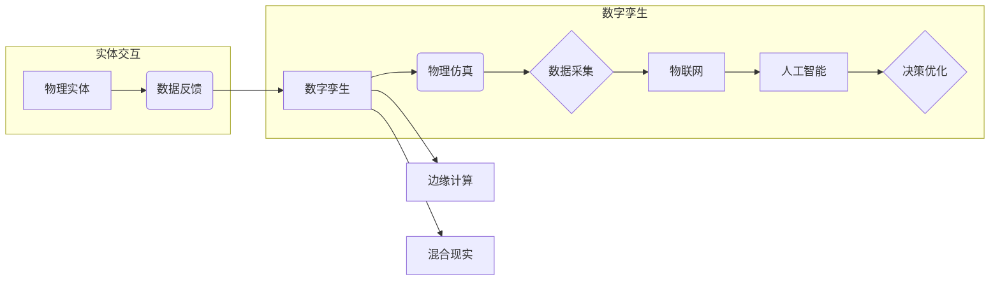

# 数字实体与物理实体的自动化前景

> 关键词：数字孪生，物理仿真，物联网，人工智能，自动化，工业4.0，边缘计算，混合现实

## 1. 背景介绍

随着信息技术的飞速发展，数字技术正在深刻地改变着我们的生产和生活方式。在工业领域，从传统的自动化到智能制造，再到如今的工业4.0，数字技术与物理实体之间的融合已经成为不可逆转的趋势。数字实体与物理实体的自动化前景，不仅代表了制造业的未来发展方向，也是推动社会经济进步的关键力量。

### 1.1 问题的由来

物理实体的生产和运营过程中，存在着效率低下、成本高昂、风险难以控制等问题。为了解决这些问题，企业和研究机构开始探索将数字技术与物理实体相结合的新方法。数字孪生技术应运而生，它通过构建物理实体的虚拟副本，实现了对物理实体的实时监控、预测性维护和优化设计。

### 1.2 研究现状

数字孪生技术已经取得了显著的研究成果，包括：

- **物理仿真**：利用计算机模拟物理实体的行为和性能。
- **物联网（IoT）**：通过传感器和网络连接，实现物理实体的数据采集和远程控制。
- **人工智能（AI）**：利用机器学习算法分析数据，优化决策过程。
- **边缘计算**：在物理实体附近进行数据处理，减少延迟和提高效率。
- **混合现实**：将虚拟信息叠加到物理世界，提供沉浸式体验。

### 1.3 研究意义

数字实体与物理实体的自动化前景对于以下几个方面具有重要意义：

- **提高生产效率**：通过自动化生产流程，减少人为错误和浪费。
- **降低运营成本**：实现预测性维护，减少停机时间，降低维护成本。
- **增强安全性**：实时监控物理实体状态，提前发现潜在风险。
- **提升设计质量**：通过虚拟原型测试，优化设计方案。

### 1.4 本文结构

本文将围绕数字实体与物理实体的自动化前景展开，主要包括以下内容：

- 核心概念与联系
- 核心算法原理与具体操作步骤
- 数学模型和公式
- 项目实践
- 实际应用场景
- 工具和资源推荐
- 总结与展望

## 2. 核心概念与联系

### 2.1 核心概念

- **数字孪生**：物理实体的虚拟副本，能够模拟物理实体的状态、行为和性能。
- **物理仿真**：利用计算机模拟物理实体的行为和性能，预测其未来状态。
- **物联网**：通过传感器和网络连接，实现物理实体的数据采集和远程控制。
- **人工智能**：利用机器学习算法分析数据，优化决策过程。
- **边缘计算**：在物理实体附近进行数据处理，减少延迟和提高效率。
- **混合现实**：将虚拟信息叠加到物理世界，提供沉浸式体验。

### 2.2 Mermaid 流程图



### 2.3 联系

数字孪生是整个过程的中心，它连接了物理仿真、数据采集、物联网、人工智能、边缘计算和混合现实等多个环节。物理实体通过数据采集将信息传递给数字孪生，数字孪生通过物理仿真和人工智能进行决策优化，然后将决策结果反馈给物理实体，实现闭环控制。

## 3. 核心算法原理与具体操作步骤

### 3.1 算法原理概述

数字孪生技术的核心算法主要包括：

- **物理建模**：建立物理实体的数学模型，描述其物理行为。
- **数据采集**：通过传感器收集物理实体的实时数据。
- **数据融合**：将来自不同来源的数据进行整合，形成统一的视图。
- **决策优化**：利用人工智能算法分析数据，优化决策过程。
- **反馈控制**：根据决策结果，对物理实体进行控制。

### 3.2 算法步骤详解

1. **物理建模**：根据物理实体的特性，建立相应的数学模型，如力学模型、热力学模型等。
2. **数据采集**：在物理实体上安装传感器，收集温度、压力、速度等数据。
3. **数据融合**：将来自不同传感器的数据进行整合，消除冗余信息，形成统一的数据视图。
4. **决策优化**：利用机器学习算法分析数据，预测物理实体的未来状态，并提出优化建议。
5. **反馈控制**：根据决策结果，调整物理实体的运行参数，实现实时控制。

### 3.3 算法优缺点

#### 优点：

- **提高效率**：自动化生产流程，减少人为错误和浪费。
- **降低成本**：实现预测性维护，减少停机时间，降低维护成本。
- **增强安全性**：实时监控物理实体状态，提前发现潜在风险。

#### 缺点：

- **技术复杂**：需要涉及多个领域的专业知识。
- **成本高昂**：初期投资较大。
- **数据安全**：需要确保数据采集和传输的安全性。

### 3.4 算法应用领域

数字孪生技术可以应用于以下领域：

- **制造业**：生产线优化、设备维护、产品研发。
- **交通运输**：车辆监控、道路规划、交通管理。
- **能源管理**：电力系统优化、能源消耗监测。
- **医疗健康**：病人监控、疾病预测、医疗设备维护。

## 4. 数学模型和公式

### 4.1 数学模型构建

物理实体的数学模型通常包含以下部分：

- **状态变量**：描述物理实体的状态，如速度、位置、温度等。
- **输入变量**：描述对物理实体施加的外部影响，如力、扭矩等。
- **输出变量**：描述物理实体的响应，如加速度、位移等。

### 4.2 公式推导过程

以一个简单的力学模型为例，其运动方程可以表示为：

$$
m \frac{d^2 x}{dt^2} = F
$$

其中，$m$ 是质量，$x$ 是位置，$t$ 是时间，$F$ 是作用力。

### 4.3 案例分析与讲解

以智能工厂为例，工厂的数字孪生模型可以通过以下步骤进行构建：

1. **建立物理模型**：根据工厂的实际情况，建立生产线、设备、物料等的物理模型。
2. **数据采集**：在工厂的各个设备上安装传感器，收集温度、压力、流量等数据。
3. **数据融合**：将来自不同传感器的数据进行整合，形成统一的数据视图。
4. **决策优化**：利用机器学习算法分析数据，预测设备的状态，并提出维护建议。
5. **反馈控制**：根据决策结果，调整设备的运行参数，实现实时控制。

通过数字孪生技术，工厂可以实时监控生产线的状态，预测设备故障，优化生产流程，提高生产效率。

## 5. 项目实践：代码实例和详细解释说明

### 5.1 开发环境搭建

为了进行数字孪生项目的实践，我们需要以下开发环境：

- 操作系统：Windows、Linux或macOS
- 编程语言：Python
- 库和框架：NumPy、SciPy、Matplotlib、Pandas、TensorFlow或PyTorch

### 5.2 源代码详细实现

以下是一个简单的数字孪生项目示例，其中包含物理模型的建立、数据采集、数据融合和决策优化的代码：

```python
import numpy as np
import matplotlib.pyplot as plt
from scipy.integrate import odeint

# 物理模型
def model(y, t, m, k):
    x, v = y
    dxdt = v
    dvdt = -k * v
    return [dxdt, dvdt]

# 参数初始化
m = 1.0  # 质量
k = 0.1  # 摩擦系数
t = np.linspace(0, 10, 100)  # 时间
initial_conditions = [1.0, 0.0]  # 初始条件

# 求解微分方程
solution = odeint(model, initial_conditions, t)

# 绘制结果
plt.plot(t, solution[:, 0])
plt.xlabel('时间')
plt.ylabel('位置')
plt.title('运动轨迹')
plt.show()
```

### 5.3 代码解读与分析

上述代码实现了一个简单的单自由度弹簧-阻尼系统。通过求解微分方程，我们可以得到系统的运动轨迹。

### 5.4 运行结果展示

运行上述代码后，将生成一个运动轨迹图，展示系统在不同时间点的位置。

## 6. 实际应用场景

### 6.1 智能工厂

在智能工厂中，数字孪生技术可以用于：

- **生产线优化**：通过分析生产数据，优化生产流程，提高生产效率。
- **设备维护**：通过预测性维护，减少设备故障，降低维护成本。
- **产品研发**：通过虚拟原型测试，优化设计方案，缩短研发周期。

### 6.2 智能交通

在智能交通领域，数字孪生技术可以用于：

- **车辆监控**：实时监控车辆状态，提高交通安全。
- **道路规划**：通过分析交通数据，优化道路设计，提高交通效率。
- **交通管理**：通过实时监控交通流量，实施智能交通管理。

### 6.3 智能能源

在智能能源领域，数字孪生技术可以用于：

- **电力系统优化**：通过分析电力数据，优化电力系统运行，提高供电可靠性。
- **能源消耗监测**：通过监测能源消耗数据，提高能源利用效率。
- **智能调度**：通过分析能源数据，优化能源调度，降低能源成本。

## 7. 工具和资源推荐

### 7.1 学习资源推荐

- 《数字孪生：原理与应用》
- 《物联网技术与应用》
- 《机器学习：一种算法视角》
- 《边缘计算：原理与应用》

### 7.2 开发工具推荐

- **编程语言**：Python
- **库和框架**：NumPy、SciPy、Matplotlib、Pandas、TensorFlow或PyTorch
- **开发平台**：Jupyter Notebook、Visual Studio Code

### 7.3 相关论文推荐

- "Digital Twin: A Survey" (IEEE Access)
- "Digital Twin Technologies for the Industrial Internet of Things" (IEEE Transactions on Industrial Informatics)
- "Digital Twin-Based Industrial Internet of Things: A Survey" (IEEE Transactions on Industrial Informatics)

## 8. 总结：未来发展趋势与挑战

### 8.1 研究成果总结

数字孪生技术是数字实体与物理实体自动化前景的重要组成部分。通过物理仿真、物联网、人工智能、边缘计算和混合现实等技术，数字孪生技术能够实现对物理实体的实时监控、预测性维护和优化设计，从而提高生产效率、降低运营成本、增强安全性。

### 8.2 未来发展趋势

未来，数字孪生技术将呈现以下发展趋势：

- **更加智能**：通过引入更先进的算法，使数字孪生技术更加智能，能够更好地理解和预测物理实体的行为。
- **更加互联**：通过物联网技术，实现数字孪生与物理实体的实时连接，实现更高效的数据采集和传输。
- **更加开放**：通过开放接口和标准，使数字孪生技术更加易于集成和应用。

### 8.3 面临的挑战

数字孪生技术面临以下挑战：

- **数据质量**：数据是数字孪生的基础，数据质量直接影响数字孪生的准确性和可靠性。
- **模型复杂度**：物理实体的数学模型复杂，需要高效的算法进行求解。
- **安全性和隐私**：数字孪生涉及到大量敏感数据，需要确保数据的安全性和隐私。

### 8.4 研究展望

为了应对挑战，未来的研究需要关注以下方向：

- **数据融合**：开发高效的数据融合算法，提高数据质量。
- **模型简化**：开发简化的物理模型，降低模型复杂度。
- **安全性设计**：设计安全性和隐私保护机制，确保数字孪生系统的安全性。

通过不断的技术创新和突破，数字孪生技术必将为数字实体与物理实体的自动化前景提供强大的动力，推动社会经济的持续发展。

## 9. 附录：常见问题与解答

**Q1：数字孪生技术的主要应用领域有哪些？**

A：数字孪生技术可以应用于制造业、交通运输、能源管理、医疗健康等多个领域。

**Q2：数字孪生技术需要哪些关键技术支持？**

A：数字孪生技术需要物理仿真、物联网、人工智能、边缘计算和混合现实等关键技术支持。

**Q3：数字孪生技术的优势是什么？**

A：数字孪生技术的优势包括提高生产效率、降低运营成本、增强安全性等。

**Q4：数字孪生技术面临哪些挑战？**

A：数字孪生技术面临数据质量、模型复杂度、安全性和隐私等挑战。

**Q5：如何确保数字孪生系统的安全性？**

A：确保数字孪生系统的安全性需要设计安全性和隐私保护机制，如数据加密、访问控制等。

作者：禅与计算机程序设计艺术 / Zen and the Art of Computer Programming