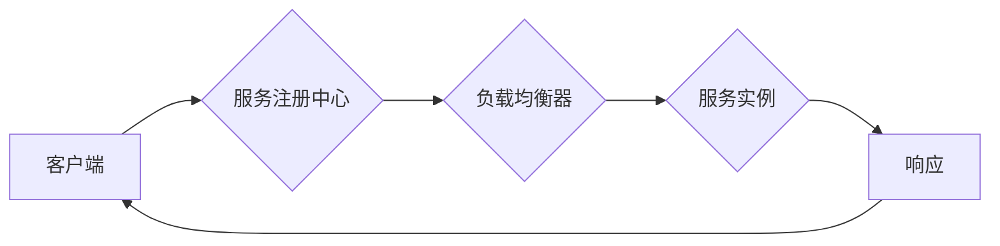

## 服务注册中心与负载均衡器实例

> 关键词：服务注册中心、负载均衡、微服务架构、API 网关、服务发现、健康检查、动态路由、高可用性

## 1. 背景介绍

随着软件架构的演进，微服务架构逐渐成为主流，它将大型应用程序拆分成多个小型、独立的服务，每个服务负责特定的功能。这种架构模式带来了许多好处，例如：

* **松耦合性:** 微服务之间相互独立，降低了系统整体的复杂度和维护成本。
* **可扩展性:** 每个服务可以独立部署和扩展，满足不同业务需求。
* **弹性:** 某个服务出现故障时，不会影响其他服务正常运行。

然而，微服务架构也带来了新的挑战，其中之一就是服务发现和负载均衡。在传统的单体架构中，服务之间通过硬编码的方式进行通信，而微服务架构中，服务需要动态地发现彼此的位置和状态。

服务注册中心和负载均衡器是解决微服务架构中服务发现和负载均衡问题的关键组件。

## 2. 核心概念与联系

### 2.1 服务注册中心

服务注册中心是一个集中式的服务发现平台，它维护着所有微服务的元数据信息，例如服务名称、地址、端口、健康状态等。微服务在启动时会向注册中心注册自身信息，其他微服务可以通过注册中心查询服务信息并与其进行通信。

### 2.2 负载均衡器

负载均衡器负责将请求分发到不同的后端服务实例，以提高系统的吞吐量和可用性。它可以根据不同的策略，例如轮询、加权轮询、最小连接数等，将请求分配到不同的服务实例。

### 2.3 服务注册中心与负载均衡器的联系

服务注册中心和负载均衡器协同工作，实现微服务架构中的服务发现和负载均衡。

* 服务注册中心提供服务元数据信息，负载均衡器根据这些信息选择合适的服务实例进行请求分发。
* 负载均衡器可以将请求转发到注册中心注册的服务实例，并根据服务健康状态进行动态路由。

**Mermaid 流程图**



## 3. 核心算法原理 & 具体操作步骤

### 3.1 算法原理概述

服务注册中心和负载均衡器通常采用以下算法原理：

* **服务发现算法:** 

    * **心跳机制:** 服务实例定期向注册中心发送心跳包，以证明其健康状态。注册中心会根据心跳包的频率判断服务实例是否在线。
    * **服务订阅:** 客户端可以订阅特定服务类型的服务信息，注册中心会将匹配的服务信息推送给客户端。

* **负载均衡算法:**

    * **轮询算法:** 将请求按照循环的方式分发到不同的服务实例。
    * **加权轮询算法:** 根据服务实例的权重，分配请求的比例。
    * **最小连接数算法:** 将请求分配到连接数最少的服务实例。

### 3.2 算法步骤详解

**服务发现算法步骤:**

1. 服务实例启动时，向注册中心注册自身信息，包括服务名称、地址、端口、健康状态等。
2. 客户端需要访问某个服务时，查询注册中心获取该服务的最新信息。
3. 注册中心根据客户端的请求，返回匹配的服务实例信息。

**负载均衡算法步骤:**

1. 客户端发送请求到负载均衡器。
2. 负载均衡器根据负载均衡算法，选择合适的服务实例进行请求转发。
3. 服务实例处理请求并返回响应。
4. 负载均衡器将响应转发给客户端。

### 3.3 算法优缺点

**服务发现算法:**

* **优点:** 

    * 动态发现服务，适应服务实例的动态变化。
    * 提高服务的可用性，即使某个服务实例故障，其他服务实例仍然可以正常运行。

* **缺点:**

    * 增加系统的复杂度，需要维护注册中心和心跳机制。
    * 可能存在服务注册延迟和数据不一致问题。

**负载均衡算法:**

* **优点:**

    * 提高系统的吞吐量和可用性。
    * 降低单个服务实例的压力，提高系统的稳定性。

* **缺点:**

    * 算法选择需要根据实际情况进行调整，不同的算法适用于不同的场景。
    * 可能存在请求分配不均衡的问题。

### 3.4 算法应用领域

服务注册中心和负载均衡器广泛应用于微服务架构、云计算、容器化等领域。

## 4. 数学模型和公式 & 详细讲解 & 举例说明

### 4.1 数学模型构建

**负载均衡算法的数学模型:**

假设有N个服务实例，每个实例的权重为w<sub>i</sub> (i=1,2,...,N)。请求的分配比例为p<sub>i</sub> (i=1,2,...,N)。则有以下公式:

$$
p_i = \frac{w_i}{\sum_{j=1}^{N} w_j}
$$

其中，p<sub>i</sub>表示第i个服务实例的请求分配比例。

**健康检查算法的数学模型:**

假设服务实例的健康状态为一个二值变量，1表示健康，0表示不健康。心跳包的发送频率为f<sub>i</sub> (i=1,2,...,N)。则可以定义一个健康度指标h<sub>i</sub>:

$$
h_i = \frac{f_i}{f_{max}}
$$

其中，f<sub>max</sub>表示心跳包的发送频率上限。

### 4.2 公式推导过程

**负载均衡算法的公式推导:**

该公式基于概率论的原理，每个服务实例的请求分配比例与其权重成正比。

**健康检查算法的公式推导:**

该公式将心跳包的发送频率作为健康度指标的参考值，通过将实际发送频率与上限频率进行比较，计算出服务实例的健康度。

### 4.3 案例分析与讲解

**案例分析:**

假设有3个服务实例，其权重分别为2, 3, 1，则每个实例的请求分配比例为:

* p<sub>1</sub> = 2 / (2 + 3 + 1) = 0.4
* p<sub>2</sub> = 3 / (2 + 3 + 1) = 0.6
* p<sub>3</sub> = 1 / (2 + 3 + 1) = 0.1

**讲解:**

根据公式计算，服务实例2的请求分配比例最高，其次是服务实例1，最后是服务实例3。

## 5. 项目实践：代码实例和详细解释说明

### 5.1 开发环境搭建

* 操作系统: Ubuntu 20.04
* 编程语言: Go
* 工具: Docker, Kubernetes

### 5.2 源代码详细实现

```go
// 服务注册中心代码示例
package main

import (
\t"fmt"
\t"net/http"
)

type Service struct {
\tName string
\tAddress string
\tPort int
}

var services map[string]*Service

func init() {
\tservices = make(map[string]*Service)
}

func RegisterService(name string, address string, port int) {
\tservice := &Service{
\t\tName: name,
\t\tAddress: address,
\t\tPort: port,
\t}
\tservices[name] = service
}

func GetService(name string) (*Service, error) {
\tservice, ok := services[name]
\tif!ok {
\t\treturn nil, fmt.Errorf("service %s not found", name)
\t}
\treturn service, nil
}

func main() {
\thttp.HandleFunc("/register", registerServiceHandler)
\thttp.HandleFunc("/get", getServiceHandler)
\tfmt.Println("Service registry server started on :8080")
\thttp.ListenAndServe(":8080", nil)
}

func registerServiceHandler(w http.ResponseWriter, r *http.Request) {
\t//...
}

func getServiceHandler(w http.ResponseWriter, r *http.Request) {
\t//...
}
```

### 5.3 代码解读与分析

* 服务注册中心代码示例实现了服务注册和查询的功能。
* 服务注册时，需要提供服务名称、地址和端口信息。
* 服务查询时，需要提供服务名称，注册中心会返回对应的服务信息。

### 5.4 运行结果展示

* 启动服务注册中心，访问http://localhost:8080/register注册服务。
* 访问http://localhost:8080/get查询服务信息。

## 6. 实际应用场景

### 6.1 微服务架构

在微服务架构中，服务注册中心和负载均衡器是必不可少的组件，它们负责服务发现和负载均衡，确保微服务之间能够正常通信和协作。

### 6.2 云计算平台

云计算平台通常采用服务注册中心和负载均衡器来管理和调度虚拟机、容器等资源，提高资源利用率和系统可用性。

### 6.3 API 网关

API 网关可以利用服务注册中心获取服务信息，并根据策略进行路由和转发，实现API 的安全、管理和监控。

### 6.4 未来应用展望

随着微服务架构和云计算的普及，服务注册中心和负载均衡器的应用场景将会更加广泛，例如：

* **服务网格:** 服务网格是微服务架构的下一代演进，它将服务注册中心和负载均衡器等功能集成到一个统一的平台中，提供更高级的服务管理和网络安全功能。
* **Serverless 架构:** Serverless 架构将计算资源抽象化，开发者无需关心服务器的管理，服务注册中心和负载均衡器可以帮助管理和调度 Serverless 函数。

## 7. 工具和资源推荐

### 7.1 学习资源推荐

* **书籍:**

    * 《微服务架构实践》
    * 《构建微服务架构》

* **在线课程:**

    * Udemy: 微服务架构
    * Coursera: 微服务架构

### 7.2 开发工具推荐

* **服务注册中心:**

    * Consul
    * Eureka
    * etcd

* **负载均衡器:**

    * Nginx
    * HAProxy
    * Kubernetes Ingress

### 7.3 相关论文推荐

* **服务发现:**

    * "A Survey of Service Discovery Techniques in Distributed Systems"
    * "Consul: A Distributed Service Discovery and Configuration System"

* **负载均衡:**

    * "A Survey of Load Balancing Techniques"
    * "HAProxy: A High Performance TCP/HTTP Load Balancer"

## 8. 总结：未来发展趋势与挑战

### 8.1 研究成果总结

服务注册中心和负载均衡器已经成为微服务架构的重要组成部分，它们为微服务之间的通信和协作提供了可靠的机制。

### 8.2 未来发展趋势

* **服务网格:** 服务网格将服务注册中心和负载均衡器等功能集成到一个统一的平台中，提供更高级的服务管理和网络安全功能。
* **Serverless 架构:** Serverless 架构将计算资源抽象化，服务注册中心和负载均衡器可以帮助管理和调度 Serverless 函数。
* **人工智能:** 人工智能可以用于优化负载均衡策略，提高系统的性能和效率。

### 8.3 面临的挑战

* **数据一致性:** 服务注册中心需要保证服务元数据信息的准确性和一致性。
* **高可用性:** 服务注册中心和负载均衡器需要保证高可用性，以确保微服务能够正常运行。
* **安全:** 服务注册中心和负载均衡器需要保护服务元数据信息和网络流量的安全。

### 8.4 研究展望

未来研究方向包括：

* **服务注册中心的数据一致性算法研究:** 提高数据一致性的可靠性和效率。
* **服务注册中心的高可用性架构设计:** 构建更加可靠和稳定的服务注册中心。
* **服务注册中心和负载均衡器的安全机制研究:** 增强服务注册中心和负载均衡器的安全防护能力。


## 9. 附录：常见问题与解答

### 