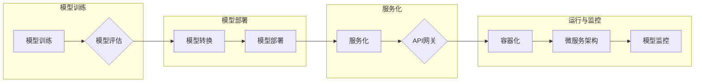

# 模型部署与服务化原理与代码实战案例讲解

> 关键词：模型部署，服务化，微服务架构，容器化，无服务器架构，API网关，模型监控，机器学习，深度学习

## 1. 背景介绍

随着机器学习和深度学习技术的飞速发展，构建和训练复杂的模型已经成为常态。然而，将这些模型部署到生产环境中，使其能够稳定、高效地提供服务，是一个复杂且挑战性的过程。模型部署不仅涉及到技术层面的问题，还包括服务化、安全性、可扩展性等多个方面。本文将深入探讨模型部署与服务的原理，并通过实战案例讲解如何将机器学习模型高效地部署到生产环境中。

### 1.1 模型部署的必要性

模型部署的必要性体现在以下几个方面：

- **实现模型价值**：模型只有在生产环境中才能发挥其价值，通过部署将模型转化为实际的应用服务。
- **用户体验**：快速响应用户请求，提供高质量的模型服务，提升用户体验。
- **业务扩展**：随着业务的发展，模型部署需要能够适应不同的负载和需求。
- **成本优化**：合理部署模型可以降低硬件成本和运维成本。

### 1.2 模型部署面临的挑战

模型部署面临的挑战主要包括：

- **技术复杂性**：涉及多种技术和平台，如容器化、云服务、微服务等。
- **可扩展性**：如何保证模型服务在高并发场景下稳定运行。
- **安全性**：保护模型和数据的隐私安全。
- **监控与运维**：实时监控模型性能，及时处理故障。

## 2. 核心概念与联系

### 2.1 模型部署与服务的核心概念

以下是模型部署与服务的核心概念：

- **模型训练**：使用训练数据对模型进行训练，使其能够学习到有用的知识。
- **模型评估**：使用验证数据评估模型的性能，确保模型的质量。
- **模型转换**：将训练好的模型转换为适合部署的格式。
- **模型部署**：将模型部署到生产环境中，使其能够提供服务。
- **服务化**：将模型封装成服务，通过API接口提供服务。
- **容器化**：使用容器技术（如Docker）打包应用，实现应用的轻量级、可移植性。
- **微服务架构**：将应用拆分成多个独立的服务，实现服务的独立部署和扩展。
- **无服务器架构**：不需要管理服务器，由云服务提供商管理基础设施。
- **API网关**：作为请求的入口，统一处理请求路由、认证、限流等功能。
- **模型监控**：实时监控模型性能，包括准确率、召回率、响应时间等指标。

### 2.2 Mermaid 流程图

以下是基于上述概念的Mermaid流程图：



## 3. 核心算法原理 & 具体操作步骤

### 3.1 算法原理概述

模型部署与服务化的核心原理是将训练好的模型转化为可服务化的形式，并通过适当的架构和工具进行部署和监控。

### 3.2 算法步骤详解

以下是模型部署与服务化的具体步骤：

1. **模型训练**：使用训练数据对模型进行训练，并评估模型性能。
2. **模型转换**：将训练好的模型转换为适合部署的格式，如ONNX、TensorFlow SavedModel等。
3. **容器化**：使用容器技术（如Docker）打包模型和依赖环境。
4. **微服务架构**：将容器化的模型服务部署到微服务架构中。
5. **无服务器架构**：使用云服务提供商提供的无服务器服务部署模型服务。
6. **API网关**：设置API网关，用于处理请求路由、认证、限流等功能。
7. **模型监控**：实时监控模型性能，包括准确率、召回率、响应时间等指标。

### 3.3 算法优缺点

**优点**：

- **可移植性**：容器化技术使得模型服务可以在不同的环境中运行。
- **可扩展性**：微服务架构和无服务器架构可以轻松扩展模型服务。
- **高可用性**：通过分布式部署，可以保证模型服务的高可用性。

**缺点**：

- **复杂性**：模型部署与服务化涉及到多种技术和平台，技术栈复杂。
- **运维成本**：需要专业的运维人员来管理模型服务的部署和监控。

### 3.4 算法应用领域

模型部署与服务化可以应用于各种场景，包括：

- **金融**：风险管理、信贷评估、欺诈检测等。
- **医疗**：疾病诊断、药物发现、患者监护等。
- **零售**：个性化推荐、库存管理、需求预测等。
- **交通**：自动驾驶、交通流量预测、智能交通信号控制等。

## 4. 数学模型和公式 & 详细讲解 & 举例说明

### 4.1 数学模型构建

在模型部署与服务化过程中，以下数学模型和公式至关重要：

- **预测模型**：使用数学公式描述模型预测过程，如线性回归、神经网络等。
- **概率模型**：描述数据分布和概率关系，如高斯分布、贝叶斯网络等。
- **优化模型**：用于模型参数优化，如梯度下降、遗传算法等。

### 4.2 公式推导过程

以下以线性回归模型为例，介绍公式推导过程：

$$
y = \beta_0 + \beta_1x_1 + \beta_2x_2 + \cdots + \beta_nx_n + \epsilon
$$

其中，$y$ 是预测值，$x_1, x_2, \cdots, x_n$ 是输入特征，$\beta_0, \beta_1, \cdots, \beta_n$ 是模型参数，$\epsilon$ 是误差项。

### 4.3 案例分析与讲解

以下以一个简单的分类任务为例，介绍如何将模型部署到生产环境中：

1. **模型训练**：使用训练数据对分类模型进行训练。
2. **模型评估**：使用验证数据评估模型性能，确保模型准确率超过80%。
3. **模型转换**：将训练好的模型转换为ONNX格式。
4. **容器化**：使用Docker打包模型和依赖环境。
5. **微服务架构**：将容器化的模型服务部署到Kubernetes集群中。
6. **API网关**：设置Nginx作为API网关，处理请求路由和认证。
7. **模型监控**：使用Prometheus和Grafana监控系统性能。

## 5. 项目实践：代码实例和详细解释说明

### 5.1 开发环境搭建

以下是使用Python和Docker进行模型部署的步骤：

1. 安装Docker和Docker Compose。
2. 编写Dockerfile，定义模型服务的镜像。
3. 编写docker-compose.yml，定义模型服务的配置。

### 5.2 源代码详细实现

以下是一个简单的Dockerfile示例：

```Dockerfile
FROM python:3.8-slim
WORKDIR /app
COPY requirements.txt requirements.txt
RUN pip install -r requirements.txt
COPY model.py model.py
COPY requirements.txt requirements.txt
CMD ["python", "model.py"]
```

### 5.3 代码解读与分析

Dockerfile定义了模型服务的镜像，包括以下步骤：

- 使用Python 3.8-slim作为基础镜像。
- 设置工作目录为/app。
- 复制requirements.txt和model.py到镜像中。
- 安装Python依赖。
- 复制model.py到镜像中。
- 设置模型服务的启动命令。

### 5.4 运行结果展示

以下是如何使用Docker Compose启动模型服务的示例：

```bash
docker-compose up -d
```

这将启动名为model的模型服务。

## 6. 实际应用场景

### 6.1 金融风控

在金融领域，模型部署与服务化可以用于信用评分、反欺诈检测等任务。通过将模型部署到生产环境中，可以实时评估用户的信用风险，防止欺诈行为。

### 6.2 医疗诊断

在医疗领域，模型部署与服务化可以用于疾病诊断、药物推荐等任务。通过将模型部署到生产环境中，可以提供准确的诊断结果，帮助医生进行决策。

### 6.3 智能推荐

在推荐系统领域，模型部署与服务化可以用于个性化推荐、商品推荐等任务。通过将模型部署到生产环境中，可以为用户提供更加精准的推荐结果。

## 7. 工具和资源推荐

### 7.1 学习资源推荐

- 《Docker技术实战》
- 《Kubernetes权威指南》
- 《Spring Cloud微服务实战》

### 7.2 开发工具推荐

- Docker
- Kubernetes
- Prometheus
- Grafana

### 7.3 相关论文推荐

- 《Container-Based Microservices with Docker》
- 《Kubernetes: A System for Automating Deployment, Scaling, and Operations of Distributed Systems》
- 《Prometheus: Monitoring and Alerting Toolkit for Cloud Native Systems》

## 8. 总结：未来发展趋势与挑战

### 8.1 研究成果总结

模型部署与服务化技术已经取得了显著的成果，但仍面临着一些挑战。

### 8.2 未来发展趋势

- 模型部署将更加自动化和智能化。
- 模型服务将更加轻量化和高效。
- 模型监控将更加实时和全面。

### 8.3 面临的挑战

- 模型安全性和隐私保护。
- 模型可解释性和透明度。
- 模型部署的复杂性和成本。

### 8.4 研究展望

未来，模型部署与服务化技术将朝着更加高效、安全、可解释的方向发展，为人工智能技术的广泛应用提供强有力的支持。

## 9. 附录：常见问题与解答

**Q1：什么是容器化？**

A：容器化是一种轻量级的虚拟化技术，可以将应用及其依赖环境打包成一个独立的容器，实现应用的隔离、移植和重复部署。

**Q2：什么是微服务架构？**

A：微服务架构是一种将大型应用拆分成多个独立的小服务，每个服务负责特定功能的架构风格。

**Q3：什么是无服务器架构？**

A：无服务器架构是一种不需要管理服务器的架构风格，由云服务提供商管理基础设施。

**Q4：什么是API网关？**

A：API网关是作为请求的入口，统一处理请求路由、认证、限流等功能的组件。

**Q5：模型部署与服务化有哪些挑战？**

A：模型部署与服务化面临的挑战包括技术复杂性、可扩展性、安全性、监控与运维等。

作者：禅与计算机程序设计艺术 / Zen and the Art of Computer Programming