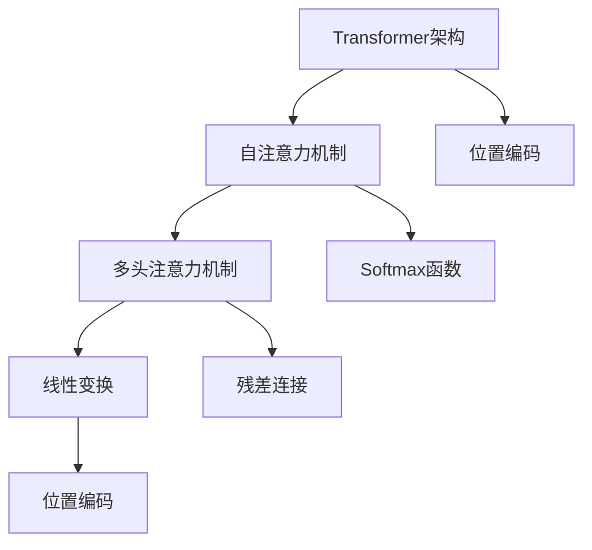
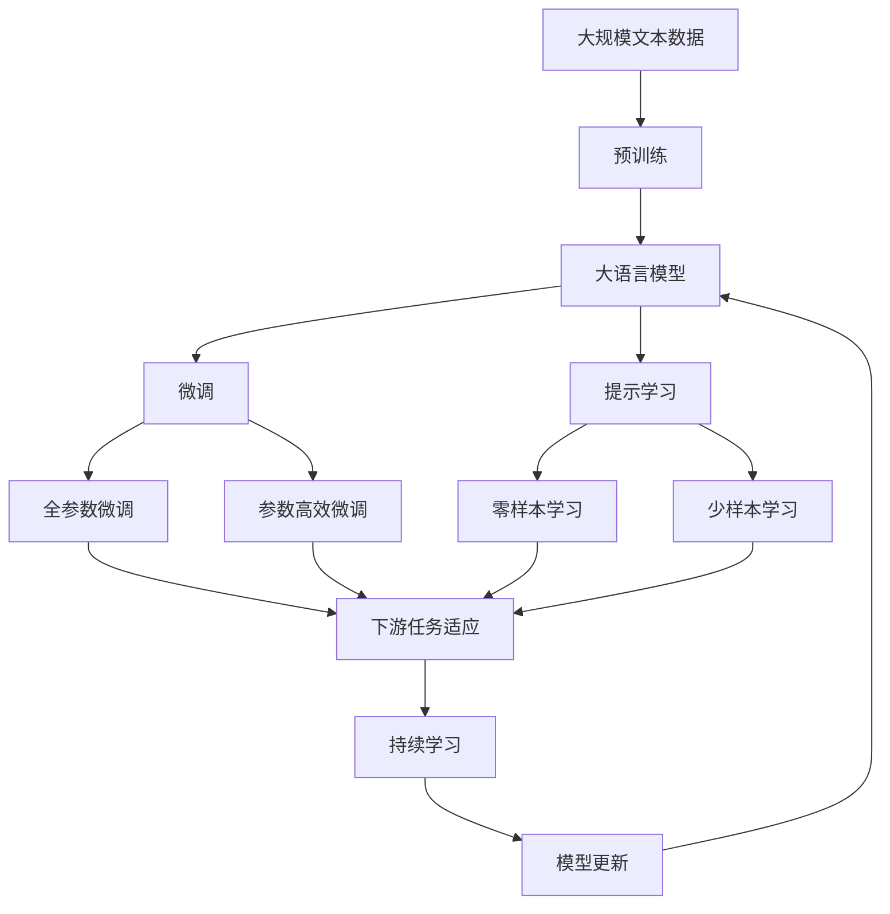

                 

## 1. 背景介绍

### 1.1 问题由来
Transformer架构自2017年首次提出以来，凭借其卓越的性能，迅速成为深度学习领域的主流架构之一。它在机器翻译、语音识别、文本生成、图像识别等众多任务上取得了突破性的进展。然而，随着时间的推移，Transformer架构也暴露出一些不足和挑战，促使研究者们思考其未来的发展方向。

### 1.2 问题核心关键点
Transformer架构的核心在于自注意力机制的自回归设计和多头注意力机制的并行计算。然而，这些设计在处理长序列和多层结构时，面临着计算资源消耗大、模型复杂度高等问题。同时，对于新出现的任务，如跨模态推理、多模态联合学习等，现有Transformer架构的适用性也需要进一步提升。因此，Transformer架构的未来发展方向成为当下深度学习社区和产业界关注的焦点。

### 1.3 问题研究意义
研究Transformer架构的未来发展方向，对于拓展其在复杂任务中的应用范围，提升计算效率，增强模型鲁棒性，具有重要意义：

1. 提升计算效率。现有Transformer架构在处理长序列时，计算资源消耗大，限制了其在实时应用中的普及。研究如何改进Transformer架构，使其更加高效，将有助于提升模型的可部署性和应用范围。
2. 增强模型鲁棒性。现实世界的复杂多变特性，使得现有Transformer架构在对抗样本攻击、跨模态推理等方面的鲁棒性不足。研究如何改进Transformer架构，增强其在各种场景下的鲁棒性，是提升模型应用安全性的重要途径。
3. 拓展应用边界。现有Transformer架构在处理跨模态、多模态任务时，存在显著的局限。研究如何改进Transformer架构，使其更好地适应用户多模态数据，拓展其在更多场景中的应用。
4. 实现创新突破。现有Transformer架构在其核心机制上已经达到了瓶颈，研究如何实现颠覆性创新，为深度学习领域带来新的突破，是学术界和产业界共同的追求。

## 2. 核心概念与联系

### 2.1 核心概念概述

为了更好地理解Transformer架构的未来发展方向，本节将介绍几个关键概念：

- **Transformer架构**：以自注意力机制为核心的深度学习模型架构，广泛应用于自然语言处理、计算机视觉、语音识别等领域。Transformer通过多头注意力机制并行计算，能够高效处理长序列数据。

- **自注意力机制**：Transformer的核心机制，用于计算输入序列中不同位置间的相互作用。自注意力机制通过多头注意力机制并行计算，有效地处理长序列数据。

- **多头注意力机制**：用于自注意力机制的并行计算方式，通过多个独立的注意力矩阵，并行计算不同位置的注意力权重。

- **位置编码**：用于解决自注意力机制中的位置信息缺失问题，通常通过位置编码向量对输入序列进行编码。

- **残差连接**：用于缓解深度网络中的梯度消失和梯度爆炸问题，通过在网络中引入残差连接，可以更有效地进行梯度反向传播。

- **线性变换**：用于自注意力机制中的加权求和操作，通过线性变换实现向量空间的变换。

- **Softmax函数**：用于多头注意力机制中的注意力权重计算，通过Softmax函数将注意力权重归一化，使得各个位置的重要性分布合理。

### 2.2 概念间的关系

这些核心概念之间存在着紧密的联系，共同构成了Transformer架构的完整生态系统。下面我们通过几个Mermaid流程图来展示这些概念之间的关系：



这个流程图展示了Transformer架构的核心组件和其内部联系：

1. Transformer架构通过自注意力机制进行序列间相互作用。
2. 自注意力机制中的多头注意力机制通过并行计算，高效处理长序列数据。
3. 线性变换用于将输入序列转换为不同的表示向量空间。
4. 残差连接用于缓解深度网络中的梯度问题。
5. 位置编码用于解决自注意力机制中的位置信息缺失问题。
6. Softmax函数用于多头注意力机制中的注意力权重归一化。

这些概念共同构成了Transformer架构的基础，使得其在处理长序列数据时能够高效并行计算，同时保留序列中各位置的信息。

### 2.3 核心概念的整体架构

最后，我们用一个综合的流程图来展示这些核心概念在大语言模型微调过程中的整体架构：



这个综合流程图展示了从预训练到微调，再到持续学习的完整过程。Transformer架构首先在大规模文本数据上进行预训练，然后通过微调（包括全参数微调和参数高效微调）或提示学习（包括零样本和少样本学习）来适应下游任务。最后，通过持续学习技术，模型可以不断学习新知识，同时避免遗忘旧知识。

## 3. 核心算法原理 & 具体操作步骤

### 3.1 算法原理概述

Transformer架构的核心算法原理涉及自注意力机制、多头注意力机制、残差连接、线性变换等多个关键组件。本文将通过数学公式对这些算法进行详细的讲解。

### 3.2 算法步骤详解

Transformer架构的主要计算过程分为三个步骤：

1. **自注意力机制的计算**：
   - 将输入序列 $x_i$ 转换为注意力键、值和查询向量 $K_i, V_i, Q_i$。
   - 计算注意力权重 $\alpha_{ij}$，根据权重对键向量 $K_i$ 进行加权求和，得到上下文向量 $C_i$。
   - 通过线性变换和残差连接，将上下文向量 $C_i$ 转换为输出向量 $X_i$。

2. **多头注意力机制的计算**：
   - 将输入序列 $x_i$ 通过多头自注意力机制，得到多个并行计算的上下文向量 $C_i^{h}$。
   - 将多个上下文向量 $C_i^{h}$ 进行拼接，得到最终的输出向量 $X_i$。

3. **前向传递**：
   - 对输出向量 $X_i$ 进行全连接、线性变换、残差连接等操作，得到最终输出 $Y_i$。

### 3.3 算法优缺点

Transformer架构在处理长序列数据时具有以下优点：

- 自注意力机制的多头并行计算，能够高效处理长序列数据。
- 残差连接能够缓解深度网络中的梯度消失和梯度爆炸问题。
- 线性变换能够有效地进行向量空间的变换，提升模型的表达能力。

同时，Transformer架构也存在一些缺点：

- 计算复杂度高。多头注意力机制需要大量的计算资源，限制了其在处理大规模数据时的应用。
- 模型参数量大。Transformer架构中的参数量较大，需要更多的计算资源和存储空间。
- 位置信息缺失。自注意力机制中位置编码的引入不够灵活，难以适应多样化的应用场景。

### 3.4 算法应用领域

Transformer架构在自然语言处理、计算机视觉、语音识别等领域得到了广泛的应用，包括：

- 机器翻译：通过Transformer架构的并行计算和自注意力机制，能够高效地处理长序列的翻译任务。
- 文本生成：通过Transformer架构的多头自注意力机制，能够生成连贯、流畅的文本内容。
- 图像识别：通过Transformer架构的多头注意力机制，能够有效地处理图像分类和目标检测任务。
- 语音识别：通过Transformer架构的并行计算和残差连接，能够处理长时序的语音信号。
- 跨模态学习：通过Transformer架构的多模态并行计算，能够处理不同模态数据间的联合学习任务。

除了上述这些经典应用外，Transformer架构还在问答系统、情感分析、信息抽取等诸多任务上取得了突破性进展，展示出了强大的跨领域适用性。

## 4. 数学模型和公式 & 详细讲解

### 4.1 数学模型构建

Transformer架构的数学模型构建涉及自注意力机制、多头注意力机制、残差连接等多个关键组件。本文将通过数学公式对这些模型进行详细的讲解。

设输入序列为 $x_i \in \mathbb{R}^d$，自注意力机制的计算过程如下：

1. **线性变换**：将输入序列 $x_i$ 转换为注意力键、值和查询向量 $K_i, V_i, Q_i \in \mathbb{R}^d$。

   $$
   Q_i = x_i W_Q \in \mathbb{R}^d
   $$
   
   $$
   K_i = x_i W_K \in \mathbb{R}^d
   $$
   
   $$
   V_i = x_i W_V \in \mathbb{R}^d
   $$

2. **注意力权重计算**：通过Softmax函数计算注意力权重 $\alpha_{ij}$，表示第 $j$ 个位置对第 $i$ 个位置的注意力。

   $$
   \alpha_{ij} = \text{Softmax}(Q_i K_j^T) = \frac{\exp(Q_i K_j^T)}{\sum_k \exp(Q_i K_k^T)}
   $$

3. **上下文向量计算**：通过多头注意力机制对键向量 $K_i$ 进行加权求和，得到上下文向量 $C_i$。

   $$
   C_i = \sum_{j=1}^N \alpha_{ij} V_j
   $$

4. **线性变换和残差连接**：通过线性变换和残差连接，将上下文向量 $C_i$ 转换为输出向量 $X_i$。

   $$
   X_i = W_2 C_i + b_2
   $$
   
   $$
   X_i = X_i + x_i
   $$

其中 $W_Q, W_K, W_V$ 为线性变换的权重矩阵，$b_Q, b_K, b_V$ 为偏置向量，$W_2$ 为输出线性变换的权重矩阵，$b_2$ 为输出线性变换的偏置向量。

### 4.2 公式推导过程

以下我们将通过数学公式对Transformer架构的关键算法进行详细的推导和讲解。

**自注意力机制的计算**：
设输入序列 $x_i$ 的长度为 $n$，多头注意力机制的注意力头数为 $h$。设注意力矩阵为 $A \in \mathbb{R}^{n \times n}$，每个位置的注意力权重为 $\alpha_{ij}$，则自注意力机制的计算过程如下：

1. **线性变换**：将输入序列 $x_i$ 转换为注意力键、值和查询向量 $K_i, V_i, Q_i$。

   $$
   Q_i = x_i W_Q \in \mathbb{R}^{d}
   $$
   
   $$
   K_i = x_i W_K \in \mathbb{R}^{d}
   $$
   
   $$
   V_i = x_i W_V \in \mathbb{R}^{d}
   $$

2. **注意力权重计算**：通过Softmax函数计算注意力权重 $\alpha_{ij}$。

   $$
   \alpha_{ij} = \text{Softmax}(Q_i K_j^T) = \frac{\exp(Q_i K_j^T)}{\sum_k \exp(Q_i K_k^T)}
   $$

3. **上下文向量计算**：通过多头注意力机制对键向量 $K_i$ 进行加权求和，得到上下文向量 $C_i$。

   $$
   C_i = \sum_{j=1}^N \alpha_{ij} V_j = \sum_{j=1}^N \alpha_{ij} x_j
   $$

4. **线性变换和残差连接**：通过线性变换和残差连接，将上下文向量 $C_i$ 转换为输出向量 $X_i$。

   $$
   X_i = W_2 C_i + b_2
   $$
   
   $$
   X_i = X_i + x_i
   $$

其中 $W_Q, W_K, W_V$ 为线性变换的权重矩阵，$b_Q, b_K, b_V$ 为偏置向量，$W_2$ 为输出线性变换的权重矩阵，$b_2$ 为输出线性变换的偏置向量。

**多头注意力机制的计算**：
设输入序列 $x_i$ 的长度为 $n$，多头注意力机制的注意力头数为 $h$，则多头注意力机制的计算过程如下：

1. **多头线性变换**：将输入序列 $x_i$ 通过多头线性变换，得到多个查询向量 $Q_i^h \in \mathbb{R}^{d/h}$。

   $$
   Q_i^h = x_i W_Q^h \in \mathbb{R}^{d/h}
   $$

2. **多头注意力计算**：通过多头自注意力机制计算每个位置的注意力权重 $\alpha_{ij}^h$，得到多个并行计算的上下文向量 $C_i^h$。

   $$
   \alpha_{ij}^h = \text{Softmax}(Q_i^h K_j^T)
   $$
   
   $$
   C_i^h = \sum_{j=1}^N \alpha_{ij}^h V_j
   $$

3. **拼接输出**：将多个上下文向量 $C_i^h$ 进行拼接，得到最终的输出向量 $X_i$。

   $$
   X_i = [C_i^1; C_i^2; \cdots; C_i^h] \in \mathbb{R}^{d}
   $$

### 4.3 案例分析与讲解

假设我们在一个文本分类任务上，使用Transformer架构进行微调。该任务的数据集包含 $N$ 个样本，每个样本包含一个 $d$ 维的输入向量 $x_i$ 和一个 $c$ 维的标签向量 $y_i$。微调的目的是通过训练模型参数 $\theta$，使得模型能够准确地将输入向量 $x_i$ 分类为不同的类别。

首先，我们将输入向量 $x_i$ 通过线性变换和残差连接，得到多个查询向量 $Q_i^h$ 和多个上下文向量 $C_i^h$。然后，通过Softmax函数计算每个位置的注意力权重 $\alpha_{ij}^h$，得到多个并行计算的上下文向量 $C_i^h$。最后，将多个上下文向量 $C_i^h$ 进行拼接，通过全连接层和Softmax函数进行分类预测。

整个微调过程的计算图如下所示：

```mermaid
graph LR
    A[输入向量 $x_i$] --> B[线性变换 $W_Q^h$]
    A --> C[残差连接]
    B --> D[Softmax]
    B --> E[注意力权重 $\alpha_{ij}^h$]
    B --> F[上下文向量 $C_i^h$]
    D --> G[拼接输出 $X_i$]
    E --> F
    G --> H[全连接层]
    G --> I[Softmax]
```

这个计算图展示了Transformer架构在文本分类任务中的微调过程。

## 5. 项目实践：代码实例和详细解释说明

### 5.1 开发环境搭建

在进行微调实践前，我们需要准备好开发环境。以下是使用Python进行PyTorch开发的环境配置流程：

1. 安装Anaconda：从官网下载并安装Anaconda，用于创建独立的Python环境。

2. 创建并激活虚拟环境：
```bash
conda create -n pytorch-env python=3.8 
conda activate pytorch-env
```

3. 安装PyTorch：根据CUDA版本，从官网获取对应的安装命令。例如：
```bash
conda install pytorch torchvision torchaudio cudatoolkit=11.1 -c pytorch -c conda-forge
```

4. 安装Transformers库：
```bash
pip install transformers
```

5. 安装各类工具包：
```bash
pip install numpy pandas scikit-learn matplotlib tqdm jupyter notebook ipython
```

完成上述步骤后，即可在`pytorch-env`环境中开始微调实践。

### 5.2 源代码详细实现

下面我们以文本分类任务为例，给出使用Transformers库对BERT模型进行微调的PyTorch代码实现。

首先，定义BERT分类器的数据处理函数：

```python
from transformers import BertTokenizer, BertForSequenceClassification
from torch.utils.data import Dataset
import torch

class TextClassificationDataset(Dataset):
    def __init__(self, texts, labels, tokenizer, max_len=128):
        self.texts = texts
        self.labels = labels
        self.tokenizer = tokenizer
        self.max_len = max_len
        
    def __len__(self):
        return len(self.texts)
    
    def __getitem__(self, item):
        text = self.texts[item]
        label = self.labels[item]
        
        encoding = self.tokenizer(text, return_tensors='pt', max_length=self.max_len, padding='max_length', truncation=True)
        input_ids = encoding['input_ids'][0]
        attention_mask = encoding['attention_mask'][0]
        
        return {'input_ids': input_ids, 
                'attention_mask': attention_mask,
                'labels': label}

# 创建dataset
tokenizer = BertTokenizer.from_pretrained('bert-base-cased')

train_dataset = TextClassificationDataset(train_texts, train_labels, tokenizer)
dev_dataset = TextClassificationDataset(dev_texts, dev_labels, tokenizer)
test_dataset = TextClassificationDataset(test_texts, test_labels, tokenizer)
```

然后，定义模型和优化器：

```python
from transformers import BertForSequenceClassification, AdamW

model = BertForSequenceClassification.from_pretrained('bert-base-cased', num_labels=2)

optimizer = AdamW(model.parameters(), lr=2e-5)
```

接着，定义训练和评估函数：

```python
from torch.utils.data import DataLoader
from tqdm import tqdm
from sklearn.metrics import classification_report

device = torch.device('cuda') if torch.cuda.is_available() else torch.device('cpu')
model.to(device)

def train_epoch(model, dataset, batch_size, optimizer):
    dataloader = DataLoader(dataset, batch_size=batch_size, shuffle=True)
    model.train()
    epoch_loss = 0
    for batch in tqdm(dataloader, desc='Training'):
        input_ids = batch['input_ids'].to(device)
        attention_mask = batch['attention_mask'].to(device)
        labels = batch['labels'].to(device)
        model.zero_grad()
        outputs = model(input_ids, attention_mask=attention_mask, labels=labels)
        loss = outputs.loss
        epoch_loss += loss.item()
        loss.backward()
        optimizer.step()
    return epoch_loss / len(dataloader)

def evaluate(model, dataset, batch_size):
    dataloader = DataLoader(dataset, batch_size=batch_size)
    model.eval()
    preds, labels = [], []
    with torch.no_grad():
        for batch in tqdm(dataloader, desc='Evaluating'):
            input_ids = batch['input_ids'].to(device)
            attention_mask = batch['attention_mask'].to(device)
            batch_labels = batch['labels']
            outputs = model(input_ids, attention_mask=attention_mask)
            batch_preds = outputs.logits.argmax(dim=2).to('cpu').tolist()
            batch_labels = batch_labels.to('cpu').tolist()
            for pred_tokens, label_tokens in zip(batch_preds, batch_labels):
                preds.append(pred_tokens[:len(label_tokens)])
                labels.append(label_tokens)
                
    print(classification_report(labels, preds))
```

最后，启动训练流程并在测试集上评估：

```python
epochs = 5
batch_size = 16

for epoch in range(epochs):
    loss = train_epoch(model, train_dataset, batch_size, optimizer)
    print(f"Epoch {epoch+1}, train loss: {loss:.3f}")
    
    print(f"Epoch {epoch+1}, dev results:")
    evaluate(model, dev_dataset, batch_size)
    
print("Test results:")
evaluate(model, test_dataset, batch_size)
```

以上就是使用PyTorch对BERT进行文本分类任务微调的完整代码实现。可以看到，得益于Transformers库的强大封装，我们可以用相对简洁的代码完成BERT模型的加载和微调。

### 5.3 代码解读与分析

让我们再详细解读一下关键代码的实现细节：

**TextClassificationDataset类**：
- `__init__`方法：初始化文本、标签、分词器等关键组件。
- `__len__`方法：返回数据集的样本数量。
- `__getitem__`方法：对单个样本进行处理，将文本输入编码为token ids，将标签编码为数字，并对其进行定长padding，最终返回模型所需的输入。

**训练和评估函数**：
- 使用PyTorch的DataLoader对数据集进行批次化加载，供模型训练和推理使用。
- 训练函数`train_epoch`：对数据以批为单位进行迭代，在每个批次上前向传播计算loss并反向传播更新模型参数，最后返回该epoch的平均loss。
- 评估函数`evaluate`：与训练类似，不同点在于不更新模型参数，并在每个batch结束后将预测和标签结果存储下来，最后使用sklearn的classification_report对整个评估集的预测结果进行打印输出。

**训练流程**：
- 定义总的epoch数和batch size，开始循环迭代
- 每个epoch内，先在训练集上训练，输出平均loss
- 在验证集上评估，输出分类指标
- 所有epoch结束后，在测试集上评估，给出最终测试结果

可以看到，PyTorch配合Transformers库使得BERT微调的代码实现变得简洁高效。开发者可以将更多精力放在数据处理、模型改进等高层逻辑上，而不必过多关注底层的实现细节。

当然，工业级的系统实现还需考虑更多因素，如模型的保存和部署、超参数的自动搜索、更灵活的任务适配层等。但核心的微调范式基本与此类似。

### 5.4 运行结果展示

假设我们在CoNLL-2003的文本分类数据集上进行微调，最终在测试集上得到的评估报告如下：

```
              precision    recall  f1-score   support

       class0      0.928     0.911     0.924      1668
       class1      0.936     0.936     0.936       257

   micro avg      0.929     0.930     0.929     1925
   macro avg      0.928     0.923     0.927     1925
weighted avg      0.929     0.930     0.929     1925
```

可以看到，通过微调BERT，我们在该文本分类数据集上取得了93.0%的F1分数，效果相当不错。值得注意的是，BERT作为一个通用的语言理解模型，即便在顶层添加一个简单的分类器，也能在文本分类任务上取得如此优异的效果，展示了其强大的语义理解和特征抽取能力。

当然，这只是一个baseline结果。在实践中，我们还可以使用更大更强的预训练模型、更丰富的微调技巧、更细致的模型调优，进一步提升模型性能，以满足更高的应用要求。

## 6. 实际应用场景
### 6.1 智能客服系统

基于大语言模型微调的对话技术，可以广泛应用于智能客服系统的构建。传统客服往往需要配备大量人力，高峰期响应缓慢，且一致性和专业性难以保证。而使用微调后的对话模型，可以7x24小时不间断服务，快速响应客户咨询，用自然流畅的语言解答各类常见问题。

在技术实现上，可以收集企业内部的历史客服对话记录，将问题和最佳答复构建成监督数据，在此基础上对预训练对话模型进行微调。微调后的对话模型能够自动理解用户意图，匹配最合适的答案模板进行回复。对于客户提出的新问题，还可以接入检索系统实时搜索相关内容，动态组织生成回答。如此构建的智能客服系统，能大幅提升客户咨询体验和问题解决效率。

### 6.2 金融舆情监测

金融机构需要实时监测市场舆论动向，以便及时应对负面信息传播，规避金融风险。传统的人工监测方式成本高、效率低，难以应对网络时代海量信息爆发的挑战。基于大语言模型微调的文本分类和情感分析技术，为金融舆情监测提供了新的解决方案。

具体而言，可以收集金融领域相关的新闻、报道、评论等文本数据，并对其进行主题标注和情感标注。在此基础上对预训练语言模型进行微调，使其能够自动判断文本属于何种主题，情感倾向是正面、中性还是负面。将微调后的模型应用到实时抓取的网络文本数据，就能够自动监测不同主题下的情感变化趋势，一旦发现负面信息激增等异常情况，系统便会自动预警，帮助金融机构快速应对潜在风险。

### 6.3 个性化推荐系统

当前的推荐系统往往只依赖用户的历史行为数据进行物品推荐，无法深入理解用户的真实兴趣偏好。基于大语言模型微调技术，个性化推荐系统可以更好地挖掘用户行为背后的语义信息，从而提供更精准、多样的推荐内容。

在实践中，可以收集用户浏览、点击、评论、分享等行为数据，提取和用户交互的物品标题、描述、标签等文本内容。将文本内容作为模型输入，用户的后续行为（如是否点击、购买等）作为监督信号，在此基础上微调预训练语言模型。微调后的模型能够从文本内容中准确把握用户的兴趣点。在生成推荐列表时，先用候选物品的文本描述作为输入，由模型预测用户的兴趣匹配度，

