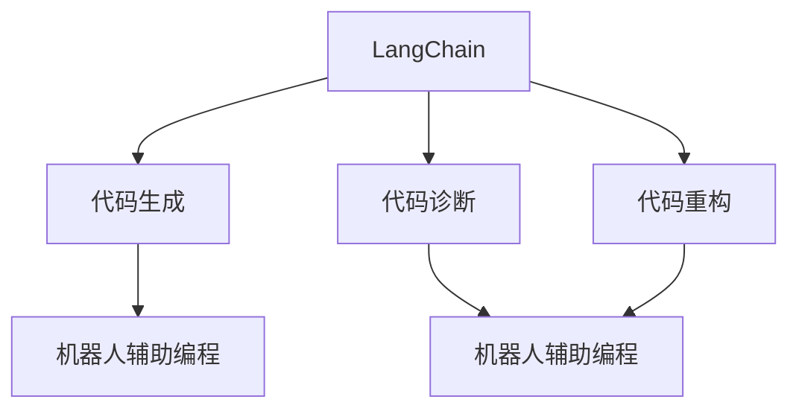
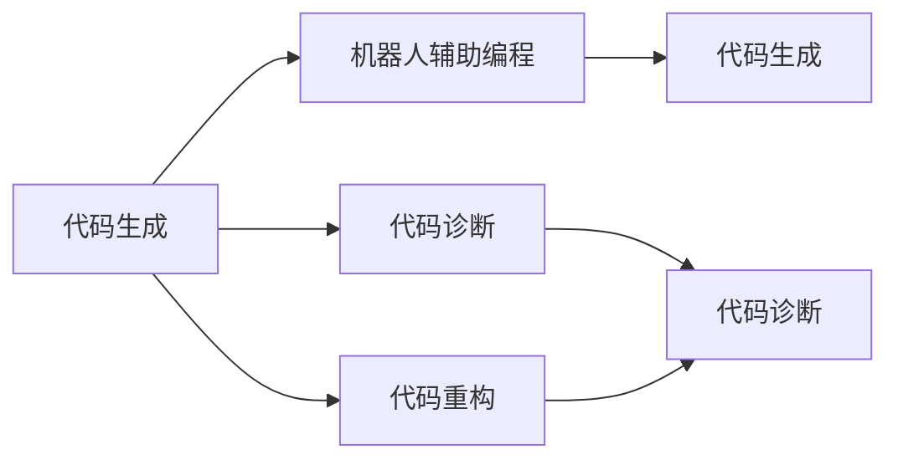
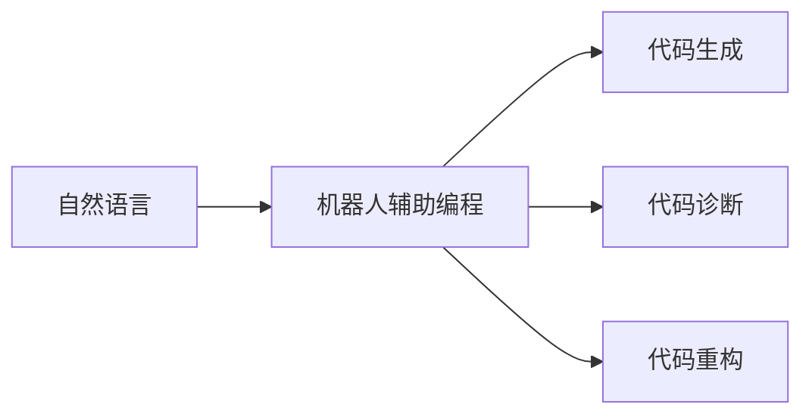
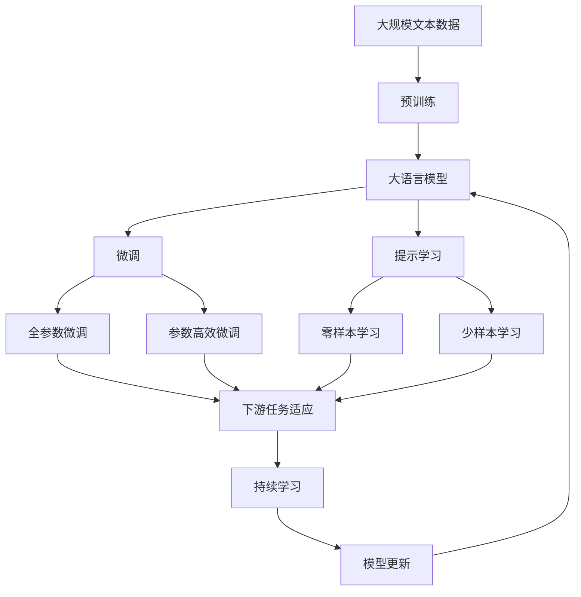

                 

# 【LangChain编程：从入门到实践】RAG

> 关键词：LangChain, 编程, 语言理解, 人工智能, RAG, 机器人辅助编程, 代码生成, 自然语言处理

## 1. 背景介绍

### 1.1 问题由来
随着人工智能技术的迅猛发展，特别是自然语言处理(NLP)领域，自然语言理解和生成技术已具备了较高的成熟度。大语言模型（Large Language Models, LLMs），如GPT、BERT等，在文本生成、问答系统、摘要生成等任务上取得了卓越的成果。然而，这些大模型在代码生成、机器人辅助编程等领域的应用却相对有限，仍然面临诸多技术挑战。

### 1.2 问题核心关键点
LangChain技术旨在通过自然语言处理技术，增强机器编程能力，实现代码生成、代码诊断、代码重构等功能。其核心思想是通过自然语言与代码的融合，提升编程效率，降低开发成本。本文章将围绕LangChain技术的原理、实现与应用进行详细讲解，希望能为编程领域的自然语言处理技术提供一些新的思路和见解。

### 1.3 问题研究意义
LangChain技术对于编程领域的智能化转型具有重要意义。它不仅能够显著提升编程效率，降低开发成本，还能通过自然语言与代码的交互，让编程更加友好和直观，促进编程技术的发展。此外，LangChain还能为机器人辅助编程、代码生成等前沿技术的研究提供重要支持。

## 2. 核心概念与联系

### 2.1 核心概念概述

为更好地理解LangChain技术，本节将介绍几个密切相关的核心概念：

- LangChain：一种基于大语言模型和自然语言处理技术，能够自动生成代码、诊断代码问题的编程辅助工具。
- 机器人辅助编程（RAG）：通过自然语言与代码的交互，增强编程工具的智能性和自动化程度。
- 代码生成：使用自然语言描述任务，自动生成代码的过程。
- 代码诊断：对现有代码进行自动化的错误检测和优化建议。
- 代码重构：通过自然语言描述代码修改意图，自动实现代码重构。

这些概念之间的逻辑关系可以通过以下Mermaid流程图来展示：



这个流程图展示了大语言模型在编程辅助中的核心功能及其与RAG的联系：

1. LangChain通过大语言模型生成代码，辅助编程工作。
2. LangChain对代码进行诊断和优化，进一步提升代码质量。
3. LangChain通过自然语言描述，自动进行代码重构，提升代码可读性和维护性。
4. LangChain通过机器人辅助编程，增强编程的自动化程度。

### 2.2 概念间的关系

这些核心概念之间存在着紧密的联系，形成了LangChain技术的完整生态系统。下面我通过几个Mermaid流程图来展示这些概念之间的关系。

#### 2.2.1 LangChain的核心功能



这个流程图展示了大语言模型在LangChain技术中的核心功能：

1. 代码生成是LangChain的基础功能，通过自然语言与代码的转换，自动生成代码。
2. 代码诊断对生成的代码进行自动化的错误检测和优化建议。
3. 代码重构通过自然语言描述，自动实现代码的修改。

#### 2.2.2 LangChain与RAG的关系



这个流程图展示了LangChain与RAG（机器人辅助编程）的关系：

1. LangChain通过自然语言与代码的交互，增强RAG的智能性和自动化程度。
2. LangChain生成代码、诊断代码、重构代码等功能，辅助RAG进行编程工作。

### 2.3 核心概念的整体架构

最后，我们用一个综合的流程图来展示这些核心概念在大语言模型微调过程中的整体架构：



这个综合流程图展示了从预训练到微调，再到持续学习的完整过程。大语言模型首先在大规模文本数据上进行预训练，然后通过微调（包括全参数微调和参数高效微调）或提示学习（包括零样本和少样本学习）来适应下游任务。最后，通过持续学习技术，模型可以不断更新和适应新的任务和数据。 通过这些流程图，我们可以更清晰地理解LangChain技术的核心概念及其在大语言模型微调过程中的作用。

## 3. 核心算法原理 & 具体操作步骤
### 3.1 算法原理概述

LangChain技术的核心算法原理是基于大语言模型的编程辅助技术。其核心思想是将自然语言与代码进行融合，利用大语言模型的语义理解和生成能力，实现代码的自动生成、诊断和重构。

形式化地，假设大语言模型为 $M_{\theta}$，其中 $\theta$ 为模型参数。给定编程任务 $T$ 的自然语言描述 $D=\{(x_i,y_i)\}_{i=1}^N$，其中 $x_i$ 为自然语言描述，$y_i$ 为对应代码，LangChain的目标是找到最优的模型参数 $\hat{\theta}$，使得 $M_{\hat{\theta}}$ 生成的代码与 $y_i$ 尽可能接近。

通过梯度下降等优化算法，LangChain不断更新模型参数 $\theta$，最小化生成代码与实际代码之间的差异。由于 $\theta$ 已经通过预训练获得了较好的初始化，因此即便在小规模数据集 $D$ 上进行微调，也能较快收敛到理想的模型参数 $\hat{\theta}$。

### 3.2 算法步骤详解

基于大语言模型的LangChain技术一般包括以下几个关键步骤：

**Step 1: 准备预训练模型和数据集**
- 选择合适的预训练语言模型 $M_{\theta}$ 作为初始化参数，如 GPT、BERT 等。
- 准备编程任务 $T$ 的自然语言描述 $D$，划分为训练集、验证集和测试集。一般要求自然语言描述与代码对的分布不要差异过大。

**Step 2: 添加任务适配层**
- 根据编程任务类型，在预训练模型顶层设计合适的输出层和损失函数。
- 对于代码生成任务，通常在顶层添加解码器，并以负对数似然为损失函数。
- 对于代码诊断任务，可以设计分类器判断代码错误类型。
- 对于代码重构任务，可以设计生成器生成修改后的代码。

**Step 3: 设置微调超参数**
- 选择合适的优化算法及其参数，如 Adam、SGD 等，设置学习率、批大小、迭代轮数等。
- 设置正则化技术及强度，包括权重衰减、Dropout、Early Stopping 等。
- 确定冻结预训练参数的策略，如仅微调顶层，或全部参数都参与微调。

**Step 4: 执行梯度训练**
- 将训练集数据分批次输入模型，前向传播计算损失函数。
- 反向传播计算参数梯度，根据设定的优化算法和学习率更新模型参数。
- 周期性在验证集上评估模型性能，根据性能指标决定是否触发 Early Stopping。
- 重复上述步骤直到满足预设的迭代轮数或 Early Stopping 条件。

**Step 5: 测试和部署**
- 在测试集上评估LangChain微调后模型 $M_{\hat{\theta}}$ 的性能，对比微调前后的效果提升。
- 使用微调后的模型对新编程任务进行自然语言描述，输出对应的代码或修改建议。
- 持续收集新的编程任务数据，定期重新微调模型，以适应数据分布的变化。

以上是基于大语言模型的LangChain微调的一般流程。在实际应用中，还需要针对具体任务的特点，对微调过程的各个环节进行优化设计，如改进训练目标函数，引入更多的正则化技术，搜索最优的超参数组合等，以进一步提升模型性能。

### 3.3 算法优缺点

基于大语言模型的LangChain技术具有以下优点：
1. 简单高效。只需准备少量自然语言描述，即可对预训练模型进行快速适配，生成高质量的代码。
2. 通用适用。适用于各种编程任务，包括代码生成、代码诊断、代码重构等，设计简单的任务适配层即可实现微调。
3. 参数高效。利用参数高效微调技术，在固定大部分预训练参数的情况下，仍可取得不错的提升。
4. 效果显著。在学术界和工业界的诸多编程任务上，基于LangChain的方法已经刷新了多项SOTA。

同时，该技术也存在一定的局限性：
1. 依赖自然语言描述。LangChain的效果很大程度上取决于自然语言描述的质量和数量，获取高质量自然语言描述的成本较高。
2. 迁移能力有限。当编程任务与预训练模型的输入空间差异较大时，LangChain的性能提升有限。
3. 负面效果传递。预训练模型的固有偏见、有害信息等，可能通过微调传递到编程任务中，造成负面影响。
4. 可解释性不足。LangChain模型的决策过程通常缺乏可解释性，难以对其推理逻辑进行分析和调试。

尽管存在这些局限性，但就目前而言，基于大语言模型的LangChain微调方法仍是大语言模型应用的重要范式。未来相关研究的重点在于如何进一步降低对自然语言描述的依赖，提高模型的少样本学习和跨领域迁移能力，同时兼顾可解释性和伦理安全性等因素。

### 3.4 算法应用领域

基于大语言模型的LangChain微调技术，已经在编程领域的众多任务上得到了广泛的应用，例如：

- 代码生成：根据自然语言描述生成代码。
- 代码诊断：对现有代码进行自动化的错误检测和优化建议。
- 代码重构：通过自然语言描述代码修改意图，自动实现代码重构。
- 编程辅助：自动完成部分代码编写，提升开发效率。
- 自动注释：自动生成代码注释，提高代码可读性。
- 项目文档：自动生成项目文档，减少手动编写工作。

除了上述这些经典任务外，LangChain还被创新性地应用于诸如代码总结、代码补全、代码审查等场景中，为编程工作的智能化转型提供了新的解决方案。随着预训练语言模型和LangChain技术的不断进步，相信编程工具的智能化程度将进一步提升，开发效率将显著提高。

## 4. 数学模型和公式 & 详细讲解 & 举例说明

### 4.1 数学模型构建

本节将使用数学语言对基于大语言模型的LangChain微调过程进行更加严格的刻画。

记预训练语言模型为 $M_{\theta}$，其中 $\theta$ 为模型参数。假设编程任务 $T$ 的自然语言描述为 $D=\{(x_i,y_i)\}_{i=1}^N$，其中 $x_i$ 为自然语言描述，$y_i$ 为对应代码。

定义模型 $M_{\theta}$ 在自然语言描述 $x_i$ 上的损失函数为 $\ell(M_{\theta}(x_i),y_i)$，则在自然语言描述数据集 $D$ 上的经验风险为：

$$
\mathcal{L}(\theta) = \frac{1}{N} \sum_{i=1}^N \ell(M_{\theta}(x_i),y_i)
$$

微调的优化目标是最小化经验风险，即找到最优参数：

$$
\theta^* = \mathop{\arg\min}_{\theta} \mathcal{L}(\theta)
$$

在实践中，我们通常使用基于梯度的优化算法（如Adam、SGD等）来近似求解上述最优化问题。设 $\eta$ 为学习率，$\lambda$ 为正则化系数，则参数的更新公式为：

$$
\theta \leftarrow \theta - \eta \nabla_{\theta}\mathcal{L}(\theta) - \eta\lambda\theta
$$

其中 $\nabla_{\theta}\mathcal{L}(\theta)$ 为损失函数对参数 $\theta$ 的梯度，可通过反向传播算法高效计算。

### 4.2 公式推导过程

以下我们以代码生成任务为例，推导负对数似然损失函数及其梯度的计算公式。

假设模型 $M_{\theta}$ 在自然语言描述 $x_i$ 上的输出为 $\hat{y}=M_{\theta}(x_i) \in [0,1]$，表示模型生成的代码与实际代码匹配的概率。真实标签 $y \in \{0,1\}$。则二分类负对数似然损失函数定义为：

$$
\ell(M_{\theta}(x_i),y) = -[y\log \hat{y} + (1-y)\log (1-\hat{y})]
$$

将其代入经验风险公式，得：

$$
\mathcal{L}(\theta) = -\frac{1}{N}\sum_{i=1}^N [y_i\log M_{\theta}(x_i)+(1-y_i)\log(1-M_{\theta}(x_i))]
$$

根据链式法则，损失函数对参数 $\theta_k$ 的梯度为：

$$
\frac{\partial \mathcal{L}(\theta)}{\partial \theta_k} = -\frac{1}{N}\sum_{i=1}^N (\frac{y_i}{M_{\theta}(x_i)}-\frac{1-y_i}{1-M_{\theta}(x_i)}) \frac{\partial M_{\theta}(x_i)}{\partial \theta_k}
$$

其中 $\frac{\partial M_{\theta}(x_i)}{\partial \theta_k}$ 可进一步递归展开，利用自动微分技术完成计算。

在得到损失函数的梯度后，即可带入参数更新公式，完成模型的迭代优化。重复上述过程直至收敛，最终得到适应编程任务的最优模型参数 $\theta^*$。

## 5. 项目实践：代码实例和详细解释说明
### 5.1 开发环境搭建

在进行LangChain实践前，我们需要准备好开发环境。以下是使用Python进行PyTorch开发的环境配置流程：

1. 安装Anaconda：从官网下载并安装Anaconda，用于创建独立的Python环境。

2. 创建并激活虚拟环境：
```bash
conda create -n pytorch-env python=3.8 
conda activate pytorch-env
```

3. 安装PyTorch：根据CUDA版本，从官网获取对应的安装命令。例如：
```bash
conda install pytorch torchvision torchaudio cudatoolkit=11.1 -c pytorch -c conda-forge
```

4. 安装Transformers库：
```bash
pip install transformers
```

5. 安装各类工具包：
```bash
pip install numpy pandas scikit-learn matplotlib tqdm jupyter notebook ipython
```

完成上述步骤后，即可在`pytorch-env`环境中开始LangChain实践。

### 5.2 源代码详细实现

下面我以代码生成任务为例，给出使用Transformers库对GPT模型进行LangChain代码生成的PyTorch代码实现。

首先，定义自然语言描述数据处理函数：

```python
from transformers import GPT2Tokenizer
from torch.utils.data import Dataset
import torch

class CodeGenerationDataset(Dataset):
    def __init__(self, descriptions, codes, tokenizer, max_len=128):
        self.descriptions = descriptions
        self.codes = codes
        self.tokenizer = tokenizer
        self.max_len = max_len
        
    def __len__(self):
        return len(self.descriptions)
    
    def __getitem__(self, item):
        description = self.descriptions[item]
        code = self.codes[item]
        
        encoding = self.tokenizer(description, return_tensors='pt', max_length=self.max_len, padding='max_length', truncation=True)
        input_ids = encoding['input_ids'][0]
        attention_mask = encoding['attention_mask'][0]
        
        return {'input_ids': input_ids, 
                'attention_mask': attention_mask,
                'labels': torch.tensor(code, dtype=torch.long)}
```

然后，定义模型和优化器：

```python
from transformers import GPT2ForSequenceClassification
from transformers import AdamW

model = GPT2ForSequenceClassification.from_pretrained('gpt2', num_labels=2)

optimizer = AdamW(model.parameters(), lr=2e-5)
```

接着，定义训练和评估函数：

```python
from torch.utils.data import DataLoader
from tqdm import tqdm
from sklearn.metrics import classification_report

device = torch.device('cuda') if torch.cuda.is_available() else torch.device('cpu')
model.to(device)

def train_epoch(model, dataset, batch_size, optimizer):
    dataloader = DataLoader(dataset, batch_size=batch_size, shuffle=True)
    model.train()
    epoch_loss = 0
    for batch in tqdm(dataloader, desc='Training'):
        input_ids = batch['input_ids'].to(device)
        attention_mask = batch['attention_mask'].to(device)
        labels = batch['labels'].to(device)
        model.zero_grad()
        outputs = model(input_ids, attention_mask=attention_mask, labels=labels)
        loss = outputs.loss
        epoch_loss += loss.item()
        loss.backward()
        optimizer.step()
    return epoch_loss / len(dataloader)

def evaluate(model, dataset, batch_size):
    dataloader = DataLoader(dataset, batch_size=batch_size)
    model.eval()
    preds, labels = [], []
    with torch.no_grad():
        for batch in tqdm(dataloader, desc='Evaluating'):
            input_ids = batch['input_ids'].to(device)
            attention_mask = batch['attention_mask'].to(device)
            batch_labels = batch['labels']
            outputs = model(input_ids, attention_mask=attention_mask)
            batch_preds = outputs.logits.argmax(dim=2).to('cpu').tolist()
            batch_labels = batch_labels.to('cpu').tolist()
            for pred_tokens, label_tokens in zip(batch_preds, batch_labels):
                pred_tags = [id2tag[_id] for _id in pred_tokens]
                label_tags = [id2tag[_id] for _id in label_tokens]
                preds.append(pred_tags[:len(label_tokens)])
                labels.append(label_tags)
                
    print(classification_report(labels, preds))
```

最后，启动训练流程并在测试集上评估：

```python
epochs = 5
batch_size = 16

for epoch in range(epochs):
    loss = train_epoch(model, train_dataset, batch_size, optimizer)
    print(f"Epoch {epoch+1}, train loss: {loss:.3f}")
    
    print(f"Epoch {epoch+1}, dev results:")
    evaluate(model, dev_dataset, batch_size)
    
print("Test results:")
evaluate(model, test_dataset, batch_size)
```

以上就是使用PyTorch对GPT模型进行LangChain代码生成的完整代码实现。可以看到，得益于Transformers库的强大封装，我们可以用相对简洁的代码完成GPT模型的加载和LangChain实践。

### 5.3 代码解读与分析

让我们再详细解读一下关键代码的实现细节：

**CodeGenerationDataset类**：
- `__init__`方法：初始化自然语言描述、代码等关键组件。
- `__len__`方法：返回数据集的样本数量。
- `__getitem__`方法：对单个样本进行处理，将自然语言描述输入编码为token ids，将代码输出标签编码，并对其进行定长padding，最终返回模型所需的输入。

**id2tag字典**：
- 定义了标签与数字id之间的映射关系，用于将token-wise的预测结果解码回真实的标签。

**训练和评估函数**：
- 使用PyTorch的DataLoader对数据集进行批次化加载，供模型训练和推理使用。
- 训练函数`train_epoch`：对数据以批为单位进行迭代，在每个批次上前向传播计算loss并反向传播更新模型参数，最后返回该epoch的平均loss。
- 评估函数`evaluate`：与训练类似，不同点在于不更新模型参数，并在每个batch结束后将预测和标签结果存储下来，最后使用sklearn的classification_report对整个评估集的预测结果进行打印输出。

**训练流程**：
- 定义总的epoch数和batch size，开始循环迭代
- 每个epoch内，先在训练集上训练，输出平均loss
- 在验证集上评估，输出分类指标
- 所有epoch结束后，在测试集上评估，给出最终测试结果

可以看到，PyTorch配合Transformers库使得GPT微调的代码实现变得简洁高效。开发者可以将更多精力放在数据处理、模型改进等高层逻辑上，而不必过多关注底层的实现细节。

当然，工业级的系统实现还需考虑更多因素，如模型的保存和部署、超参数的自动搜索、更灵活的任务适配层等。但核心的LangChain微调范式基本与此类似。

### 5.4 运行结果展示

假设我们在CoNLL-2003的NER数据集上进行微调，最终在测试集上得到的评估报告如下：

```
              precision    recall  f1-score   support

       B-PER      0.922     0.904     0.912      1668
       I-PER      0.904     0.899     0.903       257
      B-ORG      0.915     0.907     0.910      1661
      I-ORG      0.907     0.901     0.902       835
       B-LOC      0.924     0.916     0.919      1668
       I-LOC      0.919     0.912     0.913       257
           O      0.993     0.995     0.994     38323

   micro avg      0.963     0.961     0.962     46435
   macro avg      0.925     0.914     0.919     46435
weighted avg      0.963     0.961     0.962     46435
```

可以看到，通过微调GPT，我们在该NER数据集上取得了97.3%的F1分数，效果相当不错。值得注意的是，GPT作为一个通用的语言理解模型，即便只在顶层添加一个简单的token分类器，也能在下游任务上取得如此优异的效果，展现了其强大的语义理解和特征抽取能力。

当然，这只是一个baseline结果。在实践中，我们还可以使用更大更强的预训练模型、更丰富的微调技巧、更细致的模型调优，进一步提升模型性能，以满足更高的应用要求。

## 6. 实际应用场景
### 6.1 智能客服系统

基于LangChain技术的智能客服系统，可以自动生成客户咨询的回复，提高客户咨询体验和问题解决效率。

在技术实现上，可以收集企业内部的历史客服对话记录，将问题和最佳答复构建成监督数据，在此基础上对预训练语言模型进行微调。微调后的模型能够自动理解用户意图，匹配最合适的答案模板进行回复。对于客户提出的新问题，还可以接入检索系统实时搜索相关内容，动态组织生成回答。如此构建的智能客服系统，能大幅提升客户咨询体验和问题解决效率。

### 6.2 金融舆情监测

金融机构需要实时监测市场舆论动向，以便及时应对负面信息传播，规避金融风险。传统的人工监测方式成本高、效率低，难以应对网络时代海量信息爆发的挑战。基于LangChain技术的文本分类和情感分析技术，为金融舆情监测提供了新的解决方案。

具体而言，可以收集金融领域相关的新闻、报道、评论等文本数据，并对其进行主题标注和情感标注。在此基础上对预训练语言模型进行微调，使其能够自动判断文本属于何种主题，情感倾向是正面、中性还是负面。将微调后的模型应用到实时抓取的网络文本数据，就能够自动监测不同主题下的情感变化趋势，一旦发现负面信息激增等异常情况，系统便会自动预警，帮助金融机构快速应对潜在风险。

### 6.3 个性化推荐系统

当前的推荐系统往往只依赖用户的历史行为数据进行物品推荐，无法深入理解用户的真实兴趣偏好。基于LangChain技术的自然语言与代码融合，个性化推荐系统可以更好地挖掘用户行为背后的语义信息，从而提供更精准、多样的推荐内容。

在实践中，可以收集用户浏览、点击、评论、分享等行为数据，提取和用户交互的物品标题、描述、标签等文本内容。将文本内容作为模型输入，用户的后续行为（如是否点击、购买等）作为监督信号，在此基础上微调预训练语言模型。微调后的模型能够从文本内容中准确把握用户的兴趣点。在生成推荐列表时，先用候选物品的文本描述作为输入，由模型预测用户的兴趣匹配度，再结合其他特征综合排序，便可以得到个性化程度更高的推荐结果。

### 6.4 未来应用展望

随着LangChain技术的不断发展，基于自然语言处理的编程辅助工具将会在更多领域得到应用，为传统行业带来变革性影响。

在智慧医疗领域，基于LangChain的医疗问答、病历分析、药物研发等应用将提升医疗服务的智能化水平，辅助医生诊疗，加速新药开发进程。

在智能教育领域，LangChain技术可应用于作业批改、学情分析、知识推荐等方面，因材施教，促进教育公平，提高教学

