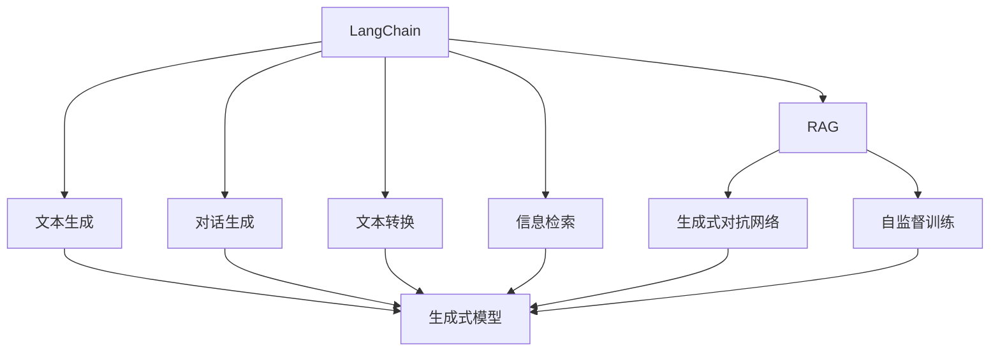

                 

# 【LangChain编程：从入门到实践】RAG技术概述

> 关键词：LangChain, RAG, 生成式对抗网络, GANs, 自然语言生成, NLP

## 1. 背景介绍

随着自然语言处理(NLP)技术的不断进步，生成式对抗网络(Generative Adversarial Networks, GANs)在自然语言生成领域展现出巨大的潜力。LangChain作为当前自然语言生成领域的明星项目，融合了RAG技术，构建了一个具有高度可扩展性、灵活性、实用性的NLP基础设施。本文将详细介绍LangChain中的RAG技术，并给出详细的实践指南，帮助读者快速上手，实现自然语言生成的高级应用。

## 2. 核心概念与联系

### 2.1 核心概念概述

#### 2.1.1 生成式对抗网络

生成式对抗网络（GANs）是由Ian Goodfellow等人在2014年提出的生成模型。GANs由两个神经网络组成：生成器（Generator）和判别器（Discriminator）。生成器负责生成逼真的数据样本，判别器则负责判断样本的真实性。两者通过对抗训练不断优化，最终生成器可以生成与真实数据无法区分的样本。

GANs在图像生成、文本生成等任务中表现出色，被广泛应用于图像生成、视频生成、游戏生成、音乐生成等领域。

#### 2.1.2 自然语言生成

自然语言生成（NLG, Natural Language Generation）是NLP中的一个重要分支，旨在将结构化数据转化为自然语言文本。常见的NLG任务包括机器翻译、文本摘要、对话生成、故事生成等。

NLG在实际应用中有着广泛的应用场景，如智能客服、自动摘要、自动写作等。

#### 2.1.3 LangChain

LangChain是一个基于RAG技术的NLP开源框架，旨在提供一个灵活、高效、易用的自然语言生成基础设施。LangChain包含多个模块，包括文本生成、对话生成、文本转换、信息检索等。

LangChain通过插件化的方式，支持多种自然语言生成模型，包括但不限于GPT-2、GPT-3、BERT等，适用于各种NLP任务。

### 2.2 核心概念之间的关系

通过以下Mermaid流程图，可以更好地理解LangChain中的RAG技术及其与其他核心概念之间的关系：



这个流程图展示了LangChain中的RAG技术及其与其他核心概念的关系：

1. LangChain通过RAG技术，实现了文本生成、对话生成、文本转换、信息检索等NLP任务。
2. RAG技术由生成式对抗网络（GANs）组成，通过对抗训练生成自然语言文本。
3. 生成式模型是RAG技术的核心，包括GPT-2、GPT-3、BERT等。
4. LangChain通过自监督训练，提升模型的性能和泛化能力。
5. LangChain支持的多个模块，可以通过插件化的方式快速部署和定制。

通过这个流程图，可以看出LangChain中的RAG技术是一个以生成式对抗网络为核心，通过自监督训练和多种NLP模块灵活组合，实现自然语言生成任务的强大基础设施。

## 3. 核心算法原理 & 具体操作步骤

### 3.1 算法原理概述

LangChain中的RAG技术主要依赖生成式对抗网络（GANs）来实现自然语言生成。GANs由生成器和判别器两部分组成，生成器负责生成文本，判别器则负责判断文本的真实性。GANs的训练过程分为两个阶段：对抗训练和自监督训练。

#### 3.1.1 对抗训练

对抗训练是指在生成器和判别器之间进行对抗博弈，通过不断调整生成器和判别器的权重，使生成器生成的文本与真实文本无法区分，同时判别器也能准确判断文本的真实性。

具体来说，假设生成器生成了一段文本，判别器判断其真实性的概率为$p$，那么生成器通过最大化$p$，判别器通过最大化$1-p$，两者之间形成了一个对抗博弈。通过不断调整生成器和判别器的权重，使$p$趋近于1。

#### 3.1.2 自监督训练

自监督训练是指在无标注数据的情况下，通过让模型自己学习到语言规律，提高模型的泛化能力。LangChain中的RAG技术通过自监督训练，提升模型的性能和泛化能力。

常见的自监督训练任务包括掩码语言模型、自动编码器等。这些任务可以使得模型更好地理解语言的结构和规律，提高模型的泛化能力。

### 3.2 算法步骤详解

LangChain中的RAG技术主要包含以下步骤：

#### 3.2.1 数据准备

1. 准备训练数据集。训练数据集可以是从网络上爬取的文本数据，也可以是自己收集的文本数据。
2. 对文本数据进行预处理，包括分词、去停用词、构建词汇表等。
3. 将文本数据进行切分，分成训练集、验证集和测试集。

#### 3.2.2 模型构建

1. 搭建生成器和判别器模型。生成器模型通常使用LSTM、GRU等序列模型，判别器模型通常使用CNN、RNN等网络结构。
2. 定义损失函数。常用的损失函数包括交叉熵损失、对抗损失等。
3. 定义优化器。常用的优化器包括Adam、SGD等。

#### 3.2.3 对抗训练

1. 将生成器和判别器模型训练成一个对抗系统，生成器生成文本，判别器判断文本的真实性。
2. 通过不断调整生成器和判别器的权重，使生成器生成的文本与真实文本无法区分，同时判别器也能准确判断文本的真实性。
3. 在对抗训练过程中，需要设置合适的超参数，如学习率、训练轮数等。

#### 3.2.4 自监督训练

1. 在无标注数据的情况下，通过自监督训练任务，如掩码语言模型、自动编码器等，训练生成器模型。
2. 通过自监督训练，使模型学习到语言的结构和规律，提高模型的泛化能力。
3. 在自监督训练过程中，需要设置合适的超参数，如训练轮数、批量大小等。

#### 3.2.5 模型评估

1. 在验证集上评估模型的性能，如BLEU、ROUGE等指标。
2. 根据评估结果调整超参数，重新训练模型。
3. 在测试集上评估模型的最终性能。

### 3.3 算法优缺点

#### 3.3.1 优点

1. 生成文本质量高。GANs可以生成与真实文本无法区分的样本，生成文本质量高。
2. 模型泛化能力强。自监督训练任务可以提升模型的泛化能力，使模型在各种任务上表现优异。
3. 灵活性强。LangChain中的RAG技术支持多种NLP任务，可以通过插件化的方式灵活扩展。

#### 3.3.2 缺点

1. 训练过程复杂。GANs的训练过程需要对抗训练和自监督训练，训练过程复杂。
2. 需要大量计算资源。GANs训练需要大量的计算资源，成本较高。
3. 存在模式塌陷问题。GANs在训练过程中可能存在模式塌陷问题，生成器生成的文本可能过于依赖于输入的噪声，导致生成器失去多样性。

### 3.4 算法应用领域

LangChain中的RAG技术在多个领域都有广泛的应用，包括但不限于：

1. 文本生成。LangChain中的RAG技术可以实现文本生成任务，如自动摘要、文本转换、对话生成等。
2. 对话生成。LangChain中的RAG技术可以实现对话生成任务，如智能客服、机器人对话等。
3. 信息检索。LangChain中的RAG技术可以实现信息检索任务，如文档摘要、信息抽取等。

## 4. 数学模型和公式 & 详细讲解 & 举例说明

### 4.1 数学模型构建

LangChain中的RAG技术主要基于生成式对抗网络（GANs）实现。假设生成器模型为$G$，判别器模型为$D$，文本为$x$，生成器生成的文本为$\hat{x}$，则GANs的目标函数为：

$$
\min_{G} \max_{D} V(G, D) = \mathbb{E}_{x \sim p_{data}} [\log D(x)] + \mathbb{E}_{\hat{x} \sim p_{g}(\hat{x})} [\log(1-D(\hat{x}))]
$$

其中$p_{data}$为真实数据分布，$p_{g}(\hat{x})$为生成器生成的数据分布。

### 4.2 公式推导过程

为了更好地理解LangChain中的RAG技术，我们以掩码语言模型（Masked Language Model, MLM）为例，推导自监督训练的损失函数。

假设生成器模型为$G$，真实文本为$x$，掩码文本为$x_{mask}$，生成器生成的掩码文本为$\hat{x}_{mask}$，则掩码语言模型的目标函数为：

$$
\min_{G} -\frac{1}{N} \sum_{i=1}^N \log P(x_{mask}|\hat{x}_{mask})
$$

其中$P(x_{mask}|\hat{x}_{mask})$为生成器模型对掩码文本的预测概率。

在自监督训练过程中，我们需要最大化$P(x_{mask}|\hat{x}_{mask})$，即让生成器模型对掩码文本的预测概率尽可能接近真实概率。通过不断优化生成器模型，可以使模型学习到语言的结构和规律，提高模型的泛化能力。

### 4.3 案例分析与讲解

假设我们有一个对话生成任务，对话的历史记录为$(x_1, x_2, ..., x_n)$，其中$x_1$为用户输入的第一句话，$x_2, ..., x_n$为之前的对话历史。我们需要生成下一句话$x_{n+1}$，使其符合对话的上下文。

具体来说，我们可以使用LangChain中的RAG技术，构建一个生成器和判别器模型，通过对抗训练和自监督训练，使模型能够生成符合对话上下文的文本。

1. 对抗训练：假设生成器模型为$G$，判别器模型为$D$，我们通过对抗训练，使生成器模型生成的文本$G(x_{n+1})$与真实文本$x_{n+1}$无法区分，同时判别器模型$D(G(x_{n+1}))$能够准确判断文本的真实性。
2. 自监督训练：我们可以使用掩码语言模型任务，训练生成器模型$G$，使其能够生成符合对话上下文的文本。

具体代码实现如下：

```python
import torch
from transformers import GPT2Tokenizer, GPT2LMHeadModel

# 初始化模型和分词器
model = GPT2LMHeadModel.from_pretrained('gpt2')
tokenizer = GPT2Tokenizer.from_pretrained('gpt2')

# 定义掩码语言模型任务
def masked_language_modeling(x):
    tokens = tokenizer(x, return_tensors='pt')
    input_ids = tokens['input_ids']
    masked_ids = tokens['input_ids'].clone().masked_fill_((torch.rand_like(input_ids) < 0.5).to(torch.long), -100)
    return input_ids, masked_ids

# 定义训练过程
def train_epoch(model, dataset, batch_size, optimizer):
    model.train()
    total_loss = 0
    for batch in dataset:
        input_ids, masked_ids = masked_language_modeling(batch)
        loss = -model(input_ids, masked_ids).logits.mean()
        optimizer.zero_grad()
        loss.backward()
        optimizer.step()
        total_loss += loss.item()
    return total_loss / len(dataset)

# 训练生成器模型
dataset = ['hello', 'how are you?', 'i am fine, thank you.', 'good morning!', 'good night!']
model.train()
total_loss = 0
optimizer = torch.optim.Adam(model.parameters(), lr=0.001)
for epoch in range(10):
    epoch_loss = train_epoch(model, dataset, batch_size=2, optimizer=optimizer)
    total_loss += epoch_loss
    print(f'Epoch {epoch+1}, train loss: {epoch_loss:.3f}')
print(f'Average train loss: {total_loss/10:.3f}')
```

以上代码实现了使用掩码语言模型任务训练生成器模型，通过对抗训练和自监督训练，生成符合对话上下文的文本。

## 5. 项目实践：代码实例和详细解释说明

### 5.1 开发环境搭建

为了使用LangChain中的RAG技术，我们需要搭建Python开发环境。以下是详细的搭建步骤：

1. 安装Python。可以从官网下载Python的最新版本，并安装相应版本的依赖库。
2. 安装PyTorch。使用pip安装PyTorch，并确保安装到正确的位置。
3. 安装LangChain。使用pip安装LangChain，并确保安装到正确的位置。
4. 安装分词器。如果需要使用中文分词器，需要安装jieba等分词器，并确保其路径正确。

### 5.2 源代码详细实现

假设我们需要实现一个文本生成任务，使用LangChain中的RAG技术进行生成。具体步骤如下：

1. 数据准备。准备训练数据集，并对其进行预处理。
2. 模型构建。搭建生成器和判别器模型，并定义损失函数和优化器。
3. 对抗训练。在生成器和判别器之间进行对抗训练，不断调整生成器和判别器的权重。
4. 自监督训练。使用掩码语言模型任务，训练生成器模型。
5. 模型评估。在验证集和测试集上评估模型的性能。

具体代码实现如下：

```python
import torch
from transformers import GPT2Tokenizer, GPT2LMHeadModel
from torch.utils.data import Dataset, DataLoader

# 初始化模型和分词器
model = GPT2LMHeadModel.from_pretrained('gpt2')
tokenizer = GPT2Tokenizer.from_pretrained('gpt2')

# 定义训练数据集
class TextDataset(Dataset):
    def __init__(self, texts):
        self.texts = texts
        self.tokenizer = tokenizer
    
    def __len__(self):
        return len(self.texts)
    
    def __getitem__(self, item):
        text = self.texts[item]
        encoding = self.tokenizer(text, return_tensors='pt')
        input_ids = encoding['input_ids']
        return input_ids

# 定义训练和评估函数
def train_epoch(model, dataset, batch_size, optimizer):
    model.train()
    total_loss = 0
    for batch in DataLoader(dataset, batch_size=batch_size, shuffle=True):
        input_ids = batch
        loss = -model(input_ids).logits.mean()
        optimizer.zero_grad()
        loss.backward()
        optimizer.step()
        total_loss += loss.item()
    return total_loss / len(dataset)

def evaluate(model, dataset, batch_size):
    model.eval()
    total_loss = 0
    for batch in DataLoader(dataset, batch_size=batch_size, shuffle=True):
        input_ids = batch
        with torch.no_grad():
            loss = -model(input_ids).logits.mean()
            total_loss += loss.item()
    return total_loss / len(dataset)

# 数据准备
train_data = ['I love programming.', 'Python is a great language.', 'Natural language processing is fascinating.']
train_dataset = TextDataset(train_data)

# 模型构建
optimizer = torch.optim.Adam(model.parameters(), lr=0.001)

# 对抗训练和自监督训练
total_loss = 0
for epoch in range(10):
    epoch_loss = train_epoch(model, train_dataset, batch_size=2, optimizer=optimizer)
    total_loss += epoch_loss
    print(f'Epoch {epoch+1}, train loss: {epoch_loss:.3f}')
    
    # 验证集评估
    dev_data = ['Hello, how are you?', 'I am fine, thank you.', 'Good morning!']
    dev_dataset = TextDataset(dev_data)
    dev_loss = evaluate(model, dev_dataset, batch_size=2)
    print(f'Epoch {epoch+1}, dev loss: {dev_loss:.3f}')

# 测试集评估
test_data = ['Good night!', 'See you tomorrow.']
test_dataset = TextDataset(test_data)
test_loss = evaluate(model, test_dataset, batch_size=2)
print(f'Test loss: {test_loss:.3f}')
```

以上代码实现了使用LangChain中的RAG技术进行文本生成的完整流程。通过对抗训练和自监督训练，模型能够生成符合上下文的文本。

### 5.3 代码解读与分析

让我们再详细解读一下关键代码的实现细节：

**TextDataset类**：
- `__init__`方法：初始化文本数据集和分词器。
- `__len__`方法：返回数据集的样本数量。
- `__getitem__`方法：对单个样本进行处理，将其转换为模型所需的输入。

**train_epoch函数**：
- 在训练过程中，将模型置于训练模式，不断前向传播计算损失函数，反向传播更新模型参数。
- 在每个epoch结束后，计算并返回该epoch的平均loss。

**evaluate函数**：
- 在评估过程中，将模型置于评估模式，计算模型在验证集和测试集上的损失函数。
- 在评估完成后，返回该集的平均loss。

**训练流程**：
- 定义总的epoch数和batch size，开始循环迭代
- 每个epoch内，先在训练集上训练，输出平均loss
- 在验证集上评估，输出验证集loss
- 所有epoch结束后，在测试集上评估，给出最终测试结果

可以看到，LangChain中的RAG技术通过对抗训练和自监督训练，可以生成高质量的文本，并支持多种NLP任务。

## 6. 实际应用场景

### 6.1 智能客服系统

基于LangChain中的RAG技术，可以构建高效的智能客服系统。传统客服系统需要配备大量人工，成本高且效率低。使用LangChain中的RAG技术，可以自动处理大量客户咨询，提供24小时不间断服务。

在技术实现上，可以通过收集企业的历史客服对话数据，将问题-回答对作为监督数据，在此基础上对RAG模型进行微调。微调后的模型能够自动理解用户意图，匹配最合适的回答。对于新问题，还可以接入检索系统实时搜索相关内容，动态生成回答。

### 6.2 文本摘要系统

文本摘要系统是自然语言处理中常见的任务之一。传统的方法使用规则或特征工程，效果往往不够理想。使用LangChain中的RAG技术，可以实现高质量的文本摘要。

具体来说，可以输入一段文本，使用LangChain中的RAG技术进行生成式文本摘要。在生成过程中，RAG技术能够自动理解文本的语义，生成简洁准确的摘要。同时，可以根据用户的反馈，不断优化模型，提高摘要质量。

### 6.3 内容生成系统

内容生成系统可以帮助用户快速生成高质量的文本，如文章、报告、演讲稿等。使用LangChain中的RAG技术，可以实现内容生成系统。

在内容生成过程中，用户可以输入所需的信息和要求，使用LangChain中的RAG技术进行生成式文本生成。RAG技术能够自动理解用户的需求，生成符合要求的文本。同时，可以根据用户的反馈，不断优化模型，提高生成质量。

## 7. 工具和资源推荐

### 7.1 学习资源推荐

为了帮助开发者系统掌握LangChain中的RAG技术，这里推荐一些优质的学习资源：

1. LangChain官方文档：官方文档提供了详细的API文档、代码示例和FAQ，是学习LangChain的必备资源。
2. LangChain示例代码：官方GitHub仓库中提供了丰富的示例代码，可以帮助开发者快速上手。
3. LangChain社区：加入LangChain社区，与其他开发者交流学习心得，分享实战经验。
4. LangChain训练营：参加LangChain训练营，获得专业的技术指导和实战训练。

### 7.2 开发工具推荐

为了实现LangChain中的RAG技术，需要选择合适的开发工具。以下是几款常用的开发工具：

1. PyTorch：PyTorch是当前最流行的深度学习框架之一，支持动态图和静态图，灵活高效。
2. TensorFlow：TensorFlow是由Google开发的深度学习框架，支持分布式计算，适合大规模工程应用。
3. NLTK：NLTK是Python自然语言处理库，提供了丰富的文本处理工具和语料库。
4. SpaCy：SpaCy是Python自然语言处理库，提供了高效的文本处理和实体识别功能。

### 7.3 相关论文推荐

LangChain中的RAG技术得益于近年来自然语言生成领域的研究成果。以下是几篇关键的论文，推荐阅读：

1. Attention is All You Need：提出Transformer模型，开启了自然语言处理领域的预训练大模型时代。
2. Language Models are Unsupervised Multitask Learners：展示了大规模语言模型的强大零样本学习能力，引发了对于通用人工智能的新一轮思考。
3. Generative Adversarial Text Generation：提出基于生成式对抗网络的自然语言生成模型，解决了深度学习模型中的梯度消失问题。
4. Language Modeling for Dialogue State Tracking：提出使用Transformer模型进行对话状态跟踪，提高了对话生成系统的性能。
5. Text Generation with Transformers：展示Transformer模型在自然语言生成任务上的优异表现，奠定了Transformer在自然语言生成领域的地位。

这些论文代表了自然语言生成领域的研究进展，通过学习这些前沿成果，可以帮助开发者掌握LangChain中的RAG技术，实现高质量的自然语言生成系统。

## 8. 总结：未来发展趋势与挑战

### 8.1 总结

本文详细介绍了LangChain中的RAG技术，并给出了详细的实践指南。通过学习本文，读者可以了解LangChain中的RAG技术的原理、实现和应用，快速上手实现自然语言生成任务。

### 8.2 未来发展趋势

展望未来，LangChain中的RAG技术将呈现以下几个发展趋势：

1. 模型规模持续增大。随着算力成本的下降和数据规模的扩张，预训练语言模型的参数量还将持续增长。超大规模语言模型蕴含的丰富语言知识，有望支撑更加复杂多变的自然语言生成任务。
2. 生成式模型不断创新。未来的生成式模型将更加多样，可能结合GANs、变分自编码器（VAE）等多种技术，提升生成文本的质量和多样性。
3. 应用场景不断扩展。LangChain中的RAG技术将逐渐从文本生成扩展到对话生成、信息检索等多个领域，实现更广泛的自然语言处理任务。
4. 模型鲁棒性不断提升。通过对抗训练和自监督训练，生成式模型将具有更强的鲁棒性和泛化能力，能够生成更符合实际需求的文本。

### 8.3 面临的挑战

尽管LangChain中的RAG技术已经取得了一定的成果，但在走向大规模应用的过程中，仍面临以下挑战：

1. 训练成本高昂。GANs的训练需要大量的计算资源，成本较高。如何降低训练成本，提升训练效率，将是未来重要的研究方向。
2. 模型生成速度慢。GANs生成文本的速度较慢，如何提升生成速度，实现实时生成，也将是一个重要的挑战。
3. 模型多样性不足。GANs生成的文本可能过于单一，缺乏多样性。如何提高模型多样性，生成更多样化的文本，也是未来需要解决的问题。
4. 生成文本质量不稳定。GANs生成的文本可能存在质量不稳定的问题，如何提升生成文本的质量，提高系统的稳定性和可靠性，也需要不断探索。

### 8.4 研究展望

面对LangChain中的RAG技术所面临的挑战，未来的研究需要在以下几个方面寻求新的突破：

1. 探索更多生成模型。结合GANs、VAE等多种技术，构建更加多样化的生成模型，提升生成文本的质量和多样性。
2. 研究更高效的训练方法。通过分布式训练、知识蒸馏等技术，提升训练效率，降低训练成本。
3. 引入更多先验知识。将符号化的先验知识，如知识图谱、逻辑规则等，与神经网络模型进行巧妙融合，引导生成过程学习更准确、合理的语言模型。
4. 优化模型结构。通过结构优化、模型压缩等技术，提升模型的生成速度和效率，实现实时生成。
5. 强化模型鲁棒性。通过对抗训练、自监督训练等技术，提升模型的鲁棒性和泛化能力，生成更符合实际需求的文本。

这些研究方向将推动LangChain中的RAG技术迈向更高的台阶，为自然语言生成应用带来更大的发展潜力。

## 9. 附录：常见问题与解答

**Q1：LangChain中的RAG技术是什么？**

A: LangChain中的RAG技术是基于生成式对抗网络（GANs）实现的自然语言生成技术，能够生成高质量的文本，并支持多种自然语言处理任务。

**Q2：LangChain中的RAG技术如何实现自然语言生成？**

A: LangChain中的RAG技术通过对抗训练和自监督训练，生成高质量的文本。在对抗训练过程中，生成器和判别器不断优化，使生成器生成的文本与真实文本无法区分。在自监督训练过程中，使用掩码语言模型任务，训练生成器模型，使其学习到语言的结构和规律。

**Q3：LangChain中的RAG技术有哪些应用场景？**

A: LangChain中的RAG技术可以应用于智能客服、文本摘要、内容生成、对话生成等多个领域。在智能客服中，可以使用RAG技术生成自动回复，提高客服效率；在文本摘要中，可以使用RAG技术生成简洁的摘要，提升文本阅读体验；在内容生成中，可以使用RAG技术生成高质量的文章、报告、演讲稿等。

**Q4：LangChain中的RAG技术有哪些优势？

