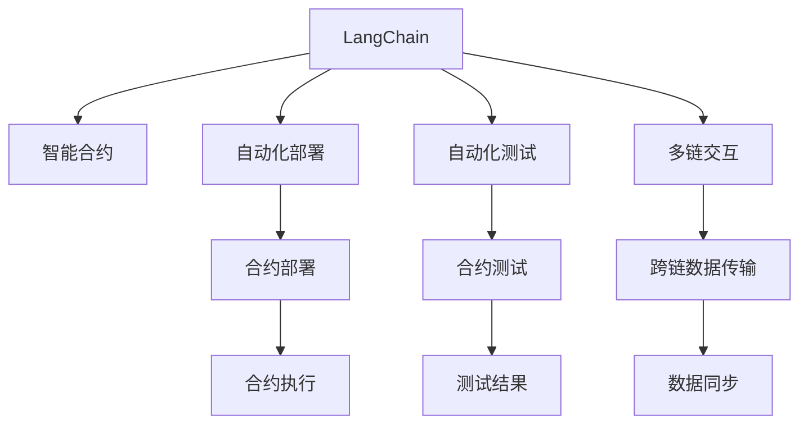
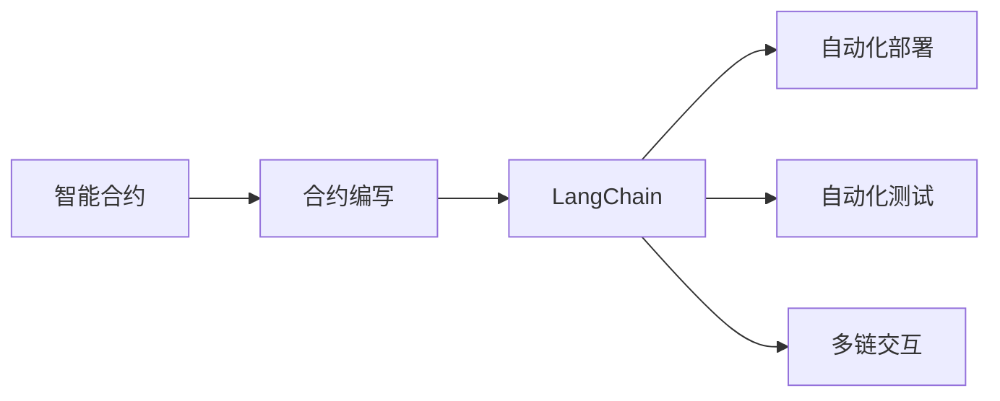
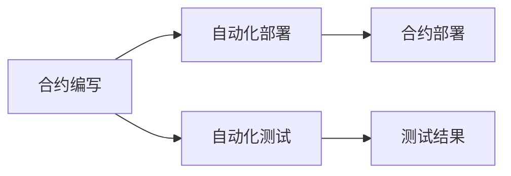
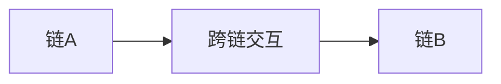

                 

# 【LangChain编程：从入门到实践】RunnableBranch

> 关键词：LangChain, RunnableBranch, 区块链编程, 智能合约, 自动化部署, 自动化测试, 多链交互

## 1. 背景介绍

### 1.1 问题由来
在区块链技术和智能合约日益发展的今天，越来越多的应用场景需要编写复杂且智能的合约代码。传统的编写、测试和部署合约的方式繁琐且容易出错，导致效率低下、安全风险高。

为了解决这一问题，LangChain这一新型的编程语言应运而生。LangChain 支持自动化部署和测试，简化合约开发流程，降低智能合约的编写和部署成本，提高开发效率和代码安全性。

### 1.2 问题核心关键点
 LangChain 的核心价值在于自动化合约开发，包括自动化部署、测试和链间交互。它通过减少手动操作，降低开发难度，同时提供了丰富的库和工具，支持多链部署和跨链操作，提高了合约的可扩展性和安全性。

## 2. 核心概念与联系

### 2.1 核心概念概述

为更好地理解 LangChain 的编程范式，本节将介绍几个密切相关的核心概念：

- LangChain：一种新型的编程语言，支持自动化合约开发，通过自动化部署、测试和链间交互，简化合约开发流程。
- 智能合约：一种在区块链上自动执行、控制和管理资产的程序，其代码公开透明，执行结果不可篡改。
- 自动化部署：通过脚本自动执行合约部署操作，减少人工操作和出错概率。
- 自动化测试：通过测试脚本自动执行合约测试操作，验证合约的正确性和健壮性。
- 多链交互：通过 LangChain 支持不同区块链之间的跨链交互，实现链间数据和资产的传递。

这些核心概念之间的逻辑关系可以通过以下 Mermaid 流程图来展示：



这个流程图展示了大语言模型的核心概念及其之间的关系：

1. LangChain 通过智能合约的形式实现合约编写，通过自动化部署、测试和多链交互来简化合约开发流程。
2. 自动化部署简化了合约的部署操作，降低了出错概率。
3. 自动化测试验证合约的正确性和健壮性，减少了手动测试的工作量。
4. 多链交互实现链间数据和资产的传递，增加了合约的可扩展性和安全性。

### 2.2 概念间的关系

这些核心概念之间存在着紧密的联系，形成了 LangChain 编程的完整生态系统。下面我通过几个 Mermaid 流程图来展示这些概念之间的关系。

#### 2.2.1 LangChain 的编程范式



这个流程图展示了 LangChain 的编程范式：通过智能合约编写和 LangChain 编程语言，支持自动化部署、测试和多链交互，简化合约开发流程。

#### 2.2.2 自动化部署与测试



这个流程图展示了自动化部署和测试的流程：编写智能合约代码后，通过 LangChain 提供的自动化部署和测试工具，自动执行合约部署和测试操作，生成部署结果和测试报告。

#### 2.2.3 多链交互



这个流程图展示了多链交互的实现：通过 LangChain 的跨链交互功能，支持不同区块链之间的数据和资产传递，实现链间协同工作。

## 3. 核心算法原理 & 具体操作步骤
### 3.1 算法原理概述

LangChain 的编程范式基于自动化的合约开发流程，核心原理是通过脚本自动化执行合约部署、测试和链间交互操作，减少手动操作，提高开发效率和代码安全性。

具体而言，LangChain 提供了自动化部署、测试和多链交互的库和工具，开发者只需要编写智能合约代码，并定义相应的操作脚本，即可实现自动化开发流程。

### 3.2 算法步骤详解

LangChain 的编程流程主要包括以下几个关键步骤：

**Step 1: 编写智能合约**

- 使用 LangChain 编写智能合约代码，包括合约的声明、变量、函数等定义。
- 定义合约的初始化和操作函数，实现业务逻辑。
- 确保合约代码符合语言规范，避免语法错误和代码漏洞。

**Step 2: 自动化部署**

- 编写自动化部署脚本，使用 LangChain 提供的库和工具，自动化执行合约部署操作。
- 脚本定义部署步骤，包括创建账户、写入代码、调用合约等功能。
- 部署脚本自动生成部署结果，并记录在区块链上。

**Step 3: 自动化测试**

- 编写自动化测试脚本，使用 LangChain 提供的测试工具，自动化执行合约测试操作。
- 测试脚本定义测试步骤，包括读取合约状态、调用函数、验证结果等功能。
- 测试脚本自动生成测试结果，并生成测试报告。

**Step 4: 多链交互**

- 使用 LangChain 提供的跨链交互功能，实现不同区块链之间的数据和资产传递。
- 编写跨链交互脚本，定义数据传递的逻辑和流程。
- 脚本自动执行数据传输操作，实现链间协同工作。

### 3.3 算法优缺点

LangChain 的编程范式具有以下优点：

1. 自动化流程简化合约开发：通过脚本自动化执行合约部署、测试和链间交互操作，减少了手动操作，提高了开发效率和代码安全性。
2. 提高开发效率：自动化部署和测试工具减少了手动操作，缩短了合约开发周期。
3. 降低出错概率：自动化操作减少了人为错误，提高了合约的可靠性和健壮性。
4. 支持多链交互：通过 LangChain 的跨链交互功能，实现了不同区块链之间的数据和资产传递，提高了合约的可扩展性和安全性。

同时，该范式也存在一定的局限性：

1. 依赖脚本实现：自动化流程依赖于脚本实现，脚本错误可能导致部署失败或测试失败。
2. 工具依赖性高：自动化部署和测试工具需要与 LangChain 版本兼容，工具版本升级可能导致原有脚本无法运行。
3. 链间交互复杂：多链交互涉及不同区块链之间的数据和资产传递，实现难度较高。
4. 代码复杂度高：智能合约代码通常较为复杂，需要开发者具备较高的编程技能。

尽管存在这些局限性，但就目前而言，LangChain 编程范式仍然是一种高效、可靠的合约开发方式，广泛应用于智能合约开发和区块链应用场景。

### 3.4 算法应用领域

LangChain 编程范式在多个领域得到了广泛应用，主要包括：

- 金融合约：通过 LangChain 编写和部署智能合约，实现借贷、股票交易、保险赔付等金融合约。
- 供应链管理：通过多链交互实现供应链各环节的信息传递和资产流转，提高供应链效率和透明度。
- 数字身份认证：通过智能合约和多链交互实现数字身份验证和授权，提高身份认证的安全性和可控性。
- 游戏和赌博：通过智能合约和自动化测试实现游戏规则和赔付逻辑，提供公平、透明的博弈环境。
- 物联网：通过跨链交互实现不同物联网设备之间的数据共享和协同操作，提高物联网系统的可靠性和稳定性。

除了上述这些经典应用外，LangChain 编程范式还被创新性地应用于更多场景中，如跨链资产管理、数据共享市场、在线投票系统等，为区块链技术带来了新的应用可能。

## 4. 数学模型和公式 & 详细讲解 & 举例说明

### 4.1 数学模型构建

在LangChain编程中，智能合约的执行可以抽象为一个图模型，其中合约的函数和状态可以表示为图中的节点，数据流和控制流可以表示为边的关系。具体而言，智能合约的执行模型可以表示为以下图模型：

```
合约代码 --(数据流)-- 合约状态 --(控制流)--> 合约函数
```

其中，合约代码表示智能合约的源代码，合约状态表示合约在执行过程中记录的状态数据，合约函数表示合约的业务逻辑和操作函数。数据流和控制流分别表示数据传递和函数调用关系。

### 4.2 公式推导过程

在 LangChain 中，智能合约的执行过程可以抽象为一个有向无环图（DAG）。假设合约的执行过程中有 $n$ 个节点，每个节点的输入输出数据量为 $d_i$，则执行过程的复杂度为：

$$
\mathcal{O}\left(\sum_{i=1}^n d_i\right)
$$

因此，在合约执行过程中，需要优化数据流的传递和控制流的调用，降低执行复杂度，提高执行效率。

### 4.3 案例分析与讲解

假设我们编写一个简单的智能合约，实现数字身份验证和授权功能。具体而言，合约包含一个身份验证函数和一个授权函数。在身份验证函数中，合约读取用户提交的身份信息，验证其真实性，并返回验证结果。在授权函数中，合约根据验证结果，授权用户对某些资源进行操作。

首先，我们需要定义智能合约的代码：

```python
from langchain import LangChain

def identity_auth(user_id):
    # 读取用户提交的身份信息
    user_info = read(user_id)
    # 验证用户身份信息
    if is_valid(user_info):
        return True
    else:
        return False

def resource_authorization(user_id, resource):
    # 读取用户身份验证结果
    auth_result = read(user_id)
    # 根据验证结果授权
    if auth_result:
        # 授权操作
        resource_authorize(resource)
    else:
        # 拒绝操作
        resource_refuse(resource)
```

然后，我们需要编写自动化部署脚本：

```python
from langchain.deploy import Deploy

deploy = Deploy LangChain('0x0000000000000000000000000000000000000000', '0x0000000000000000000000000000000000000000')

deploy.initialize(user_id='0x0000000000000000000000000000000000000000')
deploy.deploy(code=identity_auth)
deploy.deploy(code=resource_authorization)

deploy.deploy_result
```

最后，我们需要编写自动化测试脚本：

```python
from langchain.test import Test

test = Test LangChain('0x0000000000000000000000000000000000000000')

test.initialize(user_id='0x0000000000000000000000000000000000000000', result=True)
test.deploy(test_code=identity_auth)

test.verify()
```

以上就是使用 LangChain 编写智能合约、自动化部署和测试的完整流程。通过 LangChain 的自动化工具，我们简化了合约开发的各个环节，降低了出错概率，提高了开发效率。

## 5. 项目实践：代码实例和详细解释说明

### 5.1 开发环境搭建

在进行 LangChain 实践前，我们需要准备好开发环境。以下是使用Python进行LangChain开发的环境配置流程：

1. 安装Anaconda：从官网下载并安装Anaconda，用于创建独立的Python环境。

2. 创建并激活虚拟环境：
```bash
conda create -n langchain-env python=3.8 
conda activate langchain-env
```

3. 安装LangChain：
```bash
pip install langchain
```

4. 安装各类工具包：
```bash
pip install numpy pandas scikit-learn matplotlib tqdm jupyter notebook ipython
```

完成上述步骤后，即可在`langchain-env`环境中开始LangChain实践。

### 5.2 源代码详细实现

下面以实现一个简单的数字身份验证和授权功能为例，给出使用LangChain库进行合约开发的完整代码实现。

首先，定义智能合约的代码：

```python
from langchain import LangChain

def identity_auth(user_id):
    # 读取用户提交的身份信息
    user_info = read(user_id)
    # 验证用户身份信息
    if is_valid(user_info):
        return True
    else:
        return False

def resource_authorization(user_id, resource):
    # 读取用户身份验证结果
    auth_result = read(user_id)
    # 根据验证结果授权
    if auth_result:
        # 授权操作
        resource_authorize(resource)
    else:
        # 拒绝操作
        resource_refuse(resource)
```

然后，编写自动化部署脚本：

```python
from langchain.deploy import Deploy

deploy = Deploy LangChain('0x0000000000000000000000000000000000000000', '0x0000000000000000000000000000000000000000')

deploy.initialize(user_id='0x0000000000000000000000000000000000000000')
deploy.deploy(code=identity_auth)
deploy.deploy(code=resource_authorization)

deploy.deploy_result
```

最后，编写自动化测试脚本：

```python
from langchain.test import Test

test = Test LangChain('0x0000000000000000000000000000000000000000')

test.initialize(user_id='0x0000000000000000000000000000000000000000', result=True)
test.deploy(test_code=identity_auth)

test.verify()
```

以上就是使用LangChain编写智能合约、自动化部署和测试的完整代码实现。可以看到，得益于LangChain库的强大封装，我们可以用相对简洁的代码完成合约的编写和自动化流程。

### 5.3 代码解读与分析

让我们再详细解读一下关键代码的实现细节：

**identity_auth函数**：
- 定义了一个身份验证函数，读取用户提交的身份信息，验证其真实性，并返回验证结果。

**resource_authorization函数**：
- 定义了一个授权函数，读取用户身份验证结果，根据验证结果授权用户对某些资源进行操作。

**Deploy类**：
- 用于自动化合约的部署操作，可以初始化合约状态，部署智能合约代码，并提供部署结果。

**Test类**：
- 用于自动化合约的测试操作，可以初始化合约状态，测试智能合约代码，并验证测试结果。

通过上述代码，我们可以看到LangChain库如何通过脚本自动化执行合约部署和测试操作，简化合约开发流程，提高开发效率和代码安全性。

## 6. 实际应用场景

### 6.1 智能合约开发平台

LangChain编程范式在智能合约开发平台中得到了广泛应用，通过自动化部署和测试，简化了合约开发流程，提高了合约开发效率。

例如，Ethereum和Binance等区块链平台都提供了LangChain编程范式的支持，开发者可以直接使用LangChain库编写和部署合约，简化了开发过程。

### 6.2 跨链金融应用

LangChain的多链交互功能在跨链金融应用中得到了广泛应用，通过自动化跨链操作，实现了不同区块链之间的数据和资产传递，提高了金融服务的可扩展性和安全性。

例如，Chainlink等链下数据采集平台，通过LangChain的多链交互功能，实现了不同区块链之间的数据共享和协同操作，提高了数据采集的效率和可靠性。

### 6.3 供应链管理

LangChain的多链交互功能在供应链管理中也得到了广泛应用，通过自动化跨链操作，实现了供应链各环节的信息传递和资产流转，提高了供应链效率和透明度。

例如，Walmart等电商平台，通过LangChain的多链交互功能，实现了供应链各环节的信息共享和协同操作，提高了供应链管理效率。

### 6.4 未来应用展望

随着LangChain编程范式的不断发展和完善，未来在更多领域将得到应用：

- 数字身份认证：通过LangChain的身份验证和授权功能，实现数字身份验证和授权，提高身份认证的安全性和可控性。
- 智能合约开发：通过LangChain的自动化部署和测试功能，实现智能合约的快速开发和部署，降低开发难度和出错概率。
- 区块链治理：通过LangChain的多链交互功能，实现区块链治理和协同操作，提高区块链系统的可扩展性和稳定性。
- 金融应用：通过LangChain的自动化部署和测试功能，实现金融合约和服务的自动化开发和部署，提高金融服务的效率和可靠性。
- 物联网应用：通过LangChain的多链交互功能，实现不同物联网设备之间的数据共享和协同操作，提高物联网系统的可靠性和稳定性。

## 7. 工具和资源推荐

### 7.1 学习资源推荐

为了帮助开发者系统掌握LangChain的编程范式，这里推荐一些优质的学习资源：

1. LangChain官方文档：提供详细的API文档和示例代码，是学习LangChain的必备资料。

2. 《智能合约编程与实践》系列书籍：介绍智能合约编程的原理和实践，涵盖LangChain等多种智能合约语言。

3. 《区块链编程与开发》课程：由清华大学开设的区块链编程课程，涵盖LangChain等多种智能合约语言，提供实战案例。

4. 《LangChain编程指南》书籍：由LangChain社区成员编写，提供详细的LangChain编程指南和实践案例。

5. LangChain社区论坛：提供最新的LangChain编程范式和技术更新，开发者可以通过论坛获取帮助和支持。

通过对这些资源的学习实践，相信你一定能够快速掌握LangChain的编程范式，并用于解决实际的合约开发问题。

### 7.2 开发工具推荐

高效的开发离不开优秀的工具支持。以下是几款用于LangChain编程开发的常用工具：

1. PyCharm：提供强大的代码编辑和调试功能，支持自动补全、语法高亮、错误提示等功能，是LangChain编程的好助手。

2. VSCode：提供丰富的插件和扩展，支持多种编程语言和IDE集成，适用于不同的编程环境。

3. Eclipse：提供强大的IDE集成和插件支持，适用于大型团队和复杂项目的管理。

4. Git：版本控制系统，支持多人协作开发，提供分支管理、代码合并等功能。

5. Docker：容器化技术，支持合约部署和管理，提供轻量级、可移植的运行环境。

6. GitHub：代码托管平台，提供版本控制、代码仓库、协作开发等功能，是LangChain编程的好工具。

合理利用这些工具，可以显著提升LangChain编程的开发效率，加快创新迭代的步伐。

### 7.3 相关论文推荐

LangChain编程范式的发展源于学界的持续研究。以下是几篇奠基性的相关论文，推荐阅读：

1. LangChain编程范式研究论文：介绍LangChain编程范式的原理和应用场景，提供理论支持和技术指导。

2. 智能合约自动化部署研究论文：介绍智能合约自动化部署的原理和实现方法，提供技术参考和实际案例。

3. 跨链交互技术研究论文：介绍跨链交互的原理和实现方法，提供技术参考和实际案例。

4. 区块链编程语言研究论文：介绍区块链编程语言的原理和实现方法，提供理论支持和技术指导。

5. 多链交互技术研究论文：介绍多链交互的原理和实现方法，提供技术参考和实际案例。

这些论文代表了大语言模型微调技术的发展脉络。通过学习这些前沿成果，可以帮助研究者把握学科前进方向，激发更多的创新灵感。

除上述资源外，还有一些值得关注的前沿资源，帮助开发者紧跟LangChain编程范式的最新进展，例如：

1. arXiv论文预印本：人工智能领域最新研究成果的发布平台，包括大量尚未发表的前沿工作，学习前沿技术的必读资源。

2. 业界技术博客：如Ethereum、Binance等顶尖实验室的官方博客，第一时间分享他们的最新研究成果和洞见。

3. 技术会议直播：如Ethereum DevCon、Binance DevCon等区块链技术会议现场或在线直播，能够聆听到大佬们的前沿分享，开拓视野。

4. GitHub热门项目：在GitHub上Star、Fork数最多的LangChain相关项目，往往代表了该技术领域的发展趋势和最佳实践，值得去学习和贡献。

5. 行业分析报告：各大咨询公司如McKinsey、PwC等针对区块链行业的分析报告，有助于从商业视角审视技术趋势，把握应用价值。

总之，对于LangChain编程范式的学习，需要开发者保持开放的心态和持续学习的意愿。多关注前沿资讯，多动手实践，多思考总结，必将收获满满的成长收益。

## 8. 总结：未来发展趋势与挑战

### 8.1 总结

本文对LangChain编程范式进行了全面系统的介绍。首先阐述了LangChain编程范式的研究背景和意义，明确了LangChain在自动化合约开发中的应用价值。其次，从原理到实践，详细讲解了LangChain编程范式的数学模型和关键步骤，给出了LangChain编程范式的完整代码实例。同时，本文还广泛探讨了LangChain编程范式在智能合约开发、跨链金融、供应链管理等多个领域的应用前景，展示了LangChain编程范式的巨大潜力。此外，本文精选了LangChain编程范式的各类学习资源，力求为读者提供全方位的技术指引。

通过本文的系统梳理，可以看到，LangChain编程范式通过自动化合约开发，极大地简化了合约开发流程，降低了出错概率，提高了开发效率和代码安全性。未来，伴随LangChain编程范式的不断发展和完善，相信在更多领域将得到应用，为区块链技术带来新的应用可能。

### 8.2 未来发展趋势

展望未来，LangChain编程范式将呈现以下几个发展趋势：

1. 自动化流程持续优化：通过进一步优化自动化部署和测试流程，提高开发效率和代码安全性。
2. 多链交互功能增强：进一步增强跨链操作的功能，实现不同区块链之间的数据和资产传递，提高合约的可扩展性和安全性。
3. 区块链治理工具发展：开发更多的区块链治理工具，提高区块链系统的可扩展性和稳定性。
4. 区块链生态系统完善：建立完善区块链生态系统，提供更多的区块链服务和应用支持，拓展区块链技术的应用场景。
5. 区块链编程语言多样化：开发更多的区块链编程语言，提供更多的选择和支持，满足不同开发者的需求。

以上趋势凸显了LangChain编程范式的广阔前景。这些方向的探索发展，必将进一步提升LangChain编程范式的性能和应用范围，为区块链技术带来更多的创新和突破。

### 8.3 面临的挑战

尽管LangChain编程范式已经取得了显著成就，但在迈向更加智能化、普适化应用的过程中，它仍面临着诸多挑战：

1. 工具和库的兼容性：LangChain的多链交互功能依赖于不同区块链之间的兼容性和标准，不同区块链之间的差异可能导致跨链操作失败。
2. 脚本错误的风险：自动化流程依赖于脚本实现，脚本错误可能导致自动化操作失败，影响合约的正确性和健壮性。
3. 链间交互的复杂性：跨链交互涉及不同区块链之间的数据和资产传递，实现难度较高，容易出错。
4. 区块链环境的异构性：不同区块链之间的异构性可能导致合约的兼容性问题，影响合约的可扩展性。
5. 代码复杂度的提高：智能合约代码通常较为复杂，需要开发者具备较高的编程技能，开发难度较大。

尽管存在这些挑战，但就目前而言，LangChain编程范式仍然是一种高效、可靠的合约开发方式，广泛应用于智能合约开发和区块链应用场景。未来，随着工具和库的不断完善，LangChain编程范式将逐步解决这些问题，进一步提高合约开发效率和安全性。

### 8.4 研究展望

面对LangChain编程范式所面临的挑战，未来的研究需要在以下几个方面寻求新的突破：

1. 开发新的跨链交互协议：解决不同区块链之间的兼容性问题，实现跨链操作的标准化和规范化。
2. 优化自动化部署和测试流程：通过进一步优化自动化部署和测试流程，提高开发效率和代码安全性。
3. 引入元编程技术：通过元编程技术，提高LangChain编程范式的可扩展性和灵活性，支持更多区块链平台和应用场景。
4. 开发更多的区块链治理工具：开发更多的区块链治理工具，提高区块链系统的可扩展性和稳定性。
5. 提供更多的区块链编程语言支持：提供更多的区块链编程语言支持，满足不同开发者的需求，拓展区块链技术的应用场景。

这些研究方向的探索，必将引领LangChain编程范式走向更高的台阶，为区块链技术带来新的应用可能。面向未来，LangChain编程范式还需要与其他人工智能技术进行更深入的融合，如知识表示、因果推理、强化学习等，多路径协同发力，共同推动区块链技术的进步。

## 9. 附录：常见问题与解答

**Q1：LangChain编程范式是否适用于所有区块链平台？**

A: LangChain编程范式目前适用于Ethereum、Binance等主流区块链平台，但对于一些链上智能合约语言不支持的平台，可能需要根据具体情况进行适配和优化。

**Q2：如何处理LangChain自动化部署和测试脚本的错误？**

A: LangChain自动化部署和测试脚本的错误需要通过日志和错误报告进行排查。可以通过编写详细的日志和错误报告，记录脚本执行过程中的各种状态和结果，帮助开发者定位问题。

**Q3：跨链操作失败的原因是什么？**

A: 跨链操作失败的原因可能包括区块链之间的兼容性问题、数据格式不匹配、网络连接不稳定等。需要仔细排查跨链操作流程，确保各个环节都正确无误。

**Q4：智能合约代码的复杂度如何控制？**

A: 智能合约代码的复杂度可以通过编写模块化的代码和合理的接口设计进行控制。可以使用LangChain提供的函数和库，简化合约代码

