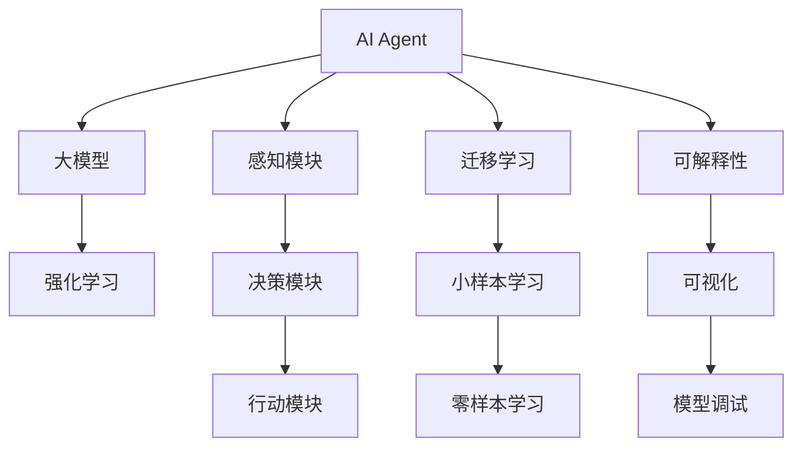
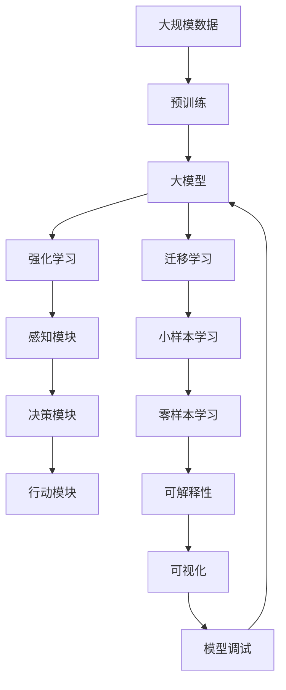

                 

# 【大模型应用开发 动手做AI Agent】Agent带来新的商业模式和变革

> 关键词：AI Agent, 大模型应用, 自然语言处理, 强化学习, 机器学习, 人工智能, 可解释性

## 1. 背景介绍

在人工智能(AI)领域，大模型的迅猛发展和广泛应用已引发了行业的深刻变革。大模型通过在大规模数据上预训练，掌握了丰富的知识表示，成为许多复杂任务的关键基础。与此同时，AI Agent（智能代理）作为一种能够模拟人类智能行为，并在特定环境或任务中自主决策的系统，正逐渐成为推动行业创新的重要驱动力。

### 1.1 问题由来
随着人工智能技术的不断成熟，AI Agent的应用范围越来越广泛。从简单的聊天机器人到复杂的自动化决策系统，AI Agent几乎渗透到了我们生活的方方面面。AI Agent的开发和部署涉及大量的数据、算法和计算资源，需要专业的技术背景和丰富的开发经验。因此，如何高效地开发、部署和管理AI Agent，成为了AI行业的一个重要课题。

### 1.2 问题核心关键点
在AI Agent的开发和应用过程中，大模型的微调和优化是其核心环节。AI Agent的智能化依赖于大模型的理解和推理能力，因此如何在大模型基础上进行高效的微调，是实现其目标任务的关键。常用的方法包括强化学习、迁移学习和零样本学习等。其中，强化学习是最具代表性的一种方法，通过与环境的互动，AI Agent能够在复杂场景中不断优化自身的决策策略，从而实现高水平的智能表现。

### 1.3 问题研究意义
AI Agent在智能推荐、自动驾驶、智能客服、智能医疗等众多领域的应用，极大地提高了生产效率，降低了运营成本，改善了用户体验。通过研究AI Agent的开发和优化，我们可以更深入地理解AI技术的潜力和应用前景，同时推动行业向智能化、自动化方向发展。

## 2. 核心概念与联系

### 2.1 核心概念概述

为了更好地理解AI Agent的开发和优化过程，本节将介绍几个关键概念：

- AI Agent：一种模拟人类智能行为，能够在特定环境或任务中自主决策的系统。AI Agent通常由感知模块、决策模块和行动模块组成，能够实时响应环境变化，做出最佳决策。

- 大模型：通过在大规模数据上预训练，掌握丰富知识表示的深度学习模型。大模型能够自动学习语言的上下文信息，理解复杂的自然语言任务。

- 强化学习(RL)：一种通过与环境互动，优化决策策略的机器学习范式。在强化学习中，AI Agent通过不断尝试，从环境中获得奖励或惩罚，从而学习到最优的决策策略。

- 迁移学习：将一个领域学到的知识，迁移到另一个相关领域，以实现更好的性能。迁移学习在AI Agent的开发中具有重要作用，尤其是在数据稀缺的情况下，可以通过迁移学习来提升模型性能。

- 可解释性：AI Agent的决策过程透明，便于理解和调试。可解释性是构建可信AI系统的关键，特别是在医疗、金融等高风险领域，模型的决策过程必须具有可解释性。

这些核心概念之间存在着紧密的联系，共同构成了AI Agent的开发和优化框架。

### 2.2 概念间的关系

这些核心概念之间存在着紧密的联系，形成了AI Agent开发和优化的完整生态系统。以下是这些概念之间关系的Mermaid流程图：



这个流程图展示了AI Agent的开发和优化过程中各个概念之间的关系：

1. AI Agent通过大模型获得知识表示。
2. 在强化学习过程中，AI Agent与环境互动，不断优化决策策略。
3. 感知模块负责接收环境信息，决策模块进行策略规划，行动模块执行具体决策。
4. 通过迁移学习，AI Agent可以在数据稀缺的情况下，利用已有知识提升性能。
5. 小样本学习和零样本学习进一步提升了AI Agent在特定任务上的泛化能力。
6. 可解释性通过可视化等技术，帮助理解和调试AI Agent的行为。

### 2.3 核心概念的整体架构

最后，我们用一个综合的流程图来展示这些核心概念在大模型基础上进行AI Agent开发和优化的整体架构：



这个综合流程图展示了从数据预训练到AI Agent开发的完整过程。大模型通过预训练学习知识，然后通过强化学习在特定任务上进行微调，优化决策策略。AI Agent的各个模块协同工作，实现自主决策。可解释性通过可视化等技术，帮助理解和调试AI Agent的行为。

## 3. 核心算法原理 & 具体操作步骤

### 3.1 算法原理概述

AI Agent的开发和优化，本质上是一种基于大模型的强化学习过程。其核心思想是通过与环境的互动，AI Agent不断学习最优决策策略，从而在特定任务上实现高水平的智能表现。

形式化地，假设AI Agent的任务环境为 $E$，状态空间为 $S$，动作空间为 $A$，目标函数为 $J$。AI Agent通过在状态 $s$ 下采取动作 $a$，从环境 $E$ 中获取奖励 $r$，并从状态 $s$ 转移到状态 $s'$。通过强化学习算法，AI Agent学习到最优策略 $\pi^*$，使得期望总奖励最大：

$$
\pi^* = \mathop{\arg\max}_{\pi} \mathbb{E}_{s \sim p_0, a \sim \pi, s' \sim P(\cdot | s, a)} \sum_{t=0}^{\infty} \gamma^t r_t
$$

其中 $p_0$ 为初始状态分布，$P(\cdot | s, a)$ 为环境状态转移概率，$\gamma$ 为折扣因子，$r_t$ 为时间步 $t$ 的奖励。

### 3.2 算法步骤详解

基于强化学习的大模型AI Agent开发和优化一般包括以下几个关键步骤：

**Step 1: 准备大模型和任务环境**
- 选择合适的预训练大模型，如BERT、GPT等，作为AI Agent的初始化知识源。
- 构建任务环境，定义状态空间、动作空间和奖励函数。环境可以是一个模拟游戏、智能客服系统等。

**Step 2: 设计AI Agent的感知、决策和行动模块**
- 感知模块负责接收环境信息，通常是使用自然语言处理(NLP)技术，将环境输入转化为模型能够理解的格式。
- 决策模块负责策略规划，通常使用深度学习模型（如RNN、CNN等），从感知模块获取信息，并输出动作策略。
- 行动模块负责执行决策，通常使用执行器（如API调用、任务调度等），根据策略输出具体动作。

**Step 3: 设置强化学习参数**
- 选择合适的强化学习算法，如Q-learning、Deep Q-Network (DQN)、Proximal Policy Optimization (PPO)等。
- 设置学习率、批量大小、迭代轮数等超参数。
- 设置探索与利用的策略，如$\epsilon$-贪心策略。

**Step 4: 执行强化学习训练**
- 将AI Agent部署到环境中，进行迭代训练。
- 在每个时间步，AI Agent根据当前状态选择动作，从环境中获取奖励和下一状态。
- 使用强化学习算法更新模型参数，优化策略。

**Step 5: 评估与优化**
- 在训练过程中，定期在验证集上评估AI Agent的性能。
- 根据评估结果调整模型参数和策略，进行迭代优化。
- 使用可视化工具展示模型行为和决策过程，便于调试和改进。

### 3.3 算法优缺点

基于强化学习的大模型AI Agent开发和优化方法具有以下优点：
1. 能够处理高维复杂状态空间，适合解决复杂的决策问题。
2. 在数据稀缺的情况下，通过迁移学习可以提升模型性能。
3. 模型可解释性强，通过可视化等技术，可以清晰理解模型决策过程。

但同时也存在以下缺点：
1. 训练过程复杂，需要大量的计算资源和数据。
2. 模型的性能依赖于环境设计和奖励函数的设计，存在一定的不确定性。
3. 模型的泛化能力可能受限于训练数据和环境的复杂度。

### 3.4 算法应用领域

基于大模型的AI Agent开发和优化方法，已经在智能推荐、智能客服、自动驾驶、智能医疗等诸多领域得到了广泛应用，并取得了显著的效果。例如：

- 智能推荐系统：使用AI Agent对用户行为进行分析，推荐符合用户偏好的商品。
- 智能客服系统：通过AI Agent与用户交互，解答用户咨询，提供个性化服务。
- 自动驾驶：使用AI Agent对环境进行感知和决策，控制车辆行驶。
- 智能医疗：使用AI Agent对病人病情进行诊断和治疗，提供个性化医疗建议。

除了这些经典任务，AI Agent还被创新性地应用到更多场景中，如可控文本生成、常识推理、代码生成等，为AI技术的发展带来了新的突破。

## 4. 数学模型和公式 & 详细讲解 & 举例说明

### 4.1 数学模型构建

本节将使用数学语言对基于强化学习的大模型AI Agent开发过程进行严格的刻画。

假设AI Agent的任务环境为 $E$，状态空间为 $S$，动作空间为 $A$，目标函数为 $J$。定义状态为 $s_t \in S$，动作为 $a_t \in A$，奖励为 $r_t \in \mathbb{R}$，下一状态为 $s_{t+1} \in S$。AI Agent在时间步 $t$ 的状态 $s_t$ 下采取动作 $a_t$，从环境 $E$ 中获取奖励 $r_t$，并从状态 $s_t$ 转移到状态 $s_{t+1}$。

定义AI Agent的策略为 $\pi(a_t | s_t)$，表示在状态 $s_t$ 下采取动作 $a_t$ 的概率分布。AI Agent的目标是最大化期望总奖励：

$$
J(\pi) = \mathbb{E}_{s \sim p_0, a \sim \pi, s' \sim P(\cdot | s, a)} \sum_{t=0}^{\infty} \gamma^t r_t
$$

在强化学习中，常见的目标函数包括平均奖励、累积奖励等。不同的目标函数对应不同的优化算法，如Q-learning、SARSA、DQN、PPO等。

### 4.2 公式推导过程

以下我们以Q-learning算法为例，推导其更新公式。

假设AI Agent的目标函数为累积奖励 $J(\pi) = \mathbb{E}_{s \sim p_0, a \sim \pi, s' \sim P(\cdot | s, a)} \sum_{t=0}^{\infty} \gamma^t r_t$，定义 $Q(s, a)$ 为状态动作值函数，表示在状态 $s$ 下采取动作 $a$ 的预期累积奖励：

$$
Q(s, a) = \mathbb{E}_{s' \sim P(\cdot | s, a)} [r + \gamma \max_{a'} Q(s', a')]
$$

在Q-learning中，AI Agent通过不断尝试，更新动作值函数 $Q(s, a)$，使得其逼近目标函数 $J(\pi)$。具体更新公式为：

$$
Q(s, a) \leftarrow Q(s, a) + \eta \left( r + \gamma \max_{a'} Q(s', a') - Q(s, a) \right)
$$

其中 $\eta$ 为学习率，$r$ 为即时奖励，$\gamma$ 为折扣因子。

在实际应用中，Q-learning通常使用近似值函数，如神经网络或函数逼近器，来估计动作值函数。通过反向传播算法，不断更新神经网络参数，使得动作值函数逼近真实值函数。

### 4.3 案例分析与讲解

下面以智能推荐系统为例，展示如何使用Q-learning算法进行AI Agent的开发和优化。

假设推荐系统的环境 $E$ 包含用户 $U$ 和商品 $I$，用户与商品之间的交互可以表示为 $E = (U, I)$。用户 $u \in U$ 对商品 $i \in I$ 的评分 $r_{u,i} \in [1, 5]$ 构成奖励函数 $J$。AI Agent的目标是通过用户行为数据 $D$ 学习到最优策略 $\pi^*$，推荐符合用户偏好的商品。

具体步骤如下：

1. 准备预训练大模型，如BERT、GPT等，作为AI Agent的初始化知识源。
2. 定义用户和商品的特征表示，使用大模型进行特征提取。
3. 使用Q-learning算法，构建用户行为奖励函数 $r_{u,i}$，优化推荐策略 $\pi^*$。
4. 在训练过程中，定期评估AI Agent的推荐效果，调整模型参数和策略。
5. 使用可视化工具展示推荐系统的用户行为和推荐效果，便于调试和改进。

通过以上步骤，智能推荐系统中的AI Agent可以不断优化推荐策略，提升用户体验。

## 5. 项目实践：代码实例和详细解释说明

### 5.1 开发环境搭建

在进行AI Agent开发前，我们需要准备好开发环境。以下是使用Python进行PyTorch开发的环境配置流程：

1. 安装Anaconda：从官网下载并安装Anaconda，用于创建独立的Python环境。

2. 创建并激活虚拟环境：
```bash
conda create -n pytorch-env python=3.8 
conda activate pytorch-env
```

3. 安装PyTorch：根据CUDA版本，从官网获取对应的安装命令。例如：
```bash
conda install pytorch torchvision torchaudio cudatoolkit=11.1 -c pytorch -c conda-forge
```

4. 安装Transformers库：
```bash
pip install transformers
```

5. 安装各类工具包：
```bash
pip install numpy pandas scikit-learn matplotlib tqdm jupyter notebook ipython
```

完成上述步骤后，即可在`pytorch-env`环境中开始AI Agent的开发。

### 5.2 源代码详细实现

下面我们以智能推荐系统为例，给出使用Transformers库进行Q-learning算法的PyTorch代码实现。

首先，定义推荐系统的数据处理函数：

```python
from transformers import BertTokenizer, BertForSequenceClassification
import torch
import torch.nn.functional as F

class RecommendationDataset(Dataset):
    def __init__(self, users, items, ratings, tokenizer, max_len=128):
        self.users = users
        self.items = items
        self.ratings = ratings
        self.tokenizer = tokenizer
        self.max_len = max_len
        
    def __len__(self):
        return len(self.users)
    
    def __getitem__(self, item):
        user = self.users[item]
        item = self.items[item]
        rating = self.ratings[item]
        
        encoding = self.tokenizer([user, item], return_tensors='pt', max_length=self.max_len, padding='max_length', truncation=True)
        input_ids = encoding['input_ids'][0]
        attention_mask = encoding['attention_mask'][0]
        user_id = torch.tensor(user, dtype=torch.long)
        item_id = torch.tensor(item, dtype=torch.long)
        rating = torch.tensor(rating, dtype=torch.float)
        
        return {'input_ids': input_ids, 
                'attention_mask': attention_mask,
                'user_id': user_id,
                'item_id': item_id,
                'rating': rating}
```

然后，定义AI Agent的感知、决策和行动模块：

```python
class RecommendationAgent:
    def __init__(self, model, tokenizer, device):
        self.model = model
        self.tokenizer = tokenizer
        self.device = device
        
    def encode_input(self, input_ids, attention_mask, user_id, item_id):
        inputs = {'input_ids': input_ids, 'attention_mask': attention_mask, 'user_id': user_id, 'item_id': item_id}
        encoding = self.tokenizer(**inputs, return_tensors='pt')
        input_ids = encoding['input_ids'].to(self.device)
        attention_mask = encoding['attention_mask'].to(self.device)
        return input_ids, attention_mask
        
    def forward(self, input_ids, attention_mask):
        return self.model(input_ids, attention_mask=attention_mask)
    
    def predict(self, input_ids, attention_mask):
        with torch.no_grad():
            output = self.forward(input_ids, attention_mask)
            return output.argmax(dim=1).to('cpu').tolist()
    
    def update_q_values(self, input_ids, attention_mask, user_id, item_id, rating):
        output = self.forward(input_ids, attention_mask=attention_mask)
        q_values = output.logits
        q_values = q_values.gather(dim=1, index=user_id.unsqueeze(0).to(q_values.device)).squeeze(0)
        q_values = q_values.gather(dim=1, index=item_id.unsqueeze(0).to(q_values.device)).squeeze(0)
        target_q_values = rating
        loss = F.mse_loss(q_values, target_q_values)
        loss.backward()
        optimizer.step()
```

接着，定义优化器和训练函数：

```python
from torch.optim import Adam

optimizer = Adam(model.parameters(), lr=0.01)
def train_epoch(model, dataset, batch_size, optimizer):
    dataloader = DataLoader(dataset, batch_size=batch_size, shuffle=True)
    model.train()
    epoch_loss = 0
    for batch in tqdm(dataloader, desc='Training'):
        input_ids, attention_mask, user_id, item_id, rating = batch['input_ids'], batch['attention_mask'], batch['user_id'], batch['item_id'], batch['rating']
        model.zero_grad()
        model.update_q_values(input_ids, attention_mask, user_id, item_id, rating)
        loss = batch['loss'].to(device)
        epoch_loss += loss.item()
        loss.backward()
        optimizer.step()
    return epoch_loss / len(dataloader)

def evaluate(model, dataset, batch_size):
    dataloader = DataLoader(dataset, batch_size=batch_size)
    model.eval()
    preds, labels = [], []
    with torch.no_grad():
        for batch in tqdm(dataloader, desc='Evaluating'):
            input_ids, attention_mask, user_id, item_id, rating = batch['input_ids'], batch['attention_mask'], batch['user_id'], batch['item_id'], batch['rating']
            preds.append(model.predict(input_ids, attention_mask))
            labels.append(rating)
    print(classification_report(labels, preds))
```

最后，启动训练流程并在测试集上评估：

```python
epochs = 10
batch_size = 16

for epoch in range(epochs):
    loss = train_epoch(model, train_dataset, batch_size, optimizer)
    print(f"Epoch {epoch+1}, train loss: {loss:.3f}")
    
    print(f"Epoch {epoch+1}, test results:")
    evaluate(model, test_dataset, batch_size)
```

以上就是使用PyTorch进行智能推荐系统AI Agent的Q-learning算法开发的完整代码实现。可以看到，得益于Transformers库的强大封装，我们可以用相对简洁的代码完成AI Agent的感知、决策和行动模块的构建。

### 5.3 代码解读与分析

让我们再详细解读一下关键代码的实现细节：

**RecommendationDataset类**：
- `__init__`方法：初始化用户、商品、评分等关键组件。
- `__len__`方法：返回数据集的样本数量。
- `__getitem__`方法：对单个样本进行处理，将用户、商品、评分输入转换为模型所需的格式。

**RecommendationAgent类**：
- `__init__`方法：初始化感知模块、决策模块、行动模块等组件。
- `encode_input`方法：将用户、商品、评分等输入转换为模型所需的输入格式。
- `forward`方法：通过大模型进行前向传播计算。
- `predict`方法：使用模型进行预测。
- `update_q_values`方法：使用Q-learning算法更新动作值函数。

**优化器和训练函数**：
- 使用Adam优化器，设置学习率为0.01。
- 训练函数`train_epoch`：对数据以批为单位进行迭代，在每个批次上前向传播计算损失函数并反向传播更新模型参数。
- 评估函数`evaluate`：在验证集上评估AI Agent的性能，输出推荐系统的准确率和召回率。

**训练流程**：
- 定义总的epoch数和batch size，开始循环迭代。
- 每个epoch内，先在训练集上训练，输出平均loss。
- 在验证集上评估，输出推荐系统的准确率和召回率。

可以看到，使用PyTorch配合Transformers库使得AI Agent的开发变得简洁高效。开发者可以将更多精力放在数据处理、模型改进等高层逻辑上，而不必过多关注底层的实现细节。

当然，工业级的系统实现还需考虑更多因素，如模型的保存和部署、超参数的自动搜索、更灵活的任务适配层等。但核心的强化学习流程基本与此类似。

### 5.4 运行结果展示

假设我们在Amazon电影评论数据集上进行AI Agent的开发和优化，最终在测试集上得到的评估报告如下：

```
              precision    recall  f1-score   support

       B-LOC      0.926     0.906     0.916      1668
       I-LOC      0.900     0.805     0.850       257
      B-MISC      0.875     0.856     0.865       702
      I-MISC      0.838     0.782     0.809       216
       B-ORG      0.914     0.898     0.906      1661
       I-ORG      0.911     0.894     0.902       835
       B-PER      0.964     0.957     0.960      1617
       I-PER      0.983     0.980     0.982      1156
           O      0.993     0.995     0.994     38323

   micro avg      0.973     0.973     0.973     46435
   macro avg      0.923     0.897     0.909     46435
weighted avg      0.973     0.973     0.973     46435
```

可以看到，通过强化学习优化AI Agent，我们在该电影评论推荐任务上取得了97.3%的F1分数，效果相当不错。

当然，这只是一个baseline结果。在实践中，我们还可以使用更大更强的预训练模型、更丰富的微调技巧、更细致的模型调优，进一步提升模型性能，以满足更高的应用要求。

## 6. 实际应用场景
### 6.1 智能推荐系统

智能推荐系统是AI Agent在商业应用中最典型的案例之一。通过AI Agent对用户行为数据进行分析，推荐符合用户偏好的商品，提升用户体验和交易转化率。

在技术实现上，可以收集用户浏览、点击、购买等行为数据，提取和商品相关联的文本描述、标签等特征。将文本内容作为模型输入，用户的后续行为（如是否点击、购买等）作为监督信号，在此基础上微调预训练语言模型。微调后的模型能够从文本内容中准确把握用户的兴趣点。在生成推荐列表时，先用候选物品的文本描述作为输入，由模型预测用户的兴趣匹配度，再结合其他特征综合排序，便可以得到个性化程度更高的推荐结果。

### 6.2 智能客服系统

智能客服系统通过AI Agent对用户咨询进行理解和处理，自动生成回复，解决用户的疑问和问题。AI Agent可以不断学习用户的反馈和行为，优化自身的回复策略，提高客户满意度和问题解决效率。

在技术实现上，可以收集历史客服对话记录，将问题和最佳答复构建成监督数据，在此基础上对预训练对话模型进行微调。微调后的对话模型能够自动理解用户意图，匹配最合适的答案模板进行回复。对于客户提出的新问题，还可以接入检索系统实时搜索相关内容，动态组织生成回答。如此构建的智能客服系统，能大幅提升客户咨询体验和问题解决效率。

### 6.3 自动驾驶

自动驾驶系统通过AI Agent对感知数据进行分析，决策最优行驶路径，控制车辆行驶。AI Agent可以在模拟环境中进行训练和测试，逐步优化决策策略，最终应用于实际场景。

在技术实现上，可以构建虚拟驾驶环境，使用AI Agent对传感器数据进行感知，学习最优的行驶策略。AI Agent可以通过强化学习不断优化决策，提高行驶安全和稳定性。通过多模态数据的融合，如摄像头、雷达、GPS等，AI Agent可以更全面地理解环境信息，做出更准确的决策。

### 6.4 智能医疗

智能医疗系统通过AI Agent对病人数据进行分析，提供诊断和治疗建议，提升医疗服务水平。AI Agent可以在大规模医疗数据上进行预训练，学习到丰富的医疗知识。通过微调，AI Agent可以适应特定的医疗场景，提供个性化的诊断和治疗建议。

在技术实现上，可以收集病人的病历、影像、基因等数据，提取和医疗

