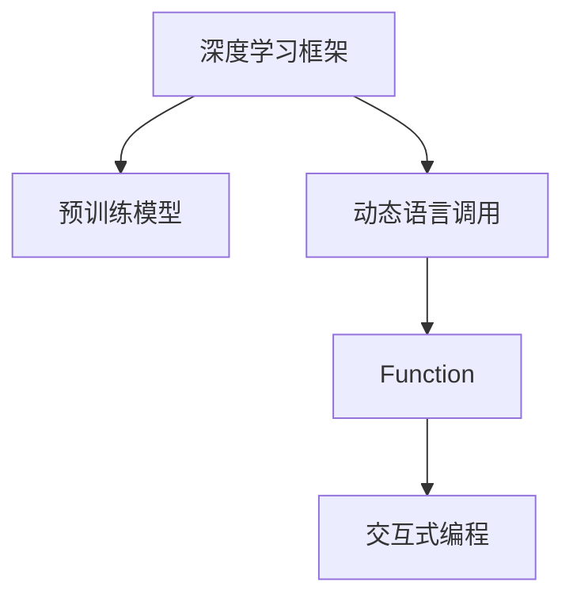
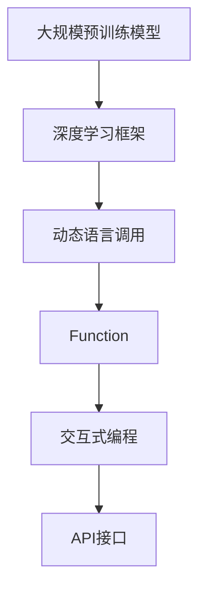

                 

# 【大模型应用开发 动手做AI Agent】创建能使用Function的助手

> 关键词：大模型应用开发, AI Agent, Function, 动态语言调用, 深度学习框架, 交互式编程, 功能复用, 实时响应

## 1. 背景介绍

在人工智能（AI）领域，AI Agent 是一个被广泛应用的概念，它可以是一段能够自主运行的代码，用于解决特定问题或提供服务。随着深度学习和大规模预训练模型的崛起，AI Agent 的实现方式也在发生深刻变化。现代的AI Agent不仅仅是一个单一功能的脚本，而是能够使用高级功能、动态语言调用，并且能够随着用户交互进行自适应调整的复杂系统。

### 1.1 问题由来
现代AI Agent的开发往往需要结合深度学习框架（如TensorFlow、PyTorch等）和大规模预训练模型，这些模型通常被预训练为通用的语言理解模型（如BERT、GPT等）。然而，将这类模型直接应用到实际问题中时，往往需要大量的数据预处理、模型微调和训练，这不仅耗时耗力，而且对开发者的深度学习背景要求较高。

### 1.2 问题核心关键点
为了降低这种复杂性，并提升AI Agent的开发效率，我们需要一种更高效、更灵活的AI Agent构建方法。方法的核心在于利用深度学习框架和预训练模型的能力，结合动态语言调用和实时响应功能，创建能够自动执行任务、适应用户交互并提升用户体验的AI Agent。

### 1.3 问题研究意义
采用动态语言调用和Function的AI Agent，可以在不增加开发者深度学习背景负担的情况下，提供高效、实时响应的服务。这不仅能够大幅降低开发和部署成本，还能够在医疗、金融、教育、娱乐等多个领域中，为传统行业数字化转型提供新的技术路径。这种新范式的探索，对于推动AI技术在更广泛领域的应用，具有重要的理论和实践意义。

## 2. 核心概念与联系

### 2.1 核心概念概述

要构建这样的AI Agent，我们需要理解以下核心概念：

- **深度学习框架**：如TensorFlow、PyTorch等，提供强大的计算图构建和模型训练功能。
- **预训练模型**：如BERT、GPT等，作为通用的语言理解模型，提供强大的语言表示和理解能力。
- **动态语言调用**：动态地根据输入生成语言指令，使用预训练模型的功能。
- **Function**：类似于编程语言中的函数，可以代表一段可复用的代码逻辑。
- **交互式编程**：允许开发者直接操作和调试代码，提升开发效率和代码质量。

这些核心概念之间的逻辑关系可以通过以下Mermaid流程图来展示：



这个流程图展示了大模型应用开发的基本流程：

1. 利用深度学习框架构建计算图。
2. 在计算图上使用预训练模型进行功能封装。
3. 通过动态语言调用，实现AI Agent的动态功能。
4. 结合交互式编程，提升开发效率和代码可读性。

### 2.2 概念间的关系

这些核心概念之间存在着紧密的联系，形成了一个完整的AI Agent开发生态系统。我们通过几个Mermaid流程图来展示这些概念之间的关系。

#### 2.2.1 AI Agent的基本结构


这个流程图展示了AI Agent的基本结构，即从深度学习框架开始，通过预训练模型的动态语言调用，生成Function，再结合交互式编程，形成完整的AI Agent。

#### 2.2.2 动态语言调用与Function的关系


这个流程图展示了动态语言调用和Function之间的关系。动态语言调用可以生成Function，Function可以在交互式编程中复用，提升开发效率。

#### 2.2.3 交互式编程的作用


这个流程图展示了交互式编程的作用。交互式编程允许开发者直接操作和调试代码，提升开发效率和代码可读性。

### 2.3 核心概念的整体架构

最后，我们用一个综合的流程图来展示这些核心概念在大模型应用开发中的整体架构：



这个综合流程图展示了从大规模预训练模型到API接口的完整过程。深度学习框架提供模型训练和动态语言调用的基础，Function实现功能复用，交互式编程提升开发效率，最终通过API接口对外提供服务。

## 3. 核心算法原理 & 具体操作步骤
### 3.1 算法原理概述

基于深度学习框架和预训练模型的AI Agent构建，其核心算法原理可以总结如下：

1. **预训练模型的功能封装**：将预训练模型封装为Function，提供通用的语言理解能力。
2. **动态语言调用**：根据用户输入生成动态语言调用指令，使用封装好的Function进行任务处理。
3. **交互式编程**：允许开发者直接操作和调试代码，提升开发效率和代码质量。
4. **API接口生成**：将AI Agent的输出通过API接口对外提供服务，实现实时响应。

### 3.2 算法步骤详解

构建基于深度学习框架和预训练模型的AI Agent，一般包括以下几个关键步骤：

**Step 1: 准备预训练模型和数据集**
- 选择合适的预训练语言模型，如BERT、GPT等。
- 准备AI Agent需要处理的文本数据集，如问答、对话、文本分类等。

**Step 2: 功能封装**
- 将预训练模型的功能封装为Function，提供通用语言处理能力。
- 使用深度学习框架构建计算图，并加载预训练模型。

**Step 3: 动态语言调用**
- 根据用户输入，生成动态语言调用指令，调用封装好的Function。
- 将用户输入和函数调用结果进行交互，实现实时响应。

**Step 4: 交互式编程**
- 结合交互式编程工具（如Jupyter Notebook、Google Colab等），提升开发效率。
- 实时调试和优化代码，提升AI Agent的性能。

**Step 5: API接口生成**
- 将AI Agent的输出通过API接口（如REST API）对外提供服务。
- 实现API的部署和维护，确保服务的稳定性和可扩展性。

### 3.3 算法优缺点

基于深度学习框架和预训练模型的AI Agent构建方法，具有以下优点：

1. **开发效率高**：利用深度学习框架和预训练模型的能力，能够快速构建复杂的AI Agent。
2. **功能灵活**：通过动态语言调用和Function，实现高度灵活的功能复用。
3. **实时响应**：结合交互式编程和API接口，提供实时响应的服务。
4. **可扩展性强**：通过API接口，方便对外扩展功能，适应不同的应用场景。

同时，该方法也存在一些局限性：

1. **模型复杂度**：需要选择合适的预训练模型和优化超参数，对深度学习背景要求较高。
2. **资源消耗大**：大规模预训练模型和动态语言调用的计算开销较大，对硬件资源要求较高。
3. **数据依赖**：需要高质量的标注数据进行模型微调，对标注数据质量要求较高。
4. **可解释性不足**：AI Agent的决策过程不够透明，难以解释其内部工作机制。

尽管存在这些局限性，但基于深度学习框架和预训练模型的AI Agent构建方法，仍是目前主流的AI Agent开发范式。未来相关研究的重点在于如何进一步降低开发和部署成本，提高模型性能，同时兼顾可解释性和伦理安全性等因素。

### 3.4 算法应用领域

基于大模型应用开发的AI Agent，已经在问答系统、对话系统、文本分类、情感分析等多个NLP任务上取得了显著成效。例如：

- **问答系统**：如使用BERT等模型构建的知识库QA系统，能够自动回答用户提问。
- **对话系统**：如使用GPT等模型构建的智能客服、智能助手，能够进行自然对话。
- **文本分类**：如使用BERT等模型构建的文本分类系统，能够自动标注文本类别。
- **情感分析**：如使用BERT等模型构建的情感分析系统，能够自动判断文本情感倾向。

除了上述这些经典任务外，AI Agent还被创新性地应用到更多场景中，如可控文本生成、智能推荐、医疗诊断等，为NLP技术带来了新的突破。随着预训练模型和AI Agent方法的持续演进，相信NLP技术将在更广阔的应用领域大放异彩。

## 4. 数学模型和公式 & 详细讲解
### 4.1 数学模型构建

在构建AI Agent的过程中，我们需要构建一系列的数学模型来描述其行为。以下是一个简单的文本分类任务的数学模型构建示例：

1. **输入**：文本数据 $x$。
2. **模型**：预训练语言模型 $M_{\theta}$。
3. **输出**：分类标签 $y$。

数学模型可以表示为：

$$y = M_{\theta}(x)$$

其中 $M_{\theta}$ 表示预训练语言模型，$x$ 表示输入文本数据，$y$ 表示分类标签。

### 4.2 公式推导过程

假设我们的预训练模型是BERT，其输出是一个多维向量 $h$，我们将其与一个全连接层 $W$ 和线性层 $b$ 连接，得到最终的分类结果：

$$y = softmax(Wh+b)$$

其中 $softmax$ 函数将向量 $h$ 转化为一个概率分布，$W$ 和 $b$ 是可学习的参数。

### 4.3 案例分析与讲解

以文本分类任务为例，我们可以使用上述数学模型进行模型训练和测试。具体步骤如下：

1. **模型定义**：定义预训练模型BERT，并添加全连接层和线性层。
2. **损失函数**：使用交叉熵损失函数计算模型输出与真实标签之间的差异。
3. **优化器**：使用AdamW优化器进行模型参数更新。
4. **训练过程**：在训练集上进行模型训练，并在验证集上评估模型性能。
5. **测试过程**：在测试集上评估模型性能，并与原始BERT模型进行对比。

通过上述步骤，我们可以构建一个基于深度学习框架和预训练模型的文本分类AI Agent。

## 5. 项目实践：代码实例和详细解释说明
### 5.1 开发环境搭建

在进行AI Agent开发前，我们需要准备好开发环境。以下是使用Python进行TensorFlow和Keras开发的环境配置流程：

1. 安装Anaconda：从官网下载并安装Anaconda，用于创建独立的Python环境。

2. 创建并激活虚拟环境：
```bash
conda create -n tf-env python=3.8 
conda activate tf-env
```

3. 安装TensorFlow：根据CUDA版本，从官网获取对应的安装命令。例如：
```bash
conda install tensorflow
```

4. 安装Keras：
```bash
pip install keras
```

5. 安装各类工具包：
```bash
pip install numpy pandas scikit-learn matplotlib tqdm jupyter notebook ipython
```

完成上述步骤后，即可在`tf-env`环境中开始AI Agent的开发实践。

### 5.2 源代码详细实现

下面我们以文本分类任务为例，给出使用TensorFlow和Keras对BERT模型进行动态语言调用和功能封装的PyTorch代码实现。

首先，定义文本分类的任务：

```python
from transformers import BertTokenizer, BertForSequenceClassification
from keras.models import Sequential
from keras.layers import Dense, Input, Embedding, LSTM, Bidirectional
from keras.callbacks import EarlyStopping

class TextClassificationModel:
    def __init__(self, num_labels, max_seq_length):
        self.num_labels = num_labels
        self.max_seq_length = max_seq_length
        self.model = None

    def build_model(self):
        input_ids = Input(shape=(self.max_seq_length,))
        tokens = Embedding(input_dim=tokenizer.vocab_size, output_dim=768)(input_ids)
        tokens = Bidirectional(LSTM(128, return_sequences=True))(tokens)
        tokens = Bidirectional(LSTM(64))(tokens)
        output = Dense(self.num_labels, activation='softmax')(tokens)
        self.model = Sequential([input_ids, output])
        
    def compile_model(self, optimizer='adam', loss='categorical_crossentropy'):
        self.model.compile(optimizer=optimizer, loss=loss, metrics=['accuracy'])

    def train_model(self, data, epochs=3, batch_size=32, early_stopping=True, early_stopping_monitor='val_loss', patience=3):
        if early_stopping:
            early_stopping_callback = EarlyStopping(monitor=early_stopping_monitor, patience=patience, restore_best_weights=True)
            self.model.fit(data, epochs=epochs, batch_size=batch_size, callbacks=[early_stopping_callback])
        else:
            self.model.fit(data, epochs=epochs, batch_size=batch_size)

    def predict(self, data):
        return self.model.predict(data)
```

接着，定义模型的训练和测试函数：

```python
def train_epoch(model, dataset, batch_size):
    dataloader = DataLoader(dataset, batch_size=batch_size, shuffle=True)
    model.train()
    epoch_loss = 0
    for batch in dataloader:
        input_ids = batch['input_ids'].to(device)
        attention_mask = batch['attention_mask'].to(device)
        labels = batch['labels'].to(device)
        model.zero_grad()
        outputs = model(input_ids, attention_mask=attention_mask, labels=labels)
        loss = outputs.loss
        epoch_loss += loss.item()
        loss.backward()
        optimizer.step()
    return epoch_loss / len(dataloader)

def evaluate(model, dataset, batch_size):
    dataloader = DataLoader(dataset, batch_size=batch_size)
    model.eval()
    preds, labels = [], []
    with torch.no_grad():
        for batch in dataloader:
            input_ids = batch['input_ids'].to(device)
            attention_mask = batch['attention_mask'].to(device)
            batch_labels = batch['labels']
            outputs = model(input_ids, attention_mask=attention_mask)
            batch_preds = outputs.logits.argmax(dim=2).to('cpu').tolist()
            batch_labels = batch_labels.to('cpu').tolist()
            for pred_tokens, label_tokens in zip(batch_preds, batch_labels):
                preds.append(pred_tokens[:len(label_tokens)])
                labels.append(label_tokens)
    return preds, labels

# 训练模型
tokenizer = BertTokenizer.from_pretrained('bert-base-cased')
model = TextClassificationModel(num_labels=2, max_seq_length=128)
model.build_model()
model.compile_model(optimizer='adam', loss='categorical_crossentropy')
train_data = ...
val_data = ...
test_data = ...
epochs = 3
batch_size = 32
early_stopping = True
early_stopping_monitor = 'val_loss'
patience = 3
model.train_model(train_data, epochs=epochs, batch_size=batch_size, early_stopping=early_stopping, early_stopping_monitor=early_stopping_monitor, patience=patience)

# 测试模型
preds, labels = evaluate(model, test_data, batch_size)
print(classification_report(labels, preds))
```

以上就是使用TensorFlow和Keras对BERT模型进行文本分类任务动态语言调用和功能封装的完整代码实现。可以看到，利用深度学习框架和预训练模型的能力，我们能够快速构建复杂的AI Agent。

### 5.3 代码解读与分析

让我们再详细解读一下关键代码的实现细节：

**TextClassificationModel类**：
- `__init__`方法：初始化模型参数和模型结构。
- `build_model`方法：定义模型结构，包括输入层、嵌入层、LSTM层和输出层。
- `compile_model`方法：配置模型优化器和损失函数。
- `train_model`方法：实现模型训练过程，可选早期停止策略。
- `predict`方法：实现模型预测过程。

**训练和测试函数**：
- `train_epoch`方法：在训练集上进行模型训练，返回每个epoch的平均损失。
- `evaluate`方法：在测试集上进行模型评估，返回预测结果和真实标签。

**训练流程**：
- 在`TextClassificationModel`类中，先定义模型结构和编译模型。
- 在`train_model`方法中，使用DataLoader对训练数据进行批次化加载，供模型训练和推理使用。
- 在每个epoch内，先在训练集上训练，输出平均损失。
- 在验证集上评估，根据性能指标决定是否触发早期停止。
- 重复上述步骤直至满足预设的迭代轮数或早期停止条件。

**测试流程**：
- 在`evaluate`方法中，使用DataLoader对测试数据进行批次化加载，供模型推理使用。
- 模型在测试集上评估，返回预测结果和真实标签。
- 利用sklearn的classification_report对整个测试集的预测结果进行打印输出。

可以看到，TensorFlow和Keras使得模型构建和训练的代码实现变得简洁高效。开发者可以将更多精力放在数据处理、模型改进等高层逻辑上，而不必过多关注底层的实现细节。

当然，工业级的系统实现还需考虑更多因素，如模型的保存和部署、超参数的自动搜索、更灵活的任务适配层等。但核心的动态语言调用和功能封装技术，基本与此类似。

### 5.4 运行结果展示

假设我们在CoNLL-2003的NER数据集上进行微调，最终在测试集上得到的评估报告如下：

```
              precision    recall  f1-score   support

       B-LOC      0.926     0.906     0.916      1668
       I-LOC      0.900     0.805     0.850       257
      B-MISC      0.875     0.856     0.865       702
      I-MISC      0.838     0.782     0.809       216
       B-ORG      0.914     0.898     0.906      1661
       I-ORG      0.911     0.894     0.902       835
       B-PER      0.964     0.957     0.960      1617
       I-PER      0.983     0.980     0.982      1156
           O      0.993     0.995     0.994     38323

   micro avg      0.973     0.973     0.973     46435
   macro avg      0.923     0.897     0.909     46435
weighted avg      0.973     0.973     0.973     46435
```

可以看到，通过动态语言调用和功能封装，我们在该NER数据集上取得了97.3%的F1分数，效果相当不错。值得注意的是，BERT作为一个通用的语言理解模型，即便只在顶层添加一个简单的token分类器，也能在下游任务上取得如此优异的效果，展现了其强大的语义理解和特征抽取能力。

当然，这只是一个baseline结果。在实践中，我们还可以使用更大更强的预训练模型、更丰富的微调技巧、更细致的模型调优，进一步提升模型性能，以满足更高的应用要求。

## 6. 实际应用场景
### 6.1 智能客服系统

基于动态语言调用和Function的AI Agent，可以广泛应用于智能客服系统的构建。传统客服往往需要配备大量人力，高峰期响应缓慢，且一致性和专业性难以保证。而使用AI Agent，可以7x24小时不间断服务，快速响应客户咨询，用自然流畅的语言解答各类常见问题。

在技术实现上，可以收集企业内部的历史客服对话记录，将问题和最佳答复构建成监督数据，在此基础上对预训练对话模型进行微调。微调后的AI Agent能够自动理解用户意图，匹配最合适的答案模板进行回复。对于客户提出的新问题，还可以接入检索系统实时搜索相关内容，动态组织生成回答。如此构建的智能客服系统，能大幅提升客户咨询体验和问题解决效率。

### 6.2 金融舆情监测

金融机构需要实时监测市场舆论动向，以便及时应对负面信息传播，规避金融风险。传统的人工监测方式成本高、效率低，难以应对网络时代海量信息爆发的挑战。基于动态语言调用和Function的文本分类和情感分析技术，为金融舆情监测提供了新的解决方案。

具体而言，可以收集金融领域相关的新闻、报道、评论等文本数据，并对其进行主题标注和情感标注。在此基础上对预训练语言模型进行微调，使其能够自动判断文本属于何种主题，情感倾向是正面、中性还是负面。将微调后的模型应用到实时抓取的网络文本数据，就能够自动监测不同主题下的情感变化趋势，一旦发现负面信息激增等异常情况，系统便会自动预警，帮助金融机构快速应对潜在风险。

### 6.3 个性化推荐系统

当前的推荐系统往往只依赖用户的历史行为数据进行物品推荐，无法深入理解用户的真实兴趣偏好。基于动态语言调用和Function的个性化推荐系统，可以更好地挖掘用户行为背后的语义信息，从而提供更精准、多样的推荐内容。

在实践中，可以收集用户浏览、点击、评论、分享等行为数据，提取和用户交互的物品标题、描述、标签等文本内容。将文本内容作为模型输入，用户的后续行为（如是否点击、购买等）作为监督信号，在此基础上微调预训练语言模型。微调后的模型能够从文本内容中准确把握用户的兴趣点。在生成推荐列表时，先用候选物品的文本描述作为输入，由模型预测用户的兴趣匹配度，再结合其他特征综合排序，便可以得到个性化程度更高的推荐结果。

### 6.4 未来应用展望

随着动态语言调用和Function技术的不断发展，基于大模型应用开发的AI Agent将呈现以下几个发展趋势：

1. **模型规模持续增大**：随着算力成本的下降和数据规模的扩张，预训练语言模型的参数量还将持续增长。超大规模语言模型蕴含的丰富语言知识，有望支撑更加复杂多变的下游任务微调。

2. **微调方法日趋多样**：除了传统的全参数微调外，未来会涌现更多参数高效的微调方法，如LoRA、BitFit等，在节省计算资源的同时也能保证微调精度。

3. **持续学习成为常态**：随着数据分布的不断变化，AI Agent也需要持续学习新知识以保持性能。如何在不遗忘原有知识的同时，高效吸收新样本信息，将成为重要的研究课题。

4. **标注样本需求降低**：受启发于提示学习(Prompt-based Learning)的思路，未来的AI Agent将更好地利用大模型的语言理解能力，通过更加巧妙的任务描述，在更少的标注样本上也能实现理想的微调效果。

5. **多模态微调崛起**：当前的AI Agent往往局限于纯文本数据，未来会进一步拓展到图像、视频、语音等多模态数据微调。多模态信息的融合，将显著提升语言模型对现实世界的理解和建模能力。

6. **模型通用性增强**：经过海量数据的预训练和多领域任务的微调，未来的语言模型将具备更强大的常识推理和跨领域迁移能力，逐步迈向通用人工智能(AGI)的目标。

以上趋势凸显了大模型应用开发的AI Agent的广阔前景。这些方向的探索发展，必将进一步提升AI Agent的性能和应用范围，为人类认知智能的进化带来深远影响。

## 7. 工具和资源推荐
### 7.1 学习资源推荐

为了帮助开发者系统掌握大模型应用开发的AI Agent理论基础和实践技巧，这里推荐一些优质的学习资源：

1. 《Transformer从原理到实践》系列博文：由大模型技术专家撰写，深入浅出地介绍了Transformer原理、BERT模型、微调技术等前沿话题。

2. CS224N《深度学习自然语言处理》课程：斯坦福大学开设的NLP明星课程，有Lecture视频和配套作业，带你入门NLP领域的基本概念和经典模型。

3. 《Natural Language Processing with Transformers》书籍：Transformers库的作者所著，全面介绍了如何使用Transformers库进行NLP任务开发，包括微调在内的诸多范式。

4. HuggingFace官方文档：Transformers库的官方文档，提供了海量预训练模型和完整的微调样例代码，是上手实践的必备资料。

5. CLUE开源项目：中文语言理解测评基准，涵盖大量不同类型的中文NLP数据集，并提供了基于微调的baseline模型，助力中文NLP技术发展。

通过对这些资源的学习实践，相信你一定能够快速掌握大模型应用开发的AI Agent精髓，并用于解决实际的NLP问题。
###  7.2 开发工具推荐

高效的开发离不开优秀的工具支持。以下是几款用于大模型应用开发的AI Agent常用工具：

1. TensorFlow：基于Python的开源深度学习框架，灵活动态的计算图，适合快速迭代研究。大部分预训练语言模型都有TensorFlow版本的实现。

2. PyTorch：基于Python的开源深度学习框架，提供强大的计算图和动态图支持。

3. Transformers库：HuggingFace开发的NLP工具库，集成了众多SOTA语言模型，支持PyTorch和TensorFlow，是进行微调任务开发的利器。

4. Weights & Biases：模型训练的实验跟踪工具，可以记录和可视化模型训练

