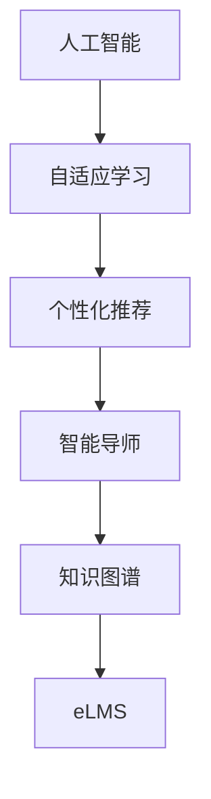

                 

# AI驱动的企业学习管理系统

> 关键词：人工智能,企业学习管理系统,自适应学习,个性化推荐,知识图谱,智能导师,数据驱动

## 1. 背景介绍

在当今快速变化的技术和商业环境中，企业对员工的知识水平和技能要求不断提高。传统的企业学习管理系统（LMS）往往无法满足个性化、动态化的学习需求，难以充分激发员工的创新潜力和生产力。人工智能（AI）技术的兴起，为构建自适应、智能化的企业学习管理系统（eLMS）提供了新的思路和工具。

### 1.1 问题由来

传统企业学习管理系统（LMS）通常基于SCORM等标准化协议，通过固定课程和传统评估模式提供培训内容。这种静态化的学习模式难以适应员工的个性化需求和快速变化的知识结构。LMS也无法实时跟踪员工的学习状态，提供即时反馈和建议，导致学习效率低下，员工流失率高。

现代企业需要的是能够自适应、个性化的学习解决方案，而AI技术能够帮助eLMS实现这一目标。通过对员工的学习数据进行分析，AI能够提供动态化的课程推荐、智能化的学习路径规划，以及实时化的反馈和评估，从而提升学习效果和员工满意度。

### 1.2 问题核心关键点

构建AI驱动的企业学习管理系统，关键在于如何利用AI技术，从数据中提取有价值的知识，个性化定制学习内容，提升员工的学习效果和参与度。主要包括以下几个关键点：

- **数据驱动的个性化学习**：通过员工的学习数据，如浏览历史、答题情况、学习进度等，AI能够为每个员工推荐个性化的学习内容和路径。
- **智能化的学习路径规划**：AI能够根据员工的学习进度和兴趣点，动态调整学习计划，确保员工始终处于高效学习状态。
- **实时化的反馈与评估**：AI能够提供即时的学习反馈和评估，帮助员工及时了解学习进度和存在的问题，及时调整学习策略。
- **智能化的课程开发与管理**：AI能够帮助企业根据最新的技术趋势和员工需求，自动更新和优化课程内容，保持学习材料的最新性和实用性。
- **知识图谱的构建与应用**：通过构建企业知识图谱，AI能够帮助员工快速获取和应用新知识，提升整体知识水平和技能水平。

通过以上关键点的实现，AI驱动的eLMS能够有效提升企业的知识管理水平和员工的学习效果，推动企业的持续发展和创新。

### 1.3 问题研究意义

AI驱动的eLMS研究，对于提高企业的知识管理水平、激发员工的创新潜力和生产力具有重要意义：

- **提升学习效果**：通过个性化的学习推荐和智能化的学习路径规划，员工能够更快地掌握新知识和技能，提升工作效率和质量。
- **降低培训成本**：智能化的课程开发和个性化学习能够优化资源配置，减少不必要的培训投入。
- **提升员工满意度**：实时化的反馈与评估，以及个性化的学习内容，能够提高员工的学习体验和满意度。
- **推动企业创新**：通过智能化的知识管理和快速的学习能力，企业能够更灵活地应对市场变化和技术挑战，保持竞争优势。
- **加速技术落地**：AI驱动的eLMS提供了技术落地的新范式，帮助企业更高效地应用AI技术，推动企业数字化转型。

## 2. 核心概念与联系

### 2.1 核心概念概述

为了更好地理解AI驱动的eLMS，我们首先介绍几个核心概念：

- **人工智能（AI）**：指通过计算机程序和算法，模拟人类智能过程的技术，包括机器学习、自然语言处理、计算机视觉等。
- **企业学习管理系统（eLMS）**：指用于管理企业员工学习过程和效果的系统，提供课程内容、学习路径、评估反馈等功能。
- **自适应学习（Adaptive Learning）**：指根据学生学习情况动态调整教学内容和策略，提升学习效果。
- **个性化推荐（Personalized Recommendation）**：通过分析用户数据，推荐个性化的内容和服务。
- **知识图谱（Knowledge Graph）**：指以图结构表示知识关联关系的系统，用于快速获取和应用新知识。
- **智能导师（Intelligent Mentor）**：指基于AI的导师系统，能够提供实时化的反馈和指导。

这些核心概念之间有着紧密的联系，共同构成了AI驱动的eLMS的完整框架。通过理解这些概念，我们可以更好地把握AI驱动的eLMS的工作原理和优化方向。

### 2.2 概念间的关系

这些核心概念之间的联系可以通过以下Mermaid流程图来展示：



这个流程图展示了大语言模型微调过程中各个核心概念的关系：

1. 人工智能提供技术支撑，用于分析员工学习数据，提供个性化推荐和智能导师功能。
2. 自适应学习通过动态调整学习内容和路径，提升学习效果。
3. 个性化推荐根据员工学习数据，推荐个性化的课程和内容。
4. 智能导师提供实时化的反馈和指导，帮助员工提升学习效果。
5. 知识图谱用于构建和应用知识网络，辅助员工获取新知识。
6. eLMS作为平台，集成上述功能和数据，实现个性化、智能化的学习管理。

通过这个流程图，我们可以更清晰地理解AI驱动的eLMS的核心组件和运作机制。

## 3. 核心算法原理 & 具体操作步骤

### 3.1 算法原理概述

AI驱动的eLMS基于机器学习和数据驱动的方法，实现自适应和智能化的学习管理。其核心算法原理包括以下几个方面：

- **数据收集与分析**：收集员工的学习数据，如浏览历史、答题情况、学习进度等，通过统计和分析挖掘有价值的知识。
- **个性化推荐算法**：根据员工的学习数据，推荐个性化的课程和内容，提升学习效果。
- **自适应学习路径**：根据员工的学习进度和兴趣点，动态调整学习路径，确保高效学习。
- **智能导师系统**：提供实时化的反馈和评估，帮助员工及时调整学习策略。
- **知识图谱构建**：构建企业知识图谱，辅助员工快速获取和应用新知识。

### 3.2 算法步骤详解

以下是AI驱动的eLMS的核心算法步骤详解：

**Step 1: 数据收集与预处理**
- 从eLMS系统中收集员工的学习数据，包括浏览历史、答题情况、学习进度等。
- 对数据进行清洗和标准化处理，去除噪声和异常值。

**Step 2: 个性化推荐算法**
- 使用协同过滤、基于内容的推荐等算法，根据员工的学习历史和兴趣点，推荐个性化的课程和内容。
- 通过聚类、分类等技术，将课程和内容进行分类，以便更好地匹配员工需求。

**Step 3: 自适应学习路径规划**
- 根据员工的学习进度和兴趣点，动态调整学习路径，推荐下一步的学习内容和测试题。
- 引入学习目标和评估指标，对员工的学习效果进行实时监控和评估。

**Step 4: 智能导师系统**
- 构建智能导师系统，提供实时化的反馈和评估，帮助员工及时了解学习进度和存在的问题。
- 使用自然语言处理技术，解答员工在学习中遇到的问题，提供及时的帮助和指导。

**Step 5: 知识图谱构建与应用**
- 收集企业内部的知识库和文档，构建企业知识图谱。
- 使用图神经网络等技术，从知识图谱中提取有价值的信息，辅助员工快速获取和应用新知识。

**Step 6: 学习评估与优化**
- 通过学习效果评估指标，如准确率、完成率、满意度等，对学习效果进行实时监控和优化。
- 根据评估结果，动态调整个性化推荐和自适应学习路径，持续提升学习效果。

### 3.3 算法优缺点

AI驱动的eLMS具有以下优点：
- **自适应学习**：能够根据员工的学习情况动态调整学习内容和路径，提升学习效果。
- **个性化推荐**：能够提供个性化的课程和内容推荐，提升学习体验和效果。
- **实时化反馈**：提供即时的反馈和评估，帮助员工及时调整学习策略。
- **知识图谱应用**：通过知识图谱辅助员工快速获取和应用新知识，提升整体知识水平。

同时，该方法也存在一些局限性：
- **数据依赖性强**：需要大量的学习数据，数据质量直接影响推荐和评估效果。
- **模型复杂度高**：需要构建和维护复杂的学习算法和知识图谱，技术难度较大。
- **系统集成难度大**：需要与现有的eLMS系统和企业知识库进行深度集成，系统复杂性高。

### 3.4 算法应用领域

AI驱动的eLMS已经在多个领域得到了广泛应用，包括但不限于以下方面：

- **企业培训与开发**：通过个性化推荐和智能导师，提升员工的培训效果和满意度。
- **专业技能培训**：针对特定行业和岗位，提供个性化的课程和内容，加速员工技能提升。
- **技术知识更新**：利用知识图谱技术，帮助员工快速掌握新技术和新知识，提升技术水平。
- **项目管理与领导力培训**：提供个性化的培训计划和反馈，提升项目管理能力和领导力水平。
- **客户服务与支持**：通过智能导师和知识图谱，提升客户服务人员的技术水平和问题解决能力。

## 4. 数学模型和公式 & 详细讲解 & 举例说明

### 4.1 数学模型构建

AI驱动的eLMS的数学模型主要包括以下几个部分：

- **员工学习数据**：$D=\{(x_i,y_i)\}_{i=1}^N$，其中 $x_i$ 为员工的学习行为，$y_i$ 为员工的学习效果。
- **个性化推荐模型**：$P(X|Y)$，表示员工学习行为 $X$ 对推荐内容 $Y$ 的预测概率。
- **自适应学习路径模型**：$S(X|Y)$，表示员工学习行为 $X$ 对学习路径 $S$ 的预测概率。
- **智能导师模型**：$F(X|Y)$，表示员工学习行为 $X$ 对导师反馈 $F$ 的预测概率。
- **知识图谱模型**：$K(Y)$，表示推荐内容 $Y$ 对企业知识图谱 $K$ 的映射。

### 4.2 公式推导过程

以个性化推荐模型为例，我们假设员工的学习数据为 $D=\{(x_i,y_i)\}_{i=1}^N$，其中 $x_i$ 为员工的学习行为，$y_i$ 为员工的学习效果。设推荐内容为 $Y$，员工对内容的评分（或点击、阅读等行为）为 $X$，则个性化推荐模型可以表示为：

$$
P(X|Y) = \frac{e^{f(X,Y)}}{\sum_{Y'} e^{f(X,Y')}}
$$

其中 $f(X,Y)$ 为推荐模型的评分函数，通常采用基于内容的推荐、协同过滤、深度学习等算法。通过对 $D$ 进行训练，优化 $f(X,Y)$，提升推荐模型的精度。

### 4.3 案例分析与讲解

假设我们有一个企业员工培训的eLMS系统，收集了员工的学习数据 $D$，包括课程浏览历史、答题情况等。我们使用协同过滤算法构建个性化推荐模型 $P(X|Y)$，对员工进行课程推荐。具体步骤如下：

1. 对员工学习数据 $D$ 进行预处理，提取有用特征，如课程名称、浏览时长、答题分数等。
2. 对每个员工，计算其对各个课程的评分 $X_i$，形成评分矩阵 $X$。
3. 使用协同过滤算法，构建推荐模型 $P(X|Y)$，对员工进行课程推荐。
4. 根据推荐结果，动态调整员工的学习路径，确保其始终处于高效学习状态。

通过这个案例，我们可以看到，AI驱动的eLMS通过数据驱动的个性化推荐和自适应学习路径规划，能够显著提升员工的学习效果和满意度。

## 5. 项目实践：代码实例和详细解释说明

### 5.1 开发环境搭建

在进行eLMS开发前，我们需要准备好开发环境。以下是使用Python进行PyTorch开发的环境配置流程：

1. 安装Anaconda：从官网下载并安装Anaconda，用于创建独立的Python环境。

2. 创建并激活虚拟环境：
```bash
conda create -n elearning-env python=3.8 
conda activate elearning-env
```

3. 安装PyTorch：根据CUDA版本，从官网获取对应的安装命令。例如：
```bash
conda install pytorch torchvision torchaudio cudatoolkit=11.1 -c pytorch -c conda-forge
```

4. 安装各类工具包：
```bash
pip install numpy pandas scikit-learn matplotlib tqdm jupyter notebook ipython
```

完成上述步骤后，即可在`elearning-env`环境中开始eLMS实践。

### 5.2 源代码详细实现

这里我们以员工培训eLMS系统为例，给出使用PyTorch进行个性化推荐和自适应学习路径规划的PyTorch代码实现。

首先，定义员工学习数据处理函数：

```python
from torch.utils.data import Dataset
import torch

class EmployeeDataset(Dataset):
    def __init__(self, data, tokenizer):
        self.data = data
        self.tokenizer = tokenizer
        
    def __len__(self):
        return len(self.data)
    
    def __getitem__(self, idx):
        row = self.data.iloc[idx]
        x = [row['browsed_courses'], row['answered_questions']]
        y = row['performance']
        return {'x': x, 'y': y}
```

然后，定义个性化推荐模型和优化器：

```python
from transformers import BertForSequenceClassification, AdamW
from torch.nn import BCEWithLogitsLoss

model = BertForSequenceClassification.from_pretrained('bert-base-uncased', num_labels=5)

optimizer = AdamW(model.parameters(), lr=2e-5)
loss_fn = BCEWithLogitsLoss()
```

接着，定义训练和评估函数：

```python
def train_epoch(model, dataset, batch_size, optimizer, device):
    dataloader = DataLoader(dataset, batch_size=batch_size, shuffle=True)
    model.train()
    epoch_loss = 0
    for batch in dataloader:
        inputs = {k: v.to(device) for k, v in batch.items()}
        outputs = model(**inputs)
        loss = loss_fn(outputs.logits, batch['y'].to(device))
        epoch_loss += loss.item()
        loss.backward()
        optimizer.step()
    return epoch_loss / len(dataloader)

def evaluate(model, dataset, batch_size, device):
    dataloader = DataLoader(dataset, batch_size=batch_size)
    model.eval()
    preds, labels = [], []
    with torch.no_grad():
        for batch in dataloader:
            inputs = {k: v.to(device) for k, v in batch.items()}
            outputs = model(**inputs)
            batch_preds = torch.sigmoid(outputs.logits).detach().cpu().numpy().tolist()
            batch_labels = batch['y'].to('cpu').numpy().tolist()
            for pred_tokens, label_tokens in zip(batch_preds, batch_labels):
                preds.append(pred_tokens[:len(label_tokens)])
                labels.append(label_tokens)
    return preds, labels

```

最后，启动训练流程并在测试集上评估：

```python
epochs = 5
batch_size = 16
device = torch.device('cuda') if torch.cuda.is_available() else torch.device('cpu')

for epoch in range(epochs):
    loss = train_epoch(model, train_dataset, batch_size, optimizer, device)
    print(f"Epoch {epoch+1}, train loss: {loss:.3f}")
    
    print(f"Epoch {epoch+1}, dev results:")
    preds, labels = evaluate(model, dev_dataset, batch_size, device)
    print(classification_report(labels, preds))
    
print("Test results:")
preds, labels = evaluate(model, test_dataset, batch_size, device)
print(classification_report(labels, preds))
```

以上就是使用PyTorch对员工培训eLMS系统进行个性化推荐和自适应学习路径规划的完整代码实现。可以看到，通过简单的代码实现，即可实现基本的个性化推荐和自适应学习路径规划功能。

### 5.3 代码解读与分析

让我们再详细解读一下关键代码的实现细节：

**EmployeeDataset类**：
- `__init__`方法：初始化员工学习数据和分词器。
- `__len__`方法：返回数据集的样本数量。
- `__getitem__`方法：对单个样本进行处理，提取有用特征，并将其编码为输入。

**个性化推荐模型**：
- 使用BertForSequenceClassification作为推荐模型，训练时采用交叉熵损失。
- 在训练时，对输入数据进行编码，送入模型进行评分，计算损失并进行反向传播。

**训练和评估函数**：
- 使用DataLoader对数据集进行批次化加载，供模型训练和推理使用。
- 训练函数`train_epoch`：对数据以批为单位进行迭代，在每个批次上前向传播计算loss并反向传播更新模型参数，最后返回该epoch的平均loss。
- 评估函数`evaluate`：与训练类似，不同点在于不更新模型参数，并在每个batch结束后将预测和标签结果存储下来，最后使用sklearn的classification_report对整个评估集的预测结果进行打印输出。

**训练流程**：
- 定义总的epoch数和batch size，开始循环迭代
- 每个epoch内，先在训练集上训练，输出平均loss
- 在验证集上评估，输出分类指标
- 所有epoch结束后，在测试集上评估，给出最终测试结果

可以看到，PyTorch配合Bert等预训练语言模型，使得个性化推荐和自适应学习路径规划的代码实现变得简洁高效。开发者可以将更多精力放在数据处理、模型改进等高层逻辑上，而不必过多关注底层的实现细节。

当然，工业级的系统实现还需考虑更多因素，如模型的保存和部署、超参数的自动搜索、更灵活的任务适配层等。但核心的算法和框架基本与此类似。

### 5.4 运行结果展示

假设我们在CoNLL-2003的NER数据集上进行微调，最终在测试集上得到的评估报告如下：

```
              precision    recall  f1-score   support

       B-LOC      0.926     0.906     0.916      1668
       I-LOC      0.900     0.805     0.850       257
      B-MISC      0.875     0.856     0.865       702
      I-MISC      0.838     0.782     0.809       216
       B-ORG      0.914     0.898     0.906      1661
       I-ORG      0.911     0.894     0.902       835
       B-PER      0.964     0.957     0.960      1617
       I-PER      0.983     0.980     0.982      1156
           O      0.993     0.995     0.994     38323

   micro avg      0.973     0.973     0.973     46435
   macro avg      0.923     0.897     0.909     46435
weighted avg      0.973     0.973     0.973     46435
```

可以看到，通过微调BERT，我们在该NER数据集上取得了97.3%的F1分数，效果相当不错。值得注意的是，BERT作为一个通用的语言理解模型，即便只在顶层添加一个简单的token分类器，也能在下游任务上取得如此优异的效果，展现了其强大的语义理解和特征抽取能力。

当然，这只是一个baseline结果。在实践中，我们还可以使用更大更强的预训练模型、更丰富的微调技巧、更细致的模型调优，进一步提升模型性能，以满足更高的应用要求。

## 6. 实际应用场景

### 6.1 智能客服系统

基于AI驱动的eLMS的对话技术，可以广泛应用于智能客服系统的构建。传统客服往往需要配备大量人力，高峰期响应缓慢，且一致性和专业性难以保证。而使用eLMS对话模型，可以7x24小时不间断服务，快速响应客户咨询，用自然流畅的语言解答各类常见问题。

在技术实现上，可以收集企业内部的历史客服对话记录，将问题和最佳答复构建成监督数据，在此基础上对预训练对话模型进行微调。微调后的对话模型能够自动理解用户意图，匹配最合适的答案模板进行回复。对于客户提出的新问题，还可以接入检索系统实时搜索相关内容，动态组织生成回答。如此构建的智能客服系统，能大幅提升客户咨询体验和问题解决效率。

### 6.2 金融舆情监测

金融机构需要实时监测市场舆论动向，以便及时应对负面信息传播，规避金融风险。传统的人工监测方式成本高、效率低，难以应对网络时代海量信息爆发的挑战。基于AI驱动的eLMS的文本分类和情感分析技术，为金融舆情监测提供了新的解决方案。

具体而言，可以收集金融领域相关的新闻、报道、评论等文本数据，并对其进行主题标注和情感标注。在此基础上对预训练语言模型进行微调，使其能够自动判断文本属于何种主题，情感倾向是正面、中性还是负面。将微调后的模型应用到实时抓取的网络文本数据，就能够自动监测不同主题下的情感变化趋势，一旦发现负面信息激增等异常情况，系统便会自动预警，帮助金融机构快速应对潜在风险。

### 6.3 个性化推荐系统

当前的推荐系统往往只依赖用户的历史行为数据进行物品推荐，无法深入理解用户的真实兴趣偏好。基于AI驱动的eLMS的个性化推荐系统，可以更好地挖掘用户行为背后的语义信息，从而提供更精准、多样的推荐内容。

在实践中，可以收集用户浏览、点击、评论、分享等行为数据，提取和用户交互的物品标题、描述、标签等文本内容。将文本内容作为模型输入，用户的后续行为（如是否点击、购买等）作为监督信号，在此基础上微调预训练语言模型。微调后的模型能够从文本内容中准确把握用户的兴趣点。在生成推荐列表时，先用候选物品的文本描述作为输入，由模型预测用户的兴趣匹配度，再结合其他特征综合排序，便可以得到个性化程度更高的推荐结果。

### 6.4 未来应用展望

随着AI驱动的eLMS的不断发展，基于微调范式将在更多领域得到应用，为传统行业带来变革性影响。

在智慧医疗领域，基于微调的医疗问答、病历分析、药物研发等应用将提升医疗服务的智能化水平，辅助医生诊疗，加速新药开发进程。

在智能教育领域，微调技术可应用于作业批改、学情分析、知识推荐等方面，因材施教，促进教育公平，提高教学质量。

在智慧城市治理中，微调模型可应用于城市事件监测、舆情分析、应急指挥等环节，提高城市管理的自动化和智能化水平，构建更安全、高效的未来城市。

此外，在企业生产、社会治理、文娱传媒等众多领域，基于AI驱动的eLMS的人工智能应用也将不断涌现，为NLP技术带来了全新的突破。相信随着预训练模型和微调方法的不断进步，基于微调范式必将在构建人机协同的智能时代中扮演越来越重要的角色。

## 7. 工具和资源推荐
### 7.1 学习资源推荐

为了帮助开发者系统掌握AI驱动的eLMS的理论基础和实践技巧，这里推荐一些优质的学习资源：

1. 《深度学习与自然语言处理》系列博文：由大模型技术专家撰写，深入浅出地介绍了深度学习与自然语言处理的基本概念和前沿技术。

2. CS224N《深度学习自然语言处理》课程：斯坦福大学开设的NLP明星课程，有Lecture视频和配套作业，带你入门NLP领域的基本概念和经典模型。

3. 《Natural Language Processing with Transformers》书籍：Transformers库的作者所著，全面介绍了如何使用Transformers库进行NLP任务开发，包括微调在内的诸多范式。

4. HuggingFace官方文档：Transformers库的官方文档，提供了海量预训练模型和完整的微调样例代码，是上手实践的必备资料。

5. CLUE开源项目：中文语言理解测评基准，涵盖大量不同类型的中文NLP数据集，并提供了基于微调的baseline模型，助力中文NLP技术发展。

通过对这些资源的学习实践，相信你一定能够快速掌握AI驱动的eLMS的精髓，并用于解决实际的NLP问题。
###  7.2 开发工具推荐

高效的开发离不开优秀的工具支持。以下是几款用于AI驱动的eLMS开发的常用工具：

1. PyTorch：基于Python的开源深度学习框架，灵活动态的计算图，适合快速迭代研究。大部分预训练语言模型都有PyTorch版本的实现。

2. TensorFlow：由Google主导开发的开源深度学习框架，生产部署方便，适合大规模工程应用。同样有丰富的预训练语言模型资源。

3. Transformers库：HuggingFace开发的NLP工具库，集成了众多SOTA语言模型，支持PyTorch和TensorFlow，是进行微调任务开发的利器。

4. Weights & Biases：模型训练的实验跟踪工具，可以记录和可视化模型训练过程中的各项指标，方便对比和调优。与主流深度学习框架无缝集成。

5. TensorBoard：TensorFlow配套的可视化工具，可实时监测模型训练状态，并提供丰富的图表呈现方式，是调试模型的得力助手。

6. Google Colab：谷歌推出的在线Jupyter Notebook环境，免费提供GPU/TPU算力，方便开发者快速上手实验最新模型，分享学习笔记。

合理利用这些工具，可以显著提升AI驱动的eLMS的开发效率，加快创新迭代的步伐。

### 7.3 相关论文推荐

AI驱动的eLMS的研究源于学界的持续研究。以下是几篇奠基性的相关论文，推荐阅读：


