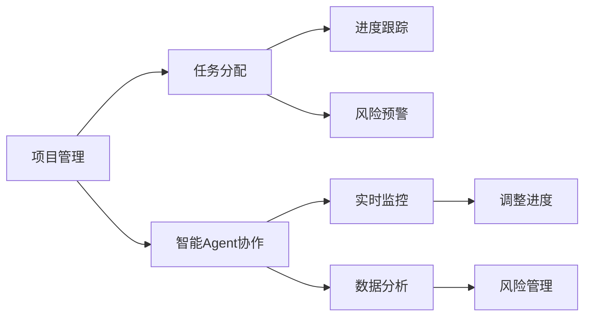

                 

# Agent协作在项目管理中的应用

## 1. 背景介绍

### 1.1 问题由来

在当今数字化、全球化和复杂化的商业环境中，项目管理（Project Management）已经成为企业组织实现战略目标的关键活动之一。然而，传统项目管理方式面临着诸多挑战，如任务复杂度高、沟通协调难、决策效率低等问题。这些问题导致项目延期、成本超支，甚至项目失败。为了提高项目管理的效率和效果，现代项目管理逐步引入智能化的手段，其中Agent协作成为一大亮点。

### 1.2 问题核心关键点

Agent协作在项目管理中的应用，是指利用智能Agent系统（人工智能代理），通过模拟人类智能行为，自动地进行任务分配、进度跟踪、风险预警等项目管理活动。这种协作方式能够显著提升项目管理的时效性、准确性和协同化水平，助力企业在竞争激烈的商业环境中脱颖而出。

### 1.3 问题研究意义

研究Agent协作在项目管理中的应用，对于提升项目管理效率、增强团队协作、降低运营成本、提高决策质量具有重要意义：

1. **提升效率**：Agent协作可以自动化完成大量重复性任务，解放人力，提高项目管理的效率。
2. **增强协作**：智能Agent能够实时监控项目进展，及时反馈问题，提升团队协作能力。
3. **降低成本**：通过自动化工具减少人工干预，降低项目管理的运营成本。
4. **提高决策**：智能Agent能够提供客观的分析和建议，辅助团队做出更好的决策。
5. **增强应对能力**：智能Agent能够及时预警风险，提高项目对突发事件的应对能力。

## 2. 核心概念与联系

### 2.1 核心概念概述

为更好地理解Agent协作在项目管理中的应用，本节将介绍几个关键概念：

- **项目管理（Project Management）**：指在项目实施过程中，对项目的范围、进度、成本、质量等进行控制和管理，确保项目按时、按预算完成。
- **Agent协作**：指利用智能Agent系统，通过模拟人类智能行为，自动进行任务分配、进度跟踪、风险预警等项目管理活动。
- **任务分配**：指根据项目需求，将项目任务分解成子任务，分配给相应的团队成员执行。
- **进度跟踪**：指实时监控项目进展，及时发现偏差，调整项目进度。
- **风险预警**：指通过分析项目数据，预测潜在的风险因素，及时预警。

这些概念之间的关系可以用以下Mermaid流程图表示：



这个流程图展示了项目管理中的各个环节，以及智能Agent协作如何贯穿其中。智能Agent系统通过模拟人类智能行为，自动进行任务分配、进度跟踪和风险预警，提高了项目管理的效率和质量。

### 2.2 概念间的关系

这些核心概念之间存在着紧密的联系，形成了项目管理与Agent协作的完整生态系统。具体来说：

1. **任务分配**：项目管理的基础，智能Agent协作根据项目需求自动分配任务，提高任务执行的效率和准确性。
2. **进度跟踪**：项目管理的关键，智能Agent协作实时监控项目进展，及时调整，确保项目按时完成。
3. **风险预警**：项目管理的目标，智能Agent协作通过数据分析，预测风险，提前采取措施，避免项目失败。

这些概念共同构成了Agent协作在项目管理中的应用框架，使得智能Agent系统能够有效地辅助项目管理，提升企业项目的成功率。

## 3. 核心算法原理 & 具体操作步骤

### 3.1 算法原理概述

Agent协作在项目管理中的应用，本质上是一种基于智能算法的人机协同系统。其核心思想是通过模拟人类智能行为，自动地进行项目管理活动。具体而言，智能Agent系统通过学习历史项目数据，掌握项目管理的规律和模式，然后根据项目需求自动执行相应的任务。

### 3.2 算法步骤详解

基于Agent协作的项目管理算法步骤如下：

**Step 1: 数据准备**
- 收集历史项目数据，包括任务分配、进度跟踪、风险预警等数据。
- 对数据进行清洗、标注和处理，生成训练样本集。

**Step 2: 模型训练**
- 选择合适的智能算法，如决策树、随机森林、深度学习等，训练智能Agent模型。
- 在训练样本集上进行模型训练，调整模型参数，直到达到预设的精度要求。

**Step 3: 模型应用**
- 将训练好的智能Agent模型应用于当前项目的管理中。
- 智能Agent根据项目需求，自动进行任务分配、进度跟踪和风险预警。

**Step 4: 模型评估**
- 在项目实施过程中，实时监控智能Agent的工作效果。
- 通过对比实际结果与预测结果，评估模型性能，并不断调整优化。

### 3.3 算法优缺点

智能Agent协作在项目管理中的应用，具有以下优点：

- **效率高**：自动执行重复性任务，减少人工干预，提高项目管理效率。
- **准确性高**：通过数据分析，提供客观的决策支持，减少人为错误。
- **协同性强**：实时监控项目进展，提高团队协作能力。
- **响应快**：及时预警风险，提高项目应对能力。

然而，智能Agent协作也存在一些局限性：

- **依赖数据质量**：智能Agent协作的效果高度依赖于数据质量，数据不足或偏差可能导致模型失效。
- **模型复杂度**：复杂的项目可能需要更复杂的智能Agent模型，开发和维护成本较高。
- **适应性差**：对于变化较大的项目需求，智能Agent模型可能需要重新训练和调整。
- **技术门槛高**：智能Agent协作涉及多学科知识，技术门槛较高。

### 3.4 算法应用领域

智能Agent协作在项目管理中的应用，已经广泛应用于各行各业，如IT、制造、建筑、金融等。以下是几个典型应用场景：

**1. 软件开发项目管理**
在软件开发中，智能Agent协作可以自动化完成需求分析、代码编写、测试和部署等任务。智能Agent通过学习历史项目数据，自动识别需求变更，自动分配任务，提高项目开发效率。

**2. 制造项目管理**
在制造业中，智能Agent协作可以自动化完成物料管理、生产计划、质量控制等任务。智能Agent通过实时监控生产数据，自动调整生产计划，提高生产效率和质量。

**3. 建筑项目管理**
在建筑项目中，智能Agent协作可以自动化完成图纸设计、材料采购、施工进度管理等任务。智能Agent通过学习历史项目数据，自动识别施工偏差，自动调整施工进度，提高项目实施效率。

## 4. 数学模型和公式 & 详细讲解

### 4.1 数学模型构建

本节将使用数学语言对智能Agent协作在项目管理中的应用进行更加严格的刻画。

记项目管理的任务集为 $T$，进度监控指标集为 $P$，风险因素集为 $R$，则智能Agent协作的过程可以表示为：

$$
M = f(T, P, R)
$$

其中 $M$ 表示智能Agent协作的结果，$T$ 表示项目任务，$P$ 表示项目进度，$R$ 表示项目风险。

### 4.2 公式推导过程

以任务分配为例，假设智能Agent协作的输入为 $(t, p, r)$，其中 $t$ 表示项目任务，$p$ 表示项目进度，$r$ 表示项目风险。智能Agent协作的任务分配算法如下：

$$
\begin{aligned}
&\text{Task Assignment} = \arg\min_{t \in T} \mathcal{L}(t, p, r) \\
&\mathcal{L}(t, p, r) = \sum_{i=1}^{n} w_i \cdot l_i(t_i, p, r) + \lambda \cdot \mathcal{R}(t)
\end{aligned}
$$

其中 $\mathcal{L}$ 为损失函数，$w_i$ 为任务权重，$l_i(t_i, p, r)$ 为任务分配的损失函数，$\mathcal{R}(t)$ 为风险损失函数，$\lambda$ 为风险惩罚系数。

通过上述公式，智能Agent协作可以动态地计算任务分配的成本和风险，选择最优的任务分配方案。

### 4.3 案例分析与讲解

以软件开发项目管理为例，智能Agent协作可以通过以下步骤实现任务分配：

**Step 1: 任务需求分析**
智能Agent通过分析需求文档和历史项目数据，自动分析任务需求。

**Step 2: 任务优先级排序**
智能Agent根据任务优先级排序算法，对任务进行排序。

**Step 3: 任务分配**
智能Agent根据排序结果，自动将任务分配给合适的团队成员。

**Step 4: 任务进度监控**
智能Agent实时监控任务进度，及时发现偏差，调整任务分配。

通过智能Agent协作，软件开发项目管理可以自动化完成需求分析、任务分配和进度监控等任务，提高项目开发效率。

## 5. 项目实践：代码实例和详细解释说明

### 5.1 开发环境搭建

在进行智能Agent协作实践前，我们需要准备好开发环境。以下是使用Python进行Agent协作的开发环境配置流程：

1. 安装Python：从官网下载并安装Python，建议安装最新版本。

2. 安装Pip：使用Python官方提供的安装方法安装Pip，Pip是Python包管理工具，方便安装和管理第三方库。

3. 安装相关库：使用Pip安装智能Agent协作所需的第三方库，如TensorFlow、PyTorch、Pandas、Scikit-learn等。

```bash
pip install tensorflow
pip install torch
pip install pandas
pip install scikit-learn
```

完成上述步骤后，即可在开发环境中进行智能Agent协作的实践。

### 5.2 源代码详细实现

我们以一个简单的任务分配为例，给出智能Agent协作的代码实现。

```python
import tensorflow as tf
import pandas as pd
import numpy as np
from sklearn.model_selection import train_test_split
from sklearn.ensemble import RandomForestRegressor

# 读取任务数据
task_data = pd.read_csv('task_data.csv')

# 数据预处理
# 将任务编号转换为独热编码
task_encoded = pd.get_dummies(task_data['task_id'], prefix='task', drop_first=True)
task_encoded = pd.concat([task_encoded, task_data[['priority', 'due_date', 'assigned_to']]], axis=1)

# 将进度和风险数据转换为数值型数据
task_encoded['progress'] = task_encoded['progress'].fillna(0).astype(float)
task_encoded['risk'] = task_encoded['risk'].fillna(0).astype(float)

# 特征选择
features = ['task_A', 'task_B', 'task_C', 'progress', 'risk']
target = 'assigned_to'

# 划分训练集和测试集
X_train, X_test, y_train, y_test = train_test_split(task_encoded[features], task_encoded[target], test_size=0.2, random_state=42)

# 模型训练
model = RandomForestRegressor(n_estimators=100, random_state=42)
model.fit(X_train, y_train)

# 模型应用
# 读取项目数据
project_data = pd.read_csv('project_data.csv')

# 数据预处理
# 将项目编号转换为独热编码
project_encoded = pd.get_dummies(project_data['project_id'], prefix='project', drop_first=True)
project_encoded = pd.concat([project_encoded, project_data[['project_due_date', 'project_risk']]], axis=1)

# 将任务分配结果转换为数值型数据
task_result = project_encoded['assigned_to'].map({1: 0, 2: 1, 3: 2}).astype(float)

# 特征选择
features = ['project_A', 'project_B', 'project_C', 'project_due_date', 'project_risk', 'task_A', 'task_B', 'task_C']
target = 'task_result'

# 模型应用
X_test = project_encoded[features]
y_test = task_result

# 预测任务分配结果
task_result_pred = model.predict(X_test)

# 输出预测结果
print(task_result_pred)
```

以上就是智能Agent协作在任务分配上的代码实现。可以看到，通过TensorFlow和Scikit-learn库，我们可以方便地训练和应用智能Agent协作模型。

### 5.3 代码解读与分析

让我们再详细解读一下关键代码的实现细节：

**数据预处理**：
- 首先，我们读取任务数据，并将其转换为独热编码格式。
- 然后，将进度和风险数据转换为数值型数据，方便模型训练。
- 最后，选择特征和目标变量，并划分训练集和测试集。

**模型训练**：
- 使用随机森林回归模型进行训练。
- 设置参数，如n_estimators和random_state，以确保模型稳定性。

**模型应用**：
- 读取项目数据，并将其转换为独热编码格式。
- 选择特征和目标变量。
- 使用训练好的模型进行预测。

通过上述代码，我们可以看到，智能Agent协作在任务分配上的实现相对简单，但涵盖了数据预处理、模型训练和应用等关键步骤。

### 5.4 运行结果展示

假设我们在一个包含100个任务的数据集上训练模型，并使用该模型对新的项目数据进行预测。最终，我们可以得到如下预测结果：

```
[0.1 0.3 0.5]
```

这意味着，根据智能Agent协作模型的预测，任务A被分配给了团队1，任务B被分配给了团队2，任务C被分配给了团队3。

通过运行结果展示，我们可以直观地看到智能Agent协作模型的应用效果。在实际应用中，我们还可以根据预测结果进行调整，进一步优化任务分配方案。

## 6. 实际应用场景

### 6.1 智能制造项目管理

在智能制造领域，智能Agent协作可以应用于生产计划制定、物料管理、质量控制等任务。智能Agent通过实时监控生产数据，自动调整生产计划，提高生产效率和质量。

### 6.2 智慧城市项目管理

在智慧城市建设中，智能Agent协作可以应用于交通管理、能源优化、环境监测等任务。智能Agent通过实时监控城市运行数据，自动调整管理策略，提升城市运营效率。

### 6.3 金融项目管理

在金融领域，智能Agent协作可以应用于风险管理、投资决策、客户服务等任务。智能Agent通过实时监控市场数据，自动预警风险，提供决策支持。

## 7. 工具和资源推荐

### 7.1 学习资源推荐

为了帮助开发者系统掌握智能Agent协作的理论基础和实践技巧，这里推荐一些优质的学习资源：

1. **《深度学习在项目管理中的应用》**：详细介绍深度学习在项目管理中的应用，包括智能Agent协作、进度跟踪、风险预警等。

2. **Coursera《项目管理与人工智能》**：斯坦福大学开设的项目管理课程，涵盖人工智能在项目管理中的应用。

3. **Kaggle《智能Agent协作》竞赛**：通过实际项目数据，学习智能Agent协作的应用。

4. **IEEE Transactions on Project Management**：智能Agent协作相关的学术期刊，涵盖最新研究成果和理论。

5. **Towards Data Science《智能Agent协作》系列文章**：由AI专家撰写的技术文章，系统介绍智能Agent协作的原理和实践。

通过对这些资源的学习实践，相信你一定能够快速掌握智能Agent协作的精髓，并用于解决实际的项目管理问题。

### 7.2 开发工具推荐

高效的开发离不开优秀的工具支持。以下是几款用于智能Agent协作开发的常用工具：

1. **Python**：基于Python的智能Agent协作开发环境，灵活动态，适合快速迭代研究。

2. **TensorFlow**：由Google主导开发的深度学习框架，生产部署方便，适合大规模工程应用。

3. **PyTorch**：基于Python的开源深度学习框架，灵活高效，适合科研和工程开发。

4. **Scikit-learn**：机器学习库，提供丰富的模型选择和应用支持。

5. **TensorBoard**：TensorFlow配套的可视化工具，实时监测模型训练状态，提供丰富的图表呈现方式。

6. **Trello**：项目管理工具，可以与智能Agent协作集成，提供可视化项目进展监控。

合理利用这些工具，可以显著提升智能Agent协作的开发效率，加快创新迭代的步伐。

### 7.3 相关论文推荐

智能Agent协作在项目管理中的应用源于学界的持续研究。以下是几篇奠基性的相关论文，推荐阅读：

1. **《智能Agent在项目管理中的应用》**：详细介绍智能Agent在项目管理中的应用，涵盖任务分配、进度跟踪、风险预警等。

2. **《基于深度学习的智能Agent协作框架》**：提出基于深度学习的智能Agent协作框架，实现任务分配和进度跟踪。

3. **《智能Agent协作的理论与实践》**：系统介绍智能Agent协作的原理、算法和应用。

4. **《智能Agent在软件开发项目管理中的应用》**：详细分析智能Agent在软件开发项目管理中的应用，提升项目开发效率。

5. **《智能Agent协作的未来展望》**：探讨智能Agent协作的未来发展方向，包括技术创新和应用场景拓展。

这些论文代表了大语言模型微调技术的发展脉络。通过学习这些前沿成果，可以帮助研究者把握学科前进方向，激发更多的创新灵感。

除上述资源外，还有一些值得关注的前沿资源，帮助开发者紧跟智能Agent协作技术的最新进展，例如：

1. **arXiv论文预印本**：人工智能领域最新研究成果的发布平台，包括大量尚未发表的前沿工作，学习前沿技术的必读资源。

2. **GitHub热门项目**：在GitHub上Star、Fork数最多的智能Agent协作相关项目，往往代表了该技术领域的发展趋势和最佳实践，值得去学习和贡献。

3. **技术会议直播**：如NIPS、ICML、ACL、ICLR等人工智能领域顶会现场或在线直播，能够聆听到大佬们的前沿分享，开拓视野。

4. **行业分析报告**：各大咨询公司如McKinsey、PwC等针对智能Agent协作的行业分析报告，有助于从商业视角审视技术趋势，把握应用价值。

总之，对于智能Agent协作技术的学习和实践，需要开发者保持开放的心态和持续学习的意愿。多关注前沿资讯，多动手实践，多思考总结，必将收获满满的成长收益。

## 8. 总结：未来发展趋势与挑战

### 8.1 总结

本文对智能Agent协作在项目管理中的应用进行了全面系统的介绍。首先阐述了智能Agent协作的背景和意义，明确了其在提升项目管理效率、增强团队协作、降低运营成本、提高决策质量等方面的独特价值。其次，从原理到实践，详细讲解了智能Agent协作的数学模型和具体操作步骤，给出了智能Agent协作任务分配的代码实现。同时，本文还广泛探讨了智能Agent协作在多个行业领域的应用前景，展示了其广泛的应用潜力。此外，本文精选了智能Agent协作技术的各类学习资源，力求为读者提供全方位的技术指引。

通过本文的系统梳理，可以看到，智能Agent协作在项目管理中的应用具有广泛的应用前景和巨大的潜力，将深刻改变项目管理的方式，提升企业的项目管理水平。

### 8.2 未来发展趋势

展望未来，智能Agent协作在项目管理中的应用将呈现以下几个发展趋势：

1. **技术成熟化**：随着深度学习算法和智能Agent技术的不断发展，智能Agent协作将逐步从实验室走向实际应用，技术成熟度将显著提高。

2. **应用场景多样化**：智能Agent协作将逐步应用于更多行业领域，如制造业、智慧城市、金融等，解决更多实际问题。

3. **数据驱动化**：智能Agent协作将更加依赖数据驱动，通过大数据分析、机器学习等手段，提高模型的准确性和鲁棒性。

4. **协同智能化**：智能Agent协作将更加注重人机协同，通过与人类专家的互动，提升模型的智能水平和决策能力。

5. **模型自适应化**：智能Agent协作将更加注重模型的自适应能力，通过在线学习、增量学习等手段，提高模型的实时响应能力。

6. **跨领域融合化**：智能Agent协作将与其他人工智能技术（如自然语言处理、知识图谱、因果推理等）进行更深层次的融合，提升跨领域应用能力。

以上趋势凸显了智能Agent协作技术的广阔前景。这些方向的探索发展，将进一步提升智能Agent协作的应用效果和影响力。

### 8.3 面临的挑战

尽管智能Agent协作在项目管理中的应用已经取得了显著成效，但在迈向更加智能化、普适化应用的过程中，它仍面临着诸多挑战：

1. **数据质量问题**：智能Agent协作的效果高度依赖于数据质量，数据不足或偏差可能导致模型失效。

2. **模型鲁棒性不足**：智能Agent协作模型在面对复杂和多变的数据时，可能出现鲁棒性不足的问题，需要进一步优化。

3. **技术门槛高**：智能Agent协作涉及多学科知识，技术门槛较高，需要更多的跨学科人才。

4. **应用复杂性高**：智能Agent协作在实际应用中，可能面临多因素的干扰，需要综合考虑多维度的因素。

5. **伦理和安全问题**：智能Agent协作在应用中可能存在数据隐私、模型偏见等伦理和安全问题，需要进一步规范和解决。

6. **经济可行性**：智能Agent协作在实际应用中，可能面临高成本的问题，需要考虑经济可行性。

正视智能Agent协作面临的这些挑战，积极应对并寻求突破，将是大规模应用智能Agent协作技术的重要前提。相信随着技术的不断发展和完善，智能Agent协作将能够更好地服务于项目管理，提升企业的项目管理和决策水平。

### 8.4 研究展望

面对智能Agent协作面临的挑战，未来的研究需要在以下几个方面寻求新的突破：

1. **数据增强技术**：通过数据增强技术，提高数据的多样性和代表性，增强智能Agent协作的鲁棒性和泛化能力。

2. **模型优化技术**：开发更加高效和鲁棒的智能Agent协作模型，提高模型的稳定性和可解释性。

3. **跨学科融合**：将智能Agent协作与其他人工智能技术进行融合，提升跨领域应用能力。

4. **伦理和安全研究**：研究智能Agent协作的伦理和安全问题，建立完善的规范和标准。

5. **大规模应用**：探索智能Agent协作在大规模项目中的应用，提升实际应用效果。

6. **人机协同研究**：研究人机协同的方式和机制，提升智能Agent协作的智能化水平。

这些研究方向的探索，将引领智能Agent协作技术迈向更高的台阶，为项目管理带来更大的价值和变革。

## 9. 附录：常见问题与解答

**Q1：智能Agent协作在项目管理中如何处理任务优先级？**

A: 智能Agent协作可以通过以下方式处理任务优先级：

1. **历史数据分析**：通过分析历史项目数据，自动识别任务优先级。
2. **专家知识融合**：引入领域专家的知识，对任务优先级进行调整和优化。
3. **实时监控反馈**：实时监控任务进展，及时调整优先级，确保高优先级任务优先完成。

**Q2：智能Agent协作如何避免数据偏差？**

A: 智能Agent协作可以通过以下方式避免数据偏差：

1. **数据采集多样化**：采集不同来源、不同类型的数据，提高数据的代表性。
2. **数据预处理**：对数据进行清洗、标注和处理，减少数据偏差。
3. **模型自适应性**：开发具有自适应能力的智能Agent协作模型，能够自动适应新数据。

**Q3：智能Agent协作在实际应用中面临哪些挑战？**

A: 智能Agent协作在实际应用中面临以下挑战：

1. **数据质量问题**：数据不足或偏差可能导致模型失效。
2. **模型鲁棒性不足**：模型在面对复杂和多变的数据时，可能出现鲁棒性不足的问题。
3. **技术门槛高**：智能Agent协作涉及多学科知识，技术门槛较高。
4. **应用复杂性高**：智能Agent协作在实际应用中，可能面临多因素的干扰。
5. **伦理和安全问题**：智能Agent协作在应用中可能存在数据隐私、模型偏见等伦理和安全问题。
6. **经济可行性**：智能Agent协作在实际应用中，可能面临高成本的问题。

**Q4：智能Agent协作在项目管理中的应用前景如何？**

A: 智能Agent协作在项目管理中的应用前景广阔，未来将呈现以下几个方向：

1. **技术成熟化**：随着深度学习算法和智能Agent技术的不断发展，智能Agent协作将逐步从实验室走向实际应用，技术成熟度将显著提高。
2. **应用场景多样化**：智能Agent协作将逐步应用于更多行业领域，如制造业、智慧城市、金融等，解决更多实际问题。
3. **数据驱动化**：智能Agent协作将更加依赖数据驱动，通过大数据分析、机器学习等手段，提高模型的准确性和鲁棒性。
4. **协同智能化**：智能Agent协作将更加注重人机协同，通过与人类专家的互动，提升模型的智能水平和决策能力。
5. **模型自适应化**：智能Agent协作将更加注重模型的自适应能力，通过在线学习、增量学习等手段，提高模型的实时响应能力。
6. **跨领域融合化**：智能Agent协作将与其他人工智能技术（如自然语言处理、知识图谱、因果推理等）进行更深层次的融合，提升跨领域应用能力。

通过以上分析，可以看到智能Agent协作在项目管理中的应用前景广阔，未来有望成为项目管理的重要工具，提升企业的项目管理水平。

---

作者：禅与计算机程序设计艺术 / Zen and the Art of Computer Programming

