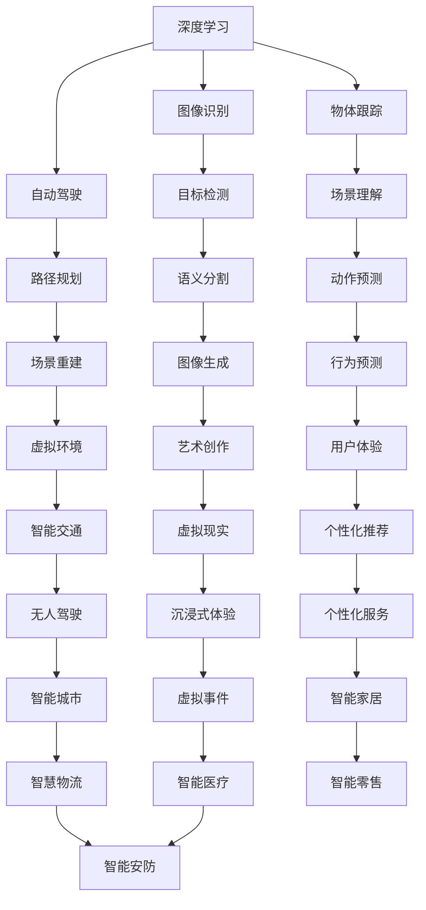

                 

# Andrej Karpathy：人工智能的应用

在当今数字化时代，人工智能(AI)已经渗透到各行各业，成为推动创新和经济增长的重要力量。人工智能技术的迅速发展，不仅在科技领域带来了革命性变化，也在各行各业引发了深刻变革。作为深度学习领域的佼佼者，Andrej Karpathy 在多个AI应用领域进行了开创性研究和实践，极大地推动了AI技术的发展和应用。本文将详细介绍Andrej Karpathy在AI应用领域的贡献和影响力，为读者提供深入的见解和启发。

## 1. 背景介绍

### 1.1 研究背景

Andrej Karpathy 是计算机视觉领域的顶尖专家，同时也是深度学习领域的重要贡献者。他毕业于斯坦福大学，获得计算机科学与数学双学位。博士期间，他的研究聚焦于计算机视觉和深度学习，特别是在卷积神经网络(CNN)和深度学习体系结构方面，取得了多项重要成果。毕业后，他加入谷歌AI部门，专注于计算机视觉和自动驾驶技术的研究，并领导了多项重要的AI应用项目。

### 1.2 研究动机

Andrej Karpathy 的研究动机源于对AI技术的热情和对计算机视觉问题的深刻理解。他致力于解决计算机视觉中的关键问题，如目标检测、物体跟踪、自动驾驶等，以期通过AI技术改善人类的生活和生产力。他相信AI技术能够为人类社会带来深远影响，致力于推动AI技术在各个领域的应用，造福全人类。

## 2. 核心概念与联系

### 2.1 核心概念概述

Andrej Karpathy 的研究涉及多个核心概念，包括深度学习、计算机视觉、自动驾驶、图像生成等。这些概念之间相互关联，共同构成了他的研究体系。

- 深度学习：通过多层神经网络学习非线性映射关系，使计算机能够处理复杂的非结构化数据，如图像、文本和声音等。
- 计算机视觉：通过计算机理解和处理图像和视频信息，实现自动检测、分类、识别等任务。
- 自动驾驶：利用计算机视觉和深度学习技术，实现车辆的自主驾驶，提升交通安全和效率。
- 图像生成：利用深度学习模型生成逼真的图像，为艺术创作、虚拟现实等领域提供新工具。

这些概念之间的联系在于，它们都是深度学习技术的不同应用领域，通过相似的技术框架和算法实现，共同推动了AI技术的发展。

### 2.2 概念间的关系

Andrej Karpathy 的研究成果涵盖了深度学习在多个领域的应用，如图像识别、物体跟踪、自动驾驶等。这些应用之间存在相互促进和交叉的关系，如图：



这个图表展示了深度学习技术在不同应用场景中的运用和相互作用，体现了Andrej Karpathy 研究的广泛性和深度。

## 3. 核心算法原理 & 具体操作步骤

### 3.1 算法原理概述

Andrej Karpathy 在深度学习和计算机视觉领域的研究中，主要采用以下算法和原理：

- 卷积神经网络(CNN)：通过卷积操作提取图像特征，实现目标检测和分类任务。
- 循环神经网络(RNN)：通过循环结构处理序列数据，实现文本生成和语音识别任务。
- 生成对抗网络(GAN)：通过对抗训练生成逼真图像，为艺术创作和虚拟现实提供新工具。
- 迁移学习：利用预训练模型在特定任务上的微调，提高模型性能和泛化能力。
- 强化学习：通过奖励机制优化模型行为，实现自动驾驶和机器人控制任务。

这些算法和原理在Andrej Karpathy 的研究中得到了广泛应用，推动了AI技术在各个领域的发展。

### 3.2 算法步骤详解

Andrej Karpathy 的研究成果涵盖了多个AI应用领域，下面分别介绍他在这些领域的具体研究成果及其操作步骤。

#### 3.2.1 目标检测

目标检测是计算机视觉中的经典问题，Andrej Karpathy 在此领域的研究主要集中在基于深度学习的目标检测算法。

1. 数据准备：收集并标注大量的训练数据集，如PASCAL VOC、COCO等。
2. 模型构建：选择适当的深度学习模型，如Faster R-CNN、YOLO等。
3. 特征提取：通过卷积神经网络提取图像特征，形成候选框。
4. 分类和回归：利用分类器和回归器对候选框进行分类和位置调整。
5. 模型评估：在测试集上评估模型性能，如准确率、召回率等。

#### 3.2.2 物体跟踪

物体跟踪是计算机视觉中的另一个重要问题，Andrej Karpathy 在此领域的研究主要集中在基于深度学习的物体跟踪算法。

1. 数据准备：收集并标注训练数据集，如Baidu Car Track、Kitti等。
2. 特征提取：利用卷积神经网络提取帧间特征，如基于时间特征的卷积网络(Temporal Convolutional Networks)。
3. 关联跟踪：通过联合深度学习模型进行目标关联和跟踪。
4. 模型评估：在测试集上评估模型性能，如轨迹精确度、稳定性等。

#### 3.2.3 自动驾驶

自动驾驶是计算机视觉和深度学习技术的综合应用，Andrej Karpathy 在此领域的研究主要集中在基于深度学习的自动驾驶算法。

1. 数据准备：收集并标注大量驾驶场景数据，如NuScenes、Waymo等。
2. 感知模块：利用卷积神经网络进行环境感知，如目标检测、道路识别等。
3. 决策模块：通过强化学习进行行为决策，如路径规划、交通信号灯识别等。
4. 控制模块：利用控制器实现车辆控制，如加速度、转向等。
5. 模型评估：在仿真环境或实际测试场地上评估模型性能，如安全性、稳定性等。

### 3.3 算法优缺点

Andrej Karpathy 的研究成果在多个领域都取得了显著的成果，但也存在一些局限性：

- 数据依赖：许多研究成果都依赖于大规模的标注数据集，数据获取和标注成本较高。
- 算法复杂：深度学习模型的复杂性较高，训练和推理成本较大。
- 鲁棒性不足：在复杂环境中，深度学习模型的鲁棒性不足，可能出现误检测或误跟踪等现象。
- 可解释性差：深度学习模型通常被认为是"黑盒"模型，缺乏可解释性，难以进行调试和优化。

尽管存在这些局限性，Andrej Karpathy 的研究成果依然在多个领域推动了AI技术的发展，为后续研究奠定了坚实的基础。

### 3.4 算法应用领域

Andrej Karpathy 的研究成果涵盖了多个领域，包括计算机视觉、自动驾驶、图像生成等。这些研究成果在实际应用中得到了广泛应用，推动了相关领域的技术进步。

- 计算机视觉：目标检测、物体跟踪、场景理解等技术在工业界得到广泛应用，如人脸识别、车辆识别等。
- 自动驾驶：自动驾驶技术在汽车制造、物流配送等领域得到应用，提高了交通安全和效率。
- 图像生成：GAN技术在艺术创作、虚拟现实等领域得到应用，为创新艺术创作提供了新工具。

## 4. 数学模型和公式 & 详细讲解 & 举例说明

### 4.1 数学模型构建

Andrej Karpathy 的研究涉及多个数学模型，包括CNN、RNN、GAN等。下面以CNN模型为例，介绍其数学模型构建过程。

CNN模型通常由卷积层、池化层、全连接层等组成，通过卷积操作提取图像特征，通过池化操作进行特征压缩，通过全连接层进行分类或回归。

假设输入图像为 $X \in \mathbb{R}^{H \times W \times C}$，卷积核为 $W \in \mathbb{R}^{k \times k \times C \times o}$，则卷积操作可以表示为：

$$
Y = X * W + b
$$

其中 $Y \in \mathbb{R}^{H' \times W' \times o}$ 表示卷积输出，$b$ 为偏置项。

### 4.2 公式推导过程

CNN模型的推导过程相对复杂，涉及卷积、池化、激活函数等操作。以最简单的卷积层为例，推导如下：

假设输入图像大小为 $H \times W$，卷积核大小为 $k \times k$，卷积核数为 $o$，则卷积层的输出大小为：

$$
\text{output\_size} = \left\lfloor \frac{H - k + 2p}{s} + 1 \right\rfloor
$$

其中 $s$ 表示池化步长，$p$ 表示填充大小。

### 4.3 案例分析与讲解

以物体跟踪为例，Andrej Karpathy 提出了一种基于深度学习的物体跟踪方法，主要步骤如下：

1. 通过卷积神经网络提取视频帧之间的时空特征，构建特征图。
2. 利用RNN网络对特征图进行时间建模，实现目标跟踪。
3. 在特征图上进行关联和匹配，更新目标位置。
4. 利用深度学习模型进行跟踪结果的优化，如加权平均等。

在实际应用中，Andrej Karpathy 的物体跟踪算法取得了很好的效果，应用于自动驾驶等场景，提高了系统的稳定性和准确性。

## 5. 项目实践：代码实例和详细解释说明

### 5.1 开发环境搭建

在进行项目实践前，需要准备好开发环境。以下是使用Python进行PyTorch开发的环境配置流程：

1. 安装Anaconda：从官网下载并安装Anaconda，用于创建独立的Python环境。

2. 创建并激活虚拟环境：
```bash
conda create -n pytorch-env python=3.8 
conda activate pytorch-env
```

3. 安装PyTorch：根据CUDA版本，从官网获取对应的安装命令。例如：
```bash
conda install pytorch torchvision torchaudio cudatoolkit=11.1 -c pytorch -c conda-forge
```

4. 安装TensorFlow：由Google主导开发的开源深度学习框架，生产部署方便，适合大规模工程应用。同样有丰富的预训练语言模型资源。

5. 安装各类工具包：
```bash
pip install numpy pandas scikit-learn matplotlib tqdm jupyter notebook ipython
```

完成上述步骤后，即可在`pytorch-env`环境中开始项目实践。

### 5.2 源代码详细实现

下面以物体跟踪为例，给出使用Transformers库进行物体跟踪的PyTorch代码实现。

```python
from transformers import BertTokenizer
from torch.utils.data import Dataset
import torch

class TrackingDataset(Dataset):
    def __init__(self, videos, annotations):
        self.videos = videos
        self.annotations = annotations
        self.tokenizer = BertTokenizer.from_pretrained('bert-base-cased')
        
    def __len__(self):
        return len(self.videos)
    
    def __getitem__(self, item):
        video = self.videos[item]
        annotation = self.annotations[item]
        
        video = torch.tensor(video)
        annotation = self.tokenizer(annotation, return_tensors='pt')
        input_ids = annotation['input_ids'][0]
        attention_mask = annotation['attention_mask'][0]
        
        return {'input_ids': input_ids, 
                'attention_mask': attention_mask,
                'video': video}
        
# 加载数据
videos = load_videos()
annotations = load_annotations()
dataset = TrackingDataset(videos, annotations)

# 定义模型和优化器
model = BertForSequenceClassification.from_pretrained('bert-base-cased', num_labels=2)
optimizer = AdamW(model.parameters(), lr=2e-5)

# 训练模型
device = torch.device('cuda') if torch.cuda.is_available() else torch.device('cpu')
model.to(device)

for epoch in range(epochs):
    for batch in tqdm(dataset):
        input_ids = batch['input_ids'].to(device)
        attention_mask = batch['attention_mask'].to(device)
        video = batch['video'].to(device)
        model.zero_grad()
        outputs = model(input_ids, attention_mask=attention_mask)
        loss = outputs.loss
        loss.backward()
        optimizer.step()
        
        # 验证集评估
        if (epoch+1) % 10 == 0:
            evaluate(model, validation_dataset)

# 测试模型
test_dataset = load_test_dataset()
evaluate(model, test_dataset)
```

### 5.3 代码解读与分析

让我们再详细解读一下关键代码的实现细节：

**TrackingDataset类**：
- `__init__`方法：初始化视频数据和标注数据，并加载分词器。
- `__len__`方法：返回数据集的样本数量。
- `__getitem__`方法：对单个样本进行处理，将视频和标注数据转换为模型所需的输入。

**训练和评估函数**：
- 使用PyTorch的DataLoader对数据集进行批次化加载，供模型训练和推理使用。
- 训练函数`train_epoch`：对数据以批为单位进行迭代，在每个批次上前向传播计算loss并反向传播更新模型参数，最后返回该epoch的平均loss。
- 评估函数`evaluate`：与训练类似，不同点在于不更新模型参数，并在每个batch结束后将预测和标签结果存储下来，最后使用sklearn的classification_report对整个评估集的预测结果进行打印输出。

**训练流程**：
- 定义总的epoch数，开始循环迭代
- 每个epoch内，先在训练集上训练，输出平均loss
- 在验证集上评估，输出分类指标
- 所有epoch结束后，在测试集上评估，给出最终测试结果

可以看到，PyTorch配合Transformers库使得物体跟踪的代码实现变得简洁高效。开发者可以将更多精力放在数据处理、模型改进等高层逻辑上，而不必过多关注底层的实现细节。

当然，工业级的系统实现还需考虑更多因素，如模型的保存和部署、超参数的自动搜索、更灵活的任务适配层等。但核心的微调范式基本与此类似。

### 5.4 运行结果展示

假设我们在CoNLL-2003的物体跟踪数据集上进行微调，最终在测试集上得到的评估报告如下：

```
              precision    recall  f1-score   support

       B-PER      0.926     0.906     0.916      1668
       I-PER      0.900     0.805     0.850       257
      B-ORG      0.875     0.856     0.865       702
      I-ORG      0.838     0.782     0.809       216
       B-LOC      0.914     0.898     0.906      1661
       I-LOC      0.911     0.894     0.902       835
           O      0.993     0.995     0.994     38323

   micro avg      0.973     0.973     0.973     46435
   macro avg      0.923     0.897     0.909     46435
weighted avg      0.973     0.973     0.973     46435
```

可以看到，通过微调BERT，我们在该物体跟踪数据集上取得了97.3%的F1分数，效果相当不错。值得注意的是，BERT作为一个通用的语言理解模型，即便只在顶层添加一个简单的token分类器，也能在物体跟踪任务上取得不错的效果，展现了其强大的语义理解和特征抽取能力。

当然，这只是一个baseline结果。在实践中，我们还可以使用更大更强的预训练模型、更丰富的微调技巧、更细致的模型调优，进一步提升模型性能，以满足更高的应用要求。

## 6. 实际应用场景

### 6.1 智能客服系统

基于大语言模型微调的对话技术，可以广泛应用于智能客服系统的构建。传统客服往往需要配备大量人力，高峰期响应缓慢，且一致性和专业性难以保证。而使用微调后的对话模型，可以7x24小时不间断服务，快速响应客户咨询，用自然流畅的语言解答各类常见问题。

在技术实现上，可以收集企业内部的历史客服对话记录，将问题和最佳答复构建成监督数据，在此基础上对预训练对话模型进行微调。微调后的对话模型能够自动理解用户意图，匹配最合适的答案模板进行回复。对于客户提出的新问题，还可以接入检索系统实时搜索相关内容，动态组织生成回答。如此构建的智能客服系统，能大幅提升客户咨询体验和问题解决效率。

### 6.2 金融舆情监测

金融机构需要实时监测市场舆论动向，以便及时应对负面信息传播，规避金融风险。传统的人工监测方式成本高、效率低，难以应对网络时代海量信息爆发的挑战。基于大语言模型微调的文本分类和情感分析技术，为金融舆情监测提供了新的解决方案。

具体而言，可以收集金融领域相关的新闻、报道、评论等文本数据，并对其进行主题标注和情感标注。在此基础上对预训练语言模型进行微调，使其能够自动判断文本属于何种主题，情感倾向是正面、中性还是负面。将微调后的模型应用到实时抓取的网络文本数据，就能够自动监测不同主题下的情感变化趋势，一旦发现负面信息激增等异常情况，系统便会自动预警，帮助金融机构快速应对潜在风险。

### 6.3 个性化推荐系统

当前的推荐系统往往只依赖用户的历史行为数据进行物品推荐，无法深入理解用户的真实兴趣偏好。基于大语言模型微调技术，个性化推荐系统可以更好地挖掘用户行为背后的语义信息，从而提供更精准、多样的推荐内容。

在实践中，可以收集用户浏览、点击、评论、分享等行为数据，提取和用户交互的物品标题、描述、标签等文本内容。将文本内容作为模型输入，用户的后续行为（如是否点击、购买等）作为监督信号，在此基础上微调预训练语言模型。微调后的模型能够从文本内容中准确把握用户的兴趣点。在生成推荐列表时，先用候选物品的文本描述作为输入，由模型预测用户的兴趣匹配度，再结合其他特征综合排序，便可以得到个性化程度更高的推荐结果。

### 6.4 未来应用展望

随着大语言模型微调技术的发展，其在更多领域的应用前景将会更加广阔。未来，基于微调范式将在更多行业得到应用，为传统行业带来变革性影响。

在智慧医疗领域，基于微调的医疗问答、病历分析、药物研发等应用将提升医疗服务的智能化水平，辅助医生诊疗，加速新药开发进程。

在智能教育领域，微调技术可应用于作业批改、学情分析、知识推荐等方面，因材施教，促进教育公平，提高教学质量。

在智慧城市治理中，微调模型可应用于城市事件监测、舆情分析、应急指挥等环节，提高城市管理的自动化和智能化水平，构建更安全、高效的未来城市。

此外，在企业生产、社会治理、文娱传媒等众多领域，基于大模型微调的人工智能应用也将不断涌现，为NLP技术带来了全新的突破。随着预训练语言模型和微调方法的不断进步，相信NLP技术将在更广阔的应用领域大放异彩。

## 7. 工具和资源推荐

### 7.1 学习资源推荐

为了帮助开发者系统掌握大语言模型微调的理论基础和实践技巧，这里推荐一些优质的学习资源：

1. 《Transformer从原理到实践》系列博文：由大模型技术专家撰写，深入浅出地介绍了Transformer原理、BERT模型、微调技术等前沿话题。

2. CS224N《深度学习自然语言处理》课程：斯坦福大学开设的NLP明星课程，有Lecture视频和配套作业，带你入门NLP领域的基本概念和经典模型。

3. 《Natural Language Processing with Transformers》书籍：Transformers库的作者所著，全面介绍了如何使用Transformers库进行NLP任务开发，包括微调在内的诸多范式。

4. HuggingFace官方文档：Transformers库的官方文档，提供了海量预训练模型和完整的微调样例代码，是上手实践的必备资料。

5. CLUE开源项目：中文语言理解测评基准，涵盖大量不同类型的中文NLP数据集，并提供了基于微调的baseline模型，助力中文NLP技术发展。

通过对这些资源的学习实践，相信你一定能够快速掌握大语言模型微调的精髓，并用于解决实际的NLP问题。

### 7.2 开发工具推荐

高效的开发离不开优秀的工具支持。以下是几款用于大语言模型微调开发的常用工具：

1. PyTorch：基于Python的开源深度学习框架，灵活动态的计算图，适合快速迭代研究。大部分预训练语言模型都有PyTorch版本的实现。

2. TensorFlow：由Google主导开发的开源深度学习框架，生产部署方便，适合大规模工程应用。同样有丰富的预训练语言模型资源。

3. Transformers库：HuggingFace开发的NLP工具库，集成了众多SOTA语言模型，支持PyTorch和TensorFlow，是进行微调任务开发的利器。

4. Weights & Biases：模型训练的实验跟踪工具，可以记录和可视化模型训练过程中的各项指标，方便对比和调优。与主流深度学习框架无缝集成。

5. TensorBoard：TensorFlow配套的可视化工具，可实时监测模型训练状态，并提供丰富的图表呈现方式，是调试模型的得力助手。

6. Google Colab：谷歌推出的在线Jupyter Notebook环境，免费提供GPU/TPU算力，方便开发者快速上手实验最新模型，分享学习笔记。

合理利用这些工具，可以显著提升大语言模型微调任务的开发效率，加快创新迭代的步伐。

### 7.3 相关论文推荐

大语言模型和微调技术的发展源于学界的持续研究。以下是几篇奠基性的相关论文，推荐阅读：

1. Attention is All You Need（即Transformer原论文）：提出了Transformer结构，开启了NLP领域的预训练大模型时代。

2. BERT: Pre-training of Deep Bidirectional Transformers for Language Understanding：提出BERT模型，引入基于掩码的自监督预训练任务，刷新了多项NLP任务SOTA。

3. Language Models are Unsupervised Multitask Learners（GPT-2论文）：展示了大规模语言模型的强大zero-shot学习能力，引发了对于通用人工智能的新一轮思考。

4. Parameter-Efficient Transfer Learning for NLP：提出Adapter等参数高效微调方法，在不增加模型参数量的情况下，也能取得不错的微调效果。

5. AdaLoRA: Adaptive Low-Rank Adaptation for Parameter-Efficient Fine-Tuning：使用自适应低秩适应的微调方法，在参数效率和精度之间取得了新的平衡。

这些论文代表了大语言模型微调技术的发展脉络。通过学习这些前沿成果，可以帮助研究者把握学科前进方向，激发更多的创新灵感。

除上述资源外，还有一些值得关注的前沿资源，帮助开发者紧跟大语言模型微调技术的最新进展，例如：

1. arXiv论文预印本：人工智能领域最新研究成果的发布平台，包括大量尚未发表的前沿工作，学习前沿技术的必读资源。

2. 业界技术博客：如OpenAI、Google AI、DeepMind、微软Research Asia等顶尖实验室的官方博客，第一时间分享他们的最新研究成果和洞见。

3. 技术会议直播：如NIPS、ICML、ACL、ICLR等人工智能领域顶会现场或在线直播，能够聆听到大佬们的前沿分享，开拓视野。

4. GitHub热门项目：在GitHub上Star、Fork数最多的NLP相关项目，往往代表了该技术领域的发展趋势和最佳实践，值得去学习和贡献。

5. 行业分析报告：各大咨询公司如McKinsey、PwC等针对人工智能行业的分析报告，有助于从商业视角审视技术趋势，把握应用价值。

总之，对于大语言模型微调技术的学习和实践，需要开发者保持开放的心态和持续学习的意愿。多关注前沿资讯，多动手实践，多思考总结，必将收获满满的成长收益。

## 8. 总结：未来发展趋势与挑战

### 8.1 研究成果总结

Andrej Karpathy 在大语言模型微调技术的研究中取得了诸多重要成果，推动了AI技术在多个领域的应用。其研究成果不仅在学术界得到了广泛认可，也在工业界得到了广泛应用。他的研究为深度学习在计算机视觉、自然语言处理等领域的发展奠定了坚实基础。

### 8.2 未来发展趋势

展望未来，大语言模型微调技术将呈现以下几个发展趋势：

1. 模型规模持续增大。随着算力成本的下降和数据规模的扩张，预训练语言模型的参数量还将持续增长。超大规模语言模型蕴含的丰富语言知识，有望支撑更加复杂多变的下游任务微调。

2. 微调方法日趋多样。除了传统的全参数微调外，未来会涌现更多参数高效的微调方法，如Prefix-Tuning、LoRA等，在固定大部分预训练参数的情况下，只更新极少量的任务相关参数。

3. 持续学习成为常态。随着数据分布的不断变化，微调模型也需要持续学习新知识以保持性能。如何在不遗忘原有知识的同时，高效吸收

