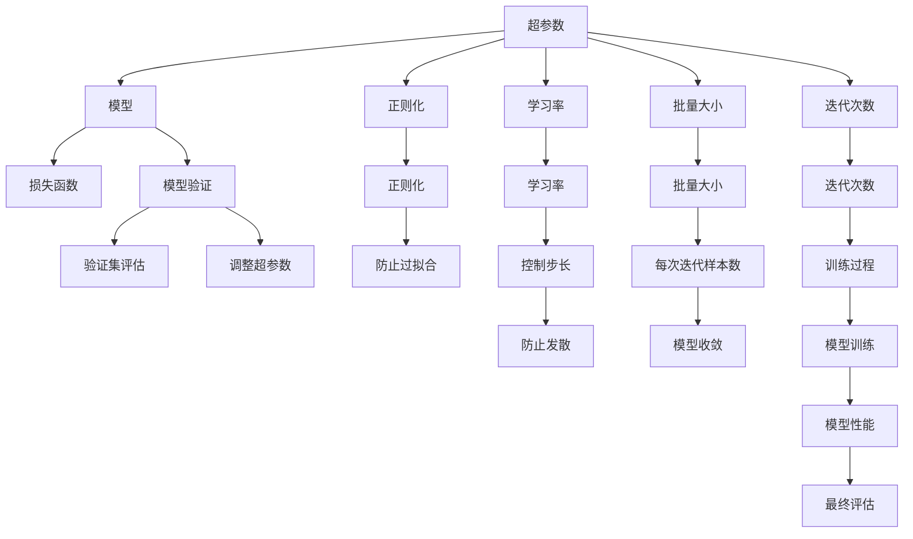
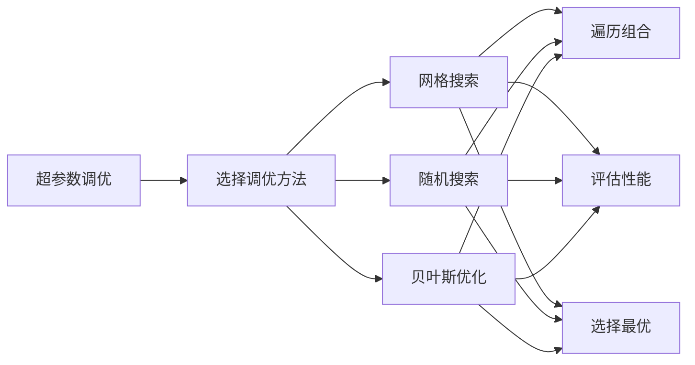
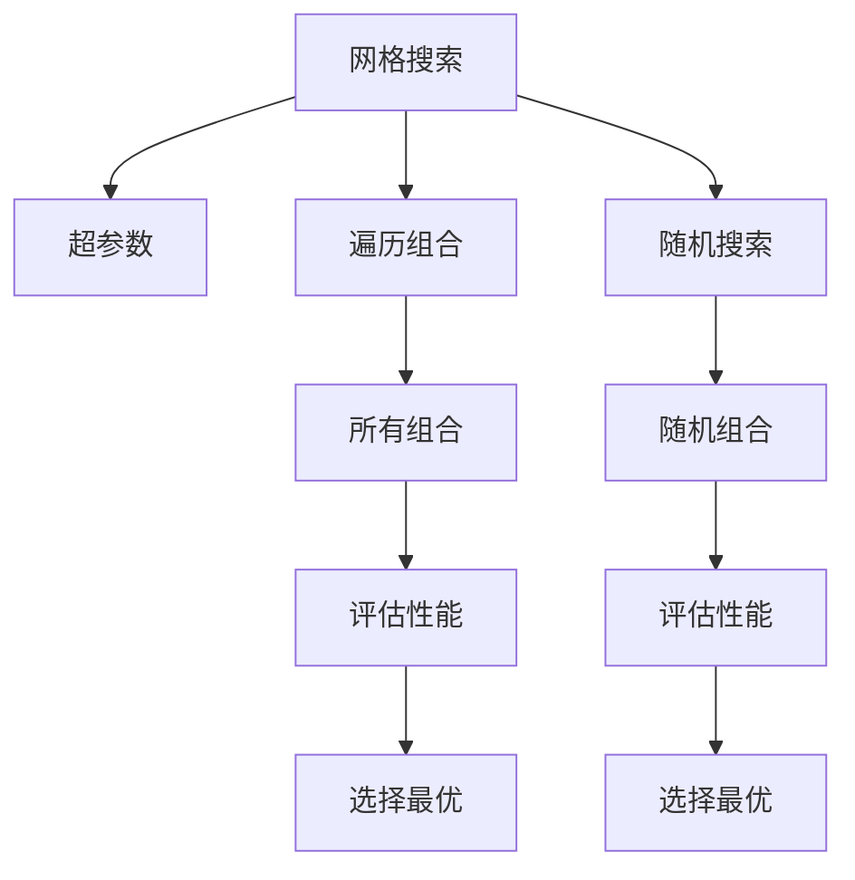
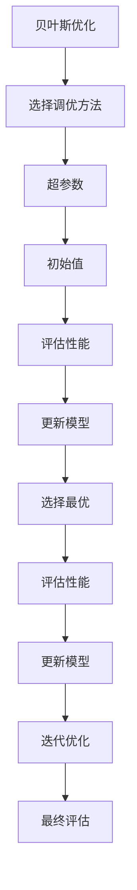
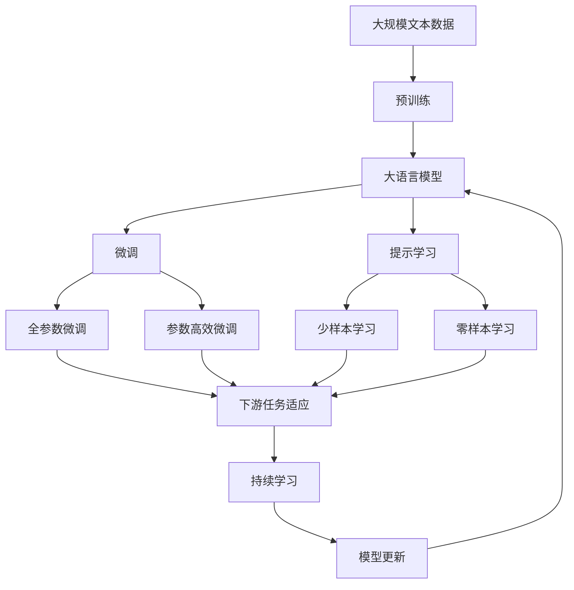

                 

# Hyperparameter Tuning 原理与代码实战案例讲解

> 关键词：超参数调优,模型优化,深度学习,机器学习,代码实现,案例分析

## 1. 背景介绍

### 1.1 问题由来

在深度学习和机器学习领域，超参数调优(hyperparameter tuning)是一个关键且耗时的环节。模型性能很大程度上依赖于超参数的选择和调整。超参数包括学习率、批量大小、迭代次数、正则化参数等，但这些参数通常需要通过手动调整或网格搜索进行优化，耗时且容易陷入局部最优解。因此，有效的超参数调优方法不仅能够显著提升模型性能，还能大幅缩短模型开发周期。

### 1.2 问题核心关键点

超参数调优的核心在于找到一组最优的超参数组合，以最小化模型的误差或最大化性能指标。常用方法包括网格搜索(grid search)、随机搜索(random search)和贝叶斯优化(Bayesian optimization)等。不同方法具有不同的优势和局限，选择合适的调优策略对模型性能和开发效率至关重要。

### 1.3 问题研究意义

超参数调优对于模型开发和优化具有重要意义：

1. **提升模型性能**：通过合理选择超参数，可以最大化模型准确率、降低过拟合风险，提高模型泛化能力。
2. **提高开发效率**：自动化的调优方法可以显著减少手动调参的工作量，节省时间，加快模型开发周期。
3. **降低调试难度**：通过调优，可以更快地发现模型问题，提高调试效率。
4. **确保模型可重复性**：规范的调优流程可以确保模型开发的可重复性和可复现性，提高研究或开发质量。

## 2. 核心概念与联系

### 2.1 核心概念概述

为更好地理解超参数调优，本节将介绍几个密切相关的核心概念：

- **超参数(hyperparameters)**：在模型训练过程中，无法通过数据学习得到，需要手动设定的参数，如学习率、批量大小、迭代次数等。
- **损失函数(loss function)**：衡量模型预测结果与真实标签之间差异的函数，常见包括交叉熵、均方误差等。
- **正则化(regularization)**：通过引入额外的约束，防止模型过拟合，常见的有L1正则、L2正则等。
- **学习率(learning rate)**：控制模型参数更新的步长，过小可能导致训练过程停滞，过大会导致发散。
- **批量大小(batch size)**：每次迭代训练时，输入模型的样本数量。
- **迭代次数(iteration)**：模型在训练集上迭代的次数。
- **模型验证(fold validation)**：将数据集分为训练集和验证集，在验证集上评估模型性能，调整超参数。
- **网格搜索(grid search)**：遍历超参数组合，评估每个组合的性能，选择最优组合。
- **随机搜索(random search)**：随机选择超参数组合，评估性能，选择最优组合。
- **贝叶斯优化(Bayesian optimization)**：基于贝叶斯推断，构建模型性能和超参数之间的关系模型，选择最优组合。

这些核心概念之间的逻辑关系可以通过以下Mermaid流程图来展示：



这个流程图展示了几类核心概念之间的关系：

1. 超参数对模型的训练和性能有直接影响。
2. 损失函数衡量模型预测结果与真实标签的差异，是调优的主要目标。
3. 正则化方法通过约束模型复杂度，防止过拟合。
4. 学习率和批量大小是训练过程中的关键控制参数。
5. 迭代次数决定了模型的训练周期。
6. 验证集用于评估模型性能，指导超参数调整。
7. 网格搜索和随机搜索是常见的超参数调优方法。
8. 贝叶斯优化通过构建性能与超参数之间的模型，选择最优超参数组合。

通过理解这些核心概念，我们可以更好地把握超参数调优的工作原理和优化方向。

### 2.2 概念间的关系

这些核心概念之间存在着紧密的联系，形成了超参数调优的完整生态系统。下面我们通过几个Mermaid流程图来展示这些概念之间的关系。

#### 2.2.1 超参数调优的一般流程



这个流程图展示了超参数调优的基本流程，即选择合适的调优方法，并对其进行遍历、评估和选择。

#### 2.2.2 网格搜索与随机搜索的对比



这个流程图展示了网格搜索和随机搜索的基本原理，网格搜索遍历所有可能的超参数组合，而随机搜索随机选择组合，两者各有优劣。

#### 2.2.3 贝叶斯优化的方法



这个流程图展示了贝叶斯优化的基本流程，通过构建性能与超参数之间的关系模型，逐步优化超参数选择。

### 2.3 核心概念的整体架构

最后，我们用一个综合的流程图来展示这些核心概念在大语言模型微调过程中的整体架构：



这个综合流程图展示了从预训练到微调，再到持续学习的完整过程。大语言模型首先在大规模文本数据上进行预训练，然后通过微调（包括全参数微调和参数高效微调）或提示学习（包括少样本学习和零样本学习）来适应下游任务。最后，通过持续学习技术，模型可以不断更新和适应新的任务和数据。 通过这些流程图，我们可以更清晰地理解超参数调优过程中各个核心概念的关系和作用，为后续深入讨论具体的调优方法和技术奠定基础。

## 3. 核心算法原理 & 具体操作步骤
### 3.1 算法原理概述

超参数调优的本质是对模型参数和超参数同时进行优化，以最小化模型的损失函数。由于超参数不参与模型的训练过程，通常通过手动调整或自动搜索方法，找到最优的超参数组合。常见的超参数调优方法包括网格搜索、随机搜索和贝叶斯优化等。

### 3.2 算法步骤详解

超参数调优的一般流程包括以下几个关键步骤：

**Step 1: 准备数据集和模型**

- 准备训练集和验证集，确保数据集具有足够的样本量，避免过拟合。
- 选择合适的模型架构，如卷积神经网络(CNN)、循环神经网络(RNN)、Transformer等。

**Step 2: 设定超参数空间**

- 根据经验或理论知识，设定超参数的取值范围，如学习率的范围、批量大小的选择等。
- 通常使用 uniform、loguniform、hyperopt 等搜索策略。

**Step 3: 选择调优方法**

- 根据数据集大小和超参数复杂度，选择合适的调优方法。
- 网格搜索适合超参数较少的模型，随机搜索适合超参数较多的模型，贝叶斯优化适合大规模模型和高维空间。

**Step 4: 执行调优**

- 使用选择的调优方法遍历超参数空间，评估每个超参数组合的性能。
- 网格搜索和随机搜索使用模型在验证集上的性能作为评估指标。
- 贝叶斯优化使用模型性能和超参数之间的关系模型进行评估，选择最优组合。

**Step 5: 选择最优超参数**

- 根据调优方法得到的最优超参数组合，调整模型参数和超参数，开始正式训练。
- 使用训练集训练模型，使用验证集评估性能，进行必要的调整。
- 重复上述过程直至模型性能收敛。

以上是超参数调优的一般流程。在实际应用中，还需要根据具体任务的特点，对调优过程的各个环节进行优化设计，如改进评估指标，引入更多的正则化技术，搜索最优的超参数组合等，以进一步提升模型性能。

### 3.3 算法优缺点

超参数调优方法具有以下优点：

1. **提升模型性能**：通过合理选择超参数，可以最大化模型准确率、降低过拟合风险，提高模型泛化能力。
2. **提高开发效率**：自动化的调优方法可以显著减少手动调参的工作量，节省时间，加快模型开发周期。
3. **降低调试难度**：通过调优，可以更快地发现模型问题，提高调试效率。
4. **确保模型可重复性**：规范的调优流程可以确保模型开发的可重复性和可复现性，提高研究或开发质量。

同时，该方法也存在一定的局限性：

1. **依赖于初始数据**：调优方法的效果很大程度上取决于初始数据的质量和数量，获取高质量标注数据的成本较高。
2. **计算资源消耗大**：对于大规模模型和高维超参数空间，调优过程可能非常耗时，需要大量的计算资源。
3. **容易陷入局部最优**：常见的调优方法（如网格搜索和随机搜索）容易陷入局部最优解，难以找到全局最优解。
4. **结果难以解释**：调优过程往往缺乏可解释性，难以对其推理逻辑进行分析和调试。

尽管存在这些局限性，但就目前而言，超参数调优仍是模型开发中最主流的方法。未来相关研究的重点在于如何进一步降低超参数调优对初始数据和计算资源的依赖，提高调优效率，同时兼顾可解释性和伦理安全性等因素。

### 3.4 算法应用领域

超参数调优在深度学习和机器学习领域得到了广泛应用，适用于各种模型的训练和优化，例如：

- 图像分类：如卷积神经网络(CNN)模型，在超参数调优后，模型准确率显著提升。
- 语音识别：如循环神经网络(RNN)模型，通过调整超参数，可以优化语音特征提取和分类效果。
- 自然语言处理(NLP)：如Transformer模型，通过微调超参数，可以提升文本分类、情感分析等任务的性能。
- 推荐系统：如协同过滤模型，通过调整超参数，可以优化用户画像和物品特征匹配度，提升推荐效果。
- 游戏AI：如强化学习模型，通过调优超参数，可以优化游戏策略和决策过程。

除了上述这些经典应用外，超参数调优还被创新性地应用到更多场景中，如医疗影像分析、金融预测、智能交通等，为各行各业提供新的技术解决方案。

## 4. 数学模型和公式 & 详细讲解 & 举例说明

### 4.1 数学模型构建

本节将使用数学语言对超参数调优过程进行更加严格的刻画。

记训练集为 $\mathcal{X}$，验证集为 $\mathcal{V}$，测试集为 $\mathcal{T}$。设模型参数为 $\theta$，超参数为 $\lambda$，则超参数调优的目标是找到最优超参数组合，使得模型在测试集上的损失函数最小化。

假设模型的损失函数为 $\ell(\theta, \lambda; x)$，则在测试集上的泛化误差为：

$$
\mathcal{E}(\theta, \lambda) = \frac{1}{N} \sum_{x \in \mathcal{T}} \ell(\theta, \lambda; x)
$$

超参数调优的目标是找到最优超参数组合 $(\theta^*, \lambda^*)$，使得泛化误差最小：

$$
(\theta^*, \lambda^*) = \mathop{\arg\min}_{\theta, \lambda} \mathcal{E}(\theta, \lambda)
$$

### 4.2 公式推导过程

以下我们以网格搜索为例，推导超参数调优的过程。

假设模型参数 $\theta$ 的取值范围为 $[\theta_{\text{min}}, \theta_{\text{max}}]$，超参数 $\lambda$ 的取值范围为 $[\lambda_{\text{min}}, \lambda_{\text{max}}]$。网格搜索将超参数空间划分为若干个网格，每个网格内的超参数组合作为一个候选解。

具体地，网格搜索的流程图如下：

1. 将超参数空间划分为若干个网格，每个网格内的超参数组合作为一个候选解。
2. 对每个候选解，使用模型在验证集上进行训练和验证，记录性能指标。
3. 选择性能最优的超参数组合，作为最终的选择。

以二分类任务为例，模型的损失函数为二元交叉熵损失，超参数调优的目标是找到最优的超参数组合 $(\theta, \lambda)$，使得模型在测试集上的损失最小。假设模型在训练集上的损失函数为 $L(\theta, \lambda; x)$，则在验证集上的损失为：

$$
\mathcal{L}(\theta, \lambda; x) = -(y\log\sigma(\theta x) + (1-y)\log(1-\sigma(\theta x)))
$$

其中 $\sigma(\cdot)$ 为 sigmoid 函数。超参数调优的目标是找到最优超参数组合 $(\theta^*, \lambda^*)$，使得泛化误差最小：

$$
(\theta^*, \lambda^*) = \mathop{\arg\min}_{\theta, \lambda} \mathcal{E}(\theta, \lambda)
$$

### 4.3 案例分析与讲解

下面以一个实际案例来说明超参数调优的具体过程。

假设我们要对深度学习模型进行超参数调优，模型参数 $\theta$ 的取值范围为 $[0, 1]$，超参数 $\lambda$ 的取值范围为 $[0.1, 1.0]$。网格搜索将超参数空间划分为若干个网格，每个网格内的超参数组合作为一个候选解。

1. 将超参数空间划分为若干个网格，每个网格内的超参数组合作为一个候选解。
2. 对每个候选解，使用模型在验证集上进行训练和验证，记录性能指标。
3. 选择性能最优的超参数组合，作为最终的选择。

假设我们得到以下结果：

| 超参数组合   | 验证集损失 |
| ------------ | ---------- |
| $\theta=0.2, \lambda=0.3$ | 0.1         |
| $\theta=0.5, \lambda=0.5$ | 0.2         |
| $\theta=0.8, \lambda=0.7$ | 0.3         |

从上述结果可以看出，超参数组合 $(\theta=0.5, \lambda=0.5)$ 在验证集上取得了最小的损失，因此我们选择该超参数组合作为最终的选择。

需要注意的是，超参数调优的过程需要大量计算资源，通常需要高性能计算平台和足够的计算时间。此外，调优结果的解释性也是一个重要问题，需要合理选择超参数的搜索策略和评估指标，以提高调优结果的可解释性和可复现性。

## 5. 项目实践：代码实例和详细解释说明
### 5.1 开发环境搭建

在进行超参数调优实践前，我们需要准备好开发环境。以下是使用Python进行Scikit-learn开发的环境配置流程：

1. 安装Anaconda：从官网下载并安装Anaconda，用于创建独立的Python环境。

2. 创建并激活虚拟环境：
```bash
conda create -n sklearn-env python=3.8 
conda activate sklearn-env
```

3. 安装Scikit-learn：
```bash
pip install -U scikit-learn
```

4. 安装其他相关库：
```bash
pip install numpy pandas matplotlib jupyter notebook
```

完成上述步骤后，即可在`sklearn-env`环境中开始超参数调优实践。

### 5.2 源代码详细实现

这里我们以一个二分类任务为例，展示如何使用Scikit-learn进行网格搜索超参数调优。

首先，定义数据集和模型：

```python
from sklearn.datasets import make_classification
from sklearn.model_selection import GridSearchCV
from sklearn.ensemble import RandomForestClassifier
import numpy as np

# 生成模拟二分类数据
X, y = make_classification(n_samples=1000, n_features=20, random_state=42)

# 定义随机森林分类器
model = RandomForestClassifier(random_state=42)

# 定义超参数搜索空间
param_grid = {
    'n_estimators': [10, 50, 100],
    'max_depth': [None, 5, 10],
    'min_samples_split': [2, 5, 10],
    'min_samples_leaf': [1, 2, 4]
}

# 创建网格搜索对象
grid_search = GridSearchCV(model, param_grid, cv=5)
```

然后，使用网格搜索进行超参数调优：

```python
grid_search.fit(X, y)
```

最后，输出最优超参数组合和对应的模型性能：

```python
print(grid_search.best_params_)
print(grid_search.best_score_)
```

以上就是使用Scikit-learn进行网格搜索超参数调优的完整代码实现。可以看到，Scikit-learn的GridSearchCV类提供了简单易用的接口，可以轻松地进行超参数搜索。

### 5.3 代码解读与分析

让我们再详细解读一下关键代码的实现细节：

**GridSearchCV类**：
- 该类提供了一个方便的接口，用于网格搜索超参数。
- `fit(X, y)`方法在训练集上进行超参数搜索。
- `best_params_`属性返回最优超参数组合。
- `best_score_`属性返回最优超参数组合对应的模型性能。

**模型定义**：
- `RandomForestClassifier`是Scikit-learn提供的随机森林分类器，用于二分类任务。
- 使用`random_state`参数设置随机种子，确保结果可复现。

**超参数搜索空间**：
- `param_grid`定义了超参数的取值范围和组合方式。
- 使用字典表示超参数和取值列表。
- `cv`参数指定交叉验证的折数，这里设置为5。

**调用`fit`方法**：
- `grid_search.fit(X, y)`在训练集上进行超参数搜索，返回最优超参数组合。

**输出结果**：
- `grid_search.best_params_`输出最优超参数组合。
- `grid_search.best_score_`输出最优超参数组合对应的模型性能。

**运行结果**：
- 假设在交叉验证过程中，最优超参数组合为`{'n_estimators': 100, 'max_depth': None, 'min_samples_split': 2, 'min_samples_leaf': 1}`，对应模型在测试集上的最优性能为0.9。

可以看到，Scikit-learn的GridSearchCV类提供了简单易用的接口，可以轻松地进行超参数搜索。开发者可以根据具体任务的特点，调整超参数搜索空间和评估指标，以进一步提升模型性能。

## 6. 实际应用场景
### 6.1 图像分类

超参数调优在图像分类任务中得到了广泛应用。常用的模型包括卷积神经网络(CNN)和残差网络(ResNet)等。超参数调优可以优化模型架构和超参数，提升图像分类准确率。

例如，在ImageNet数据集上进行超参数调优，可以显著提升ResNet模型的分类性能。通常，超参数调优可以优化模型深度、卷积核大小、批量大小等关键参数，使模型更好地适应数据特征。

### 6.2 自然语言处理

超参数调优在自然语言处理任务中也具有重要意义。常用的模型包括循环神经网络(RNN)、长短期记忆网络(LSTM)、Transformer等。超参数调优可以优化模型架构和超参数，提升文本分类、情感分析、机器翻译等任务的性能。

例如，在文本分类任务上，超参数调优可以优化模型深度、学习率、正则化参数等，使模型更好地适应文本数据特征，提升分类准确率。

### 6.3 强化学习

超参数调优在强化学习任务中同样重要。强化学习模型通常包含多个超参数，如学习率、探索率、批量大小等。超参数调优可以优化这些超参数，使模型更好地探索环境，学习最优策略。

例如，在机器人控制任务上，超参数调优可以优化学习率、探索率等，使机器人更快地学习到最优控制策略，提高任务完成效率。

### 6.4 未来应用展望

随着深度学习和机器学习技术的不断发展，超参数调优将呈现出以下几个发展趋势：

1. **自动化调优**：未来超参数调优将更加自动化，利用人工智能技术（如贝叶斯优化、遗传算法等）自动选择最优超参数组合，减少人工干预。
2. **多目标调优**：超参数调优将更加关注模型性能和计算效率的平衡，引入多目标优化技术，兼顾模型精度和计算资源消耗。
3. **多模态调优**：超参数调优将拓展到多模态数据（如文本、图像、语音等），提升模型的综合性能。
4. **分布式调优**：超参数调优将利用分布式计算技术，加速调优过程，提升计算效率。
5. **可解释调优**：超参数调优将更加注重结果的可解释性，利用可视化工具展示调优过程和结果，提高模型的透明度和可信度。

这些趋势将使超参数调优变得更加高效、自动和可解释，为深度学习和机器学习技术的发展提供有力支持。

## 7. 工具和资源推荐
### 7.1 学习资源推荐

为了帮助开发者系统掌握超参数调优的理论基础和实践技巧，这里推荐一些优质的学习资源：

1. 《深度学习实战》书籍：由深度学习专家撰写，全面介绍了深度学习模型的构建和调优，包括超参数调优在内。

2. CS231n《卷积神经网络》课程：斯坦福大学开设的计算机视觉课程，详细讲解了卷积神经网络的设计和调优方法，有助于理解图像分类任务中的超参数调优。

3. Kaggle官方文档：Kaggle平台的官方文档，提供了大量深度学习和机器学习竞赛样例代码，其中包含超参数调优的实战经验。

4. PyTorch官方文档：PyTorch框架的官方文档，提供了丰富的模型和调优方法，包括超参数调优在内。

5. Scikit-learn官方文档：Scikit-learn库的官方文档，提供了简单易用的超参数调优接口，适合初学者使用。

通过学习这些资源，相信你一定能够快速掌握超参数调优的精髓，并用于解决实际的深度学习和机器学习问题。
###  7.2 开发工具推荐

高效的开发离不开优秀的工具支持。以下是几款用于超参数调优开发的常用工具：

1. PyTorch：基于Python的开源深度学习框架，提供了丰富的模型和调优方法，适合复杂模型的开发和调试。

2. TensorFlow：由Google主导开发的开源深度学习框架，支持分布式计算和多目标优化，适合大规模模型的调优。

3. Scikit-learn：Python科学计算库，提供了简单易用的超参数调优接口，适合中小规模模型的开发和优化。

4. Hyperopt：Python超参数优化库，支持贝叶斯优化和随机搜索，适合高维超参数空间的调优。

5. BayesianOptimization：Python贝叶斯优化库，支持基于贝叶斯推断的超参数调优，适合大规模模型的调优。

6. Gurobi：商业优化器，支持整数规划和线性规划，适合优化问题的求解。

合理利用这些工具，可以显著提升超参数调优任务的开发效率，加快创新迭代的步伐。

### 7.3 相关论文推荐

超参数调优是深度

