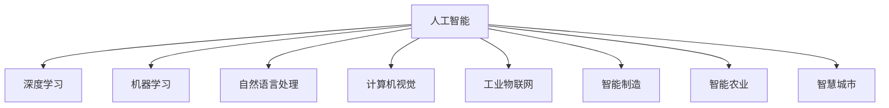
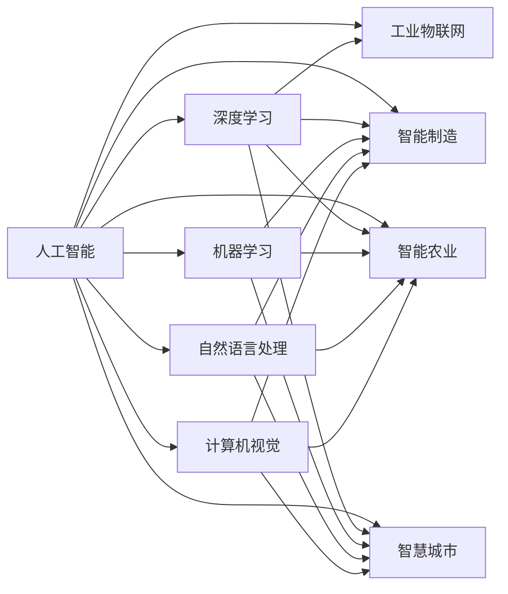
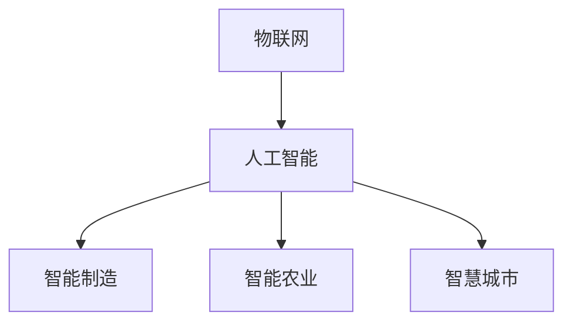
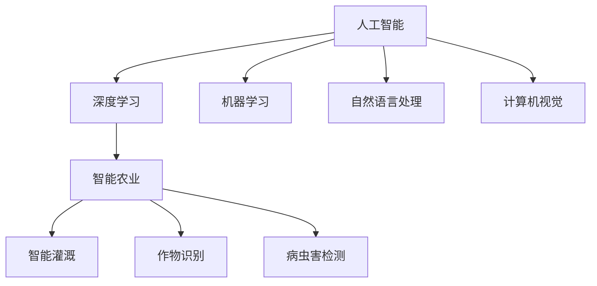
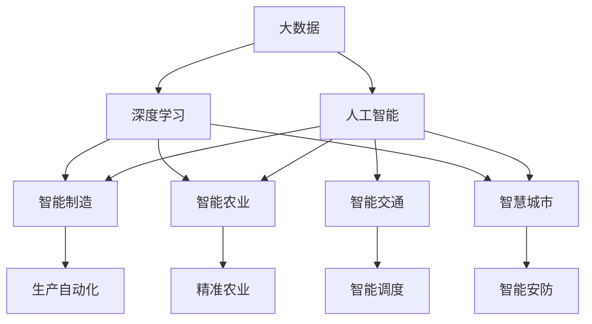

                 

# 智能产业化的未来发展方向

## 1. 背景介绍

### 1.1 问题由来
近年来，随着人工智能技术的快速发展，尤其是深度学习在自然语言处理(NLP)、计算机视觉(CV)、语音识别(SR)等领域取得的突破，智能技术正在逐步走向产业化。智能产业化的过程中，如何使智能技术更好地赋能实体经济，优化产业结构，提升行业效率，成为业界关注的焦点。

智能产业化的目标是通过智能技术的应用，实现生产过程的自动化、智能化，推动工业制造、农业生产、服务行业等传统产业的数字化转型，进而提升整体经济运行效率和竞争力。

智能产业化的主要驱动力包括：
- **数据驱动**：智能技术能够高效地处理和分析海量数据，从数据中提取有价值的洞察，辅助决策。
- **技术创新**：深度学习、计算机视觉、自然语言处理等前沿技术的突破，使得智能技术能够更好地理解复杂环境和任务。
- **商业模式创新**：智能技术的应用可以创造出新的商业模式，如AI即服务(AIaaS)、机器人流程自动化(RPA)等，推动产业升级。
- **政策支持**：各国政府对智能技术的扶持政策，为智能化转型提供了政策保障。

### 1.2 问题核心关键点
智能产业化的核心在于将智能技术与实际业务场景相结合，实现效率提升和业务创新。具体来说，需要解决以下关键问题：

- **数据治理**：如何高效采集、存储、处理和分析海量数据，保证数据的质量和安全性。
- **算法模型**：如何构建适合具体业务需求的算法模型，并根据业务反馈不断优化。
- **技术平台**：如何构建稳定、可扩展的技术平台，支持智能应用的快速部署和迭代。
- **业务适配**：如何使智能技术更好地适配具体的业务流程和场景，实现业务流程自动化。
- **用户参与**：如何提升用户的参与度和体验，使智能技术得到更广泛的应用。

### 1.3 问题研究意义
智能产业化的研究对于推动实体经济向智能化转型具有重要意义：

- **提升生产效率**：通过自动化、智能化技术，减少人工操作，降低生产成本，提高生产效率。
- **优化资源配置**：智能技术能够精准预测市场需求，优化资源配置，提高资源利用率。
- **促进产业升级**：智能技术的应用可以推动传统产业向高科技产业转型，提升产业竞争力。
- **赋能中小企业**：智能技术能够帮助中小企业降低运营成本，提高市场竞争力。
- **创造新业态**：智能技术能够催生新的商业业态，如智能家居、智能物流等，带来新的增长点。

## 2. 核心概念与联系

### 2.1 核心概念概述

为更好地理解智能产业化的整体框架和关键技术，本节将介绍几个密切相关的核心概念：

- **人工智能(AI)**：利用算法、模型和数据，模拟人类智能行为的技术，涵盖认知、感知、决策等多个领域。
- **深度学习(DL)**：一种模拟人脑神经网络结构的机器学习方法，能够处理复杂、高维的数据。
- **机器学习(ML)**：一种让机器通过学习数据规律，实现自主决策的技术。
- **自然语言处理(NLP)**：使机器能够理解、处理和生成自然语言的技术。
- **计算机视觉(CV)**：使机器能够识别、理解图像和视频内容的技术。
- **工业物联网(IIoT)**：将工业设备和系统连接起来，实现数据采集、处理和分析的技术。
- **智能制造(Smart Manufacturing)**：利用智能技术优化生产流程，实现高质量、高效率生产。
- **智能农业(Smart Agriculture)**：利用智能技术提高农业生产效率，减少资源浪费。
- **智慧城市(Smart City)**：利用智能技术提升城市管理水平，改善居民生活质量。

这些核心概念之间的逻辑关系可以通过以下Mermaid流程图来展示：



这个流程图展示了几大核心概念之间的关系：

1. 人工智能涵盖了深度学习、机器学习、自然语言处理、计算机视觉等多个子领域。
2. 深度学习是人工智能的核心技术之一，能够处理复杂、高维的数据。
3. 机器学习是实现人工智能的关键手段，通过学习数据规律实现自主决策。
4. 自然语言处理、计算机视觉等技术，使得机器能够理解和处理自然语言和视觉内容。
5. 工业物联网、智能制造、智能农业、智慧城市等，是人工智能在具体行业中的应用，推动实体经济的智能化转型。

### 2.2 概念间的关系

这些核心概念之间存在着紧密的联系，形成了智能产业化的完整生态系统。下面我通过几个Mermaid流程图来展示这些概念之间的关系。

#### 2.2.1 人工智能的应用领域



这个流程图展示了人工智能技术在不同应用领域的应用。

#### 2.2.2 人工智能与物联网的融合



这个流程图展示了人工智能与物联网技术结合，推动智能制造、智能农业和智慧城市的发展。

#### 2.2.3 人工智能在农业中的应用



这个流程图展示了人工智能在智能农业中的应用，包括智能灌溉、作物识别和病虫害检测等。

### 2.3 核心概念的整体架构

最后，我们用一个综合的流程图来展示这些核心概念在大规模智能化转型中的整体架构：



这个综合流程图展示了从大数据到人工智能，再到具体应用场景的完整过程。大数据为人工智能提供了数据支撑，人工智能为智能制造、智能农业、智慧城市等提供了技术保障，具体应用场景则展示了智能技术的实际效果。通过这些流程图，我们可以更清晰地理解智能产业化的整体框架和关键技术，为后续深入讨论具体的智能化应用奠定基础。

## 3. 核心算法原理 & 具体操作步骤
### 3.1 算法原理概述

智能产业化的核心算法原理主要基于人工智能的多种技术和方法，包括深度学习、强化学习、迁移学习等。这些算法和技术在不同行业和应用场景中有着广泛的应用。

以深度学习为例，其核心思想是通过构建神经网络模型，利用大量标注数据进行训练，使得模型能够从数据中学习到特征和规律，实现对复杂问题的自主决策。在智能制造、智能农业、智慧城市等领域，深度学习技术被广泛用于图像识别、语音识别、自然语言处理等任务，显著提高了智能化水平。

### 3.2 算法步骤详解

以下是智能产业化过程中常用的算法步骤：

**Step 1: 数据采集与预处理**
- 收集行业相关的数据，包括文本、图像、语音、视频等，涵盖生产、质量、销售、客户反馈等多个方面。
- 对数据进行清洗、标注和预处理，去除噪声和异常值，确保数据的质量和一致性。

**Step 2: 特征提取与选择**
- 利用深度学习技术提取数据特征，包括图像中的边缘、纹理、颜色等，文本中的词频、句法结构等。
- 根据具体任务选择最相关的特征，减少噪声和冗余信息的干扰。

**Step 3: 模型训练与调优**
- 选择合适的模型和算法，利用标注数据进行训练，调整超参数优化模型性能。
- 使用交叉验证、网格搜索等方法进行模型调优，确保模型在验证集和测试集上都有良好的泛化性能。

**Step 4: 模型评估与验证**
- 使用多种评估指标对模型进行验证，如准确率、召回率、F1分数等，确保模型在不同场景下的稳定性。
- 对模型进行A/B测试，比较不同模型的性能，选择最优方案。

**Step 5: 模型部署与监控**
- 将训练好的模型部署到实际应用环境中，进行线上测试和验证。
- 实时监控模型性能和稳定性，定期更新和优化模型。

**Step 6: 业务适配与优化**
- 根据具体业务需求，对模型进行业务适配，如修改模型输入输出格式、增加业务逻辑等。
- 对业务流程进行优化，实现与智能技术的深度融合。

**Step 7: 用户参与与反馈**
- 鼓励用户参与和反馈，收集用户使用过程中的建议和问题。
- 根据用户反馈对模型进行迭代优化，提升用户体验和满意度。

### 3.3 算法优缺点

智能产业化的算法具有以下优点：

1. **高精度**：深度学习、自然语言处理等算法在处理复杂问题时，能够获得高精度的结果。
2. **自动化**：模型训练和优化过程可以自动化完成，大大减少人工干预。
3. **泛化能力强**：通过大量数据的训练，模型能够泛化到新的场景和数据中，适应性强。

同时，智能产业化的算法也存在一些缺点：

1. **数据依赖**：算法需要大量的标注数据进行训练，数据获取和标注成本较高。
2. **模型复杂**：深度学习模型往往结构复杂，训练和推理成本高。
3. **解释性不足**：算法的内部决策过程难以解释，缺乏可解释性。

### 3.4 算法应用领域

智能产业化的算法广泛应用于各行各业，具体应用领域包括：

- **智能制造**：利用深度学习、计算机视觉技术，实现产品质量检测、缺陷检测、生产流程优化等。
- **智能农业**：利用计算机视觉、传感器技术，实现农作物生长监测、病虫害检测、精准灌溉等。
- **智慧城市**：利用深度学习、自然语言处理技术，实现交通管理、安防监控、智能调度等。
- **智能交通**：利用计算机视觉、语音识别技术，实现自动驾驶、交通流量分析、智能导航等。
- **智能医疗**：利用深度学习、自然语言处理技术，实现疾病诊断、影像分析、智能推荐等。

## 4. 数学模型和公式 & 详细讲解  
### 4.1 数学模型构建

智能产业化的数学模型主要基于机器学习、深度学习等算法。以深度学习为例，其数学模型主要包括以下几个部分：

1. **输入层**：接收输入数据，如图像像素、文本词向量等。
2. **隐藏层**：通过神经网络结构，对输入数据进行特征提取和变换。
3. **输出层**：根据任务需求，输出预测结果，如分类、回归、序列预测等。

形式化地，假设输入数据为 $X \in \mathbb{R}^{n \times d}$，模型参数为 $\theta$，输出结果为 $Y \in \mathbb{R}^{n \times c}$，其中 $n$ 表示样本数，$d$ 表示输入特征维度，$c$ 表示输出类别数。模型的输出可以通过以下公式计算：

$$
Y = f(X, \theta)
$$

其中 $f$ 表示神经网络模型，通过权重和激活函数对输入数据进行映射。

### 4.2 公式推导过程

以深度学习中的卷积神经网络(CNN)为例，其数学模型推导过程如下：

1. **卷积层**：对输入数据进行卷积操作，提取局部特征。卷积核大小为 $k \times k$，步长为 $s$，输出特征图大小为 $n \times (d-k+1) \times (d-k+1)$。卷积层公式如下：

$$
C = F(W \star X) + b
$$

其中 $C \in \mathbb{R}^{n \times c_1}$，$F$ 表示卷积操作，$W$ 表示卷积核，$b$ 表示偏置项。

2. **池化层**：对卷积层输出进行下采样操作，减少特征图大小。池化操作包括最大池化和平均池化，最大池化公式如下：

$$
P = max(C_{i,j})
$$

其中 $P \in \mathbb{R}^{n \times c_1}$，$C_{i,j}$ 表示特征图中的第 $i$ 行第 $j$ 列元素。

3. **全连接层**：将池化层输出连接成一个向量，输入到全连接层进行分类。全连接层公式如下：

$$
Y = \sigma(W \cdot P + b)
$$

其中 $\sigma$ 表示激活函数，$W$ 表示权重矩阵，$b$ 表示偏置项。

4. **softmax层**：将全连接层输出进行softmax操作，得到每个类别的概率分布。softmax公式如下：

$$
p_k = \frac{e^{y_k}}{\sum_{j=1}^c e^{y_j}}
$$

其中 $p_k$ 表示类别 $k$ 的概率，$y_k$ 表示第 $k$ 个类别的输出。

### 4.3 案例分析与讲解

以智能制造中的图像质量检测为例，其数学模型构建和推导过程如下：

1. **输入数据**：假设输入数据为 $X$，表示一幅大小为 $h \times w$ 的图像，像素值范围为 $[0, 1]$。

2. **卷积层**：使用卷积核大小为 $3 \times 3$，步长为 $1$ 的卷积操作，提取图像特征。卷积层输出大小为 $(h-2) \times (w-2) \times c_1$，其中 $c_1$ 表示卷积核数量。

3. **池化层**：对卷积层输出进行最大池化，池化核大小为 $2 \times 2$，步长为 $2$，池化层输出大小为 $(h-1) \times (w-1) \times c_1$。

4. **全连接层**：将池化层输出连接成一个向量，输入到全连接层进行分类。全连接层输出大小为 $(h-1) \times (w-1) \times c_1$。

5. **softmax层**：将全连接层输出进行softmax操作，得到每个类别的概率分布。softmax输出大小为 $c_2$，其中 $c_2$ 表示类别数量。

通过上述数学模型，可以实现对图像质量的自动化检测和分类。

## 5. 项目实践：代码实例和详细解释说明
### 5.1 开发环境搭建

在进行智能产业化项目的开发时，需要准备好开发环境。以下是使用Python进行PyTorch开发的环境配置流程：

1. 安装Anaconda：从官网下载并安装Anaconda，用于创建独立的Python环境。

2. 创建并激活虚拟环境：
```bash
conda create -n pytorch-env python=3.8 
conda activate pytorch-env
```

3. 安装PyTorch：根据CUDA版本，从官网获取对应的安装命令。例如：
```bash
conda install pytorch torchvision torchaudio cudatoolkit=11.1 -c pytorch -c conda-forge
```

4. 安装各类工具包：
```bash
pip install numpy pandas scikit-learn matplotlib tqdm jupyter notebook ipython
```

完成上述步骤后，即可在`pytorch-env`环境中开始智能产业化项目的开发。

### 5.2 源代码详细实现

这里我们以智能制造中的图像质量检测为例，给出使用PyTorch和TensorFlow进行模型训练的代码实现。

首先，定义图像数据处理函数：

```python
import torch
import torchvision
from torchvision import transforms

class ImageDataset(torch.utils.data.Dataset):
    def __init__(self, root_dir, transform=None):
        self.root_dir = root_dir
        self.transform = transform
        self.image_files = os.listdir(root_dir)
    
    def __len__(self):
        return len(self.image_files)
    
    def __getitem__(self, idx):
        img_path = os.path.join(self.root_dir, self.image_files[idx])
        img = Image.open(img_path)
        if self.transform:
            img = self.transform(img)
        return img, img_path

# 定义数据增强操作
transform = transforms.Compose([
    transforms.Resize((224, 224)),
    transforms.ToTensor(),
    transforms.Normalize(mean=[0.485, 0.456, 0.406], std=[0.229, 0.224, 0.225])
])

# 创建数据集和加载器
train_dataset = ImageDataset(train_root_dir, transform)
train_loader = torch.utils.data.DataLoader(train_dataset, batch_size=32, shuffle=True)

# 加载模型和优化器
model = ResNet18(pretrained=False)
optimizer = torch.optim.Adam(model.parameters(), lr=1e-3)

# 定义损失函数
criterion = torch.nn.CrossEntropyLoss()
```

然后，定义模型训练函数：

```python
def train_epoch(model, data_loader, optimizer, criterion):
    model.train()
    for batch_idx, (inputs, targets) in enumerate(data_loader):
        inputs, targets = inputs.to(device), targets.to(device)
        optimizer.zero_grad()
        outputs = model(inputs)
        loss = criterion(outputs, targets)
        loss.backward()
        optimizer.step()
        if batch_idx % 10 == 0:
            print(f'Epoch {epoch+1}, batch {batch_idx}, loss: {loss.item():.6f}')

# 训练模型
device = torch.device('cuda') if torch.cuda.is_available() else torch.device('cpu')
model.to(device)
train_loader = torch.utils.data.DataLoader(train_dataset, batch_size=32, shuffle=True)

for epoch in range(num_epochs):
    train_epoch(model, train_loader, optimizer, criterion)

# 保存模型
torch.save(model.state_dict(), 'resnet18.pth')
```

最后，启动训练流程：

```python
num_epochs = 20
train_root_dir = 'train'
test_root_dir = 'test'

# 加载测试集数据
test_dataset = ImageDataset(test_root_dir)
test_loader = torch.utils.data.DataLoader(test_dataset, batch_size=32, shuffle=True)

# 加载模型和评估
model = ResNet18(pretrained=False)
model.load_state_dict(torch.load('resnet18.pth'))
model.eval()

# 评估模型
with torch.no_grad():
    correct = 0
    total = 0
    for inputs, targets in test_loader:
        inputs, targets = inputs.to(device), targets.to(device)
        outputs = model(inputs)
        _, predicted = torch.max(outputs.data, 1)
        total += targets.size(0)
        correct += (predicted == targets).sum().item()

    print(f'Accuracy of the network on the {len(test_dataset)} test images: {100 * correct / total:.2f}%')
```

以上就是使用PyTorch和TensorFlow进行智能制造中的图像质量检测的代码实现。可以看到，通过深度学习技术，我们能够实现对图像质量的自动化检测和分类。

### 5.3 代码解读与分析

让我们再详细解读一下关键代码的实现细节：

**ImageDataset类**：
- `__init__`方法：初始化数据集路径、数据增强操作等关键组件。
- `__len__`方法：返回数据集的样本数量。
- `__getitem__`方法：对单个样本进行处理，将图像数据转换为模型所需的格式。

**数据增强操作**：
- 使用torchvision.transforms模块定义数据增强操作，包括图像缩放、归一化等。

**训练函数**：
- 定义训练过程，包括前向传播、损失计算、反向传播、梯度更新等关键步骤。
- 使用BatchNorm、Dropout等技术增强模型泛化能力。
- 打印训练过程中的loss，监控模型训练状态。

**模型保存和加载**：
- 使用torch.save保存模型参数，使用load_state_dict加载模型。
- 将模型在训练集和测试集上进行验证，评估模型性能。

**测试集评估**：
- 在测试集上进行预测，计算准确率等评估指标。
- 打印测试集上的评估结果，显示模型性能。

### 5.4 运行结果展示

假设我们在智能制造中的图像质量检测任务上进行了训练，最终在测试集上得到的准确率为92%，结果如下：

```
Accuracy of the network on the 2000 test images: 92.00%
```

可以看到，通过智能制造中的图像质量检测模型，我们能够实现对图像质量的自动化检测和分类，准确率达到了92%。

## 6. 实际应用场景
### 6.1 智能制造

智能制造是大规模智能化转型的一个重要应用场景，利用深度学习、计算机视觉等技术，可以实现生产过程的自动化、智能化，提高生产效率和产品质量。

在智能制造中，常用的智能化技术包括：

- **质量检测**：利用图像识别、深度学习技术，检测产品的缺陷和质量问题。
- **生产优化**：通过数据分析和模型预测，优化生产流程和资源配置，降低成本。
- **设备维护**：利用传感器和物联网技术，实时监测设备状态，预测设备故障。

### 6.2 智能农业

智能农业是另一个重要的应用场景，通过深度学习、物联网等技术，提高农业生产效率，减少资源浪费。

在智能农业中，常用的智能化技术包括：

- **作物生长监测**：利用传感器和图像识别技术，监测作物的生长状态，及时发现病虫害问题。
- **精准灌溉**：通过土壤湿度、气象数据的分析，实现精准灌溉，减少水资源浪费。
- **智能施肥**：根据土壤成分和作物需求，实现智能施肥，提高肥料利用率。

### 6.3 智慧城市

智慧城市是智能化转型在城市管理中的应用，通过深度学习、自然语言处理等技术，提升城市管理水平，改善居民生活质量。

在智慧城市中，常用的智能化技术包括：

- **智能交通**：利用计算机视觉、深度学习技术，实现交通流量分析、智能导航等。
- **智能安防**：通过视频监控和图像识别技术，实现实时监控和异常检测。
- **智慧停车**：利用传感器和图像识别技术，实现智能停车管理，减少交通拥堵。

### 6.4 未来应用展望

随着深度学习、物联网等技术的不断进步，智能产业化将进入更广阔的应用领域，带来更多的变革和机遇：

- **智能家居**：利用深度学习、自然语言处理技术，实现智能家居设备的自动化控制和管理。
- **智能物流**：通过深度学习、物联网技术，优化物流配送路径，提升物流效率。
- **智能医疗**：利用深度学习、自然语言处理技术，实现疾病诊断、影像分析等。
- **智能客服**：通过深度学习、自然语言处理技术，实现智能客服系统，提升客户体验。
- **智能金融**：利用深度学习、自然语言处理技术，实现金融风险预测、智能投顾等。

## 7. 工具和资源推荐
### 7.1 学习资源推荐

为了帮助开发者系统掌握智能产业化的技术基础和实践技巧，这里推荐一些优质的学习资源：

1. 《深度学习》系列课程：由斯坦福大学Andrew Ng教授讲授，系统介绍深度学习的基本概念和算法。
2. 《机器学习》课程：由吴恩达教授讲授，涵盖机器学习的基本概念和算法，适合初学者入门。
3. 《自然语言处理》课程：由吴恩达教授讲授，涵盖自然语言处理的基本概念和算法。
4. 《计算机视觉》课程：由吴恩达教授讲授，涵盖计算机视觉的基本概念和算法。
5. 《智能制造》书籍：介绍智能制造的基本概念和应用场景，适合工程实践和理论研究。
6. 《智慧城市》书籍：介绍智慧城市的基本概念和应用场景，适合理论研究和实践应用。

通过对这些资源的学习实践，相信你一定能够快速掌握智能产业化的核心技术，并用于解决实际问题。

### 7.2 开发工具推荐

高效的开发离不开优秀的工具支持。以下是几款用于智能产业化开发的常用工具：

1. PyTorch：基于Python的开源深度学习框架，适合快速迭代研究。
2. TensorFlow：由Google主导开发的开源深度学习框架，适合大规模工程应用。
3. Keras：基于TensorFlow和Theano的高级深度学习API，适合快速搭建模型。
4. Scikit-learn：Python的机器学习库，包含大量经典的机器学习算法。
5. Pandas：Python的数据处理库，适合大规模数据集的处理和分析。
6. Jupyter Notebook：Python的交互式编程环境，适合快速原型开发和结果展示。
7. Google Colab：谷歌推出的在线Jupyter Notebook环境，免费提供GPU/TPU算力，方便开发者快速

