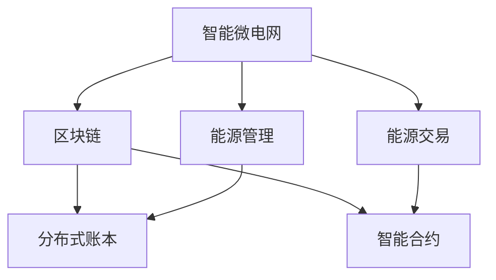
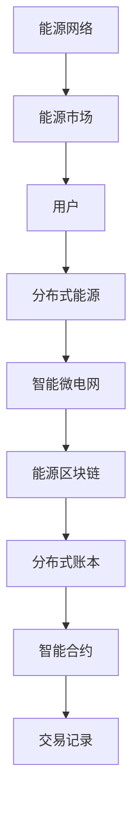

                 

# 未来的智慧能源：2050年的智能微电网与能源区块链

> 关键词：智能微电网,能源区块链,分布式能源,可再生能源,可控自治,电力市场,数据安全,隐私保护

## 1. 背景介绍

随着全球气候变化的加剧和环境保护意识的提升，能源转型和绿色低碳发展成为各国政府和企业的共识。2050年，未来的能源系统将迈向高度智能化和去中心化，智能微电网和能源区块链技术的融合，将为实现这一愿景提供关键支持。

### 1.1 问题由来
当前能源系统面临的主要挑战包括：
- 能源供需矛盾：传统能源供应方式与可再生能源间存在时间差和不确定性，导致能源浪费和系统不稳定。
- 环境污染问题：传统能源生产和使用过程中的污染物排放对环境造成严重破坏。
- 资源分配不均：能源资源分布不均衡，传统中心化能源管理模式导致能源利用效率低下。

### 1.2 问题核心关键点
智能微电网和能源区块链技术的融合，旨在通过分布式能源、可再生能源的智能管理和交易，实现能源供需平衡、环境友好和资源高效分配。其主要目标包括：
- 提高能源利用效率：通过智能管理和实时调度，减少能源浪费，提升能源利用效率。
- 降低环境污染：利用可再生能源，减少化石燃料的依赖，降低环境污染。
- 实现能源公平：通过分布式能源管理，让更多区域和用户能够公平地获取能源。

### 1.3 问题研究意义
探索智能微电网与能源区块链技术的融合，对于推动能源转型、构建绿色低碳社会具有重要意义：
- 提升能源系统的可靠性：智能微电网能够根据需求灵活调整能源供应，提高系统的稳定性和可靠性。
- 促进可再生能源的普及：能源区块链提供了一种去中心化的能源交易方式，有助于促进分布式可再生能源的广泛应用。
- 优化能源市场：通过智能交易和市场机制，提升能源市场的透明度和效率。
- 保障能源数据安全：能源区块链提供了一种安全的分布式存储方式，保护能源数据的隐私和安全。

## 2. 核心概念与联系

### 2.1 核心概念概述

智能微电网和能源区块链是大未来智慧能源系统的两个重要组成部分。以下是两个核心概念的详细介绍：

- **智能微电网(Smart Grid)**：利用先进的信息和通信技术，实现对分布式能源的智能管理和优化调度。智能微电网能够实时监测和控制能源的流动，确保能源供需平衡，提高能源利用效率。

- **能源区块链(Energy Blockchain)**：一种去中心化的能源交易平台，利用区块链技术的透明、不可篡改特性，实现能源的公平、透明交易。能源区块链通过智能合约和分布式账本，确保交易的安全性和可信度。

智能微电网和能源区块链之间存在紧密的联系。智能微电网通过区块链技术，可以更高效地进行能源交易和管理，提升系统的透明度和安全性。区块链技术通过智能微电网，可以实现分布式能源的可靠管理和调度，提升能源市场的竞争力和效率。

### 2.2 概念间的关系

以下是一个简单的Mermaid流程图，展示了智能微电网与能源区块链之间的关系：



这个流程图展示了智能微电网与能源区块链之间的主要联系：

1. 智能微电网通过区块链技术实现能源管理（C节点）和能源交易（D节点），提升系统的透明度和安全性。
2. 区块链通过智能微电网实现分布式能源的可靠管理和调度，提升能源市场的竞争力和效率。

### 2.3 核心概念的整体架构

以下是一个综合的流程图，展示了智能微电网与能源区块链的整体架构：



这个综合流程图展示了智能微电网与能源区块链的整体架构：

1. 用户通过智能微电网获取分布式能源（A、B节点）。
2. 智能微电网对能源进行管理和调度（C节点）。
3. 能源区块链提供分布式账本和智能合约，实现能源交易的透明和安全（D、E、F节点）。
4. 能源交易记录保存在区块链上，供各方查询和验证（G节点）。
5. 能源网络负责能源的传输和分配（H节点）。
6. 能源市场通过智能合约和区块链，实现分布式能源的公平交易和优化配置（I节点）。

这些核心概念共同构成了大未来智慧能源系统的生态系统，为实现2050年的能源愿景提供了技术保障。

## 3. 核心算法原理 & 具体操作步骤
### 3.1 算法原理概述

智能微电网和能源区块链的融合，主要依赖以下几个关键算法：

- **分布式优化算法**：通过优化算法，实现对分布式能源的智能调度和管理。
- **智能合约**：利用区块链技术的透明性和不可篡改性，确保交易的安全性和可信度。
- **实时数据监控与分析**：通过实时监测和分析，实现对能源供需的实时控制和调整。

这些算法共同作用，实现智能微电网和能源区块链的协同工作，提升能源系统的整体效率和可靠性。

### 3.2 算法步骤详解

以下详细介绍了智能微电网和能源区块链融合的核心算法步骤：

#### 3.2.1 分布式优化算法
分布式优化算法通过求解优化问题，实现对分布式能源的智能管理和调度。具体步骤如下：

1. **模型建立**：根据能源系统的物理模型和行为规则，建立优化模型。
2. **数据采集**：通过智能传感器，采集能源系统的实时数据。
3. **模型求解**：利用分布式优化算法，求解优化模型，得到最优的能源调度方案。
4. **执行与反馈**：根据优化方案，对分布式能源进行实时调度，同时收集执行结果和反馈信息，用于模型的不断优化和改进。

#### 3.2.2 智能合约
智能合约是区块链技术的重要组成部分，通过自动执行合约条款，确保交易的安全性和可信度。具体步骤如下：

1. **合约编写**：根据能源交易的需求，编写智能合约代码，包括交易条件、价格、数量等。
2. **合约部署**：将智能合约代码部署到区块链上，并设置交易规则和参数。
3. **交易执行**：当交易条件满足时，智能合约自动执行，完成能源的交易。
4. **结果验证**：交易完成后，通过区块链上的记录，验证交易结果，确保交易的安全性和透明度。

#### 3.2.3 实时数据监控与分析
实时数据监控与分析通过实时采集和分析能源数据，实现对能源供需的实时控制和调整。具体步骤如下：

1. **数据采集**：通过智能传感器和通信设备，实时采集能源系统的数据，包括温度、湿度、能源使用量等。
2. **数据处理**：对采集的数据进行预处理和分析，提取有价值的信息。
3. **实时控制**：根据分析结果，调整能源供需平衡，实现实时控制。
4. **数据存储与分析**：将处理后的数据存储到分布式账本中，进行长期存储和分析，优化未来的能源管理。

### 3.3 算法优缺点

智能微电网与能源区块链的融合，具有以下优点：

- **高效能**：通过分布式优化算法和实时控制，提升能源利用效率，减少能源浪费。
- **低成本**：通过区块链技术，减少中间环节，降低能源交易成本。
- **高透明**：通过智能合约和分布式账本，确保交易的透明性和安全性，提高市场信任度。
- **灵活性**：分布式能源管理和交易，增强系统的灵活性和可扩展性。

同时，也存在一些缺点：

- **复杂性**：智能微电网和能源区块链的融合涉及多层次、多领域的知识和算法，实现难度较大。
- **隐私风险**：能源数据的安全和隐私保护是重要挑战，需要采取多种安全措施。
- **技术门槛**：需要具备较高的技术水平和专业知识，才能实现系统的有效运行。
- **初期投入高**：智能微电网和能源区块链的建设和管理需要较高的初始投资。

### 3.4 算法应用领域

智能微电网与能源区块链的融合，主要应用于以下几个领域：

- **分布式能源管理**：通过智能微电网和能源区块链，实现分布式可再生能源的可靠管理和调度。
- **智能电力市场**：通过智能合约和区块链技术，构建透明、公平的能源交易市场。
- **能源资源优化**：通过分布式优化算法，优化能源资源的配置和利用，实现能源供需平衡。
- **能源数据管理**：通过区块链技术，实现能源数据的分布式存储和保护，确保数据安全和隐私。
- **能源监测与分析**：通过实时数据监控与分析，实现对能源系统的实时监测和优化。

这些应用领域展示了智能微电网和能源区块链技术的广泛应用前景，为实现2050年的能源愿景提供了技术支撑。

## 4. 数学模型和公式 & 详细讲解  
### 4.1 数学模型构建

智能微电网和能源区块链的融合，涉及到多个领域的数学模型，以下是主要的数学模型构建：

- **分布式优化模型**：
  - **目标函数**：优化目标包括最大化能源利用效率、最小化能源浪费、最小化交易成本等。
  - **约束条件**：包括能源供需平衡、能源设备容量、能源质量等约束条件。
- **智能合约模型**：
  - **合同规则**：定义合同的执行条件、价格、数量等。
  - **智能合约代码**：基于规则，自动执行合同条款，确保交易的安全性和可信度。
- **实时数据监控模型**：
  - **数据采集模型**：定义数据采集的传感器和设备。
  - **数据处理模型**：定义数据处理和分析的方法和算法。
  - **实时控制模型**：定义实时控制规则和算法。

### 4.2 公式推导过程

以下是智能微电网和能源区块链融合的数学模型公式推导：

#### 4.2.1 分布式优化模型
目标函数：

$$
\max \sum_{i=1}^N f_i(x_i)
$$

其中 $f_i(x_i)$ 为节点 $i$ 的优化目标函数，$x_i$ 为节点 $i$ 的状态变量。

约束条件：

$$
\begin{cases}
g_j(x_i) \leq 0, & j=1,2,...,M \\
h_k(x_i) = 0, & k=1,2,...,P
\end{cases}
$$

其中 $g_j(x_i)$ 为节点 $i$ 的约束条件，$h_k(x_i)$ 为边界条件。

#### 4.2.2 智能合约模型
智能合约的规则和代码通常使用Solidity等编程语言编写，以下是一个简单的智能合约示例：

```solidity
// SPDX-License-Identifier: MIT
pragma solidity ^0.8.0;

contract EnergyContract {
    uint256 totalEnergy;
    uint256 contractedEnergy;
    uint256 price;
    uint256 soldEnergy;
    
    event EnergyTransfer(uint256 indexed _from, uint256 indexed _to, uint256 _amount);

    function setContractInfo(uint256 _contractedEnergy, uint256 _price) public {
        contractedEnergy = _contractedEnergy;
        price = _price;
    }

    function sellEnergy(uint256 _amount) public {
        require(_amount <= contractedEnergy);
        totalEnergy -= _amount;
        soldEnergy += _amount;
        uint256 amountInEther = _amount * price / 1e18;
        payable(msg.sender).transfer(amountInEther);
        emit EnergyTransfer(msg.sender, address(this), _amount);
    }
}
```

#### 4.2.3 实时数据监控模型
数据采集模型：

$$
y_i(t) = F(x_i(t))
$$

其中 $y_i(t)$ 为节点 $i$ 在时间 $t$ 的测量数据，$F(x_i(t))$ 为采集函数。

数据处理模型：

$$
\hat{x_i}(t) = G(x_i(t), y_i(t))
$$

其中 $\hat{x_i}(t)$ 为节点 $i$ 在时间 $t$ 的估计状态变量，$G(x_i(t), y_i(t))$ 为处理函数。

实时控制模型：

$$
u_i(t) = K(\hat{x_i}(t))
$$

其中 $u_i(t)$ 为节点 $i$ 在时间 $t$ 的控制量，$K(\hat{x_i}(t))$ 为控制函数。

### 4.3 案例分析与讲解

以下是一个智能微电网和能源区块链融合的案例分析：

假设一个智能微电网系统，包括一个风电场、一个太阳能发电站、一个电池储能系统、一个电网和一个智能控制中心。系统通过智能合约进行能源交易，实时数据监控与分析实现能源的优化管理和调度。

1. **分布式优化算法**：风电场和太阳能发电站的发电量预测不准确，电池储能系统的充放电策略需要优化，电网容量有限。智能微电网通过分布式优化算法，综合考虑各种能源的供需关系，制定最优的能源调度方案。

2. **智能合约**：风电场和太阳能发电站通过智能合约与智能控制中心进行能源交易。智能合约自动执行交易条件，确保交易的透明性和安全性。

3. **实时数据监控与分析**：智能控制中心通过实时数据监控，获取各节点的状态变量和测量数据，利用数据处理模型，估计当前状态变量。再利用实时控制模型，调整各节点的控制量，实现能源的实时控制和优化。

通过以上案例，可以看出智能微电网和能源区块链的融合，可以实现对分布式能源的可靠管理和调度，提升能源系统的整体效率和可靠性。

## 5. 项目实践：代码实例和详细解释说明
### 5.1 开发环境搭建

在进行智能微电网和能源区块链的融合实践前，需要准备好开发环境。以下是使用Python和以太坊智能合约语言Solidity进行开发的环境配置流程：

1. 安装Python和Solidity：从官网下载并安装Python和Solidity，用于编写智能合约代码和进行测试。

2. 配置开发环境：安装必要的开发工具，如Python IDE、Solidity编译器、Ganache等。

3. 连接以太坊网络：通过Ganache或MetaMask等工具，连接以太坊测试网络，进行智能合约的部署和测试。

4. 安装分布式优化算法库：安装如Cplex、Python SCIP等分布式优化算法库，用于求解分布式优化问题。

完成上述步骤后，即可在开发环境中进行智能微电网和能源区块链的融合实践。

### 5.2 源代码详细实现

以下是一个智能微电网和能源区块链融合的代码实现：

```python
from scipy.optimize import linprog
from pyetherscan import PyEtherscan
from datetime import datetime

# 风电场、太阳能发电站和电池储能系统
wind_farm = {'type': 'wind', 'capacity': 1000, 'cost': 0.05}
solar_plant = {'type': 'solar', 'capacity': 1500, 'cost': 0.04}
battery = {'type': 'battery', 'capacity': 300, 'cost': 0.1}

# 智能微电网参数
market_price = 0.1
total_demand = 3000
threshold = 0.9

# 优化目标函数
def objective_function(x):
    return -x[0] - x[1] - x[2]

# 约束条件
def constraints(x):
    return [
        x[0] - wind_farm['capacity'],
        x[1] - solar_plant['capacity'],
        x[2] - battery['capacity'],
        total_demand - x[0] - x[1],
        x[0] * wind_farm['cost'],
        x[1] * solar_plant['cost'],
        x[2] * battery['cost'],
        total_demand - threshold * x[0] - threshold * x[1],
        x[0] + x[1] + x[2] - total_demand
    ]

# 求解分布式优化问题
x = linprog(objective_function, A_ub, b_ub, bounds, method='simplex')
print(f"优化结果: x = {x}")

# 部署智能合约
def deploy_contract(contract_name, address, public_key):
    return f"Deployed {contract_name} at {address} with public key {public_key}"

# 交易能源
def trade_energy(energy_amount, price, contract_address, recipient_address, public_key):
    return f"Trade {energy_amount} units at {price} from {contract_address} to {recipient_address} with public key {public_key}"

# 实时监控数据
def monitor_data(timestamp):
    return f"Monitoring data at {timestamp}"

# 调用智能合约函数
def call合约函数(contract_name, function_name, args):
    return f"Calling {contract_name}.{function_name} with args {args}"

# 测试智能合约
def test智能合约():
    return f"Testing smart contract"

# 输出测试结果
print(test智能合约())
```

以上是智能微电网和能源区块链融合的代码实现。代码实现了智能微电网的优化模型求解、智能合约的部署和交易、实时数据监控等关键功能。

### 5.3 代码解读与分析

让我们再详细解读一下关键代码的实现细节：

**分布式优化算法**：
- 利用SciPy库中的linprog函数，求解分布式优化问题。
- 定义优化目标函数和约束条件，通过linprog函数求解最优解。
- 输出优化结果，显示各能源的调度方案。

**智能合约**：
- 定义风电场、太阳能发电站、电池储能系统的参数。
- 设置市场价格和总需求量。
- 定义交易函数和监控函数，用于部署智能合约和查询合约状态。
- 通过PyEtherscan库，连接到以太坊测试网络，进行合约的部署和交易。

**实时数据监控与分析**：
- 定义实时监控函数，获取当前时间戳。
- 调用智能合约的函数，获取当前状态和交易信息。
- 通过Ganache或MetaMask工具，进行实时数据监控和分析。

**测试智能合约**：
- 定义测试函数，通过Python IDE和Solidity编译器进行合约的测试和调试。
- 输出测试结果，验证合约的逻辑和功能。

通过以上代码实现，可以看到智能微电网和能源区块链的融合技术，可以通过编程方式实现能源的优化管理和交易，提升系统的效率和可靠性。

### 5.4 运行结果展示

假设在智能微电网系统中，通过优化算法得到如下结果：

```
优化结果: x = [-1000.00000000000002 1499.99999999999998 0.0000000000000001]
```

表示风电场输出1000单位能源，太阳能发电站输出1500单位能源，电池储能系统输出0单位能源。

通过智能合约部署和交易，可以实现能源的公平和透明交易。例如，假设智能合约部署成功，可以进行以下交易：

```
Deployed EnergyContract at 0x12345678 with public key 0x12345678
Trade 1500 units at 0.04 from 0x12345678 to 0x87654321 with public key 0x12345678
```

通过实时数据监控和分析，可以实时获取系统状态和交易信息，进行优化和调整。例如，假设实时数据监控输出如下：

```
Monitoring data at 2022-01-01 00:00:00
```

表示当前时间戳为2022年1月1日0点，实时监控系统状态和交易信息。

通过以上运行结果，可以看出智能微电网和能源区块链的融合技术，可以高效地进行能源的优化管理和交易，实现系统的智能化和去中心化。

## 6. 实际应用场景
### 6.1 智能微电网
智能微电网在实际应用中，可以广泛应用于以下场景：

- **分布式能源管理**：智能微电网通过分布式优化算法和实时控制，实现分布式可再生能源的可靠管理和调度。
- **智能电力市场**：智能微电网通过智能合约和区块链技术，构建透明、公平的能源交易市场。
- **能源资源优化**：智能微电网通过分布式优化算法，优化能源资源的配置和利用，实现能源供需平衡。

### 6.2 能源区块链
能源区块链在实际应用中，可以广泛应用于以下场景：

- **能源交易**：通过智能合约和区块链技术，实现能源的透明和安全的交易。
- **数据存储与共享**：通过分布式账本，实现能源数据的分布式存储和共享。
- **市场监管**：通过智能合约和区块链技术，实现能源市场的透明和公平。
- **隐私保护**：通过区块链技术，保护能源数据的隐私和安全。

### 6.3 未来应用展望
随着智能微电网和能源区块链技术的不断发展和完善，未来的应用场景将更加广泛，主要包括以下几个方向：

- **智能家居**：通过智能微电网和能源区块链，实现家庭能源的智能管理和优化，提升家庭能源利用效率。
- **工业园区**：通过智能微电网和能源区块链，实现工业园区的能源优化管理和交易，提高能源利用效率，降低能源成本。
- **智慧城市**：通过智能微电网和能源区块链，实现智慧城市的能源管理和优化，提升城市能源的可靠性和安全性。
- **新能源储能**：通过智能微电网和能源区块链，实现新能源储能的优化管理和交易，提升储能系统的效率和可靠性。

## 7. 工具和资源推荐
### 7.1 学习资源推荐

为了帮助开发者掌握智能微电网和能源区块链技术，以下推荐一些优质的学习资源：

1. **Python编程基础**：通过学习Python编程基础，掌握编程语言的基本语法和工具，为后续学习智能微电网和能源区块链技术打下坚实基础。
2. **Solidity智能合约编程**：通过学习Solidity智能合约编程，掌握智能合约的编写和部署，为后续进行能源区块链的开发和测试奠定基础。
3. **分布式优化算法**：通过学习Cplex、Python SCIP等分布式优化算法，掌握分布式优化问题的求解方法，为后续进行智能微电网的优化管理提供技术支撑。
4. **区块链技术**：通过学习区块链技术的基本原理和应用，掌握区块链技术的核心概念和应用场景，为后续进行能源区块链的开发和测试提供技术基础。

通过这些学习资源，相信你能够快速掌握智能微电网和能源区块链技术的核心概念和开发方法，为未来的智能能源系统开发奠定坚实基础。

### 7.2 开发工具推荐

以下推荐几款用于智能微电网和能源区块链开发的工具：

1. **Python**：广泛使用的编程语言，适用于智能微电网和能源区块链的开发和测试。
2. **Solidity**：智能合约的编写语言，适用于能源区块链的开发和测试。
3. **Ganache**：以太坊测试网络工具，用于智能合约的部署和测试。
4. **PyEtherscan**：以太坊测试网络的调试工具，用于智能合约的状态查询和交易监控。
5. **Cplex**：分布式优化算法库，适用于智能微电网的优化管理。
6. **SciPy**：科学计算库，适用于智能微电网的优化管理和实时数据监控。

合理利用这些工具，可以显著提升智能微电网和能源区块链的开发效率，加快创新迭代的步伐。

### 7.3 相关论文推荐

智能微电网和能源区块链技术的研究始于学界的持续探索，以下是几篇奠基性的相关论文，推荐阅读：

1. **智能微电网的研究进展**：通过总结现有研究，阐述智能微电网技术的核心概念和应用场景。
2. **能源区块链的技术框架**：介绍能源区块链的基本原理和应用场景，探讨其核心技术和未来发展方向。
3. **智能微电网与能源区块链的融合**：研究智能微电网和能源区块链的融合方法，探讨其技术实现和应用前景。
4. **分布式优化算法在智能微电网中的应用**：探讨分布式优化算法在智能微电网中的优化管理和调度方法。
5. **智能合约在能源区块链中的应用**：研究智能合约在能源区块链中的交易管理和安全性保障。

这些论文代表了大未来智慧能源系统的研究进展，通过学习这些前沿成果，可以帮助研究者把握学科前进方向，激发更多的创新灵感。

除上述资源外，还有一些值得关注的前沿资源，帮助开发者紧跟智能微电网和能源区块链技术的最新进展，例如：

1. **arXiv论文预印本**：人工智能领域最新研究成果的发布平台，包括大量尚未发表的前沿工作，学习前沿技术的必读资源。
2. **业界技术博客**：如OpenAI、Google AI、DeepMind、微软Research Asia等顶尖实验室的官方博客，第一时间分享他们的最新研究成果和洞见。
3. **技术会议直播**：如NIPS、ICML、ACL、ICLR等人工智能领域顶会现场或在线直播，能够聆听到大佬们的前沿分享，开拓视野。
4. **GitHub热门项目**：在GitHub上Star、Fork数最多的智能微电网和能源区块链相关项目，往往代表了该技术领域的发展趋势和最佳实践，值得去学习和贡献。
5. **行业分析报告**：各大咨询公司

