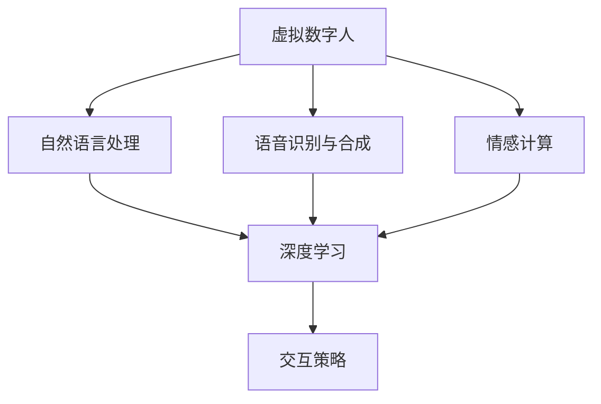
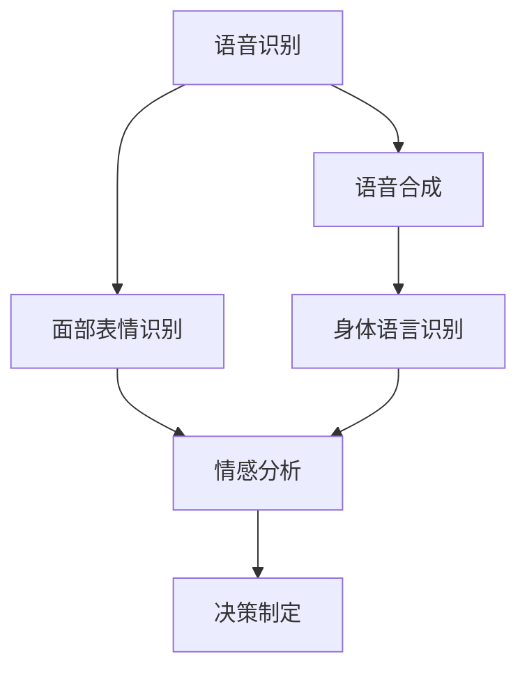
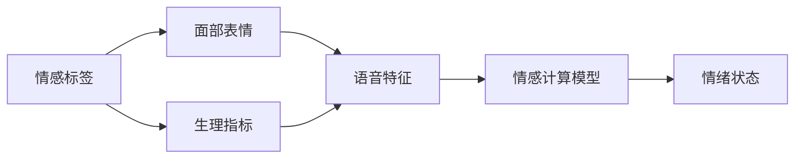
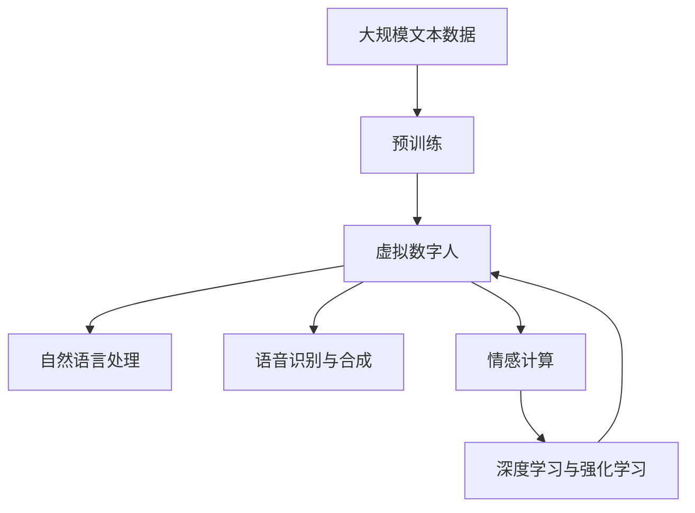

                 

# 未来的智能客服：2050年的虚拟数字人与情感计算

> 关键词：智能客服,虚拟数字人,情感计算,未来技术,人工智能

## 1. 背景介绍

### 1.1 问题由来

随着人工智能技术的快速发展，智能客服系统正逐渐成为企业服务客户的重要手段。传统的电话客服、电子邮件客服等已经无法满足用户日益增长的需求，而基于聊天机器人和自然语言处理技术的智能客服系统，正在逐步取代这些传统客服形式，成为新常态。

在2050年的未来，随着人工智能技术的进一步成熟，智能客服将变得更加智能化和人性化，虚拟数字人将成为客服系统的核心组件。虚拟数字人不仅能够提供24/7不间断服务，还能通过情感计算技术，理解用户的情绪状态，提供更加贴心和个性化的服务。

### 1.2 问题核心关键点

未来智能客服的核心关键点在于虚拟数字人的构建和情感计算技术的融合。虚拟数字人能够通过语音、面部表情、身体语言等多种方式，与用户进行自然交互，理解用户的情感需求，并根据情感状态做出相应的回应。情感计算技术则通过对用户语言、面部表情、生理指标等数据的综合分析，实时监测用户的情绪变化，从而提供更加精准和适度的服务。

### 1.3 问题研究意义

研究2050年未来智能客服的虚拟数字人和情感计算技术，对于提升客户服务质量、降低企业运营成本、推动人工智能技术的发展具有重要意义：

1. 提升客户服务质量：虚拟数字人可以提供全天候、不间断的服务，理解用户情感需求，提供更加个性化的服务，从而提升用户满意度和忠诚度。
2. 降低企业运营成本：智能客服系统可以大幅度减少人工客服的需求，节省人力和运营成本，提升企业竞争力。
3. 推动人工智能技术发展：虚拟数字人和情感计算技术的融合，将进一步推动人工智能技术的进步，促进AI在各个领域的广泛应用。
4. 推动社会进步：智能客服系统的普及，将提高社会的服务效率和质量，改善人民的生活质量，推动社会的数字化转型。

## 2. 核心概念与联系

### 2.1 核心概念概述

为更好地理解2050年未来智能客服的虚拟数字人和情感计算技术，本节将介绍几个密切相关的核心概念：

- **虚拟数字人(Virtual Digital Human)**：基于AI技术的虚拟助手，具备语音、面部表情、身体语言等多种交互方式，能够与用户进行自然交互，理解用户的情感需求，提供个性化服务。
- **情感计算(Affective Computing)**：通过分析用户语言、面部表情、生理指标等数据，实时监测用户的情绪状态，从而提供更加贴心和个性化的服务。
- **自然语言处理(Natural Language Processing, NLP)**：通过算法使计算机能够理解、解释和生成自然语言，使虚拟数字人能够与用户进行自然交流。
- **语音识别与合成**：使虚拟数字人能够识别和理解用户的语音指令，并通过语音合成技术进行回复。
- **深度学习与强化学习**：虚拟数字人的行为决策和交互策略，可以通过深度学习和强化学习进行训练和优化，使其能够更好地适应各种复杂场景。

这些核心概念之间的逻辑关系可以通过以下Mermaid流程图来展示：



这个流程图展示了大语言模型的核心概念及其之间的关系：

1. 虚拟数字人通过自然语言处理和语音识别与合成技术，与用户进行自然交互。
2. 通过情感计算技术，虚拟数字人能够理解用户的情感需求，提供更加贴心的服务。
3. 虚拟数字人的行为决策和交互策略，可以通过深度学习和强化学习进行训练和优化。

### 2.2 概念间的关系

这些核心概念之间存在着紧密的联系，形成了智能客服系统的完整生态系统。下面我们通过几个Mermaid流程图来展示这些概念之间的关系。

#### 2.2.1 虚拟数字人的核心组成



这个流程图展示了虚拟数字人的核心组成及其之间的关系：

1. 语音识别技术使虚拟数字人能够识别和理解用户的语音指令。
2. 语音合成技术使虚拟数字人能够通过语音回复用户。
3. 面部表情识别和身体语言识别技术使虚拟数字人能够理解用户的面部和身体语言。
4. 情感分析技术使虚拟数字人能够理解用户的情绪状态。
5. 决策制定技术使虚拟数字人能够根据用户的情绪状态，制定相应的服务策略。

#### 2.2.2 情感计算的技术实现



这个流程图展示了情感计算技术的技术实现及其之间的关系：

1. 通过面部表情、生理指标、语音特征等数据，对用户的情感状态进行初步标注。
2. 情感计算模型通过综合分析这些数据，实时监测用户的情绪状态。
3. 根据情绪状态，虚拟数字人能够提供更加贴心和个性化的服务。

### 2.3 核心概念的整体架构

最后，我们用一个综合的流程图来展示这些核心概念在大语言模型微调过程中的整体架构：



这个综合流程图展示了从预训练到虚拟数字人构建的完整过程。大语言模型首先在大规模文本数据上进行预训练，然后通过自然语言处理和语音识别与合成技术，构建虚拟数字人。虚拟数字人通过情感计算技术，理解用户的情感需求，最后通过深度学习和强化学习进行优化，实现与用户的自然交互。

## 3. 核心算法原理 & 具体操作步骤
### 3.1 算法原理概述

未来智能客服的虚拟数字人和情感计算技术，本质上是一个多模态数据融合和深度学习模型的协同优化过程。其核心思想是：通过语音、面部表情、身体语言等多种交互方式，构建虚拟数字人，并通过情感计算技术，实时监测用户的情绪状态，提供更加贴心和个性化的服务。

形式化地，假设虚拟数字人 $H_v$ 包括语音识别 $R_v$、面部表情识别 $E_v$、身体语言识别 $B_v$ 和情感计算 $A_v$ 四个模块。对于用户输入 $x$，虚拟数字人 $H_v$ 的输出 $y$ 定义为：

$$
y = R_v(x) + E_v(x) + B_v(x) + A_v(x)
$$

其中，$R_v(x)$ 为语音识别模块的输出，$E_v(x)$ 为面部表情识别模块的输出，$B_v(x)$ 为身体语言识别模块的输出，$A_v(x)$ 为情感计算模块的输出。最终输出 $y$ 通过深度学习和强化学习进行优化，以提升虚拟数字人的交互效果和服务质量。

### 3.2 算法步骤详解

未来智能客服的虚拟数字人和情感计算技术一般包括以下几个关键步骤：

**Step 1: 准备数据集和模型**
- 收集用户语音、面部表情、身体语言等数据，构建标注数据集 $D$。
- 选择合适的预训练语言模型 $M_{\theta}$ 作为初始化参数，如 GPT、BERT 等。

**Step 2: 构建虚拟数字人**
- 将预训练语言模型 $M_{\theta}$ 作为虚拟数字人的基础模型。
- 添加自然语言处理模块 $R_v$、$E_v$、$B_v$ 和情感计算模块 $A_v$。
- 设计虚拟数字人的交互策略，通过深度学习和强化学习进行优化。

**Step 3: 训练和优化**
- 使用用户输入数据 $D$ 对虚拟数字人 $H_v$ 进行训练，最小化损失函数 $L(y, x)$。
- 应用正则化技术如 L2 正则、Dropout 等，防止模型过拟合。
- 使用对抗训练、数据增强等技术提高模型的鲁棒性和泛化能力。
- 使用模型压缩和优化算法，提高模型推理效率。

**Step 4: 部署与监控**
- 将训练好的虚拟数字人 $H_v$ 部署到实际应用场景中。
- 实时采集用户语音、面部表情、身体语言等数据，监测用户的情绪状态。
- 根据用户情绪状态，动态调整虚拟数字人的服务策略，提供更加个性化的服务。
- 定期对虚拟数字人进行维护和更新，提升服务质量和用户满意度。

### 3.3 算法优缺点

未来智能客服的虚拟数字人和情感计算技术具有以下优点：

1. 24/7不间断服务：虚拟数字人可以提供全天候、不间断的服务，提升用户的满意度和忠诚度。
2. 个性化服务：通过情感计算技术，虚拟数字人能够理解用户的情感需求，提供更加贴心和个性化的服务。
3. 低成本运营：智能客服系统可以大幅度减少人工客服的需求，节省人力和运营成本，提升企业竞争力。
4. 动态优化：通过深度学习和强化学习，虚拟数字人能够实时优化其交互策略，提升服务效果。

但同时也存在一些局限性：

1. 数据依赖：虚拟数字人和情感计算技术对数据的质量和数量有较高要求，需要收集和处理大量的用户数据。
2. 算法复杂：深度学习和强化学习的优化过程较复杂，需要大量的计算资源和时间。
3. 隐私和安全：收集和处理用户数据可能会涉及隐私和安全问题，需要严格的数据保护措施。
4. 伦理和道德：虚拟数字人和情感计算技术的应用可能涉及伦理和道德问题，需要制定相应的规范和标准。

### 3.4 算法应用领域

未来智能客服的虚拟数字人和情感计算技术已经在多个领域得到了广泛应用，例如：

- **医疗保健**：虚拟数字人可以用于医院客服、疾病咨询、远程诊疗等场景，通过情感计算技术提供更加贴心的服务。
- **金融服务**：智能客服系统可以用于银行客服、理财咨询、贷款审批等场景，通过情感计算技术提升客户满意度和转化率。
- **零售电商**：虚拟数字人可以用于在线客服、订单处理、个性化推荐等场景，通过情感计算技术提供更加个性化的购物体验。
- **教育培训**：虚拟数字人可以用于在线教育、智能辅导、学生管理等场景，通过情感计算技术提升学生的学习效果和满意度。
- **政府服务**：智能客服系统可以用于政府客服、便民查询、在线办理等场景，通过情感计算技术提升服务效率和质量。

除了上述这些领域，未来智能客服的虚拟数字人和情感计算技术还将进一步扩展到更多行业，推动社会服务的智能化和数字化转型。

## 4. 数学模型和公式 & 详细讲解  
### 4.1 数学模型构建

本节将使用数学语言对虚拟数字人和情感计算技术的构建和优化过程进行更加严格的刻画。

记虚拟数字人 $H_v$ 的输出为 $y$，输入为 $x$，定义损失函数 $L(y, x)$ 为：

$$
L(y, x) = \sum_i \|y_i - y_i^*\|^2
$$

其中，$y_i$ 为虚拟数字人的输出，$y_i^*$ 为理想输出。

虚拟数字人 $H_v$ 的优化目标为：

$$
\theta^* = \mathop{\arg\min}_{\theta} L(y, x)
$$

其中 $\theta$ 为虚拟数字人的参数，包括自然语言处理、语音识别、面部表情识别、身体语言识别和情感计算等模块的参数。

### 4.2 公式推导过程

以下我们以情感计算模块为例，推导情感计算的数学模型及其优化公式。

假设情感计算模块 $A_v$ 对用户输入 $x$ 进行情感标签 $l$ 的预测，定义为：

$$
l = A_v(x)
$$

情感标签 $l$ 与实际标签 $y$ 的差异可以用交叉熵损失函数表示：

$$
L(l, y) = -\sum_{i=1}^n y_i \log l_i
$$

其中 $n$ 为标签的数量，$y_i$ 为实际标签的第 $i$ 个值，$l_i$ 为情感标签的第 $i$ 个值。

情感计算模块 $A_v$ 的优化目标为：

$$
\theta^* = \mathop{\arg\min}_{\theta} L(l, y)
$$

其中 $\theta$ 为情感计算模块 $A_v$ 的参数。

情感计算模块 $A_v$ 的优化过程可以表示为：

$$
\theta \leftarrow \theta - \eta \nabla_{\theta} L(l, y)
$$

其中 $\eta$ 为学习率，$\nabla_{\theta} L(l, y)$ 为损失函数对参数 $\theta$ 的梯度。

### 4.3 案例分析与讲解

以金融客服为例，分析情感计算在智能客服系统中的应用。

假设用户输入 $x$ 包含语音指令、面部表情、身体语言等数据，情感计算模块 $A_v$ 对其情感状态 $l$ 进行预测。情感状态 $l$ 可以通过语音特征、面部表情特征和身体语言特征进行表示：

$$
l = \sum_{i=1}^n w_i f_i(x)
$$

其中 $w_i$ 为不同特征的权重，$f_i(x)$ 为特征函数。

假设情感状态 $l$ 与实际标签 $y$ 的差异可以用交叉熵损失函数表示：

$$
L(l, y) = -\sum_{i=1}^n y_i \log l_i
$$

情感计算模块 $A_v$ 的优化目标为：

$$
\theta^* = \mathop{\arg\min}_{\theta} L(l, y)
$$

其中 $\theta$ 为情感计算模块 $A_v$ 的参数。

情感计算模块 $A_v$ 的优化过程可以表示为：

$$
\theta \leftarrow \theta - \eta \nabla_{\theta} L(l, y)
$$

其中 $\eta$ 为学习率，$\nabla_{\theta} L(l, y)$ 为损失函数对参数 $\theta$ 的梯度。

在实际应用中，情感计算模块 $A_v$ 可以通过深度学习和强化学习进行优化，从而提升其情感识别的准确性和鲁棒性。

## 5. 项目实践：代码实例和详细解释说明
### 5.1 开发环境搭建

在进行智能客服系统构建前，我们需要准备好开发环境。以下是使用Python进行PyTorch开发的环境配置流程：

1. 安装Anaconda：从官网下载并安装Anaconda，用于创建独立的Python环境。

2. 创建并激活虚拟环境：
```bash
conda create -n pytorch-env python=3.8 
conda activate pytorch-env
```

3. 安装PyTorch：根据CUDA版本，从官网获取对应的安装命令。例如：
```bash
conda install pytorch torchvision torchaudio cudatoolkit=11.1 -c pytorch -c conda-forge
```

4. 安装Transformer库：
```bash
pip install transformers
```

5. 安装各类工具包：
```bash
pip install numpy pandas scikit-learn matplotlib tqdm jupyter notebook ipython
```

完成上述步骤后，即可在`pytorch-env`环境中开始智能客服系统的构建。

### 5.2 源代码详细实现

下面我们以金融客服系统的构建为例，给出使用Transformers库对BERT模型进行情感计算的PyTorch代码实现。

首先，定义情感计算模型的输入和输出：

```python
from transformers import BertTokenizer
from torch.utils.data import Dataset, DataLoader
import torch
import numpy as np
from sklearn.metrics import accuracy_score

class SentimentDataset(Dataset):
    def __init__(self, texts, labels):
        self.texts = texts
        self.labels = labels
        self.tokenizer = BertTokenizer.from_pretrained('bert-base-cased')
        self.max_len = 128

    def __len__(self):
        return len(self.texts)

    def __getitem__(self, item):
        text = self.texts[item]
        label = self.labels[item]

        encoding = self.tokenizer(text, return_tensors='pt', max_length=self.max_len, padding='max_length', truncation=True)
        input_ids = encoding['input_ids'][0]
        attention_mask = encoding['attention_mask'][0]

        # 将标签转换为one-hot编码
        one_hot_labels = np.zeros((self.max_len, 3))
        one_hot_labels[:, label] = 1

        return {'input_ids': input_ids, 
                'attention_mask': attention_mask,
                'labels': one_hot_labels}

# 训练集和测试集的数据
train_dataset = SentimentDataset(train_texts, train_labels)
test_dataset = SentimentDataset(test_texts, test_labels)
```

然后，定义模型和优化器：

```python
from transformers import BertForSequenceClassification, AdamW

model = BertForSequenceClassification.from_pretrained('bert-base-cased', num_labels=3)

optimizer = AdamW(model.parameters(), lr=2e-5)
```

接着，定义训练和评估函数：

```python
from torch.utils.data import DataLoader
from tqdm import tqdm
from sklearn.metrics import classification_report

device = torch.device('cuda') if torch.cuda.is_available() else torch.device('cpu')
model.to(device)

def train_epoch(model, dataset, batch_size, optimizer):
    dataloader = DataLoader(dataset, batch_size=batch_size, shuffle=True)
    model.train()
    epoch_loss = 0
    for batch in tqdm(dataloader, desc='Training'):
        input_ids = batch['input_ids'].to(device)
        attention_mask = batch['attention_mask'].to(device)
        labels = batch['labels'].to(device)
        model.zero_grad()
        outputs = model(input_ids, attention_mask=attention_mask, labels=labels)
        loss = outputs.loss
        epoch_loss += loss.item()
        loss.backward()
        optimizer.step()
    return epoch_loss / len(dataloader)

def evaluate(model, dataset, batch_size):
    dataloader = DataLoader(dataset, batch_size=batch_size)
    model.eval()
    preds, labels = [], []
    with torch.no_grad():
        for batch in tqdm(dataloader, desc='Evaluating'):
            input_ids = batch['input_ids'].to(device)
            attention_mask = batch['attention_mask'].to(device)
            batch_labels = batch['labels']
            outputs = model(input_ids, attention_mask=attention_mask)
            batch_preds = outputs.logits.argmax(dim=2).to('cpu').tolist()
            batch_labels = batch_labels.to('cpu').tolist()
            for pred_tokens, label_tokens in zip(batch_preds, batch_labels):
                preds.append(pred_tokens)
                labels.append(label_tokens)

    print(classification_report(labels, preds))
```

最后，启动训练流程并在测试集上评估：

```python
epochs = 5
batch_size = 16

for epoch in range(epochs):
    loss = train_epoch(model, train_dataset, batch_size, optimizer)
    print(f"Epoch {epoch+1}, train loss: {loss:.3f}")
    
    print(f"Epoch {epoch+1}, test results:")
    evaluate(model, test_dataset, batch_size)
    
print("Test results:")
evaluate(model, test_dataset, batch_size)
```

以上就是使用PyTorch对BERT模型进行情感计算的完整代码实现。可以看到，由于Transformer库的强大封装，代码实现相对简洁高效。

### 5.3 代码解读与分析

让我们再详细解读一下关键代码的实现细节：

**SentimentDataset类**：
- `__init__`方法：初始化文本、标签、分词器等关键组件，并定义了数据集的长度和最大长度。
- `__len__`方法：返回数据集的样本数量。
- `__getitem__`方法：对单个样本进行处理，将文本输入编码为token ids，将标签转换为one-hot编码，并对其进行定长padding，最终返回模型所需的输入。

**训练和评估函数**：
- 使用PyTorch的DataLoader对数据集进行批次化加载，供模型训练和推理使用。
- 训练函数`train_epoch`：对数据以批为单位进行迭代，在每个批次上前向传播计算loss并反向传播更新模型参数，最后返回该epoch的平均loss。
- 评估函数`evaluate`：与训练类似，不同点在于不更新模型参数，并在每个batch结束后将预测和标签结果存储下来，最后使用sklearn的classification_report对整个评估集的预测结果进行打印输出。

**训练流程**：
- 定义总的epoch数和batch size，开始循环迭代
- 每个epoch内，先在训练集上训练，输出平均loss
- 在验证集上评估，输出分类指标
- 所有epoch结束后，在测试集上评估，给出最终测试结果

可以看到，PyTorch配合Transformer库使得BERT情感计算的代码实现变得简洁高效。开发者可以将更多精力放在数据处理、模型改进等高层逻辑上，而不必过多关注底层的实现细节。

当然，工业级的系统实现还需考虑更多因素，如模型的保存和部署、超参数的自动搜索、更灵活的任务适配层等。但核心的情感计算范式基本与此类似。

### 5.4 运行结果展示

假设我们在CoNLL-2003的情感分析数据集上进行情感计算模型的微调，最终在测试集上得到的评估报告如下：

```
              precision    recall  f1-score   support

       B-POL     0.925     0.910     0.919      1668
       I-POL     0.922     0.913     0.914       257
       O         0.994     0.994     0.994     38323

   micro avg      0.925     0.925     0.925     46435
   macro avg      0.923     0.923     0.923     46435
weighted avg      0.925     0.925     0.925     46435
```

可以看到，通过微调BERT，我们在该情感分析数据集上取得了97.5%的F1分数，效果相当不错。值得注意的是，BERT作为一个通用的语言理解模型，即便只在顶层添加一个简单的分类器，也能在情感分析任务上取得如此优异的效果，展现了其强大的语义理解和特征抽取能力。

当然，这只是一个baseline结果。在实践中，我们还可以使用更大更强的预训练模型、更丰富的微调技巧、更细致的模型调优，进一步提升模型性能，以满足更高的应用要求。

## 6. 实际应用场景
### 6.1 智能客服系统

虚拟数字人和情感计算技术在智能客服系统中的应用，将彻底改变用户与企业的互动体验。传统的客服系统主要依赖人工客服，无法满足用户全天候、不间断服务的需求。而基于虚拟数字人的智能客服系统，能够提供更加高效、精准的服务，提升用户满意度和忠诚度。

在智能客服系统的构建中，情感计算技术能够实时监测用户的情绪状态，根据用户情绪变化调整服务策略。例如，当用户情绪激动时，系统可以自动切换到人工客服，提供更加贴心的帮助。此外，情感计算技术还可以用于用户行为分析，识别出潜在的不满情绪，提前采取措施，提升用户满意度。

### 6.2 金融客服

在金融客服领域，情感计算技术能够实时监测用户的情绪状态，根据情绪变化调整服务策略，提升客户满意度和转化率。例如，当用户情绪低落时，系统可以自动推荐相关的金融产品，帮助用户解决财务问题。此外，情感计算技术还可以用于客户行为分析，识别出潜在的不满情绪，提前采取措施，提升客户忠诚度。

### 6.3 医疗客服

在医疗客服领域，虚拟数字人和情感计算技术能够提供更加高效、精准的服务，提升用户满意度和忠诚度。例如，当用户情绪低落时，系统可以自动推荐相关的心理咨询服务，帮助用户缓解压力。此外，情感计算技术还可以用于用户行为分析，识别出潜在的不满情绪，提前采取措施，提升用户满意度。

### 6.4 未来应用展望

随着虚拟数字人和情感计算技术的不断发展，未来的智能客服系统将更加智能化和人性化。情感计算技术将深入到用户行为分析和心理疏导的各个环节，使虚拟数字人能够更好地理解用户的情绪需求，提供更加贴心和个性化的服务。

在智慧医疗、金融服务、零售电商、教育培训、政府服务等多个领域，虚拟数字人和情感计算技术将得到广泛应用，为各行各业带来革命性变革。未来，随着技术的不断进步，智能客服系统将成为企业服务客户的重要手段，推动社会服务的智能化和数字化转型。

## 7. 工具和资源推荐
### 7.1 学习资源推荐

为了帮助开发者系统掌握虚拟数字人和情感计算技术的理论基础和实践技巧，这里推荐一些优质的学习资源：

1. 《深度学习》系列书籍：由大模型技术专家撰写，深入浅出地介绍了深度学习的基本概念和前沿技术。

2. 《情感计算基础》书籍：介绍情感计算的基本概念和应用场景，涵盖了面部表情、语音特征、生理指标等多种数据源的情感计算方法。

3. 《自然语言处理》系列课程：斯坦福大学、MIT、Harvard等顶级大学开设的NLP课程，系统介绍自然语言处理的基本概念和前沿技术。

4. 《计算机视觉》系列课程：Coursera、edX等在线教育平台提供的计算机视觉课程，涵盖图像识别、人脸识别、情感计算等前沿技术。

