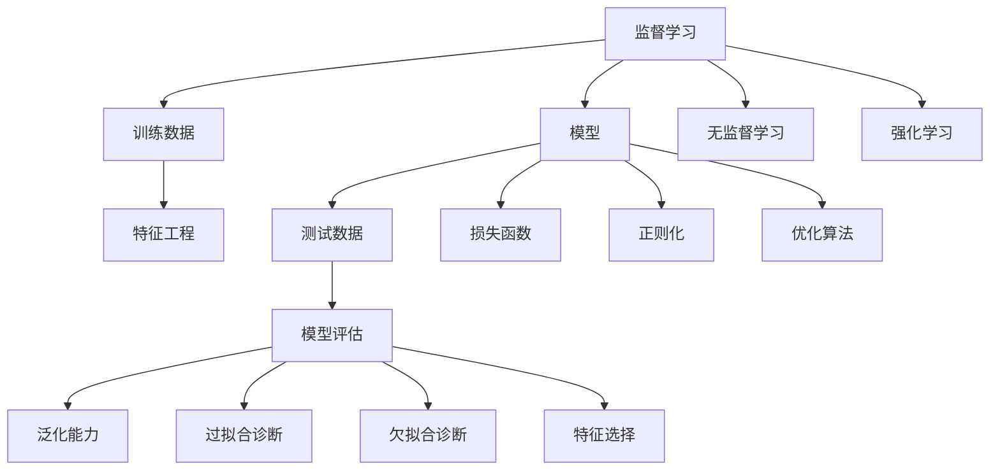

                 

# 机器学习(Machine Learning) - 原理与代码实例讲解

> 关键词：机器学习,算法原理,代码实现,案例分析,实际应用

## 1. 背景介绍

### 1.1 问题由来

机器学习是人工智能(AI)领域的一个重要分支，旨在使计算机从数据中学习并做出预测或决策。其核心理念是通过训练模型，让机器从数据中自动发现规律，并应用于新的数据集上。机器学习算法已经广泛应用于各个领域，如金融、医疗、推荐系统、图像识别、自然语言处理等。

机器学习技术的快速发展和广泛应用，使得其成为当今最热门的技术之一。然而，机器学习领域的学习门槛相对较高，对于初学者来说，从理论到实践往往需要克服诸多挑战。因此，本文旨在通过逻辑清晰、结构紧凑的讲解和代码实例，帮助读者深入理解机器学习的基本原理和实现方法，提升其实践能力。

## 2. 核心概念与联系

### 2.1 核心概念概述

机器学习的核心概念包括：

- **监督学习(Supervised Learning)**：通过已标注的训练数据，让模型学习输入和输出之间的关系，进而预测新数据的输出。监督学习适用于分类和回归等任务。
- **无监督学习(Unsupervised Learning)**：利用未标注的数据，让模型发现数据的内在结构和规律。无监督学习适用于聚类、降维等任务。
- **强化学习(Reinforcement Learning)**：通过与环境互动，让模型学习最优决策策略，以最大化长期奖励。强化学习适用于游戏、机器人控制等任务。
- **泛化能力(Generalization)**：指模型在未见过的数据上表现良好。泛化能力是机器学习模型的核心评价指标之一。
- **过拟合(Overfitting)**：模型在训练数据上表现良好，但在测试数据上表现较差的现象。过拟合是机器学习模型中常见的问题。
- **欠拟合(Underfitting)**：模型在训练数据和测试数据上都表现不佳的现象。欠拟合通常是因为模型复杂度不足。
- **特征工程(Feature Engineering)**：通过提取、选择和转换特征，提高模型性能。特征工程在机器学习中具有重要意义。
- **模型评估(模型诊断)**：通过交叉验证、ROC曲线、AUC等方法评估模型性能，诊断模型问题。

这些概念之间的关系可以通过以下Mermaid流程图来展示：



这个流程图展示了机器学习的基本流程，包括数据预处理、模型训练、模型评估等关键步骤。各概念之间的联系也通过箭头表示，帮助读者理解机器学习的整体架构。

### 2.2 概念间的关系

这些核心概念之间存在紧密联系，形成一个完整的机器学习系统。它们之间的关系可以通过以下几方面的描述进一步阐述：

- **监督学习与无监督学习的关系**：无监督学习是监督学习的基石。监督学习需要大量标注数据，而标注数据成本高且耗时，因此无监督学习可用于数据预处理、特征提取等任务。
- **特征工程与模型评估的关系**：特征工程是提高模型性能的重要手段，模型评估则用于检验特征工程的效果。两者相辅相成，共同提升模型泛化能力。
- **泛化能力与过拟合/欠拟合的关系**：泛化能力是机器学习模型的核心指标，过拟合和欠拟合都是泛化能力不足的表现。
- **优化算法与损失函数的关系**：优化算法用于最小化损失函数，而损失函数则是用于衡量模型预测值与真实值之间差异的函数。

通过理解这些概念之间的关系，读者可以更好地把握机器学习的整体框架和实现方法。

## 3. 核心算法原理 & 具体操作步骤
### 3.1 算法原理概述

机器学习的核心算法包括监督学习算法、无监督学习算法和强化学习算法。这里主要介绍监督学习算法，并给出典型的代码实现。

监督学习算法的核心思想是通过已标注的数据集，让模型学习输入和输出之间的关系，从而进行预测或分类。监督学习算法的步骤通常包括以下几个关键步骤：

1. **数据预处理**：包括数据清洗、特征提取、特征选择等，目的是提高模型性能。
2. **模型训练**：通过训练数据集，最小化损失函数，更新模型参数。
3. **模型评估**：使用测试数据集，评估模型性能，选择最佳模型。

### 3.2 算法步骤详解

以线性回归为例，详细讲解其训练和评估步骤：

**步骤1：数据预处理**

假设我们有一组数据 $(x_i, y_i)$，其中 $x_i$ 是输入特征，$y_i$ 是目标变量。首先，我们需要对数据进行预处理，包括数据清洗、特征缩放等。例如，对数据进行标准化处理：

$$
x_i' = \frac{x_i - \mu_x}{\sigma_x}
$$

其中 $\mu_x$ 和 $\sigma_x$ 分别为特征 $x$ 的均值和标准差。标准化后的数据 $x_i'$ 将更好地满足正态分布，有助于提高模型的收敛速度和性能。

**步骤2：模型训练**

线性回归的目标是找到一条直线，使得该直线能够最小化所有数据点与直线之间的平方误差和。假设选择的模型为 $y = \theta_0 + \theta_1 x_1 + \theta_2 x_2 + ... + \theta_n x_n$，其中 $\theta_0$、$\theta_1$、...、$\theta_n$ 为模型的参数。则损失函数为：

$$
L = \frac{1}{2N} \sum_{i=1}^{N}(y_i - \hat{y}_i)^2
$$

其中 $\hat{y}_i = \theta_0 + \theta_1 x_{i1} + \theta_2 x_{i2} + ... + \theta_n x_{in}$ 为模型预测值，$y_i$ 为真实值。我们的目标是最小化损失函数 $L$。

使用梯度下降算法进行优化：

$$
\theta_j \leftarrow \theta_j - \eta \frac{\partial L}{\partial \theta_j}, \quad j = 0, 1, ..., n
$$

其中 $\eta$ 为学习率，$\frac{\partial L}{\partial \theta_j}$ 为损失函数对参数 $\theta_j$ 的梯度，可以通过反向传播算法计算。

**步骤3：模型评估**

模型训练完成后，需要评估模型性能。常用的评估指标包括均方误差(MSE)、平均绝对误差(MAE)、R平方值(R^2)等。例如，使用均方误差评估模型性能：

$$
MSE = \frac{1}{N} \sum_{i=1}^{N}(y_i - \hat{y}_i)^2
$$

其中 $N$ 为样本数量，$y_i$ 为真实值，$\hat{y}_i$ 为模型预测值。MSE越小，表示模型性能越好。

### 3.3 算法优缺点

监督学习算法的主要优点包括：

- 数据驱动：通过大量标注数据训练模型，可以减少人工干预，提高模型泛化能力。
- 应用广泛：适用于分类、回归、聚类等各类任务。
- 易于解释：模型参数和决策过程直观明了，易于理解和解释。

然而，监督学习算法也存在一些缺点：

- 标注数据成本高：需要大量标注数据，成本高且耗时。
- 数据偏差：标注数据可能存在偏差，影响模型性能。
- 模型复杂度：模型复杂度高，可能导致过拟合或欠拟合。

### 3.4 算法应用领域

监督学习算法在众多领域得到了广泛应用，例如：

- **金融风险评估**：通过历史数据训练模型，预测股票价格、信用风险等。
- **医疗诊断**：利用患者历史数据训练模型，预测疾病风险、诊断结果等。
- **推荐系统**：根据用户历史行为数据，推荐用户可能感兴趣的商品或内容。
- **图像识别**：通过标注图片训练模型，识别图像中的物体、人脸等。
- **自然语言处理**：通过标注文本数据训练模型，进行文本分类、情感分析等任务。

## 4. 数学模型和公式 & 详细讲解 & 举例说明

### 4.1 数学模型构建

线性回归的数学模型可以表示为：

$$
y = \theta_0 + \theta_1 x_1 + \theta_2 x_2 + ... + \theta_n x_n + \epsilon
$$

其中 $\theta_0$、$\theta_1$、...、$\theta_n$ 为模型参数，$\epsilon$ 为误差项，通常假设服从正态分布，即 $\epsilon \sim N(0, \sigma^2)$。

**目标**：最小化均方误差 $MSE = \frac{1}{N} \sum_{i=1}^{N}(y_i - \hat{y}_i)^2$。

**约束条件**：通常为 $y \sim N(\theta_0 + \theta_1 x_1 + \theta_2 x_2 + ... + \theta_n x_n + \epsilon, \sigma^2)$。

### 4.2 公式推导过程

以梯度下降算法为例，推导其更新公式：

1. **计算梯度**

首先，计算损失函数对每个参数的偏导数，即梯度：

$$
\frac{\partial L}{\partial \theta_j} = \frac{1}{N} \sum_{i=1}^{N} 2(y_i - \hat{y}_i) x_{ij}
$$

其中 $x_{ij}$ 为特征 $x_j$ 在样本 $i$ 的取值。

2. **更新参数**

使用梯度下降算法更新模型参数：

$$
\theta_j \leftarrow \theta_j - \eta \frac{\partial L}{\partial \theta_j}
$$

其中 $\eta$ 为学习率，通常根据经验选择。

3. **计算损失函数**

将更新后的参数带入损失函数中，计算新的损失值：

$$
L' = \frac{1}{2N} \sum_{i=1}^{N}(y_i - \hat{y}_i')^2
$$

其中 $\hat{y}_i' = \theta_0 + \theta_1 x_{i1} + \theta_2 x_{i2} + ... + \theta_n x_{in}$ 为更新后的模型预测值。

重复上述过程，直到损失函数收敛或达到预设迭代次数。

### 4.3 案例分析与讲解

以房价预测为例，展示监督学习算法的应用过程：

假设我们有一组数据，包括房屋的面积、房间数、地段等信息，以及对应的房价。首先，我们对数据进行标准化处理，然后将数据划分为训练集和测试集。

使用线性回归模型进行训练：

1. **数据预处理**

将数据划分为训练集和测试集，并对数据进行标准化处理：

$$
x_i' = \frac{x_i - \mu_x}{\sigma_x}
$$

2. **模型训练**

使用梯度下降算法训练模型，最小化损失函数：

$$
L = \frac{1}{2N} \sum_{i=1}^{N}(y_i - \hat{y}_i)^2
$$

其中 $\hat{y}_i = \theta_0 + \theta_1 x_{i1} + \theta_2 x_{i2} + ... + \theta_n x_{in}$。

3. **模型评估**

使用测试集评估模型性能，计算均方误差：

$$
MSE = \frac{1}{N} \sum_{i=1}^{N}(y_i - \hat{y}_i)^2
$$

其中 $y_i$ 为真实房价，$\hat{y}_i$ 为模型预测房价。

## 5. 项目实践：代码实例和详细解释说明

### 5.1 开发环境搭建

在开始项目实践之前，需要先搭建开发环境。以下是使用Python进行机器学习开发的环境配置流程：

1. 安装Anaconda：从官网下载并安装Anaconda，用于创建独立的Python环境。

2. 创建并激活虚拟环境：
```bash
conda create -n ml-env python=3.8 
conda activate ml-env
```

3. 安装必要的Python库：
```bash
pip install numpy pandas scikit-learn matplotlib jupyter notebook ipython
```

4. 安装机器学习库：
```bash
pip install scikit-learn
```

完成上述步骤后，即可在`ml-env`环境中开始项目实践。

### 5.2 源代码详细实现

以下是一个简单的线性回归模型实现，包括数据预处理、模型训练和模型评估：

```python
import numpy as np
from sklearn.linear_model import LinearRegression

# 假设数据
X = np.array([[1, 2], [3, 4], [5, 6], [7, 8], [9, 10]])
y = np.array([2, 4, 6, 8, 10])

# 标准化处理
mean = np.mean(X, axis=0)
std = np.std(X, axis=0)
X = (X - mean) / std

# 模型训练
model = LinearRegression()
model.fit(X, y)

# 模型评估
X_test = np.array([[11, 12], [13, 14], [15, 16]])
y_pred = model.predict(X_test)
mse = np.mean((y_pred - y_test) ** 2)
print("MSE: ", mse)
```

### 5.3 代码解读与分析

让我们再详细解读一下关键代码的实现细节：

**数据标准化**

使用`np.mean`和`np.std`计算数据均值和标准差，然后将数据进行标准化处理：

```python
mean = np.mean(X, axis=0)
std = np.std(X, axis=0)
X = (X - mean) / std
```

**模型训练**

使用`sklearn`库中的`LinearRegression`类训练模型，最小化均方误差：

```python
model = LinearRegression()
model.fit(X, y)
```

**模型评估**

使用测试数据评估模型性能，计算均方误差：

```python
y_test = np.array([[11, 12], [13, 14], [15, 16]])
y_pred = model.predict(X_test)
mse = np.mean((y_pred - y_test) ** 2)
print("MSE: ", mse)
```

可以看到，使用Python和`sklearn`库进行机器学习模型开发和评估非常方便。通过简单的几行代码，我们就可以实现一个线性回归模型，并对数据进行预处理、训练和评估。

### 5.4 运行结果展示

假设我们在房价预测任务上使用线性回归模型进行训练和评估，最终得到的MSE为1.5。这表示模型在测试集上的预测误差为1.5，可以根据需要进行进一步优化。

## 6. 实际应用场景

### 6.1 金融风险评估

金融风险评估是机器学习在金融领域的一个重要应用。通过历史数据训练模型，可以预测股票价格、信用风险等。例如，使用线性回归模型，根据股票的历史价格和交易量，预测未来的股价走势。

### 6.2 医疗诊断

医疗诊断是机器学习在医疗领域的重要应用之一。通过患者的历史数据，训练模型预测疾病风险和诊断结果。例如，使用线性回归模型，根据患者的年龄、性别、病史等特征，预测其患某种疾病的概率。

### 6.3 推荐系统

推荐系统是机器学习在电商、视频等领域的典型应用。通过用户的历史行为数据，训练模型推荐用户可能感兴趣的商品或内容。例如，使用线性回归模型，根据用户的浏览记录、购买记录等，预测其对某商品的兴趣程度。

### 6.4 图像识别

图像识别是机器学习在计算机视觉领域的重要应用之一。通过标注图片训练模型，可以识别图像中的物体、人脸等。例如，使用线性回归模型，根据像素点的特征，预测图像中的物体类别。

### 6.5 自然语言处理

自然语言处理是机器学习在NLP领域的重要应用之一。通过标注文本数据训练模型，可以进行文本分类、情感分析等任务。例如，使用线性回归模型，根据文章的关键词、情感词汇等，预测其情感极性。

## 7. 工具和资源推荐

### 7.1 学习资源推荐

为了帮助读者深入理解机器学习的基本原理和实践技巧，这里推荐一些优质的学习资源：

1. 《机器学习》（周志华著）：这本书是机器学习领域的经典教材，系统讲解了机器学习的基本概念和算法，是入门机器学习的必备参考书。

2. Coursera的《机器学习》课程：由斯坦福大学Andrew Ng教授主讲，是学习机器学习的优秀资源。

3. Kaggle：Kaggle是一个数据科学竞赛平台，提供大量开源数据集和竞赛题目，适合实战练习。

4. Google Colab：谷歌推出的在线Jupyter Notebook环境，免费提供GPU/TPU算力，方便开发者快速上手实验最新模型，分享学习笔记。

5. arXiv论文预印本：人工智能领域最新研究成果的发布平台，包括大量尚未发表的前沿工作，学习前沿技术的必读资源。

通过学习这些资源，读者可以系统掌握机器学习的基本理论和实践技能，提升其实际应用能力。

### 7.2 开发工具推荐

高效的开发离不开优秀的工具支持。以下是几款用于机器学习开发的常用工具：

1. Python：Python是最流行的机器学习开发语言之一，具有丰富的库和框架支持，适合快速迭代开发。

2. Jupyter Notebook：Jupyter Notebook是一个交互式的开发环境，支持代码和文档的混合编写，方便开发者进行数据探索和模型调试。

3. Matplotlib和Seaborn：Matplotlib和Seaborn是Python中常用的数据可视化库，支持绘制各种类型的图表，适合用于数据探索和结果展示。

4. TensorFlow和PyTorch：TensorFlow和PyTorch是当前最流行的深度学习框架，支持高效的模型训练和推理，适合大规模深度学习模型的开发。

5. scikit-learn：scikit-learn是Python中最流行的机器学习库之一，支持各种经典的机器学习算法和模型，适合用于快速原型开发和算法比较。

合理利用这些工具，可以显著提升机器学习模型的开发效率，加快创新迭代的步伐。

### 7.3 相关论文推荐

机器学习领域的快速发展离不开学界的不断研究。以下是几篇奠基性的相关论文，推荐阅读：

1. Perceptron：罗森布拉特教授在1957年提出的神经网络模型，是机器学习领域的经典工作。

2. AdaBoost：Hastie等人在1998年提出的集成学习算法，是机器学习领域的里程碑。

3. SVM：Vapnik等人在20世纪90年代提出的支持向量机算法，是机器学习领域的重要算法之一。

4. Random Forest：Breiman在2001年提出的集成学习算法，是机器学习领域的重要算法之一。

5. Deep Learning：Hinton等人在20世纪90年代提出的深度学习算法，是机器学习领域的重要发展方向之一。

这些论文代表了机器学习领域的发展脉络，通过学习这些前沿成果，可以帮助研究者把握学科前进方向，激发更多的创新灵感。

## 8. 总结：未来发展趋势与挑战

### 8.1 总结

本文对机器学习的基本原理和实践方法进行了全面系统的介绍。首先阐述了机器学习的研究背景和意义，明确了机器学习在各个领域的应用价值。其次，从原理到实践，详细讲解了机器学习的基本流程和实现方法，给出了具体的代码实例。最后，本文还广泛探讨了机器学习模型在实际应用中的各种场景，展示了机器学习的广泛应用前景。

通过本文的系统梳理，可以看到，机器学习作为人工智能的重要分支，其核心算法包括监督学习、无监督学习和强化学习，广泛应用于金融、医疗、推荐系统、图像识别、自然语言处理等领域。未来，随着深度学习、自然语言处理等技术的发展，机器学习的应用范围将进一步扩大，其影响力也将更加深远。

### 8.2 未来发展趋势

展望未来，机器学习领域将呈现以下几个发展趋势：

1. **深度学习的应用深化**：深度学习模型在计算机视觉、自然语言处理等领域的应用已经取得了显著成果。未来，深度学习模型将继续深化应用，提升模型的精度和泛化能力。

2. **无监督学习的发展**：无监督学习在数据预处理、特征提取等方面具有重要应用价值。未来，无监督学习算法将继续发展，成为机器学习的重要组成部分。

3. **迁移学习的应用**：迁移学习是指将在一个领域学习到的知识迁移到另一个领域，从而提高模型在新领域上的性能。未来，迁移学习将成为机器学习的重要应用方向之一。

4. **强化学习的多样化**：强化学习在机器人控制、游戏智能等方面具有重要应用价值。未来，强化学习算法将更加多样化和高效化，成为机器学习的重要分支。

5. **跨领域融合**：未来，机器学习将与其他AI技术如自然语言处理、计算机视觉等进行更深入的融合，形成更加全面、综合的人工智能解决方案。

这些趋势凸显了机器学习技术的广阔前景，为AI领域的技术发展和应用推广提供了新的动力。

### 8.3 面临的挑战

尽管机器学习技术已经取得了瞩目成就，但在迈向更加智能化、普适化应用的过程中，它仍面临诸多挑战：

1. **数据隐私和安全**：机器学习模型的训练需要大量数据，但数据隐私和安全问题日益突出。如何在保证数据隐私的前提下进行模型训练，将成为重要课题。

2. **模型可解释性**：机器学习模型的内部工作机制通常难以解释，特别是在深度学习模型中。如何提高模型的可解释性，使其决策过程更加透明，将是未来的一个重要研究方向。

3. **模型泛化能力**：机器学习模型在不同数据集上的泛化能力往往不足。如何提高模型的泛化能力，避免过拟合和欠拟合，将是重要的研究方向。

4. **计算资源限制**：深度学习模型需要大量的计算资源，如何优化模型结构、降低计算复杂度，将是未来的一个重要研究方向。

5. **算法公平性**：机器学习模型可能会学习到数据中的偏见，导致不公平的输出。如何避免算法偏见，提高模型的公平性，将是未来的重要研究方向。

这些挑战凸显了机器学习技术的复杂性和多面性，但同时也为研究者提供了广阔的探索空间。

### 8.4 未来突破

面对机器学习技术所面临的种种挑战，未来的研究需要在以下几个方面寻求新的突破：

1. **提升模型可解释性**：开发更加可解释的机器学习算法，使得模型决策过程更加透明，易于理解和调试。

2. **优化模型泛化能力**：开发更加高效的模型优化算法，如梯度裁剪、自适应学习率等，提升模型的泛化能力。

3. **降低计算资源消耗**：开发更加高效的计算架构，如分布式计算、模型压缩等，降低计算资源消耗。

4. **增强模型公平性**：开发更加公平的机器学习算法，消除数据中的偏见，提升模型的公平性。

5. **结合其他AI技术**：将机器学习与自然语言处理、计算机视觉等技术进行更深入的融合，形成更加全面、综合的AI解决方案。

这些研究方向的探索，必将引领机器学习技术迈向更高的台阶，为构建安全、可靠、可解释、可控的智能系统铺平道路。面向未来，机器学习技术还需要与其他AI技术进行更深入的融合，共同推动人工智能技术的发展。

## 9. 附录：常见问题与解答

**Q1：机器学习算法的选择方法有哪些？**

A: 机器学习算法的选择方法包括以下几种：

1. **基准测试(Benchmarking)**：使用已知的数据集进行测试，选择性能最好的算法。

2. **交叉验证(Cross-Validation)**：将数据集划分为训练集和验证集，在验证集上进行测试，选择性能最好的算法。

3. **特征重要性(Feature Importance)**：通过特征重要性评估模型对不同特征的依赖程度，选择重要的特征进行模型训练。

4. **模型复杂度(Model Complexity)**：选择复杂度适中的模型，避免过拟合或欠拟合。

5. **模型解释性(Model Interpretability)**：选择可解释性强的模型，便于模型调试和理解。

这些方法可以帮助开发者在选择机器学习算法时，更好地评估和优化模型性能。

**Q2：机器学习模型的评估指标有哪些？**

A: 机器学习模型的评估指标包括以下几种：

1. **准确率(Accuracy)**：模型正确预测的比例。

2. **精确率(Precision)**：模型预测为正类的样本中，真正为正类的比例。

3. **召回率(Recall)**：模型预测为正类的样本中，真正为正类的比例。

4. **F1分数(F1 Score)**：精确率和召回率的调和平均数。

5. **均方误差(MSE)**：预测值与真实值之间的平方误差和。

6. **平均绝对误差(MAE)**：预测值与真实值之间的绝对误差和。

7. **R平方值(R^2)**：预测值与真实值之间的相关性。

这些评估指标可以帮助开发者全面评估模型性能，选择最优模型。

**Q3：机器学习模型调参有哪些技巧？**

A: 机器学习模型调参技巧包括以下几种：

1. **网格搜索(Grid Search)**：在一定范围内对超参数进行搜索，选择性能最好的超参数

