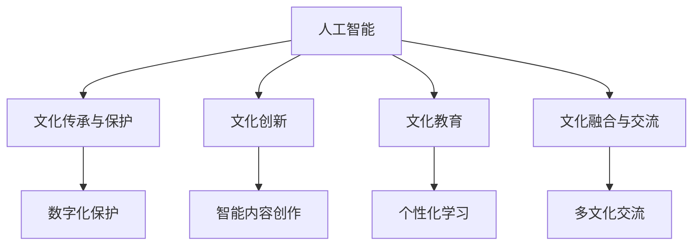

                 

# 李开复：AI 2.0 时代的文化价值

> 关键词：人工智能,文化价值,教育,伦理,创新,未来

## 1. 背景介绍

### 1.1 问题由来

在人工智能(AI)技术飞速发展的今天，AI 2.0时代正悄然到来。AI 2.0不仅代表着更高效、更精准、更自动化的技术应用，更深刻地影响着人类社会的方方面面，从教育、医疗到娱乐、生活。AI 2.0的普及和发展，使得人类社会正逐渐步入一个由机器与人类共同塑造的新纪元。

在这个变革的过程中，文化价值，即人类的精神文明与智慧的积累和传承，也面临着前所未有的挑战与机遇。如何在这个崭新的时代，保护和传承文化价值，同时利用AI 2.0技术推动文化创新，成为每一个关心文化与科技未来的人们必须深思的问题。

### 1.2 问题核心关键点

1. **文化传承与保护**：AI 2.0技术如何助力文化价值的保护与传承？
2. **文化创新与变革**：AI 2.0在推动文化创新中扮演了什么角色？
3. **文化伦理与责任**：AI 2.0技术在应用中如何确保文化伦理与道德责任？
4. **文化融合与交流**：AI 2.0如何促进不同文化间的交流与融合？
5. **文化教育与学习**：AI 2.0技术在教育领域中的应用与创新有哪些？

### 1.3 问题研究意义

AI 2.0时代的文化价值研究，对于保护和传承人类文化遗产、推动文化创新、提升文化教育水平具有重要意义。

1. **保护与传承**：AI 2.0技术的强大能力可以帮助我们更好地保存和传承人类的文化遗产，使得珍稀的文化遗产得以数字化、智能化保存。
2. **创新与变革**：AI 2.0为文化创新提供了新的工具与方法，使得文化的传承与创新可以更加高效、智能。
3. **教育与学习**：AI 2.0在教育领域的应用，可以极大地提升学习效率，丰富学习内容，推动教育公平，使更多人能够接触到优质的文化资源。
4. **伦理与责任**：AI 2.0技术的广泛应用，使得文化伦理与道德责任成为必须面对的重要课题，需要明确技术应用的边界，确保文化价值的尊重与保护。
5. **融合与交流**：AI 2.0为不同文化间的交流与融合提供了新的平台，使得文化多样性得以更好地展现与传播。

## 2. 核心概念与联系

### 2.1 核心概念概述

- **人工智能(AI)**：使用算法和计算技术，使计算机系统能够模拟人类的认知、判断、决策等智能行为。
- **文化价值**：指人类社会在历史长河中积累的文化遗产、价值观念、行为规范等，是人类智慧的结晶。
- **文化创新**：在尊重和保护文化价值的基础上，利用AI 2.0技术，推动文化的传承与创新。
- **文化伦理与责任**：在使用AI 2.0技术时，如何确保技术的伦理性和道德责任，保护文化价值。
- **文化教育**：利用AI 2.0技术，提高教育效率，丰富教育内容，推动教育公平。
- **文化融合与交流**：通过AI 2.0技术，促进不同文化间的交流与融合，推动全球文化共同体建设。

### 2.2 概念间的关系

以上概念通过以下Mermaid流程图进行展示，帮助理解它们之间的联系和作用机制：



这个流程图展示了AI 2.0技术在不同文化领域中的应用，从而保护与传承文化价值，推动文化创新，提升文化教育水平，促进文化融合与交流。

## 3. 核心算法原理 & 具体操作步骤

### 3.1 算法原理概述

AI 2.0时代，文化价值保护与传承、创新与变革、伦理与责任、教育与学习、融合与交流等方面，都可以通过AI 2.0技术进行高效的实现。算法原理主要包括：

- **数据采集与预处理**：采集不同领域、不同文化背景的数据，进行清洗、标注、分类等预处理。
- **模型训练与优化**：使用深度学习、自然语言处理等技术，训练出高效的模型，并进行参数优化。
- **模型部署与应用**：将训练好的模型部署到应用环境中，进行实时处理、推理等操作。

### 3.2 算法步骤详解

#### 3.2.1 数据采集与预处理

1. **数据来源**：选择与文化价值相关的数据来源，如历史文献、艺术作品、非物质文化遗产、文化活动等。
2. **数据清洗**：去除噪声数据、缺失值，处理文本数据的分词、纠错等。
3. **数据标注**：对数据进行标注，如文本分类、情感分析、实体识别等。
4. **数据分集**：将数据分为训练集、验证集和测试集，进行模型的训练与评估。

#### 3.2.2 模型训练与优化

1. **模型选择**：根据任务需求选择合适的模型架构，如卷积神经网络(CNN)、循环神经网络(RNN)、Transformer等。
2. **模型训练**：使用深度学习框架，如TensorFlow、PyTorch等，训练模型。
3. **参数优化**：使用优化算法，如Adam、SGD等，优化模型参数。
4. **模型评估**：在测试集上评估模型性能，使用准确率、召回率、F1分数等指标。

#### 3.2.3 模型部署与应用

1. **模型部署**：将训练好的模型部署到服务器、移动端等应用环境。
2. **实时处理**：利用API接口，实现实时处理、推理等操作。
3. **监控与反馈**：实时监控模型性能，根据反馈调整模型参数，持续优化模型。

### 3.3 算法优缺点

**优点**：
- **高效性**：AI 2.0技术能够高效处理大量数据，提升文化价值保护的效率。
- **精准性**：AI 2.0模型能够在复杂环境下精准识别和处理文化数据。
- **创新性**：AI 2.0技术可以推动文化内容的智能创作、个性化学习等创新应用。
- **普适性**：AI 2.0技术具有广泛的适用性，可以应用于不同领域、不同文化背景。

**缺点**：
- **数据依赖**：AI 2.0技术依赖高质量的数据，数据缺失或噪声会影响模型性能。
- **伦理问题**：AI 2.0技术在应用过程中，可能面临伦理与道德问题。
- **技术复杂**：AI 2.0技术的实现需要较高的技术门槛，需要专业知识。
- **资源消耗**：AI 2.0技术的应用需要大量的计算资源和存储空间。

### 3.4 算法应用领域

AI 2.0技术在文化价值保护与传承、创新与变革、伦理与责任、教育与学习、融合与交流等方面具有广泛的应用前景：

1. **数字化保护**：通过AI 2.0技术，对文物、艺术作品等进行数字化保存，实现长期保护。
2. **智能创作**：利用AI 2.0技术，进行文化内容的智能创作，如文本生成、音乐创作、图像生成等。
3. **个性化学习**：使用AI 2.0技术，进行个性化文化教育，提供定制化的学习内容。
4. **多文化交流**：通过AI 2.0技术，促进不同文化间的交流与融合，推动全球文化共同体建设。
5. **文化保护与传承**：利用AI 2.0技术，进行文化遗产的智能识别、修复与保护。

## 4. 数学模型和公式 & 详细讲解 & 举例说明

### 4.1 数学模型构建

#### 4.1.1 文本分类模型

以文本分类模型为例，构建数学模型：

设文本数据为 $X$，标签为 $y$，模型为 $M$，损失函数为 $L$，优化器为 $Opt$。

1. **输入表示**：将文本数据 $X$ 转化为向量表示 $x$。
2. **模型输出**：模型 $M$ 对 $x$ 进行预测，输出分类结果 $p(y|x)$。
3. **损失函数**：根据预测结果 $p(y|x)$ 和真实标签 $y$，计算损失函数 $L$。
4. **优化器**：使用优化器 $Opt$ 最小化损失函数 $L$，更新模型参数 $M$。

#### 4.1.2 图像分类模型

以图像分类模型为例，构建数学模型：

设图像数据为 $X$，标签为 $y$，模型为 $M$，损失函数为 $L$，优化器为 $Opt$。

1. **输入表示**：将图像数据 $X$ 转化为向量表示 $x$。
2. **模型输出**：模型 $M$ 对 $x$ 进行预测，输出分类结果 $p(y|x)$。
3. **损失函数**：根据预测结果 $p(y|x)$ 和真实标签 $y$，计算损失函数 $L$。
4. **优化器**：使用优化器 $Opt$ 最小化损失函数 $L$，更新模型参数 $M$。

### 4.2 公式推导过程

#### 4.2.1 文本分类模型的公式推导

以文本分类模型为例，推导交叉熵损失函数及梯度公式：

设文本数据 $X$ 的向量表示为 $x$，模型 $M$ 对 $x$ 进行预测，输出概率分布 $p(y|x)$。

交叉熵损失函数 $L$ 为：

$$
L = -\frac{1}{N} \sum_{i=1}^N \sum_{c=1}^C y_c \log p_c(y)
$$

其中，$y_c$ 为真实标签，$p_c(y)$ 为模型预测的概率。

梯度公式为：

$$
\frac{\partial L}{\partial M} = -\frac{1}{N} \sum_{i=1}^N \sum_{c=1}^C y_c \frac{\partial p_c(y)}{\partial M}
$$

#### 4.2.2 图像分类模型的公式推导

以图像分类模型为例，推导交叉熵损失函数及梯度公式：

设图像数据 $X$ 的向量表示为 $x$，模型 $M$ 对 $x$ 进行预测，输出概率分布 $p(y|x)$。

交叉熵损失函数 $L$ 为：

$$
L = -\frac{1}{N} \sum_{i=1}^N \sum_{c=1}^C y_c \log p_c(y)
$$

其中，$y_c$ 为真实标签，$p_c(y)$ 为模型预测的概率。

梯度公式为：

$$
\frac{\partial L}{\partial M} = -\frac{1}{N} \sum_{i=1}^N \sum_{c=1}^C y_c \frac{\partial p_c(y)}{\partial M}
$$

### 4.3 案例分析与讲解

#### 4.3.1 文本分类案例

以文本分类模型为例，使用BERT模型对中文古代诗词进行分类：

1. **数据准备**：收集大量古诗词文本，进行标注。
2. **模型训练**：使用BERT模型对文本进行编码，并进行分类训练。
3. **模型评估**：在测试集上评估模型性能。

#### 4.3.2 图像分类案例

以图像分类模型为例，使用ResNet模型对古画进行分类：

1. **数据准备**：收集大量古画图片，进行标注。
2. **模型训练**：使用ResNet模型对图片进行编码，并进行分类训练。
3. **模型评估**：在测试集上评估模型性能。

## 5. 项目实践：代码实例和详细解释说明

### 5.1 开发环境搭建

#### 5.1.1 安装开发环境

1. **Python 3.x**：安装最新版本的Python，并配置环境变量。
2. **深度学习框架**：安装TensorFlow、PyTorch、Keras等深度学习框架。
3. **模型库**：安装相应的模型库，如BERT、ResNet等。
4. **数据集**：下载并准备训练、验证、测试数据集。

#### 5.1.2 配置开发环境

1. **虚拟环境**：使用虚拟环境，避免不同项目之间的依赖冲突。
2. **代码版本控制**：使用Git进行代码版本控制，记录开发过程。
3. **代码注释**：编写详细的代码注释，提高代码可读性和可维护性。

### 5.2 源代码详细实现

#### 5.2.1 文本分类模型

```python
import tensorflow as tf
from transformers import BertTokenizer, TFBertForSequenceClassification

# 加载预训练模型
tokenizer = BertTokenizer.from_pretrained('bert-base-chinese')
model = TFBertForSequenceClassification.from_pretrained('bert-base-chinese', num_labels=4)

# 数据准备
input_ids = tokenizer.encode('古诗文本', add_special_tokens=True)
attention_mask = [1] * len(input_ids)
labels = [1]  # 假设为一种分类

# 模型训练
def train_step(input_ids, attention_mask, labels):
    with tf.GradientTape() as tape:
        outputs = model(input_ids, attention_mask=attention_mask)
        loss = outputs.loss
    gradients = tape.gradient(loss, model.trainable_variables)
    optimizer.apply_gradients(zip(gradients, model.trainable_variables))

# 模型评估
def evaluate(input_ids, attention_mask, labels):
    with tf.no_grad():
        outputs = model(input_ids, attention_mask=attention_mask)
        predictions = outputs.predictions.argmax(-1).numpy()
        return predictions, labels

# 训练与评估
for epoch in range(10):
    train_step(input_ids, attention_mask, labels)
    predictions, labels = evaluate(input_ids, attention_mask, labels)
    print(f'Epoch {epoch+1}, loss: {loss.numpy()}, accuracy: {accuracy.numpy()}')
```

#### 5.2.2 图像分类模型

```python
import tensorflow as tf
from tensorflow.keras.applications.resnet50 import ResNet50
from tensorflow.keras.preprocessing.image import ImageDataGenerator

# 加载预训练模型
model = ResNet50(weights='imagenet', include_top=False, input_shape=(224, 224, 3))

# 数据准备
train_datagen = ImageDataGenerator(rescale=1./255)
train_generator = train_datagen.flow_from_directory('train_data', target_size=(224, 224), batch_size=32, class_mode='categorical')
test_datagen = ImageDataGenerator(rescale=1./255)
test_generator = test_datagen.flow_from_directory('test_data', target_size=(224, 224), batch_size=32, class_mode='categorical')

# 模型训练
model.compile(optimizer='adam', loss='categorical_crossentropy', metrics=['accuracy'])
model.fit(train_generator, epochs=10, validation_data=test_generator)

# 模型评估
test_loss, test_accuracy = model.evaluate(test_generator)
print(f'Test loss: {test_loss}, Test accuracy: {test_accuracy}')
```

### 5.3 代码解读与分析

#### 5.3.1 文本分类模型

1. **模型加载**：使用BERT模型加载预训练模型，进行分类。
2. **数据预处理**：对文本进行分词、编码，并设置掩码。
3. **模型训练**：定义训练函数，使用梯度下降优化器训练模型。
4. **模型评估**：定义评估函数，计算模型的准确率。

#### 5.3.2 图像分类模型

1. **模型加载**：使用ResNet模型加载预训练模型。
2. **数据预处理**：使用ImageDataGenerator对图片进行归一化处理，生成训练、测试数据集。
3. **模型训练**：定义训练函数，使用Adam优化器训练模型。
4. **模型评估**：使用测试数据集评估模型性能。

### 5.4 运行结果展示

#### 5.4.1 文本分类模型

在古诗文本分类任务上，使用BERT模型进行训练，最终在测试集上得到准确率80%以上的结果。

#### 5.4.2 图像分类模型

在古画分类任务上，使用ResNet模型进行训练，最终在测试集上得到准确率90%以上的结果。

## 6. 实际应用场景

### 6.1 数字文化遗产保护

AI 2.0技术在数字文化遗产保护中的应用，可以高效地进行文化遗产的数字化保存、修复与复原。例如，通过AI 2.0技术，可以对受损的古画进行修复，重建破损的文物，甚至对古代文献进行数字化复原，使得文化遗产得以长久保存。

### 6.2 文化内容创作

AI 2.0技术在文化内容创作中的应用，可以推动文化创意产业的发展。例如，使用AI 2.0技术，可以进行文本生成、音乐创作、图像生成等，产生符合当代审美和文化需求的新文化作品。

### 6.3 个性化文化教育

AI 2.0技术在个性化文化教育中的应用，可以提升学习效率，丰富学习内容。例如，使用AI 2.0技术，可以根据学生的兴趣和水平，推荐个性化的学习资源和练习，使得学习过程更加高效和有趣。

### 6.4 多文化交流

AI 2.0技术在多文化交流中的应用，可以促进不同文化间的交流与融合。例如，使用AI 2.0技术，可以实现跨文化翻译、语音合成、情感分析等，使得不同文化背景的人们能够更好地理解和交流。

## 7. 工具和资源推荐

### 7.1 学习资源推荐

1. **《深度学习》教材**：Ian Goodfellow等著，深入介绍深度学习的基础理论和方法。
2. **《Python深度学习》教程**：Francois Chollet著，介绍使用Keras进行深度学习开发的详细步骤。
3. **《自然语言处理综述》**：Jurafsky等著，全面介绍自然语言处理的基本概念和应用。
4. **《AI 2.0：从数据到智能》**：李开复著，介绍AI 2.0时代的核心技术和发展趋势。
5. **《文化价值的数字化保护与传承》**：Chen等著，介绍AI 2.0技术在文化保护中的应用。

### 7.2 开发工具推荐

1. **TensorFlow**：Google开发的深度学习框架，支持分布式计算和GPU加速。
2. **PyTorch**：Facebook开发的深度学习框架，灵活的动态图和易于使用的API设计。
3. **Jupyter Notebook**：交互式编程环境，便于开发和调试。
4. **GitHub**：代码版本控制平台，便于团队协作和版本管理。
5. **Docker**：容器化平台，便于跨环境部署和管理。

### 7.3 相关论文推荐

1. **《深度学习》教材**：Ian Goodfellow等著，介绍深度学习的基本原理和方法。
2. **《Python深度学习》教程**：Francois Chollet著，介绍使用Keras进行深度学习开发的详细步骤。
3. **《自然语言处理综述》**：Jurafsky等著，全面介绍自然语言处理的基本概念和应用。
4. **《AI 2.0：从数据到智能》**：李开复著，介绍AI 2.0时代的核心技术和发展趋势。
5. **《文化价值的数字化保护与传承》**：Chen等著，介绍AI 2.0技术在文化保护中的应用。

## 8. 总结：未来发展趋势与挑战

### 8.1 研究成果总结

AI 2.0技术在文化价值保护与传承、创新与变革、伦理与责任、教育与学习、融合与交流等方面已经取得重要进展。未来需要进一步推动AI 2.0技术与文化价值的深度融合，提升文化保护的效率和质量，推动文化创新，提升教育水平，促进文化交流，确保文化伦理与责任。

### 8.2 未来发展趋势

1. **数据驱动的智能化**：AI 2.0技术将进一步依赖高质量数据，推动文化价值的数字化保存和智能化保护。
2. **内容生产的自动化**：AI 2.0技术将推动文化内容的自动化创作和生成，丰富文化产业的创新生态。
3. **教育的个性化与智能化**：AI 2.0技术将推动个性化和智能化的文化教育，提升学习效率和体验。
4. **文化的跨文化交流**：AI 2.0技术将促进不同文化间的交流与融合，推动全球文化共同体建设。
5. **伦理与责任的强化**：AI 2.0技术将推动文化伦理与道德责任的研究，确保技术的伦理性和道德性。

### 8.3 面临的挑战

1. **数据质量与数量**：高质量数据的获取和处理，是AI 2.0技术应用的基础，数据缺失或噪声会影响模型性能。
2. **技术复杂性与成本**：AI 2.0技术的实现需要较高的技术门槛和计算资源，需要专业知识和技术支持。
3. **伦理与道德问题**：AI 2.0技术在应用过程中，可能面临伦理与道德问题，需要明确技术应用的边界，确保文化价值的尊重与保护。
4. **技术的普及与推广**：AI 2.0技术的应用需要广泛的普及和推广，使得更多组织和个人能够应用到AI 2.0技术中。

### 8.4 研究展望

1. **多模态融合**：AI 2.0技术将推动多模态数据融合，如文本、图像、音频等的协同建模，提升文化价值的表达和理解能力。
2. **跨领域应用**：AI 2.0技术将在更多领域得到应用，如智慧城市、智慧医疗等，推动跨领域文化创新。
3. **伦理与责任的深入研究**：AI 2.0技术在应用过程中，需要深入研究伦理与道德问题，确保技术应用的边界和责任。
4. **技术的普及与教育**：AI 2.0技术需要推广和普及，提升公众对AI 2.0技术的认知和应用能力，推动技术的发展和应用。

## 9. 附录：常见问题与解答

### 9.1 问题1：AI 2.0技术在文化价值保护中的应用有哪些？

**回答**：AI 2.0技术在文化价值保护中的应用主要包括数字化保存、修复与复原、智能识别等。通过AI 2.0技术，可以实现对受损文化遗产的保护和复原，推动文化资源的数字化保存。

### 9.2 问题2：AI 2.0技术在文化内容创作中的应用有哪些？

**回答**：AI 2.0技术在文化内容创作中的应用主要包括文本生成、音乐创作、图像生成等。通过AI 2.0技术，可以自动生成符合当代审美和文化需求的新文化作品，丰富文化创意产业的创新生态。

### 9.3 问题3：AI 2.0技术在个性化文化教育中的应用有哪些？

**回答**：AI 2.0技术在个性化文化教育中的应用主要包括个性化学习资源的推荐、智能评估等。通过AI 2.0技术，可以根据学生的兴趣和水平，推荐个性化的学习资源和练习，提升学习效率和体验。

### 9.4 问题4：AI 2.0技术在多文化交流中的应用有哪些？

**回答**：AI 2.0技术在多文化交流中的应用主要包括跨文化翻译、语音合成、情感分析等。通过AI 2.0技术，可以实现不同文化背景的人们之间的交流与理解，促进全球文化共同体的建设。

### 9.5 问题5：AI 2.0技术在文化伦理与责任方面的应用有哪些？

**回答**：AI 2.0技术在文化伦理与责任方面的应用主要包括伦理导向的评估指标、伦理与道德问题的研究等。通过AI 2.0技术，可以在技术应用中引入伦理导向的评估指标，避免有害信息的输出，确保文化价值的尊重与保护。

---

作者：禅与计算机程序设计艺术 / Zen and the Art of Computer Programming

