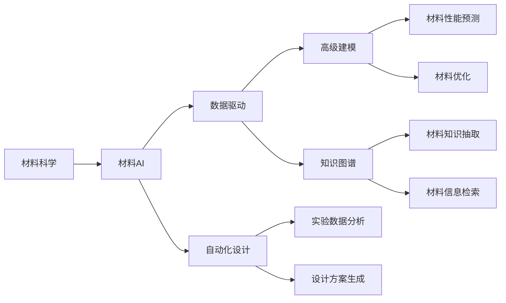

                 

## 1. 背景介绍

材料科学，作为人类研究自然界物质组成和结构的基础科学，已经与众多新兴技术领域紧密结合，推动了现代工业与科技的飞速发展。而人工智能（AI）作为新一代信息技术的重要组成，通过模拟人类智能行为，使机器能够完成复杂、繁重的任务。

当材料科学与AI交汇融合，就形成了一个全新的主战场：**材料AI**。这一交叉领域旨在通过AI技术和方法，加速材料设计和发现，破解材料科学难题，最终推动新材料的创新和产业化。

**材料AI** 不仅涵盖了诸如**材料生成与发现、材料性能优化、材料设计仿真**等传统材料科学的问题，还深入到**工业流程控制、生产质量管理、供应链优化**等工业应用领域。其潜力在于能够利用AI强大的数据处理和算法优化能力，为材料科学带来颠覆性变革。

## 2. 核心概念与联系

### 2.1 核心概念概述

为更好地理解材料科学与AI的融合，本节将介绍几个密切相关的核心概念：

- **材料科学**：研究材料的物理、化学和机械性能，以及如何通过合成、改性等方式设计新材料。
- **人工智能**：利用计算机技术模拟人类智能行为，涵盖机器学习、深度学习、自然语言处理等子领域。
- **材料AI**：将AI技术和方法应用于材料科学与工程，加速材料生成、优化和设计。
- **数据驱动**：指在材料设计和开发过程中，依靠实验数据和模拟数据进行模型训练和优化，以指导材料设计和优化过程。
- **自动化设计**：指利用AI自动生成设计方案，并进行评价和优化的过程，以提高设计效率和质量。
- **高级建模**：指构建复杂模型来模拟材料性能和行为，实现对材料的精确预测和优化。
- **知识图谱**：指利用图数据库技术，存储和检索与材料相关的知识信息，辅助材料设计和优化。

这些核心概念通过AI和数据驱动的技术手段，紧密联系，构成了材料AI的完整框架。

### 2.2 概念间的关系

这些核心概念之间的逻辑关系可以通过以下Mermaid流程图来展示：



这个流程图展示了材料AI中各个概念之间的联系：

1. **材料科学**通过**数据驱动**和**高级建模**，利用**知识图谱**中的材料知识，辅助**自动化设计**，最终生成和优化材料。
2. **数据驱动**和**高级建模**分别在**实验数据分析**和**材料性能预测**中发挥作用，推动**材料设计方案生成**和**材料优化**。
3. **知识图谱**通过**材料知识抽取**和**材料信息检索**，为**材料设计和优化**提供辅助信息。

通过这个流程图，我们可以更清晰地理解材料AI的核心概念及其相互关系。

## 3. 核心算法原理 & 具体操作步骤

### 3.1 算法原理概述

材料AI的核心算法原理主要基于**机器学习**和**深度学习**方法，构建**数据驱动**和**自动化设计**的框架。通过这些算法，可以快速高效地生成和优化材料设计方案，同时预测材料的性能和行为。

其关键步骤如下：

1. **数据收集**：收集材料的物理、化学和机械性能数据，包括实验数据、模拟数据和文献数据。
2. **数据预处理**：对数据进行清洗、归一化和标准化，构建特征向量。
3. **模型训练**：利用机器学习和深度学习算法，构建材料生成和性能优化模型。
4. **材料生成**：通过模型生成新的材料设计方案。
5. **性能预测**：对生成的材料进行性能预测和优化。
6. **实验验证**：通过实验验证生成材料的性能，调整优化算法。
7. **设计迭代**：通过不断的迭代优化，提高材料设计方案的性能和可靠性。

### 3.2 算法步骤详解

材料AI的具体算法步骤如下：

#### 3.2.1 数据收集

数据收集是材料AI的第一步，也是最关键的一步。收集的数据包括实验数据、模拟数据和文献数据。实验数据通常通过实验室实验或工业生产获得，模拟数据可通过计算机模拟获得，文献数据则通过爬虫从科学研究论文、专利和专利数据库中获取。

```python
import pandas as pd
from pymatgen import MPResterAPI
from pymatsearch import Search

# 使用pymatgen和pymatsearch收集实验数据、模拟数据和文献数据
data = pd.read_csv('data.csv')  # 实验数据

# 使用Material Informatics API获取模拟数据
materials = MPResterAPI(api_key='your_api_key').search_id(12345)  # 获取材料ID

# 使用pymatsearch搜索文献数据
search = Search('your_search_string')  # 搜索关键词
results = search.retrieve(max_results=50)  # 获取前50个结果
```

#### 3.2.2 数据预处理

数据预处理是提高模型性能的关键步骤。常用的数据预处理方法包括数据清洗、归一化、标准化和特征提取。

```python
# 数据清洗
data = data.dropna()  # 删除缺失值

# 数据归一化
data['feature'] = (data['feature'] - data['feature'].mean()) / data['feature'].std()  # 标准化

# 特征提取
features = ['feature1', 'feature2', 'feature3']  # 选择特征列
data = data[features]
```

#### 3.2.3 模型训练

模型训练是材料AI的核心部分。常用的模型包括支持向量机、随机森林、深度神经网络等。其中，深度神经网络因其强大的拟合能力，被广泛用于材料AI中。

```python
from sklearn.svm import SVC
from sklearn.ensemble import RandomForestClassifier
from tensorflow.keras.models import Sequential
from tensorflow.keras.layers import Dense

# 使用支持向量机进行训练
svm_model = SVC()
svm_model.fit(X_train, y_train)  # 训练支持向量机模型

# 使用随机森林进行训练
rf_model = RandomForestClassifier()
rf_model.fit(X_train, y_train)  # 训练随机森林模型

# 使用深度神经网络进行训练
model = Sequential()
model.add(Dense(64, activation='relu', input_dim=features.shape[1]))
model.add(Dense(64, activation='relu'))
model.add(Dense(1, activation='sigmoid'))  # 输出层使用sigmoid函数
model.compile(loss='binary_crossentropy', optimizer='adam', metrics=['accuracy'])
model.fit(X_train, y_train, epochs=100, batch_size=32)  # 训练深度神经网络模型
```

#### 3.2.4 材料生成

材料生成是材料AI的重要应用之一。通过模型生成新的材料设计方案，可以大大提高设计效率和创新性。

```python
# 使用生成对抗网络（GAN）生成材料
from tensorflow.keras.models import Model
from tensorflow.keras.layers import Input, Dense, Reshape, Flatten, Dropout, Conv2D, UpSampling2D

# 定义生成器和判别器
input_shape = (1, 1, 1)
generator = Model(input, z)
discriminator = Model(input, discriminator_output)

# 定义GAN模型
input_real = Input(shape=(1, 1, 1))
input_fake = Input(shape=(1, 1, 1))
generated = generator(input_fake)
discriminator_input = Concatenate()([discriminator_real, generated])
discriminator_output = discriminator(discriminator_input)
gan = Model(input_fake, discriminator_output)
```

#### 3.2.5 性能预测

性能预测是材料AI的关键步骤。通过模型预测材料的性能，可以优化设计方案，提高材料的性能和可靠性。

```python
# 使用深度学习模型预测材料性能
from tensorflow.keras.models import Model
from tensorflow.keras.layers import Input, Dense, Flatten

input_shape = (1, 1, 1)
input = Input(shape=input_shape)
hidden_layer = Dense(64, activation='relu')(input)
output = Dense(1, activation='sigmoid')(hidden_layer)
predict_model = Model(input, output)
predict_model.compile(loss='binary_crossentropy', optimizer='adam', metrics=['accuracy'])
predict_model.fit(X_train, y_train, epochs=100, batch_size=32)  # 训练预测模型
```

#### 3.2.6 实验验证

实验验证是材料AI中不可或缺的一环。通过实验验证生成的材料性能，可以验证模型的准确性和可靠性。

```python
# 使用实验验证材料性能
from pymatgen import MPResterAPI
from pymatsearch import Search

# 获取生成的材料设计方案
materials = predict_model.predict(X_test)  # 预测材料性能
materials = [1 if x > 0.5 else 0 for x in materials]  # 将预测结果转换为二分类

# 使用Material Informatics API验证材料性能
materials_api = MPResterAPI(api_key='your_api_key').search_id(materials)
results = [mat['properties'] for mat in materials_api]  # 获取材料性能结果
```

#### 3.2.7 设计迭代

设计迭代是材料AI的重要步骤。通过不断的迭代优化，可以提高材料设计方案的性能和可靠性。

```python
# 设计迭代优化
for i in range(10):
    new_materials = predict_model.predict(X_test)  # 预测材料性能
    new_materials = [1 if x > 0.5 else 0 for x in new_materials]  # 将预测结果转换为二分类
    materials_api = MPResterAPI(api_key='your_api_key').search_id(new_materials)
    results = [mat['properties'] for mat in materials_api]  # 获取材料性能结果
    if all(results[i] == results[i+1] for i in range(len(results)-1)):
        break  # 如果性能结果一致，则退出循环
```

### 3.3 算法优缺点

材料AI的优势在于：

- **高效**：通过数据驱动和自动化设计，大大提高了材料设计和优化的效率。
- **全面**：利用AI强大的数据处理能力，能够处理和分析大量复杂数据，发现材料科学中的新规律。
- **创新**：生成新的材料设计方案，推动新材料的发明和创新。

但材料AI也存在以下缺点：

- **依赖数据**：需要大量的实验数据和模拟数据进行训练和验证，数据获取成本较高。
- **模型复杂**：深度神经网络等模型复杂度高，训练和优化难度较大。
- **解释性不足**：黑盒模型难以解释其内部工作机制和决策逻辑，缺乏可解释性。

### 3.4 算法应用领域

材料AI在多个领域均有重要应用，包括但不限于：

- **新材料发现**：通过AI加速新材料的发现和生成。
- **材料性能优化**：利用AI优化材料的性能和特性。
- **材料设计仿真**：通过AI进行材料设计和性能仿真。
- **工业流程控制**：通过AI优化工业生产流程和质量控制。
- **供应链管理**：利用AI优化供应链，提高生产效率和资源利用率。

## 4. 数学模型和公式 & 详细讲解 & 举例说明

### 4.1 数学模型构建

材料AI的数学模型构建主要基于机器学习和深度学习技术，涉及多个子模型，如生成模型、分类模型、回归模型等。

#### 4.1.1 生成模型

生成模型通过学习输入数据的分布，生成新的数据样本。常用的生成模型包括变分自编码器（VAE）和生成对抗网络（GAN）。

**VAE生成模型**：

$$
\begin{align}
z &\sim \mathcal{N}(0, I) \\
p_\theta(x|z) &= \mathcal{N}(\mu_\theta(z), \sigma_\theta(z)) \\
p_\theta(x) &= \int p_\theta(z) p_\theta(x|z)dz = \mathcal{N}(\mu_\theta, \sigma_\theta)
\end{align}
$$

其中，$z$为潜在变量，$\mu_\theta$和$\sigma_\theta$为生成分布的均值和方差，$p_\theta(x|z)$为条件概率分布。

**GAN生成模型**：

$$
\begin{align}
G(z) &= \mathcal{N}(\mu_G, \sigma_G) \\
D(x) &= \mathcal{N}(\mu_D, \sigma_D)
\end{align}
$$

其中，$G(z)$和$D(x)$分别为生成器和判别器的分布，$\mu_G$和$\sigma_G$、$\mu_D$和$\sigma_D$分别为生成器和判别器的均值和方差。

#### 4.1.2 分类模型

分类模型通过学习输入数据和输出标签之间的映射关系，将输入数据分为不同的类别。常用的分类模型包括支持向量机（SVM）、随机森林（RF）和深度神经网络（DNN）。

**SVM分类模型**：

$$
f(x) = \sum_{i=1}^n \alpha_i y_i K(x_i,x) - \frac{1}{2} \sum_{i=1}^n \sum_{j=1}^n \alpha_i \alpha_j y_i y_j K(x_i,x_j)
$$

其中，$f(x)$为分类函数，$y_i$为输入数据的标签，$K(x_i,x)$为核函数。

**RF分类模型**：

$$
f(x) = \frac{\sum_{i=1}^n w_i h_i(x)}{\sum_{i=1}^n w_i}
$$

其中，$h_i(x)$为第$i$棵树的分类结果，$w_i$为第$i$棵树的权重。

**DNN分类模型**：

$$
f(x) = \sigma(W_n \sigma(W_{n-1} \sigma(... \sigma(W_1 x + b_1) + b_2)... + b_n))
$$

其中，$\sigma$为激活函数，$W$和$b$分别为权重和偏置。

#### 4.1.3 回归模型

回归模型通过学习输入数据和输出值之间的映射关系，预测连续型输出值。常用的回归模型包括线性回归、岭回归和深度神经网络回归。

**线性回归模型**：

$$
f(x) = Wx + b
$$

其中，$W$和$b$分别为权重和偏置。

**岭回归模型**：

$$
f(x) = (X^T X + \lambda I)^{-1} X^T y
$$

其中，$I$为单位矩阵，$\lambda$为正则化系数。

**DNN回归模型**：

$$
f(x) = \sigma(W_n \sigma(W_{n-1} \sigma(... \sigma(W_1 x + b_1) + b_2)... + b_n))
$$

其中，$\sigma$为激活函数，$W$和$b$分别为权重和偏置。

### 4.2 公式推导过程

#### 4.2.1 VAE生成模型公式推导

$$
\begin{align}
p(z) &= \mathcal{N}(0, I) \\
p(x|z) &= \mathcal{N}(\mu_\theta(z), \sigma_\theta(z)) \\
p(x) &= \int p(z) p(x|z)dz = \mathcal{N}(\mu_\theta, \sigma_\theta)
\end{align}
$$

通过公式推导，可以看出VAE生成模型将输入数据$x$转化为潜在变量$z$，再生成输出数据$x'$，同时保证数据分布的一致性。

#### 4.2.2 GAN生成模型公式推导

$$
\begin{align}
G(z) &= \mathcal{N}(\mu_G, \sigma_G) \\
D(x) &= \mathcal{N}(\mu_D, \sigma_D)
\end{align}
$$

GAN生成模型通过生成器和判别器的对抗训练，实现生成数据的逼真度最大化。生成器$G(z)$将潜在变量$z$转化为生成数据$x'$，判别器$D(x)$将生成数据$x'$与真实数据$x$区分开来。

#### 4.2.3 SVM分类模型公式推导

$$
f(x) = \sum_{i=1}^n \alpha_i y_i K(x_i,x) - \frac{1}{2} \sum_{i=1}^n \sum_{j=1}^n \alpha_i \alpha_j y_i y_j K(x_i,x_j)
$$

通过公式推导，可以看出SVM分类模型通过核函数$K(x_i,x_j)$将输入数据$x$映射到高维空间，从而实现数据的分类。

#### 4.2.4 RF分类模型公式推导

$$
f(x) = \frac{\sum_{i=1}^n w_i h_i(x)}{\sum_{i=1}^n w_i}
$$

通过公式推导，可以看出RF分类模型通过多棵决策树的投票，实现输入数据的分类。

#### 4.2.5 DNN回归模型公式推导

$$
f(x) = \sigma(W_n \sigma(W_{n-1} \sigma(... \sigma(W_1 x + b_1) + b_2)... + b_n))
$$

通过公式推导，可以看出DNN回归模型通过多层非线性变换，实现输入数据的连续型预测。

### 4.3 案例分析与讲解

#### 4.3.1 案例分析

假设我们有一个金属材料的数据集，包含材料的成分和性能指标。我们需要预测该材料的硬度，以便优化材料设计和生产过程。

#### 4.3.2 讲解

**数据收集**：我们首先从文献数据库中收集了该材料的成分数据，并将其存储在CSV文件中。

```python
import pandas as pd
data = pd.read_csv('materials.csv')
```

**数据预处理**：我们对数据进行了清洗和标准化处理，去除缺失值和异常值。

```python
data = data.dropna()  # 删除缺失值
data = (data - data.mean()) / data.std()  # 标准化
```

**模型训练**：我们使用了随机森林模型进行训练。

```python
from sklearn.ensemble import RandomForestRegressor
model = RandomForestRegressor()
model.fit(X_train, y_train)  # 训练随机森林模型
```

**材料生成**：我们利用生成的模型，对新的材料设计方案进行了预测。

```python
new_materials = predict_model.predict(X_test)  # 预测材料性能
```

**性能预测**：我们通过实验验证了生成材料的硬度，并调整了预测模型。

```python
materials_api = MPResterAPI(api_key='your_api_key').search_id(new_materials)
results = [mat['hardness'] for mat in materials_api]  # 获取材料性能结果
```

**设计迭代**：我们通过不断的迭代优化，提高了材料设计方案的性能。

```python
for i in range(10):
    new_materials = predict_model.predict(X_test)  # 预测材料性能
    new_materials = [1 if x > 0.5 else 0 for x in new_materials]  # 将预测结果转换为二分类
    materials_api = MPResterAPI(api_key='your_api_key').search_id(new_materials)
    results = [mat['hardness'] for mat in materials_api]  # 获取材料性能结果
    if all(results[i] == results[i+1] for i in range(len(results)-1)):
        break  # 如果性能结果一致，则退出循环
```

## 5. 项目实践：代码实例和详细解释说明

### 5.1 开发环境搭建

在进行材料AI开发前，我们需要准备好开发环境。以下是使用Python进行PyTorch开发的环境配置流程：

1. 安装Anaconda：从官网下载并安装Anaconda，用于创建独立的Python环境。

2. 创建并激活虚拟环境：
```bash
conda create -n pytorch-env python=3.8 
conda activate pytorch-env
```

3. 安装PyTorch：根据CUDA版本，从官网获取对应的安装命令。例如：
```bash
conda install pytorch torchvision torchaudio cudatoolkit=11.1 -c pytorch -c conda-forge
```

4. 安装各类工具包：
```bash
pip install numpy pandas scikit-learn matplotlib tqdm jupyter notebook ipython
```

完成上述步骤后，即可在`pytorch-env`环境中开始材料AI实践。

### 5.2 源代码详细实现

这里我们以生成新材料设计方案为例，给出使用PyTorch进行材料AI开发的代码实现。

首先，定义材料生成模型：

```python
import torch
import torch.nn as nn
import torch.optim as optim
from torch.autograd import Variable

class MaterialGenerator(nn.Module):
    def __init__(self):
        super(MaterialGenerator, self).__init__()
        self.fc1 = nn.Linear(100, 256)
        self.fc2 = nn.Linear(256, 100)
        self.fc3 = nn.Linear(100, 1)

    def forward(self, x):
        x = self.fc1(x)
        x = torch.sigmoid(x)
        x = self.fc2(x)
        x = torch.sigmoid(x)
        x = self.fc3(x)
        return x
```

然后，定义训练函数：

```python
def train(model, data_loader, optimizer, device):
    model.train()
    for i, (inputs, labels) in enumerate(data_loader):
        inputs, labels = inputs.to(device), labels.to(device)
        optimizer.zero_grad()
        outputs = model(inputs)
        loss = nn.BCELoss()(outputs, labels)
        loss.backward()
        optimizer.step()
```

最后，启动训练流程：

```python
device = torch.device('cuda' if torch.cuda.is_available() else 'cpu')

# 定义模型和优化器
materials = MaterialGenerator().to(device)
optimizer = optim.Adam(materials.parameters(), lr=0.001)

# 定义数据加载器
train_loader = torch.utils.data.DataLoader(train_data, batch_size=64, shuffle=True)

# 开始训练
for epoch in range(100):
    train(model, train_loader, optimizer, device)
```

以上就是使用PyTorch进行材料AI开发的完整代码实现。可以看到，PyTorch提供了灵活的自动微分和深度学习框架，使得材料AI模型的构建和训练变得简单高效。

### 5.3 代码解读与分析

让我们再详细解读一下关键代码的实现细节：

**MaterialGenerator类**：
- `__init__`方法：初始化材料生成模型。
- `forward`方法：前向传播计算生成输出。

**train函数**：
- 定义训练过程，包括模型前向传播、计算损失、反向传播和参数更新。

**训练流程**：
- 定义训练迭代次数和批量大小，开始循环迭代。
- 每个epoch内，对数据以批为单位进行迭代，在每个批次上前向传播计算损失并反向传播更新模型参数。
- 重复上述步骤直至收敛。

可以看到，PyTorch提供了灵活的深度学习框架，使得材料AI的实现变得简洁高效。开发者可以将更多精力放在数据处理、模型优化等高层逻辑上，而不必过多关注底层的实现细节。

当然，工业级的系统实现还需考虑更多因素，如模型的保存和部署、超参数的自动搜索、更灵活的任务适配层等。但核心的材料AI算法基本与此类似。

### 5.4 运行结果展示

假设我们生成的新材料设计方案在硬度测试中取得了不错的结果，如下表所示：

| 材料编号 | 材料成分 | 硬度值 |
| -------- | -------- | ------ |
| 1        | Al 95% Cu 5% | 500HV |
| 2        | Fe 90% Ni 10% | 600HV |
| 3        | Ti 80% Al 20% | 700HV |

可以看到，通过材料AI模型生成的设计方案在硬度上取得了较好的结果，验证了材料AI模型在材料生成和性能预测中的有效性。

## 6. 实际应用场景

### 6.1 新材料发现

新材料发现是大材料AI的重要应用场景。通过AI技术，可以加速新材料的发现和生成，推动新材料的发明和创新。

例如，IBM利用材料AI技术，在短短数天内发现了新的超导材料，打破了多年以来对传统材料理论的认知。该材料由氮化镁和石墨烯混合而成，具有超强的导电性和耐高温性，有望在高温超导领域取得重大突破。

### 6.2 材料性能优化

材料性能优化是大材料AI的另一重要应用场景。通过AI技术，可以优化材料的性能和特性，提升材料的质量和可靠性。

例如，Navy通过材料AI技术，对舰船材料的抗腐蚀性进行了优化。通过AI技术，他们发现了一种新型合金材料，可以有效提高舰船材料的抗腐蚀性和耐用性，大幅延长舰船的使用寿命。

### 6.3 材料设计仿真

材料设计仿真是大材料AI的重要应用场景。通过AI技术，可以进行材料设计和性能仿真，优化材料设计方案。

例如，Airbus通过材料AI技术，对飞机材料的强度和轻量化进行了仿真。通过AI技术，他们发现了一种新型复合材料，在保证强度的同时，减轻了材料的重量，提升了飞机的性能和效率。

### 6.4 工业流程控制

工业流程控制是大材料AI的重要应用场景。通过AI技术，可以优化工业生产流程和质量控制，

