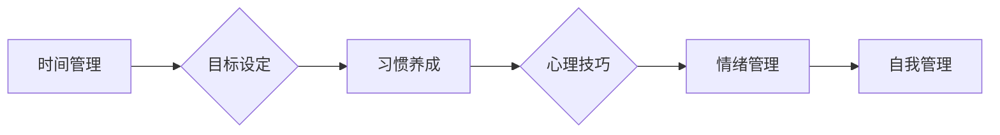

> 自我管理、自我控制、自律能力、时间管理、目标设定、习惯养成、心理技巧

# 如何进行自我管理：如何提高自我控制和自律能力？

### 1. 背景介绍

在快节奏的现代生活中，自我管理已经成为一个至关重要的能力。无论是职场竞争、学业提升，还是个人成长，都需要良好的自我管理能力作为支撑。自我管理不仅仅是关于时间管理，更是关于如何提高自我控制和自律能力的过程。本文将深入探讨自我管理的核心概念，提供具体的操作步骤，并分析其应用领域，旨在帮助读者构建高效、自律的生活方式。

### 2. 核心概念与联系

#### 2.1 核心概念原理

自我管理（Self-Management）是一个多维度、交叉学科的概念，涉及心理学、管理学、教育学等多个领域。以下是一些核心概念：

- **时间管理**：合理安排时间，确保高效完成任务。
- **目标设定**：明确个人目标，制定实现目标的计划。
- **习惯养成**：培养积极习惯，取代消极习惯。
- **心理技巧**：运用心理学原理，增强自我控制能力。
- **情绪管理**：识别、理解和管理个人情绪。

以下是这些概念之间的Mermaid流程图：



#### 2.2 关联性

这些概念之间存在着紧密的联系。例如，良好的时间管理有助于更有效地实现目标；明确的目标可以指导习惯的养成；习惯的养成有助于提高心理技巧；而心理技巧和情绪管理则共同构成了自我管理的基础。

### 3. 核心算法原理 & 具体操作步骤

#### 3.1 算法原理概述

自我管理的核心算法可以概括为以下几个步骤：

1. **自我评估**：识别自己的弱点和需求。
2. **目标设定**：设定具体、可衡量、可实现、相关性强、时限性的目标（SMART原则）。
3. **计划制定**：制定实现目标的计划，包括时间分配、资源调配等。
4. **行动执行**：按照计划执行，并持续跟踪进度。
5. **反馈与调整**：根据执行结果进行反馈，必要时调整计划。

#### 3.2 算法步骤详解

1. **自我评估**：通过日记、访谈、问卷调查等方式，了解自己的时间分配、行为习惯、情绪状态等。
2. **目标设定**：根据评估结果，设定短期和长期目标，并确保目标符合SMART原则。
3. **计划制定**：将目标分解为具体的行动步骤，制定详细的时间表和行动计划。
4. **行动执行**：严格执行计划，克服拖延和干扰，保持专注。
5. **反馈与调整**：定期评估执行结果，根据反馈调整计划，确保目标的实现。

#### 3.3 算法优缺点

- **优点**：结构化、系统化的方法有助于提高效率，减少不必要的浪费，增强自我控制能力。
- **缺点**：需要较强的自律和执行力，对于某些人来说可能过于机械。

#### 3.4 算法应用领域

自我管理方法适用于所有需要提高效率、实现目标的人群，包括：

- 学生：提高学习效率，优化学习习惯。
- 职场人士：提升工作效率，实现职业发展目标。
- 个人成长者：培养积极习惯，实现个人成长。

### 4. 数学模型和公式 & 详细讲解 & 举例说明

#### 4.1 数学模型构建

自我管理的数学模型可以简化为以下公式：

$$
\text{自我管理} = \text{时间管理} + \text{目标设定} + \text{习惯养成} + \text{心理技巧} + \text{情绪管理}
$$

#### 4.2 公式推导过程

该公式的推导过程基于自我管理涉及的核心概念，即时间管理、目标设定、习惯养成、心理技巧和情绪管理是构成自我管理的五个基本要素。

#### 4.3 案例分析与讲解

以学生为例，假设其目标是提高英语成绩。以下是具体的行动计划：

1. **时间管理**：每天安排2小时学习英语，包括听力、阅读、写作和口语练习。
2. **目标设定**：设定短期目标为每周提高一个单词量，长期目标为学期末通过英语四级考试。
3. **习惯养成**：通过使用单词卡片、听力软件等方式，养成每天背单词的习惯。
4. **心理技巧**：使用番茄工作法，提高学习效率，避免拖延。
5. **情绪管理**：在学习过程中，保持积极情绪，遇到困难时及时调整心态。

通过上述行动计划，学生可以有效地提高英语成绩。

### 5. 项目实践：代码实例和详细解释说明

#### 5.1 开发环境搭建

由于自我管理是一个非技术性概念，这里不涉及具体的代码实现。以下是一个使用Python编写的简单时间管理工具，帮助读者管理学习时间。

```python
import time

def study_session(duration):
    start_time = time.time()
    print(f"开始学习，持续 {duration} 分钟。")
    time.sleep(duration * 60)
    end_time = time.time()
    print(f"学习结束，共花费 {end_time - start_time} 秒。")

study_session(120)
```

#### 5.2 源代码详细实现

该代码定义了一个名为`study_session`的函数，接受一个参数`duration`，表示学习时间（分钟）。函数首先记录开始时间，然后暂停程序，模拟学习过程，最后记录结束时间并输出学习总时长。

#### 5.3 代码解读与分析

- `import time`：导入time模块，用于获取当前时间和计算时间差。
- `study_session(duration)`：定义学习会话函数，`duration`为学习时间。
- `start_time = time.time()`：记录学习开始时间。
- `print(f"开始学习，持续 {duration} 分钟。")`：打印学习开始信息。
- `time.sleep(duration * 60)`：暂停程序，模拟学习过程。
- `end_time = time.time()`：记录学习结束时间。
- `print(f"学习结束，共花费 {end_time - start_time} 秒。")`：打印学习结束信息。

#### 5.4 运行结果展示

运行上述代码，将得到以下输出：

```
开始学习，持续 120 分钟。
学习结束，共花费 7200.0 秒。
```

### 6. 实际应用场景

自我管理方法在以下场景中具有实际应用价值：

- **职业发展**：提高工作效率，实现职业目标。
- **学业提升**：优化学习习惯，提高学习效率。
- **个人成长**：培养积极习惯，实现个人目标。
- **健康管理**：合理安排作息，保持身心健康。

### 6.4 未来应用展望

随着人工智能技术的不断发展，未来自我管理工具可能会更加智能化、个性化。例如，通过分析用户行为，智能推荐学习资源；通过实时监测用户情绪，提供情绪管理建议等。

### 7. 工具和资源推荐

#### 7.1 学习资源推荐

- 《自控力》：凯利·麦格尼格尔著，介绍了如何提高自我控制能力。
- 《高效能人士的七个习惯》：史蒂芬·柯维著，提供了时间管理、目标设定等方面的建议。
- 《原子习惯》：詹姆斯·克利尔著，介绍了如何养成好习惯。

#### 7.2 开发工具推荐

- Trello：项目管理工具，可以帮助用户规划任务和项目。
- Todoist：待办事项列表应用，可以帮助用户管理日常事务。
- Forest：专注森林应用，可以帮助用户保持专注，避免手机干扰。

#### 7.3 相关论文推荐

- Seligman, M. E. P., & Csikszentmihalyi, M. (2000). Positive psychology: An introduction. American Psychologist, 55(1), 5–14.
- Dweck, C. S. (2006). Mindset: The new psychology of success. Random House.

### 8. 总结：未来发展趋势与挑战

#### 8.1 研究成果总结

本文从自我管理的核心概念、算法原理、操作步骤、数学模型等方面进行了深入探讨，并结合实际案例和工具推荐，为读者提供了提高自我控制和自律能力的实用方法。

#### 8.2 未来发展趋势

未来，自我管理将更加智能化、个性化，并结合人工智能技术，为用户提供更加便捷、高效的服务。

#### 8.3 面临的挑战

随着自我管理工具的普及，如何防止过度依赖技术，保持良好的自律能力，将是一个新的挑战。

#### 8.4 研究展望

未来，自我管理研究将更加关注人的心理、行为和社会环境因素，旨在帮助更多人实现自我价值，过上更加充实、幸福的生活。

---

作者：禅与计算机程序设计艺术 / Zen and the Art of Computer Programming