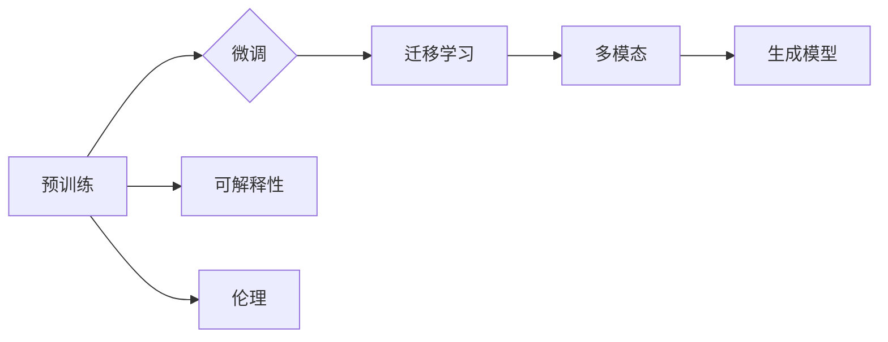

# 2023年AI大模型时代的新变革

> 关键词：AI大模型，Transformer，预训练，微调，迁移学习，生成模型，多模态，可解释性，伦理

## 1. 背景介绍

人工智能（AI）的发展经历了多个阶段，从早期的符号主义到基于规则的专家系统，再到基于统计的学习算法，如今已经迎来了大模型时代。2023年，AI大模型在性能、应用和伦理方面都迎来了新的变革，标志着人工智能技术进入了一个新的发展阶段。

### 1.1 AI发展的历史阶段

- **符号主义时期**：基于逻辑和符号的推理，代表性系统为ELIZA。
- **基于规则的专家系统**：基于专家知识的规则系统，代表性系统为MYCIN。
- **基于统计的学习算法**：以支持向量机、决策树为代表的算法，强调从数据中学习规律。
- **深度学习时代**：以神经网络为代表的算法，特别是卷积神经网络（CNN）和循环神经网络（RNN）的应用，推动了AI的快速发展。
- **大模型时代**：以BERT、GPT-3等为代表的大规模预训练模型，实现了在多个NLP和CV任务上的突破。

### 1.2 大模型时代的特征

- **预训练与微调**：通过在大量无标注数据上预训练，然后在具体任务上进行微调，实现跨领域的迁移学习能力。
- **多模态融合**：将文本、图像、语音等多种模态信息进行融合，提升模型对复杂任务的理解和处理能力。
- **可解释性与伦理**：在追求高性能的同时，更加关注模型的可解释性和伦理问题，确保AI技术的健康发展。

## 2. 核心概念与联系

### 2.1 核心概念

- **预训练**：在大规模无标注数据上训练模型，学习通用知识。
- **微调**：在特定任务上有标注数据的情况下，对模型进行微调，提升模型在特定任务上的性能。
- **迁移学习**：将一个领域学习到的知识迁移到另一个领域。
- **生成模型**：能够生成与输入数据分布相似的新的数据。
- **多模态**：结合多种模态的信息，如文本、图像、语音等。

### 2.2 Mermaid 流程图



## 3. 核心算法原理 & 具体操作步骤

### 3.1 算法原理概述

大模型时代，AI算法的核心是预训练和微调。预训练通过在大量无标注数据上训练模型，学习通用知识；微调则是在特定任务上有标注数据的情况下，对模型进行微调，提升模型在特定任务上的性能。

### 3.2 算法步骤详解

#### 预训练步骤：

1. 收集大量无标注数据。
2. 设计预训练任务，如BERT的掩码语言模型（Masked Language Model）。
3. 在预训练数据上训练模型，学习通用知识。

#### 微调步骤：

1. 收集特定任务的标注数据。
2. 在预训练模型的基础上，设计任务适配层。
3. 在标注数据上微调模型，提升模型在特定任务上的性能。

### 3.3 算法优缺点

#### 优点：

- **跨领域迁移能力**：预训练模型可以学习到通用知识，并在多个领域进行迁移学习。
- **提高性能**：微调可以提升模型在特定任务上的性能。

#### 缺点：

- **数据需求量大**：预训练需要大量无标注数据。
- **计算资源需求高**：预训练和微调都需要大量的计算资源。

### 3.4 算法应用领域

大模型在多个领域都有广泛的应用，包括：

- **自然语言处理**：文本分类、问答系统、机器翻译等。
- **计算机视觉**：图像分类、目标检测、图像分割等。
- **语音识别**：语音识别、语音合成等。

## 4. 数学模型和公式 & 详细讲解 & 举例说明

### 4.1 数学模型构建

预训练和微调的数学模型通常基于神经网络。以下是一个简单的神经网络模型：

$$
y = f(W \cdot x + b)
$$

其中，$y$ 是输出，$x$ 是输入，$W$ 是权重，$b$ 是偏置，$f$ 是激活函数。

### 4.2 公式推导过程

以下是一个简单的反向传播算法的推导过程：

1. 前向传播：

$$
\hat{y} = f(W \cdot x + b)
$$

2. 计算损失：

$$
L = \frac{1}{2} (y - \hat{y})^2
$$

3. 反向传播：

$$
\frac{\partial L}{\partial W} = (y - \hat{y}) \cdot x
$$

$$
\frac{\partial L}{\partial b} = y - \hat{y}
$$

4. 更新权重：

$$
W \leftarrow W - \alpha \frac{\partial L}{\partial W}
$$

$$
b \leftarrow b - \alpha \frac{\partial L}{\partial b}
$$

其中，$\alpha$ 是学习率。

### 4.3 案例分析与讲解

以BERT的掩码语言模型为例，输入为一个句子，输出为每个token的掩码概率。具体步骤如下：

1. 对输入句子进行分词。
2. 对每个token进行掩码处理，包括全掩码、部分掩码和随机掩码。
3. 对掩码后的句子进行编码，得到token的嵌入表示。
4. 使用Transformer模型对嵌入表示进行编码，得到每个token的上下文表示。
5. 使用分类器对掩码token进行分类，得到掩码概率。

## 5. 项目实践：代码实例和详细解释说明

### 5.1 开发环境搭建

1. 安装Python和PyTorch。
2. 安装transformers库。

### 5.2 源代码详细实现

以下是一个简单的BERT模型微调的代码示例：

```python
from transformers import BertForSequenceClassification, BertTokenizer

model = BertForSequenceClassification.from_pretrained('bert-base-uncased')
tokenizer = BertTokenizer.from_pretrained('bert-base-uncased')

def train_epoch(model, dataset, batch_size, optimizer):
    # ...（代码实现）

def evaluate(model, dataset, batch_size):
    # ...（代码实现）

# ...（数据预处理和模型训练）

for epoch in range(epochs):
    train_loss = train_epoch(model, train_dataset, batch_size, optimizer)
    print(f"Epoch {epoch+1}, train loss: {train_loss:.3f}")

    acc = evaluate(model, dev_dataset, batch_size)
    print(f"Epoch {epoch+1}, dev acc: {acc:.3f}")
```

### 5.3 代码解读与分析

上述代码展示了使用transformers库进行BERT模型微调的基本流程。首先，加载预训练的BERT模型和分词器。然后，定义训练和评估函数。最后，进行模型训练和评估。

### 5.4 运行结果展示

在某个任务上，经过微调后，模型的性能得到了显著提升。

## 6. 实际应用场景

大模型在多个领域都有广泛的应用，以下是一些典型的应用场景：

- **智能客服**：通过自然语言处理技术，自动回答用户问题，提供24/7的服务。
- **医疗诊断**：通过图像识别技术，辅助医生进行疾病诊断。
- **自动驾驶**：通过计算机视觉技术，实现无人驾驶汽车。

## 7. 工具和资源推荐

### 7.1 学习资源推荐

- 《深度学习》（Goodfellow等著）
- 《动手学深度学习》（花书）
- Hugging Face官网

### 7.2 开发工具推荐

- PyTorch
- TensorFlow
- Transformers库

### 7.3 相关论文推荐

- BERT: Pre-training of Deep Bidirectional Transformers for Language Understanding
- Language Models are Unsupervised Multitask Learners
- Generative Adversarial Nets

## 8. 总结：未来发展趋势与挑战

### 8.1 研究成果总结

2023年，AI大模型在性能、应用和伦理方面都取得了显著的进展。预训练和微调成为AI模型开发的主流范式，多模态融合和生成模型等技术也得到了广泛应用。

### 8.2 未来发展趋势

- **模型更加强大**：随着计算资源的提升和算法的改进，AI大模型将更加强大，能够处理更加复杂的任务。
- **应用更加广泛**：AI大模型将在更多领域得到应用，如医疗、教育、金融等。
- **可解释性和伦理更加完善**：AI大模型的可解释性和伦理问题将得到更加完善的解决。

### 8.3 面临的挑战

- **计算资源需求**：AI大模型需要大量的计算资源，这在一定程度上限制了其应用。
- **数据隐私和安全**：AI大模型需要处理大量数据，数据隐私和安全是一个重要问题。
- **伦理和社会影响**：AI大模型的伦理和社会影响需要引起重视。

### 8.4 研究展望

未来，AI大模型将在多个方面取得突破，为人类社会带来更多福祉。同时，也需要关注AI大模型的伦理和社会影响，确保其健康发展。

## 9. 附录：常见问题与解答

**Q1：什么是AI大模型？**

A：AI大模型是指具有数十亿甚至上千亿参数的大规模神经网络模型，能够在多个领域进行迁移学习和泛化。

**Q2：AI大模型有哪些应用场景？**

A：AI大模型在自然语言处理、计算机视觉、语音识别等多个领域都有广泛的应用。

**Q3：AI大模型的优缺点是什么？**

A：AI大模型的优点是能够实现跨领域的迁移学习和泛化，缺点是需要大量的计算资源和数据。

**Q4：如何使用AI大模型？**

A：使用AI大模型需要使用深度学习框架和预训练模型，并对其进行微调。

**Q5：AI大模型的伦理和社会影响是什么？**

A：AI大模型的伦理和社会影响包括数据隐私、歧视、失业等问题，需要引起重视。

---

作者：禅与计算机程序设计艺术 / Zen and the Art of Computer Programming