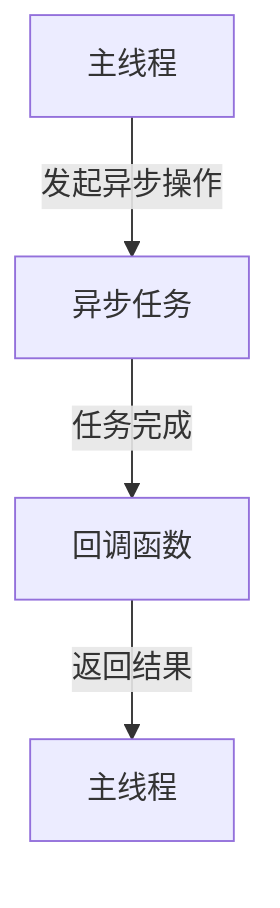
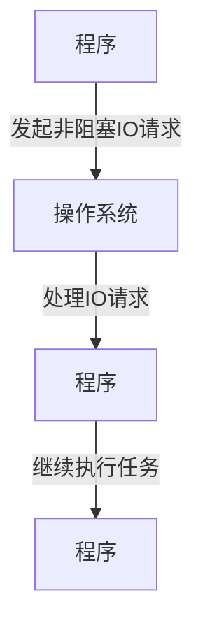
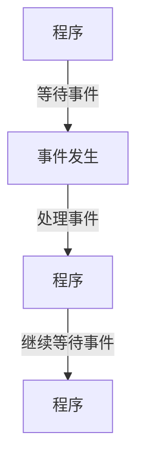
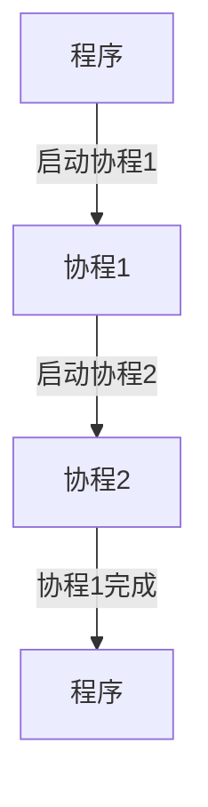

# 异步处理技术的最佳实践

> 关键词：异步编程，非阻塞IO，事件驱动，协程，异步框架，性能优化，系统设计

## 1. 背景介绍

在现代软件系统中，随着用户量和数据量的爆炸性增长，对性能和响应速度的要求越来越高。传统的同步编程模型在处理高并发、高负载的场景时往往力不从心。为了应对这些挑战，异步处理技术应运而生。异步处理允许程序在等待外部操作完成时继续执行其他任务，从而提高系统吞吐量和资源利用率。

本文将深入探讨异步处理技术的核心概念、最佳实践和实际应用，帮助开发者构建高效、可扩展的软件系统。

## 2. 核心概念与联系

### 2.1 异步编程

异步编程是一种编程范式，允许程序在等待I/O操作完成时执行其他任务。在异步编程中，程序不会阻塞主线程，而是使用回调函数、事件监听器或Promise对象来处理异步操作的结果。

#### Mermaid 流程图



### 2.2 非阻塞IO

非阻塞IO是一种I/O操作模型，它允许程序在等待I/O操作完成时继续执行其他任务，而不是被阻塞。这在处理大量并发连接时尤其有用。

#### Mermaid 流程图



### 2.3 事件驱动

事件驱动编程是一种编程范式，它基于事件来执行程序流程。在事件驱动模型中，程序等待事件发生，并在事件发生时执行相应的处理逻辑。

#### Mermaid 流程图



### 2.4 协程

协程是一种比线程更轻量级的并发执行单元。它允许程序在多个任务之间高效地切换执行，而不需要上下文切换的开销。

#### Mermaid 流程图



## 3. 核心算法原理 & 具体操作步骤

### 3.1 算法原理概述

异步处理技术主要基于以下原理：

- **事件循环**：程序使用事件循环来处理I/O事件、定时器和信号等异步事件。
- **任务队列**：异步任务被放入任务队列中，按顺序执行。
- **回调函数**：异步任务完成后，回调函数被调用以处理任务结果。

### 3.2 算法步骤详解

异步处理的基本步骤包括：

1. 初始化事件循环和任务队列。
2. 注册异步任务和回调函数。
3. 启动事件循环，等待事件发生。
4. 当事件发生时，从任务队列中取出回调函数执行。
5. 重复步骤3和4，直到事件循环结束。

### 3.3 算法优缺点

**优点**：

- 提高系统吞吐量：异步处理可以同时处理多个任务，提高系统性能。
- 提高资源利用率：程序不会在等待I/O操作时占用CPU资源。
- 响应速度快：用户请求可以快速响应，提高用户体验。

**缺点**：

- 代码复杂：异步编程的代码结构比同步编程更复杂。
- 难以调试：异步代码的调试比较困难。
- 可读性差：异步代码的可读性通常比同步代码差。

### 3.4 算法应用领域

异步处理技术适用于以下场景：

- 高并发Web服务器
- 客户端应用程序
- 分布式系统
- 网络应用程序

## 4. 数学模型和公式 & 详细讲解 & 举例说明

### 4.1 数学模型构建

异步处理技术的数学模型通常基于以下公式：

$$
\text{吞吐量} = \frac{\text{任务总数}}{\text{任务执行时间}}
$$

### 4.2 公式推导过程

假设系统中有N个任务需要执行，每个任务的执行时间为T。则系统的总执行时间为N * T。因此，系统的吞吐量为任务总数除以任务执行时间。

### 4.3 案例分析与讲解

假设一个Web服务器每秒收到100个请求，每个请求的平均处理时间为1毫秒。如果服务器使用同步处理模型，则每秒最多只能处理100个请求。如果使用异步处理模型，则可以同时处理多个请求，从而提高系统的吞吐量。

## 5. 项目实践：代码实例和详细解释说明

### 5.1 开发环境搭建

以下是一个使用Python的异步处理框架`asyncio`实现的简单示例：

```bash
# 安装asyncio
pip install asyncio
```

### 5.2 源代码详细实现

```python
import asyncio

async def handle_request(request):
    # 处理请求的异步函数
    print(f"Handling request: {request}")
    await asyncio.sleep(1)  # 模拟异步操作
    return f"Response to {request}"

async def main():
    requests = ["Request 1", "Request 2", "Request 3"]
    responses = await asyncio.gather(*(handle_request(req) for req in requests))
    print(responses)

# 运行主函数
asyncio.run(main())
```

### 5.3 代码解读与分析

上述代码中，我们定义了一个异步函数`handle_request`，用于处理请求。在主函数`main`中，我们创建了一个请求列表`requests`，并使用`asyncio.gather`函数并发地处理所有请求。`asyncio.sleep(1)`用于模拟异步操作。

### 5.4 运行结果展示

运行上述代码，将得到以下输出：

```
Handling request: Request 1
Handling request: Request 2
Handling request: Request 3
[Response to Request 1, Response to Request 2, Response to Request 3]
```

## 6. 实际应用场景

异步处理技术在以下场景中得到了广泛应用：

- Web服务器：如使用Node.js、Golang的HTTP服务器。
- 客户端应用程序：如使用Electron、Qt的桌面应用程序。
- 分布式系统：如使用Kubernetes、Docker的容器化系统。
- 网络应用程序：如使用gRPC、Thrift的远程过程调用。

## 7. 工具和资源推荐

### 7.1 学习资源推荐

- 《异步JavaScript：核心概念与最佳实践》
- 《Python异步编程实战》
- 《Node.js核心技术解析》
- 《Go语言圣经》

### 7.2 开发工具推荐

- Visual Studio Code：支持多种语言的异步编程插件。
- IntelliJ IDEA：支持JavaScript、Python等语言的异步编程。
- NetBeans：支持Java的异步编程。

### 7.3 相关论文推荐

- 《Asynchronous I/O in POSIX》
- 《Event-Driven Concurrency in Systems Programming》
- 《Python异步编程：从协程到异步框架》

## 8. 总结：未来发展趋势与挑战

### 8.1 研究成果总结

异步处理技术已经成为现代软件系统开发的重要技术之一。随着异步编程框架和工具的不断成熟，异步处理技术将在更多领域得到应用。

### 8.2 未来发展趋势

- 异步编程语言和框架的不断发展。
- 异步编程技术的普及和标准化。
- 异步处理技术在更多领域的应用。

### 8.3 面临的挑战

- 异步编程的复杂性和可读性。
- 异步编程的调试和性能分析。
- 异步编程的安全性和稳定性。

### 8.4 研究展望

- 研究更加高效、易用的异步编程语言和框架。
- 研究异步编程的性能优化和资源管理。
- 研究异步编程的安全性和稳定性保障。

## 9. 附录：常见问题与解答

**Q1：异步编程和同步编程有什么区别？**

A1：异步编程允许程序在等待I/O操作完成时执行其他任务，而同步编程会阻塞当前线程，直到I/O操作完成。

**Q2：异步编程的代码结构复杂吗？**

A2：异步编程的代码结构通常比同步编程更复杂，但可以使用异步编程框架和工具来简化代码。

**Q3：异步编程是否适用于所有场景？**

A3：异步编程适用于需要处理高并发、高负载的场景，如Web服务器、客户端应用程序等。

**Q4：如何调试异步代码？**

A4：可以使用调试工具和日志记录来调试异步代码。

**Q5：异步编程是否安全？**

A5：异步编程本身是安全的，但需要小心处理异步操作和共享资源，以避免竞态条件和数据不一致。

作者：禅与计算机程序设计艺术 / Zen and the Art of Computer Programming