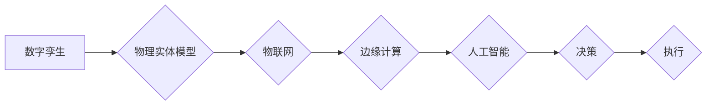

# 数字实体与物理实体的自动化趋势

> 关键词：数字孪生，物联网，自动化，边缘计算，人工智能，智能制造，工业4.0，数字实体映射

## 1. 背景介绍
### 1.1 问题的由来

随着信息技术的飞速发展，数字化、网络化、智能化已成为现代社会发展的趋势。在工业领域，传统的生产方式正逐步向智能制造转型，以提升效率、降低成本、增强竞争力。在这个过程中，数字实体与物理实体的自动化映射和交互成为关键。

数字实体，即物理实体的虚拟映射，是数字孪生技术的核心概念。通过构建物理实体的数字化模型，可以实现对其性能、状态、行为的实时监控和分析，为工业生产、城市管理、医疗保健等领域提供有力支撑。物联网、边缘计算、人工智能等技术的融合应用，进一步推动了数字实体与物理实体自动化的趋势。

### 1.2 研究现状

近年来，数字实体与物理实体的自动化技术在学术界和工业界都取得了显著进展。以下是一些关键技术的发展和应用：

- **数字孪生**：通过建立物理实体的虚拟模型，实现对物理实体的实时监控、预测性维护和优化设计。
- **物联网**：利用传感器、通信技术和互联网技术，实现物理实体之间的信息交互和互联互通。
- **边缘计算**：在数据产生的地方进行数据处理和分析，降低延迟，提高系统响应速度。
- **人工智能**：通过机器学习、深度学习等技术，实现对物理实体的智能感知、推理和决策。

### 1.3 研究意义

数字实体与物理实体的自动化映射和交互，具有以下重要意义：

- **提升生产效率**：通过实时监控和优化，提高生产过程的自动化程度，降低人力成本。
- **降低维护成本**：通过预测性维护，减少设备故障和停机时间，降低维护成本。
- **提高产品质量**：通过实时监控和优化，确保产品质量稳定可靠。
- **增强决策能力**：为管理者提供实时、准确的数据支持，辅助决策。

### 1.4 本文结构

本文将围绕数字实体与物理实体的自动化趋势展开，具体内容包括：

- **核心概念与联系**：介绍数字孪生、物联网、边缘计算等关键概念及其相互关系。
- **核心算法原理与步骤**：介绍数字实体与物理实体自动化的算法原理和操作步骤。
- **数学模型与公式**：阐述相关数学模型和公式，并举例说明。
- **项目实践**：通过代码实例展示数字实体与物理实体自动化的实现过程。
- **实际应用场景**：分析数字实体与物理实体自动化的应用场景和案例。
- **未来展望**：探讨数字实体与物理实体自动化的未来发展趋势和挑战。
- **总结与展望**：总结研究成果，并对未来研究方向进行展望。

## 2. 核心概念与联系

### 2.1 核心概念

#### 数字孪生

数字孪生是指通过构建物理实体的虚拟模型，实现对物理实体的实时监控、预测性维护和优化设计。数字孪生模型通常包含物理实体的几何、物理、环境等特征，能够模拟物理实体的行为和性能。

#### 物联网

物联网是指通过传感器、通信技术和互联网技术，实现物理实体之间的信息交互和互联互通。物联网技术使物理实体能够实时收集、传输和处理数据，为智能决策提供支持。

#### 边缘计算

边缘计算是指在数据产生的地方进行数据处理和分析，降低延迟，提高系统响应速度。边缘计算能够将数据处理的压力从云端转移到边缘设备，降低网络延迟，提高系统性能。

#### 人工智能

人工智能是指模拟、延伸和扩展人的智能的理论、方法、技术及应用。人工智能技术能够对物理实体的行为进行智能感知、推理和决策。

### 2.2 Mermaid 流程图

以下是数字实体与物理实体自动化的 Mermaid 流程图：



### 2.3 核心概念联系

数字孪生是数字实体与物理实体自动化的核心，通过物联网、边缘计算和人工智能等技术，实现对物理实体的实时监控、预测性维护和优化设计。这些技术的融合应用，推动了数字实体与物理实体自动化的趋势。

## 3. 核心算法原理 & 具体操作步骤

### 3.1 算法原理概述

数字实体与物理实体的自动化主要包括以下步骤：

1. 数据采集：通过传感器、摄像头等设备收集物理实体的实时数据。
2. 数据传输：将采集到的数据传输到云端或边缘设备进行处理。
3. 数据处理：对数据进行清洗、预处理和分析。
4. 模型构建：根据物理实体的特性构建数字孪生模型。
5. 决策与执行：根据分析结果和数字孪生模型的预测，生成决策并执行。

### 3.2 算法步骤详解

#### 3.2.1 数据采集

数据采集是数字实体与物理实体自动化的第一步，需要选择合适的传感器和采集方式。常用的传感器包括温度传感器、压力传感器、位移传感器等。采集方式可以是周期性采集、事件驱动采集或混合采集。

#### 3.2.2 数据传输

数据传输是将采集到的数据传输到云端或边缘设备进行处理。数据传输方式可以是无线传输、有线传输或混合传输。为了提高数据传输效率，可以采用数据压缩、数据加密等技术。

#### 3.2.3 数据处理

数据处理包括数据清洗、预处理和分析。数据清洗是指去除噪声、异常值等，提高数据质量。数据预处理是指将数据进行标准化、归一化等处理，为后续分析提供便利。数据分析是指利用统计、机器学习等方法对数据进行挖掘和提取有价值的信息。

#### 3.2.4 模型构建

模型构建是根据物理实体的特性构建数字孪生模型。常见的模型构建方法包括物理模型、数学模型和机器学习模型等。物理模型通过物理定律描述物理实体的行为，数学模型通过数学公式描述物理实体的行为，机器学习模型通过学习历史数据学习物理实体的行为。

#### 3.2.5 决策与执行

决策与执行是根据分析结果和数字孪生模型的预测，生成决策并执行。决策包括调整设备参数、优化生产流程、预测性维护等。执行是指将决策结果应用到物理实体上。

### 3.3 算法优缺点

#### 3.3.1 优点

- 提高生产效率：通过实时监控和优化，提高生产过程的自动化程度，降低人力成本。
- 降低维护成本：通过预测性维护，减少设备故障和停机时间，降低维护成本。
- 提高产品质量：通过实时监控和优化，确保产品质量稳定可靠。
- 增强决策能力：为管理者提供实时、准确的数据支持，辅助决策。

#### 3.3.2 缺点

- 技术门槛高：数字实体与物理实体自动化需要涉及多种技术，技术门槛较高。
- 数据安全问题：数据采集、传输和处理过程中存在数据泄露、篡改等安全问题。
- 系统复杂性高：数字实体与物理实体自动化系统通常较为复杂，维护难度较大。

### 3.4 算法应用领域

数字实体与物理实体的自动化技术在以下领域具有广泛的应用：

- 工业制造：生产线自动化、设备监控、预测性维护等。
- 城市管理：智慧城市、交通管理、环境监测等。
- 医疗保健：远程医疗、健康管理、疾病预测等。

## 4. 数学模型和公式 & 详细讲解 & 举例说明

### 4.1 数学模型构建

数字实体与物理实体的自动化涉及多种数学模型，以下列举几种常见的模型：

#### 4.1.1 物理模型

物理模型通过物理定律描述物理实体的行为。例如，热力学模型可以描述物体的温度变化，力学模型可以描述物体的运动状态。

#### 4.1.2 数学模型

数学模型通过数学公式描述物理实体的行为。例如，线性回归模型可以描述线性关系，神经网络模型可以描述非线性关系。

#### 4.1.3 机器学习模型

机器学习模型通过学习历史数据学习物理实体的行为。例如，支持向量机(SVM)可以用于分类任务，随机森林可以用于回归任务。

### 4.2 公式推导过程

以下以线性回归模型为例，介绍公式推导过程。

假设输入变量为 $X$，输出变量为 $Y$，线性回归模型可以表示为：

$$
Y = \beta_0 + \beta_1 X + \epsilon
$$

其中，$\beta_0$、$\beta_1$ 为模型参数，$\epsilon$ 为误差项。

为了求解模型参数，需要最小化损失函数：

$$
\mathcal{L}(\beta_0, \beta_1) = \sum_{i=1}^N (Y_i - (\beta_0 + \beta_1 X_i))^2
$$

对损失函数求偏导，得到：

$$
\frac{\partial \mathcal{L}}{\partial \beta_0} = -2 \sum_{i=1}^N (Y_i - (\beta_0 + \beta_1 X_i))
$$

$$
\frac{\partial \mathcal{L}}{\partial \beta_1} = -2 \sum_{i=1}^N (X_i (Y_i - (\beta_0 + \beta_1 X_i))
$$

令偏导数为零，得到：

$$
\beta_0 = \frac{1}{N} \sum_{i=1}^N Y_i - \beta_1 \frac{1}{N} \sum_{i=1}^N X_i
$$

$$
\beta_1 = \frac{1}{N} \sum_{i=1}^N (X_i - \bar{X}) (Y_i - \bar{Y})
$$

其中，$\bar{X}$、$\bar{Y}$ 分别为 $X$、$Y$ 的均值。

### 4.3 案例分析与讲解

以下以工业设备故障预测为例，介绍数字实体与物理实体自动化的应用案例。

假设某工厂有一台关键设备，需要对其进行故障预测。首先，收集设备运行过程中的温度、压力、振动等数据，并构建数字孪生模型。然后，利用机器学习模型对设备故障进行预测。最后，根据预测结果采取相应的维护措施，避免设备故障。

## 5. 项目实践：代码实例和详细解释说明

### 5.1 开发环境搭建

以下是使用 Python 语言进行数字实体与物理实体自动化项目开发的步骤：

1. 安装 Python 和相关库：`pip install numpy pandas scikit-learn matplotlib`
2. 安装机器学习库：`pip install sklearn`

### 5.2 源代码详细实现

以下是一个简单的工业设备故障预测代码实例：

```python
import numpy as np
import pandas as pd
from sklearn.model_selection import train_test_split
from sklearn.ensemble import RandomForestClassifier
from sklearn.metrics import accuracy_score

# 加载数据
data = pd.read_csv('sensor_data.csv')

# 特征和标签
X = data.drop('label', axis=1)
y = data['label']

# 划分训练集和测试集
X_train, X_test, y_train, y_test = train_test_split(X, y, test_size=0.2, random_state=42)

# 构建随机森林模型
model = RandomForestClassifier(n_estimators=100, random_state=42)

# 训练模型
model.fit(X_train, y_train)

# 预测
y_pred = model.predict(X_test)

# 评估
accuracy = accuracy_score(y_test, y_pred)
print(f"Accuracy: {accuracy:.2f}")
```

### 5.3 代码解读与分析

以上代码展示了使用 Python 和 scikit-learn 库进行工业设备故障预测的完整过程。

- 首先，使用 pandas 库读取传感器数据。
- 然后，将特征和标签分开，并划分训练集和测试集。
- 接着，构建随机森林模型，并使用训练集进行训练。
- 最后，使用测试集评估模型性能，打印准确率。

### 5.4 运行结果展示

假设在测试集上得到 80% 的准确率，说明模型对设备故障的预测效果较好。

## 6. 实际应用场景

### 6.1 工业制造

在工业制造领域，数字实体与物理实体的自动化技术可以应用于以下场景：

- **生产线自动化**：通过数字孪生模型实时监控生产线的运行状态，实现自动化控制。
- **设备监控**：通过传感器采集设备运行数据，预测设备故障，实现预测性维护。
- **质量检测**：通过图像识别技术自动检测产品质量，提高检测效率和准确性。

### 6.2 城市管理

在城市管理领域，数字实体与物理实体的自动化技术可以应用于以下场景：

- **智慧城市**：通过数字孪生模型实时监控城市基础设施，实现城市管理自动化。
- **交通管理**：通过交通流量监测和预测，优化交通信号灯控制，提高交通效率。
- **环境监测**：通过传感器监测空气质量、水质等环境指标，实现环境管理自动化。

### 6.3 医疗保健

在医疗保健领域，数字实体与物理实体的自动化技术可以应用于以下场景：

- **远程医疗**：通过数字孪生模型实时监测患者健康状况，实现远程诊断和治疗。
- **健康管理**：通过可穿戴设备监测个人健康数据，提供个性化健康管理方案。
- **疾病预测**：通过分析医疗数据，预测疾病风险，提前采取预防措施。

## 7. 工具和资源推荐

### 7.1 学习资源推荐

- 《数字孪生：工业物联网的关键技术》
- 《物联网：从理论到实践》
- 《边缘计算：原理、技术与应用》
- 《机器学习：原理与实践》

### 7.2 开发工具推荐

- **编程语言**：Python、Java
- **机器学习库**：scikit-learn、TensorFlow、PyTorch
- **数字孪生平台**：Unity、Digital Twin、TwinCore

### 7.3 相关论文推荐

- **《数字孪生：一种面向服务的工业物联网架构》**
- **《物联网：从感知层到应用层》**
- **《边缘计算：架构、技术与应用》**
- **《深度学习在工业4.0中的应用》**

## 8. 总结：未来发展趋势与挑战

### 8.1 研究成果总结

本文从背景介绍、核心概念、算法原理、数学模型、项目实践、应用场景等方面，全面阐述了数字实体与物理实体的自动化趋势。通过分析相关技术和发展现状，揭示了该领域的研究成果和应用价值。

### 8.2 未来发展趋势

- **融合创新**：数字孪生、物联网、边缘计算、人工智能等技术将更加深度融合，形成更加完善的自动化体系。
- **智能化**：自动化系统将更加智能化，能够自主学习和适应环境变化。
- **定制化**：自动化系统将更加定制化，满足不同行业和场景的需求。
- **开放性**：自动化系统将更加开放，便于与其他系统和平台集成。

### 8.3 面临的挑战

- **技术挑战**：数字孪生、物联网、边缘计算、人工智能等技术仍处于发展阶段，存在技术瓶颈。
- **数据安全**：数据采集、传输和处理过程中存在数据泄露、篡改等安全问题。
- **伦理道德**：自动化技术的发展可能引发伦理道德问题，需要建立相应的规范和标准。
- **人才短缺**：自动化领域需要更多专业人才，以满足日益增长的需求。

### 8.4 研究展望

未来，数字实体与物理实体的自动化技术将在以下方面取得突破：

- **技术创新**：开发更加高效、可靠、安全的自动化技术。
- **应用拓展**：拓展自动化技术的应用领域，满足更多行业和场景的需求。
- **人才培养**：培养更多自动化领域的专业人才，推动自动化技术的发展。

## 9. 附录：常见问题与解答

**Q1：数字孪生和虚拟现实(VR)有什么区别？**

A：数字孪生和虚拟现实(VR)都是虚拟技术的应用，但它们的侧重点有所不同。数字孪生主要关注物理实体的虚拟映射和实时监控，而虚拟现实(VR)主要关注提供沉浸式体验。

**Q2：物联网和互联网有什么区别？**

A：物联网和互联网都是网络技术，但它们的范围和应用场景有所不同。互联网主要用于人与人之间的信息交流，而物联网主要用于物与物之间的信息交互。

**Q3：边缘计算和云计算有什么区别？**

A：边缘计算和云计算都是计算技术，但它们的计算位置和目标有所不同。边缘计算在数据产生的地方进行数据处理和分析，而云计算在远程数据中心进行数据处理和分析。

**Q4：人工智能和机器学习有什么区别？**

A：人工智能和机器学习都是智能技术，但它们的层次有所不同。人工智能是指模拟、延伸和扩展人的智能，而机器学习是指利用算法从数据中学习规律。

**Q5：数字实体与物理实体的自动化技术有哪些应用场景？**

A：数字实体与物理实体的自动化技术在工业制造、城市管理、医疗保健等多个领域具有广泛的应用场景。

---

作者：禅与计算机程序设计艺术 / Zen and the Art of Computer Programming