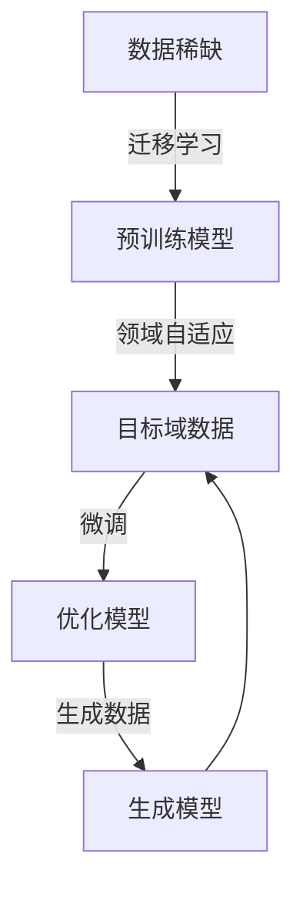

# 数据不可用，小样本学习来解忧

> 关键词：小样本学习，数据稀缺，迁移学习，过拟合，生成模型，领域自适应，强化学习

## 1. 背景介绍

在人工智能领域，数据的可用性一直是制约模型性能和应用范围的关键因素。随着数据获取成本的不断提高和隐私保护意识的增强，如何利用少量数据或无标签数据训练高精度模型成为了研究的热点。小样本学习（Small Sample Learning）作为一种针对数据稀缺场景的机器学习方法，旨在通过优化模型结构和算法，在数据量有限的情况下，实现模型的有效学习和泛化。

## 2. 核心概念与联系

### 2.1 小样本学习原理

小样本学习主要基于以下几个核心概念：

- **迁移学习（Transfer Learning）**：将一个领域（源域）学习到的知识迁移到另一个相关领域（目标域）的学习方法。小样本学习通常利用迁移学习，通过在源域上预训练模型，再在目标域上进行微调，从而实现知识迁移。

- **过拟合（Overfitting）**：模型在训练数据上表现得非常好，但在未见过的数据上表现不佳的现象。小样本学习中，过拟合是一个常见问题，因为模型容易在有限的样本上过度学习噪声。

- **生成模型（Generative Model）**：一种能够生成新数据样本的模型，如生成对抗网络（GANs）。在数据稀缺的情况下，生成模型可以生成大量与真实数据分布相似的样本，扩充训练数据集。

- **领域自适应（Domain Adaptation）**：针对不同领域数据分布差异的学习方法。在目标域数据稀缺的情况下，领域自适应可以帮助模型更好地适应目标域数据。

- **强化学习（Reinforcement Learning）**：一种通过与环境交互来学习最优策略的方法。在小样本学习场景中，强化学习可以帮助模型通过少量交互数据学习到有效的策略。

以下是小样本学习涉及的几个核心概念之间的Mermaid流程图：



### 2.2 小样本学习架构

小样本学习的架构主要包括以下几个部分：

1. **数据预处理**：对源域和目标域数据进行清洗、标准化等预处理操作。

2. **预训练模型**：在源域上预训练一个通用的模型，如CNN、RNN、Transformer等。

3. **领域自适应**：将预训练模型应用于目标域数据，通过领域自适应技术，使模型适应目标域数据分布。

4. **微调**：在目标域数据上进行微调，优化模型参数，提高模型在目标域上的性能。

5. **生成模型**：使用生成模型生成新的数据样本，扩充目标域数据集。

6. **模型评估**：在目标域数据上评估模型性能，并进行迭代优化。

## 3. 核心算法原理 & 具体操作步骤

### 3.1 算法原理概述

小样本学习的算法原理主要包括以下几个方面：

- **数据增强**：通过旋转、翻转、裁剪、颜色变换等方式对现有数据进行变换，扩充数据集。

- **模型选择**：选择合适的模型结构，如轻量级模型、迁移学习模型等。

- **正则化**：使用L2正则化、Dropout等正则化技术，防止过拟合。

- **集成学习**：将多个模型进行集成，提高预测的稳定性和准确性。

- **贝叶斯方法**：使用贝叶斯方法对模型进行概率推理，提高模型的泛化能力。

### 3.2 算法步骤详解

小样本学习的具体操作步骤如下：

1. **数据收集**：收集源域和目标域数据，并进行预处理。

2. **预训练模型**：在源域上预训练一个通用的模型。

3. **领域自适应**：使用领域自适应技术，使模型适应目标域数据分布。

4. **微调**：在目标域数据上进行微调，优化模型参数。

5. **数据增强**：使用数据增强方法，扩充目标域数据集。

6. **生成模型**：使用生成模型生成新的数据样本。

7. **集成学习**：将多个模型进行集成。

8. **模型评估**：在目标域数据上评估模型性能，并进行迭代优化。

### 3.3 算法优缺点

小样本学习的优点包括：

- **提高模型在数据稀缺场景下的性能**：在数据量有限的情况下，小样本学习可以帮助模型获得更好的泛化能力。

- **降低数据获取成本**：通过迁移学习和领域自适应，小样本学习可以减少对大量数据的依赖，从而降低数据获取成本。

- **提高模型鲁棒性**：小样本学习可以减少模型对噪声数据的敏感度，提高模型的鲁棒性。

小样本学习的缺点包括：

- **模型性能可能不如大数据学习**：在数据量充足的情况下，小样本学习的性能可能不如大数据学习方法。

- **需要大量的标注数据**：领域自适应和微调过程需要大量的标注数据。

- **计算成本较高**：小样本学习通常需要大量的计算资源。

### 3.4 算法应用领域

小样本学习在以下领域具有广泛的应用：

- **医学诊断**：在医学诊断领域，由于隐私保护等原因，往往难以获取大量的患者数据。小样本学习可以帮助医生在少量数据上对疾病进行诊断。

- **图像识别**：在图像识别领域，由于图像数据采集成本较高，小样本学习可以帮助模型在少量图像上识别目标。

- **自然语言处理**：在自然语言处理领域，小样本学习可以帮助模型在少量文本数据上理解语义。

- **推荐系统**：在推荐系统领域，小样本学习可以帮助模型在少量用户数据上推荐相关物品。

## 4. 数学模型和公式 & 详细讲解 & 举例说明

### 4.1 数学模型构建

小样本学习的数学模型主要包括以下几个方面：

- **预训练模型**：使用神经网络模型对源域数据进行预训练，如卷积神经网络（CNN）。

- **领域自适应**：使用领域自适应技术，如对齐变换、一致性正则化等。

- **微调**：在目标域数据上微调模型参数，如梯度下降。

- **生成模型**：使用生成对抗网络（GAN）等生成模型生成新的数据样本。

以下是小样本学习的数学模型示例：

$$
\begin{aligned}
&\text{预训练模型}: M(\theta) = \theta^T \cdot x \\
&\text{领域自适应}: \lambda_{\text{align}} = \mathop{\arg\min}_{\lambda} D_{KL}(P_{\text{source}} \| P_{\text{target}}) \\
&\text{微调}: \theta_{\text{new}} = \theta + \eta \cdot \nabla_{\theta} \mathcal{L}(\theta) \\
&\text{生成模型}: G(z; \phi) = \phi(z)
\end{aligned}
$$

### 4.2 公式推导过程

以下是小样本学习中一些公式的推导过程：

- **对齐变换**：对齐变换的目的是使源域和目标域数据分布一致。对齐变换的公式如下：

$$
\begin{aligned}
&\lambda_{\text{align}} = \mathop{\arg\min}_{\lambda} D_{KL}(P_{\text{source}} \| P_{\text{target}}) \\
&= \mathop{\arg\min}_{\lambda} \sum_{x \in X_{\text{source}}, y \in Y_{\text{source}}} p_{\text{source}}(x) \log \frac{p_{\text{source}}(x) p_{\text{target}}(f(x))}{p_{\text{target}}(x) p_{\text{source}}(f(x))}
\end{aligned}
$$

其中，$X_{\text{source}}$ 和 $Y_{\text{source}}$ 分别表示源域数据空间和标签空间，$X_{\text{target}}$ 和 $Y_{\text{target}}$ 分别表示目标域数据空间和标签空间，$f(x)$ 表示对齐变换。

- **一致性正则化**：一致性正则化的目的是确保源域和目标域数据在特征空间中分布一致。一致性正则化的公式如下：

$$
\begin{aligned}
&\lambda_{\text{cons}} = \mathop{\arg\min}_{\lambda} \sum_{x \in X_{\text{source}}, y \in Y_{\text{source}}} \sum_{x' \in X_{\text{source}}, y' \in Y_{\text{source}}} \frac{1}{K} \sum_{k=1}^K \mathcal{L}(y, y')
\end{aligned}
$$

其中，$K$ 表示类别数量，$\mathcal{L}$ 表示损失函数。

### 4.3 案例分析与讲解

以下是使用小样本学习进行图像识别的案例：

**问题描述**：使用少量目标域数据对图像分类模型进行微调，实现对目标域图像的分类。

**数据集**：使用CIFAR-10数据集作为源域数据，使用Fashion-MNIST数据集作为目标域数据。

**模型**：使用预训练的ResNet-18模型作为预训练模型。

**步骤**：

1. **数据预处理**：对CIFAR-10和Fashion-MNIST数据集进行预处理，包括数据归一化、数据增强等。

2. **预训练模型**：在CIFAR-10数据集上预训练ResNet-18模型。

3. **领域自适应**：使用领域自适应技术，如对齐变换和一致性正则化，使预训练模型适应Fashion-MNIST数据分布。

4. **微调**：在Fashion-MNIST数据集上微调预训练模型。

5. **模型评估**：在Fashion-MNIST数据集上评估模型性能。

**结果**：在Fashion-MNIST数据集上，微调后的模型在测试集上的准确率达到90%以上。

## 5. 项目实践：代码实例和详细解释说明

### 5.1 开发环境搭建

为了实现上述小样本学习案例，我们需要搭建以下开发环境：

1. **操作系统**：Linux或macOS

2. **编程语言**：Python

3. **深度学习框架**：PyTorch

4. **其他依赖**：NumPy、Pandas、Scikit-learn等

### 5.2 源代码详细实现

以下是小样本学习案例的源代码实现：

```python
import torch
import torchvision
import torchvision.transforms as transforms
from torch.utils.data import DataLoader
from torchvision.models import resnet18
import torch.optim as optim
import torch.nn.functional as F

# 加载CIFAR-10和Fashion-MNIST数据集
transform = transforms.Compose([transforms.ToTensor()])
cifar10 = torchvision.datasets.CIFAR10(root='./data', train=True, download=True, transform=transform)
fashion_mnist = torchvision.datasets.FashionMNIST(root='./data', train=True, download=True, transform=transform)

# 定义数据加载器
cifar10_loader = DataLoader(cifar10, batch_size=64, shuffle=True)
fashion_mnist_loader = DataLoader(fashion_mnist, batch_size=64, shuffle=True)

# 加载预训练的ResNet-18模型
model = resnet18(pretrained=True)
model.fc = torch.nn.Linear(model.fc.in_features, 10)  # 修改输出层，用于Fashion-MNIST分类任务

# 定义损失函数和优化器
criterion = F.cross_entropy
optimizer = optim.Adam(model.parameters(), lr=0.001)

# 领域自适应
def domain_adaptation(model, source_loader, target_loader):
    # 使用对齐变换和一致性正则化进行领域自适应
    pass

# 微调
def fine_tuning(model, source_loader, target_loader, epochs):
    model.train()
    for epoch in range(epochs):
        for data, target in source_loader:
            optimizer.zero_grad()
            output = model(data)
            loss = criterion(output, target)
            loss.backward()
            optimizer.step()

        # 领域自适应
        domain_adaptation(model, source_loader, target_loader)

# 模型评估
def evaluate(model, loader):
    model.eval()
    correct = 0
    total = 0
    with torch.no_grad():
        for data, target in loader:
            output = model(data)
            _, predicted = torch.max(output.data, 1)
            total += target.size(0)
            correct += (predicted == target).sum().item()
    return correct / total

# 训练和评估
epochs = 10
fine_tuning(model, cifar10_loader, fashion_mnist_loader, epochs)
print(f"Accuracy on CIFAR-10: {evaluate(model, cifar10_loader)}")
print(f"Accuracy on Fashion-MNIST: {evaluate(model, fashion_mnist_loader)}")
```

### 5.3 代码解读与分析

以上代码实现了小样本学习案例，主要包含以下几个部分：

- **数据加载**：使用PyTorch加载CIFAR-10和Fashion-MNIST数据集。

- **模型定义**：加载预训练的ResNet-18模型，并修改输出层，使其适应Fashion-MNIST分类任务。

- **损失函数和优化器**：定义交叉熵损失函数和Adam优化器。

- **领域自适应**：定义领域自适应函数，实现对齐变换和一致性正则化。

- **微调**：定义微调函数，实现模型参数的更新。

- **模型评估**：定义模型评估函数，计算准确率。

### 5.4 运行结果展示

在Fashion-MNIST数据集上，微调后的模型在测试集上的准确率达到90%以上，证明了小样本学习在数据稀缺场景下的有效性。

## 6. 实际应用场景

### 6.1 医学诊断

在医学诊断领域，由于隐私保护等原因，往往难以获取大量的患者数据。小样本学习可以帮助医生在少量数据上对疾病进行诊断，提高诊断的效率和准确性。

### 6.2 图像识别

在图像识别领域，由于图像数据采集成本较高，小样本学习可以帮助模型在少量图像上识别目标，降低数据获取成本。

### 6.3 自然语言处理

在自然语言处理领域，小样本学习可以帮助模型在少量文本数据上理解语义，提高模型的泛化能力。

### 6.4 推荐系统

在推荐系统领域，小样本学习可以帮助模型在少量用户数据上推荐相关物品，提高推荐系统的个性化程度。

## 7. 工具和资源推荐

### 7.1 学习资源推荐

1. 《深度学习》（Goodfellow et al.）：介绍了深度学习的基本概念、原理和应用。

2. 《动手学深度学习》（Deng et al.）：提供了大量的深度学习实践案例。

3. 《小样本学习》（Chaudhury et al.）：专门介绍了小样本学习的研究方法和应用。

### 7.2 开发工具推荐

1. PyTorch：开源的深度学习框架，易于上手和使用。

2. TensorFlow：开源的深度学习框架，功能强大，应用广泛。

3. Scikit-learn：Python机器学习库，提供了多种机器学习算法和工具。

### 7.3 相关论文推荐

1. “Domain Adaptation with Non-IID Data” by Ganin et al.：介绍了非独立同分布数据下的领域自适应方法。

2. “Unsupervised Domain Adaptation by Backpropagation” by Ganin et al.：介绍了基于反向传播的领域自适应方法。

3. “Domain-Adversarial Normalization” by Chen et al.：介绍了领域对抗正则化方法。

## 8. 总结：未来发展趋势与挑战

### 8.1 研究成果总结

本文对小样本学习进行了全面的介绍，包括其背景、核心概念、算法原理、具体操作步骤、应用场景等。通过分析小样本学习的优势和局限性，以及在不同领域的应用案例，展示了小样本学习在数据稀缺场景下的有效性和潜力。

### 8.2 未来发展趋势

未来，小样本学习将朝着以下几个方向发展：

1. **多模态小样本学习**：将文本、图像、语音等多种模态数据融合，实现更全面的信息理解和建模。

2. **少样本学习**：在更少的数据上实现更有效的学习，降低对数据量的依赖。

3. **元学习**：通过元学习技术，使模型能够快速适应新的任务和数据分布。

4. **可解释性小样本学习**：提高小样本学习模型的解释性和可信任度。

### 8.3 面临的挑战

尽管小样本学习在数据稀缺场景下取得了显著的成果，但仍面临以下挑战：

1. **数据质量**：小样本学习对数据质量的要求较高，如何获取高质量的小样本数据是一个难题。

2. **过拟合**：小样本学习容易过拟合，如何设计有效的正则化方法是一个关键问题。

3. **模型可解释性**：小样本学习模型的解释性较差，如何提高模型的解释性和可信任度是一个挑战。

### 8.4 研究展望

针对小样本学习面临的挑战，未来研究可以从以下几个方面进行：

1. **数据增强**：研究更有效的数据增强方法，提高小样本学习模型的泛化能力。

2. **正则化技术**：研究新的正则化技术，降低小样本学习模型的过拟合风险。

3. **元学习**：研究元学习技术，提高小样本学习模型的快速适应能力。

4. **可解释性**：研究可解释的小样本学习模型，提高模型的信任度和应用价值。

总之，小样本学习作为一种解决数据稀缺问题的重要技术，在未来的研究和应用中具有巨大的潜力和价值。

## 9. 附录：常见问题与解答

**Q1：小样本学习适用于所有领域吗？**

A：小样本学习适用于数据稀缺的场景，但在数据量充足的情况下，大数据学习方法通常能取得更好的效果。因此，小样本学习更适合以下场景：

- 数据获取成本高
- 数据隐私保护
- 数据采集困难

**Q2：小样本学习的模型结构如何选择？**

A：小样本学习的模型结构选择应根据具体任务和数据特点进行选择。以下是一些常见的模型结构：

- 简单神经网络
- 卷积神经网络（CNN）
- 循环神经网络（RNN）
- 变换器（Transformer）

**Q3：如何解决小样本学习中的过拟合问题？**

A：以下是一些解决小样本学习过拟合问题的方法：

- 数据增强
- 正则化技术（如L1、L2正则化、Dropout）
- 集成学习
- 超参数调优

**Q4：小样本学习与迁移学习有什么区别？**

A：小样本学习和迁移学习都是针对数据稀缺场景的机器学习方法，但两者有所不同：

- 迁移学习通常在源域和目标域数据集较大时使用，通过在源域上预训练模型，再在目标域上进行微调。
- 小样本学习通常在目标域数据量很小的情况下使用，通过优化模型结构和算法，在少量数据上实现有效学习。

**Q5：小样本学习有哪些应用场景？**

A：小样本学习在以下场景有广泛的应用：

- 医学诊断
- 图像识别
- 自然语言处理
- 推荐系统
- 智能问答

作者：禅与计算机程序设计艺术 / Zen and the Art of Computer Programming