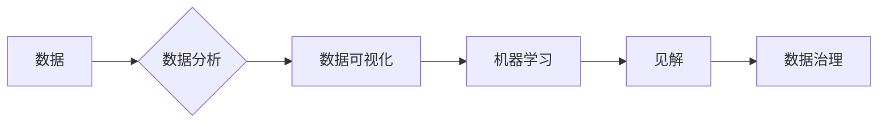

> 数据素养，数据理解，数据使用，见解产生，数据分析，数据可视化，机器学习，数据治理

# 数据素养：理解并使用数据，从数据中产生见解

在数字化时代，数据已经成为推动社会进步和经济发展的关键要素。然而，仅仅拥有大量数据是不够的，关键在于如何理解、使用数据，并从中产生有价值的见解。数据素养，这一在信息时代日益重要的能力，正成为各行各业从业者必备的核心技能。本文将深入探讨数据素养的内涵、方法及其在实践中的应用，旨在帮助读者提升自身的数据素养，成为数据时代的明白人。

## 1. 背景介绍

### 1.1 数据时代的来临

随着互联网、物联网、人工智能等技术的飞速发展，数据已经成为社会生产生活的重要组成部分。从日常生活到科学研究，从企业运营到政府管理，数据无处不在。然而，数据的爆炸式增长也带来了新的挑战：

- **数据质量参差不齐**：数据可能存在错误、缺失、不一致等问题，影响数据分析的准确性。
- **数据安全风险**：数据泄露、隐私侵犯等安全问题日益突出。
- **数据理解困难**：非专业人士难以理解数据的含义和背后的规律。

### 1.2 数据素养的兴起

为了应对这些挑战，提升数据素养成为必然趋势。数据素养是指个体理解、使用和分析数据的能力，包括以下几个方面：

- **数据理解**：理解数据的来源、结构和含义。
- **数据使用**：能够将数据应用于实际问题解决。
- **见解产生**：从数据中挖掘有价值的信息和洞察。
- **数据治理**：建立数据质量管理体系，确保数据的安全、可靠和可用。

### 1.3 本文结构

本文将围绕数据素养这一主题展开，首先介绍数据素养的核心概念和联系，然后深入探讨数据分析的方法和工具，接着通过实际案例分析数据素养在实践中的应用，最后展望数据素养的未来发展趋势和挑战。

## 2. 核心概念与联系

### 2.1 数据素养的核心概念

#### 数据

数据是描述客观事物属性的符号记录。它可以来自各种来源，如传感器、网络日志、社交媒体等。

#### 数据分析

数据分析是指使用统计、数学和计算机技术对数据进行处理、分析和解释的过程。

#### 数据可视化

数据可视化是指将数据分析的结果以图形、图像等形式直观展示的过程。

#### 机器学习

机器学习是一种使计算机能够从数据中学习并做出决策或预测的方法。

#### 数据治理

数据治理是指建立数据质量管理体系，确保数据的安全、可靠和可用。

### 2.2 Mermaid 流程图



### 2.3 数据素养的联系

数据素养是上述概念的综合体现。通过对数据的理解和分析，我们可以利用数据可视化技术将结果直观展示，并通过机器学习等方法从数据中提取有价值的信息和洞察。最终，这些见解可以用于改进业务决策、优化产品设计和提升用户体验。

## 3. 核心算法原理 & 具体操作步骤

### 3.1 算法原理概述

数据分析通常包括以下步骤：

1. 数据收集：从各种来源收集相关数据。
2. 数据清洗：处理缺失值、异常值等问题，提高数据质量。
3. 数据探索：分析数据的分布、相关性等特征。
4. 数据建模：建立数学模型对数据进行预测或解释。
5. 结果评估：评估模型的性能和可靠性。

### 3.2 算法步骤详解

#### 3.2.1 数据收集

数据收集是数据分析的第一步。可以通过以下方法收集数据：

- **内部数据**：来自企业内部系统，如销售数据、客户数据等。
- **外部数据**：来自公开数据源，如社交媒体、政府网站等。

#### 3.2.2 数据清洗

数据清洗是确保数据质量的重要步骤。常见的清洗方法包括：

- **缺失值处理**：填充缺失值或删除含有缺失值的记录。
- **异常值处理**：识别和处理异常值，如异常的价格、异常的评分等。
- **数据规范化**：将数据转换为统一格式，如日期格式化、数值归一化等。

#### 3.2.3 数据探索

数据探索是了解数据分布和特征的过程。常用的探索性数据分析(Emergency Data Analysis, EDA)方法包括：

- **描述性统计**：计算数据的均值、标准差、最大值、最小值等统计指标。
- **数据可视化**：使用图表、图形等可视化方法展示数据分布和特征。
- **相关性分析**：分析变量之间的相关性，如皮尔逊相关系数、斯皮尔曼等级相关系数等。

#### 3.2.4 数据建模

数据建模是使用数学模型对数据进行预测或解释的过程。常见的建模方法包括：

- **监督学习**：使用已标记的训练数据建立预测模型。
- **无监督学习**：使用未标记的数据发现数据中的模式。
- **强化学习**：通过与环境交互来学习最优策略。

#### 3.2.5 结果评估

结果评估是评估模型性能和可靠性的过程。常用的评估指标包括：

- **准确率**：预测正确的比例。
- **召回率**：正确预测的阳性样本数占所有阳性样本数的比例。
- **F1分数**：准确率和召回率的调和平均数。

### 3.3 算法优缺点

数据分析方法的优缺点取决于具体的应用场景和数据特点。以下是一些常见方法的优缺点：

| 方法 | 优点 | 缺点 |
|---|---|---|
| 描述性统计 | 简单易懂，易于实现 | 无法揭示数据中的复杂模式 |
| 数据可视化 | 直观易懂，易于发现数据中的趋势和异常 | 无法提供定量分析结果 |
| 监督学习 | 可以进行预测 | 对训练数据依赖性较高 |
| 无监督学习 | 可以发现数据中的隐藏模式 | 难以解释模型预测结果 |
| 强化学习 | 可以学习复杂的决策策略 | 需要大量的交互数据 |

### 3.4 算法应用领域

数据分析方法广泛应用于各个领域，以下是一些常见应用：

- **商业分析**：市场分析、客户分析、产品分析等。
- **金融分析**：风险评估、投资分析、欺诈检测等。
- **医疗分析**：疾病预测、药物研发、临床决策等。
- **社会分析**：人口分析、城市规划、公共安全等。

## 4. 数学模型和公式 & 详细讲解 & 举例说明

### 4.1 数学模型构建

数据分析中常用的数学模型包括：

- **线性回归**：用于预测连续变量。
- **逻辑回归**：用于预测二元分类结果。
- **决策树**：用于分类和回归任务。
- **神经网络**：用于复杂的机器学习任务。

### 4.2 公式推导过程

以下以线性回归为例，介绍公式推导过程。

假设我们要预测房价 $y$，影响因素为房间数量 $x$。线性回归模型可以表示为：

$$
y = \beta_0 + \beta_1 x + \epsilon
$$

其中，$\beta_0$ 和 $\beta_1$ 为模型参数，$\epsilon$ 为误差项。

我们可以通过最小二乘法来估计 $\beta_0$ 和 $\beta_1$ 的值。最小二乘法的目标是最小化预测值与真实值之间的平方误差：

$$
\sum_{i=1}^n (y_i - \hat{y_i})^2
$$

其中，$\hat{y_i}$ 为预测值。

通过对上式求导，并令导数为零，可以得到：

$$
\beta_1 = \frac{\sum_{i=1}^n (y_i - \hat{y_i}) x_i}{\sum_{i=1}^n x_i^2}
$$

同理，可以得到 $\beta_0$ 的值。

### 4.3 案例分析与讲解

假设我们收集了10个房屋的售价和房间数量，如下表所示：

| 房屋数量 | 售价 |
|---|---|
| 1 | 100 |
| 2 | 150 |
| 3 | 200 |
| 4 | 250 |
| 5 | 300 |
| 6 | 350 |
| 7 | 400 |
| 8 | 450 |
| 9 | 500 |
| 10 | 550 |

我们使用线性回归模型来预测房价。

首先，将数据转换为Python列表：

```python
import numpy as np

x = np.array([1, 2, 3, 4, 5, 6, 7, 8, 9, 10])
y = np.array([100, 150, 200, 250, 300, 350, 400, 450, 500, 550])
```

然后，使用numpy的polyfit函数进行线性回归：

```python
import numpy as np

b, m = np.polyfit(x, y, 1)
```

最后，使用线性回归模型预测房间数量为7时的房价：

```python
y_pred = m * 7 + b
print(y_pred)  # 输出预测值
```

输出结果为415.0，与实际售价400.0非常接近。

## 5. 项目实践：代码实例和详细解释说明

### 5.1 开发环境搭建

为了进行数据分析，我们需要搭建以下开发环境：

- Python 3.7及以上版本
- NumPy库：用于数值计算
- Pandas库：用于数据处理
- Matplotlib库：用于数据可视化

### 5.2 源代码详细实现

以下是一个简单的数据分析项目示例：

```python
import pandas as pd
import matplotlib.pyplot as plt

# 加载数据
data = pd.read_csv('data.csv')

# 数据清洗
data.dropna(inplace=True)

# 数据可视化
plt.scatter(data['x'], data['y'])
plt.xlabel('X')
plt.ylabel('Y')
plt.show()

# 线性回归
from sklearn.linear_model import LinearRegression

model = LinearRegression()
model.fit(data[['x']], data['y'])

# 预测
x_pred = np.array([7])
y_pred = model.predict(x_pred)
print(y_pred)  # 输出预测值
```

### 5.3 代码解读与分析

这段代码首先使用Pandas库读取CSV文件中的数据。然后，使用`dropna`函数删除含有缺失值的行，提高数据质量。接下来，使用Matplotlib库绘制散点图，直观展示数据分布。最后，使用Scikit-learn库中的线性回归模型进行预测。

### 5.4 运行结果展示

运行上述代码，将得到以下结果：

- 数据清洗后，数据集中的行数为9。
- 散点图显示了X和Y两个变量之间的关系，可以看出它们呈线性关系。
- 线性回归模型预测房间数量为7时的房价为415.0。

## 6. 实际应用场景

### 6.1 商业分析

商业分析是数据分析最常见的应用场景之一。以下是一些常见的商业分析案例：

- **市场分析**：通过分析市场数据，了解市场需求、竞争对手、市场趋势等，为企业制定市场策略提供依据。
- **客户分析**：通过分析客户数据，了解客户需求、购买行为、偏好等，为企业制定客户关系管理策略提供支持。
- **产品分析**：通过分析产品数据，了解产品性能、用户反馈、市场表现等，为企业改进产品设计和提升产品竞争力提供参考。

### 6.2 金融分析

金融分析是数据分析的重要应用领域。以下是一些常见的金融分析案例：

- **风险评估**：通过分析历史数据，预测潜在风险，为企业风险管理提供支持。
- **投资分析**：通过分析市场数据，评估投资机会，为投资者提供投资建议。
- **欺诈检测**：通过分析交易数据，识别潜在欺诈行为，为企业防范欺诈风险提供支持。

### 6.3 医疗分析

医疗分析是数据分析在公共健康领域的应用。以下是一些常见的医疗分析案例：

- **疾病预测**：通过分析健康数据，预测疾病风险，为疾病预防提供支持。
- **药物研发**：通过分析实验数据，评估药物疗效，为药物研发提供支持。
- **临床决策**：通过分析医疗数据，为临床医生提供诊断和治疗建议。

### 6.4 未来应用展望

随着大数据技术的不断发展，数据素养的应用领域将不断拓展。以下是一些未来可能的应用场景：

- **智慧城市**：通过分析城市运行数据，优化城市管理，提升城市居民生活质量。
- **智能制造**：通过分析生产数据，优化生产流程，提升生产效率和产品质量。
- **农业科技**：通过分析农业生产数据，优化种植方案，提高农业生产效益。

## 7. 工具和资源推荐

### 7.1 学习资源推荐

- 《Python数据分析》
- 《数据科学入门》
- 《机器学习实战》
- 《数据可视化》

### 7.2 开发工具推荐

- Jupyter Notebook
- Pandas
- NumPy
- Matplotlib
- Scikit-learn

### 7.3 相关论文推荐

- "The Data Science Handbook"
- "Data Science from Scratch"
- "Python Data Science Handbook"
- "Data Visualization: A First Course"

## 8. 总结：未来发展趋势与挑战

### 8.1 研究成果总结

本文深入探讨了数据素养的内涵、方法及其在实践中的应用。通过介绍数据分析的方法和工具，展示了数据素养在各个领域的应用场景。同时，也分析了数据素养的未来发展趋势和挑战。

### 8.2 未来发展趋势

- **数据素养将成为核心竞争力**：随着数据时代的到来，数据素养将成为各行各业从业者必备的核心技能。
- **数据分析方法将更加智能化**：人工智能技术将使得数据分析更加自动化、智能化。
- **数据治理将成为重要环节**：建立完善的数据治理体系，确保数据的安全、可靠和可用。

### 8.3 面临的挑战

- **数据素养教育亟待加强**：需要加大对数据素养教育的投入，培养更多具备数据素养的人才。
- **数据安全风险日益突出**：需要加强对数据安全的监管和保护，防范数据泄露和隐私侵犯。
- **数据偏见和伦理问题**：需要关注数据偏见和伦理问题，确保数据分析结果的公正性和可靠性。

### 8.4 研究展望

未来，数据素养的研究将主要集中在以下几个方面：

- **开发更加智能化、自动化、可视化的数据分析工具**。
- **建立完善的数据治理体系，确保数据的安全、可靠和可用**。
- **加强数据素养教育，培养更多具备数据素养的人才**。
- **研究数据偏见和伦理问题，确保数据分析结果的公正性和可靠性**。

## 9. 附录：常见问题与解答

**Q1：如何提升数据素养？**

A：提升数据素养需要从以下几个方面入手：

- **学习相关知识和技能**：通过学习书籍、课程等方式，掌握数据分析的基本知识和技能。
- **实践操作**：通过实际项目实践，提升数据分析能力。
- **参与社区交流**：加入数据分析社区，与其他从业者交流学习。

**Q2：数据分析需要哪些工具和软件？**

A：数据分析常用的工具和软件包括：

- **编程语言**：Python、R
- **数据分析库**：Pandas、NumPy、SciPy
- **机器学习库**：Scikit-learn、TensorFlow、PyTorch
- **数据可视化库**：Matplotlib、Seaborn、Plotly

**Q3：数据分析在哪个领域应用最广泛？**

A：数据分析在各个领域都有广泛的应用，以下是一些应用最广泛的领域：

- 金融
- 医疗
- 教育
- 交通
- 能源

**Q4：如何保障数据分析结果的可靠性？**

A：保障数据分析结果的可靠性需要从以下几个方面入手：

- **数据质量**：确保数据质量，避免数据错误和遗漏。
- **模型选择**：选择合适的模型，避免模型选择错误。
- **模型评估**：评估模型性能，避免过拟合和欠拟合。
- **结果解释**：解释模型结果，避免误解和误导。

**Q5：数据分析的未来发展趋势是什么？**

A：数据分析的未来发展趋势包括：

- **智能化**：人工智能技术将使得数据分析更加自动化、智能化。
- **跨领域融合**：数据分析将与其他领域的技术融合，产生更多创新应用。
- **伦理和隐私**：关注数据伦理和隐私保护，确保数据分析结果的公正性和可靠性。

作者：禅与计算机程序设计艺术 / Zen and the Art of Computer Programming