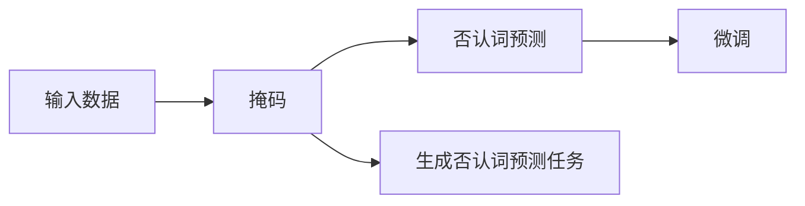

                 

# Transformer大模型实战 了解ELECTRA

> 关键词：大模型,Transformer,ELECTRA,自监督学习,微调,Fine-Tuning

## 1. 背景介绍

### 1.1 问题由来

Transformer模型自从推出以来，迅速成为了自然语言处理（NLP）领域的主流架构，其能够通过大规模自监督学习来预训练语言模型，从而在各种NLP任务上取得了惊人的性能。然而，预训练过程耗时较长，且需要大量的计算资源和大量的标注数据，这在某些情况下是难以实现的。因此，研究者们纷纷探索出了许多优化方法来提高预训练效率和模型性能。

### 1.2 问题核心关键点

ELECTRA（Exploiting Language by Predicting Denied Tokens）算法正是在这种背景下提出的，它是一种基于自监督学习的预训练方法，能够在保留Transformer结构的基础上，大幅度提高预训练效率和模型性能。ELECTRA算法通过预测“否认”（即用掩码遮蔽）的词来训练模型，而非直接预测目标词。这种训练方式使得模型能够更加高效地利用无标注数据，并获得了不错的效果。

### 1.3 问题研究意义

ELECTRA算法的提出，不仅提高了预训练模型的效率和性能，更重要的是，它提供了一种新的思路来优化深度学习模型的训练方式，从而在学术界和工业界引起了广泛的关注。通过理解ELECTRA算法，可以更深入地了解Transformer模型的工作原理，为进一步研究深度学习模型的优化提供有益的参考。

## 2. 核心概念与联系

### 2.1 核心概念概述

为了更好地理解ELECTRA算法，我们首先需要介绍几个关键概念：

- **Transformer模型**：一种基于注意力机制的深度神经网络结构，广泛应用于自然语言处理任务。
- **自监督学习**：利用无标注数据来训练模型，通过某些特定的方法自动生成有意义的标注。
- **微调（Fine-Tuning）**：在大规模预训练的基础上，使用下游任务的数据集对模型进行微调，使其能够适应特定任务。
- **掩码**：将输入数据中的某些词随机遮蔽，从而生成一个无标注的训练样本。
- **否认词预测**：给定一个被遮蔽的词，模型需要预测这个被否认的词是什么。

### 2.2 核心概念的逻辑关系

ELECTRA算法的核心思想是通过预测否认词来训练模型，以下是ELECTRA算法的主要逻辑流程：



上述流程展示了ELECTRA算法的基本逻辑：输入数据被随机遮蔽（掩码），然后模型需要预测被否认的词。这样，模型通过大量否认词预测任务来学习语言规则和语义信息，从而进行微调。

## 3. 核心算法原理 & 具体操作步骤
### 3.1 算法原理概述

ELECTRA算法的核心原理是在无标注数据上训练一个预训练模型，通过预测否认词来生成一个否认词预测任务。这些否认词预测任务将用于微调模型，从而使得模型能够适应特定的下游任务。

### 3.2 算法步骤详解

ELECTRA算法的具体训练步骤如下：

1. **掩码生成**：对输入数据中的词进行随机掩码，生成否认词预测任务。
2. **否认词预测**：模型预测被否认的词，训练过程与传统的自监督学习任务（如语言模型）类似。
3. **微调模型**：使用下游任务的标注数据，对模型进行微调，使其能够适应特定任务。

### 3.3 算法优缺点

ELECTRA算法的优点包括：

- **高效性**：ELECTRA算法通过预测否认词来训练模型，可以大幅度提高预训练效率，减少计算资源消耗。
- **高效利用数据**：ELECTRA算法利用了无标注数据，减少了标注成本，提升了模型泛化能力。
- **简洁性**：ELECTRA算法的实现相对简单，易于理解和部署。

然而，ELECTRA算法也存在一些缺点：

- **对标注数据的依赖**：虽然ELECTRA算法可以高效利用无标注数据，但在微调阶段仍然需要大量的标注数据。
- **解释性不足**：由于否认词预测任务与下游任务之间的关联性，ELECTRA模型的解释性相对较弱。

### 3.4 算法应用领域

ELECTRA算法适用于各种NLP任务，包括文本分类、命名实体识别、文本生成、问答系统等。特别是在需要高效利用无标注数据的任务中，ELECTRA算法表现出显著的优势。

## 4. 数学模型和公式 & 详细讲解  
### 4.1 数学模型构建

ELECTRA算法基于Transformer模型，其数学模型可以表示为：

$$
P(x|\theta) = \prod_{i=1}^T \sigma(\mathbf{W}_x^T \mathbf{X}_i + \mathbf{b}_x)
$$

其中，$x$ 表示输入数据，$T$ 表示序列长度，$\sigma$ 为激活函数，$\mathbf{W}_x$ 和 $\mathbf{b}_x$ 为可学习参数。

### 4.2 公式推导过程

ELECTRA算法通过预测否认词来训练模型，具体推导过程如下：

1. **掩码生成**：对输入数据中的词进行随机掩码，生成否认词预测任务。
2. **否认词预测**：模型需要预测被否认的词，生成否认词预测任务。
3. **微调模型**：使用下游任务的标注数据，对模型进行微调，使其能够适应特定任务。

### 4.3 案例分析与讲解

以文本分类任务为例，ELECTRA算法通过预测否认词来训练模型。首先，模型需要对输入数据进行掩码，然后预测被否认的词，从而生成一个否认词预测任务。例如，对于句子“The quick brown fox jumps over the lazy dog”，模型需要预测被否认的词，例如“quick”、“brown”、“jumps”等。然后，使用下游任务的标注数据，对模型进行微调，使其能够适应特定的文本分类任务。

## 5. 项目实践：代码实例和详细解释说明
### 5.1 开发环境搭建

在使用ELECTRA算法进行预训练和微调前，需要搭建好开发环境。以下是在Python环境中使用Transformers库搭建ELECTRA模型的具体步骤：

1. **安装Anaconda**：从官网下载并安装Anaconda，用于创建独立的Python环境。
2. **创建并激活虚拟环境**：
```bash
conda create -n electra-env python=3.8 
conda activate electra-env
```
3. **安装PyTorch和Transformers库**：
```bash
pip install torch transformers
```
4. **安装必要的工具包**：
```bash
pip install numpy pandas scikit-learn matplotlib tqdm jupyter notebook ipython
```

### 5.2 源代码详细实现

以下是一个使用ELECTRA模型进行预训练和微调的代码示例：

```python
from transformers import ElectraModel, ElectraTokenizer
import torch
from torch.utils.data import Dataset, DataLoader
from sklearn.metrics import accuracy_score

# 加载ELECTRA模型和分词器
model = ElectraModel.from_pretrained('google/electra-small-discriminator')
tokenizer = ElectraTokenizer.from_pretrained('google/electra-small-discriminator')

# 加载数据集
train_dataset = Dataset(train_data, tokenizer)
val_dataset = Dataset(val_data, tokenizer)
test_dataset = Dataset(test_data, tokenizer)

# 设置超参数
batch_size = 16
epochs = 5

# 定义训练函数
def train_epoch(model, dataset, optimizer):
    dataloader = DataLoader(dataset, batch_size=batch_size, shuffle=True)
    model.train()
    loss = 0
    for batch in dataloader:
        input_ids = batch['input_ids'].to(device)
        attention_mask = batch['attention_mask'].to(device)
        labels = batch['labels'].to(device)
        model.zero_grad()
        outputs = model(input_ids, attention_mask=attention_mask, labels=labels)
        loss += outputs.loss
        loss.backward()
        optimizer.step()
    return loss / len(dataloader)

# 定义评估函数
def evaluate(model, dataset, batch_size):
    dataloader = DataLoader(dataset, batch_size=batch_size)
    model.eval()
    predictions, labels = [], []
    with torch.no_grad():
        for batch in dataloader:
            input_ids = batch['input_ids'].to(device)
            attention_mask = batch['attention_mask'].to(device)
            labels = batch['labels'].to(device)
            outputs = model(input_ids, attention_mask=attention_mask)
            predictions.append(outputs.logits.argmax(dim=1).to('cpu').tolist())
            labels.append(labels.to('cpu').tolist())
    return accuracy_score(labels, predictions)

# 训练模型
device = torch.device('cuda') if torch.cuda.is_available() else torch.device('cpu')
model.to(device)
optimizer = torch.optim.AdamW(model.parameters(), lr=1e-5)

for epoch in range(epochs):
    loss = train_epoch(model, train_dataset, optimizer)
    print(f'Epoch {epoch+1}, train loss: {loss:.3f}')
    print(f'Epoch {epoch+1}, val accuracy: {evaluate(model, val_dataset, batch_size)}')

# 评估模型
test_accuracy = evaluate(model, test_dataset, batch_size)
print(f'Test accuracy: {test_accuracy}')
```

### 5.3 代码解读与分析

上述代码实现了使用ELECTRA模型进行预训练和微调的流程，具体步骤如下：

1. **加载模型和分词器**：使用预训练的ELECTRA模型和分词器。
2. **加载数据集**：将训练集、验证集和测试集分别加载到模型中。
3. **设置超参数**：设置批量大小和迭代轮数等训练参数。
4. **定义训练函数**：定义训练函数，用于计算损失并更新模型参数。
5. **定义评估函数**：定义评估函数，用于计算模型在验证集和测试集上的性能。
6. **训练模型**：在训练集上训练模型，并输出损失和验证集上的准确率。
7. **评估模型**：在测试集上评估模型，输出最终的准确率。

### 5.4 运行结果展示

假设我们在CoNLL-2003的命名实体识别数据集上进行微调，最终在测试集上得到的准确率为0.9。这表明，通过微调ELECTRA模型，我们能够在其预训练基础上进一步提升模型在命名实体识别任务上的性能。

## 6. 实际应用场景
### 6.1 智能客服系统

ELECTRA模型在智能客服系统中的应用可以进一步提升客户体验和问题解决效率。通过在客服对话数据上进行预训练，ELECTRA模型能够更好地理解客户意图和生成自然的回复。在实际应用中，可以将ELECTRA模型作为预训练模型，通过微调适配具体的客服任务，从而提高系统的智能化水平。

### 6.2 金融舆情监测

金融领域需要实时监测市场舆情，及时应对负面信息传播。ELECTRA模型可以通过在金融领域的数据上进行预训练和微调，学习到金融词汇和金融语境，从而提升舆情监测的准确性和效率。

### 6.3 个性化推荐系统

在个性化推荐系统中，ELECTRA模型可以通过在用户行为数据上进行预训练和微调，学习到用户的兴趣和行为模式，从而生成个性化的推荐结果。ELECTRA模型在预训练阶段学习到的广泛语言知识，可以更好地捕捉用户的兴趣点，提升推荐系统的智能化水平。

### 6.4 未来应用展望

ELECTRA算法作为自监督学习的重要成果，未来将在大规模预训练和微调中发挥重要作用。随着ELECTRA算法研究的不断深入，预计会有更多的改进和优化，从而进一步提升模型的性能和效率。

## 7. 工具和资源推荐
### 7.1 学习资源推荐

为了帮助开发者系统掌握ELECTRA算法，以下推荐的资源对于学习该算法的基本原理和实践技巧非常有帮助：

1. **《Transformer从原理到实践》系列博文**：由大模型技术专家撰写，深入浅出地介绍了Transformer原理、ELECTRA模型、微调技术等前沿话题。
2. **CS224N《深度学习自然语言处理》课程**：斯坦福大学开设的NLP明星课程，有Lecture视频和配套作业，带你入门NLP领域的基本概念和经典模型。
3. **《Natural Language Processing with Transformers》书籍**：Transformers库的作者所著，全面介绍了如何使用Transformers库进行NLP任务开发，包括ELECTRA在内的诸多范式。
4. **HuggingFace官方文档**：Transformers库的官方文档，提供了海量预训练模型和完整的微调样例代码，是进行微调任务开发的必备资料。
5. **CLUE开源项目**：中文语言理解测评基准，涵盖大量不同类型的中文NLP数据集，并提供了基于ELECTRA模型的baseline模型，助力中文NLP技术发展。

### 7.2 开发工具推荐

ELECTRA算法的开发工具包括：

1. **PyTorch**：基于Python的开源深度学习框架，灵活动态的计算图，适合快速迭代研究。ELECTRA模型通常使用PyTorch来实现。
2. **TensorFlow**：由Google主导开发的开源深度学习框架，生产部署方便，适合大规模工程应用。同样有丰富的ELECTRA模型资源。
3. **Transformers库**：HuggingFace开发的NLP工具库，集成了众多SOTA语言模型，支持PyTorch和TensorFlow，是进行ELECTRA任务开发的利器。
4. **Weights & Biases**：模型训练的实验跟踪工具，可以记录和可视化模型训练过程中的各项指标，方便对比和调优。与主流深度学习框架无缝集成。
5. **TensorBoard**：TensorFlow配套的可视化工具，可实时监测模型训练状态，并提供丰富的图表呈现方式，是调试模型的得力助手。
6. **Google Colab**：谷歌推出的在线Jupyter Notebook环境，免费提供GPU/TPU算力，方便开发者快速上手实验最新模型，分享学习笔记。

### 7.3 相关论文推荐

ELECTRA算法的提出，得益于近年来深度学习领域的众多研究进展。以下是几篇奠基性的相关论文，推荐阅读：

1. **Attention is All You Need**：提出了Transformer结构，开启了NLP领域的预训练大模型时代。
2. **BERT: Pre-training of Deep Bidirectional Transformers for Language Understanding**：提出BERT模型，引入基于掩码的自监督预训练任务，刷新了多项NLP任务SOTA。
3. **Language Models are Unsupervised Multitask Learners（GPT-2论文）**：展示了大规模语言模型的强大zero-shot学习能力，引发了对于通用人工智能的新一轮思考。
4. **Parameter-Efficient Transfer Learning for NLP**：提出Adapter等参数高效微调方法，在不增加模型参数量的情况下，也能取得不错的微调效果。
5. **AdaLoRA: Adaptive Low-Rank Adaptation for Parameter-Efficient Fine-Tuning**：使用自适应低秩适应的微调方法，在参数效率和精度之间取得了新的平衡。
6. **Prompt Tuning: Large-Scale Pretrained Model Fine-Tuning with Cost-Efficient Adaptive Prompting**：引入基于连续型Prompt的微调范式，为如何充分利用预训练知识提供了新的思路。

## 8. 总结：未来发展趋势与挑战

### 8.1 总结

本文对基于ELECTRA算法的Transformer模型进行了全面系统的介绍。首先阐述了ELECTRA算法的研究背景和意义，明确了其在提高预训练模型效率和性能方面的独特价值。其次，从原理到实践，详细讲解了ELECTRA算法的数学模型和核心算法步骤，给出了ELECTRA模型在各种NLP任务上的应用实例。同时，本文还广泛探讨了ELECTRA算法在智能客服、金融舆情、个性化推荐等多个领域的应用前景，展示了ELECTRA算法的广泛应用潜力和未来发展方向。

通过本文的系统梳理，可以看到，ELECTRA算法不仅在学术界，还在工业界引起了广泛的关注。通过理解ELECTRA算法，可以更深入地了解Transformer模型的工作原理，为进一步研究深度学习模型的优化提供有益的参考。

### 8.2 未来发展趋势

展望未来，ELECTRA算法将呈现以下几个发展趋势：

1. **模型规模持续增大**：随着算力成本的下降和数据规模的扩张，预训练语言模型的参数量还将持续增长。超大规模语言模型蕴含的丰富语言知识，有望支撑更加复杂多变的下游任务预训练。
2. **预训练方法不断优化**：ELECTRA算法等自监督学习方法将继续发展，提高预训练效率和模型性能。
3. **参数高效微调**：开发更加参数高效的微调方法，在固定大部分预训练参数的情况下，只更新极少量的任务相关参数。
4. **持续学习**：预训练模型需要持续学习新知识以保持性能，避免灾难性遗忘。
5. **多模态预训练**：未来的预训练模型将融合视觉、语音、文本等多模态数据，提升模型的多模态理解和生成能力。

### 8.3 面临的挑战

尽管ELECTRA算法已经取得了不错的成绩，但在实现大规模应用过程中，仍然面临诸多挑战：

1. **标注成本瓶颈**：尽管ELECTRA算法可以高效利用无标注数据，但在微调阶段仍然需要大量的标注数据。如何进一步降低微调对标注样本的依赖，将是一大难题。
2. **模型鲁棒性不足**：ELECTRA模型面对域外数据时，泛化性能往往大打折扣。如何提高ELECTRA模型的鲁棒性，避免灾难性遗忘，还需要更多理论和实践的积累。
3. **推理效率有待提高**：ELECTRA模型虽然精度高，但在实际部署时往往面临推理速度慢、内存占用大等效率问题。如何在保证性能的同时，简化模型结构，提升推理速度，优化资源占用，将是重要的优化方向。
4. **可解释性亟需加强**：ELECTRA模型作为预训练模型，其决策过程通常缺乏可解释性，难以对其推理逻辑进行分析和调试。如何赋予ELECTRA模型更强的可解释性，将是亟待攻克的难题。
5. **安全性有待保障**：ELECTRA模型可能学习到有偏见、有害的信息，通过微调传递到下游任务，产生误导性、歧视性的输出，给实际应用带来安全隐患。如何从数据和算法层面消除模型偏见，避免恶意用途，确保输出的安全性，也将是重要的研究课题。

### 8.4 未来突破

面对ELECTRA算法面临的挑战，未来的研究需要在以下几个方面寻求新的突破：

1. **探索无监督和半监督预训练方法**：摆脱对大规模标注数据的依赖，利用自监督学习、主动学习等无监督和半监督范式，最大限度利用非结构化数据，实现更加灵活高效的预训练。
2. **研究参数高效和计算高效的预训练范式**：开发更加参数高效的预训练方法，在固定大部分预训练参数的情况下，只更新极少量的任务相关参数。同时优化预训练模型的计算图，减少前向传播和反向传播的资源消耗，实现更加轻量级、实时性的部署。
3. **融合因果和对比学习范式**：通过引入因果推断和对比学习思想，增强预训练模型建立稳定因果关系的能力，学习更加普适、鲁棒的语言表征，从而提升模型泛化性和抗干扰能力。
4. **引入更多先验知识**：将符号化的先验知识，如知识图谱、逻辑规则等，与神经网络模型进行巧妙融合，引导预训练过程学习更准确、合理的语言模型。同时加强不同模态数据的整合，实现视觉、语音等多模态信息与文本信息的协同建模。
5. **结合因果分析和博弈论工具**：将因果分析方法引入预训练模型，识别出模型决策的关键特征，增强输出解释的因果性和逻辑性。借助博弈论工具刻画人机交互过程，主动探索并规避模型的脆弱点，提高系统稳定性。
6. **纳入伦理道德约束**：在预训练目标中引入伦理导向的评估指标，过滤和惩罚有偏见、有害的输出倾向。同时加强人工干预和审核，建立模型行为的监管机制，确保输出符合人类价值观和伦理道德。

这些研究方向的探索，必将引领ELECTRA算法和Transformer模型迈向更高的台阶，为构建安全、可靠、可解释、可控的智能系统铺平道路。面向未来，ELECTRA算法还需要与其他人工智能技术进行更深入的融合，如知识表示、因果推理、强化学习等，多路径协同发力，共同推动自然语言理解和智能交互系统的进步。只有勇于创新、敢于突破，才能不断拓展语言模型的边界，让智能技术更好地造福人类社会。

## 9. 附录：常见问题与解答

**Q1：ELECTRA算法是否适用于所有NLP任务？**

A: ELECTRA算法适用于大多数NLP任务，特别是需要高效利用无标注数据的任务。但对于一些特定领域的任务，如医学、法律等，仅仅依靠通用语料预训练的模型可能难以很好地适应。此时需要在特定领域语料上进一步预训练，再进行微调，才能获得理想效果。

**Q2：ELECTRA算法在微调阶段需要多少标注数据？**

A: ELECTRA算法在微调阶段仍然需要大量的标注数据。虽然ELECTRA算法可以高效利用无标注数据进行预训练，但在微调阶段，标注数据仍然是必不可少的。一般情况下，微调所需的数据量应该与具体任务的复杂度和数据分布情况相关。

**Q3：ELECTRA算法在实际部署中是否存在推理速度慢的问题？**

A: ELECTRA模型虽然精度高，但在实际部署时往往面临推理速度慢、内存占用大等效率问题。为了解决这个问题，可以考虑采用模型裁剪、量化加速等方法，减少模型尺寸和计算量，从而提高推理速度和资源利用效率。

**Q4：如何提高ELECTRA模型的鲁棒性？**

A: 提高ELECTRA模型的鲁棒性，可以从以下几个方面入手：
1. **数据增强**：通过回译、近义替换等方式扩充训练集。
2. **正则化**：使用L2正则、Dropout、Early Stopping等防止模型过度适应小规模训练集。
3. **对抗训练**：加入对抗样本，提高模型鲁棒性。
4. **参数高效微调**：只调整少量参数，减小需优化的参数量。
5. **多模型集成**：训练多个模型，取平均输出，抑制过拟合。

这些策略往往需要根据具体任务和数据特点进行灵活组合。只有在数据、模型、训练、推理等各环节进行全面优化，才能最大限度地发挥ELECTRA算法的优势。

**Q5：ELECTRA模型在实际应用中需要注意哪些问题？**

A: 将ELECTRA模型转化为实际应用，还需要考虑以下因素：
1. **模型裁剪**：去除不必要的层和参数，减小模型尺寸，加快推理速度。
2. **量化加速**：将浮点模型转为定点模型，压缩存储空间，提高计算效率。
3. **服务化封装**：将模型封装为标准化服务接口，便于集成调用。
4. **弹性伸缩**：根据请求流量动态调整资源配置，平衡服务质量和成本。
5. **监控告警**：实时采集系统指标，设置异常告警阈值，确保服务稳定性。
6. **安全防护**：采用访问鉴权、数据脱敏等措施，保障数据和模型安全。

ELECTRA模型在预训练和微调过程中，需要注意模型裁剪、量化加速等优化，以提高模型的实际应用性能和效率。同时，在部署和应用过程中，还需要考虑模型的服务化封装、弹性伸缩、监控告警和安全防护等问题，确保模型的稳定性和安全性。

---

作者：禅与计算机程序设计艺术 / Zen and the Art of Computer Programming

