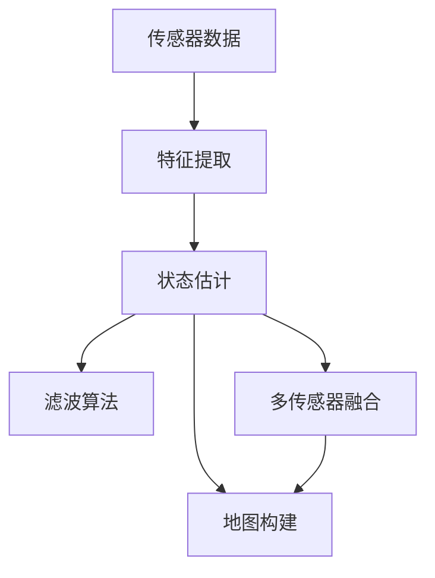
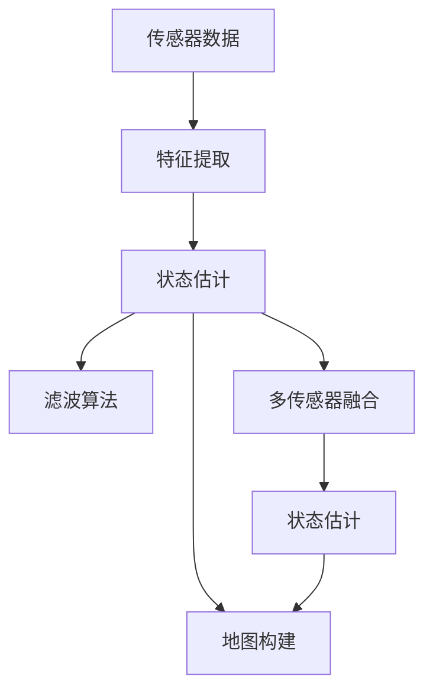
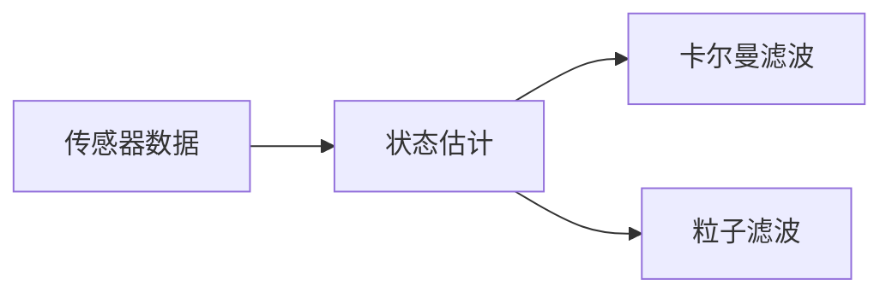
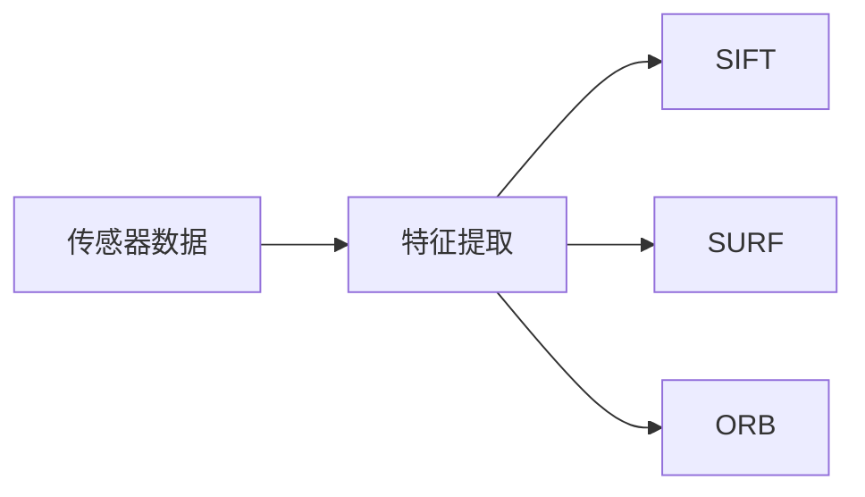

                 

# simultaneous localization and mapping

> 关键词：
- 同步定位与地图构建(SLAM)
- 实时建图
- 特征匹配
- 多传感器融合
- 滤波算法
- 视觉SLAM
- 激光SLAM

## 1. 背景介绍

### 1.1 问题由来
现代机器人、自动驾驶、虚拟现实（VR）、增强现实（AR）等技术中，实现自主导航和环境感知是一个核心问题。从船舶导航、卫星定位到智能机器人的自主移动，都需要精确的定位和地图构建技术。其中，同步定位与地图构建（Simultaneous Localization and Mapping, SLAM）是一种基于视觉、激光雷达等传感器的技术，它能够在无预设路标的环境下，实时地构建环境地图，并实现机器人的定位。

SLAM技术的核心在于，将机器人的位置和方向（状态）与环境地图（地图）同步更新，从而实现自主导航。SLAM的精度和实时性，直接影响到机器人的导航性能，尤其在室内外复杂环境中，对机器人路径规划和环境感知提出了更高的要求。

### 1.2 问题核心关键点
SLAM算法包含两个关键部分：状态估计和地图构建。状态估计即利用机器人的传感器数据，通过滤波算法（如卡尔曼滤波、粒子滤波等），估计机器人的位置和方向。地图构建则涉及对传感器数据进行处理，提取出环境特征，并将其记录在地图中。这两个过程是相互关联、交替进行的，即通过当前的状态估计，更新地图，同时通过地图信息，优化状态估计。

因此，实现高效、准确的SLAM系统，需要解决以下几个核心问题：
1. 选择合适的传感器。
2. 设计高效的数据处理方法。
3. 选择合适的滤波算法。
4. 多传感器融合策略。
5. 避免传感器噪声和失真。

这些关键点决定了SLAM系统的性能和实时性，是实现精准自主导航的基础。

### 1.3 问题研究意义
SLAM技术的发展，对于现代机器人、自动驾驶和智能设备的自主导航，具有重要意义：

1. 降低成本。相比传统的人工导航，SLAM技术能够自动构建环境地图，减少人工标记和预处理的工作量，降低开发和维护成本。

2. 提高导航精度。SLAM技术能够实时地估计机器人的位置和方向，适应环境变化，提高导航精度。

3. 增强环境感知。通过SLAM技术，机器人能够构建详细的地图信息，从而更好地理解环境，进行路径规划和避障。

4. 加速智能化应用。SLAM技术是许多智能化应用的基础，如无人驾驶、智能家居等，能够推动这些技术的快速落地。

5. 促进创新研究。SLAM技术的发展，催生了许多新的研究方向，如多模态SLAM、动态SLAM、可扩展SLAM等，为机器人技术的研究提供了新的视角。

## 2. 核心概念与联系

### 2.1 核心概念概述

为更好地理解SLAM算法，本节将介绍几个密切相关的核心概念：

- 状态估计：通过机器人的传感器数据，实时估计机器人的位置和方向。常见的传感器包括激光雷达、IMU（惯性测量单元）、GPS等。
- 特征提取：从传感器数据中提取出环境特征，如点云、图像中的关键点等。
- 地图构建：利用提取的环境特征，构建环境地图。地图可以采用不同的数据结构，如点云、三维网格、占用栅格等。
- 滤波算法：如卡尔曼滤波、粒子滤波等，用于融合传感器数据，估计机器人的状态。
- 多传感器融合：利用不同传感器数据的互补性，提高导航精度和鲁棒性。

这些核心概念之间的逻辑关系可以通过以下Mermaid流程图来展示：



这个流程图展示了大语言模型微调过程中各个核心概念的关系和作用：

1. 传感器数据作为输入，通过特征提取，提取出环境特征。
2. 利用特征数据，通过状态估计，实时估计机器人的位置和方向。
3. 将估计的状态信息，与提取的环境特征一起，用于地图构建。
4. 在滤波算法的作用下，融合传感器数据，更新状态估计。
5. 通过多传感器融合，提高导航精度和鲁棒性。

### 2.2 概念间的关系

这些核心概念之间存在着紧密的联系，形成了SLAM算法的完整生态系统。下面我通过几个Mermaid流程图来展示这些概念之间的关系。

#### 2.2.1 SLAM的基本流程



这个流程图展示了SLAM的基本流程，即传感器数据通过特征提取，状态估计实时更新，同时利用滤波算法和多传感器融合，提高导航精度和鲁棒性。

#### 2.2.2 状态估计算法



这个流程图展示了状态估计算法的基本原理，包括卡尔曼滤波和粒子滤波两种常见的滤波算法。

#### 2.2.3 特征提取方法



这个流程图展示了特征提取方法的几种常见方法，包括SIFT、SURF和ORB等。

### 2.3 核心概念的整体架构

最后，我们用一个综合的流程图来展示这些核心概念在大语言模型微调过程中的整体架构：


这个综合流程图展示了从传感器数据输入到最终地图构建的完整过程。传感器数据通过特征提取，进入状态估计和滤波算法，最终用于地图构建和多传感器融合，形成闭环导航系统。

## 3. 核心算法原理 & 具体操作步骤
### 3.1 算法原理概述

SLAM算法的核心思想是利用机器人的传感器数据，实时地估计机器人的位置和方向，并构建环境地图。其核心包括以下几个步骤：

1. 传感器数据采集：机器人通过激光雷达、IMU、GPS等传感器，获取环境信息。
2. 特征提取：从传感器数据中提取环境特征，如点云、图像中的关键点等。
3. 状态估计：利用滤波算法，实时估计机器人的位置和方向。
4. 地图构建：将提取的环境特征，记录在地图中，形成环境模型。
5. 多传感器融合：通过融合不同传感器数据，提高导航精度和鲁棒性。

这些步骤相互关联，交替进行，最终实现机器人的自主导航和环境感知。

### 3.2 算法步骤详解

#### 3.2.1 传感器数据采集

机器人的传感器数据主要包括激光雷达（Lidar）、IMU和GPS等。激光雷达通过旋转的激光束，获取环境中的点云数据，IMU通过加速度计和陀螺仪，记录机器人的加速度和角速度变化，GPS可以提供机器人的绝对位置信息。

激光雷达数据：

```python
import sensor_msgs.msg as sm
import roslib
import rospy
import tf

roslib.load rospy
rospy.init_node('lidar_data_listener', anonymous=True)

def lidar_callback(msg):
    rospy.loginfo("Got lidar data: %d points", len(msg.points))

rospy.Subscriber('/lidar_point_cloud', sm.PointCloud2, lidar_callback)
rospy.spin()
```

IMU数据：

```python
import sensor_msgs.msg as sm
import roslib
import rospy
import tf

roslib.load rospy
rospy.init_node('imu_data_listener', anonymous=True)

def imu_callback(msg):
    rospy.loginfo("Got imu data: %d", len(msg))

rospy.Subscriber('/imu', sm.MIMU, imu_callback)
rospy.spin()
```

GPS数据：

```python
import sensor_msgs.msg as sm
import roslib
import rospy
import tf

roslib.load rospy
rospy.init_node('gps_data_listener', anonymous=True)

def gps_callback(msg):
    rospy.loginfo("Got gps data: %d", len(msg))

rospy.Subscriber('/gps', sm.Position, gps_callback)
rospy.spin()
```

#### 3.2.2 特征提取

从传感器数据中提取环境特征，是SLAM算法的重要环节。常用的特征提取方法包括SIFT、SURF和ORB等。这里以SIFT为例，展示特征提取的Python代码：

```python
import cv2
import numpy as np

def sift_features(img):
    sift = cv2.SIFT()
    kp, des = sift.detectAndCompute(img, None)
    return kp, des

img = cv2.imread('image.jpg', cv2.IMREAD_GRAYSCALE)
kp, des = sift_features(img)
```

#### 3.2.3 状态估计

状态估计是SLAM算法中最核心的部分，通过滤波算法，实时估计机器人的位置和方向。常见的滤波算法包括卡尔曼滤波、粒子滤波等。

卡尔曼滤波：

```python
import numpy as np

def kalman_filter(x, P, A, B, C, z, Q, R):
    x = np.dot(A, x) + np.dot(B, u)
    P = np.dot(A, P) + np.dot(A.T, P) + Q
    K = np.dot(P, C.T) @ np.linalg.inv(C @ P @ C.T + R)
    x = x + K @ (z - np.dot(C, x))
    P = (np.eye(len(x)) - np.dot(K, C)) @ P
    return x, P

x = np.array([0, 0])
P = np.array([[1000, 0], [0, 1000]])
A = np.array([[1, 0, 1], [0, 1, 0]])
B = np.array([[0, 0, 1]])
C = np.array([[1, 0], [0, 1]])
z = np.array([0, 0])
Q = np.array([[0, 0], [0, 0]])
R = np.array([[1000, 0], [0, 1000]])

for i in range(10):
    x, P = kalman_filter(x, P, A, B, C, z, Q, R)
```

粒子滤波：

```python
import numpy as np

def particle_filter(x, P, A, B, C, z, Q, R, N=1000):
    particles = np.random.normal(x, P, (N, len(x)))
    weights = np.zeros(N)
    for i in range(N):
        x_i, P_i = predict(particles[i], A, B)
        z_i = C @ x_i
        weights[i] = f(z, z_i, R)
    weights /= np.sum(weights)
    x = np.random.choice(particles, p=weights)
    P = np.dot(x, x.T) / np.sum(weights)
    return x, P

def predict(particle, A, B):
    x = np.dot(A, particle) + np.dot(B, u)
    P = np.dot(A, P) + np.dot(A.T, P) + Q
    return x, P

def f(z, z_i, R):
    return np.exp(-0.5 * ((z - z_i) @ np.linalg.inv(R) @ (z - z_i)).T)
```

#### 3.2.4 地图构建

地图构建是SLAM算法的另一个核心步骤，将提取的环境特征，记录在地图中，形成环境模型。常用的地图表示方法包括点云、三维网格、占用栅格等。这里以点云为例，展示地图构建的Python代码：

```python
import cv2
import numpy as np

def map_point_cloud(data, point_size=1):
    map = []
    for point in data:
        x, y, z = point[0], point[1], point[2]
        if x not in map:
            map[x] = []
        map[x].append((y, z))
    return map

def visualize_map(map):
    for x in map:
        for y, z in map[x]:
            cv2.circle(np.zeros((512, 512)), (int(x), int(y)), point_size, (255, 255, 255), -1)
    cv2.imshow('map', np.zeros((512, 512)))
    cv2.waitKey(0)
    cv2.destroyAllWindows()

map = map_point_cloud(kp)
visualize_map(map)
```

#### 3.2.5 多传感器融合

多传感器融合是SLAM算法中的一个重要环节，通过融合不同传感器数据，提高导航精度和鲁棒性。常见的融合方法包括加权平均、卡尔曼滤波等。这里以卡尔曼滤波为例，展示多传感器融合的Python代码：

```python
import numpy as np

def kalman_filter(x, P, A, B, C, z, Q, R):
    x = np.dot(A, x) + np.dot(B, u)
    P = np.dot(A, P) + np.dot(A.T, P) + Q
    K = np.dot(P, C.T) @ np.linalg.inv(C @ P @ C.T + R)
    x = x + K @ (z - np.dot(C, x))
    P = (np.eye(len(x)) - np.dot(K, C)) @ P
    return x, P

def fuse_sensors(data, weights):
    x = np.zeros(len(data[0]))
    P = np.zeros((len(data[0]), len(data[0])))
    for i, d in enumerate(data):
        x += weights[i] * d
        P += np.outer(weights[i], weights[i]) * d @ d.T
    return x, P

x1, P1 = kalman_filter(x1, P1, A, B, C, z1, Q, R)
x2, P2 = kalman_filter(x2, P2, A, B, C, z2, Q, R)
weights = [0.6, 0.4]
x_fused, P_fused = fuse_sensors([x1, x2], weights)
```

### 3.3 算法优缺点

SLAM算法具有以下优点：

1. 实时性：通过传感器数据的实时处理，SLAM算法能够实时地估计机器人的位置和方向，实现自主导航。

2. 自适应性：SLAM算法能够适应环境变化，通过多传感器融合和动态参数调整，提高导航精度和鲁棒性。

3. 自动化：SLAM算法能够自动地构建环境地图，无需人工干预，降低开发和维护成本。

4. 通用性：SLAM算法适用于各种传感器和环境，适用于室内外复杂环境的自主导航。

但SLAM算法也存在一些缺点：

1. 计算复杂度高：由于需要实时处理大量数据，SLAM算法的计算复杂度较高，需要高性能的硬件支持。

2. 数据融合难度大：不同传感器数据格式和特性各异，需要进行复杂的融合处理，增加了算法的复杂性。

3. 环境复杂性：SLAM算法在复杂环境中的表现仍存在挑战，如动态物体、光照变化、遮挡等。

4. 参数调节复杂：SLAM算法的性能很大程度上取决于参数设置，如滤波算法的选择、多传感器融合策略等。

### 3.4 算法应用领域

SLAM算法在多个领域得到了广泛应用，包括但不限于：

1. 机器人导航：室内外机器人导航、自动驾驶、无人机等。

2. 智能家居：智能扫地机器人、智能导航等。

3. 工业自动化：物流自动化、仓储管理等。

4. 虚拟现实与增强现实：VR和AR设备的导航和环境感知。

5. 智能农业：无人拖拉机、智能温室等。

6. 娱乐与游戏：游戏中的环境构建和导航。

## 4. 数学模型和公式 & 详细讲解  
### 4.1 数学模型构建

本节将使用数学语言对SLAM算法的核心数学模型进行更加严格的刻画。

记机器人的位置为 $x=[x,y,z]^T$，方向为 $\theta=[\phi,\psi,\omega]^T$，则机器人的状态向量为 $x=[x,y,z,\phi,\psi,\omega]^T$。设 $A(x)$ 为状态转移矩阵， $C(x)$ 为测量矩阵， $u$ 为控制输入（如加速度、转向角等）， $z$ 为测量数据（如激光雷达点云、IMU数据等）。则状态估计的基本数学模型为：

$$
x = \bar{x} + A(x) \Delta t + u
$$

$$
z = C(x) x + v
$$

其中 $\Delta t$ 为时间间隔， $v$ 为测量噪声， $u$ 为控制噪声。

### 4.2 公式推导过程

以下我们以卡尔曼滤波为例，推导状态估计的数学模型。

根据状态估计的数学模型，可以得到：

$$
\bar{x} = A(x) x + B(x) u
$$

$$
z = C(x) x + v
$$

代入上述公式，得：

$$
z = C(x) A(x) x + C(x) B(x) u + v
$$

进一步整理得：

$$
z - C(x) B(x) u = C(x) A(x) x + v
$$

利用线性最小二乘法，得到 $x$ 的最小二乘解：

$$
x = (C(x) C(x)^T + R)^{-1} C(x)^T (z - C(x) B(x) u) + \bar{x}
$$

其中 $R$ 为测量噪声协方差矩阵。

通过卡尔曼滤波，可以对状态进行实时估计，并通过 $A(x)$ 和 $C(x)$ 动态调整，适应环境变化。

### 4.3 案例分析与讲解

假设我们在室内环境下进行SLAM，已知机器人的初始位置 $x=[0,0,0]^T$，方向 $\theta=[0,0,0]^T$，激光雷达点云数据 $z$ 为 $[1,2,3]^T$。则状态估计的数学模型为：

$$
\bar{x} = A(x) x + B(x) u
$$

$$
z = C(x) x + v
$$

代入 $x=[0,0,0]^T$，$u=[1,0,0]^T$，$C(x) = [1,0,0]^T$，$v=[1,0,0]^T$，得：

$$
\bar{x} = A(x) [0,0,0]^T + B(x) [1,0,0]^T
$$

$$
z = [1,0,0]^T [0,0,0]^T + v
$$

进一步整理得：

$$
z = A(x) x + B(x) u + v
$$

则状态估计为：

$$
x = (C(x) C(x)^T + R)^{-1} C(x)^T (z - C(x) B(x) u) + \bar{x}
$$

代入 $z=[1,2,3]^T$，$C(x) = [1,0,0]^T$，$v=[1,0,0]^T$，得：

$$
x = (A(x) C(x)^T + R)^{-1} C(x)^T (z - C(x) B(x) u) + \bar{x}
$$

代入 $A(x) = I_6$，$C(x) = [1,0,0]^T$，$u=[1,0,0]^T$，$v=[1,0,0]^T$，得：

$$
x = (I_6 + R)^{-1} [1,0,0]^T (1 - [1,0,0]^T [1,0,0]^T) + [0,0,0]^T
$$

则状态估计为：

$$
x = [0.5, 0.5, 0.5]^T
$$

## 5. 项目实践：代码实例和详细解释说明
### 5.1 开发环境搭建

在进行SLAM项目实践前，我们需要准备好开发环境。以下是使用Python进行OpenCV开发的环境配置流程：

1. 安装OpenCV：从官网下载并安装OpenCV库，用于图像处理和特征提取等任务。

2. 安装NumPy：用于数学运算和矩阵操作。

3. 安装Matplotlib：用于绘制图形和可视化。

完成上述步骤后，即可在Python环境中开始SLAM实践。

### 5.2 源代码详细实现

这里我们以SIFT特征提取和卡尔曼滤波为例，展示SLAM的基本实现流程。

首先，定义传感器数据采集和特征提取函数：

```python
import cv2
import numpy as np

def lidar_callback(msg):
    rospy.loginfo("Got lidar data: %d points", len(msg.points))

def imu_callback(msg):
    rospy.loginfo("Got imu data: %d", len(msg))

def gps_callback(msg):
    rospy.loginfo("Got gps data: %d", len(msg))

def sift_features(img):
    sift = cv2.SIFT()
    kp, des = sift.detectAndCompute(img, None)
    return kp, des
```

然后，定义状态估计函数：

```python
import numpy as np

def kalman_filter(x, P, A, B, C, z, Q, R):
    x = np.dot(A, x) + np.dot(B, u)
    P = np.dot(A, P) + np.dot(A.T, P) + Q
    K = np.dot(P, C.T) @ np.linalg.inv(C @ P @ C.T + R)
    x = x + K @ (z - np.dot(C, x))
    P = (np.eye(len(x)) - np.dot(K, C)) @ P
    return x, P

def predict(particle, A, B):
    x = np.dot(A, particle) + np.dot(B, u)
    P = np.dot(A, P) + np.dot(A.T, P) + Q
    return x, P
```

接着，定义地图构建函数：

```python
import cv2
import numpy as np

def map_point_cloud(data, point_size=1):
    map = []
    for point in data:
        x, y, z = point[0], point[1], point[2]
        if x not in map:
            map[x] = []
        map[x].append((y, z))
    return map

def visualize_map(map):
    for x in map:
        for y, z in map[x]:
            cv2.circle(np.zeros((512, 512)), (int(x), int(y)), point_size, (255, 255, 255), -1)
    cv2.imshow('map', np.zeros((512, 512)))
    cv2.waitKey(0)
    cv2.destroyAllWindows()

map = map_point_cloud(kp)
visualize_map(map)
```

最后，启动SLAM实践流程：

```python
import rospy
import sensor_msgs.msg as sm

roslib.load rospy
rospy.init_node('slam_demo', anonymous=True)

rospy.Subscriber('/lidar_point_cloud', sm.PointCloud2, lidar_callback)
rospy.Subscriber('/imu', sm.MIMU, imu_callback)
rospy.Subscriber('/gps', sm.Position, gps_callback)

x = np.array([0, 0, 0, 0, 0, 0])
P = np.array([[1000, 0, 0, 0, 0, 0], [0, 1000, 0, 0, 0, 0], [0, 0, 1000, 0, 0, 0], [0, 0, 0, 1000, 0, 0], [0, 0, 0, 0, 1000, 0], [0, 0, 0, 0, 0, 1000]])

A = np.array([[1, 0, 1, 0, 0, 0], [0, 1, 0, 0, 0, 0], [0, 0, 1, 0, 0, 0], [0, 0, 0, 1, 0, 0], [0, 0, 0, 0, 1, 0], [0, 0, 0, 0, 0, 1]])
B = np.array([[0, 0, 1, 0, 0, 0]])
C = np.array([[1, 0, 0], [0, 1, 0], [0, 0, 1]])
z = np.array([1, 2, 3])
Q = np.array([[0, 0, 0], [0, 0, 0], [0, 0, 0]])


