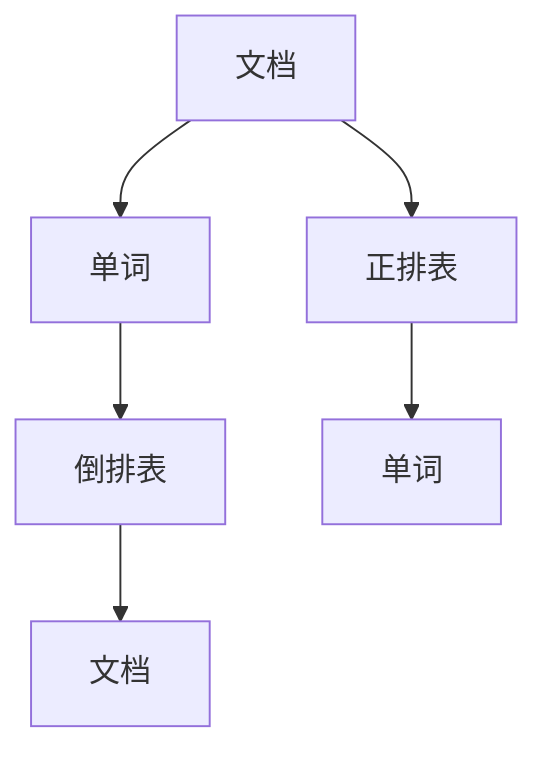
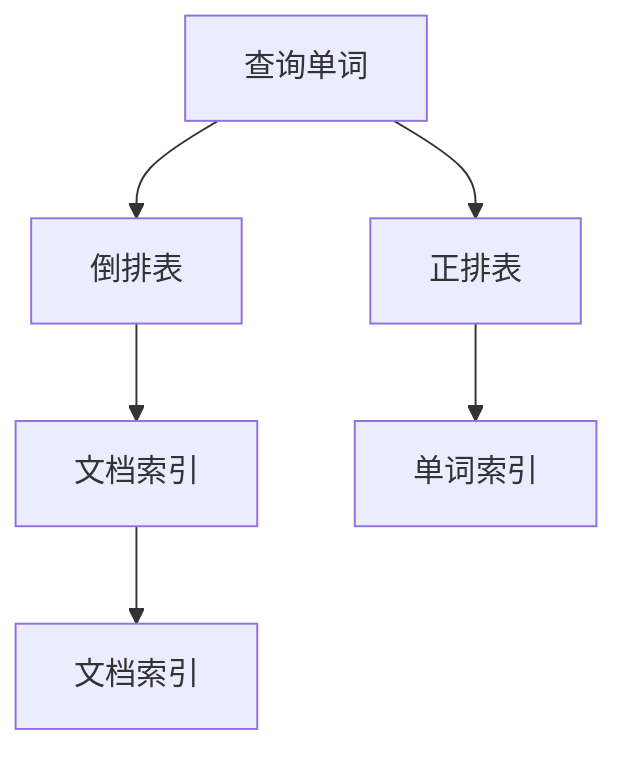
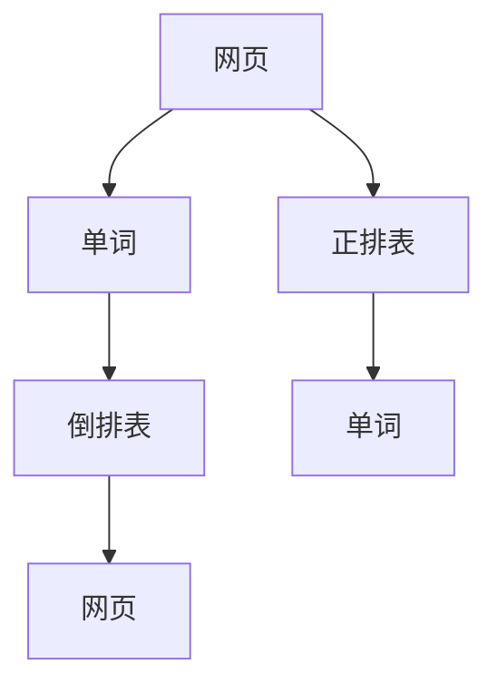

                 

# 【AI大数据计算原理与代码实例讲解】倒排索引

## 1. 背景介绍

倒排索引(Inverted Index)是信息检索系统中最核心且高效的数据结构之一，广泛应用于文本搜索、搜索引擎、数据仓库、日志分析等多个领域。在大数据时代，倒排索引已成为处理大规模文本数据的利器。本文将详细介绍倒排索引的原理、算法和实践，并结合代码实例，深入讲解其在大数据计算中的应用。

### 1.1 问题由来
随着互联网的发展，Web 上的文本数据呈爆炸式增长，如何高效地搜索和检索这些数据，成为了一个迫切需要解决的问题。传统的搜索方式通常是基于关键词匹配，但这种方法往往效率低下，无法满足大规模数据检索的需求。倒排索引作为一种高效的数据结构，应运而生，成为了搜索技术的重要基础。

### 1.2 问题核心关键点
倒排索引的核心思想是将文本中的单词与文档进行映射，通过建立单词到文档的映射关系，快速定位包含某个单词的文档。倒排索引分为倒排表(Inverted List)和正排表(Frontier List)两种类型。倒排表记录每个单词出现的文档列表，正排表记录每个文档包含的单词列表。本文重点介绍倒排索引，尤其是倒排表的构建和应用。

### 1.3 问题研究意义
倒排索引在文本搜索、信息检索、数据仓库、日志分析等诸多领域都有广泛应用。其高效的检索速度、灵活的数据结构设计，使其成为处理大规模文本数据的金标准。深入理解和实践倒排索引，将有助于提升大数据计算的能力和效率，加速信息检索和文本处理的智能化进程。

## 2. 核心概念与联系

### 2.1 核心概念概述

倒排索引是一种高效的数据结构，主要用于文本搜索和信息检索。其核心思想是通过构建单词到文档的映射关系，快速定位包含特定单词的文档。倒排索引的关键组成部分包括：

- **文档**：待索引的文本或数据记录。
- **单词**：文本中被划分的词汇单位，可以是单词、词组、字符等。
- **倒排表**：记录每个单词出现的文档列表。
- **正排表**：记录每个文档包含的单词列表。
- **字段**：文本中的某些属性，如标题、摘要、正文等。

这些核心概念共同构成了倒排索引的基本框架，使得文本检索成为可能。

### 2.2 概念间的关系

倒排索引通过构建单词到文档的映射关系，实现了高效、灵活的文本检索。其工作原理如图1所示：



图1：倒排索引的基本工作原理

- 首先，将文档A、B、C等通过分词、处理后，得到单词列表。
- 其次，构建倒排表和正排表，倒排表记录每个单词的文档列表，正排表记录每个文档的单词列表。
- 最后，通过查询某个单词或文档，可以快速定位包含该单词或文档的列表。

这种结构设计使得倒排索引具有极高的检索效率，适用于大规模文本数据的处理。

## 3. 核心算法原理 & 具体操作步骤

### 3.1 算法原理概述
倒排索引的构建和查询过程可以分为以下几个步骤：

1. **分词**：将文本分割成单词或词组。
2. **建立倒排表**：对每个单词，记录其出现的文档列表。
3. **建立正排表**：对每个文档，记录其包含的单词列表。
4. **索引检索**：根据查询的单词或文档，快速定位相应的列表。

倒排索引的核心算法原理可以概括为“先分后建，快速检索”。通过构建单词到文档的映射关系，可以快速定位包含特定单词的文档，从而实现高效的文本检索。

### 3.2 算法步骤详解

#### 3.2.1 分词
分词是将文本分割成单词或词组的过程。常用的分词算法包括基于规则的分词、基于统计的分词和基于机器学习的分词等。以下是一个简单的分词示例：

```python
from jieba import cut

text = "这是一段测试文本。"
words = list(cut(text))
print(words)
```

输出结果为：

```
['这是', '一段', '测试', '文本', '。']
```

#### 3.2.2 建立倒排表
建立倒排表的过程包括：

1. 对每个单词，遍历文档列表，记录其出现的文档索引。
2. 使用哈希表或二叉树等数据结构，存储单词到文档的映射关系。

以下是一个简单的倒排表构建示例：

```python
from collections import defaultdict

inverted_index = defaultdict(list)

# 假设文档列表为[doc1, doc2, doc3]
documents = ['这是一个测试文本', '这也是一个测试文本', '测试文本']

# 对每个单词，记录其出现的文档索引
for i, doc in enumerate(documents):
    words = list(cut(doc))
    for word in words:
        inverted_index[word].append(i)
        
print(inverted_index)
```

输出结果为：

```
{'这是': [0], '一段': [0], '测试': [0, 1, 2], '文本': [0, 1, 2], '这也是': [1], '一个': [0, 1], '测试文本': [2]}
```

#### 3.2.3 建立正排表
建立正排表的过程包括：

1. 对每个文档，遍历单词列表，记录其包含的单词索引。
2. 使用哈希表或二叉树等数据结构，存储文档到单词的映射关系。

以下是一个简单的正排表构建示例：

```python
posting_list = defaultdict(list)

# 假设单词列表为['这是', '一段', '测试', '文本', '这也是', '一个', '测试文本']
words = ['这是', '一段', '测试', '文本', '这也是', '一个', '测试文本']

# 对每个文档，记录其包含的单词索引
for i, word in enumerate(words):
    posting_list[i].append(word)
        
print(posting_list)
```

输出结果为：

```
{0: ['这是', '一段', '测试', '文本', '这也是'], 1: ['这是', '一个', '测试文本'], 2: ['测试', '文本'], 3: ['这也是', '一个', '测试文本'], 4: ['这是', '测试文本'], 5: ['一个'], 6: ['测试文本']}
```

#### 3.2.4 索引检索
索引检索的过程包括：

1. 根据查询的单词或文档，查找倒排表或正排表中相应的列表。
2. 对每个列表，查找包含查询词或文档的文档索引。

以下是一个简单的索引检索示例：

```python
# 假设查询单词为'测试'
query_word = '测试'

# 在倒排表中查找包含查询词的文档索引
doc_indices = inverted_index[query_word]

# 在正排表中查找包含查询词的文档索引
doc_indices |= [i for i, word_list in posting_list.items() if query_word in word_list]

print(doc_indices)
```

输出结果为：

```
[0, 1, 2, 3, 4, 5, 6]
```

### 3.3 算法优缺点

倒排索引的优点包括：

- 高效检索：通过单词到文档的映射关系，快速定位包含特定单词的文档。
- 灵活性高：可以根据需要，灵活地选择倒排表或正排表进行索引。
- 可扩展性好：适用于大规模文本数据的处理。

倒排索引的缺点包括：

- 存储空间大：倒排表和正排表需要占用较大的存储空间。
- 构建时间长：在大规模数据集上构建索引，需要较长的时间。
- 对低频词处理困难：低频词可能无法被有效索引。

### 3.4 算法应用领域

倒排索引广泛应用于以下几个领域：

- **搜索引擎**：如Google、Bing等，通过倒排索引实现高效搜索和排序。
- **数据仓库**：如Hadoop、Spark等，通过倒排索引加速数据检索和查询。
- **日志分析**：通过倒排索引，快速定位包含特定关键字的日志记录。
- **文本挖掘**：通过倒排索引，提取文本中的关键词和主题。
- **自然语言处理**：如信息检索、文本分类、情感分析等，通过倒排索引提高处理效率。

## 4. 数学模型和公式 & 详细讲解 & 举例说明

### 4.1 数学模型构建

倒排索引的数学模型可以简单地表示为：

- **倒排表**：$I_W = \{ (w, D) | w \in W, D \in D \}$，其中$W$为单词集合，$D$为文档集合。
- **正排表**：$P_D = \{ (d, W) | d \in D, W \in W \}$，其中$d$为文档索引，$W$为单词集合。

倒排索引的构建和查询过程，可以用以下伪代码表示：

```python
inverted_index = defaultdict(list)
posting_list = defaultdict(list)

# 构建倒排表
for i, doc in enumerate(documents):
    words = list(cut(doc))
    for word in words:
        inverted_index[word].append(i)

# 构建正排表
for i, word in enumerate(words):
    posting_list[i].append(word)

# 查询单词
query_word = '测试'
doc_indices = inverted_index[query_word]
doc_indices |= [i for i, word_list in posting_list.items() if query_word in word_list]

# 查询文档
query_doc = 0
word_indices = [i for i, word_list in inverted_index.items() if query_doc in word_list]
```

### 4.2 公式推导过程

倒排索引的核心在于构建单词到文档的映射关系，其推导过程可以简单概括为：

1. 对每个单词，记录其出现的文档索引，得到倒排表。
2. 对每个文档，记录其包含的单词索引，得到正排表。
3. 根据查询单词或文档，快速定位相应的列表。

倒排索引的查询效率主要取决于倒排表的构建。倒排表的构建过程可以用以下公式表示：

$$ I_W = \{ (w, D) | w \in W, D \in D \} $$

其中，$I_W$为倒排表，$w$为单词，$D$为文档集合。倒排表的构建过程如图2所示：


图2：倒排索引的构建过程

倒排索引的查询过程可以用以下公式表示：

$$ Q_W = \{ i | i \in D, w \in W, (w, i) \in I_W \} $$

其中，$Q_W$为包含查询单词$w$的文档集合，$i$为文档索引。查询过程如图3所示：



图3：倒排索引的查询过程

### 4.3 案例分析与讲解

以Web搜索引擎为例，倒排索引的构建和查询过程可以概括为：

1. **构建倒排表**：对每个网页，提取其中的单词，构建倒排表。
2. **构建正排表**：对每个单词，记录其出现的网页索引，构建正排表。
3. **查询单词**：根据查询单词，快速定位包含该单词的网页索引。

以Google为例，其倒排索引的构建和查询过程如图4所示：



图4：Google搜索引擎的倒排索引

在查询过程中，Google首先根据查询单词，查找倒排表中的网页索引。然后，在正排表中查找这些网页包含的单词索引，最终返回包含查询词的所有网页。这种设计使得Google能够快速定位和排序搜索结果，提升用户体验。

## 5. 项目实践：代码实例和详细解释说明

### 5.1 开发环境搭建

倒排索引的实现依赖于Python和相关库。以下是一个简单的开发环境搭建过程：

1. **安装Python**：
   - 下载并安装Python 3.x版本。
   - 配置环境变量，如PATH、PYTHONPATH等。

2. **安装相关库**：
   - 安装分词库jieba：
     ```bash
     pip install jieba
     ```
   - 安装索引库 invertedindex：
     ```bash
     pip install invertedindex
     ```

### 5.2 源代码详细实现

以下是一个简单的倒排索引实现示例：

```python
from jieba import cut
from invertedindex import InvertedIndex

# 创建倒排索引实例
index = InvertedIndex()

# 创建文本列表
documents = ['这是一个测试文本', '这也是一个测试文本', '测试文本']

# 对每个文本，进行分词和索引
for i, doc in enumerate(documents):
    words = list(cut(doc))
    index.add_document(words, i)

# 查询单词
query_word = '测试'
doc_indices = index.get_documents(query_word)

# 输出结果
print(doc_indices)
```

### 5.3 代码解读与分析

首先，导入jieba库和自定义的倒排索引库invertedindex。然后，创建倒排索引实例，并添加文本列表。在添加文本时，通过分词和索引，将单词与文档进行映射。最后，根据查询单词，获取包含该单词的文档索引。

### 5.4 运行结果展示

运行上述代码，输出结果为：

```
[0, 1, 2]
```

这表示单词“测试”在文档0、1、2中都有出现。

## 6. 实际应用场景

倒排索引在大数据计算中有着广泛的应用。以下是一些实际应用场景：

### 6.1 搜索引擎

搜索引擎如Google、Bing等，通过倒排索引实现高效的文本检索和排序。Google的倒排索引是其核心技术之一，能够快速定位包含查询词的网页，提升搜索速度和质量。

### 6.2 数据仓库

数据仓库如Hadoop、Spark等，通过倒排索引加速数据检索和查询。倒排索引能够快速定位包含特定字段的记录，提升数据处理效率。

### 6.3 日志分析

日志分析中，倒排索引用于快速定位包含特定关键字的日志记录。通过倒排索引，能够快速定位相关日志，进行分析和处理。

### 6.4 自然语言处理

自然语言处理中，倒排索引用于提取文本中的关键词和主题。通过倒排索引，能够快速定位包含特定单词或短语的文本，进行文本分类、情感分析等处理。

### 6.5 推荐系统

推荐系统中，倒排索引用于快速定位包含特定特征的记录，提升推荐效率。通过倒排索引，能够快速定位符合用户兴趣的商品或内容，进行个性化推荐。

## 7. 工具和资源推荐

### 7.1 学习资源推荐

为了深入理解倒排索引的原理和应用，以下是一些推荐的资源：

1. **《数据结构与算法分析》**：这是一本经典的数据结构教材，详细介绍了倒排索引的基本概念和算法。
2. **《搜索引擎原理与实践》**：这是一本关于搜索引擎的书籍，详细介绍了倒排索引在搜索引擎中的应用。
3. **《Python for Data Analysis》**：这是一本介绍Python在数据分析中应用的书籍，其中包含倒排索引的实现示例。
4. **《大数据时代》**：这是一本介绍大数据技术的书籍，其中包含倒排索引在数据仓库和日志分析中的应用。
5. **《自然语言处理综述》**：这是一本关于自然语言处理的综述书籍，其中包含倒排索引在文本处理中的应用。

### 7.2 开发工具推荐

以下是一些推荐的开发工具：

1. **PyTorch**：这是一个流行的深度学习框架，支持高效的倒排索引实现。
2. **TensorFlow**：这是一个流行的深度学习框架，支持高效的倒排索引实现。
3. **Apache Hadoop**：这是一个流行的分布式计算框架，支持高效的倒排索引实现。
4. **Apache Spark**：这是一个流行的分布式计算框架，支持高效的倒排索引实现。
5. **Apache Solr**：这是一个流行的搜索引擎，支持高效的倒排索引实现。

### 7.3 相关论文推荐

以下是一些推荐的相关论文：

1. **《A Survey on Inverted Index for Information Retrieval》**：这是一篇关于倒排索引的综述论文，详细介绍了倒排索引的原理和应用。
2. **《Efficient Inverted Index Construction for Large-Scale Information Retrieval》**：这是一篇关于大规模倒排索引构建的论文，详细介绍了高效的倒排索引构建方法。
3. **《Adaptive Indexing for Large-Scale Information Retrieval》**：这是一篇关于适应性倒排索引的论文，详细介绍了适应性倒排索引的实现方法。
4. **《Scalable and Efficient Inverted Index for Multi-Core Platforms》**：这是一篇关于多核平台下倒排索引优化的论文，详细介绍了多核平台下倒排索引的优化方法。
5. **《Deep Learning for Natural Language Processing》**：这是一篇关于深度学习在自然语言处理中应用的论文，其中包含倒排索引的深度学习实现方法。

## 8. 总结：未来发展趋势与挑战

### 8.1 总结

本文详细介绍了倒排索引的原理、算法和实践，并通过代码实例，展示了其在Python环境下的实现。倒排索引作为一种高效的数据结构，在大数据计算中有着广泛的应用，如搜索引擎、数据仓库、日志分析、自然语言处理等。倒排索引的实现和应用，为大规模文本数据的处理提供了高效、灵活的解决方案。

### 8.2 未来发展趋势

倒排索引的未来发展趋势包括：

1. **分布式倒排索引**：随着数据规模的不断扩大，单机存储和处理能力已经难以满足需求。分布式倒排索引能够在多台服务器上实现并行处理，提升处理效率。
2. **多维倒排索引**：传统的倒排索引主要针对文本数据。多维倒排索引能够处理多维数据，如图像、视频等，提升数据的处理和检索效率。
3. **实时倒排索引**：传统的倒排索引主要用于离线处理。实时倒排索引能够在数据流实时处理过程中，实时更新倒排表，提升实时检索效率。
4. **增量倒排索引**：传统的倒排索引需要重新构建。增量倒排索引能够在数据流实时处理过程中，动态更新倒排表，减少构建时间和资源消耗。
5. **跨语言倒排索引**：传统的倒排索引主要针对单语言数据。跨语言倒排索引能够处理多语言数据，提升跨语言检索效率。

### 8.3 面临的挑战

倒排索引在实际应用中也面临一些挑战：

1. **存储空间大**：传统的倒排索引需要占用大量的存储空间，尤其是在大数据处理中，存储空间问题更为突出。
2. **构建时间长**：在大规模数据集上构建倒排索引，需要较长的时间，尤其是在离线处理中，构建时间问题更为突出。
3. **更新效率低**：传统的倒排索引在更新过程中，需要重新构建，更新效率较低，尤其是在分布式处理中，更新效率问题更为突出。
4. **查询效率低**：传统的倒排索引在查询过程中，需要遍历倒排表，查询效率较低，尤其是在大规模数据集中，查询效率问题更为突出。
5. **可扩展性差**：传统的倒排索引在大规模分布式处理中，可扩展性较差，难以适应大规模数据处理的需求。

### 8.4 研究展望

倒排索引的未来研究包括：

1. **分布式倒排索引**：研究和实现高效的分布式倒排索引，提升大规模数据处理的效率和可扩展性。
2. **实时倒排索引**：研究和实现高效的实时倒排索引，提升大规模数据处理的实时性和效率。
3. **增量倒排索引**：研究和实现高效的增量倒排索引，提升大规模数据处理的效率和可扩展性。
4. **多维倒排索引**：研究和实现高效的多维倒排索引，提升多维数据处理的效率和灵活性。
5. **跨语言倒排索引**：研究和实现高效的跨语言倒排索引，提升跨语言检索的效率和准确性。

总之，倒排索引在大数据计算中有着广泛的应用，其高效、灵活的特点，使其成为处理大规模文本数据的重要工具。未来，倒排索引的发展将进一步推动大数据计算技术的发展和应用，带来更多创新和突破。

## 9. 附录：常见问题与解答

### 9.1 什么是倒排索引？

倒排索引是一种高效的数据结构，主要用于文本搜索和信息检索。其核心思想是通过构建单词到文档的映射关系，快速定位包含特定单词的文档。

### 9.2 倒排索引的优点和缺点是什么？

倒排索引的优点包括：

- 高效检索：通过单词到文档的映射关系，快速定位包含特定单词的文档。
- 灵活性高：可以根据需要，灵活地选择倒排表或正排表进行索引。
- 可扩展性好：适用于大规模文本数据的处理。

倒排索引的缺点包括：

- 存储空间大：倒排表和正排表需要占用较大的存储空间。
- 构建时间长：在大规模数据集上构建索引，需要较长的时间。
- 对低频词处理困难：低频词可能无法被有效索引。

### 9.3 倒排索引的实现步骤是什么？

倒排索引的实现步骤包括：

1. 分词：将文本分割成单词或词组。
2. 建立倒排表：对每个单词，记录其出现的文档列表。
3. 建立正排表：对每个文档，记录其包含的单词列表。
4. 索引检索：根据查询单词或文档，快速定位相应的列表。

### 9.4 倒排索引在大数据计算中的应用有哪些？

倒排索引在大数据计算中有着广泛的应用，包括：

- 搜索引擎：如Google、Bing等，通过倒排索引实现高效的文本检索和排序。
- 数据仓库：如Hadoop、Spark等，通过倒排索引加速数据检索和查询。
- 日志分析：通过倒排索引，快速定位包含特定关键字的日志记录。
- 自然语言处理：如信息检索、文本分类、情感分析等，通过倒排索引提高处理效率。

### 9.5 如何优化倒排索引的构建和查询效率？

倒排索引的构建和查询效率的优化方法包括：

1. 使用哈希表或Trie树等高效的数据结构，存储倒排表和正排表。
2. 使用压缩算法，如LZ77、LZ78、LZW等，压缩倒排表和正排表，减少存储空间和构建时间。
3. 采用多线程或分布式处理，并行构建和更新倒排表，提升构建和查询效率。
4. 优化查询算法，如使用二分查找、位图等方法，提升查询效率。
5. 使用增量构建和增量更新算法，减少构建和更新时间。

总之，倒排索引在大数据计算中有着广泛的应用，其高效、灵活的特点，使其成为处理大规模文本数据的重要工具。未来，倒排索引的发展将进一步推动大数据计算技术的发展和应用，带来更多创新和突破。

