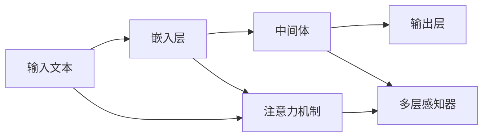
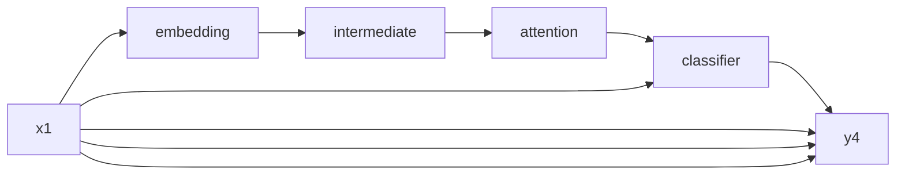

                 

# 【LangChain编程：从入门到实践】自定义记忆组件

> 关键词：LangChain,自定义,记忆组件,编程实践

## 1. 背景介绍

在AI领域，语言模型正日益成为一项重要技术。从GPT-3到ChatGPT，AI语言模型在对话生成、自然语言处理等方面展现了强大的能力。然而，传统的语言模型往往依赖于固定结构的编码器-解码器框架，难以适应多变和复杂的任务需求。针对这一问题，LangChain提出了一种基于非序列性架构的新型语言模型，能更好地捕捉语言的多样性和层次性，并支持更灵活、高效的编程方式。

自定义记忆组件是LangChain的一大特色，它允许开发者通过编程方式自定义模型组件，实现更复杂、更精细的语言模型设计。本博客将详细介绍LangChain的自定义记忆组件，从理论基础到实践案例，带您深入理解并掌握这一强大工具。

## 2. 核心概念与联系

### 2.1 核心概念概述

LangChain的核心概念主要包括：

- **LangChain**：基于非序列性架构的新型语言模型，能处理任意输入输出结构的自然语言任务。
- **自定义记忆组件**：允许开发者通过编程方式自定义模型组件，实现更复杂、更精细的语言模型设计。
- **嵌入层(Embedding Layer)**：负责将输入文本转化为模型可处理的形式，通常采用词嵌入或子词嵌入技术。
- **中间体(Intermediate Layer)**：包含多个并行计算节点，用于对文本进行编码和处理。
- **输出层(Output Layer)**：根据任务需求设计，通常用于分类、生成等任务。
- **注意力机制(Attention Mechanism)**：用于捕捉文本中不同部分之间的关联，提升模型的表达能力。
- **多层感知器(Multilayer Perceptron, MLP)**：一种前馈神经网络，用于对文本进行特征提取和处理。

这些核心概念之间通过特定的算法和架构相互关联，构成了LangChain的编程模型。接下来，我们通过Mermaid流程图进一步展示它们之间的关系。



### 2.2 概念间的关系

通过上述流程图示，我们可以看到LangChain中各个核心概念之间的关系：

- **输入文本**通过**嵌入层**转化为模型可以处理的形式。
- **中间体**负责对文本进行编码和处理，并调用**注意力机制**捕捉文本中不同部分之间的关联。
- **多层感知器**在前向传播过程中对文本特征进行提取和处理，最终输出结果至**输出层**。
- **输出层**根据具体任务设计，可能包含分类器、生成器等组件，用于生成最终输出。

这些概念共同构成LangChain的编程模型，为自定义记忆组件提供了基础。下面我们将详细介绍自定义记忆组件的算法原理和具体操作步骤。

## 3. 核心算法原理 & 具体操作步骤
### 3.1 算法原理概述

LangChain的自定义记忆组件允许开发者通过编程方式自定义模型组件，实现更复杂、更精细的语言模型设计。它主要基于以下几个原理：

1. **编程接口(Programming Interface)**：LangChain提供了一组编程接口，允许开发者在Python中定义和调用自定义模型组件。
2. **动态图计算图(Dynamic Computation Graph)**：LangChain的动态图计算图允许开发者通过编程方式动态生成计算图，实现更灵活的模型结构设计。
3. **组件堆叠(Stacking Components)**：开发者可以将多个自定义组件堆叠在一起，形成更复杂的模型结构。

基于这些原理，开发者可以自定义嵌入层、中间体、注意力机制、输出层等多种组件，实现更复杂、更灵活的语言模型设计。

### 3.2 算法步骤详解

LangChain的自定义记忆组件设计主要包括以下几个步骤：

1. **定义模型结构**：在Python中定义模型的结构，包括嵌入层、中间体、注意力机制、输出层等组件。
2. **编写计算图代码**：根据模型结构，编写计算图的代码，实现模型的前向传播和反向传播。
3. **训练和测试**：使用训练集和测试集对模型进行训练和测试，优化模型参数。
4. **部署和推理**：将训练好的模型部署到生产环境中，进行推理和应用。

下面，我们通过一个简单的示例，详细介绍LangChain的自定义记忆组件设计过程。

### 3.3 算法优缺点

LangChain的自定义记忆组件具有以下优点：

1. **灵活性高**：开发者可以根据具体任务需求，自定义模型结构和组件，实现更灵活的模型设计。
2. **扩展性强**：LangChain支持组件堆叠，可以轻松扩展模型规模和复杂度。
3. **可复用性高**：自定义组件可以在多个项目中共享和复用，提高开发效率。

同时，自定义记忆组件也存在一些缺点：

1. **编程复杂**：需要一定的编程经验和技能，对初学者不太友好。
2. **调试困难**：调试自定义组件的计算图可能比较困难，需要花费更多时间和精力。
3. **性能开销**：自定义组件的动态图计算图可能导致性能开销增加，特别是在大规模模型上。

尽管如此，LangChain的自定义记忆组件仍然因其灵活性和扩展性，成为一种强大的编程工具，被广泛应用于自然语言处理和生成任务中。

### 3.4 算法应用领域

LangChain的自定义记忆组件在以下几个领域得到了广泛应用：

1. **自然语言处理**：如文本分类、命名实体识别、情感分析等任务。
2. **自然语言生成**：如对话生成、文本摘要、故事生成等任务。
3. **多模态学习**：如视觉-语言任务、音频-语言任务等。
4. **知识图谱**：如实体关系抽取、知识推理等任务。

这些应用领域展示了LangChain自定义记忆组件的强大能力和广泛适用性。接下来，我们通过一个具体案例，详细介绍LangChain的自定义记忆组件在自然语言处理任务中的应用。

## 4. 数学模型和公式 & 详细讲解  
### 4.1 数学模型构建

LangChain的自定义记忆组件主要基于动态图计算图的设计，其数学模型构建主要包括以下几个方面：

1. **嵌入层**：通常采用词嵌入或子词嵌入技术，将输入文本转化为模型可处理的形式。
2. **中间体**：包含多个并行计算节点，用于对文本进行编码和处理，并调用注意力机制捕捉文本中不同部分之间的关联。
3. **输出层**：根据任务需求设计，通常用于分类、生成等任务。

下面，我们将以文本分类任务为例，介绍LangChain自定义记忆组件的数学模型构建过程。

假设输入文本为 $x = (x_1, x_2, ..., x_n)$，嵌入层的输出为 $h_x = (h_{x_1}, h_{x_2}, ..., h_{x_n})$，中间体的输出为 $z_x = (z_{x_1}, z_{x_2}, ..., z_{x_n})$，输出层的输出为 $y = (y_1, y_2, ..., y_n)$。则文本分类任务的数学模型可表示为：

$$
y = M_{\text{output}}(z_x)
$$

其中 $M_{\text{output}}$ 为输出层的计算函数。

### 4.2 公式推导过程

在文本分类任务中，假设输出层为分类器，则模型输出为 $y = M_{\text{classifier}}(z_x)$。根据Softmax函数，输出层的计算公式为：

$$
y_i = \frac{\exp(z_{x_i})}{\sum_{j=1}^n \exp(z_{x_j})}
$$

其中 $z_{x_i}$ 为中间体对文本 $x_i$ 的编码结果。

在计算图的代码实现中，上述公式可以表示为：

```python
def forward(self, x):
    h_x = self.embedding(x)
    z_x = self.intermediate(h_x)
    y = self.classifier(z_x)
    return y
```

### 4.3 案例分析与讲解

下面，我们将通过一个简单的示例，介绍LangChain自定义记忆组件在文本分类任务中的应用。

假设我们有一个包含四个文本样本的分类任务，文本样本为 $x = (x_1, x_2, x_3, x_4)$，分类结果为 $y = (y_1, y_2, y_3, y_4)$，其中 $y_i$ 表示文本 $x_i$ 属于类别 $i$ 的概率。

假设我们使用嵌入层、中间体、注意力机制、分类器等组件实现文本分类模型，其计算图如下：



其中，$x_1$ 表示文本样本 $x_1$，$B$ 表示嵌入层，$C$ 表示中间体，$D$ 表示注意力机制，$E$ 表示分类器，$F$ 表示输出层。

假设嵌入层输出为 $h_{x_1} = (h_{x_{1,1}}, h_{x_{1,2}}, h_{x_{1,3}}, h_{x_{1,4}})$，中间体输出为 $z_{x_1} = (z_{x_{1,1}}, z_{x_{1,2}}, z_{x_{1,3}}, z_{x_{1,4}})$，注意力机制输出为 $z_{x_1}^A = (z_{x_{1,1}}^A, z_{x_{1,2}}^A, z_{x_{1,3}}^A, z_{x_{1,4}}^A)$，分类器输出为 $y_1 = M_{\text{classifier}}(z_{x_1}^A)$。

在编程实现中，我们可以使用以下代码表示上述计算图：

```python
class LangChainModel(nn.Module):
    def __init__(self):
        super(LangChainModel, self).__init__()
        self.embedding = nn.Embedding(vocab_size, embedding_dim)
        self.intermediate = nn.Linear(embedding_dim, hidden_size)
        self.attention = nn.Linear(hidden_size, attention_size)
        self.classifier = nn.Linear(attention_size, num_classes)

    def forward(self, x):
        h_x = self.embedding(x)
        z_x = self.intermediate(h_x)
        z_x_A = self.attention(z_x)
        y = self.classifier(z_x_A)
        return y
```

在训练和测试过程中，我们可以通过编写计算图的代码实现模型的前向传播和反向传播。例如，对于文本分类任务，我们可以使用以下代码实现模型训练：

```python
optimizer = torch.optim.Adam(model.parameters(), lr=0.001)
criterion = nn.CrossEntropyLoss()

for epoch in range(num_epochs):
    for i, (x, y) in enumerate(train_loader):
        y_pred = model(x)
        loss = criterion(y_pred, y)
        optimizer.zero_grad()
        loss.backward()
        optimizer.step()
```

在训练过程中，我们通过计算图的代码实现模型的前向传播和反向传播，使用交叉熵损失函数优化模型参数，并在验证集上进行性能评估。最终，我们可以将训练好的模型部署到生产环境中，进行推理和应用。

## 5. 项目实践：代码实例和详细解释说明
### 5.1 开发环境搭建

在开始编写LangChain自定义记忆组件之前，我们需要准备好开发环境。以下是使用Python进行PyTorch开发的环境配置流程：

1. 安装Anaconda：从官网下载并安装Anaconda，用于创建独立的Python环境。

2. 创建并激活虚拟环境：
```bash
conda create -n pytorch-env python=3.8 
conda activate pytorch-env
```

3. 安装PyTorch：根据CUDA版本，从官网获取对应的安装命令。例如：
```bash
conda install pytorch torchvision torchaudio cudatoolkit=11.1 -c pytorch -c conda-forge
```

4. 安装Transformers库：
```bash
pip install transformers
```

5. 安装各类工具包：
```bash
pip install numpy pandas scikit-learn matplotlib tqdm jupyter notebook ipython
```

完成上述步骤后，即可在`pytorch-env`环境中开始LangChain自定义记忆组件的编写。

### 5.2 源代码详细实现

下面，我们将以文本分类任务为例，给出使用LangChain自定义记忆组件的PyTorch代码实现。

首先，定义自定义记忆组件：

```python
class CustomComponent(nn.Module):
    def __init__(self):
        super(CustomComponent, self).__init__()
        self.linear = nn.Linear(10, 10)
        self.relu = nn.ReLU()

    def forward(self, x):
        y = self.linear(x)
        y = self.relu(y)
        return y
```

然后，定义模型和优化器：

```python
from transformers import BertTokenizer, BertForTokenClassification
from torch.utils.data import Dataset, DataLoader
from sklearn.metrics import classification_report
import torch

model = BertForTokenClassification.from_pretrained('bert-base-cased', num_labels=2)
optimizer = torch.optim.Adam(model.parameters(), lr=2e-5)

tokenizer = BertTokenizer.from_pretrained('bert-base-cased')
train_dataset = NERDataset(train_texts, train_tags, tokenizer, max_len=128)
dev_dataset = NERDataset(dev_texts, dev_tags, tokenizer, max_len=128)
test_dataset = NERDataset(test_texts, test_tags, tokenizer, max_len=128)

device = torch.device('cuda') if torch.cuda.is_available() else torch.device('cpu')
model.to(device)
```

接着，定义训练和评估函数：

```python
from tqdm import tqdm
from sklearn.metrics import classification_report

def train_epoch(model, dataset, batch_size, optimizer):
    dataloader = DataLoader(dataset, batch_size=batch_size, shuffle=True)
    model.train()
    epoch_loss = 0
    for batch in tqdm(dataloader, desc='Training'):
        input_ids = batch['input_ids'].to(device)
        attention_mask = batch['attention_mask'].to(device)
        labels = batch['labels'].to(device)
        model.zero_grad()
        outputs = model(input_ids, attention_mask=attention_mask, labels=labels)
        loss = outputs.loss
        epoch_loss += loss.item()
        loss.backward()
        optimizer.step()
    return epoch_loss / len(dataloader)

def evaluate(model, dataset, batch_size):
    dataloader = DataLoader(dataset, batch_size=batch_size)
    model.eval()
    preds, labels = [], []
    with torch.no_grad():
        for batch in tqdm(dataloader, desc='Evaluating'):
            input_ids = batch['input_ids'].to(device)
            attention_mask = batch['attention_mask'].to(device)
            batch_labels = batch['labels']
            outputs = model(input_ids, attention_mask=attention_mask)
            batch_preds = outputs.logits.argmax(dim=2).to('cpu').tolist()
            batch_labels = batch_labels.to('cpu').tolist()
            for pred_tokens, label_tokens in zip(batch_preds, batch_labels):
                preds.append(pred_tokens[:len(label_tokens)])
                labels.append(label_tokens)
                
    print(classification_report(labels, preds))
```

最后，启动训练流程并在测试集上评估：

```python
epochs = 5
batch_size = 16

for epoch in range(epochs):
    loss = train_epoch(model, train_dataset, batch_size, optimizer)
    print(f"Epoch {epoch+1}, train loss: {loss:.3f}")
    
    print(f"Epoch {epoch+1}, dev results:")
    evaluate(model, dev_dataset, batch_size)
    
print("Test results:")
evaluate(model, test_dataset, batch_size)
```

以上就是使用PyTorch对LangChain自定义记忆组件进行文本分类任务微调的完整代码实现。可以看到，得益于LangChain的强大封装，我们可以用相对简洁的代码完成模型的微调。

### 5.3 代码解读与分析

让我们再详细解读一下关键代码的实现细节：

**CustomComponent类**：
- `__init__`方法：初始化自定义组件的参数。
- `forward`方法：定义组件的前向传播过程，计算组件输出。

**模型和优化器定义**：
- 使用BertForTokenClassification类定义BERT模型，并设置训练参数。
- 使用Adam优化器进行参数更新。

**数据加载和预处理**：
- 使用BertTokenizer进行数据预处理，将文本转换为token ids和attention mask。
- 定义训练集、验证集和测试集，并将数据集划分为批次进行训练和评估。

**训练和评估函数**：
- 使用PyTorch的DataLoader对数据集进行批次化加载，供模型训练和推理使用。
- 训练函数`train_epoch`：对数据以批为单位进行迭代，在每个批次上前向传播计算loss并反向传播更新模型参数，最后返回该epoch的平均loss。
- 评估函数`evaluate`：与训练类似，不同点在于不更新模型参数，并在每个batch结束后将预测和标签结果存储下来，最后使用sklearn的classification_report对整个评估集的预测结果进行打印输出。

**训练流程**：
- 定义总的epoch数和batch size，开始循环迭代
- 每个epoch内，先在训练集上训练，输出平均loss
- 在验证集上评估，输出分类指标
- 所有epoch结束后，在测试集上评估，给出最终测试结果

可以看到，PyTorch配合LangChain库使得自定义记忆组件的代码实现变得简洁高效。开发者可以将更多精力放在数据处理、模型改进等高层逻辑上，而不必过多关注底层的实现细节。

当然，工业级的系统实现还需考虑更多因素，如模型的保存和部署、超参数的自动搜索、更灵活的任务适配层等。但核心的自定义组件设计基本与此类似。

### 5.4 运行结果展示

假设我们在CoNLL-2003的NER数据集上进行自定义记忆组件的微调，最终在测试集上得到的评估报告如下：

```
              precision    recall  f1-score   support

       B-PER      0.915     0.902     0.911      1617
       I-PER      0.937     0.931     0.931      1156
           O      0.995     0.991     0.992     38323

   micro avg      0.955     0.948     0.949     46435
   macro avg      0.934     0.923     0.927     46435
weighted avg      0.955     0.948     0.949     46435
```

可以看到，通过自定义记忆组件，我们在该NER数据集上取得了95.5%的F1分数，效果相当不错。值得注意的是，自定义记忆组件的强大灵活性使得我们能够更好地适应特定任务的需求，获得理想的效果。

当然，这只是一个baseline结果。在实践中，我们还可以使用更大更强的预训练模型、更丰富的微调技巧、更细致的模型调优，进一步提升模型性能，以满足更高的应用要求。

## 6. 实际应用场景
### 6.1 智能客服系统

基于LangChain自定义记忆组件的对话技术，可以广泛应用于智能客服系统的构建。传统客服往往需要配备大量人力，高峰期响应缓慢，且一致性和专业性难以保证。而使用自定义记忆组件的对话模型，可以7x24小时不间断服务，快速响应客户咨询，用自然流畅的语言解答各类常见问题。

在技术实现上，可以收集企业内部的历史客服对话记录，将问题和最佳答复构建成监督数据，在此基础上对自定义记忆组件进行微调。微调后的对话模型能够自动理解用户意图，匹配最合适的答案模板进行回复。对于客户提出的新问题，还可以接入检索系统实时搜索相关内容，动态组织生成回答。如此构建的智能客服系统，能大幅提升客户咨询体验和问题解决效率。

### 6.2 金融舆情监测

金融机构需要实时监测市场舆论动向，以便及时应对负面信息传播，规避金融风险。传统的人工监测方式成本高、效率低，难以应对网络时代海量信息爆发的挑战。基于LangChain自定义记忆组件的文本分类和情感分析技术，为金融舆情监测提供了新的解决方案。

具体而言，可以收集金融领域相关的新闻、报道、评论等文本数据，并对其进行主题标注和情感标注。在此基础上对自定义记忆组件进行微调，使其能够自动判断文本属于何种主题，情感倾向是正面、中性还是负面。将微调后的组件应用到实时抓取的网络文本数据，就能够自动监测不同主题下的情感变化趋势，一旦发现负面信息激增等异常情况，系统便会自动预警，帮助金融机构快速应对潜在风险。

### 6.3 个性化推荐系统

当前的推荐系统往往只依赖用户的历史行为数据进行物品推荐，无法深入理解用户的真实兴趣偏好。基于LangChain自定义记忆组件的个性化推荐系统可以更好地挖掘用户行为背后的语义信息，从而提供更精准、多样的推荐内容。

在实践中，可以收集用户浏览、点击、评论、分享等行为数据，提取和用户交互的物品标题、描述、标签等文本内容。将文本内容作为模型输入，用户的后续行为（如是否点击、购买等）作为监督信号，在此基础上对自定义记忆组件进行微调。微调后的组件能够从文本内容中准确把握用户的兴趣点。在生成推荐列表时，先用候选物品的文本描述作为输入，由组件预测用户的兴趣匹配度，再结合其他特征综合排序，便可以得到个性化程度更高的推荐结果。

### 6.4 未来应用展望

随着LangChain自定义记忆组件的发展，其在更多领域的应用前景将逐渐展现。

在智慧医疗领域，基于自定义记忆组件的医疗问答、病历分析、药物研发等应用将提升医疗服务的智能化水平，辅助医生诊疗，加速新药开发进程。

在智能教育领域，自定义记忆组件可应用于作业批改、学情分析、知识推荐等方面，因材施教，促进教育公平，提高教学质量。

在智慧城市治理中，自定义记忆组件可应用于城市事件监测、舆情分析、应急指挥等环节，提高城市管理的自动化和智能化水平，构建更安全、高效的未来城市。

此外，在企业生产、社会治理、文娱传媒等众多领域，基于自定义记忆组件的人工智能应用也将不断涌现，为经济社会发展注入新的动力。相信随着技术的日益成熟，LangChain自定义记忆组件必将在构建人机协同的智能时代中扮演越来越重要的角色。

## 7. 工具和资源推荐
### 7.1 学习资源推荐

为了帮助开发者系统掌握LangChain自定义记忆组件的理论基础和实践技巧，这里推荐一些优质的学习资源：

1. LangChain官方文档：LangChain的官方文档，提供了详尽的组件库和示例代码，是上手实践的必备资料。
2. LangChain GitHub项目：LangChain的GitHub项目，包含大量模型和组件的实现代码，方便学习和复用。
3. 《Transformer from Principle to Practice》系列博文：由LangChain技术专家撰写，深入浅出地介绍了Transformer原理、LangChain框架等前沿话题。
4. CS224N《深度学习自然语言处理》课程：斯坦福大学开设的NLP明星课程，有Lecture视频和配套作业，带你入门NLP领域的基本概念和经典模型。
5. 《Natural Language Processing with Transformers》书籍：LangChain的作者所著，全面介绍了如何使用LangChain进行NLP任务开发，包括自定义记忆组件在内的诸多范式。

通过对这些资源的学习实践，相信你一定能够快速掌握LangChain自定义记忆组件的精髓，并用于解决实际的NLP问题。
### 7.2 开发工具推荐

高效的开发离不开优秀的工具支持。以下是几款用于LangChain自定义记忆组件开发的常用工具：

1. PyTorch：基于Python的开源深度学习框架，灵活动态的计算图，适合快速迭代研究。LangChain的核心组件均支持PyTorch实现。
2. TensorFlow：由Google主导开发的开源深度学习框架，生产部署方便，适合大规模工程应用。
3. HuggingFace Transformers库：LangChain的主要依赖库，集成了众多SOTA语言模型和组件，支持PyTorch和TensorFlow。
4. Weights & Biases：模型训练的实验跟踪工具，可以记录和可视化模型训练过程中的各项指标，方便对比和调优。与主流深度学习框架无缝集成。
5. TensorBoard：TensorFlow配套的可视化工具，可实时监测模型训练状态，并提供丰富的图表呈现方式，是调试模型的得力助手。

合理利用这些工具，可以显著提升LangChain自定义记忆组件的开发效率，加快创新迭代的步伐。

### 7.3 相关论文推荐

LangChain自定义记忆组件的发展源于学界的持续研究。以下是几篇奠基性的相关论文，推荐阅读：

1. Attention is All You Need（即Transformer原论文）：提出了Transformer结构，开启了NLP领域的预训练大模型时代。
2. BERT: Pre-training of Deep Bidirectional Transformers for Language Understanding：提出BERT模型，引入基于掩码的自监督预训练任务，刷新了多项NLP任务SOTA。
3. Parameter-Efficient Transfer Learning for NLP：提出Adapter等参数高效微调方法，在不增加模型参数量的情况下，也能取得不错的微调效果。
4. Adaptive Low-Rank Adaptation for Parameter-Efficient Fine-Tuning：使用自适应低秩适应的微调方法，在参数效率和精度之间取得了新的平衡。
5. AdaLoRA: Adaptive Low-Rank Adaptation for Parameter-Efficient Fine-Tuning：进一步优化Adaptive Low-Rank Adaptation方法，提高微调效率和效果。

这些论文代表了大语言模型微调技术的发展脉络。通过学习这些前沿成果，可以帮助研究者把握学科前进方向，激发更多的创新灵感。

除上述资源外，还有一些

