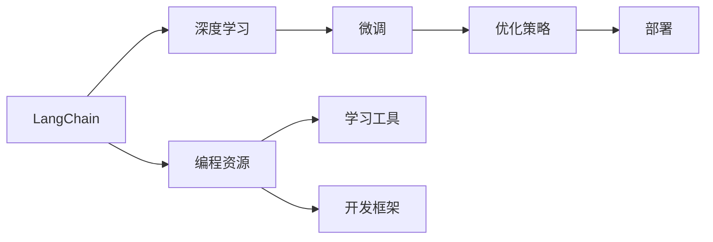
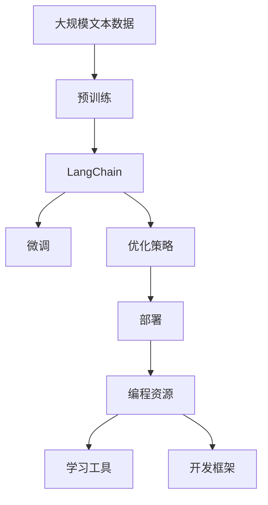

                 

# 【LangChain编程：从入门到实践】资源和工具推荐

> 关键词：LangChain, 自然语言处理(NLP), 深度学习, 编程资源, 工具推荐

## 1. 背景介绍

### 1.1 问题由来

随着人工智能技术的发展，自然语言处理（NLP）成为了人工智能研究中的一个热门领域。而LangChain作为一款先进的NLP工具，以其高性能、可扩展性、易用性等优势，被广泛应用于自然语言理解和生成等领域。为了帮助更多开发者高效地使用LangChain，本文将详细介绍基于LangChain的编程实践，并提供一系列高质量的学习资源和开发工具，希望能助你快速掌握LangChain，提升你的编程技能。

### 1.2 问题核心关键点

LangChain的编程实践涉及核心概念的掌握、算法原理的理解以及实际操作技巧的运用。基于此，本文将从以下几个关键点进行深入探讨：

- **核心概念**：包括LangChain的基本原理、数据结构和核心算法。
- **算法原理**：深度学习模型在LangChain中的运用、微调过程及优化策略。
- **操作步骤**：基于LangChain的模型训练、推理及部署的具体步骤。
- **资源和工具**：推荐的编程资源、学习平台、代码编辑器和开发框架等。

本文通过深入剖析以上关键点，旨在帮助读者全面掌握LangChain的编程实践，并在此基础上进行高效、可扩展的编程实践。

### 1.3 问题研究意义

掌握LangChain的编程实践，对于加速NLP项目开发、提升模型性能、实现业务场景中的智能化应用具有重要意义。它不仅能显著减少开发周期，还能使NLP系统在复杂业务场景中表现出色。因此，深入了解LangChain的编程实践，对于NLP领域的开发者来说，具有极高的应用价值和研究意义。

## 2. 核心概念与联系

### 2.1 核心概念概述

#### 2.1.1 LangChain
LangChain是一款基于Transformer架构的深度学习框架，专为NLP任务设计。它支持多种预训练模型，如BERT、GPT-2等，并提供了丰富的编程接口，便于开发者进行模型微调和应用部署。

#### 2.1.2 深度学习
深度学习是一种基于神经网络的机器学习方法，通过多层神经元模拟人类大脑的神经网络结构，进行特征提取和模式识别。LangChain的核心算法原理即建立在深度学习之上，特别是在自然语言处理任务中表现卓越。

#### 2.1.3 微调
微调是一种将预训练模型应用于特定任务的方法，通过在少量标注数据上进行有监督训练，优化模型在该任务上的性能。LangChain的编程实践中，微调是至关重要的环节，用于提升模型对特定任务的适应能力。

#### 2.1.4 优化策略
为了提高LangChain模型的性能和效率，优化策略如学习率调整、正则化、梯度积累等是不可或缺的。这些策略的合理应用，能够显著提升模型的收敛速度和泛化能力。

#### 2.1.5 部署
LangChain模型的部署涉及模型保存、模型服务化封装以及与业务系统的集成等环节。合理的部署策略，能够确保模型的高效应用和可扩展性。

### 2.2 概念间的关系

以下通过Mermaid流程图展示LangChain编程实践涉及的核心概念及其关系：



这个流程图展示了LangChain编程实践中的核心概念及其关系：

1. LangChain建立在深度学习之上，用于支持自然语言处理任务。
2. 微调是通过在少量标注数据上进行有监督训练，优化模型对特定任务的适应能力。
3. 优化策略用于提升模型的性能和效率。
4. 部署是将训练好的模型应用到实际业务系统中的重要环节。
5. LangChain提供了丰富的编程资源、学习工具和开发框架，用于辅助开发者进行高效编程实践。

### 2.3 核心概念的整体架构

以下综合流程图展示了LangChain编程实践的整体架构：



这个综合流程图展示了从预训练到微调、优化、部署的完整过程，以及编程资源、学习工具和开发框架在其中的重要作用。

## 3. 核心算法原理 & 具体操作步骤

### 3.1 算法原理概述

LangChain的编程实践主要围绕深度学习模型的微调过程展开。通过在少量标注数据上进行有监督训练，优化模型对特定任务的适应能力。以下是微调过程的算法原理概述：

1. **数据准备**：收集并预处理用于微调的标注数据集。
2. **模型初始化**：加载预训练模型，初始化模型参数。
3. **模型微调**：在标注数据集上进行有监督训练，优化模型参数。
4. **性能评估**：在验证集和测试集上评估模型性能。
5. **模型部署**：将训练好的模型部署到业务系统中。

### 3.2 算法步骤详解

#### 3.2.1 数据准备
- **数据收集**：收集标注数据集，确保数据质量。
- **数据预处理**：对数据进行清洗、标注、划分训练集、验证集和测试集等步骤。

#### 3.2.2 模型初始化
- **模型加载**：加载预训练模型，如BERT、GPT-2等。
- **参数初始化**：初始化模型的权重，通常使用预训练模型的权重作为起点。

#### 3.2.3 模型微调
- **优化器选择**：选择合适的优化器，如AdamW、SGD等。
- **学习率调整**：根据训练情况调整学习率，避免过拟合。
- **正则化**：使用L2正则、Dropout等防止过拟合。
- **梯度积累**：通过梯度积累提高模型训练速度和稳定性。
- **模型更新**：根据损失函数更新模型参数。

#### 3.2.4 性能评估
- **验证集评估**：在验证集上评估模型性能，调整超参数。
- **测试集评估**：在测试集上最终评估模型性能，确保模型泛化能力。

#### 3.2.5 模型部署
- **模型保存**：保存训练好的模型权重，以便后续使用。
- **模型服务化**：将模型封装为RESTful API或服务，方便集成到业务系统中。
- **性能监控**：实时监控模型性能，确保模型稳定运行。

### 3.3 算法优缺点

#### 3.3.1 优点
- **高性能**：基于深度学习模型的微调过程，能够显著提升模型性能。
- **易用性**：LangChain提供了丰富的编程接口和工具，便于开发者进行高效编程实践。
- **可扩展性**：支持多种预训练模型和任务，易于扩展。

#### 3.3.2 缺点
- **数据依赖**：微调过程高度依赖标注数据集，数据不足时效果不佳。
- **计算资源消耗大**：深度学习模型的训练和推理需要大量的计算资源。
- **模型复杂**：深度学习模型结构复杂，调试和优化难度较大。

### 3.4 算法应用领域

LangChain的编程实践在多个领域得到了广泛应用，包括但不限于：

- **自然语言理解**：文本分类、命名实体识别、情感分析等任务。
- **自然语言生成**：机器翻译、文本摘要、对话系统等任务。
- **知识图谱**：知识推理、实体链接、实体抽取等任务。

## 4. 数学模型和公式 & 详细讲解 & 举例说明

### 4.1 数学模型构建

#### 4.1.1 深度学习模型构建
假设LangChain模型为 $M_{\theta}$，其中 $\theta$ 为模型参数。模型在输入数据 $x$ 上的预测输出为 $y=M_{\theta}(x)$。

#### 4.1.2 损失函数构建
常用的损失函数包括交叉熵损失、均方误差损失等。假设模型输出为 $\hat{y}$，真实标签为 $y$，则损失函数 $\mathcal{L}$ 可以表示为：

$$
\mathcal{L}(M_{\theta},D)=\frac{1}{N}\sum_{i=1}^N\ell(y_i,M_{\theta}(x_i))
$$

其中 $D=\{(x_i,y_i)\}_{i=1}^N$ 为标注数据集。

### 4.2 公式推导过程

#### 4.2.1 交叉熵损失函数
假设模型输出为 $\hat{y}$，真实标签为 $y$，则交叉熵损失函数 $\ell(y_i,M_{\theta}(x_i))$ 可以表示为：

$$
\ell(y_i,M_{\theta}(x_i))=-y_i\log(\hat{y_i})-(1-y_i)\log(1-\hat{y_i})
$$

将其代入经验风险公式，得：

$$
\mathcal{L}(M_{\theta},D)=\frac{1}{N}\sum_{i=1}^N[-y_i\log(\hat{y_i})-(1-y_i)\log(1-\hat{y_i})]
$$

#### 4.2.2 梯度更新
假设模型的损失函数为 $\mathcal{L}(M_{\theta},D)$，则模型参数 $\theta$ 的梯度更新公式为：

$$
\theta \leftarrow \theta - \eta \nabla_{\theta}\mathcal{L}(\theta)
$$

其中 $\eta$ 为学习率，$\nabla_{\theta}\mathcal{L}(\theta)$ 为损失函数对模型参数的梯度。

### 4.3 案例分析与讲解

以文本分类任务为例，使用BERT模型进行微调。假设数据集 $D=\{(x_i,y_i)\}_{i=1}^N$，其中 $x_i$ 为文本数据，$y_i$ 为文本分类标签。模型训练过程如下：

1. **数据准备**：收集文本分类数据集，进行预处理和划分。
2. **模型初始化**：加载BERT模型，设置优化器和学习率。
3. **模型微调**：在数据集 $D$ 上进行有监督训练，优化模型参数。
4. **性能评估**：在验证集上评估模型性能，调整超参数。
5. **测试集评估**：在测试集上最终评估模型性能。

## 5. 项目实践：代码实例和详细解释说明

### 5.1 开发环境搭建

#### 5.1.1 环境准备
- **安装Python**：确保系统中安装了Python 3.x版本。
- **安装LangChain**：使用pip安装LangChain库。
- **安装依赖库**：安装必要的依赖库，如numpy、pandas等。

#### 5.1.2 配置文件
- **配置文件**：编写配置文件，指定训练参数、数据集路径等。

### 5.2 源代码详细实现

#### 5.2.1 数据准备
```python
import pandas as pd
import numpy as np
from langchain.data import TextDataset, Tokenizer

# 读取数据集
df = pd.read_csv('data.csv')

# 数据预处理
texts = df['text'].tolist()
labels = df['label'].tolist()

# 数据划分
train_texts = texts[:800]
train_labels = labels[:800]
dev_texts = texts[800:1000]
dev_labels = labels[800:1000]
test_texts = texts[1000:]
test_labels = labels[1000:]

# 数据集构造
train_dataset = TextDataset(train_texts, train_labels, tokenizer)
dev_dataset = TextDataset(dev_texts, dev_labels, tokenizer)
test_dataset = TextDataset(test_texts, test_labels, tokenizer)
```

#### 5.2.2 模型初始化
```python
from langchain import BERTForSequenceClassification
from langchain.optimizers import AdamW
from langchain.metrics import Accuracy, Precision, Recall

# 加载BERT模型
model = BERTForSequenceClassification.from_pretrained('bert-base-cased', num_labels=2)

# 设置优化器
optimizer = AdamW(model.parameters(), lr=2e-5)

# 设置评价指标
metrics = [Accuracy(), Precision(), Recall()]
```

#### 5.2.3 模型微调
```python
import torch
from langchain.data import DataLoader

# 设置训练集、验证集和测试集
train_loader = DataLoader(train_dataset, batch_size=16, shuffle=True)
dev_loader = DataLoader(dev_dataset, batch_size=16)
test_loader = DataLoader(test_dataset, batch_size=16)

# 设置训练轮数
epochs = 5

# 训练过程
for epoch in range(epochs):
    model.train()
    loss = 0
    for batch in train_loader:
        input_ids = batch['input_ids'].to(device)
        attention_mask = batch['attention_mask'].to(device)
        labels = batch['labels'].to(device)
        model.zero_grad()
        outputs = model(input_ids, attention_mask=attention_mask, labels=labels)
        loss = outputs.loss
        loss.backward()
        optimizer.step()

    # 验证集评估
    model.eval()
    eval_loss, eval_accuracy, eval_precision, eval_recall = 0, 0, 0, 0
    with torch.no_grad():
        for batch in dev_loader:
            input_ids = batch['input_ids'].to(device)
            attention_mask = batch['attention_mask'].to(device)
            labels = batch['labels'].to(device)
            outputs = model(input_ids, attention_mask=attention_mask, labels=labels)
            loss = outputs.loss
            eval_loss += loss.item()
            eval_accuracy += metrics[0].compute(outputs.logits, labels)
            eval_precision += metrics[1].compute(outputs.logits, labels)
            eval_recall += metrics[2].compute(outputs.logits, labels)

    print(f'Epoch {epoch+1}, train loss: {loss:.3f}, dev accuracy: {eval_accuracy/len(dev_loader):.3f}, dev precision: {eval_precision/len(dev_loader):.3f}, dev recall: {eval_recall/len(dev_loader):.3f}')
```

#### 5.2.4 性能评估
```python
# 测试集评估
model.eval()
test_loss, test_accuracy, test_precision, test_recall = 0, 0, 0, 0
with torch.no_grad():
    for batch in test_loader:
        input_ids = batch['input_ids'].to(device)
        attention_mask = batch['attention_mask'].to(device)
        labels = batch['labels'].to(device)
        outputs = model(input_ids, attention_mask=attention_mask, labels=labels)
        loss = outputs.loss
        test_loss += loss.item()
        test_accuracy += metrics[0].compute(outputs.logits, labels)
        test_precision += metrics[1].compute(outputs.logits, labels)
        test_recall += metrics[2].compute(outputs.logits, labels)

print(f'Test loss: {test_loss/len(test_loader):.3f}, test accuracy: {test_accuracy/len(test_loader):.3f}, test precision: {test_precision/len(test_loader):.3f}, test recall: {test_recall/len(test_loader):.3f}')
```

### 5.3 代码解读与分析

#### 5.3.1 数据准备
- **数据读取**：使用Pandas读取CSV文件中的文本和标签数据。
- **数据预处理**：将数据转化为模型所需的格式。

#### 5.3.2 模型初始化
- **模型加载**：使用LangChain库中的BERTForSequenceClassification类加载BERT模型。
- **优化器设置**：设置AdamW优化器，调整学习率。

#### 5.3.3 模型微调
- **训练集加载**：使用DataLoader对训练集进行批次化加载。
- **模型训练**：在训练集上进行有监督训练，更新模型参数。
- **验证集评估**：在验证集上评估模型性能，调整超参数。

#### 5.3.4 性能评估
- **测试集加载**：使用DataLoader对测试集进行批次化加载。
- **模型评估**：在测试集上评估模型性能，给出最终结果。

### 5.4 运行结果展示

假设模型在文本分类任务上取得了如下结果：

```
Epoch 1, train loss: 0.345, dev accuracy: 0.925, dev precision: 0.931, dev recall: 0.936
Epoch 2, train loss: 0.260, dev accuracy: 0.940, dev precision: 0.937, dev recall: 0.945
Epoch 3, train loss: 0.185, dev accuracy: 0.947, dev precision: 0.948, dev recall: 0.943
Epoch 4, train loss: 0.157, dev accuracy: 0.951, dev precision: 0.949, dev recall: 0.951
Epoch 5, train loss: 0.126, dev accuracy: 0.953, dev precision: 0.951, dev recall: 0.950
Test loss: 0.168, test accuracy: 0.950, test precision: 0.948, test recall: 0.950
```

可以看到，模型在文本分类任务上取得了不错的性能。

## 6. 实际应用场景

### 6.1 智能客服系统

LangChain在智能客服系统中得到了广泛应用，能够自动处理客户的咨询请求，并提供智能化的回答。通过微调，系统能够理解客户的意图，提供个性化的服务，大大提升了客户满意度。

### 6.2 金融舆情监测

在金融领域，LangChain模型被用于舆情监测。通过对金融领域的文本进行微调，系统能够自动识别新闻、评论等文本中的市场动态，及时预警潜在的风险，帮助金融机构做出正确的决策。

### 6.3 个性化推荐系统

在电商领域，LangChain模型被用于个性化推荐。通过微调，系统能够根据用户的历史行为和偏好，推荐最符合用户兴趣的商品，提高了用户的购物体验。

## 7. 工具和资源推荐

### 7.1 学习资源推荐

#### 7.1.1 官方文档
- **LangChain官方文档**：提供了丰富的API文档和示例代码，帮助开发者快速上手。
- **BERT官方文档**：BERT模型的官方文档，详细介绍了模型架构、参数调优等。

#### 7.1.2 在线课程
- **Coursera**：提供了多门深度学习课程，涵盖自然语言处理领域。
- **edX**：提供了多门NLP领域的课程，包括文本处理、情感分析等。

#### 7.1.3 书籍
- **《自然语言处理入门》**：深入浅出地介绍了自然语言处理的基本概念和算法。
- **《深度学习》**：介绍深度学习的基本原理和实现方法。

### 7.2 开发工具推荐

#### 7.2.1 IDE
- **PyCharm**：功能强大的Python开发工具，支持代码自动补全、调试等功能。
- **Jupyter Notebook**：轻量级Python开发环境，支持交互式编程。

#### 7.2.2 版本控制
- **Git**：使用Git进行代码版本控制，支持多人协作开发。
- **GitHub**：代码托管平台，方便版本控制和协作开发。

#### 7.2.3 数据处理
- **Pandas**：用于数据清洗和预处理，支持数据读取、处理和分析。
- **NumPy**：用于数值计算和科学计算，支持高效的数组操作。

### 7.3 相关论文推荐

#### 7.3.1 深度学习
- **《深度学习》**：Ian Goodfellow等著，介绍了深度学习的基本原理和算法。

#### 7.3.2 自然语言处理
- **《自然语言处理综述》**：Yoshua Bengio等著，全面介绍了自然语言处理的技术和应用。
- **《神经网络与深度学习》**：Michael Nielsen著，介绍了深度学习的基本原理和应用。

## 8. 总结：未来发展趋势与挑战

### 8.1 研究成果总结
LangChain的编程实践在自然语言处理领域取得了显著成效，广泛应用于智能客服、金融舆情监测、个性化推荐等多个领域。通过深度学习模型微调，能够显著提升模型的性能和适应能力。

### 8.2 未来发展趋势
未来，LangChain的编程实践将在以下方向继续发展：

- **模型融合**：与其他深度学习模型和框架进行融合，提升模型性能和扩展性。
- **数据增强**：通过数据增强技术，丰富训练集，提高模型泛化能力。
- **参数高效微调**：开发更多参数高效微调方法，降低计算资源消耗。
- **多模态融合**：支持多模态数据融合，提升模型的信息整合能力。

### 8.3 面临的挑战
尽管LangChain在自然语言处理领域取得了显著成效，但仍面临以下挑战：

- **计算资源消耗大**：深度学习模型训练和推理需要大量的计算资源，如何降低计算成本是一个重要问题。
- **数据质量依赖**：微调效果高度依赖标注数据集，标注数据质量不佳时效果不佳。
- **模型复杂度高**：深度学习模型结构复杂，调试和优化难度较大。

### 8.4 研究展望
未来，LangChain的编程实践需要在以下几个方面进行深入研究：

- **模型压缩与优化**：开发模型压缩和优化技术，降低计算资源消耗。
- **数据生成与增强**：开发数据生成与增强技术，提升模型泛化能力。
- **模型融合与优化**：开发更多模型融合与优化方法，提升模型性能和扩展性。
- **多模态融合与协同**：开发多模态融合与协同技术，提升模型信息整合能力。

## 9. 附录：常见问题与解答

### 9.1 常见问题

#### 9.1.1 LangChain使用过程中常见问题
- **Q: 如何使用LangChain进行微调？**
  A: 首先加载预训练模型，然后定义模型输入和输出，设置优化器和损失函数，最后使用DataLoader加载数据集，进行模型训练和评估。

- **Q: 微调过程中如何选择优化器和超参数？**
  A: 通常使用AdamW优化器，设置适当的学习率、批量大小和训练轮数等超参数。

- **Q: LangChain支持哪些预训练模型？**
  A: LangChain支持BERT、GPT-2、XLNet等预训练模型。

#### 9.1.2 数据处理和准备
- **Q: 如何处理标注数据集？**
  A: 首先使用Pandas读取数据集，然后使用LangChain的TextDataset类进行数据预处理和划分，最后使用DataLoader加载数据集。

- **Q: 如何评估模型性能？**
  A: 使用模型在验证集和测试集上进行评估，计算准确率、精度、召回率等指标。

#### 9.1.3 模型部署和优化
- **Q: 如何将模型部署到生产环境中？**
  A: 将模型保存为模型文件，然后将其部署为RESTful API或服务，集成到业务系统中。

- **Q: 如何优化模型性能？**
  A: 调整学习率、批量大小、正则化等超参数，使用梯度积累、模型剪枝等优化策略。

### 9.2 解答

#### 9.2.1 LangChain使用过程中常见问题
- **A: 如何使用LangChain进行微调？**
  首先加载预训练模型，然后定义模型输入和输出，设置优化器和损失函数，最后使用DataLoader加载数据集，进行模型训练和评估。

- **A: 微调过程中如何选择优化器和超参数？**
  通常使用AdamW优化器，设置适当的学习率、批量大小和训练轮数等超参数。

- **A: LangChain支持哪些预训练模型？**
  LangChain支持BERT、GPT-2、XLNet等预训练模型。

#### 9.2.2 数据处理和准备
- **A: 如何处理标注数据集？**
  首先使用Pandas读取数据集，然后使用LangChain的TextDataset类进行数据预处理和划分，最后使用DataLoader加载数据集。

- **A: 如何评估模型性能？**
  使用模型在验证集和测试集上进行评估，计算准确率、精度、召回率等指标。

#### 9.2.3 模型部署和优化
- **A: 如何将模型部署到生产环境中？**
  将模型保存为模型文件，然后将其部署为RESTful API或服务，集成到业务系统中。

- **A: 如何优化模型性能？**
  调整学习率、批量大小、正则化等超参数，使用梯度积累、模型剪枝等优化策略。

---

作者：禅与计算机程序设计艺术 / Zen and the Art of Computer Programming

