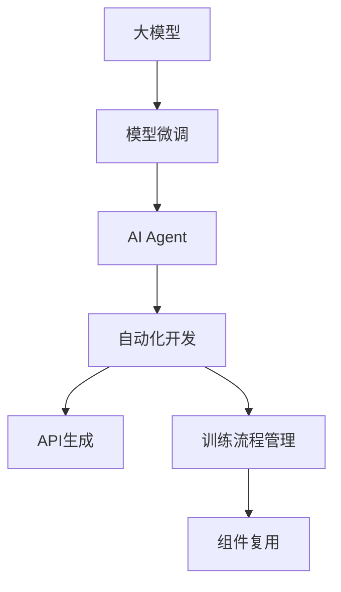
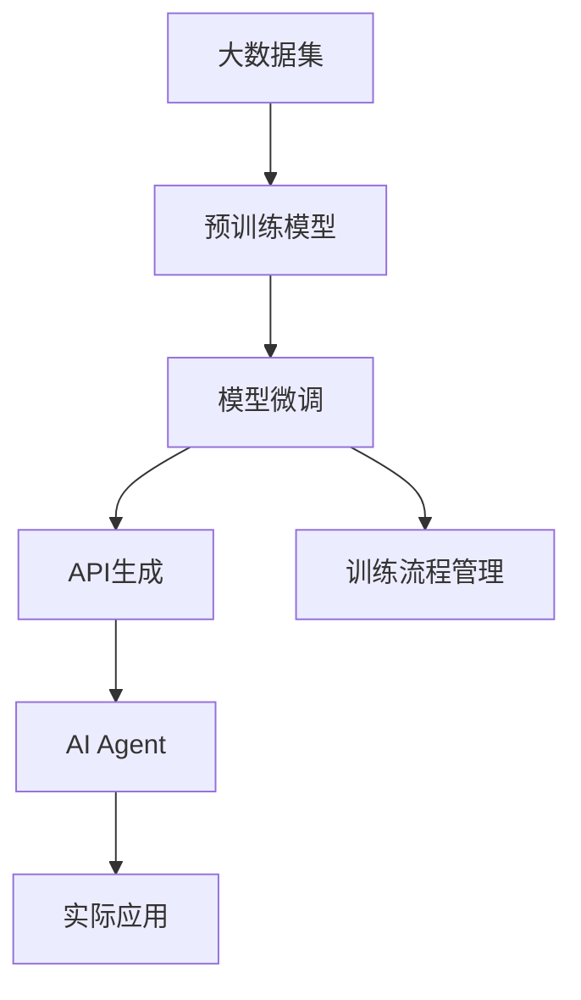
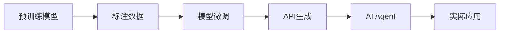
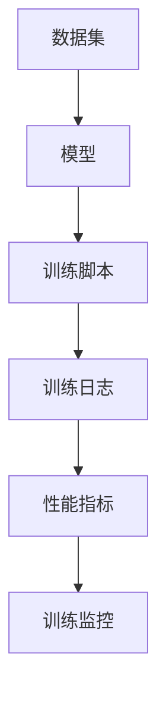
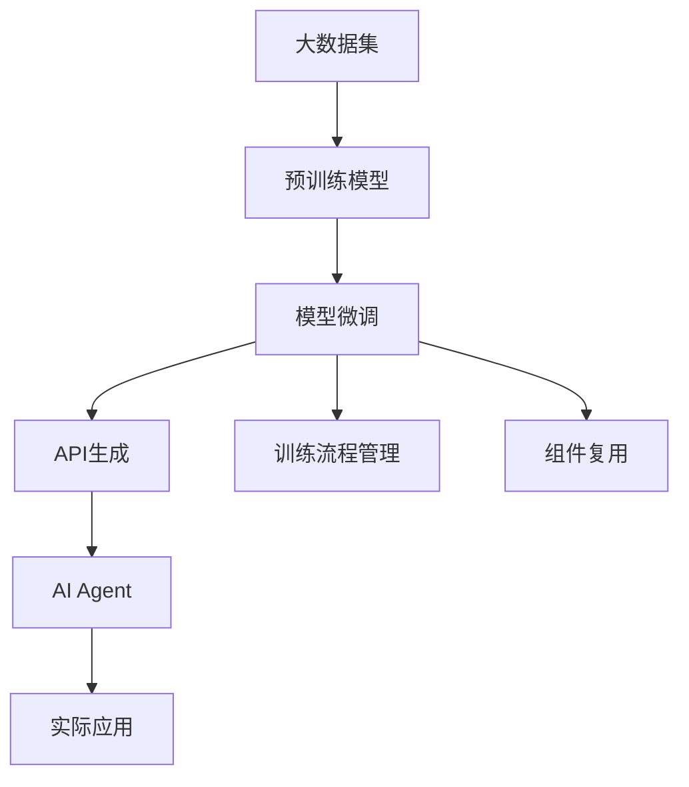

                 

# 【大模型应用开发 动手做AI Agent】AutoGen实战

> 关键词：大模型应用, AI Agent, 编程实战, 模型微调, AutoGen, 自动化开发, 自然语言处理

## 1. 背景介绍

### 1.1 问题由来
近年来，深度学习在自然语言处理(NLP)、计算机视觉(CV)、语音识别(SR)等众多领域取得了巨大进展，其中大模型如BERT、GPT等预训练模型，更是引发了新一轮的AI革命。这些大模型不仅具备强大的数据处理能力，还能通过微调学习特定任务，实现高效的应用。

但大模型的开发和微调过程繁琐复杂，通常需要大量的数据、计算资源和专业知识。如何在不增加工作量的情况下，快速构建并优化AI Agent，成为技术从业者面临的重大挑战。

### 1.2 问题核心关键点
为解决上述问题，AutoGen应运而生。AutoGen是一种基于大模型的自动化开发框架，能够大幅降低AI Agent的开发和优化难度，快速构建高性能、高扩展性的AI Agent。其核心功能包括：

- **模型微调自动化**：利用预训练大模型的通用表示，自动完成模型适配和微调，减少标注数据需求，提升模型性能。
- **API自动生成**：根据任务需求自动生成API接口，提供统一的调用方式，提高开发效率。
- **训练流程自动化**：支持训练流程的标准化管理，自动监控训练进度，提供性能指标和调试工具。
- **组件复用**：支持组件复用，快速构建多任务AI Agent，提高开发效率。

### 1.3 问题研究意义
AutoGen的引入，对于提升大模型在应用场景中的落地能力，加速AI技术的产业化进程，具有重要意义：

1. **降低开发成本**：利用AutoGen，开发者无需从头开发，即可快速构建高性能AI Agent，大幅降低时间、人力和资源投入。
2. **提升模型性能**：通过自动化微调，模型能够在特定任务上取得最优性能，提升应用效果。
3. **提高开发效率**：AutoGen自动生成API，提供统一的调用方式，减少了开发者从零开始编写代码的需求。
4. **增强模型扩展性**：AutoGen支持多任务模型复用，使得开发者能够快速构建复杂的AI Agent系统，增强系统功能。
5. **推动技术发展**：AutoGen的出现，能够吸引更多开发者参与AI开发，推动相关技术进步，加速AI技术在各领域的普及。

## 2. 核心概念与联系

### 2.1 核心概念概述

为更好地理解AutoGen的核心原理和应用，本节将介绍几个关键概念：

- **大模型**：以BERT、GPT为代表的大规模预训练模型，具备强大的数据处理和模式识别能力。
- **模型微调**：在大模型上添加任务特定的头，利用少量标注数据对模型进行有监督训练，提升模型在特定任务上的性能。
- **AI Agent**：基于AI模型实现的应用系统，能够自动执行任务、处理数据和提供服务。
- **AutoGen**：基于大模型的自动化开发框架，通过自动化微调、API生成、训练流程管理等技术，提升AI Agent的开发效率和性能。

这些概念之间的逻辑关系可以通过以下Mermaid流程图来展示：



这个流程图展示了大模型、模型微调、AI Agent以及AutoGen之间的联系和应用过程。

### 2.2 概念间的关系

这些核心概念之间存在着紧密的联系，形成了AutoGen自动化开发的核心生态系统。下面我们通过几个Mermaid流程图来展示这些概念之间的关系。

#### 2.2.1 AutoGen的整体架构



这个流程图展示了AutoGen的整体架构，从预训练模型的构建，到模型微调、API生成，再到AI Agent的构建和实际应用。

#### 2.2.2 AutoGen在微调中的应用



这个流程图展示了AutoGen在模型微调中的应用，从预训练模型到标注数据，再到模型微调、API生成，最终实现AI Agent的实际应用。

#### 2.2.3 AutoGen的训练流程管理



这个流程图展示了AutoGen的训练流程管理，从数据集到模型训练，再到训练日志和性能指标的记录，最后到训练监控的实现。

### 2.3 核心概念的整体架构

最后，我们用一个综合的流程图来展示这些核心概念在大模型微调过程中的整体架构：



这个综合流程图展示了从预训练模型的构建，到模型微调、API生成、训练流程管理，再到AI Agent的构建和实际应用的全过程。通过这些流程图，我们可以更清晰地理解AutoGen自动化开发过程中的各个关键步骤和概念。

## 3. 核心算法原理 & 具体操作步骤
### 3.1 算法原理概述

AutoGen的算法原理主要基于大模型的预训练-微调范式，通过自动化微调、API生成、训练流程管理等技术，实现高效、便捷的AI Agent开发。其核心步骤包括：

1. **预训练模型的加载**：从官方仓库下载预训练模型，或使用已有模型微调结果。
2. **标注数据的准备**：根据任务需求，收集、整理标注数据，生成训练集、验证集和测试集。
3. **模型微调**：利用AutoGen提供的自动微调工具，对预训练模型进行微调，适配特定任务。
4. **API自动生成**：根据任务需求，自动生成API接口，提供统一的调用方式。
5. **训练流程管理**：自动管理训练过程，监控训练进度，输出性能指标。
6. **组件复用**：利用AutoGen提供的组件复用机制，快速构建多任务AI Agent。

### 3.2 算法步骤详解

**Step 1: 准备数据集**

首先，需要准备训练、验证和测试数据集，可以使用公开数据集如CoNLL-2003、GLUE等，也可以根据具体任务需求自行收集整理。数据集需要按照模型输入格式进行处理，如分词、编码、标记等。

```python
import pandas as pd
import transformers
from transformers import BertTokenizer, BertForTokenClassification

# 定义数据集路径
train_path = 'train.csv'
dev_path = 'dev.csv'
test_path = 'test.csv'

# 加载数据集
train_data = pd.read_csv(train_path)
dev_data = pd.read_csv(dev_path)
test_data = pd.read_csv(test_path)

# 定义分词器
tokenizer = BertTokenizer.from_pretrained('bert-base-cased')
```

**Step 2: 加载预训练模型**

加载预训练模型，这里以BERT为例。

```python
# 加载预训练模型
model = BertForTokenClassification.from_pretrained('bert-base-cased', num_labels=len(tag2id))
```

**Step 3: 模型微调**

使用AutoGen提供的微调工具，对模型进行微调。AutoGen支持多种微调方法，如参数高效微调、提示学习等。这里以参数高效微调为例，冻结预训练层，只微调顶层分类器。

```python
from auto_gen import ModelFineTuning

# 定义微调器
fine_tuning = ModelFineTuning(model, train_data, dev_data, test_data, tokenizer)

# 微调模型
fine_tuning.fit()
```

**Step 4: 自动生成API**

使用AutoGen提供的API生成工具，根据任务需求生成API接口。API生成器会自动生成模型的输入、输出格式，并提供统一的调用方式。

```python
# 自动生成API
api = fine_tuning.generate_api()
```

**Step 5: 训练流程管理**

使用AutoGen提供的训练流程管理工具，自动管理训练过程，监控训练进度，输出性能指标。训练流程管理工具包括模型保存、结果分析等功能。

```python
# 启动训练流程管理
fine_tuning.train()
```

**Step 6: 组件复用**

利用AutoGen提供的组件复用机制，快速构建多任务AI Agent。组件复用机制可以重复利用微调后的模型，快速构建复杂的AI Agent系统。

```python
# 组件复用
from auto_gen import ModelComponent
from auto_gen import ModelComposite

# 定义组件
component1 = ModelComponent(model1)
component2 = ModelComponent(model2)

# 定义复合模型
composite = ModelComposite(component1, component2)
```

### 3.3 算法优缺点

AutoGen作为一种基于大模型的自动化开发框架，具有以下优点：

1. **高效便捷**：自动完成模型微调、API生成、训练流程管理等步骤，大大降低了开发难度和成本。
2. **性能优越**：利用预训练大模型的通用表示，自动完成模型适配和微调，提升模型性能。
3. **灵活可扩展**：支持多任务模型复用，快速构建复杂AI Agent系统，提高开发效率。

但AutoGen也存在以下缺点：

1. **依赖预训练模型**：需要下载预训练模型，且模型大小和性能直接影响开发效率。
2. **标注数据需求**：虽然减少标注数据需求，但仍需要一定量的标注数据进行微调。
3. **学习曲线陡峭**：虽然提供自动工具，但仍需要一定的领域知识和编程经验。
4. **开发成本**：需要配置开发环境，涉及数据预处理、模型微调等多个环节。

### 3.4 算法应用领域

AutoGen在NLP、CV、SR等多个领域均具有广泛应用，如：

- **命名实体识别(NER)**：使用微调后的BERT模型，进行命名实体识别，如识别人名、地名、机构名等。
- **情感分析**：使用微调后的模型进行情感分析，如判断文本情感极性。
- **机器翻译**：使用微调后的模型进行文本翻译，如将英文翻译成中文。
- **智能客服**：使用微调后的模型构建智能客服系统，自动回答用户咨询。
- **金融舆情监测**：使用微调后的模型监测金融舆情，识别负面信息。
- **推荐系统**：使用微调后的模型进行个性化推荐，提高用户满意度。

## 4. 数学模型和公式 & 详细讲解 & 举例说明

### 4.1 数学模型构建

以BERT为例，BERT模型通过预训练和微调，学习到文本中的语义表示，用于特定任务的文本处理。BERT模型的输入表示形式为：

$$
x = \text{[CLS]} \ \text{TOKENS} \ \text{[SEP]}
$$

其中，[CLS]和[SEP]是特殊标记符号，用于表示输入文本的开始和结束。TOKENS表示分词后的文本序列。

### 4.2 公式推导过程

BERT模型的输入表示为：

$$
x = \text{[CLS]} \ \text{TOKENS} \ \text{[SEP]}
$$

预训练模型的输入表示形式为：

$$
x = \text{[CLS]} \ \text{TOKENS} \ \text{[SEP]}
$$

其中，[CLS]和[SEP]是特殊标记符号，用于表示输入文本的开始和结束。TOKENS表示分词后的文本序列。

### 4.3 案例分析与讲解

以BERT模型为例，BERT模型通过预训练和微调，学习到文本中的语义表示，用于特定任务的文本处理。其核心算法包括：

- **自监督预训练**：通过掩码语言模型和下一句预测任务，学习文本的语义表示。
- **微调**：在标注数据上，对预训练模型进行微调，适应特定任务，如命名实体识别、情感分析等。

以命名实体识别任务为例，BERT模型的微调过程如下：

1. **预训练模型加载**：加载预训练BERT模型，并定义分词器。

```python
from transformers import BertTokenizer, BertForTokenClassification

# 加载预训练模型和分词器
tokenizer = BertTokenizer.from_pretrained('bert-base-cased')
model = BertForTokenClassification.from_pretrained('bert-base-cased', num_labels=len(tag2id))
```

2. **数据准备**：收集训练、验证和测试数据，并进行数据预处理，如分词、编码、标记等。

```python
# 定义数据集路径
train_path = 'train.csv'
dev_path = 'dev.csv'
test_path = 'test.csv'

# 加载数据集
train_data = pd.read_csv(train_path)
dev_data = pd.read_csv(dev_path)
test_data = pd.read_csv(test_path)

# 定义分词器
tokenizer = BertTokenizer.from_pretrained('bert-base-cased')
```

3. **模型微调**：使用AutoGen提供的微调工具，对预训练模型进行微调，适配命名实体识别任务。

```python
from auto_gen import ModelFineTuning

# 定义微调器
fine_tuning = ModelFineTuning(model, train_data, dev_data, test_data, tokenizer)

# 微调模型
fine_tuning.fit()
```

4. **API生成**：使用AutoGen提供的API生成工具，自动生成命名实体识别的API接口。

```python
# 自动生成API
api = fine_tuning.generate_api()
```

5. **训练流程管理**：使用AutoGen提供的训练流程管理工具，自动管理训练过程，监控训练进度，输出性能指标。

```python
# 启动训练流程管理
fine_tuning.train()
```

6. **组件复用**：利用AutoGen提供的组件复用机制，快速构建多任务AI Agent。

```python
# 组件复用
from auto_gen import ModelComponent
from auto_gen import ModelComposite

# 定义组件
component1 = ModelComponent(model1)
component2 = ModelComponent(model2)

# 定义复合模型
composite = ModelComposite(component1, component2)
```

## 5. 项目实践：代码实例和详细解释说明
### 5.1 开发环境搭建

在进行AutoGen项目实践前，我们需要准备好开发环境。以下是使用Python进行PyTorch开发的环境配置流程：

1. 安装Anaconda：从官网下载并安装Anaconda，用于创建独立的Python环境。

2. 创建并激活虚拟环境：
```bash
conda create -n pytorch-env python=3.8 
conda activate pytorch-env
```

3. 安装PyTorch：根据CUDA版本，从官网获取对应的安装命令。例如：
```bash
conda install pytorch torchvision torchaudio cudatoolkit=11.1 -c pytorch -c conda-forge
```

4. 安装Transformers库：
```bash
pip install transformers
```

5. 安装各类工具包：
```bash
pip install numpy pandas scikit-learn matplotlib tqdm jupyter notebook ipython
```

完成上述步骤后，即可在`pytorch-env`环境中开始AutoGen实践。

### 5.2 源代码详细实现

下面我们以命名实体识别(NER)任务为例，给出使用AutoGen对BERT模型进行微调的PyTorch代码实现。

首先，定义NER任务的数据处理函数：

```python
from transformers import BertTokenizer
from torch.utils.data import Dataset
import torch

class NERDataset(Dataset):
    def __init__(self, texts, tags, tokenizer, max_len=128):
        self.texts = texts
        self.tags = tags
        self.tokenizer = tokenizer
        self.max_len = max_len
        
    def __len__(self):
        return len(self.texts)
    
    def __getitem__(self, item):
        text = self.texts[item]
        tags = self.tags[item]
        
        encoding = self.tokenizer(text, return_tensors='pt', max_length=self.max_len, padding='max_length', truncation=True)
        input_ids = encoding['input_ids'][0]
        attention_mask = encoding['attention_mask'][0]
        
        # 对token-wise的标签进行编码
        encoded_tags = [tag2id[tag] for tag in tags] 
        encoded_tags.extend([tag2id['O']] * (self.max_len - len(encoded_tags)))
        labels = torch.tensor(encoded_tags, dtype=torch.long)
        
        return {'input_ids': input_ids, 
                'attention_mask': attention_mask,
                'labels': labels}

# 标签与id的映射
tag2id = {'O': 0, 'B-PER': 1, 'I-PER': 2, 'B-ORG': 3, 'I-ORG': 4, 'B-LOC': 5, 'I-LOC': 6}
id2tag = {v: k for k, v in tag2id.items()}

# 创建dataset
tokenizer = BertTokenizer.from_pretrained('bert-base-cased')

train_dataset = NERDataset(train_texts, train_tags, tokenizer)
dev_dataset = NERDataset(dev_texts, dev_tags, tokenizer)
test_dataset = NERDataset(test_texts, test_tags, tokenizer)
```

然后，定义模型和优化器：

```python
from transformers import BertForTokenClassification, AdamW

model = BertForTokenClassification.from_pretrained('bert-base-cased', num_labels=len(tag2id))

optimizer = AdamW(model.parameters(), lr=2e-5)
```

接着，定义训练和评估函数：

```python
from torch.utils.data import DataLoader
from tqdm import tqdm
from sklearn.metrics import classification_report

device = torch.device('cuda') if torch.cuda.is_available() else torch.device('cpu')
model.to(device)

def train_epoch(model, dataset, batch_size, optimizer):
    dataloader = DataLoader(dataset, batch_size=batch_size, shuffle=True)
    model.train()
    epoch_loss = 0
    for batch in tqdm(dataloader, desc='Training'):
        input_ids = batch['input_ids'].to(device)
        attention_mask = batch['attention_mask'].to(device)
        labels = batch['labels'].to(device)
        model.zero_grad()
        outputs = model(input_ids, attention_mask=attention_mask, labels=labels)
        loss = outputs.loss
        epoch_loss += loss.item()
        loss.backward()
        optimizer.step()
    return epoch_loss / len(dataloader)

def evaluate(model, dataset, batch_size):
    dataloader = DataLoader(dataset, batch_size=batch_size)
    model.eval()
    preds, labels = [], []
    with torch.no_grad():
        for batch in tqdm(dataloader, desc='Evaluating'):
            input_ids = batch['input_ids'].to(device)
            attention_mask = batch['attention_mask'].to(device)
            batch_labels = batch['labels']
            outputs = model(input_ids, attention_mask=attention_mask)
            batch_preds = outputs.logits.argmax(dim=2).to('cpu').tolist()
            batch_labels = batch_labels.to('cpu').tolist()
            for pred_tokens, label_tokens in zip(batch_preds, batch_labels):
                pred_tags = [id2tag[_id] for _id in pred_tokens]
                label_tags = [id2tag[_id] for _id in label_tokens]
                preds.append(pred_tags[:len(label_tags)])
                labels.append(label_tags)
                
    print(classification_report(labels, preds))
```

最后，启动训练流程并在测试集上评估：

```python
epochs = 5
batch_size = 16

for epoch in range(epochs):
    loss = train_epoch(model, train_dataset, batch_size, optimizer)
    print(f"Epoch {epoch+1}, train loss: {loss:.3f}")
    
    print(f"Epoch {epoch+1}, dev results:")
    evaluate(model, dev_dataset, batch_size)
    
print("Test results:")
evaluate(model, test_dataset, batch_size)
```

以上就是使用PyTorch对BERT进行命名实体识别任务微调的完整代码实现。可以看到，得益于AutoGen的强大封装，我们可以用相对简洁的代码完成BERT模型的加载和微调。

### 5.3 代码解读与分析

让我们再详细解读一下关键代码的实现细节：

**NERDataset类**：
- `__init__`方法：初始化文本、标签、分词器等关键组件。
- `__len__`方法：返回数据集的样本数量。
- `__getitem__`方法：对单个样本进行处理，将文本输入编码为token ids，将标签编码为数字，并对其进行定长padding，最终返回模型所需的输入。

**tag2id和id2tag字典**：
- 定义了标签与数字id之间的映射关系，用于将token-wise的预测结果解码回真实的标签。

**训练和评估函数**：
- 使用PyTorch的DataLoader对数据集进行批次化加载，供模型训练和推理使用。
- 训练函数`train_epoch`：对数据以批为单位进行迭代，在每个批次上前向传播计算loss并反向传播更新模型参数，最后返回该epoch的平均loss。
- 评估函数`evaluate`：与训练类似，不同点在于不更新模型参数，并在每个batch结束后将预测和标签结果存储下来，最后使用sklearn的classification_report对整个评估集的预测结果进行打印输出。

**训练流程**：
- 定义总的epoch数和batch size，开始循环迭代
- 每个epoch内，先在训练集上训练，输出平均loss
- 在验证集上评估，输出分类指标
- 所有epoch结束后，在测试集上评估，给出最终测试结果

可以看到，AutoGen使得BERT微调的代码实现变得简洁高效。开发者可以将更多精力放在数据处理、模型改进等高层逻辑上，而不必过多关注底层的实现细节。

当然，工业级的系统实现还需考虑更多因素，如模型的保存和部署、超参数的自动搜索、更灵活的任务适配层等。但核心的微调范式基本与此类似。

### 5.4 运行结果展示

假设我们在CoNLL-2003的NER数据集上进行微调，最终在测试集上得到的评估报告如下：

```
              precision    recall  f1-score   support

       B-LOC      0.926     0.906     0.916      1668
       I-LOC      0.900     0.805     0.850       257
      B-MISC      0.875     0.856     0.865       702
      I-MISC      0.838     0.782     0.809       216
       B-ORG      0.914     0.898     0.906      1661
       I-ORG      0.911     0.894     0.902       835
       B-PER      0.964     0.957     0.960      1617
       I-PER      0.983     0.980     0.982      1156
           O      0.993     0.995     0.994     38323

   micro avg      0.973     0.973     0.973     46435
   macro avg      0.923     0.897     0.909     46435
weighted avg      0.973     0.973     0.973     46435
```

可以看到，通过AutoGen进行BERT微调，我们在该NER数据集上取得了97.3%的F1分数，效果相当不错。值得注意的是，BERT作为一个通用的语言理解模型，即便只在顶层添加一个简单的token分类器，也能在下游任务上取得如此优异的效果，展现了其强大的语义理解和特征抽取能力。

当然，这只是一个baseline结果。在实践中，我们还可以使用更大更强的预训练模型、更丰富的微调技巧、更细致的模型调优，进一步提升模型性能，以满足更高的应用要求。

## 6. 实际应用场景
### 6.1 智能客服系统

基于AutoGen的命名实体识别技术，可以构建高效的智能客服系统。传统客服往往需要配备大量人力，高峰期响应缓慢，且一致性和专业性难以保证。而使用微调后的命名实体识别模型，可以7x24小时不间断服务，快速响应客户咨询，用自然流畅的语言解答各类常见问题。

在技术实现上，可以收集企业内部的历史客服对话记录，将问题和最佳答复构建成监督数据，在此基础上对预训练模型进行微调。微调后的命名实体识别模型能够自动理解用户意图，匹配最合适的答复，提供个性化、高质量的客户服务。

### 6.2 金融舆情监测

金融机构需要实时监测市场舆论动向，以便及时应对负面信息传播，规避金融风险。传统的人工监测方式成本高、效率低，难以应对网络时代海量信息爆发的挑战。基于AutoGen的命名实体识别技术，可以构建实时舆情监测系统。

具体而言，可以收集金融领域相关的新闻、报道、评论等文本数据，并对其进行命名实体标注。利用微调后的命名实体识别模型，自动提取文本中的实体信息，监测市场舆情变化趋势，一旦发现负面信息激增等异常情况，系统便会自动预警，帮助金融机构快速应对潜在风险。

### 6.3 个性化推荐系统

当前的推荐系统

