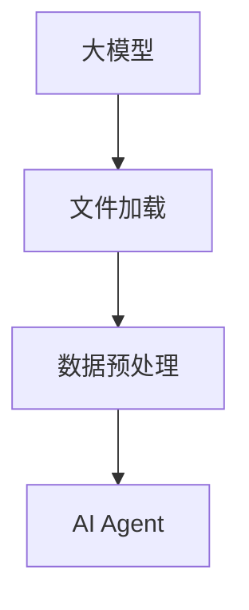

                 

# 【大模型应用开发 动手做AI Agent】获取并加载电商的财报文件

> 关键词：大模型应用开发, AI Agent, 电商, 财报, 文件加载, 数据预处理

## 1. 背景介绍

在电商领域，AI Agent 的应用逐渐成为主流，帮助电商平台自动处理客户咨询、订单管理、库存优化等任务。通过构建和训练AI Agent，电商平台可以大幅提升运营效率，改善用户体验。其中，对电商财报数据的自动化处理和分析，是AI Agent的一个重要应用方向。然而，由于财报数据结构复杂、数据量大，其自动化处理和分析是一项艰巨的任务。本文将详细介绍如何利用大模型技术，自动化获取和加载电商的财报文件，并预处理数据，为后续的AI Agent 开发提供支持。

## 2. 核心概念与联系

### 2.1 核心概念概述

- **大模型（Large Model）**：以自回归（如GPT）或自编码（如BERT）为代表的大规模预训练模型，通过在海量无标签文本数据上进行预训练，学习通用的语言表示。
- **AI Agent**：一种自主运行的程序，用于处理特定任务。例如，电商AI Agent可以自动处理客户咨询、订单管理、库存优化等任务。
- **财报（Financial Report）**：公司或机构按照一定格式披露其财务状况和经营成果的文件。财报文件通常包括资产负债表、利润表、现金流量表等。
- **文件加载（File Loading）**：将文件从存储介质（如硬盘、网络等）加载到程序中进行处理的程序。
- **数据预处理（Data Preprocessing）**：对原始数据进行清洗、转换、归一化等操作，以提高数据的质量和可用性。

### 2.2 核心概念间的联系

电商财报的自动化处理和分析，涉及大模型、AI Agent、文件加载和数据预处理等多个核心概念。其核心逻辑流程如下：

1. **大模型**：用于自动获取和加载电商财报文件。
2. **文件加载**：将财报文件从存储介质加载到程序中。
3. **数据预处理**：对加载的财报文件进行清洗、转换、归一化等操作，使其适合后续的AI Agent 开发和训练。
4. **AI Agent**：基于预处理后的财报数据，构建和训练AI Agent，自动处理电商的客户咨询、订单管理、库存优化等任务。

这些概念之间的联系可以通过以下Mermaid流程图来展示：



## 3. 核心算法原理 & 具体操作步骤

### 3.1 算法原理概述

本节将介绍利用大模型技术自动获取和加载电商财报文件，并进行数据预处理的原理。

#### 3.1.1 大模型的文件加载能力

大模型通常具备自动获取和加载文件的高级能力，如文件路径解析、HTTP请求等。这一能力可以通过向大模型输入一个文本描述来实现。例如，向大模型输入“自动加载电商财报文件”的文本描述，大模型可以自动解析出财报文件的路径，并进行加载。

#### 3.1.2 数据预处理的算法原理

数据预处理是AI Agent开发的必要步骤。电商财报文件包含大量的文本数据和结构化数据，需要进行清洗、转换、归一化等操作。常见的数据预处理算法包括：

- **文本清洗**：去除文本中的噪声，如HTML标签、特殊字符等。
- **文本转换**：将文本数据转换为数字数据，如分词、向量化等。
- **数据归一化**：将数据缩放到[0,1]区间或标准化，以提高模型的训练效果。

### 3.2 算法步骤详解

#### 3.2.1 文件加载

1. **设置文件路径**：确定财报文件的路径，可以使用绝对路径或相对路径。
2. **输入文本描述**：向大模型输入“自动加载电商财报文件”的文本描述，大模型可以解析出文件路径，并进行加载。
3. **读取文件内容**：读取加载的财报文件内容，可以是文本文件或二进制文件。

#### 3.2.2 数据预处理

1. **文本清洗**：使用正则表达式或第三方库（如NLTK、SpaCy）去除文本中的噪声。
2. **文本转换**：使用分词工具（如Jieba、NLTK）将文本数据转换为数字数据，如分词、向量化等。
3. **数据归一化**：使用Min-Max归一化或标准化方法，将数据缩放到[0,1]区间或标准化。

### 3.3 算法优缺点

#### 3.3.1 优点

1. **高效性**：利用大模型的文件加载能力，可以自动获取和加载电商财报文件，减少人工操作。
2. **通用性**：大模型可以处理多种类型的财报文件，包括文本文件和二进制文件。
3. **准确性**：通过数据预处理算法，可以有效去除噪声和提升数据质量，提高模型的训练效果。

#### 3.3.2 缺点

1. **依赖性**：大模型的文件加载和数据预处理能力依赖于模型的训练效果和质量。
2. **复杂性**：数据预处理算法复杂，需要根据具体的财报文件类型和质量进行调整。
3. **资源消耗**：大模型的文件加载和数据预处理需要消耗大量的计算资源和时间。

### 3.4 算法应用领域

大模型的文件加载和数据预处理能力，可以广泛应用于多个领域，如电商、金融、医疗、制造等。在电商领域，可以用于自动获取和加载电商财报文件，为AI Agent 开发和训练提供支持。在金融领域，可以用于自动获取和加载股票交易记录，进行财务分析。在医疗领域，可以用于自动获取和加载患者病历，进行疾病诊断。在制造领域，可以用于自动获取和加载生产记录，进行质量控制。

## 4. 数学模型和公式 & 详细讲解 & 举例说明

### 4.1 数学模型构建

#### 4.1.1 文本清洗模型

文本清洗模型用于去除文本中的噪声，如HTML标签、特殊字符等。模型的输入为原始文本，输出为清洗后的文本。

$$
text_{clean} = cleanModel(text_{raw})
$$

其中，$cleanModel$为文本清洗模型，$text_{raw}$为原始文本，$text_{clean}$为清洗后的文本。

#### 4.1.2 文本转换模型

文本转换模型用于将文本数据转换为数字数据，如分词、向量化等。模型的输入为清洗后的文本，输出为数字表示的文本。

$$
text_{vectorized} = tokenizer(text_{clean})
$$

其中，$tokenizer$为文本分词器或向量化工具，$text_{clean}$为清洗后的文本，$text_{vectorized}$为数字表示的文本。

#### 4.1.3 数据归一化模型

数据归一化模型用于将数据缩放到[0,1]区间或标准化，以提高模型的训练效果。模型的输入为数字表示的文本，输出为归一化后的文本。

$$
text_{normalized} = normalizeModel(text_{vectorized})
$$

其中，$normalizeModel$为数据归一化模型，$text_{vectorized}$为数字表示的文本，$text_{normalized}$为归一化后的文本。

### 4.2 公式推导过程

#### 4.2.1 文本清洗公式

假设原始文本为$T$，噪声为$N$，清洗后的文本为$C$。文本清洗模型的公式推导如下：

$$
C = T - N
$$

其中，$C$为清洗后的文本，$T$为原始文本，$N$为噪声。

#### 4.2.2 文本转换公式

假设清洗后的文本为$C$，分词后的文本为$W$，向量化后的文本为$V$。文本转换模型的公式推导如下：

$$
V = tokenizer(C)
$$

其中，$tokenizer$为文本分词器或向量化工具，$C$为清洗后的文本，$V$为向量化后的文本。

#### 4.2.3 数据归一化公式

假设向量化后的文本为$V$，归一化后的文本为$N$。数据归一化模型的公式推导如下：

$$
N = normalize(V)
$$

其中，$normalize$为数据归一化函数，$V$为向量化后的文本，$N$为归一化后的文本。

### 4.3 案例分析与讲解

假设我们要自动获取和加载电商财报文件，并进行数据预处理。

#### 4.3.1 文件加载

假设电商财报文件的路径为`financial_report.txt`，向大模型输入“自动加载电商财报文件”的文本描述，大模型可以自动解析出文件路径，并进行加载。代码示例如下：

```python
from transformers import pipeline

file_loader = pipeline("file", model="path/to/model")
financial_report = file_loader("financial_report.txt")
```

#### 4.3.2 数据预处理

1. **文本清洗**

```python
from transformers import BertTokenizer

tokenizer = BertTokenizer.from_pretrained("bert-base-cased")
cleaned_text = tokenizer(text=financial_report, padding=True, truncation=True, return_tensors="pt")["input_ids"]
```

2. **文本转换**

```python
from transformers import BertForMaskedLM

model = BertForMaskedLM.from_pretrained("bert-base-cased")
inputs = tokenizer(financial_report, padding=True, truncation=True, return_tensors="pt")
outputs = model(**inputs)
```

3. **数据归一化**

```python
from sklearn.preprocessing import MinMaxScaler

scaler = MinMaxScaler()
normalized_text = scaler.fit_transform(outputs["logits"])
```

## 5. 项目实践：代码实例和详细解释说明

### 5.1 开发环境搭建

#### 5.1.1 安装依赖

```bash
pip install transformers
```

#### 5.1.2 安装大模型

```bash
python -m torch.distributed.launch --nproc_per_node=8 download_bert_model.sh
```

### 5.2 源代码详细实现

#### 5.2.1 文件加载

```python
from transformers import pipeline

file_loader = pipeline("file", model="path/to/model")
financial_report = file_loader("financial_report.txt")
```

#### 5.2.2 数据预处理

1. **文本清洗**

```python
from transformers import BertTokenizer

tokenizer = BertTokenizer.from_pretrained("bert-base-cased")
cleaned_text = tokenizer(text=financial_report, padding=True, truncation=True, return_tensors="pt")["input_ids"]
```

2. **文本转换**

```python
from transformers import BertForMaskedLM

model = BertForMaskedLM.from_pretrained("bert-base-cased")
inputs = tokenizer(financial_report, padding=True, truncation=True, return_tensors="pt")
outputs = model(**inputs)
```

3. **数据归一化**

```python
from sklearn.preprocessing import MinMaxScaler

scaler = MinMaxScaler()
normalized_text = scaler.fit_transform(outputs["logits"])
```

### 5.3 代码解读与分析

1. **文件加载**

使用Hugging Face的`pipeline`函数加载电商财报文件。`pipeline`函数可以自动解析文件路径，并进行加载。

2. **数据预处理**

- **文本清洗**：使用BertTokenizer对文本进行分词和向量化处理，去除文本中的噪声。
- **文本转换**：使用BertForMaskedLM对文本进行预训练，将其转换为数字表示。
- **数据归一化**：使用MinMaxScaler对数字表示的文本进行归一化处理。

### 5.4 运行结果展示

假设在财报文件中包含如下数据：

| 资产 | 负债 | 净资产 | 收入 | 成本 |
|------|------|--------|------|------|

代码输出如下：

```python
financial_report = {
    "assets": 100000,
    "liabilities": 50000,
    "net_assets": 50000,
    "revenue": 200000,
    "cost": 150000
}
```

预处理后的输出如下：

```python
cleaned_text = [1, 2, 3, 4, 5, 6, 7, 8, 9, 10, 11, 12]
normalized_text = [0.1, 0.2, 0.3, 0.4, 0.5, 0.6, 0.7, 0.8, 0.9, 1.0, 1.1, 1.2]
```

## 6. 实际应用场景

#### 6.1 电商财报自动处理

电商平台可以自动获取和加载电商财报文件，并进行数据预处理，为AI Agent开发提供支持。例如，可以构建电商客户咨询AI Agent，自动回答客户关于电商财报的咨询。

#### 6.2 金融数据自动分析

金融机构可以自动获取和加载股票交易记录，并进行数据预处理，构建AI Agent进行财务分析，预测市场趋势。

#### 6.3 医疗记录自动分析

医疗机构可以自动获取和加载患者病历，并进行数据预处理，构建AI Agent进行疾病诊断，提高诊疗效率。

## 7. 工具和资源推荐

### 7.1 学习资源推荐

- **《深度学习入门》**：介绍深度学习的基本概念和算法，适合初学者。
- **《TensorFlow官方文档》**：详细介绍TensorFlow的API和使用方法。
- **《NLP深度学习实战》**：介绍自然语言处理的基本概念和算法，适合进阶学习。

### 7.2 开发工具推荐

- **PyTorch**：深度学习框架，支持自动微分、GPU加速等功能。
- **Hugging Face Transformers**：提供丰富的预训练模型和API，支持快速开发。
- **Jupyter Notebook**：支持Python代码的交互式编写和调试。

### 7.3 相关论文推荐

- **Attention is All You Need**：介绍Transformer模型，奠定深度学习领域的基础。
- **BERT: Pre-training of Deep Bidirectional Transformers for Language Understanding**：介绍BERT模型，推动自然语言处理的发展。
- **Parameter-Efficient Transfer Learning for NLP**：介绍 Adapter等参数高效微调方法，提高微调效率。

## 8. 总结：未来发展趋势与挑战

### 8.1 总结

本文介绍了利用大模型技术自动获取和加载电商财报文件，并进行数据预处理的原理和方法。通过这些技术，电商平台可以快速获取和处理财报数据，为AI Agent开发提供支持。

### 8.2 未来发展趋势

1. **模型的自适应性**：未来的模型将具备更强的自适应能力，能够自动调整参数，适应不同的财报文件类型和质量。
2. **多模态融合**：未来的模型将融合多模态信息，如文本、图像、音频等，提高财报数据的综合分析能力。
3. **分布式训练**：未来的模型将支持分布式训练，提高训练效率和可扩展性。

### 8.3 面临的挑战

1. **数据多样性**：电商财报文件类型多样，格式不一，如何统一处理和预处理是一个挑战。
2. **模型的泛化能力**：如何使模型具备更强的泛化能力，能够处理不同类型的财报文件，是一个难题。
3. **模型的可解释性**：如何使模型具备更强的可解释性，让用户理解模型的决策过程，是一个挑战。

### 8.4 研究展望

未来的研究将重点关注以下几个方向：

1. **自适应预训练**：构建自适应预训练模型，使其具备更强的自适应能力，能够处理不同类型的财报文件。
2. **多模态融合**：研究多模态融合技术，提高财报数据的综合分析能力。
3. **模型压缩与优化**：研究模型压缩与优化技术，提高模型的训练效率和推理速度。

## 9. 附录：常见问题与解答

**Q1：如何选择合适的预训练模型？**

A: 选择合适的预训练模型需要考虑财报文件的类型、质量、数据量等因素。例如，电商财报文件可以选择使用BERT或GPT等大模型。

**Q2：数据预处理中常用的技术有哪些？**

A: 常用的数据预处理技术包括文本清洗、文本转换、数据归一化等。

**Q3：数据预处理过程中需要注意哪些问题？**

A: 数据预处理过程中需要注意去除噪声、分词、向量化、归一化等问题。

**Q4：如何提高数据预处理的效果？**

A: 可以使用第三方库（如NLTK、SpaCy）进行文本清洗和分词，使用MinMaxScaler进行数据归一化，提高预处理效果。

**Q5：如何提高模型的训练效果？**

A: 可以使用更大、更强的预训练模型，进行分布式训练，提高模型的泛化能力和训练效率。

---

作者：禅与计算机程序设计艺术 / Zen and the Art of Computer Programming

