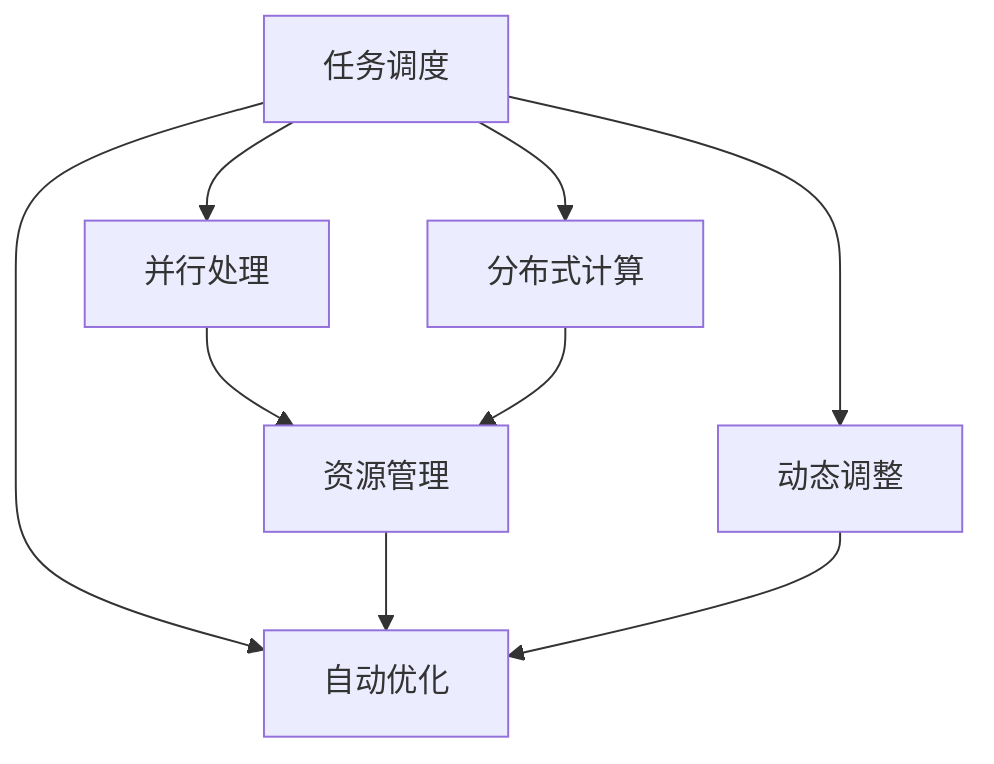
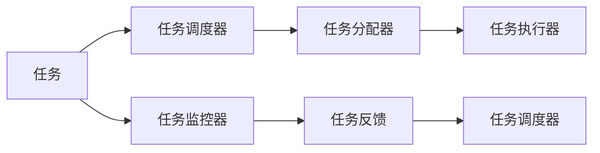
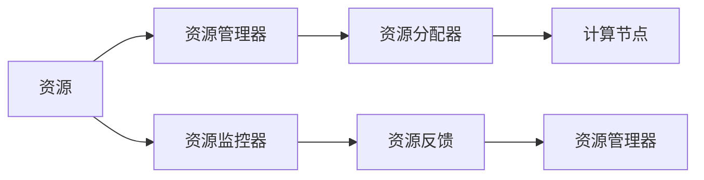
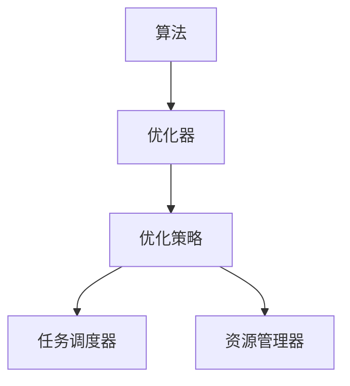
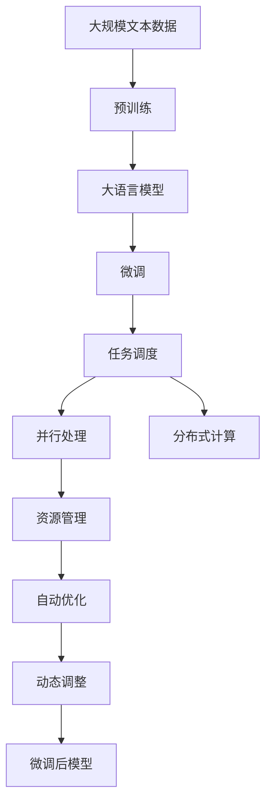

                 

# AI模型的任务分配与执行机制

> 关键词：任务调度, 并行处理, 分布式计算, 资源管理, 自动优化, 动态调整

## 1. 背景介绍

随着人工智能技术的快速发展，AI模型在各行各业的应用越来越广泛，从自然语言处理到计算机视觉，从智能推荐到自动化决策，AI模型已经成为推动行业进步的重要力量。然而，随着模型规模的扩大和应用场景的增多，如何高效、可靠地分配和管理这些模型，成为一个亟待解决的问题。任务分配与执行机制（Job Scheduling and Execution Mechanism），正是在这一背景下应运而生的，它通过合理规划任务调度和资源管理，确保AI模型的有效利用和快速响应，是实现AI应用高效运行的关键技术。

### 1.1 问题由来

在实际应用中，AI模型的任务分配与执行机制面临着以下主要挑战：

1. **资源紧张**：大型AI模型通常需要大量的计算资源，如高性能计算集群、GPU或TPU等，这些资源的分配和管理成为制约模型训练和推理的关键因素。

2. **任务复杂**：AI模型的训练和推理任务往往具有高度复杂性，包括模型选择、超参数优化、数据预处理、模型训练、验证和部署等环节，需要精心设计和高效管理。

3. **任务多样性**：不同AI模型和应用场景对任务分配和执行的需求各异，需要灵活调整任务调度策略和资源管理策略。

4. **性能提升**：如何通过高效的调度策略和资源管理，优化模型训练和推理的性能，是提升AI应用效率的重要目标。

### 1.2 问题核心关键点

解决上述问题需要关注以下几个核心关键点：

- **任务调度**：如何合理分配任务到计算节点，确保每个任务得到公平且高效的执行。
- **资源管理**：如何优化资源使用，避免资源浪费和瓶颈。
- **自动优化**：如何通过算法和策略，自动调整任务调度和资源管理，提升整体性能。
- **动态调整**：如何根据任务执行情况和环境变化，动态调整任务调度和资源管理策略，适应不同的应用场景。

## 2. 核心概念与联系

### 2.1 核心概念概述

为更好地理解AI模型的任务分配与执行机制，本节将介绍几个密切相关的核心概念：

- **任务调度**：在多个计算节点上分配任务的过程，确保任务能够高效、公平地执行。
- **资源管理**：对计算资源（如CPU、GPU、内存等）进行规划和管理，以支持任务调度。
- **并行处理**：通过多个计算节点同时处理任务，提高任务执行效率。
- **分布式计算**：将大任务分解成多个小任务，分配到多个计算节点并行处理。
- **自动优化**：通过算法和策略，自动调整任务调度和资源管理，以提升整体性能。
- **动态调整**：根据任务执行情况和环境变化，动态调整任务调度和资源管理策略。

这些概念之间的关系可以通过以下Mermaid流程图来展示：



这个流程图展示了大语言模型微调过程中各个核心概念的关系：

1. 任务调度是整个机制的起点，通过并行处理和分布式计算提高任务执行效率。
2. 资源管理是任务调度的基础，确保每个计算节点能够高效利用资源。
3. 自动优化和动态调整是提升整体性能的关键，通过算法和策略自动调整资源分配和任务调度。

### 2.2 概念间的关系

这些核心概念之间存在着紧密的联系，形成了AI模型任务分配与执行机制的完整生态系统。下面我们通过几个Mermaid流程图来展示这些概念之间的关系。

#### 2.2.1 任务调度的完整流程



这个流程图展示了任务调度的完整流程：

1. 任务调度器接收任务请求，将其分配给任务分配器。
2. 任务分配器将任务分配到可用的计算节点。
3. 任务执行器在计算节点上执行任务。
4. 任务监控器实时监控任务执行状态，并反馈给任务调度器。
5. 任务调度器根据反馈调整任务分配策略。

#### 2.2.2 资源管理的执行过程



这个流程图展示了资源管理的执行过程：

1. 资源管理器负责对资源进行规划和管理。
2. 资源分配器将资源分配给计算节点。
3. 计算节点使用资源执行任务。
4. 资源监控器实时监控资源使用情况，并反馈给资源管理器。
5. 资源管理器根据反馈调整资源分配策略。

#### 2.2.3 自动优化的算法流程



这个流程图展示了自动优化的算法流程：

1. 算法提供优化策略。
2. 优化器根据策略自动调整任务调度和资源管理。
3. 任务调度器和资源管理器根据优化器的建议调整策略。

#### 2.2.4 动态调整的控制机制


这个流程图展示了动态调整的控制机制：

1. 环境变化触发动态调整器。
2. 动态调整器根据环境变化调整任务调度和资源管理策略。
3. 任务调度器和资源管理器根据动态调整器的建议调整策略。

### 2.3 核心概念的整体架构

最后，我们用一个综合的流程图来展示这些核心概念在大语言模型微调过程中的整体架构：



这个综合流程图展示了从预训练到微调，再到任务调度的完整过程。大语言模型首先在大规模文本数据上进行预训练，然后通过微调（包括全参数微调和参数高效微调）或任务调度过程（包括并行处理和分布式计算）来优化模型在下游任务上的性能。最后，通过自动优化和动态调整机制，模型可以不断更新和适应新的任务和数据。 通过这些流程图，我们可以更清晰地理解AI模型任务分配与执行机制的工作原理和优化方向。

## 3. 核心算法原理 & 具体操作步骤

### 3.1 算法原理概述

AI模型的任务分配与执行机制，本质上是一个优化问题，旨在通过合理规划任务调度和资源管理，提升AI模型的执行效率和性能。其核心思想是：将复杂的任务分解成多个小任务，分配到多个计算节点并行处理，通过优化算法自动调整任务调度和资源管理，以最小化执行时间和资源消耗。

形式化地，假设任务集为 $T=\{T_1, T_2, ..., T_N\}$，计算节点集为 $C=\{C_1, C_2, ..., C_M\}$，资源集为 $R=\{R_1, R_2, ..., R_S\}$。任务调度问题的目标是找到任务调度序列 $S=\{S_1, S_2, ..., S_N\}$ 和资源分配序列 $A=\{A_1, A_2, ..., A_N\}$，使得任务执行时间和资源消耗最小化。

### 3.2 算法步骤详解

AI模型的任务分配与执行机制一般包括以下几个关键步骤：

**Step 1: 任务划分**

将大任务划分成多个小任务，每个小任务由独立的计算节点处理。任务划分应该根据任务的复杂度和计算资源的需求，合理分配任务大小。

**Step 2: 资源分配**

根据任务需求和计算节点资源情况，分配任务到可用的计算节点。资源分配应该考虑计算节点之间的负载均衡，避免资源浪费和瓶颈。

**Step 3: 任务调度**

将任务按照调度策略分配到计算节点上执行。任务调度应该考虑任务的执行顺序和计算节点的工作状态，以提升整体执行效率。

**Step 4: 任务执行**

计算节点执行分配到自己的任务，并实时反馈执行状态和资源使用情况。

**Step 5: 任务监控**

实时监控任务执行状态，收集执行结果和资源使用数据。

**Step 6: 任务反馈**

根据任务执行结果和资源使用数据，向任务调度器和资源管理器反馈信息，以便调整策略。

**Step 7: 自动优化**

通过算法和策略，自动调整任务调度和资源管理策略，以提升整体性能。

**Step 8: 动态调整**

根据任务执行情况和环境变化，动态调整任务调度和资源管理策略。

### 3.3 算法优缺点

AI模型的任务分配与执行机制具有以下优点：

1. 高效利用资源。通过并行处理和分布式计算，最大化利用计算资源，提升任务执行效率。
2. 灵活适应任务。通过任务调度和资源管理策略的自动优化和动态调整，适应不同任务的需求。
3. 提升性能。通过自动优化和动态调整，最大化任务执行效率和资源使用效率，提升整体性能。

同时，该机制也存在以下局限性：

1. 复杂度较高。任务调度和资源管理策略的优化和调整需要复杂的算法和策略支持，实施难度较大。
2. 资源竞争。多个任务同时竞争计算资源，可能导致资源竞争和调度延迟。
3. 负载不均。计算节点之间负载不均可能导致某些节点过载，影响整体性能。
4. 数据通信开销。任务在计算节点之间通信和数据交换，可能导致较大的数据通信开销。

### 3.4 算法应用领域

AI模型的任务分配与执行机制广泛应用于以下几个领域：

- **科学计算**：在高性能计算集群上，通过并行处理和分布式计算，加速科学计算任务。
- **数据分析**：在大数据平台上，通过任务调度和资源管理，高效处理海量数据。
- **机器学习**：在深度学习框架中，通过任务调度和资源管理，加速模型训练和推理。
- **自然语言处理**：在自然语言处理任务中，通过任务调度和资源管理，提升语言模型性能。
- **计算机视觉**：在图像处理任务中，通过任务调度和资源管理，加速图像识别和分析。
- **智能推荐**：在推荐系统中，通过任务调度和资源管理，提升推荐准确度和响应速度。

除了上述这些领域外，AI模型的任务分配与执行机制还在金融、医疗、交通、教育等多个行业得到应用，为各行业提供了高效、可靠的AI解决方案。

## 4. 数学模型和公式 & 详细讲解 & 举例说明

### 4.1 数学模型构建

本节将使用数学语言对AI模型的任务分配与执行机制进行更加严格的刻画。

假设任务集 $T$ 中的每个任务 $T_i$ 需要 $R_i$ 个资源单位，计算节点集 $C$ 中的每个节点 $C_j$ 有 $R_j$ 个资源单位。任务调度问题的目标是最小化任务执行时间和资源消耗，即：

$$
\min_{S, A} \sum_{i=1}^{N} \tau_i + \sum_{i=1}^{N} \sum_{j=1}^{M} A_{ij} R_j
$$

其中，$\tau_i$ 表示任务 $T_i$ 的执行时间，$A_{ij}$ 表示任务 $T_i$ 分配给节点 $C_j$ 的资源数量。

### 4.2 公式推导过程

以下我们以最小化任务执行时间为例，推导优化问题的数学模型。

假设任务 $T_i$ 的执行时间为 $\tau_i$，节点 $C_j$ 的可用资源为 $R_j$，任务 $T_i$ 分配给节点 $C_j$ 的资源为 $A_{ij}$，则任务执行时间和资源消耗的总和可以表示为：

$$
\tau_i = \sum_{j=1}^{M} A_{ij} \tau_j
$$

$$
R_j = \sum_{i=1}^{N} A_{ij} R_i
$$

将上述公式代入优化问题的目标函数，得：

$$
\min_{S, A} \sum_{i=1}^{N} \tau_i + \sum_{i=1}^{N} \sum_{j=1}^{M} A_{ij} R_j
$$

化简得：

$$
\min_{S, A} \sum_{i=1}^{N} \tau_i + \sum_{j=1}^{M} A_{ij} R_j
$$

这是一个典型的线性规划问题，可以通过线性规划算法求解。

### 4.3 案例分析与讲解

假设我们有 $N=4$ 个任务，每个任务需要的资源分别为 $R_1=2$，$R_2=3$，$R_3=1$，$R_4=4$，计算节点有 $M=3$ 个，每个节点的可用资源分别为 $R_1=4$，$R_2=5$，$R_3=3$。

我们采用如下的资源分配策略：

- 任务 $T_1$ 分配给节点 $C_1$，资源数量为 $A_{11}=2$。
- 任务 $T_2$ 分配给节点 $C_1$，资源数量为 $A_{21}=1$。
- 任务 $T_3$ 分配给节点 $C_2$，资源数量为 $A_{31}=1$。
- 任务 $T_4$ 分配给节点 $C_2$ 和 $C_3$，资源数量分别为 $A_{41}=2$ 和 $A_{42}=2$。

使用线性规划算法求解上述问题，可以得出最优的任务分配和资源分配策略，使得任务执行时间和资源消耗最小化。

## 5. 项目实践：代码实例和详细解释说明

### 5.1 开发环境搭建

在进行任务调度实践前，我们需要准备好开发环境。以下是使用Python进行PyTorch开发的环境配置流程：

1. 安装Anaconda：从官网下载并安装Anaconda，用于创建独立的Python环境。

2. 创建并激活虚拟环境：
```bash
conda create -n pytorch-env python=3.8 
conda activate pytorch-env
```

3. 安装PyTorch：根据CUDA版本，从官网获取对应的安装命令。例如：
```bash
conda install pytorch torchvision torchaudio cudatoolkit=11.1 -c pytorch -c conda-forge
```

4. 安装各类工具包：
```bash
pip install numpy pandas scikit-learn matplotlib tqdm jupyter notebook ipython
```

完成上述步骤后，即可在`pytorch-env`环境中开始任务调度实践。

### 5.2 源代码详细实现

这里我们以Kubernetes平台为例，展示任务调度的代码实现。

首先，定义任务调度的Python类：

```python
import os
from kubernetes import client, config
from kubernetes.client import models

class TaskScheduler:
    def __init__(self, k8s_config):
        config.load_kube_config(k8s_config)
        self.api_instance = client.BatchV1Api()
    
    def create_job(self, task, resources):
        kind = 'Job'
        api_version = 'batch/v1'
        metadata = models.V1JobMetadata(
            api_version=api_version,
            kind=kind,
            metadata=models.V1ObjectMeta(
                name=task['name'],
                labels=task['labels']
            )
        )
        spec = models.V1JobSpec(
            api_version=api_version,
            kind=kind,
            metadata=metadata,
            template=models.V1PodTemplateSpec(
                api_version='v1',
                metadata=models.V1ObjectMeta(
                    labels=task['labels']
                ),
                spec=models.V1PodSpec(
                    containers=[],
                    resources=resources
                )
            )
        )
        body = models.V1Job(
            api_version=api_version,
            kind=kind,
            metadata=metadata,
            spec=spec
        )
        return self.api_instance.create_namespaced_job(body=body, namespace='test-namespace')
```

然后，定义任务的输入参数和资源需求：

```python
task = {
    'name': 'task-1',
    'labels': {'hello': 'world'}
}
resources = {
    'requests': {
        'cpu': '1',
        'memory': '4G'
    },
    'limits': {
        'cpu': '2',
        'memory': '8G'
    }
}
```

最后，启动任务调度：

```python
scheduler = TaskScheduler('k8s.yaml')
scheduler.create_job(task, resources)
```

以上就是使用Kubernetes平台进行任务调度的完整代码实现。可以看到，通过Kubernetes的RESTful API，我们可以方便地创建和管理任务，实现高效的分布式计算。

### 5.3 代码解读与分析

让我们再详细解读一下关键代码的实现细节：

**TaskScheduler类**：
- `__init__`方法：初始化Kubernetes客户端，配置KubeConfig。
- `create_job`方法：根据任务需求和资源需求，创建Kubernetes Job对象，并调用Kubernetes API创建Job。

**task和resources**：
- `task` 定义任务的元数据，包括任务名和标签。
- `resources` 定义任务所需的资源需求，包括CPU和内存的请求和限制。

**Kubernetes Job API**：
- 使用Kubernetes API创建Job对象，指定任务名称、元数据、资源需求等参数。
- 调用Kubernetes API的`create_namespaced_job`方法创建Job。

在实际应用中，我们还需要考虑更多因素，如任务的依赖关系、优先级、超时机制、容错机制等。但核心的任务调度流程基本与此类似。

### 5.4 运行结果展示

假设我们创建了一个名为 `task-1` 的任务，其CPU请求为 1 核，内存请求为 4G，内存限制为 8G，标签为 `hello: world`。

```python
scheduler.create_job(task, resources)
```

Kubernetes会将任务 `task-1` 分配到一个计算节点上，并根据资源需求启动Pod，执行任务。任务执行的状态和结果可以通过Kubernetes API获取。

## 6. 实际应用场景

### 6.1 智能推荐系统

智能推荐系统需要高效处理海量用户行为数据，并实时生成推荐结果。AI模型的任务分配与执行机制可以帮助推荐系统快速响应用户请求，提升推荐准确度和响应速度。

在实践过程中，可以收集用户浏览、点击、评分等行为数据，将其划分为多个小任务，分配到多个计算节点并行处理。通过任务调度和资源管理，快速处理和分析海量数据，生成推荐结果。

### 6.2 金融风控系统

金融风控系统需要实时监控市场动向，及时发现和应对潜在的风险。AI模型的任务分配与执行机制可以用于实时任务调度和资源管理，提升金融风控系统的效率和稳定性。

具体而言，可以实时采集市场数据，将其划分为多个小任务，分配到多个计算节点并行处理。通过任务调度和资源管理，快速分析市场数据，及时发现异常情况，并采取相应措施，防范金融风险。

### 6.3 医疗影像诊断系统

医疗影像诊断系统需要对海量医疗影像数据进行处理和分析，以辅助医生进行诊断和治疗决策。AI模型的任务分配与执行机制可以帮助医疗影像诊断系统高效处理和分析影像数据，提升诊断准确度。

在实践过程中，可以将医疗影像数据划分为多个小任务，分配到多个计算节点并行处理。通过任务调度和资源管理，快速处理和分析影像数据，生成诊断结果，辅助医生进行诊断和治疗决策。

### 6.4 未来应用展望

随着AI模型的任务分配与执行机制不断发展，其在更多领域的应用前景将更加广阔：

- 在智慧城市治理中，AI模型可以用于实时监测城市事件，动态调整资源分配，提高城市管理的自动化和智能化水平。
- 在智能制造中，AI模型可以用于实时监控生产线状态，动态调整任务调度，提升生产效率和质量。
- 在智能交通中，AI模型可以用于实时分析交通数据，动态调整交通流量，优化交通管理。

总之，AI模型的任务分配与执行机制将在各行各业得到广泛应用，为传统行业数字化转型提供新的技术路径，加速各行业的智能化进程。

## 7. 工具和资源推荐

### 7.1 学习资源推荐

为了帮助开发者系统掌握AI模型的任务分配与执行机制的理论基础和实践技巧，这里推荐一些优质的学习资源：

1. 《TensorFlow官方文档》系列博文：详细介绍了TensorFlow的使用方法，包括分布式计算、任务调度等技术。

2. 《PyTorch官方文档》系列博文：详细介绍了PyTorch的使用方法，包括分布式训练、资源管理等技术。

3. 《Kubernetes官方文档》系列博文：详细介绍了Kubernetes的使用方法，包括任务调度、资源管理等技术。

4. 《Hadoop官方文档》系列博文：详细介绍了Hadoop的使用方法，包括分布式计算、任务调度等技术。

5. 《Spark官方文档》系列博文：详细介绍了Spark的使用方法，包括分布式计算、任务调度等技术。

通过对这些资源的学习实践，相信你一定能够快速掌握AI模型的任务分配与执行机制的精髓，并用于解决实际的NLP问题。

### 7.2 开发工具推荐

高效的开发离不开优秀的工具支持。以下是几款用于AI模型任务分配与执行机制开发的常用工具：

1. TensorFlow：基于Python的开源深度学习框架，支持分布式计算和任务调度。

2. PyTorch：基于Python的开源深度学习框架，支持分布式训练和资源管理。

3. Kubernetes：谷歌开源的容器编排系统，支持任务调度和资源管理。

4. Hadoop：Apache基金会开源的分布式计算平台，支持大规模数据处理和任务调度。

5. Spark：Apache基金会开源的大数据处理框架，支持分布式计算和任务调度。

6. Docker：开源的容器化平台，支持快速部署和资源管理。

7. Jenkins：开源的持续集成和持续部署工具，支持任务调度和自动化流程管理。

8. Ansible：开源的自动化配置和自动化运维工具，支持资源管理和自动化部署。

合理利用这些工具，可以显著提升AI模型任务分配与执行机制的开发效率，加快创新迭代的步伐。

### 7.3 相关论文推荐

AI模型的任务分配与执行机制的发展源于学界的持续研究。以下是几篇奠基性的相关论文，推荐阅读：

1. MapReduce: Simplified Data Processing on Large Clusters：提出了MapReduce计算模型，奠定了分布式计算的基础。

2. Gossip-Based MapReduce for Large-Scale Parallel Computing：提出了一种基于Gossip算法的MapReduce改进方案，提高了分布式计算的效率。

3. Fault-Tolerant Data-Parallel Machine Learning Algorithms for Distributed Computing Clusters：提出了一种分布式机器学习算法，通过数据并行和任务调度的结合，提升了模型训练的效率。

4. Autonomic Resource Management for Cloud Computing Environments：提出了一种基于自适应算法和动态调整机制的资源管理方案，提高了云环境的性能和效率。

5. Machine Learning Algorithms for Dynamic Resource Management in Cloud Datacenters：提出了一种基于机器学习算法的动态资源管理方案，提升了云数据中心的资源利用率。

这些论文代表了大语言模型微调技术的发展脉络。通过学习这些前沿成果，可以帮助研究者把握学科前进方向，激发更多的创新灵感。

除上述资源外，还有一些值得关注的前沿资源，帮助开发者紧跟AI模型任务分配与执行机制的最新进展，例如：

1. arXiv论文预印本：人工智能领域最新研究成果的发布平台，包括大量尚未发表的前沿工作，学习前沿技术的必读资源。

2. 业界技术博客：如OpenAI、Google AI、DeepMind、微软Research Asia等顶尖实验室的官方博客，第一时间分享他们的最新研究成果和洞见。

3. 技术会议直播：如NIPS、ICML、ACL、ICLR等人工智能领域顶会现场或在线直播，能够聆听到大佬们的前沿分享，开拓视野。

4. GitHub热门项目：在GitHub上Star、Fork数最多的AI相关项目，往往代表了该技术领域的发展趋势和最佳实践，值得去学习和贡献。

5. 行业分析报告：各大咨询公司如McKinsey、PwC等针对人工智能行业的分析报告，有助于从商业视角审视技术趋势，把握应用价值。

总之，对于AI模型的任务分配与执行机制的学习和实践，需要开发者保持开放的心态和持续学习的意愿。多关注前沿资讯，多动手实践，多思考总结，必将收获满满的成长收益。

## 8. 总结：未来发展趋势与挑战

### 8.1 研究成果总结

本文对AI模型的任务分配与执行机制进行了全面系统的介绍。首先阐述了任务调度、资源管理、并行处理、分布式计算等核心概念，明确

