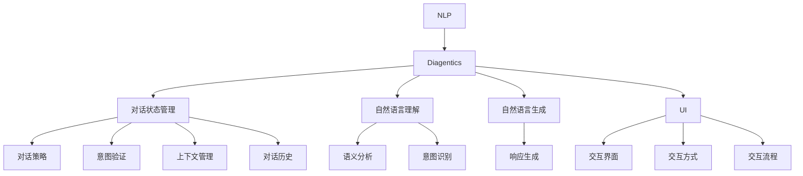
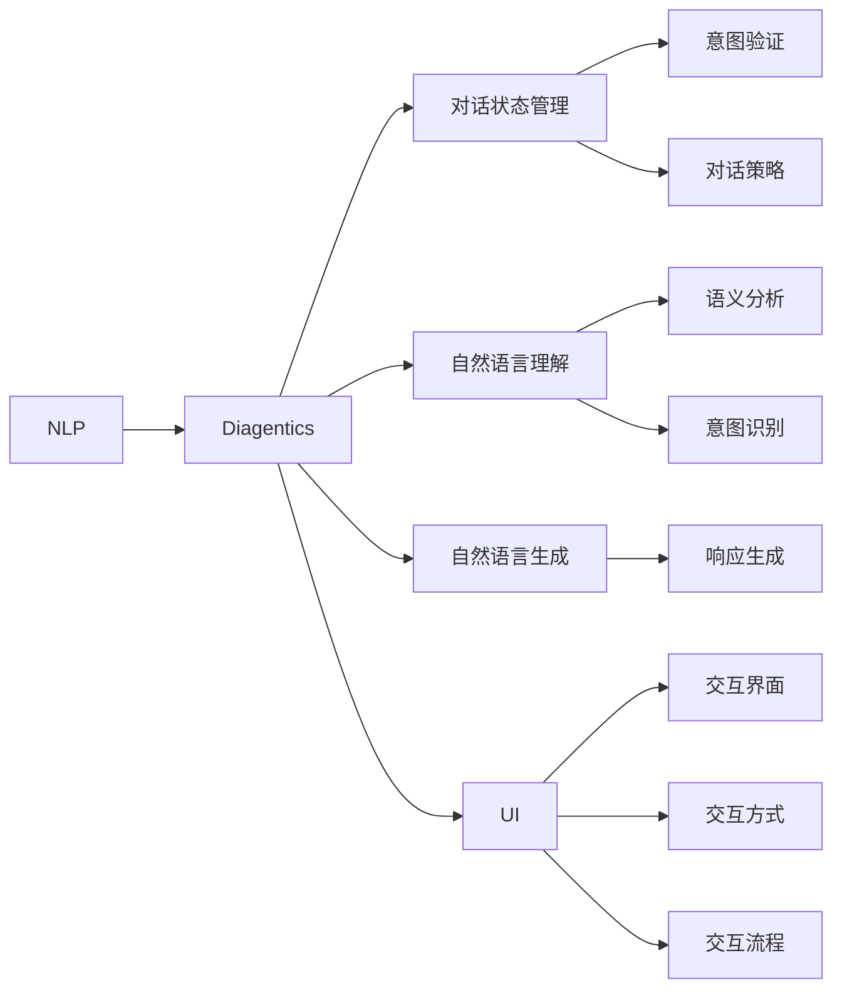

                 

# CUI中的用户目标与任务实现详细技术

> 关键词：人机交互设计(Human-Computer Interaction Design), 自然语言处理(Natural Language Processing), 用户界面(UI), 对话系统(Diagentics), 用户需求分析(User Requirement Analysis)

## 1. 背景介绍

### 1.1 问题由来

随着人工智能技术的不断发展，人们越来越注重人与计算机之间的交互体验，自然用户界面(NUI)逐渐成为未来人机交互的重要方向。传统的图形用户界面(GUI)虽然直观方便，但限制了用户交互方式的多样性，难以应对日益复杂化的任务需求。相比之下，自然用户界面(NUI)通过语音、手势、自然语言等更加自然的交流方式，使得用户可以更加自由、灵活地与计算机进行互动，提升用户体验和交互效率。

然而，NUI的实现需要突破自然语言理解和生成、语音识别和合成、手势识别和跟踪等众多技术难关，其中自然语言处理(NLP)作为核心技术之一，起着至关重要的作用。自然语言处理不仅需要准确理解用户的自然语言指令，还需要根据用户需求设计合理的交互流程，生成符合用户期望的输出响应。这种设计与实现的结合，就是对话系统设计(Diagentics)的核心内容。

### 1.2 问题核心关键点

对话系统设计涉及多个核心概念和技术，如自然语言理解(NLU)、对话管理(DM)、自然语言生成(NLG)、用户界面(UI)等。本节将详细阐述这些核心概念的原理和架构，为后续讨论用户目标与任务实现奠定基础。

1. **自然语言理解(NLU)**：通过分析用户输入的自然语言文本，理解其语义和意图，生成对话状态表示。
2. **对话管理(DM)**：根据对话历史和当前上下文，动态决定对话的下一步行动。
3. **自然语言生成(NLG)**：将对话状态转换为自然语言文本，生成系统的响应。
4. **用户界面(UI)**：设计与用户交互的界面和交互方式，提高用户使用体验。

## 2. 核心概念与联系

### 2.1 核心概念概述

为更好地理解对话系统设计的核心概念和技术，本节将介绍几个密切相关的核心概念：

- **自然语言处理(NLP)**：通过计算机处理自然语言的方式，使机器能够理解和生成自然语言，包括分词、词性标注、依存句法分析、语义分析等。
- **对话系统(Diagentics)**：一种能够根据用户输入进行理解和响应的智能系统，包括对话状态管理、自然语言理解与生成、对话策略制定等。
- **人机交互设计(Human-Computer Interaction Design)**：涉及交互界面设计、交互方式选择、交互流程设计等，以提升人机交互的效率和体验。
- **用户界面(UI)**：用户与计算机进行交互的图形、文本、声音等视觉和听觉元素的集合。

这些核心概念之间的逻辑关系可以通过以下Mermaid流程图来展示：



这个流程图展示了大语言模型微调过程中各个核心概念之间的关系：

1. 对话系统通过自然语言处理技术进行用户输入的自然语言文本解析，生成对话状态。
2. 对话状态管理根据上下文和历史信息，决定系统下一步动作。
3. 自然语言生成技术将对话状态转换为自然语言文本输出，作为系统的响应。
4. 用户界面设计需要考虑交互界面的展示方式、交互方式的选择和交互流程的安排，以提升用户的使用体验。

### 2.2 概念间的关系

这些核心概念之间存在着紧密的联系，形成了对话系统设计的完整生态系统。下面我们通过几个Mermaid流程图来展示这些概念之间的关系。

#### 2.2.1 对话系统设计范式



这个流程图展示了对话系统设计的基本流程：

1. 自然语言处理技术对用户输入进行解析，生成对话状态。
2. 对话状态管理根据意图验证和对话策略，决定系统下一步动作。
3. 自然语言生成技术将对话状态转换为系统响应。
4. 用户界面设计需要考虑交互界面、交互方式和交互流程，以提升用户体验。

#### 2.2.2 人机交互设计框架

```mermaid
graph TB
    A[用户需求] --> B[用户界面(UI)]
    B --> C[交互界面]
    C --> D[交互方式]
    B --> E[交互流程]
    B --> F[交互反馈]
    F --> G[用户体验]
```

这个流程图展示了人机交互设计的基本框架：

1. 用户需求分析作为设计的起点，确定用户的交互目标和需求。
2. 用户界面设计需要考虑交互界面、交互方式和交互流程，以提升用户体验。
3. 交互反馈与用户体验相互影响，通过不断优化交互流程和界面设计，提升用户满意度。

#### 2.2.3 自然语言处理技术栈

```mermaid
graph TB
    A[自然语言处理(NLP)] --> B[分词]
    A --> C[词性标注]
    A --> D[依存句法分析]
    B --> E[语义分析]
    E --> F[意图识别]
    C --> G[命名实体识别]
    D --> H[关系抽取]
    F --> I[对话管理(DM)]
    I --> J[自然语言生成(NLG)]
    J --> K[对话策略]
    K --> L[意图验证]
    L --> M[上下文管理]
    M --> N[对话历史]
```

这个流程图展示了自然语言处理技术栈的基本构成：

1. 分词、词性标注、依存句法分析等预处理技术，为后续语义分析和意图识别提供基础。
2. 语义分析、意图识别、命名实体识别、关系抽取等技术，用于理解用户的自然语言指令。
3. 对话管理、自然语言生成等技术，用于生成符合用户期望的响应。

## 3. 核心算法原理 & 具体操作步骤
### 3.1 算法原理概述

对话系统设计涉及多个核心算法和技术，如自然语言理解(NLU)、对话管理(DM)、自然语言生成(NLG)等。下面将详细介绍这些核心算法的基本原理。

#### 3.1.1 自然语言理解(NLU)

自然语言理解(NLU)是对话系统设计的关键组成部分，其主要目标是通过分析用户输入的自然语言文本，理解其语义和意图，生成对话状态表示。自然语言理解通常分为以下几个步骤：

1. **分词**：将用户输入的自然语言文本切分为单词或词组。
2. **词性标注**：为每个单词标注其词性，如名词、动词、形容词等。
3. **依存句法分析**：分析单词之间的依存关系，生成依存句法树。
4. **语义分析**：通过上下文和语法结构，理解句子的语义。
5. **意图识别**：识别用户输入的意图，如询问信息、发出指令等。

#### 3.1.2 对话管理(DM)

对话管理(DM)是对话系统设计的核心，其主要目标是根据对话历史和当前上下文，动态决定对话的下一步行动。对话管理通常分为以下几个步骤：

1. **对话状态表示**：使用状态空间表示对话的历史状态，如对话轮次、对话主题等。
2. **意图验证**：验证用户输入的意图是否与对话管理状态一致，如果不一致，则需要重新处理用户输入。
3. **对话策略**：根据对话历史和当前状态，决定下一步的对话行动，如输出信息、请求用户输入等。

#### 3.1.3 自然语言生成(NLG)

自然语言生成(NLG)是对话系统设计的最后一步，其主要目标是将对话状态转换为自然语言文本，生成系统的响应。自然语言生成通常分为以下几个步骤：

1. **响应生成**：根据对话状态和意图，生成系统的响应。
2. **语言模型**：使用语言模型评估响应的语言质量，确保输出的流畅和准确。
3. **语法生成**：使用语法生成器生成符合语法的文本。
4. **语音合成**：将文本转换为语音，输出到用户设备。

### 3.2 算法步骤详解

#### 3.2.1 自然语言理解(NLU)

自然语言理解(NLU)通常使用基于统计的模型，如隐马尔可夫模型(HMM)、条件随机场(CRF)、递归神经网络(RNN)等，进行分词、词性标注、依存句法分析、语义分析等。下面是一些常用的NLU算法步骤：

1. **分词**：使用基于规则的分词器或基于统计的分词器，如JIEBA、NLTK等。
2. **词性标注**：使用隐马尔可夫模型(HMM)或条件随机场(CRF)，如Stanford POS Tagger、NLTK等。
3. **依存句法分析**：使用递归神经网络(RNN)或长短期记忆网络(LSTM)，如Stanford Parser、UASL等。
4. **语义分析**：使用递归神经网络(RNN)或卷积神经网络(CNN)，如BERT、GPT等。
5. **意图识别**：使用支持向量机(SVM)或深度学习模型，如RNN、CNN、BERT等。

#### 3.2.2 对话管理(DM)

对话管理(DM)通常使用基于规则的方法或基于机器学习的方法，如状态机、马尔可夫决策过程(MDP)、强化学习等。下面是一些常用的DM算法步骤：

1. **对话状态表示**：使用状态空间表示对话的历史状态，如对话轮次、对话主题等。
2. **意图验证**：使用分类器或规则引擎，验证用户输入的意图是否与对话管理状态一致。
3. **对话策略**：使用强化学习或马尔可夫决策过程(MDP)，根据对话历史和当前状态，决定下一步的对话行动。

#### 3.2.3 自然语言生成(NLG)

自然语言生成(NLG)通常使用基于规则的方法或基于深度学习的方法，如模板填充、神经网络生成器等。下面是一些常用的NLG算法步骤：

1. **响应生成**：使用模板填充或深度学习模型，如Seq2Seq模型、GPT等。
2. **语言模型**：使用语言模型评估响应的语言质量，如GPT、BERT等。
3. **语法生成**：使用语法生成器生成符合语法的文本，如NLG模型、GPT等。
4. **语音合成**：使用TTS(Text-to-Speech)技术，将文本转换为语音，如DeepSpeech、WaveNet等。

### 3.3 算法优缺点

#### 3.3.1 自然语言理解(NLU)

- **优点**：
  - 准确性高，能够理解复杂语义。
  - 可解释性强，易于理解和调试。
  - 适用范围广，适用于各种自然语言。

- **缺点**：
  - 依赖标注数据，数据标注成本高。
  - 模型的复杂度高，计算资源消耗大。
  - 模型泛化能力差，对新词和领域变化敏感。

#### 3.3.2 对话管理(DM)

- **优点**：
  - 策略灵活，可根据实际需求设计对话策略。
  - 动态性强，能够适应复杂多变的对话场景。
  - 可扩展性强，适用于各种对话任务。

- **缺点**：
  - 模型训练复杂，需要大量标注数据。
  - 实时性差，对计算资源要求高。
  - 鲁棒性差，对噪声和错误输入敏感。

#### 3.3.3 自然语言生成(NLG)

- **优点**：
  - 自然流畅，易于理解。
  - 可生成多样化的响应，满足用户需求。
  - 可动态生成，适应对话场景。

- **缺点**：
  - 计算资源消耗大，对硬件要求高。
  - 模型复杂度高，训练时间长。
  - 生成的文本质量依赖于语言模型和语法生成器。

### 3.4 算法应用领域

自然语言处理(NLP)和对话系统设计在众多领域都有广泛的应用，如智能客服、智能助理、智能翻译、智能家居等。以下是一些具体的应用领域：

1. **智能客服**：通过自然语言理解和自然语言生成技术，实现客户问题的自动解答和智能推荐。
2. **智能助理**：通过自然语言处理技术，实现用户的语音指令和文本指令的自动理解和执行。
3. **智能翻译**：通过自然语言理解技术，实现用户输入的翻译需求，并通过自然语言生成技术，生成翻译结果。
4. **智能家居**：通过自然语言处理技术，实现用户对家电设备的语音控制和文本控制。

## 4. 数学模型和公式 & 详细讲解 & 举例说明

### 4.1 数学模型构建

自然语言处理(NLP)和对话系统设计涉及多个数学模型和技术，如隐马尔可夫模型(HMM)、条件随机场(CRF)、递归神经网络(RNN)、卷积神经网络(CNN)、序列到序列模型(Seq2Seq)等。下面将详细介绍这些模型的基本数学模型构建。

#### 4.1.1 隐马尔可夫模型(HMM)

隐马尔可夫模型(HMM)是一种常用的概率模型，常用于自然语言处理中的分词、词性标注等任务。其基本数学模型包括状态空间、观测空间、状态转移概率和观测概率。

- **状态空间**：表示对话历史的状态，如分词结果、词性标注等。
- **观测空间**：表示用户输入的自然语言文本。
- **状态转移概率**：表示对话状态之间的转移概率。
- **观测概率**：表示观测空间中的每个观测值在当前状态下的概率。

#### 4.1.2 条件随机场(CRF)

条件随机场(CRF)是一种常用的概率模型，常用于自然语言处理中的命名实体识别、关系抽取等任务。其基本数学模型包括特征空间、状态空间、状态转移概率和标签概率。

- **特征空间**：表示输入文本中的特征，如单词、词性、依存关系等。
- **状态空间**：表示标签空间，如实体类型、关系类型等。
- **状态转移概率**：表示标签之间的转移概率。
- **标签概率**：表示每个特征在当前标签下的概率。

#### 4.1.3 递归神经网络(RNN)

递归神经网络(RNN)是一种常用的神经网络模型，常用于自然语言处理中的语义分析、意图识别等任务。其基本数学模型包括输入层、隐藏层、输出层和激活函数。

- **输入层**：表示输入的自然语言文本。
- **隐藏层**：表示神经网络的记忆单元，通过前向传播和反向传播更新。
- **输出层**：表示神经网络的输出结果，如语义表示、意图表示等。
- **激活函数**：表示神经元之间的激活方式，如Sigmoid、Tanh等。

#### 4.1.4 卷积神经网络(CNN)

卷积神经网络(CNN)是一种常用的神经网络模型，常用于自然语言处理中的语义分析、意图识别等任务。其基本数学模型包括卷积层、池化层、全连接层和激活函数。

- **卷积层**：表示特征提取层，通过卷积操作提取输入文本的特征。
- **池化层**：表示特征降维层，通过池化操作减少特征的维度和数量。
- **全连接层**：表示分类器，通过全连接层将特征映射到分类结果。
- **激活函数**：表示神经元之间的激活方式，如Sigmoid、ReLU等。

#### 4.1.5 序列到序列模型(Seq2Seq)

序列到序列模型(Seq2Seq)是一种常用的神经网络模型，常用于自然语言处理中的翻译、摘要等任务。其基本数学模型包括编码器、解码器和损失函数。

- **编码器**：表示输入序列的编码器，通过神经网络将输入序列映射到向量表示。
- **解码器**：表示输出序列的解码器，通过神经网络将向量表示映射到输出序列。
- **损失函数**：表示序列之间的损失函数，如交叉熵损失函数。

### 4.2 公式推导过程

#### 4.2.1 隐马尔可夫模型(HMM)

隐马尔可夫模型(HMM)的基本数学模型包括状态空间、观测空间、状态转移概率和观测概率。下面将详细介绍这些数学模型的公式推导。

- **状态转移概率**：
  $$
  \begin{aligned}
  P(s_t|s_{t-1}) &= \sum_{o_{t-1}}P(s_t|s_{t-1},o_{t-1})P(o_{t-1}|s_{t-1}) \\
  &= \sum_{o_{t-1}}A_{st}\Pi_{t-1}\Pi_{t-1}
  \end{aligned}
  $$

  其中，$A$为状态转移矩阵，$\Pi$为观测概率矩阵。

- **观测概率**：
  $$
  \begin{aligned}
  P(o_t|s_t) &= \sum_{o_{t-1}}P(o_t|o_{t-1},s_t)P(o_{t-1}|s_t) \\
  &= \sum_{o_{t-1}}B_{ot}\Pi_{t-1}\Pi_{t}
  \end{aligned}
  $$

  其中，$B$为观测概率矩阵。

#### 4.2.2 条件随机场(CRF)

条件随机场(CRF)的基本数学模型包括特征空间、状态空间、状态转移概率和标签概率。下面将详细介绍这些数学模型的公式推导。

- **特征空间**：
  $$
  f(o_t,s_t) = w_1(o_t,s_t) + w_2(o_{t-1},s_t) + w_3(o_t,s_{t-1})
  $$

  其中，$w_i$为特征权重，$i=1,2,3$。

- **状态转移概率**：
  $$
  \begin{aligned}
  P(l_t|l_{t-1}) &= \sum_{f_t}P(l_t|l_{t-1},f_t)P(f_t|l_{t-1}) \\
  &= \sum_{f_t}A_{l_tl_{t-1}}\Pi_{t-1}\Pi_{t-1}
  \end{aligned}
  $$

  其中，$A$为状态转移矩阵，$\Pi$为特征概率矩阵。

- **标签概率**：
  $$
  \begin{aligned}
  P(o_t|l_t) &= \sum_{f_t}P(o_t|l_t,f_t)P(f_t|l_t) \\
  &= \sum_{f_t}B_{ol_t}\Pi_{t}\Pi_{t}
  \end{aligned}
  $$

  其中，$B$为标签概率矩阵。

#### 4.2.3 递归神经网络(RNN)

递归神经网络(RNN)的基本数学模型包括输入层、隐藏层、输出层和激活函数。下面将详细介绍这些数学模型的公式推导。

- **前向传播**：
  $$
  h_t = f(W_h[h_{t-1},x_t] + b_h)
  $$

  其中，$h_t$为隐藏层状态，$f$为激活函数，$W_h$为权重矩阵，$b_h$为偏置向量。

- **反向传播**：
  $$
  \begin{aligned}
  \frac{\partial L}{\partial W_h} &= \frac{\partial L}{\partial h_t}\frac{\partial h_t}{\partial h_{t-1}}\frac{\partial h_{t-1}}{\partial W_h} \\
  \frac{\partial L}{\partial b_h} &= \frac{\partial L}{\partial h_t}
  \end{aligned}
  $$

  其中，$L$为损失函数，$\frac{\partial L}{\partial h_t}$为损失函数对隐藏层状态$h_t$的偏导数。

#### 4.2.4 卷积神经网络(CNN)

卷积神经网络(CNN)的基本数学模型包括卷积层、池化层、全连接层和激活函数。下面将详细介绍这些数学模型的公式推导。

- **卷积操作**：
  $$
  C(o_t) = W*o_t + b
  $$

  其中，$C$为卷积核，$W$为权重矩阵，$b$为偏置向量。

- **池化操作**：
  $$
  P(o_t) = \max(C(o_t))
  $$

  其中，$P$为池化结果。

- **全连接层**：
  $$
  y = Wx + b
  $$

  其中，$y$为输出结果，$W$为权重矩阵，$x$为输入结果，$b$为偏置向量。

#### 4.2.5 序列到序列模型(Seq2Seq)

序列到序列模型(Seq2Seq)的基本数学模型包括编码器、解码器和损失函数。下面将详细介绍这些数学模型的公式推导。

- **编码器**：
  $$
  h_t = f(W_h[h_{t-1},x_t] + b_h)
  $$

  其中，$h_t$为隐藏层状态，$f$为激活函数，$W_h$为权重矩阵，$b_h$为偏置向量。

- **解码器**：
  $$
  y_t = f(W_y[h_t,s_{t-1}] + b_y)
  $$

  其中，$y_t$为输出结果，$f$为激活函数，$W_y$为权重矩阵，$b_y$为偏置向量，$s_{t-1}$为前一个时刻的解码器状态。

- **损失函数**：
  $$
  L = \frac{1}{N}\sum_{i=1}^NL_i
  $$

  其中，$L_i$为每个样本的损失，$N$为样本总数。

### 4.3 案例分析与讲解

#### 4.3.1 隐马尔可夫模型(HMM)案例分析

假设我们有一个隐马尔可夫模型，用于分词任务。其中，状态空间$S$为分词结果，观测空间$O$为用户输入的自然语言文本。

- **状态空间**：
  $$
  S = \{S_0,S_1,S_2,\cdots,S_n\}
  $$

- **观测空间**：
  $$
  O = \{o_1,o_2,\cdots,o_N\}
  $$

- **状态转移概率**：
  $$
  P(s_t|s_{t-1}) = A_{st}
  $$

- **观测概率**：
  $$
  P(o_t|s_t) = B_{ot}
  $$

  其中，$A$为状态转移矩阵，$B$为观测概率矩阵。

假设我们有以下输入文本：
$$
o = "我要去北京吃烤鸭"
$$

我们需要将这个文本分词为：
$$
s = \{我要, 去, 北京, 吃, 烤鸭\}
$$

我们可以通过前向算法或维特比算法，求出最可能的隐含状态序列，然后输出相应的分词结果。

#### 4.3.2 条件随机场(CRF)案例分析

假设我们有一个条件随机场，用于命名实体识别任务。其中，状态空间$L$为实体类型，观测空间$O$为用户输入的自然语言文本。

- **状态空间**：
  $$
  L = \{L_0,L_1,\cdots,L_m\}
  $$

- **观测空间**：
  $$
  O = \{o_1,o_2,\cdots,o_N\}
  $$

- **状态转移概率**：
  $$
  P(l_t|l_{t-1}) = A_{l_tl_{t-1}}
  $$

- **标签概率**：
  $$
  P(o_t|l_t) = B_{ol_t}
  $$

  其中，$A$为状态转移矩阵，$B$为标签概率矩阵。

假设我们有以下输入文本：
$$
o = "张三，男，34岁，工程师"
$$

我们需要将这个文本中的人名识别为：
$$
s = \{张三,B-PER,男,34,B-LOC,工程师\}
$$

我们可以通过训练好的CRF模型，求出最可能的隐含状态序列，然后输出相应的命名实体识别结果。

## 5. 项目实践：代码实例和详细解释说明

### 5.1 开发环境搭建

在进行对话系统设计的项目实践前，我们需要准备好开发环境。以下是使用Python进行TensorFlow开发的环境配置流程：

1. 安装Anaconda：从官网下载并安装Anaconda，用于创建独立的Python

