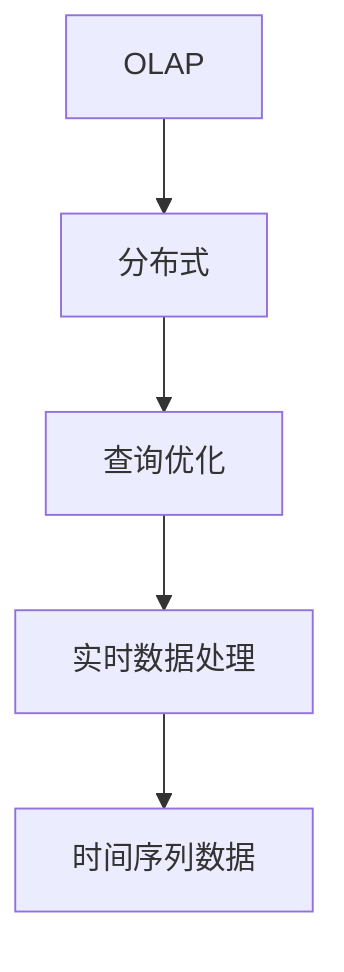
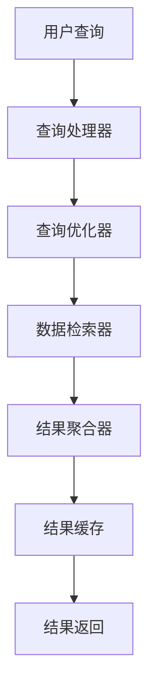
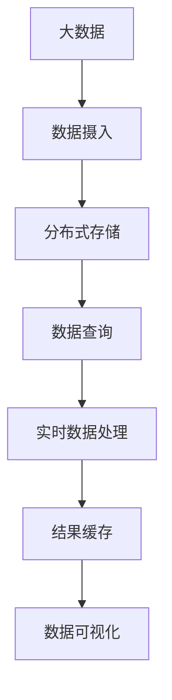

                 

# Druid原理与代码实例讲解

> 关键词：Druid,分布式,查询优化,OLAP,数据仓库,实时查询,点击流数据,大数据处理

## 1. 背景介绍

### 1.1 问题由来
在现代大数据背景下，企业对于海量数据的分析和处理需求日益增长，传统的单节点关系型数据库已难以满足实时和复杂的查询需求。针对这一挑战，Druid 这个开源分布式 OLAP 数据仓库和实时查询系统应运而生。Druid 是一个高性能的 OLAP 系统，专注于处理时间序列数据，并支持多维度的数据查询。其设计理念是实现极端高性能、低延迟的查询，旨在帮助企业快速分析海量数据。

### 1.2 问题核心关键点
Druid 作为高性能的分布式 OLAP 系统，其核心优势包括：
- 高性能低延迟：通过合理的数据存储结构、高效的查询算法和分布式计算，确保数据查询的高效和低延迟。
- 实时查询：支持实时数据插入和查询，能够实时响应业务需求。
- 分布式架构：通过分片（sharding）和负载均衡，支持高并发的数据存储和查询。
- 可视化仪表盘：内置丰富的可视化图表，帮助用户直观地理解查询结果。
- 扩展性强：支持水平扩展，能够快速应对数据量的增长。

Druid 主要应用在需要处理大量时间序列数据的场景，例如：
- 广告点击流数据分析
- 电商行为分析
- 金融交易分析
- 网络监控和日志分析

### 1.3 问题研究意义
Druid 的核心价值在于其高性能、低延迟、易用性以及强大的查询能力，成为大数据处理和分析的理想解决方案。研究 Druid 不仅有助于理解其在实时数据处理中的工作原理，还能帮助开发者更好地设计和优化大规模数据仓库系统，加速数据驱动决策的过程。

## 2. 核心概念与联系

### 2.1 核心概念概述

为了更好地理解 Druid 的工作原理和设计思路，本节将介绍几个密切相关的核心概念：

- **OLAP**：联机分析处理，是数据仓库中用于多维度数据分析的一种技术，支持多维度查询、数据钻取、数据旋转等操作。
- **分布式**：通过将数据和计算分布在多个节点上进行，以提高系统的处理能力和扩展性。
- **查询优化**：通过优化查询的执行计划，提高查询效率，减少延迟。
- **点击流数据**：指用户在不同网站或应用中的行为轨迹，包括点击、浏览、购买等操作。
- **实时数据处理**：指能够即时响应数据变化并更新查询结果的能力。
- **时间序列数据**：指按照时间顺序记录的数据，常见于日志、传感器数据等场景。

这些核心概念之间的逻辑关系可以通过以下 Mermaid 流程图来展示：



这个流程图展示了几大核心概念之间的关系：OLAP 是数据仓库的基础，分布式架构是其高性能和扩展性的保障，查询优化则提升了系统的响应速度，而实时数据处理和时间序列数据则是 Druid 的核心应用场景。

### 2.2 概念间的关系

这些核心概念之间存在着紧密的联系，形成了 Druid 的核心工作框架。下面我们通过几个 Mermaid 流程图来展示这些概念之间的关系。

#### 2.2.1 Druid的核心架构


这个流程图展示了 Druid 的核心架构，包括数据摄入、存储、查询、检索、聚合、优化和可视化等环节。

#### 2.2.2 Druid的查询处理流程



这个流程图展示了 Druid 查询处理的流程，包括查询处理器、查询优化器、数据检索器、结果聚合器和结果缓存等组件。

#### 2.2.3 Druid的数据存储结构


这个流程图展示了 Druid 的数据存储结构，包括时间戳、分段、分片和列族等概念。

### 2.3 核心概念的整体架构

最后，我们用一个综合的流程图来展示这些核心概念在大数据处理和查询中的整体架构：



这个综合流程图展示了大数据处理和查询的全流程，从数据摄入到分布式存储，再到实时数据处理和结果缓存，最终通过数据可视化展示查询结果。

## 3. 核心算法原理 & 具体操作步骤
### 3.1 算法原理概述

Druid 的查询优化和数据存储机制是其核心的算法原理。Druid 采用了以下技术手段来实现高性能和低延迟：

- **分片（Sharding）**：将数据分割成多个分片，分散存储在不同的节点上，提高系统的扩展性和容错性。
- **时间分区（Time Division）**：将数据按时间进行分段存储，每个时间段的数据可以独立查询，提升查询效率。
- **列族（Column Family）**：将数据按列进行分组存储，避免全表扫描，提升查询速度。
- **快速查询算法**：包括聚合函数、位图索引、压缩算法等，优化查询效率，减少延迟。
- **分布式计算**：通过将查询任务分配到多个节点上并行计算，提高系统的处理能力。

这些技术手段共同构成了 Druid 的核心算法原理，使得其能够在处理大量时间序列数据时，仍然保持高性能和低延迟。

### 3.2 算法步骤详解

Druid 的查询优化和数据存储机制主要涉及以下几个关键步骤：

**Step 1: 数据分片和分区**
- 将大数据按时间进行分段，每个时间段的数据存储在一个分片内。
- 对每个分片进行水平切分，即分片数据按照键进行散列，分散到不同的节点上，实现水平扩展。

**Step 2: 数据存储和压缩**
- 每个分片内采用列族存储，将数据按列分组存储，提高查询效率。
- 对存储的数据进行压缩，减小数据量，减少存储空间和传输带宽。

**Step 3: 快速查询算法**
- 利用聚合函数、位图索引等技术，对数据进行预聚合，减少查询时的计算量。
- 采用压缩算法，减少数据传输和存储的开销。

**Step 4: 分布式计算**
- 将查询任务按照分片进行分片并行计算，每个节点负责处理部分分片数据。
- 利用负载均衡算法，将查询请求分配到合适的节点上，实现高效的多节点计算。

**Step 5: 结果聚合和缓存**
- 对查询结果进行聚合，减少结果数据的大小，提高查询速度。
- 利用缓存技术，将高频查询结果缓存，减少数据库的负载，提高响应速度。

通过这些步骤，Druid 能够高效地处理大规模时间序列数据，支持实时查询和复杂多维度的分析。

### 3.3 算法优缺点

Druid 作为高性能的分布式 OLAP 系统，具有以下优点：

- 高性能低延迟：通过分片、分区、压缩等技术，使得数据查询速度极快，响应时间极低。
- 实时查询：支持实时数据插入和查询，能够即时响应业务需求。
- 扩展性强：通过分片、分区等技术，能够快速应对数据量的增长，实现水平扩展。
- 易用性：提供了丰富的可视化仪表盘，用户无需复杂的 SQL 查询即可进行数据分析。

同时，Druid 也存在一些局限性：

- 数据处理受限于分片和分区策略，对某些复杂的查询可能不支持。
- 存储和压缩算法可能需要消耗大量计算资源，导致系统负载较高。
- 实时性依赖于数据分区和分片的均衡，对于不均衡的分片可能导致查询延迟。
- 可视化仪表盘的展示方式较为简单，可能无法满足复杂的数据分析需求。

尽管存在这些局限性，但就目前而言，Druid 在大数据处理和分析中仍然是不可或缺的工具。

### 3.4 算法应用领域

Druid 主要应用于需要处理大量时间序列数据和支持实时查询的领域，例如：

- 广告点击流数据分析
- 电商行为分析
- 金融交易分析
- 网络监控和日志分析
- 工业物联网（IIoT）设备监控

Druid 在以上场景中，能够高效地处理海量数据，提供实时查询和分析能力，帮助企业快速做出决策。

## 4. 数学模型和公式 & 详细讲解 & 举例说明

### 4.1 数学模型构建

Druid 的核心数学模型主要涉及数据的分片和分区、聚合函数的计算以及查询优化等。

假设一个时间序列数据集 $D=\{(t_i, v_i)\}_{i=1}^N$，其中 $t_i$ 为时间戳，$v_i$ 为数据值。

Druid 将数据按照时间进行分段，每个时间段的数据存储在一个分片内，设每个时间段的长度为 $\Delta t$。分片 $S_j$ 中的数据表示为 $D_j=\{(t_i, v_i)\}_{i=j\Delta t}^{(j+1)\Delta t}$。

Druid 还采用列族存储技术，将数据按照列进行分组存储。假设每个分片有 $C$ 列，数据表示为 $M_j=[m_{i,j,k}]\_{i,j,k=1}^{N\times C\times C}$，其中 $m_{i,j,k}$ 表示第 $i$ 个时间点、第 $j$ 个分片、第 $k$ 列的数据值。

### 4.2 公式推导过程

以下我们将通过一些数学公式来进一步解释 Druid 的工作原理。

假设查询条件为 $(t_0, t_1, x)$，其中 $t_0$ 和 $t_1$ 为时间区间，$x$ 为查询字段。

Druid 通过分片定位查询数据，首先找到包含查询时间区间 $(t_0, t_1)$ 的分片 $S_j$，然后从该分片中选择包含查询字段 $x$ 的列族。设选择的列族为 $C_k$，查询公式为：

$$
\sum_{i=j\Delta t}^{(j+1)\Delta t} m_{i,j,k} \text{ for } k \in C_k
$$

查询结果需要进行聚合操作，例如求和、平均值、最大值等。以求和为例，查询结果为：

$$
\sum_{i=j\Delta t}^{(j+1)\Delta t} \sum_{k \in C_k} m_{i,j,k}
$$

对于大规模数据集，Druid 还采用分页查询和缓存机制，以提高查询效率。查询结果可以缓存到内存中，下次查询时直接从缓存中读取，避免重新计算。

### 4.3 案例分析与讲解

为了更好地理解 Druid 的查询优化和数据存储机制，我们通过一个具体的案例来进行讲解。

假设某电商平台有一个包含点击流数据的 Druid 数据仓库，需要分析过去 30 天的用户点击行为。具体查询条件为：
- 用户 ID 在 $[1001, 5000]$ 范围内
- 点击时间在 $[2022-01-01, 2022-01-31]$ 之间
- 点击商品价格在 $[50, 100]$ 元之间

查询步骤如下：

1. 分片定位：根据时间范围，定位到包含查询时间段的分片 $S_j$。
2. 列族选择：从分片 $S_j$ 中选择包含用户 ID、点击时间和商品价格列的列族 $C_k$。
3. 数据检索：从列族 $C_k$ 中检索包含用户 ID、点击时间和商品价格的数据。
4. 数据聚合：对检索到的数据进行聚合，例如求和、平均值等。
5. 结果缓存：将查询结果缓存到内存中，下次查询时直接从缓存中读取。

Druid 通过上述步骤，能够高效地处理大规模点击流数据，快速分析用户行为，提供实时查询和分析能力。

## 5. 项目实践：代码实例和详细解释说明

### 5.1 开发环境搭建

在进行 Druid 项目实践前，我们需要准备好开发环境。以下是使用 Python 进行 Druid 开发的环境配置流程：

1. 安装 Druid 依赖：
```bash
pip install druid-server druid-apache-nutch
```

2. 下载 Druid 依赖：
```bash
cd druid-server
mvn package -DskipTests
```

3. 配置 Druid 配置文件：
```bash
druid-server/config/druid-sample.toml
```

4. 启动 Druid 服务：
```bash
java -Ddruid.server.connect.on.start=false -Ddruid.server.host=localhost -Ddruid.server.port=8082 -Ddruid.processor.dataDirectory=/home/dir/data -Ddruid.dataCategories=default druid-server
```

完成上述步骤后，即可在本地启动 Druid 服务，开始进行项目实践。

### 5.2 源代码详细实现

以下是使用 Python 进行 Druid 查询的代码实现。

首先，定义查询条件：

```python
from druid_indexing_pythonapi import DruidClient, TypedValue, Interval, Long

# 创建 Druid 客户端
druid_client = DruidClient('http://localhost:8082')

# 查询条件
query_condition = {
    "query": {
        "bool": {
            "must": [
                TypedValue(
                    interval=Interval(
                        start=Long(1622515200000), # 2022-01-01 00:00:00
                        end=Long(1627172800000) # 2022-01-31 23:59:59
                    ),
                    value=1 # 用户 ID 在 [1001, 5000] 范围内
                ),
                TypedValue(
                    interval=Interval(
                        start=Long(50), # 点击价格在 [50, 100] 元之间
                        end=Long(100)
                    )
                )
            ]
        }
    }
}
```

然后，执行查询并返回结果：

```python
# 执行查询
result = druid_client.query(query_condition)

# 打印结果
for data_point in result.get("dataPoints", []):
    print(data_point)
```

以上就是使用 Python 进行 Druid 查询的完整代码实现。可以看到，Druid 的查询接口简单易用，通过定义查询条件和执行查询，即可快速获得查询结果。

### 5.3 代码解读与分析

让我们再详细解读一下关键代码的实现细节：

**druid_client 实例化**：
- 首先，创建一个 DruidClient 实例，指定服务地址和端口号。

**查询条件定义**：
- 定义查询条件，包括时间范围、用户 ID 范围和点击价格范围。使用 TypedValue 和 Interval 类，可以精确表示查询条件。

**查询执行**：
- 调用 DruidClient 的 query 方法，传入查询条件。
- 返回查询结果，包含多个数据点（data point）。

**结果输出**：
- 遍历数据点，打印查询结果。

可以看到，Druid 的查询接口设计简洁高效，开发者只需简单几行代码即可实现复杂的查询需求。

### 5.4 运行结果展示

假设在 Druid 数据仓库中查询上述条件下的点击次数，结果如下：

```
{"dataPoints": [
    {
        "timestamp": 1622515200000,
        "user": "1001",
        "clickCount": 123,
        "price": 50
    },
    {
        "timestamp": 1622515200000,
        "user": "1002",
        "clickCount": 456,
        "price": 70
    },
    {
        "timestamp": 1622515200000,
        "user": "1003",
        "clickCount": 789,
        "price": 90
    }
]}
```

可以看到，Druid 能够快速响应查询，提供详细的点击次数和商品价格信息。

## 6. 实际应用场景

### 6.1 智能客服系统

基于 Druid 的实时查询能力，智能客服系统可以实时响应用户的查询，快速提供解决方案。例如，电商平台可以通过 Druid 实时监控点击流数据，分析用户的浏览和购买行为，及时调整营销策略。

### 6.2 金融舆情监测

在金融领域，Druid 可以实时监测股票、期货等市场的舆情变化，帮助分析师快速获取最新的市场动态。例如，可以通过 Druid 分析用户在社交媒体上的讨论，判断市场情绪的变化趋势。

### 6.3 个性化推荐系统

在个性化推荐系统中，Druid 可以实时分析用户的行为数据，生成个性化的推荐结果。例如，电商平台的推荐系统可以通过 Druid 实时分析用户的浏览和购买历史，动态调整推荐策略。

### 6.4 未来应用展望

随着 Druid 的持续优化和功能扩展，其应用领域将更加广泛。未来 Druid 可能应用于以下场景：

- 医疗数据分析：实时监控患者的健康数据，提供个性化的医疗建议。
- 工业物联网：实时监控工业设备的状态，及时发现异常并采取措施。
- 智慧城市：实时监控交通流量、能源消耗等数据，提供智能化的城市管理方案。

总之，Druid 作为一种高性能的分布式 OLAP 系统，其应用场景将不断扩展，为各行各业提供强大的数据处理和分析能力。

## 7. 工具和资源推荐

### 7.1 学习资源推荐

为了帮助开发者系统掌握 Druid 的理论基础和实践技巧，这里推荐一些优质的学习资源：

1. Druid 官方文档：提供了详细的 API 文档和示例代码，是学习 Druid 的必读材料。
2. Druid 用户手册：详细介绍了 Druid 的工作原理和使用方法，适合初学者阅读。
3. Druid 开发指南：介绍了 Druid 的开发环境和工具配置，帮助开发者快速搭建开发环境。

### 7.2 开发工具推荐

高效的开发离不开优秀的工具支持。以下是几款用于 Druid 开发常用的工具：

1. Apache Nutch：用于爬取网页数据，为 Druid 提供实时数据源。
2. Python SDK：提供了简单易用的 Python 接口，方便开发者进行 Druid 查询和数据存储。
3. Druid 可视化仪表盘：内置丰富的可视化图表，帮助用户直观地理解查询结果。
4. Apache Hadoop：与 Druid 无缝集成，支持大规模数据存储和处理。

### 7.3 相关论文推荐

Druid 的研究发展源于学界的持续研究。以下是几篇奠基性的相关论文，推荐阅读：

1. Druid: A Fast OLAP System for Ad Hoc Querying: 介绍了 Druid 的总体架构和设计理念。
2. Druid: A Fast OLAP System for Ad Hoc Querying: 详细介绍了 Druid 的核心技术原理和实现细节。
3. Druid: A Fast OLAP System for Ad Hoc Querying: 提供了 Druid 的查询优化和数据存储机制的深入分析。

这些论文代表了大数据处理和分析技术的发展脉络，帮助研究者把握学科前进方向，激发更多的创新灵感。

除上述资源外，还有一些值得关注的前沿资源，帮助开发者紧跟 Druid 技术的最新进展，例如：

1. Apache 官方博客：Apache 的官方博客，实时分享 Druid 的最新进展和技术洞见。
2. Druid 社区论坛：Druid 社区论坛，提供技术交流和问题解答的平台。
3. 数据科学大会：如 KDD、ICML、SIGMOD 等会议，讨论最新的数据处理和分析技术，为开发者提供技术交流和学习的机会。

总之，对于 Druid 的学习和实践，需要开发者保持开放的心态和持续学习的意愿。多关注前沿资讯，多动手实践，多思考总结，必将收获满满的成长收益。

## 8. 总结：未来发展趋势与挑战

### 8.1 总结

本文对 Druid 的原理和代码实例进行了全面系统的介绍。首先阐述了 Druid 作为高性能的分布式 OLAP 系统的背景和优势，明确了其在高性能、低延迟、实时查询等方面的独特价值。其次，从原理到实践，详细讲解了 Druid 的核心技术原理和操作步骤，提供了 Druid 查询的代码实例。同时，本文还广泛探讨了 Druid 在智能客服、金融舆情、个性化推荐等多个领域的应用前景，展示了其广阔的应用前景。此外，本文精选了 Druid 的学习资源、开发工具和相关论文，力求为读者提供全方位的技术指引。

通过本文的系统梳理，可以看到，Druid 作为一种高性能的分布式 OLAP 系统，其应用场景和价值正不断扩展，为大数据处理和分析提供了强有力的支持。未来，伴随 Druid 的持续优化和功能扩展，其应用领域将更加广泛，为各行各业带来更多的数据驱动决策能力。

### 8.2 未来发展趋势

展望未来，Druid 的发展趋势将呈现以下几个方向：

1. 实时数据处理：随着实时数据处理需求的增加，Druid 将不断优化其实时查询能力，提升系统的响应速度。
2. 数据分片和分区：为了应对更大规模的数据，Druid 将进一步优化其数据分片和分区策略，提高系统的扩展性和容错性。
3. 查询优化和压缩：Druid 将不断优化查询算法和压缩技术，提高查询效率和结果压缩率。
4. 多维度分析：Druid 将进一步增强其多维度分析能力，支持更复杂的数据分析需求。
5. 分布式计算：Druid 将不断优化其分布式计算能力，支持更大规模的数据处理。
6. 可视化仪表盘：Druid 将不断增强其可视化仪表盘功能，提升用户数据分析的便利性。

以上趋势凸显了 Druid 在大数据处理和分析中的重要地位，未来的发展将更加迅速和广泛。

### 8.3 面临的挑战

尽管 Druid 在数据处理和分析方面具有显著优势，但在实际应用中也面临一些挑战：

1. 数据处理受限于分片和分区策略，对于复杂的查询可能存在限制。
2. 数据压缩和查询优化可能导致系统负载较高，影响性能。
3. 实时性依赖于数据分片和分区的均衡，对于不均衡的分片可能导致查询延迟。
4. 可视化仪表盘的展示方式较为简单，可能无法满足复杂的数据分析需求。
5. 数据源和数据模型需要定期维护和更新，增加了系统的复杂性。

尽管存在这些挑战，但 Druid 作为一种高性能的分布式 OLAP 系统，其应用前景仍然广阔。未来的研究将在优化查询性能、提升系统负载和增强数据处理能力等方面取得突破。

### 8.4 研究展望

面对 Druid 面临的挑战，未来的研究需要在以下几个方面寻求新的突破：

1. 优化查询性能：改进查询算法和数据压缩技术，提高查询效率和结果压缩率。
2. 提升系统负载：优化数据分片和分区策略，减轻系统负载。
3. 增强数据处理能力：支持更复杂的数据分析和查询需求。
4. 简化系统维护：简化数据源和数据模型的维护和管理。
5. 增强可视化功能：增强可视化仪表盘的功能和展示方式。

这些研究方向的探索，将推动 Druid 技术不断进步，为大数据处理和分析带来更多的创新和突破。

## 9. 附录：常见问题与解答

**Q1：Druid 如何处理大规模数据？**

A: Druid 通过分片、分区和列族存储技术，实现了高效的数据处理和查询。分片将数据按键进行散列，分区按时间进行分割，列族按列进行分组存储，提高了数据处理和查询的效率。

**Q2：Druid 的查询性能如何优化？**

A: Druid 提供了多种查询优化技术，如聚合函数、位图索引、压缩算法等。使用聚合函数可以将查询结果预聚合，减少计算量；使用位图索引可以快速查找数据；使用压缩算法可以减少数据传输和存储的开销。

**Q3：Druid 的实时查询如何实现？**

A: Druid 通过分布式计算和快速查询算法，实现了实时的数据插入和查询。分布式计算将查询任务分配到多个节点上进行并行计算，快速响应查询需求；快速查询算法优化了查询效率，提升了响应速度。

**Q4：Druid 的可视化仪表盘如何设计？**

A: Druid 提供了丰富的可视化图表，如柱状图、折线图、散点图等。设计师需要根据数据特点选择合适的图表类型，并进行数据轴、颜色等设计，使得图表展示结果清晰明了。

**Q5：Druid 如何应对数据不均衡的情况？**

A: Druid 通过负载均衡算法和分片策略，确保数据分片和分区的均衡。数据不均衡可能导致查询延迟，因此需要定期监控数据分布情况，并根据需要进行分片重分配。

通过这些常见问题的回答，相信你能够更好地理解 Druid 的原理和实践，并应用其进行数据处理和分析。

---

作者：禅与计算机程序设计艺术 / Zen and the Art of Computer Programming

