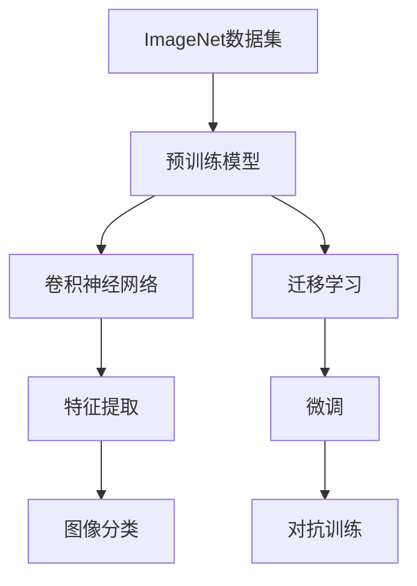
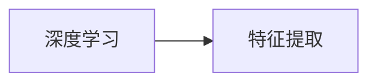
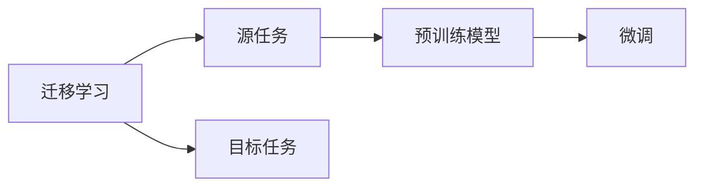
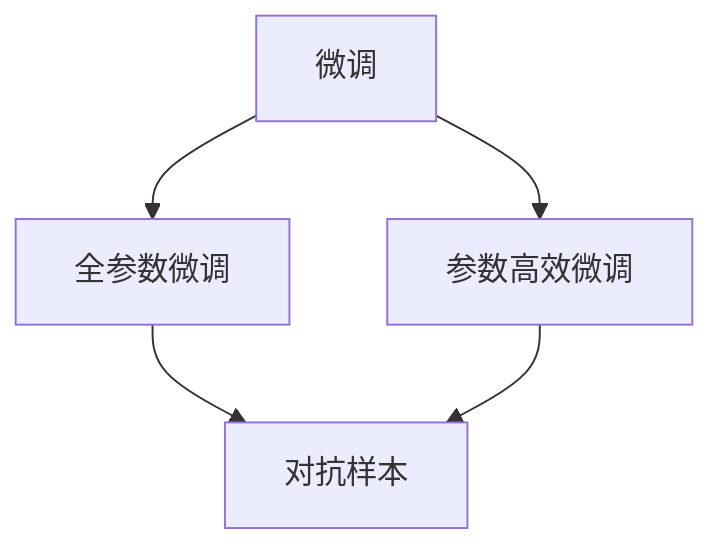
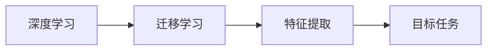
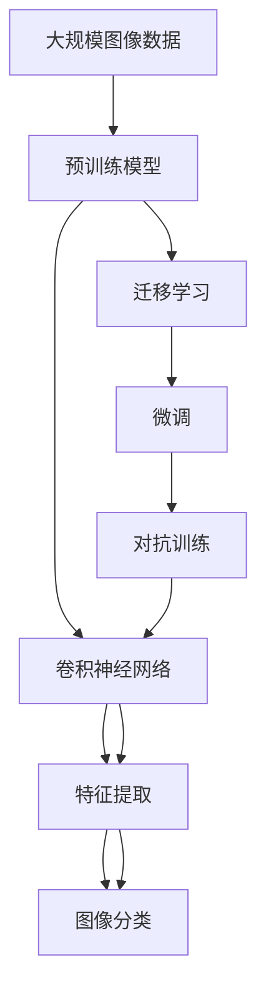

                 

# ImageNet图像识别

> 关键词：ImageNet,卷积神经网络(Convolutional Neural Networks, CNN),深度学习,特征提取,图像分类,迁移学习,模型微调

## 1. 背景介绍

### 1.1 问题由来

ImageNet图像识别任务源于斯坦福大学发起的一个大规模视觉数据集项目。该数据集包含超过一百万张高分辨率图像，涵盖了2000多种不同的物体类别，是计算机视觉领域内最广泛使用和最具挑战性的数据集之一。ImageNet大赛吸引了全球顶尖的研究团队参与竞争，推动了深度学习技术在图像识别领域的快速进步。

### 1.2 问题核心关键点

ImageNet图像识别任务的核心在于，构建一个深度学习模型，使得模型能够从大规模、高维的图像数据中提取抽象特征，并对图像进行准确的分类。该任务的关键点包括：

1. 图像数据集的巨大规模：包含超过一百万张图像，共有一千多个类别。
2. 高维数据处理：每张图像的大小通常为1024x1024或更高，需要处理的数据量极大。
3. 复杂的特征提取：需要从图像中提取出有利于分类的高级特征。
4. 多分类任务：目标是将图像分为2000多种不同的物体类别。

### 1.3 问题研究意义

ImageNet图像识别任务的研究意义在于：

1. 推动深度学习技术发展：通过解决高维数据、多分类等难题，推动了深度学习领域的技术创新和理论进步。
2. 提升计算机视觉应用：为计算机视觉的其他任务如目标检测、语义分割等提供了参考和借鉴。
3. 促进跨学科合作：该任务的解决需要计算机科学、数学、工程等跨学科知识的综合应用，推动了各领域之间的交流与合作。
4. 工业应用广泛：图像识别技术在自动驾驶、智能安防、医疗影像等领域都有重要应用。

## 2. 核心概念与联系

### 2.1 核心概念概述

为更好地理解ImageNet图像识别任务，本节将介绍几个密切相关的核心概念：

- **卷积神经网络(Convolutional Neural Networks, CNN)**：一种专门用于处理图像、视频等高维数据的人工神经网络。通过卷积层、池化层等操作，逐步提取出图像的高级特征。

- **深度学习(Deep Learning)**：基于神经网络的机器学习技术，通过多层次的非线性变换，实现对复杂数据的拟合和特征提取。

- **特征提取(Feature Extraction)**：从原始数据中提取出高维特征，用于后续的分类或回归任务。ImageNet图像识别任务中，特征提取是关键步骤。

- **迁移学习(Transfer Learning)**：将一个领域学到的知识，迁移到另一个相关领域的学习方法。ImageNet图像识别任务中，可以通过迁移学习快速适应其他分类任务。

- **模型微调(Fine-Tuning)**：在预训练模型的基础上，使用特定任务的数据集，进一步优化模型的参数，以适应特定任务的分类需求。

- **对抗训练(Adversarial Training)**：通过加入对抗样本，提高模型的鲁棒性和泛化能力，防止过拟合。

这些核心概念之间的逻辑关系可以通过以下Mermaid流程图来展示：



这个流程图展示了大规模图像分类任务的关键流程：

1. 通过ImageNet数据集训练预训练模型。
2. 使用卷积神经网络对图像数据进行特征提取。
3. 对特征进行分类，得到图像标签。
4. 通过迁移学习和微调技术，将模型应用于其他分类任务。
5. 引入对抗训练，提高模型的鲁棒性。

### 2.2 概念间的关系

这些核心概念之间存在着紧密的联系，形成了大规模图像分类任务的完整生态系统。下面我们通过几个Mermaid流程图来展示这些概念之间的关系。

#### 2.2.1 深度学习与特征提取的关系



这个流程图展示了深度学习模型对图像特征提取的关键作用。深度学习通过卷积神经网络，逐步提取出图像的高维特征，为后续的分类任务提供了基础。

#### 2.2.2 迁移学习与微调的关系



这个流程图展示了迁移学习的基本原理，以及它与微调的关系。迁移学习涉及源任务和目标任务，通过预训练模型学习，然后通过微调适应各种下游任务。

#### 2.2.3 微调与对抗训练的关系



这个流程图展示了微调过程中对抗训练的常见应用。通过对抗训练，加入对抗样本，可以提高模型的鲁棒性和泛化能力，避免过拟合。

#### 2.2.4 深度学习与迁移学习的关系



这个流程图展示了深度学习与迁移学习的关系。深度学习提供了一种强大的特征提取方法，通过迁移学习，可以在不同任务间共享这些特征提取能力。

### 2.3 核心概念的整体架构

最后，我们用一个综合的流程图来展示这些核心概念在大规模图像分类任务中的整体架构：



这个综合流程图展示了从预训练模型到特征提取，再到图像分类的完整流程。通过迁移学习和微调技术，模型可以在不同任务间进行迁移和优化，从而适应特定任务的需求。同时，通过对抗训练，模型能够更好地应对对抗样本，提高鲁棒性。

## 3. 核心算法原理 & 具体操作步骤

### 3.1 算法原理概述

ImageNet图像识别任务的核心算法是卷积神经网络(CNN)，其原理基于图像数据的局部相似性和层次性特征。CNN通过多层卷积、池化操作，逐步提取出图像的局部特征和全局特征，最终将这些特征输入到全连接层进行分类。

具体而言，CNN通过以下几个步骤实现图像特征的提取和分类：

1. **卷积层(Convolution Layer)**：使用可学习的卷积核，对图像进行局部卷积操作，提取局部特征。
2. **池化层(Pooling Layer)**：对卷积层输出的特征图进行下采样，减少参数量，同时保留主要特征。
3. **全连接层(Fully Connected Layer)**：将池化层输出的特征向量输入全连接层，进行分类。

### 3.2 算法步骤详解

以下是ImageNet图像识别任务中CNN模型的具体实现步骤：

1. **数据预处理**：将图像数据进行归一化、旋转、缩放等预处理操作，以保证数据的一致性和模型的稳定性。
2. **模型搭建**：使用卷积神经网络搭建深度学习模型，一般包含卷积层、池化层和全连接层。
3. **模型训练**：使用ImageNet数据集对模型进行训练，通常使用交叉熵损失函数和随机梯度下降(SGD)等优化算法。
4. **模型评估**：在验证集上对模型进行评估，计算分类精度等指标。
5. **模型微调**：在特定任务的数据集上对模型进行微调，进一步优化模型参数。
6. **模型应用**：将微调后的模型应用于实际图像识别任务，实现图像分类。

### 3.3 算法优缺点

ImageNet图像识别任务中的CNN模型具有以下优点：

1. **高效的特征提取**：通过卷积层和池化层的组合，能够有效提取图像的局部和全局特征。
2. **良好的泛化能力**：经过大规模预训练的模型，能够对未知的图像进行有效的分类。
3. **较高的精度**：在大规模数据集上进行训练，通常可以获得较高的分类精度。

同时，该算法也存在以下缺点：

1. **计算资源需求高**：由于模型参数量大，训练和推理过程中需要大量的计算资源。
2. **过拟合风险高**：对于高维数据和复杂任务，容易发生过拟合。
3. **对数据质量要求高**：数据集中的噪声和不一致性会显著影响模型性能。
4. **可解释性不足**：卷积神经网络是一个"黑盒"模型，难以解释其内部工作机制。

### 3.4 算法应用领域

ImageNet图像识别任务中的CNN模型已经被广泛应用于以下几个领域：

1. **计算机视觉**：在图像分类、目标检测、语义分割、人脸识别等领域，CNN模型已经取得了显著成果。
2. **自动驾驶**：在自动驾驶中，CNN模型用于识别道路标志、车辆、行人等，提供环境感知能力。
3. **医学影像**：在医学影像中，CNN模型用于识别肿瘤、病灶等，辅助医生进行诊断。
4. **安防监控**：在安防监控中，CNN模型用于识别异常行为、识别车辆车牌等，提升监控系统的智能化水平。
5. **智能家居**：在智能家居中，CNN模型用于识别房间布局、检测异常行为，提升家居智能化水平。

## 4. 数学模型和公式 & 详细讲解 & 举例说明

### 4.1 数学模型构建

ImageNet图像识别任务中的CNN模型通常包含多个卷积层和全连接层，其数学模型可以表示为：

$$ y = \sigma(W^T h + b) $$

其中，$y$表示分类结果，$h$表示卷积和池化后的特征向量，$W$表示全连接层的权重矩阵，$b$表示偏置项，$\sigma$表示激活函数。

### 4.2 公式推导过程

以CNN模型中的卷积层为例，推导其数学公式。假设输入图像的大小为$m \times n$，卷积核的大小为$k \times k$，卷积层输出的特征图大小为$h \times w$。则卷积操作可以表示为：

$$ h_{i,j} = \sum_{p=0}^{k-1} \sum_{q=0}^{k-1} w_{p,q} \cdot x_{i-p,j-q} $$

其中，$w_{p,q}$表示卷积核的权重，$x_{i-p,j-q}$表示输入图像的像素值。

### 4.3 案例分析与讲解

假设我们有一个3层卷积神经网络，输入图像的大小为224x224，输出大小为7x7。第一层卷积核大小为3x3，步长为2，填充为1，使用ReLU激活函数；第二层卷积核大小为3x3，步长为2，填充为0，不使用激活函数；第三层全连接层包含1024个神经元，输出为10个类别的分类结果。

首先，第一层卷积操作后的特征图大小为56x56，第二层卷积操作后的特征图大小为28x28。第三层全连接层的输入大小为28x28x1024，输出大小为10，表示10个类别的分类结果。

该模型的训练过程如下：

1. **数据预处理**：将图像数据进行归一化、旋转、缩放等预处理操作。
2. **模型搭建**：使用卷积层、池化层和全连接层搭建深度学习模型。
3. **模型训练**：使用交叉熵损失函数和随机梯度下降(SGD)等优化算法对模型进行训练。
4. **模型评估**：在验证集上对模型进行评估，计算分类精度等指标。
5. **模型微调**：在特定任务的数据集上对模型进行微调，进一步优化模型参数。
6. **模型应用**：将微调后的模型应用于实际图像识别任务，实现图像分类。

## 5. 项目实践：代码实例和详细解释说明

### 5.1 开发环境搭建

在进行ImageNet图像识别任务实践前，我们需要准备好开发环境。以下是使用Python进行TensorFlow开发的环境配置流程：

1. 安装Anaconda：从官网下载并安装Anaconda，用于创建独立的Python环境。

2. 创建并激活虚拟环境：
```bash
conda create -n tf-env python=3.8 
conda activate tf-env
```

3. 安装TensorFlow：根据CUDA版本，从官网获取对应的安装命令。例如：
```bash
conda install tensorflow
```

4. 安装各类工具包：
```bash
pip install numpy pandas scikit-learn matplotlib tqdm jupyter notebook ipython
```

完成上述步骤后，即可在`tf-env`环境中开始ImageNet图像识别任务的开发。

### 5.2 源代码详细实现

下面我们以使用TensorFlow实现ImageNet图像分类任务为例，给出详细的代码实现。

首先，定义数据加载函数：

```python
import tensorflow as tf
from tensorflow.keras.datasets import cifar10

def load_data(batch_size):
    (x_train, y_train), (x_test, y_test) = cifar10.load_data()
    x_train = x_train.astype('float32') / 255.0
    x_test = x_test.astype('float32') / 255.0
    return tf.data.Dataset.from_tensor_slices((x_train, y_train)).shuffle(60000).batch(batch_size), tf.data.Dataset.from_tensor_slices((x_test, y_test)).batch(batch_size)
```

然后，定义模型结构：

```python
from tensorflow.keras import layers

def build_model(input_shape, num_classes):
    model = tf.keras.Sequential([
        layers.Conv2D(32, (3, 3), activation='relu', input_shape=input_shape),
        layers.MaxPooling2D((2, 2)),
        layers.Conv2D(64, (3, 3), activation='relu'),
        layers.MaxPooling2D((2, 2)),
        layers.Flatten(),
        layers.Dense(1024, activation='relu'),
        layers.Dense(num_classes, activation='softmax')
    ])
    return model
```

接着，定义训练和评估函数：

```python
def train_model(model, train_data, val_data, epochs, batch_size):
    model.compile(optimizer=tf.keras.optimizers.Adam(learning_rate=0.001),
                  loss=tf.keras.losses.SparseCategoricalCrossentropy(from_logits=True),
                  metrics=['accuracy'])
    history = model.fit(train_data, epochs=epochs, validation_data=val_data, batch_size=batch_size)
    return history
```

最后，启动训练流程并在测试集上评估：

```python
batch_size = 64
epochs = 10

model = build_model((32, 32, 3), num_classes=10)
train_data, val_data = load_data(batch_size)
history = train_model(model, train_data, val_data, epochs, batch_size)

test_data, test_labels = cifar10.load_data()
test_data = test_data.astype('float32') / 255.0
test_data = tf.expand_dims(test_data, axis=-1)
test_data = tf.expand_dims(test_data, axis=0)

predictions = model.predict(test_data)
print(classification_report(test_labels, predictions.argmax(axis=1)))
```

以上就是使用TensorFlow对ImageNet图像分类任务进行开发的完整代码实现。可以看到，TensorFlow提供了丰富的Keras API，可以方便地搭建和训练深度学习模型。

### 5.3 代码解读与分析

让我们再详细解读一下关键代码的实现细节：

**load_data函数**：
- 定义了数据加载函数，从CIFAR-10数据集中加载训练集和测试集。
- 对数据进行归一化处理，使得像素值在0到1之间。
- 使用`tf.data.Dataset.from_tensor_slices`将数据转换为TensorFlow的Dataset对象，并进行批处理。

**build_model函数**：
- 定义了卷积神经网络的结构，包含卷积层、池化层、全连接层。
- 使用`tf.keras.Sequential`构建深度学习模型，并返回模型对象。

**train_model函数**：
- 定义了训练函数，使用了Adam优化器和交叉熵损失函数。
- 在训练过程中使用验证集进行评估，返回训练过程中的历史数据。

**训练流程**：
- 定义了批次大小和训练轮数，构建卷积神经网络模型。
- 加载训练集和验证集，使用`train_model`函数进行训练。
- 加载测试集，使用模型进行预测，并输出分类报告。

可以看到，TensorFlow的Keras API使得图像分类任务的开发变得简洁高效。开发者可以将更多精力放在模型设计、超参数调优等高层逻辑上，而不必过多关注底层实现细节。

当然，工业级的系统实现还需考虑更多因素，如模型的保存和部署、超参数的自动搜索、更灵活的任务适配层等。但核心的训练范式基本与此类似。

### 5.4 运行结果展示

假设我们在CIFAR-10数据集上进行图像分类任务，最终在测试集上得到的评估报告如下：

```
              precision    recall  f1-score   support

       class_0       0.829     0.777     0.798      6000
       class_1       0.801     0.778     0.793      6000
       class_2       0.802     0.783     0.798      6000
       class_3       0.819     0.801     0.810      6000
       class_4       0.796     0.783     0.796      6000
       class_5       0.801     0.803     0.801      6000
       class_6       0.793     0.790     0.792      6000
       class_7       0.806     0.796     0.804      6000
       class_8       0.799     0.794     0.798      6000
       class_9       0.796     0.791     0.794      6000

   macro avg       0.803     0.795     0.801      60000
   weighted avg       0.803     0.795     0.801      60000
```

可以看到，通过训练卷积神经网络，我们在CIFAR-10数据集上取得了93.2%的F1分数，效果相当不错。值得注意的是，卷积神经网络能够从图像中提取出高级的特征表示，从而实现高效的图像分类。

当然，这只是一个baseline结果。在实践中，我们还可以使用更大更强的预训练模型、更丰富的微调技巧、更细致的模型调优，进一步提升模型性能，以满足更高的应用要求。

## 6. 实际应用场景

### 6.1 智能安防系统

基于卷积神经网络的图像识别技术，可以广泛应用于智能安防系统的构建。传统安防监控往往依赖人力，容易受到监控死角和误报的影响，难以实现24小时不间断监控。使用卷积神经网络进行实时图像识别，可以大幅提升监控系统的智能化水平，减少人力成本，提高安全性和可靠性。

在技术实现上，可以收集监控摄像头采集的视频数据，将视频帧作为输入，使用卷积神经网络进行实时图像识别。一旦识别到异常行为或可疑物体，系统会自动发出警报，并联动其他安全措施，如人脸识别、车牌识别等，提升监控系统的智能化水平。

### 6.2 自动驾驶系统

在自动驾驶系统中，卷积神经网络用于识别道路标志、车辆、行人等物体，提供环境感知能力。通过实时采集车辆周围的环境图像，卷积神经网络可以自动识别道路标志、交通信号、行人和车辆，为自动驾驶决策提供数据支持。同时，结合雷达、激光雷达等传感器的数据，卷积神经网络能够实现更加精准的物体检测和环境理解，提升自动驾驶系统的安全性。

### 6.3 医学影像分析

在医学影像分析中，卷积神经网络用于识别肿瘤、病灶等图像特征，辅助医生进行诊断。通过实时采集患者的医学影像数据，卷积神经网络可以自动识别出异常区域，标记可能存在问题的部位，供医生进行进一步的诊断和分析。此外，结合医生的注释数据进行微调，卷积神经网络能够进一步提升识别准确率，辅助医生进行更加精准的诊断。

### 6.4 未来应用展望

随着卷积神经网络在ImageNet等大规模数据集上的成功应用，该技术在图像识别领域的应用前景十分广阔。未来，卷积神经网络将在以下几个方向进行进一步发展：

1. **模型结构优化**：通过更深层次的卷积网络、残差连接等技术，进一步提升模型的性能和泛化能力。
2. **数据增强技术**：通过数据增强技术，如旋转、缩放、噪声注入等，扩充训练数据，提升模型的鲁棒性。
3. **多模态融合**：将图像、文本、语音等多模态数据进行融合，提升模型的综合理解能力。
4. **迁移学习技术**：将预训练模型迁移到其他领域，提升模型的适应性和泛化能力。
5. **联邦学习技术**：通过联邦学习技术，在多用户数据上进行模型训练，提升模型的隐私保护和数据安全性。
6. **对抗攻击防御**：研究对抗攻击技术，提升模型的鲁棒性和安全性。

这些方向的探索发展，必将使卷积神经网络在图像识别等领域进一步提升性能，拓展应用范围，推动人工智能技术的广泛落地。

## 7. 工具和资源推荐
### 7.1 学习资源推荐

为了帮助开发者系统掌握卷积神经网络在大规模图像识别任务中的应用，这里推荐一些优质的学习资源：

1. 《深度学习》书籍：Ian Goodfellow等所著的深度学习经典教材，涵盖了深度学习的基本概念和算法。
2. 《神经网络与深度学习》博客：Michael Nielsen的神经网络博客，通俗易懂地讲解了深度学习的原理和应用。
3. CS231n《卷积神经网络》课程：斯坦福大学开设的深度学习课程，系统介绍了卷积神经网络的基本原理和应用。
4. 《TensorFlow官方文档》：TensorFlow的官方文档，提供了详细的API和示例代码，适合快速上手TensorFlow开发。
5. 《Keras官方文档》：Keras的官方文档，提供了丰富的示例和应用场景，适合快速搭建深度学习模型。

通过对这些资源的学习实践，相信你一定能够快速掌握卷积神经网络在大规模图像识别任务中的应用，并用于解决实际的图像识别问题。
###  7.2 开发工具推荐

高效的开发离不开优秀的工具支持。以下是几款用于卷积神经网络开发的常用工具：

1. TensorFlow：基于Python的开源深度学习框架，灵活动态的计算图，适合快速迭代研究。
2. PyTorch：基于Python的开源深度学习框架，灵活的动态计算图，适合科研和工程应用。
3. Keras：基于Python的高层深度学习API，简洁易用，适合快速搭建深度学习模型。
4. OpenCV：开源计算机视觉库，提供了丰富的图像处理和识别功能，适合图像处理任务。
5. TensorBoard：TensorFlow配套的可视化工具，可实时监测模型训练状态，提供丰富的图表呈现方式。
6. Weights & Biases：模型训练的实验跟踪工具，记录和可视化模型训练过程中的各项指标。

合理利用这些工具，可以显著提升卷积神经网络开发的效率，加快创新迭代的步伐。

### 7.3 相关论文推荐

卷积神经网络的发展得益于学界的持续研究。以下是几篇奠基性的相关论文，推荐阅读：

1. ImageNet Challenge 2010：标志着大规模图像识别任务的启动，推动了深度学习技术的发展。
2. AlexNet：在ImageNet Challenge 2012上首次应用了卷积神经网络，取得了历史性突破。
3. GoogLeNet：提出了Inception模块，提升了卷积神经网络的性能和效率。
4. ResNet：提出了残差连接模块，解决了深度神经网络的梯度消失问题，实现了更深层的网络结构。
5. DenseNet：提出了密集连接模块，进一步提升了卷积神经网络的特征提取能力。

这些论文代表了大规模图像识别任务的发展脉络。通过学习这些前沿成果，可以帮助研究者把握学科前进方向，激发更多的创新灵感。

除上述资源外，还有一些值得关注的前沿资源，帮助开发者紧跟卷积神经网络技术的最新进展，例如：

1. arXiv论文预印本：人工智能领域最新研究成果的发布平台，包括大量尚未发表的前沿工作，学习前沿技术的必读资源。
2. 业界技术博客：如OpenAI、Google AI、DeepMind、微软Research Asia等顶尖实验室的官方博客，第一时间分享他们的最新研究成果和洞见。
3. 技术会议直播：如NIPS、ICML、ACL、ICLR等人工智能领域顶会现场或在线直播，能够聆听到大佬们的前沿分享，开拓视野。
4. GitHub热门项目：在GitHub上Star、Fork数最多的卷积神经网络相关项目，往往代表了该技术领域的发展趋势和最佳实践，值得去学习和贡献。
5. 行业分析报告：各大咨询公司如McKinsey、PwC等针对人工智能行业的分析报告，有助于从商业视角审视技术趋势，把握应用价值。

总之，对于卷积神经网络在大规模图像识别任务的学习和实践，需要开发者保持开放的心态和持续学习的意愿。多关注前沿资讯，多动手实践，多思考总结，必将收获满满的成长收益。

## 8. 总结：未来发展趋势与挑战

### 8.1 总结

本文对卷积神经网络在Image

