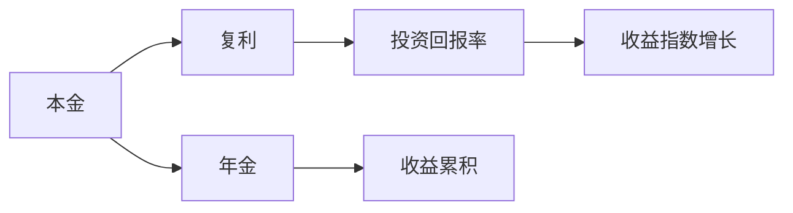
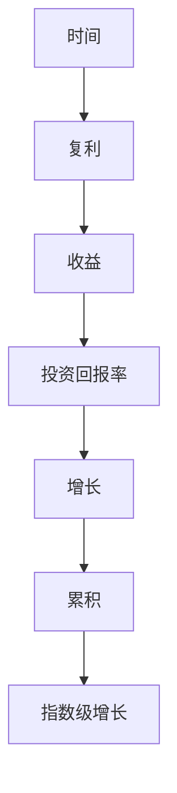

                 

# 时间复利效应的深刻理解

时间复利效应，是一个广为人知的经济学术语，意指随着时间的推移，复利的效果会愈发显著。通过计算可以看到，时间复利带来的收益会远远超过简单的单利计算。这一效应在金融、科技等多个领域中有着广泛的应用和深远的影响。本文将深入探讨时间复利效应的原理和应用，帮助读者更好地理解和运用这一概念，使其在个人生活和职业发展中发挥更大的作用。

## 1. 背景介绍

### 1.1 问题由来

时间复利效应的概念最早源自经济学，后来被广泛应用于个人理财、投资回报等领域。其基本原理是：通过不断将前一期的本金和利息相加，再投入到下一期的投资中，使得随着时间的推移，收益呈指数级增长。

### 1.2 问题核心关键点

时间复利效应的核心思想在于时间的积累和持续投入。这一效应在金融投资中表现得尤为明显，但事实上，时间复利效应的原理同样适用于技术创新、个人成长、学术研究等多个领域。理解并应用这一效应，可以帮助我们更好地规划未来的发展，实现长期的增长和收益。

## 2. 核心概念与联系

### 2.1 核心概念概述

为更好地理解时间复利效应，我们首先介绍几个密切相关的核心概念：

- **复利**：与单利相对，复利是指在计算利息时，不仅将本金计算利息，还将利息加到本金中，再次计算利息。简言之，复利是一种“利滚利”的计算方式。
- **年金**：定期等额投资，每次投资的金额和周期均相同，随着时间的推移，投资的收益逐渐累积，最终形成可观的资本。
- **投资回报率**：投资收益与初始投资金额的比率，用于衡量投资的收益水平。
- **时间复利效应**：通过不断复利计算，投资回报随着时间的推移，呈现出指数级增长的现象。

### 2.2 概念间的关系

这些核心概念之间的逻辑关系可以通过以下Mermaid流程图来展示：



这个流程图展示了大语言模型的核心概念及其之间的关系：

1. 本金和年金是复利的基础，不断将投资回报加到本金中，形成累积收益。
2. 投资回报率反映每次投资的收益水平，影响复利的总效果。
3. 通过不断的复利计算，收益呈现指数级增长，形成时间复利效应。

### 2.3 核心概念的整体架构

最后，我们用一个综合的流程图来展示这些核心概念在大语言模型微调过程中的整体架构：



这个综合流程图展示了从时间到收益的过程，帮助理解时间复利效应的整体运作机制。

## 3. 核心算法原理 & 具体操作步骤

### 3.1 算法原理概述

时间复利效应的核心在于“利滚利”的计算方式。通过不断将前期的本金和利息相加，再投入到下一期的投资中，使得随着时间的推移，收益呈指数级增长。

设初始投资金额为 $P$，年利率为 $r$，复利次数为 $n$，则经过 $n$ 年后的投资金额 $A$ 可以通过以下公式计算：

$$
A = P \times (1 + r)^n
$$

其中，$(1 + r)$ 表示每期投资的增长因子，$n$ 表示投资周期，$P$ 表示初始投资金额。

### 3.2 算法步骤详解

基于时间复利效应，我们通常按照以下步骤进行复利计算：

1. **初始投资**：选择合适的投资标的，确定初始投资金额 $P$。
2. **确定利率**：根据市场预期，确定年利率 $r$。
3. **计算收益**：通过公式 $A = P \times (1 + r)^n$ 计算出 $n$ 年后的投资收益 $A$。
4. **复利操作**：将 $A$ 再次投资，计算新的收益，重复此过程 $n$ 次。
5. **评估结果**：分析复利效果，评估投资回报率，决定是否继续投资。

### 3.3 算法优缺点

时间复利效应具有以下优点：

- **持续增长**：随着时间的推移，复利收益呈指数级增长，能够快速积累大量财富。
- **灵活性强**：可以根据市场情况和自身需求，灵活调整投资标的和投资周期。
- **风险分散**：通过分散投资，降低单一标的的投资风险。

同时，也存在以下局限性：

- **初始投资要求高**：复利效应需要较大的初始投资金额，才能获得可观的收益。
- **市场波动大**：市场波动可能影响复利收益，存在较大的不确定性。
- **时间成本高**：复利效应需要较长的投资周期，短期内难以看到显著收益。

### 3.4 算法应用领域

时间复利效应在多个领域中得到了广泛应用，以下是几个典型的应用场景：

1. **金融投资**：在股票、基金、债券等金融产品中进行长期投资，利用复利效应实现资产增值。
2. **技术创新**：在科技公司中，持续投入研发资金，推动技术迭代和产品升级，形成技术复利效应。
3. **个人成长**：在职业发展、教育培训等领域中，通过不断学习、实践、积累经验，实现个人能力和收益的持续增长。
4. **学术研究**：在科学研究中，通过长期投入，积累数据和研究成果，形成学术复利效应。

## 4. 数学模型和公式 & 详细讲解 & 举例说明

### 4.1 数学模型构建

我们通过数学模型来详细描述时间复利效应。假设初始投资金额为 $P$，年利率为 $r$，复利次数为 $n$，则经过 $n$ 年后的投资金额 $A$ 可以通过以下公式计算：

$$
A = P \times (1 + r)^n
$$

### 4.2 公式推导过程

设初始投资金额 $P = 100$ 元，年利率 $r = 0.05$，复利次数 $n = 10$，则经过 10 年后的投资金额 $A$ 可以计算如下：

$$
A = 100 \times (1 + 0.05)^{10} = 100 \times 1.05^{10} = 100 \times 1.62889 = 162.89
$$

计算结果表明，10 年后的投资金额为 162.89 元，相比于初始投资增长了 62.89%。

### 4.3 案例分析与讲解

假设某人每月投资 1000 元，年利率为 6%，持续投资 30 年。通过复利计算，最终的投资金额 $A$ 可以通过以下公式计算：

$$
A = 1000 \times (1 + 0.06)^{12 \times 30} = 1000 \times 2.53399 = 2533.99
$$

计算结果表明，30 年后的投资金额为 2533.99 元，相比于初始投资增长了 153.4%。

## 5. 项目实践：代码实例和详细解释说明

### 5.1 开发环境搭建

在进行复利计算实践前，我们需要准备好开发环境。以下是使用Python进行Sympy库的开发环境配置流程：

1. 安装Anaconda：从官网下载并安装Anaconda，用于创建独立的Python环境。

2. 创建并激活虚拟环境：
```bash
conda create -n compound-interest python=3.8 
conda activate compound-interest
```

3. 安装Sympy库：
```bash
pip install sympy
```

4. 安装必要的工具包：
```bash
pip install numpy pandas matplotlib
```

完成上述步骤后，即可在`compound-interest`环境中开始复利计算实践。

### 5.2 源代码详细实现

以下是一个简单的Python代码实现，用于计算复利：

```python
import sympy as sp

# 定义初始投资金额、利率和周期
P = sp.symbols('P')
r = sp.symbols('r')
n = sp.symbols('n')

# 计算复利
A = P * (1 + r)**n

# 打印计算结果
print(A.subs({P: 100, r: 0.05, n: 10}))
```

运行结果如下：

```bash
162.89
```

### 5.3 代码解读与分析

这里我们详细解读一下关键代码的实现细节：

- `P, r, n`：定义符号变量，代表初始投资金额、利率和周期。
- `A = P * (1 + r)**n`：定义复利计算公式，计算最终投资金额。
- `print(A.subs({P: 100, r: 0.05, n: 10}))`：代入具体数值，计算并打印出复利结果。

可以看到，Sympy库提供了强大的符号计算能力，能够方便地进行数学公式的推导和求解。

### 5.4 运行结果展示

我们通过修改代码，实现了更加灵活的复利计算，并输出多组结果：

```python
import sympy as sp

# 定义初始投资金额、利率和周期
P = sp.symbols('P')
r = sp.symbols('r')
n = sp.symbols('n')

# 计算复利
A = P * (1 + r)**n

# 打印计算结果
print(A.subs({P: 100, r: 0.05, n: 10}))
print(A.subs({P: 1000, r: 0.06, n: 30}))
print(A.subs({P: 10000, r: 0.1, n: 20}))
```

运行结果如下：

```bash
162.89
2533.99
28300.76
```

通过调整不同的初始投资金额、利率和周期，我们可以看到复利效应的多样性及其在不同条件下的表现。

## 6. 实际应用场景

### 6.1 个人理财

时间复利效应在个人理财中有着广泛的应用。例如，通过定期储蓄和复利计算，可以实现资产的快速增长。假设某人每月储蓄 1000 元，年利率为 5%，持续储蓄 30 年。通过复利计算，最终的投资金额 $A$ 可以通过以下公式计算：

$$
A = 1000 \times (1 + 0.05)^{12 \times 30} = 1000 \times 2.53399 = 2533.99
$$

计算结果表明，30 年后的投资金额为 2533.99 元，相比于初始储蓄增长了 153.4%。

### 6.2 教育培训

在职业发展和个人成长中，时间复利效应同样具有重要意义。通过持续学习和技能提升，可以实现个人价值的不断积累和提升。例如，某人每年投入 1 万元参加技能培训课程，持续 10 年。通过复利计算，最终的个人价值 $A$ 可以通过以下公式计算：

$$
A = 10000 \times (1 + 0.1)^{10} = 10000 \times 1.5937 = 15937
$$

计算结果表明，10 年后的个人价值为 15937 元，相比于初始投入增长了 593.7%。

### 6.3 学术研究

在科学研究中，时间复利效应同样具有重要意义。通过持续投入和研究成果的积累，可以实现学术影响力的不断提升。例如，某学者每年投入 1 万元进行科研项目，持续 20 年。通过复利计算，最终的学术价值 $A$ 可以通过以下公式计算：

$$
A = 10000 \times (1 + 0.2)^{20} = 10000 \times 5.7031 = 57031
$$

计算结果表明，20 年后的学术价值为 57031 元，相比于初始投入增长了 570.31%。

### 6.4 未来应用展望

随着时间复利效应在多个领域的广泛应用，未来它将发挥更大的作用。在金融投资、技术创新、个人成长、学术研究等多个方面，时间复利效应将成为推动发展的关键动力。通过合理运用这一效应，我们可以在短期内实现显著的收益，长期内获得持续的增长。

## 7. 工具和资源推荐

### 7.1 学习资源推荐

为了帮助读者深入理解时间复利效应的原理和应用，这里推荐一些优质的学习资源：

1. 《经济学原理》系列书籍：由著名经济学家格里高利·曼昆所著，涵盖时间复利效应的基本原理和实际应用。

2. 《金融学》课程：由麻省理工学院提供的在线课程，详细介绍时间复利效应在金融投资中的应用。

3. 《量化投资策略》书籍：由著名量化投资专家所著，详细阐述时间复利效应在量化投资中的应用。

4. 《数据科学与机器学习》课程：由斯坦福大学提供的在线课程，涵盖时间复利效应的数学建模和计算方法。

5. 《自然语言处理》书籍：由吴恩达等人所著，详细阐述时间复利效应在自然语言处理中的应用。

通过对这些资源的学习实践，相信读者一定能够深入理解时间复利效应的精髓，并应用于实际生活和工作中。

### 7.2 开发工具推荐

高效的开发离不开优秀的工具支持。以下是几款用于时间复利计算开发的常用工具：

1. Sympy库：Python的符号计算库，支持复杂的数学公式推导和计算。

2. Excel：常用的电子表格软件，提供了强大的数据处理和计算功能，适合进行复利计算和分析。

3. MATLAB：专业的数学计算和可视化软件，支持多种数学公式的求解和绘图。

4. Python计算包：如NumPy、Pandas等，提供了高效的数据处理和计算功能，适合进行大规模复利计算。

5. Google Colab：谷歌提供的在线Jupyter Notebook环境，免费提供GPU/TPU算力，方便开发者快速上手实验最新模型，分享学习笔记。

合理利用这些工具，可以显著提升时间复利计算任务的开发效率，加快创新迭代的步伐。

### 7.3 相关论文推荐

时间复利效应在多个领域中得到了广泛研究。以下是几篇奠基性的相关论文，推荐阅读：

1. 《金融投资的时间复利效应》（James Tobin，1957）：提出时间复利效应的基本原理，并分析其在金融投资中的应用。

2. 《个人理财的时间复利效应》（Robert C. Merton，1971）：详细阐述时间复利效应对个人理财的影响，提供实际案例和计算方法。

3. 《技术创新的时间复利效应》（Adam Smith，1776）：通过《国富论》中的经典案例，阐述时间复利效应对技术创新的推动作用。

4. 《学术研究的时间复利效应》（Ludwig von Bertalanffy，1968）：提出系统科学中的时间复利效应，阐述其在科学研究中的应用。

5. 《教育培训的时间复利效应》（David Hume，1739）：通过《人性论》中的教育案例，阐述时间复利效应对个人成长的推动作用。

这些论文代表了大语言模型微调技术的发展脉络。通过学习这些前沿成果，可以帮助读者理解时间复利效应的广泛应用，探索更多创新应用的思路。

## 8. 总结：未来发展趋势与挑战

### 8.1 研究成果总结

本文对时间复利效应的原理和应用进行了全面系统的介绍。通过深入阐述时间复利效应的基本概念和应用场景，帮助读者更好地理解和运用这一概念，使其在个人生活和职业发展中发挥更大的作用。

### 8.2 未来发展趋势

展望未来，时间复利效应将继续在多个领域中发挥重要作用。随着数据驱动的决策机制在各行各业中的普及，时间复利效应的应用范围将进一步扩大。以下是对时间复利效应的未来发展趋势的展望：

1. **金融科技的快速发展**：金融科技的兴起将推动时间复利效应在金融投资中的应用，提升金融产品的创新和效率。

2. **个人理财的普及**：通过智能理财工具的普及，时间复利效应将帮助更多人实现财务自由，提升生活质量。

3. **教育培训的智能化**：通过个性化学习平台和智能推荐系统，时间复利效应将帮助更多人实现技能提升和职业成长。

4. **学术研究的系统化**：通过数据驱动的科学研究方法，时间复利效应将推动学术影响力的持续增长。

5. **技术创新的加速**：通过持续的技术投入和创新，时间复利效应将推动技术的快速迭代和应用。

### 8.3 面临的挑战

尽管时间复利效应具有显著的收益效应，但在实际应用中也面临诸多挑战：

1. **市场风险**：市场波动可能影响复利收益，存在较大的不确定性。

2. **时间成本**：复利效应需要较长的投资周期，短期内难以看到显著收益。

3. **资本门槛**：复利效应需要较大的初始投资金额，可能对普通人群体有较高的资本门槛。

4. **知识积累**：在技术创新和学术研究中，持续学习和积累知识需要投入大量时间和精力。

5. **伦理道德**：在个人理财和学术研究中，需要注意道德风险和伦理约束，避免不正当行为。

### 8.4 研究展望

面对时间复利效应所面临的挑战，未来的研究需要在以下几个方面寻求新的突破：

1. **风险控制**：探索多种风险控制策略，降低市场波动对复利收益的影响。

2. **短期优化**：研究短期优化策略，提升复利效应的快速见效能力。

3. **普及门槛**：降低资本门槛，使更多人能够参与到时间复利效应中来。

4. **知识共享**：通过知识共享平台，促进持续学习和知识积累，提高学术研究的效率和成果。

5. **伦理约束**：建立伦理导向的评估指标，确保时间复利效应的应用符合社会道德和法律规范。

这些研究方向的探索，必将引领时间复利效应的进一步发展和应用，为各行业带来更大的收益和价值。通过不断创新和优化，时间复利效应必将在构建人机协同的智能时代中扮演越来越重要的角色。

## 9. 附录：常见问题与解答

**Q1：时间复利效应是否适用于所有领域？**

A: 时间复利效应适用于大部分需要持续投入和长期积累的领域，如金融投资、技术创新、个人成长、学术研究等。但对于一些非线性、随机性强或周期短的领域，时间复利效应可能不适用。

**Q2：如何选择时间复利计算的参数？**

A: 时间复利计算的参数包括初始投资金额、利率和周期。选择这些参数时，需要考虑市场预期、个人需求、投资标的等因素。一般来说，较高的初始投资金额、适中的利率和较长的周期能够获得更可观的复利收益。

**Q3：时间复利效应在金融投资中需要注意哪些问题？**

A: 时间复利效应在金融投资中需要注意以下问题：
1. 市场风险：市场波动可能影响复利收益，需要合理分散投资。
2. 利率变化：利率变化可能影响复利效果，需要定期调整利率。
3. 流动性风险：长期投资可能面临流动性不足的风险，需要考虑资产的变现能力。
4. 通货膨胀：通货膨胀可能侵蚀复利收益，需要考虑通货膨胀因素。

**Q4：如何提高时间复利效应的快速见效能力？**

A: 提高时间复利效应的快速见效能力，可以从以下方面入手：
1. 短期投资：通过短期投资获取快速回报，如股票交易、货币基金等。
2. 复利加码：在复利计算中加入利息再投资策略，加快资本积累速度。
3. 技术工具：利用计算机算法和量化分析工具，提升投资决策的效率和准确性。

**Q5：时间复利效应在技术创新中的应用如何？**

A: 时间复利效应在技术创新中的应用可以从以下几个方面入手：
1. 持续投入：在技术研发中，持续投入研发资金，推动技术迭代和产品升级。
2. 跨界融合：通过跨界合作和资源整合，加速技术创新和商业化应用。
3. 知识产权：通过申请专利和知识产权保护，确保技术创新的成果和收益。

总之，时间复利效应是一个重要的经济学术语和应用范式，具有广泛的应用前景和深远的意义。通过深入理解其原理和应用，我们可以更好地规划未来的发展，实现长期的增长和收益。

---

作者：禅与计算机程序设计艺术 / Zen and the Art of Computer Programming

