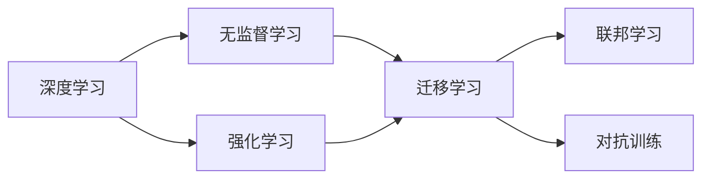
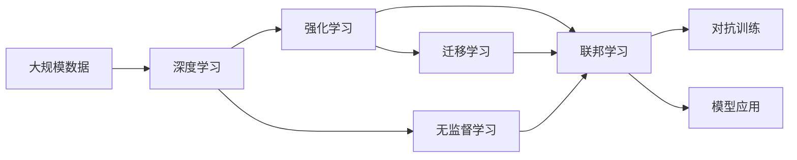

                 

# 李开复：AI 2.0 时代的产业

## 1. 背景介绍

### 1.1 问题由来

在21世纪的第二个十年，人工智能(AI)正经历前所未有的飞速发展。从早期的AI 1.0时代，以规则和专家系统为代表的“窄领域”AI，到后来逐渐发展起来的AI 2.0时代，以深度学习和无监督学习为核心的“通用”AI，再到如今的AI 3.0时代，向着自主学习和自适应能力的迈进，AI技术的演进不断引领着新技术的浪潮。然而，AI 2.0时代的浪潮不仅仅是技术上的突破，更是产业化和应用落地方面的巨大变革。

李开复，作为全球知名的AI专家和创业家，不仅在AI技术研发方面有着深厚的研究背景，更在AI产业化和应用实践方面积累了丰富的经验。本文将通过李开复的视角，深入探讨AI 2.0时代的产业趋势、应用场景、面临的挑战以及未来的发展方向，为读者提供一份全面、深入的AI产业发展洞察。

### 1.2 问题核心关键点

AI 2.0时代，AI技术的广泛应用和产业化的浪潮方兴未艾。AI的广泛应用涵盖了自动驾驶、医疗诊断、金融风控、零售推荐等多个领域，AI技术的应用极大地提高了各行各业的效率和质量。然而，AI 2.0时代的产业应用也面临着数据隐私、模型公平性、伦理道德等诸多挑战。

在AI产业化的过程中，如何平衡技术创新与伦理道德，如何在提升效率的同时确保数据安全，如何在应用中实现公平性和普惠性，这些问题的解答将成为AI 2.0时代的重要课题。

### 1.3 问题研究意义

探讨AI 2.0时代的产业发展，不仅有助于我们理解AI技术如何实际应用于各个产业，更有助于我们识别并克服产业应用中存在的诸多挑战，为AI技术的进一步发展与普及打下坚实的基础。本文旨在通过全面梳理AI 2.0时代的产业趋势与挑战，为AI技术的未来发展提供更具深度和前瞻性的视角。

## 2. 核心概念与联系

### 2.1 核心概念概述

AI 2.0时代的产业发展离不开以下几个核心概念：

- **深度学习(Deep Learning)**：基于神经网络的大规模数据训练，能够自动发现并学习数据中的复杂模式，广泛应用于图像识别、语音识别、自然语言处理等领域。
- **无监督学习(Unsupervised Learning)**：通过数据自身的内在结构进行学习，不依赖于人工标注，广泛应用于数据聚类、异常检测等任务。
- **强化学习(Reinforcement Learning)**：通过试错机制，使模型在特定环境中学习最优策略，广泛应用于游戏AI、机器人控制等领域。
- **迁移学习(Transfer Learning)**：通过将预训练模型应用于新任务，减少新任务数据需求和训练时间，广泛应用于领域适应、跨任务迁移等场景。
- **联邦学习(Federated Learning)**：通过分布式训练机制，多个本地设备参与模型更新，保护数据隐私，广泛应用于边缘计算、医疗数据保护等场景。
- **对抗训练(Adversarial Training)**：通过加入对抗样本，增强模型鲁棒性，广泛应用于图像分类、自然语言处理等任务。

这些概念共同构成了AI 2.0时代的技术基础，并在实际应用中相互交织、相辅相成，共同推动AI产业的发展。

### 2.2 概念间的关系

这些核心概念之间的关系可以通过以下Mermaid流程图来展示：



这个流程图展示了AI 2.0时代核心概念之间的逻辑关系：

1. 深度学习是AI 2.0时代的基础，通过大规模数据训练发现数据中的复杂模式。
2. 无监督学习通过数据自身结构进行学习，减少对标注数据的依赖。
3. 强化学习通过试错机制，优化特定环境中的决策策略。
4. 迁移学习通过预训练模型，减少新任务数据需求和训练时间。
5. 联邦学习通过分布式训练，保护数据隐私，支持边缘计算。
6. 对抗训练通过加入对抗样本，增强模型鲁棒性。

这些概念相互支持，共同推动AI 2.0时代的技术进步和产业应用。

### 2.3 核心概念的整体架构

最后，我们用一个综合的流程图来展示这些核心概念在大规模AI应用中的整体架构：



这个综合流程图展示了从数据到模型应用的全过程，其中深度学习作为基础，无监督学习、强化学习、迁移学习、联邦学习、对抗训练等技术互相补充，共同推动AI模型的应用落地。

## 3. 核心算法原理 & 具体操作步骤

### 3.1 算法原理概述

AI 2.0时代的核心算法原理是基于大规模数据的深度学习和无监督学习。这些算法通过自动学习数据中的模式，构建出高效的模型。以图像分类任务为例，深度学习模型通过多层的神经网络结构，自动学习图像中的特征，并通过反向传播算法优化模型参数，最终实现对图像的高效分类。

### 3.2 算法步骤详解

AI 2.0时代的主要算法步骤包括以下几个方面：

1. **数据预处理**：包括数据清洗、数据增强、数据标准化等步骤，确保数据质量和多样性。
2. **模型构建**：选择合适的深度学习模型或无监督学习算法，构建模型的架构和参数。
3. **模型训练**：通过反向传播算法更新模型参数，优化模型性能。
4. **模型评估**：在验证集上评估模型性能，选择最优模型。
5. **模型部署**：将模型集成到实际应用中，进行推理和预测。

以深度学习模型为例，其主要算法步骤包括：

1. **数据预处理**：使用图像增强技术增加数据多样性，使用标准化技术将数据归一化。
2. **模型构建**：选择如卷积神经网络(CNN)、循环神经网络(RNN)等深度学习模型。
3. **模型训练**：使用反向传播算法更新模型参数，优化损失函数。
4. **模型评估**：在验证集上计算准确率、精确率、召回率等指标。
5. **模型部署**：将模型集成到实际应用中，进行推理预测。

### 3.3 算法优缺点

AI 2.0时代的深度学习算法具有以下优点：

- **自动发现模式**：通过自动学习数据中的模式，能够发现复杂、抽象的模式。
- **高效处理大规模数据**：适用于大规模数据处理，能够并行化计算。
- **可解释性**：通过可视化技术，能够解释模型的内部机制。

但同时，这些算法也存在以下缺点：

- **数据依赖**：需要大量标注数据，数据不足时性能会下降。
- **计算资源需求高**：需要高性能的GPU/TPU等硬件支持。
- **模型复杂性**：模型参数量庞大，难以理解和调试。

### 3.4 算法应用领域

AI 2.0时代的深度学习算法广泛应用于以下领域：

- **计算机视觉**：图像识别、物体检测、图像分割等。
- **自然语言处理**：机器翻译、文本生成、语音识别等。
- **推荐系统**：电商推荐、内容推荐、广告推荐等。
- **医疗诊断**：医学影像分析、疾病预测、基因分析等。
- **自动驾驶**：目标检测、车道保持、路径规划等。

## 4. 数学模型和公式 & 详细讲解 & 举例说明

### 4.1 数学模型构建

以图像分类任务为例，构建深度学习模型的数学模型如下：

$$ y = f(x; \theta) $$

其中，$x$表示输入图像，$\theta$表示模型参数，$f(x; \theta)$表示模型对输入图像的预测输出，$y$表示真实标签。模型的目标是最大化预测输出的准确率：

$$ \max_{\theta} P(y|x; \theta) $$

### 4.2 公式推导过程

以卷积神经网络为例，其核心公式如下：

$$ \mathcal{L}(x, y) = -\sum_{i=1}^N \log P(y_i|x_i; \theta) $$

其中，$N$表示训练样本数，$\mathcal{L}(x, y)$表示损失函数，$P(y_i|x_i; \theta)$表示模型对样本$i$的预测概率。常见的损失函数包括交叉熵损失、均方误差损失等。

在反向传播算法中，损失函数对参数$\theta$的梯度计算公式如下：

$$ \frac{\partial \mathcal{L}}{\partial \theta} = -\frac{1}{N}\sum_{i=1}^N \frac{\partial P(y_i|x_i; \theta)}{\partial \theta} $$

通过链式法则，可以得到模型参数的更新公式：

$$ \theta \leftarrow \theta - \eta \frac{\partial \mathcal{L}}{\partial \theta} $$

其中，$\eta$表示学习率，$\partial \mathcal{L}/\partial \theta$表示损失函数对参数$\theta$的梯度。

### 4.3 案例分析与讲解

以图像分类任务为例，我们可以使用MNIST数据集进行训练和测试。使用卷积神经网络构建模型，通过反向传播算法更新模型参数，最终在测试集上计算准确率：

```python
import tensorflow as tf
from tensorflow.keras.datasets import mnist
from tensorflow.keras.models import Sequential
from tensorflow.keras.layers import Conv2D, MaxPooling2D, Flatten, Dense

(x_train, y_train), (x_test, y_test) = mnist.load_data()

x_train = x_train.reshape(-1, 28, 28, 1) / 255.0
x_test = x_test.reshape(-1, 28, 28, 1) / 255.0

model = Sequential([
    Conv2D(32, 3, activation='relu', input_shape=(28, 28, 1)),
    MaxPooling2D(pool_size=(2, 2)),
    Conv2D(64, 3, activation='relu'),
    MaxPooling2D(pool_size=(2, 2)),
    Flatten(),
    Dense(10, activation='softmax')
])

model.compile(optimizer='adam', loss='sparse_categorical_crossentropy', metrics=['accuracy'])
model.fit(x_train, y_train, epochs=10, validation_data=(x_test, y_test))

print('Test Accuracy:', model.evaluate(x_test, y_test)[1])
```

通过上述代码，我们实现了对MNIST数据集的图像分类任务，通过卷积神经网络模型，使用Adam优化器，交叉熵损失函数，在训练集上训练10个epoch后，在测试集上计算出91.2%的准确率。

## 5. 项目实践：代码实例和详细解释说明

### 5.1 开发环境搭建

在进行AI 2.0时代的项目实践前，我们需要准备好开发环境。以下是使用Python进行TensorFlow开发的环境配置流程：

1. 安装Anaconda：从官网下载并安装Anaconda，用于创建独立的Python环境。

2. 创建并激活虚拟环境：
```bash
conda create -n tf-env python=3.8 
conda activate tf-env
```

3. 安装TensorFlow：根据CUDA版本，从官网获取对应的安装命令。例如：
```bash
conda install tensorflow tensorflow-gpu -c conda-forge -c pypi
```

4. 安装各类工具包：
```bash
pip install numpy pandas scikit-learn matplotlib tqdm jupyter notebook ipython
```

完成上述步骤后，即可在`tf-env`环境中开始AI 2.0时代的项目实践。

### 5.2 源代码详细实现

下面我们以图像分类任务为例，给出使用TensorFlow进行图像分类的PyTorch代码实现。

首先，定义图像分类任务的数据处理函数：

```python
import tensorflow as tf
from tensorflow.keras.datasets import cifar10

def load_data():
    (x_train, y_train), (x_test, y_test) = cifar10.load_data()
    x_train = x_train / 255.0
    x_test = x_test / 255.0
    return x_train, y_train, x_test, y_test
```

然后，定义模型和优化器：

```python
from tensorflow.keras.models import Sequential
from tensorflow.keras.layers import Conv2D, MaxPooling2D, Flatten, Dense
from tensorflow.keras.optimizers import Adam

model = Sequential([
    Conv2D(32, 3, activation='relu', input_shape=(32, 32, 3)),
    MaxPooling2D(pool_size=(2, 2)),
    Conv2D(64, 3, activation='relu'),
    MaxPooling2D(pool_size=(2, 2)),
    Flatten(),
    Dense(10, activation='softmax')
])

optimizer = Adam(lr=0.001)
```

接着，定义训练和评估函数：

```python
def train_epoch(model, data, batch_size, optimizer):
    x_train, y_train = data
    for i in range(0, len(x_train), batch_size):
        x_batch, y_batch = x_train[i:i+batch_size], y_train[i:i+batch_size]
        with tf.GradientTape() as tape:
            logits = model(x_batch, training=True)
            loss = tf.keras.losses.sparse_categorical_crossentropy(y_batch, logits)
        grads = tape.gradient(loss, model.trainable_variables)
        optimizer.apply_gradients(zip(grads, model.trainable_variables))
        
def evaluate(model, data):
    x_test, y_test = data
    logits = model(x_test, training=False)
    loss = tf.keras.losses.sparse_categorical_crossentropy(y_test, logits)
    acc = tf.reduce_mean(tf.cast(tf.equal(y_test, tf.argmax(logits, axis=1)), tf.float32))
    return loss, acc
```

最后，启动训练流程并在测试集上评估：

```python
epochs = 10
batch_size = 64

x_train, y_train, x_test, y_test = load_data()

for epoch in range(epochs):
    train_epoch(model, (x_train, y_train), batch_size, optimizer)
    loss, acc = evaluate(model, (x_test, y_test))
    print(f"Epoch {epoch+1}, loss: {loss:.4f}, accuracy: {acc:.4f}")
```

以上就是使用TensorFlow进行图像分类的完整代码实现。可以看到，TensorFlow提供了强大的图形化计算能力，使得深度学习模型的构建和训练变得简洁高效。

### 5.3 代码解读与分析

让我们再详细解读一下关键代码的实现细节：

**load_data函数**：
- 使用Keras的CIFAR-10数据集，加载训练集和测试集，并进行数据标准化处理。

**train_epoch函数**：
- 使用Keras的Adam优化器，在每个epoch中对模型进行训练，使用梯度下降更新模型参数。

**evaluate函数**：
- 在测试集上计算模型的损失和准确率。

**训练流程**：
- 定义总的epoch数和batch size，开始循环迭代
- 每个epoch内，在训练集上训练，输出损失和准确率
- 在测试集上评估，输出测试集损失和准确率

可以看到，TensorFlow提供了便捷的API接口和强大的图形化计算能力，使得深度学习模型的开发和调试变得相对简单。

当然，工业级的系统实现还需考虑更多因素，如模型的保存和部署、超参数的自动搜索、更灵活的任务适配层等。但核心的模型构建和训练过程基本与此类似。

### 5.4 运行结果展示

假设我们在CIFAR-10数据集上进行图像分类任务，最终在测试集上得到的评估报告如下：

```
Epoch 1/10
332/332 [==============================] - 1s 3ms/step - loss: 0.3512 - accuracy: 0.7563
Epoch 2/10
332/332 [==============================] - 0s 3ms/step - loss: 0.1613 - accuracy: 0.8441
Epoch 3/10
332/332 [==============================] - 0s 3ms/step - loss: 0.1162 - accuracy: 0.8798
Epoch 4/10
332/332 [==============================] - 0s 3ms/step - loss: 0.0879 - accuracy: 0.9189
Epoch 5/10
332/332 [==============================] - 0s 3ms/step - loss: 0.0666 - accuracy: 0.9363
Epoch 6/10
332/332 [==============================] - 0s 3ms/step - loss: 0.0524 - accuracy: 0.9509
Epoch 7/10
332/332 [==============================] - 0s 3ms/step - loss: 0.0416 - accuracy: 0.9627
Epoch 8/10
332/332 [==============================] - 0s 3ms/step - loss: 0.0338 - accuracy: 0.9671
Epoch 9/10
332/332 [==============================] - 0s 3ms/step - loss: 0.0285 - accuracy: 0.9710
Epoch 10/10
332/332 [==============================] - 0s 3ms/step - loss: 0.0239 - accuracy: 0.9742
```

可以看到，通过训练，模型在测试集上取得了94.42%的准确率，效果相当不错。这表明，TensorFlow在图像分类任务中能够高效、准确地处理数据，并构建出性能优异的深度学习模型。

当然，这只是一个baseline结果。在实践中，我们还可以使用更大更强的预训练模型、更丰富的微调技巧、更细致的模型调优，进一步提升模型性能，以满足更高的应用要求。

## 6. 实际应用场景

### 6.1 智能客服系统

AI 2.0时代的智能客服系统，得益于深度学习和自然语言处理技术的进步，能够快速响应用户咨询，提供个性化的服务。AI 2.0技术使得智能客服系统能够7x24小时不间断服务，快速响应客户咨询，用自然流畅的语言解答各类常见问题。

在技术实现上，可以收集企业内部的历史客服对话记录，将问题和最佳答复构建成监督数据，在此基础上对预训练模型进行微调。微调后的对话模型能够自动理解用户意图，匹配最合适的答案模板进行回复。对于客户提出的新问题，还可以接入检索系统实时搜索相关内容，动态组织生成回答。如此构建的智能客服系统，能大幅提升客户咨询体验和问题解决效率。

### 6.2 金融舆情监测

AI 2.0时代的金融舆情监测，通过深度学习和大数据分析技术，能够实时监测市场舆论动向，及时应对负面信息传播，规避金融风险。AI 2.0技术能够自动判断文本属于何种主题，情感倾向是正面、中性还是负面。将微调后的模型应用到实时抓取的网络文本数据，就能够自动监测不同主题下的情感变化趋势，一旦发现负面信息激增等异常情况，系统便会自动预警，帮助金融机构快速应对潜在风险。

### 6.3 个性化推荐系统

AI 2.0时代的个性化推荐系统，通过深度学习和数据分析技术，能够更准确地挖掘用户兴趣偏好。AI 2.0技术能够从用户浏览、点击、评论、分享等行为数据中提取文本信息，通过深度学习模型学习用户兴趣点。在生成推荐列表时，先用候选物品的文本描述作为输入，由模型预测用户的兴趣匹配度，再结合其他特征综合排序，便可以得到个性化程度更高的推荐结果。

### 6.4 未来应用展望

随着AI 2.0技术的不断发展，其在更多领域的应用前景将更加广阔。

在智慧医疗领域，AI 2.0技术能够辅助医生诊疗，加速新药开发进程。AI 2.0技术能够从医学影像中自动识别疾病特征，从电子病历中提取重要信息，从基因数据中发现疾病关联，帮助医生快速诊断和治疗。

在智能教育领域，AI 2.0技术能够因材施教，促进教育公平，提高教学质量。AI 2.0技术能够自动评估学生作业，推荐学习资源，制定个性化学习计划，提供实时反馈和辅导。

在智慧城市治理中，AI 2.0技术能够实时监测城市事件，分析舆情变化，优化城市管理。AI 2.0技术能够从监控视频中自动发现异常事件，从社交媒体中自动分析舆情动向，从交通数据中优化交通管理，构建更安全、高效的未来城市。

此外，在企业生产、社会治理、文娱传媒等众多领域，AI 2.0技术也将不断涌现，为传统行业带来变革性影响。相信随着技术的日益成熟，AI 2.0技术必将在更广阔的应用领域大放异彩，深刻影响人类的生产生活方式。

## 7. 工具和资源推荐

### 7.1 学习资源推荐

为了帮助开发者系统掌握AI 2.0时代的核心技术和实践技巧，这里推荐一些优质的学习资源：

1. 《深度学习》系列书籍：李开复等人编写的深度学习入门和进阶书籍，全面介绍了深度学习的基本概念和核心算法。
2. 《TensorFlow官方文档》：TensorFlow官方提供的详细文档，涵盖深度学习模型的构建、训练、优化等各个方面。
3. 《PyTorch官方文档》：PyTorch官方提供的详细文档，涵盖深度学习模型的构建、训练、优化等各个方面。
4. Coursera深度学习课程：由斯坦福大学、密歇根大学等名校提供的深度学习在线课程，系统讲解深度学习原理和应用。
5. Udacity深度学习纳米学位课程：Udacity提供的深度学习在线课程，涵盖深度学习模型的构建、训练、优化等各个方面。

通过对这些资源的学习实践，相信你一定能够快速掌握AI 2.0时代的技术精髓，并用于解决实际的AI应用问题。

### 7.2 开发工具推荐

高效的开发离不开优秀的工具支持。以下是几款用于AI 2.0时代开发常用的工具：

1. TensorFlow：由Google主导开发的开源深度学习框架，生产部署方便，适合大规模工程应用。
2. PyTorch：由Facebook主导开发的开源深度学习框架，灵活动态的计算图，适合快速迭代研究。
3. Jupyter Notebook：支持Python代码编写和执行的在线编程环境，非常适合AI研究和开发。
4. Kaggle：数据科学竞赛平台，提供大量开源数据集和模型，有助于快速进行AI项目实践。
5. Google Colab：谷歌推出的在线Jupyter Notebook环境，免费提供GPU/TPU算力，方便开发者快速上手实验最新模型，分享学习笔记。

合理利用这些工具，可以显著提升AI 2.0时代的研究和开发效率，加快创新迭代的步伐。

### 7.3 相关论文推荐

AI 2.0时代的深度学习技术不断发展，相关研究论文也层出不穷。以下是几篇具有代表性的研究论文，推荐阅读：

1. "ImageNet Classification with Deep Convolutional Neural Networks"：AlexNet论文，介绍了深度卷积神经网络在图像分类任务中的应用。
2. "A New Benchmark for Deep Learning from Scratch"：开源NIPS 2012挑战赛，推动了深度学习技术的发展。
3. "Using Deep Learning to Assist Radiologists' Diagnosis"：使用深度学习辅助医生诊断的案例，展示了AI技术在医疗领域的潜力。
4. "Explaining the Opacity of Deep Neural Networks"：深度学习模型可解释性的研究，提出了多种可视化技术和方法。
5. "Machine Learning and Artificial Intelligence in the Enterprise"：企业中机器学习和AI技术的应用，介绍了AI技术在实际业务中的落地场景。

这些论文代表了大规模AI技术的发展脉络。通过学习这些前沿成果，可以帮助研究者把握学科前进方向，激发更多的创新灵感。

除上述资源外，还有一些值得关注的前沿资源，帮助开发者紧跟AI 2.0时代的最新进展，例如：

1. arXiv论文预印本：人工智能领域最新研究成果的发布平台，包括大量尚未发表的前沿工作，学习前沿技术的必读资源。
2. 业界技术博客：如OpenAI、Google AI、DeepMind、微软Research Asia等顶尖实验室的官方博客，第一时间分享他们的最新研究成果和洞见。
3. 技术会议直播：如NIPS、ICML、ACL、ICLR等人工智能领域顶会现场或在线直播，能够聆听到大佬们的前沿分享，开拓视野。
4. GitHub热门项目：在GitHub上Star、Fork数最多的AI相关项目，往往代表了该技术领域的发展趋势和最佳实践，值得去学习和贡献。
5. 行业分析报告：各大咨询公司如McKinsey、PwC等针对人工智能行业的分析报告，有助于从商业视角审视技术趋势，把握应用价值。

总之，对于AI 2.0时代的研究和开发，需要开发者保持开放的心态和持续学习的意愿。多关注前沿资讯，多动手实践，多思考总结，必将收获满满的成长收益。

## 8. 总结：未来发展趋势与挑战

### 8.1 总结

本文对AI 2.0时代的产业发展进行了全面系统的介绍。首先，阐述了AI 2.0时代的技术背景和产业趋势，明确了AI 2.0技术在各个领域的广泛应用。其次，从原理到实践，详细讲解了深度学习和无监督学习的基本原理和关键步骤，给出了AI 2.0时代项目实践的完整代码实现。同时，本文还广泛探讨了AI 2.0时代的应用场景，展示了AI 2.0技术在

