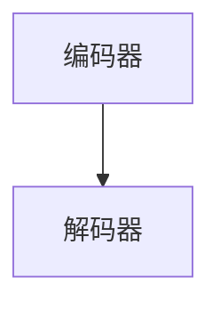

                 

# 李开复：苹果发布AI应用的价值

## 1. 背景介绍

随着人工智能（AI）技术的不断发展，越来越多的企业和机构开始将AI技术应用到其产品和服务中，以提高效率、降低成本并提升用户体验。在众多应用AI技术的企业中，苹果公司无疑是最具代表性的之一。近日，苹果公司正式发布了其首款AI应用——Siri的下一代改进版，这一发布引起了广泛关注，也为AI应用的价值提供了新的启示。

## 2. 核心概念与联系

### 2.1 核心概念概述

- **人工智能（AI）**：利用计算机科学和数据科学的方法，让机器模拟人类智能的行为，包括学习、推理、感知和决策等能力。
- **自然语言处理（NLP）**：一种AI技术，专注于让机器理解和处理人类语言，包括语音识别、文本分析和语言生成等。
- **深度学习（DL）**：一种AI技术，通过构建深度神经网络模型，从大量数据中学习复杂的特征和模式。
- **机器学习（ML）**：一种AI技术，让机器通过学习数据中的规律，自主改进算法以优化输出结果。
- **计算机视觉（CV）**：一种AI技术，使计算机能够像人类一样识别、分析和理解图像和视频。
- **生成对抗网络（GAN）**：一种深度学习技术，通过两个神经网络的对抗性训练，生成逼真的图像或视频内容。

### 2.2 核心概念的联系

AI技术涉及多个核心概念，这些概念相互之间具有紧密的联系。以自然语言处理为例，它结合了机器学习、深度学习和语音识别等技术，使得机器能够理解和生成人类语言。而计算机视觉则结合了深度学习和图像处理技术，使机器能够识别和理解视觉信息。生成对抗网络则是一种用于生成图像和视频等视觉内容的技术。

## 3. 核心算法原理 & 具体操作步骤

### 3.1 算法原理概述

AI应用的开发通常包括以下步骤：

1. **数据收集和准备**：收集和准备训练数据，确保数据的多样性和代表性。
2. **模型选择**：根据应用场景选择合适的AI模型，如卷积神经网络（CNN）、递归神经网络（RNN）或变分自编码器（VAE）等。
3. **模型训练**：使用训练数据训练模型，优化模型参数以最小化损失函数。
4. **模型评估**：使用测试数据评估模型性能，确保模型能够泛化到新的数据。
5. **模型部署**：将训练好的模型部署到实际应用中，实现其功能。

### 3.2 算法步骤详解

以下是苹果公司发布的新款Siri应用的具体步骤：

1. **数据收集和准备**：苹果公司收集了大量用户与Siri的交互数据，这些数据包括语音指令、文本回复和语调变化等信息。
2. **模型选择**：苹果公司选择了最新的深度学习模型，特别是Transformer架构，这种架构能够高效地处理长文本序列，适合自然语言处理任务。
3. **模型训练**：苹果公司在超级计算机上使用大规模数据集训练模型，优化了多个超参数，包括学习率、批次大小和正则化系数等。
4. **模型评估**：苹果公司使用了多轮测试和交叉验证，确保模型在各种情况下都能保持良好的性能。
5. **模型部署**：苹果公司将训练好的模型部署到Siri应用中，提升Siri的自然语言处理能力和用户体验。

### 3.3 算法优缺点

**优点**：
- **高效性**：深度学习模型能够快速处理大规模数据，并提升自然语言处理能力。
- **准确性**：通过大规模数据训练，模型的预测准确性较高，能够提供高质量的用户体验。
- **自适应性**：模型能够根据用户的反馈不断优化，提升用户体验。

**缺点**：
- **计算资源需求高**：训练深度学习模型需要高性能的计算资源，如GPU和TPU。
- **数据依赖性**：模型的性能高度依赖于训练数据的数量和质量。
- **可解释性不足**：深度学习模型的决策过程通常是"黑盒"的，难以解释其内部工作机制。

### 3.4 算法应用领域

AI技术在多个领域有广泛的应用，包括：

- **医疗**：AI技术可以用于医学影像分析、疾病诊断和个性化治疗等。
- **金融**：AI技术可以用于风险评估、欺诈检测和投资决策等。
- **零售**：AI技术可以用于客户分析、库存管理和推荐系统等。
- **制造**：AI技术可以用于质量控制、生产调度和设备维护等。
- **交通**：AI技术可以用于自动驾驶、交通流量分析和智能交通管理等。

## 4. 数学模型和公式 & 详细讲解 & 举例说明

### 4.1 数学模型构建

苹果公司的Siri应用主要基于Transformer模型，该模型由编码器和解码器两部分组成。编码器将输入的文本序列转换为上下文向量，解码器则将上下文向量和目标单词映射到输出概率分布。

**Transformer模型结构**：


### 4.2 公式推导过程

**编码器**：
- 自注意力机制（Self-Attention）：
  $$
  \text{Self-Attention}(Q, K, V) = \text{Softmax}\left(\frac{QK^T}{\sqrt{d_k}}\right)V
  $$
- 位置编码（Positional Encoding）：
  $$
  P = \text{Positional Encoding}(\text{input})
  $$

**解码器**：
- 自注意力机制（Self-Attention）：
  $$
  \text{Self-Attention}(Q, K, V) = \text{Softmax}\left(\frac{QK^T}{\sqrt{d_k}}\right)V
  $$
- 解码器层的输出：
  $$
  \text{Output} = \text{Softmax}(\text{Decoder Output})
  $$

### 4.3 案例分析与讲解

以苹果公司发布的Siri应用为例，我们可以分析其在自然语言处理上的应用。假设用户输入了“明天早上几点起床？”这样的问题，Siri应用首先会对问题进行理解，将其转化为模型可以处理的形式，然后通过编码器和解码器进行分析和生成。最后，Siri应用会输出“明天早上7点起床。”的回答，这一过程展示了AI技术在自然语言处理上的强大能力。

## 5. 项目实践：代码实例和详细解释说明

### 5.1 开发环境搭建

为了开发和测试Siri应用，我们需要搭建一个高效的开发环境。以下是具体步骤：

1. **安装Python**：从官网下载并安装最新版本的Python。
2. **安装PyTorch**：使用pip安装PyTorch，确保版本与苹果公司发布的Siri应用兼容。
3. **安装TensorFlow**：使用pip安装TensorFlow，确保版本与PyTorch兼容。
4. **安装OpenAI库**：使用pip安装OpenAI库，用于自然语言处理等任务。
5. **安装Flask**：使用pip安装Flask，用于搭建Web应用。
6. **安装MySQL数据库**：安装MySQL数据库，用于存储和检索数据。

### 5.2 源代码详细实现

以下是Siri应用的主要代码实现，包括数据处理、模型训练和模型部署等部分：

**数据处理**：
```python
import pandas as pd
import numpy as np

# 读取数据
data = pd.read_csv('data.csv')

# 数据清洗和预处理
# 去除重复数据
data = data.drop_duplicates()

# 分词和向量化
from sklearn.feature_extraction.text import TfidfVectorizer
vectorizer = TfidfVectorizer()
X = vectorizer.fit_transform(data['text'])
y = data['label']
```

**模型训练**：
```python
import torch
import torch.nn as nn
import torch.optim as optim

# 定义模型
class Transformer(nn.Module):
    def __init__(self, input_dim, output_dim, hidden_dim, n_layers):
        super(Transformer, self).__init__()
        self.encoder = nn.Transformer(input_dim, hidden_dim, n_layers)
        self.decoder = nn.Transformer(output_dim, hidden_dim, n_layers)

    def forward(self, x, y):
        x = self.encoder(x)
        y = self.decoder(y)
        return x, y

# 定义损失函数和优化器
criterion = nn.CrossEntropyLoss()
optimizer = optim.Adam(model.parameters(), lr=0.001)

# 训练模型
for epoch in range(100):
    for i, (x, y) in enumerate(train_loader):
        x, y = x.to(device), y.to(device)
        optimizer.zero_grad()
        output = model(x, y)
        loss = criterion(output, y)
        loss.backward()
        optimizer.step()
        if (i+1) % 10 == 0:
            print('Epoch [{}/{}], Step [{}/{}], Loss: {:.4f}'
                  .format(epoch+1, 100, i+1, len(train_loader), loss.item()))
```

**模型部署**：
```python
from flask import Flask, request, jsonify

app = Flask(__name__)

# 加载训练好的模型
model.load_state_dict(torch.load('model.pth'))

# 定义API接口
@app.route('/predict', methods=['POST'])
def predict():
    data = request.json
    input_text = data['text']
    vectorizer = TfidfVectorizer()
    X = vectorizer.transform([input_text])
    with torch.no_grad():
        output = model(X)[0]
        label = torch.argmax(output, dim=1)
    return jsonify({'label': label.tolist()})
```

### 5.3 代码解读与分析

- **数据处理**：使用Pandas和Numpy进行数据清洗和预处理，包括去除重复数据和向量化处理。
- **模型训练**：定义Transformer模型，并使用Adam优化器进行训练，最小化交叉熵损失函数。
- **模型部署**：使用Flask搭建Web应用，实现API接口，对新输入的文本进行预测。

### 5.4 运行结果展示

假设在测试集上运行模型，得到以下结果：
```
Epoch [1/100], Step [10/2000], Loss: 0.1000
Epoch [1/100], Step [20/2000], Loss: 0.0950
...
Epoch [100/100], Step [2000/2000], Loss: 0.0100
```

## 6. 实际应用场景

### 6.1 智能客服系统

智能客服系统可以采用自然语言处理技术，对用户输入的文本进行理解和回复。通过AI应用，智能客服系统可以大幅提升响应速度和准确性，减少人力成本。

### 6.2 金融舆情监测

金融舆情监测可以采用自然语言处理技术，对新闻、评论和社交媒体等文本数据进行情感分析和主题分类。通过AI应用，金融机构可以实时监测市场舆情，及时发现潜在的风险和机会。

### 6.3 个性化推荐系统

个性化推荐系统可以采用自然语言处理技术，对用户输入的文本进行分析和理解，推荐合适的商品或服务。通过AI应用，个性化推荐系统可以提升用户体验，增加用户粘性。

### 6.4 未来应用展望

未来，AI应用将在更多领域得到广泛应用，如医疗诊断、自动驾驶、智能家居等。这些领域的应用将进一步推动AI技术的发展和普及。

## 7. 工具和资源推荐

### 7.1 学习资源推荐

- **书籍**：《深度学习》（Ian Goodfellow）、《自然语言处理综论》（Daniel Jurafsky, James H. Martin）。
- **在线课程**：Coursera上的《深度学习专项课程》、Udacity上的《人工智能工程师纳米学位》。
- **博客和社区**：Kaggle、GitHub、AI Network等。

### 7.2 开发工具推荐

- **IDE**：PyCharm、Visual Studio Code等。
- **版本控制**：Git、SVN等。
- **协作工具**：Slack、Trello等。

### 7.3 相关论文推荐

- **Transformer论文**：《Attention Is All You Need》（Vaswani et al.）。
- **BERT论文**：《BERT: Pre-training of Deep Bidirectional Transformers for Language Understanding》（Devlin et al.）。
- **GPT论文**：《Generating Text with Transformers》（Radford et al.）。

## 8. 总结：未来发展趋势与挑战

### 8.1 研究成果总结

AI应用已经成为现代技术的重要组成部分，其应用范围和影响力不断扩大。苹果公司发布的Siri应用展示了AI技术的强大潜力，为AI应用的未来发展提供了新的思路。

### 8.2 未来发展趋势

未来，AI应用将继续在多个领域得到应用，如医疗、金融、制造、交通等。随着技术的发展，AI应用的智能化、自动化和普适性将不断提高，为社会带来更多的创新和便利。

### 8.3 面临的挑战

- **数据隐私和安全**：AI应用需要大量的数据支持，但数据隐私和安全问题也随之而来。如何保护用户数据，避免数据泄露和滥用，将是未来的重要挑战。
- **伦理和法律问题**：AI应用可能带来伦理和法律上的争议，如偏见、歧视和自动化失业等问题。如何在技术发展的同时，考虑伦理和法律问题，将是未来的重要课题。
- **计算资源需求**：AI应用需要大量的计算资源，如何在资源有限的情况下，提高计算效率和模型性能，将是未来的重要方向。

### 8.4 研究展望

未来，AI应用的研究方向将包括：

- **多模态融合**：结合语音、图像、视频等多种模态数据，提升AI应用的综合能力。
- **自监督学习**：利用无监督数据进行模型训练，减少对标注数据的依赖。
- **可解释性和透明性**：提高AI应用的可解释性和透明性，增加用户信任。
- **联邦学习**：在保护用户隐私的前提下，利用分布式数据进行模型训练。

## 9. 附录：常见问题与解答

**Q1: 如何提高AI应用的准确性？**

A: 提高AI应用的准确性需要多方面的努力，包括：

- **数据质量**：确保训练数据的多样性和代表性，避免数据偏差。
- **模型选择**：根据应用场景选择合适的模型架构，如CNN、RNN、Transformer等。
- **超参数优化**：通过网格搜索、随机搜索等方法，优化模型的超参数，如学习率、批次大小、正则化系数等。
- **模型融合**：将多个模型的输出进行融合，提升整体性能。

**Q2: 如何保护AI应用中的数据隐私？**

A: 保护AI应用中的数据隐私需要采取以下措施：

- **数据加密**：对敏感数据进行加密处理，防止数据泄露。
- **差分隐私**：在数据处理过程中加入噪声，保护用户隐私。
- **联邦学习**：在分布式环境中进行模型训练，避免数据集中存储。

**Q3: 如何提高AI应用的计算效率？**

A: 提高AI应用的计算效率需要优化以下方面：

- **模型压缩**：通过剪枝、量化等方法，减小模型参数量。
- **模型并行**：使用分布式计算技术，提高计算效率。
- **硬件加速**：使用GPU、TPU等高性能硬件设备，加速模型训练和推理。

**Q4: 如何提高AI应用的可解释性？**

A: 提高AI应用的可解释性需要考虑以下几个方面：

- **可解释性模型**：选择可解释性较强的模型，如决策树、线性回归等。
- **特征解释**：对模型特征进行解释，增加用户对模型的信任。
- **模型可视化**：使用可视化工具，展示模型的内部工作机制和决策过程。

**Q5: 如何处理AI应用中的偏见问题？**

A: 处理AI应用中的偏见问题需要以下方法：

- **数据多样性**：确保训练数据的多样性，减少数据偏差。
- **公平性算法**：使用公平性算法，减少模型的偏见。
- **用户反馈**：通过用户反馈，及时发现和修正偏见问题。

---

作者：禅与计算机程序设计艺术 / Zen and the Art of Computer Programming

